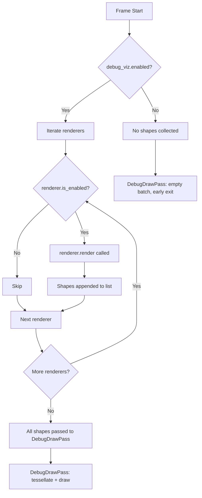
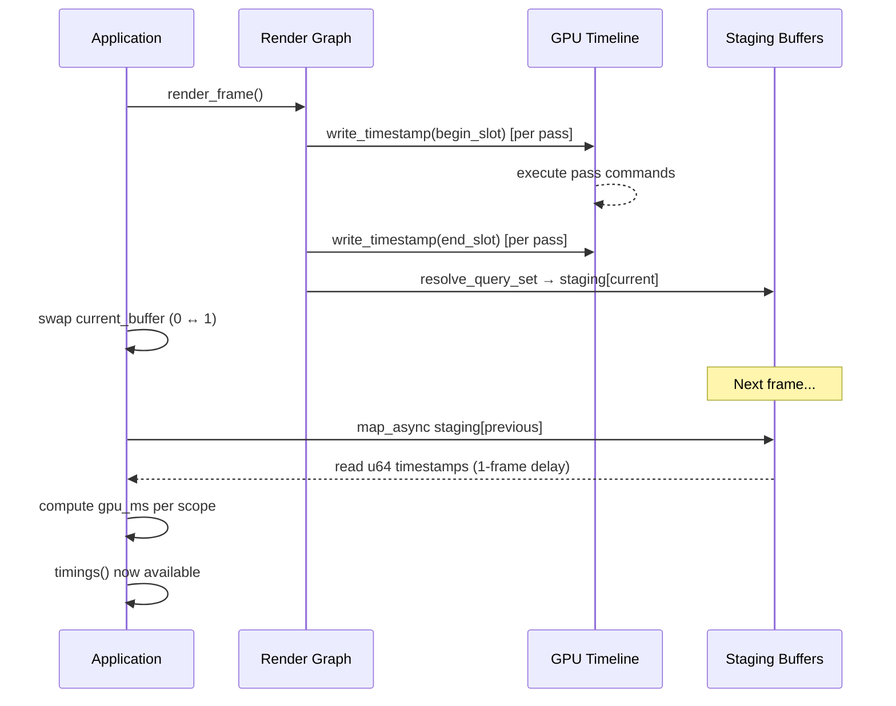
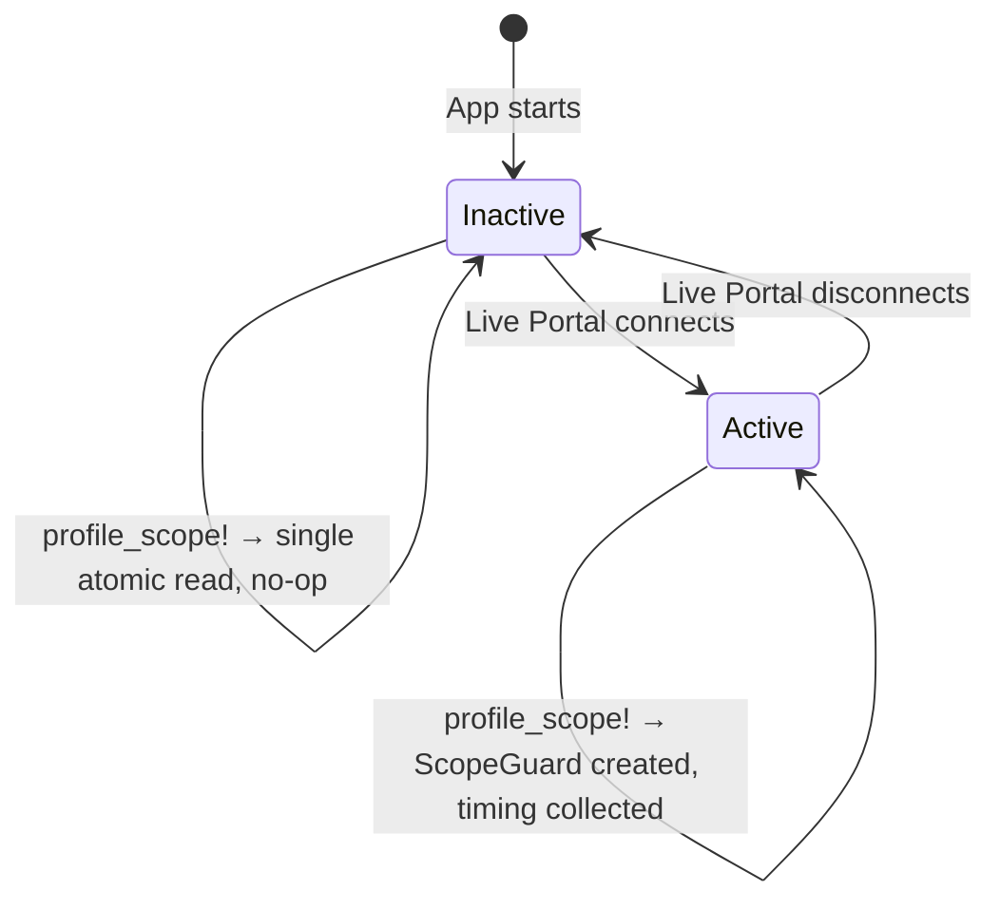
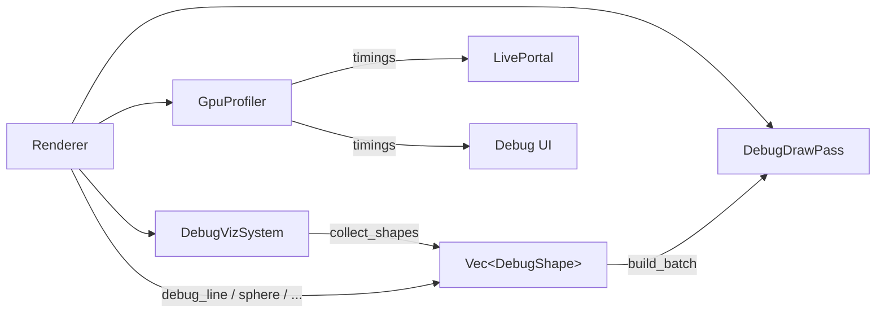

# Debug Visualization and Profiling

Helio ships with a comprehensive, renderer-integrated debug layer that covers everything from wireframe shape overlays and scene-object bounds to sub-millisecond GPU timestamp profiling. Rather than being bolted on after the fact, the debug facilities are first-class citizens of the render graph — they occupy a dedicated pass, share the same depth buffer as the scene, and produce zero overhead when disabled.

This page explains how every piece fits together: from the low-level `DebugShape` tessellation machinery, through the `DebugVizSystem` overlay abstraction, to the double-buffered GPU timestamp profiler that feeds the Live Portal dashboard.

---

## Why Debug Visualization Lives Inside the Renderer

The most common alternative — drawing debug geometry from application code via a thin overlay library — introduces a mismatch between the debug view and the real render. Overlays drawn in a second pass without access to the scene depth buffer either always appear on top of geometry (useless for occlusion reasoning) or require a costly depth-prepass copy. Neither is acceptable.

Helio's debug draw system instead runs as a named pass inside the render graph, declared *after* the primary geometry and lighting passes. It reads the live `color_target` with `LoadOp::Load` (preserving what the scene already drew) and binds the same `depth` attachment used by scene geometry. This means a debug sphere drawn around a mesh will be correctly occluded by the ground plane in front of it, and a light-range sphere that extends behind a wall will appear clipped at the wall surface — exactly the behavior needed to understand the actual runtime state of the scene.

```
Render Graph Pass Order (simplified)
─────────────────────────────────────────────────────────────
  shadow_pass  →  geometry_pass  →  lighting_pass
      ↓                ↓                  ↓
      └────────────────┴──────────────────┘
                       ↓
                  post_process_pass
                       ↓
                  debug_draw_pass   ← reads color_target (Load), tests depth
                       ↓
                  ui_pass
```

Because `DebugDrawPass` is a regular render graph node, it participates in automatic resource dependency tracking and GPU timeline scheduling the same way all other passes do. If there are no debug shapes to draw on a given frame, the pass is skipped entirely — the graph sees an empty batch and short-circuits before any draw calls are issued.

> [!NOTE]
> The debug draw system is available in both release and debug builds. There is no `#[cfg(debug_assertions)]` gate around the API. This is intentional: shipping with profiling tools always reachable means you can attach a Live Portal to a staging build without recompiling.

---

## DebugShape Variants

Every piece of debug geometry submitted to the renderer is described by one variant of the `DebugShape` enum. There are five shapes, covering the primitives most useful for spatial reasoning about lights, physics volumes, and camera frustums.

```rust
pub enum DebugShape {
    Line {
        start: Vec3,
        end: Vec3,
        color: [f32; 4],
        thickness: f32,     // world-space tube radius
    },
    Cone {
        apex: Vec3,
        direction: Vec3,    // normalized; cone opens in this direction
        height: f32,
        radius: f32,        // base radius
        color: [f32; 4],
        thickness: f32,
    },
    Box {
        center: Vec3,
        half_extents: Vec3,
        rotation: Quat,
        color: [f32; 4],
        thickness: f32,
    },
    Sphere {
        center: Vec3,
        radius: f32,
        color: [f32; 4],
        thickness: f32,
    },
    Capsule {
        start: Vec3,        // center of bottom hemisphere
        end: Vec3,          // center of top hemisphere
        radius: f32,
        color: [f32; 4],
        thickness: f32,
    },
}
```

The `color` field is a linear-space RGBA value. Alpha less than 1.0 is fully respected — `DebugDrawPass` uses alpha-blended rendering — so you can draw translucent volumes to see inside them. The `thickness` field is a world-space tube radius applied uniformly; a value of `0.005` gives a hairline-style wire at typical scene scales, while `0.02` is visible at distance.

> [!TIP]
> Prefer alpha values around `0.4`–`0.6` for volume shapes like `Box` and `Sphere` when you want to see through them to inspect interior geometry. Use full `alpha = 1.0` for lines and direction arrows, where opacity aids readability over occlusion.

---

## How Shapes Are Tessellated

All five `DebugShape` variants ultimately decompose into triangle meshes. There are no line primitives at the GPU level — lines become cylindrical tubes, and every other shape is a faceted approximation. The tessellation happens CPU-side inside `build_batch()` in `debug_draw.rs`, which is called once per frame after all shapes have been collected.

### Lines → Cylindrical Tubes

A `Line` shape is converted to a tube by `add_segment_tube()`. The algorithm constructs an octagonal cross-section (N = 8 sides) perpendicular to the segment direction and extrudes it along the segment to produce a closed cylinder. The two end caps are filled with triangle fans. The `thickness` field becomes the cylinder radius. Octagonal cross-sections strike the right balance: at a distance they read as round, but the vertex count is low enough that you can submit hundreds of lines per frame without meaningful CPU overhead.

### Spheres → Low-Poly UV Sphere Wireframe

A `Sphere` draws a UV sphere wireframe: latitude rings and longitude segments tessellated to the same tube geometry used for lines. The ring/segment count is intentionally kept low (typically 8 latitude bands and 12 longitude segments) because the purpose is spatial intuition, not geometric fidelity. The combination of the equatorial ring and several longitude arcs gives an unambiguous sense of the sphere's center and radius without visual clutter.

### Boxes → 12-Edge Wireframe

A `Box` draws only its twelve edges as tube segments. The eight corners are computed from `center`, `half_extents`, and `rotation`, then the twelve edge pairs are emitted as `Line` tubes. The orientation quaternion is fully applied, so a rotated physics AABB or oriented bounding box renders correctly.

### Cones → Outline Cone Geometry

A `Cone` draws the apex, an octagonal base ring, and eight radial lines from apex to the base vertices. This gives a visual shorthand for spotlight directions and physics raycast shapes. The direction vector is used to compute a transform that aligns the cone's axis, and the `height` and `radius` scale the geometry accordingly.

### Capsules → Cylinder Plus Two Hemispheres

A `Capsule` is decomposed into a central cylinder segment from `start` to `end` (using `add_segment_tube()`) and two hemispherical end caps. Each hemisphere is rendered as four latitude half-rings plus four meridian half-arcs, again as tube geometry.

> [!NOTE]
> The tessellation for all shapes occurs on the CPU every frame. For most debug workloads (tens to low hundreds of shapes) this is negligible. If you find yourself submitting thousands of shapes per frame — for example, visualizing every particle in a large particle system — consider sampling a representative subset instead.

---

## Per-Frame Debug Shape API

The `Renderer` exposes a flat, ergonomic API for submitting shapes that are drawn once for the current frame and discarded. There is no persistent scene graph for debug shapes; shapes must be re-submitted each frame they should appear.

```rust
// Convenience wrappers — each constructs a DebugShape and appends it
renderer.debug_line(
    Vec3::new(0.0, 0.0, 0.0),
    Vec3::new(5.0, 0.0, 0.0),
    [1.0, 0.0, 0.0, 1.0],   // red
    0.01,
);

renderer.debug_sphere(
    entity_pos,
    collision_radius,
    [0.0, 1.0, 0.0, 0.5],   // translucent green
    0.005,
);

renderer.debug_box(
    aabb.center,
    aabb.half_extents,
    Quat::IDENTITY,
    [0.2, 0.8, 1.0, 1.0],
    0.008,
);

renderer.debug_capsule(
    capsule_bottom,
    capsule_top,
    capsule_radius,
    [1.0, 1.0, 0.0, 1.0],   // yellow
    0.005,
);

renderer.debug_cone(
    light_pos,
    light_dir,
    spot_range,
    spot_outer_radius,
    [1.0, 0.8, 0.0, 0.8],
    0.005,
);
```

You can also use the raw enum directly through `renderer.debug_shape(shape)` when constructing shapes from data that isn't easily expressed through the convenience wrappers.

At the beginning of each frame, the renderer calls `clear_debug_shapes()` automatically before any application update code runs. You should not call it manually unless you need to wipe shapes that were submitted earlier in the same frame.

> [!WARNING]
> Debug shapes are collected in a `Vec` behind an `Arc<Mutex<…>>`. Submitting shapes from multiple threads simultaneously is safe, but very high submission rates from parallel threads can create lock contention. If you're submitting shapes from a parallel job, batch them into a local `Vec` first and flush to the renderer once in the main thread.

---

## DebugDrawPass in the Render Graph

`DebugDrawPass` is declared as a standard render graph node and is registered automatically by the renderer at startup. Its resource declarations are:

- **`color_target`** — declared as a color attachment with `LoadOp::Load`. The pass reads back whatever the scene drew before it and composites debug geometry on top.
- **`depth`** — declared as a depth-stencil attachment in read mode. Debug shapes are depth-tested against the scene depth buffer but do not write depth values. This means a debug sphere behind an opaque wall will be clipped where the wall occludes it.

The pipeline state uses front-face-only rasterization (not double-sided) for performance, but note that because all geometry is tessellated as outlines and tubes rather than solid faces, this almost never causes visible gaps. Alpha blending is enabled using standard premultiplied alpha, so translucent debug shapes composite correctly over the scene.

When `build_batch()` returns `None` — meaning the renderer's shape list was empty at batch-build time — the pass detects the absent batch and returns immediately without issuing any GPU commands. The cost of a completely idle debug pass is a handful of CPU instructions for the early exit check.

<!-- screenshot: DebugDrawPass rendering light-range spheres and mesh bounds wireframes over a lit scene, showing correct depth occlusion where shapes pass behind walls -->

---

## DebugVizSystem: Managed Overlay Renderers

While the per-frame API is suited for one-off diagnostic submissions from application code, `DebugVizSystem` provides a structured way to manage *persistent* overlay renderers — objects that run every frame (when enabled) and emit shapes based on live scene state.

```rust
pub struct DebugVizSystem {
    pub enabled: bool,   // master switch
    renderers: Vec<Box<dyn DebugRenderer>>,
}
```

The `enabled` field is the master switch. When it is `false`, no renderer is consulted and no shapes are emitted, regardless of individual renderer state. By convention, toggling this with **F3** is the expected keybinding in Helio-based applications, though the renderer does not impose any key handling — the application is responsible for calling `debug_viz_mut().enabled = !debug_viz().enabled`.

The `DebugRenderer` trait is the extension point:

```rust
pub trait DebugRenderer: Send + Sync {
    fn name(&self) -> &str;
    fn is_enabled(&self) -> bool;
    fn set_enabled(&mut self, enabled: bool);
    fn render(&self, ctx: &DebugRenderContext, out: &mut Vec<DebugShape>);
}
```

Each frame, when the master switch is on, the system iterates its renderer list, calls `render()` on each enabled renderer, and collects all emitted `DebugShape` values into a flat list that is then handed to `DebugDrawPass`. The `render()` method takes a shared reference to `self` (`&self`, not `&mut self`), so renderers may not mutate their own state during shape emission — all per-renderer state must be managed through `set_enabled()` or by replacing the renderer instance.

---

## DebugRenderContext

Every `DebugRenderer` implementation receives a `DebugRenderContext` describing the current scene state:

```rust
pub struct DebugRenderContext<'a> {
    pub lights: &'a [SceneLight],
    pub object_bounds: &'a [ObjectBounds],
    pub camera_pos: Vec3,
    pub camera_forward: Vec3,
    pub dt: f32,
}

pub struct ObjectBounds {
    pub center: Vec3,
    pub radius: f32,
}
```

The `lights` slice gives every active `SceneLight` in the scene — point, spot, and directional. `object_bounds` gives world-space bounding spheres for all registered scene objects, as reported by the renderer's internal object registry. `camera_pos` and `camera_forward` allow renderers to cull shapes that are behind the camera or very distant (though this is optional; the depth test handles GPU-side culling). `dt` is the frame delta in seconds, available for any renderers that animate their debug geometry over time.

> [!NOTE]
> `object_bounds` reflects the bounding spheres as registered with the renderer via `register_object_bounds()`. If your scene objects do not call that API, the slice will be empty and the `mesh_bounds` renderer will draw nothing. This is by design — the renderer does not traverse scene graphs or ECS worlds automatically.

---

## Built-In Renderers

Four debug renderers are registered automatically by the renderer at startup:

### `light_range`

Draws a wireframe `Sphere` at each point light's position with radius equal to the light's attenuation cutoff distance. The sphere color matches the light's emission color at full intensity. This makes it immediately clear which parts of the scene fall within each light's influence volume and how lights overlap.

<!-- screenshot: light_range renderer showing overlapping influence spheres for four point lights of different colors in a dark scene -->

### `light_direction`

Draws a `Cone` at each spot light position, with the cone apex at the light's position, opening in the light's direction, and scaled from the light's actual `range`. The outer cone always renders, and when `inner_angle` is smaller than `outer_angle` Helio draws a second, tighter cone inside it so you can see the falloff region directly. Directional lights additionally receive a `Line` arrow extending from a point along the camera-forward direction to indicate the global light direction. This renderer is indispensable when debugging spot light orientations that look correct from one angle but are misaligned from another.

### `mesh_bounds`

Draws a translucent wireframe `Sphere` around each registered `ObjectBounds` entry. The default color is a faint cyan (`[0.0, 0.8, 1.0, 0.25]`). This is most useful during scene construction to verify that bounding volumes are correctly sized and positioned for culling or physics purposes.

### `grid`

Draws a world-space XZ grid at Y = 0, snapped to the nearest integer meter boundary, extending a fixed radius around the camera's XZ position. The grid updates its center each frame to follow the camera, so it never scrolls off screen. Grid lines are colored with a subtle gray and emit at low alpha to avoid competing visually with scene geometry.

<!-- screenshot: grid renderer showing the snapped XZ ground grid under a scene, with slightly brighter major axis lines along the X and Z global axes -->

---

## Shader Debug Visualization Modes

`DebugVizSystem` overlays are geometry drawn on top of the scene. Helio also exposes a separate
**shader debug mode** switch that changes what the core geometry and lighting shaders output.
Use it when you need to inspect UVs, raw textures, normals, or the deferred handoff itself rather
than scene-space helper shapes.

```rust
renderer.set_debug_mode(5);           // world normals
assert_eq!(renderer.debug_mode(), 5);
```

| Mode | Output | Typical use |
|---|---|---|
| `0` | Normal rendering | Standard lit frame with full material and normal mapping |
| `1` | UV-as-color | Verify UV layout, seams, and flipped islands |
| `2` | Base-color texture direct | Check texture decoding before material tint and lighting |
| `3` | Lit without normal mapping | Separate tangent-space issues from lighting issues |
| `4` | G-buffer albedo readback | Confirm deferred handoff and G-buffer sampling |
| `5` | World normals remapped to RGB | Inspect vertex/TBN correctness and surface orientation |

Modes `1`, `2`, and `4` intentionally bypass lighting and return colour straight from the geometry
or G-buffer path. Mode `3` still runs the lighting pass, but it forces the shader to use the
geometric normal instead of the sampled normal map. Mode `5` is especially useful when validating
authored tangents from imported FBX or glTF assets, because mirrored UV seams and incorrect
bitangent signs show up immediately as discontinuities in the remapped normal field.

> [!TIP]
> A practical debugging sequence for imported content is: `1` to verify UVs, `5` to verify world normals, then `3` to compare lit geometry normals against the fully normal-mapped result. If `3` looks correct and `0` does not, the problem is almost certainly in your tangent basis or normal texture.

---

## Toggling Individual Overlays vs the Master Switch

The master switch (`debug_viz.enabled`) and per-renderer enable flags operate independently. A renderer can be individually disabled even when the master switch is on:

```rust
// Turn on the master switch
renderer.debug_viz_mut().enabled = true;

// Disable a specific overlay
renderer.debug_viz_mut().set_enabled("grid", false);

// Query individual state
if renderer.debug_viz().is_enabled("light_range") {
    // ...
}

// Re-enable
renderer.debug_viz_mut().set_enabled("mesh_bounds", true);
```

A common pattern is to have a debug menu that exposes individual toggle checkboxes backed by `is_enabled()` / `set_enabled()` calls, while the F3 key controls `debug_viz_mut().enabled` as a single show/hide shortcut for all overlays at once.



---

## Registering a Custom DebugRenderer

Implementing `DebugRenderer` lets you attach scene-specific visualization logic that runs automatically alongside the built-ins:

```rust
use helio::debug_viz::{DebugRenderer, DebugRenderContext};
use helio::debug_draw::DebugShape;
use glam::{Vec3, Quat};

struct PhysicsBoundsRenderer {
    enabled: bool,
    bodies: Arc<RwLock<Vec<PhysicsBody>>>,
}

impl DebugRenderer for PhysicsBoundsRenderer {
    fn name(&self) -> &str { "physics_bounds" }
    fn is_enabled(&self) -> bool { self.enabled }
    fn set_enabled(&mut self, enabled: bool) { self.enabled = enabled; }

    fn render(&self, ctx: &DebugRenderContext, out: &mut Vec<DebugShape>) {
        let bodies = self.bodies.read().unwrap();
        for body in bodies.iter() {
            // Draw collision shape
            out.push(DebugShape::Capsule {
                start: body.capsule_bottom(),
                end: body.capsule_top(),
                radius: body.capsule_radius(),
                color: if body.is_sleeping() {
                    [0.4, 0.4, 0.4, 0.4]   // grey for sleeping bodies
                } else {
                    [0.2, 1.0, 0.2, 0.5]   // green for active bodies
                },
                thickness: 0.004,
            });

            // Draw velocity vector
            let vel_end = body.position() + body.velocity() * 0.1;
            out.push(DebugShape::Line {
                start: body.position(),
                end: vel_end,
                color: [1.0, 0.5, 0.0, 1.0],
                thickness: 0.006,
            });
        }
    }
}

// Registration — typically done during scene init
renderer.debug_viz_mut().register(PhysicsBoundsRenderer {
    enabled: true,
    bodies: physics_world.body_list(),
});
```

After registration, the renderer becomes addressable by name (`"physics_bounds"`) through `set_enabled()` and `is_enabled()`. Renderers are stored as boxed trait objects in a `Vec`, so registration order determines draw order, though since all debug shapes share the same alpha-blended pass the order rarely matters visually.

> [!IMPORTANT]
> The `render()` method is called on the **render thread** (or the thread that calls `renderer.render_frame()`), not necessarily the main application thread. If your custom renderer reads from shared state (as the `PhysicsBoundsRenderer` above reads from `Arc<RwLock<…>>`), ensure the locking strategy is appropriate. A common pattern is to keep a renderer-owned snapshot that is refreshed via a separate `update()` call on the main thread each frame.

---

## Editor Mode

Editor mode is a renderer-level feature that adds visual helpers useful when building and iterating on a scene in a tool context. When enabled, every light in the scene gains a billboard icon positioned at the light's world-space location — a small screen-facing sprite that maintains constant apparent size regardless of distance.

Internally, each billboard is a `BillboardInstance` added to the billboard pass:

```rust
// Conceptual representation of what spawns when editor_mode = true
BillboardInstance {
    position: light.position,
    color: light.color,      // tints the icon to match the light's color
    screen_scale: true,      // constant screen-space size regardless of depth
    size: 0.35,              // base icon size in normalized screen space
}
```

The renderer maintains a `HashMap<LightId, BillboardId>` so that subsequent calls to `update_light()` and `move_light()` can synchronize the billboard's position and color tint to match the updated light state. Calling `remove_light()` automatically removes the associated billboard — the application does not need to manage billboard lifetime manually.

```rust
// Activating editor mode
renderer.set_editor_mode(true);

// Querying current state
if renderer.is_editor_mode() {
    // show editor UI panels
}

// Deactivating (removes all light billboard icons)
renderer.set_editor_mode(false);
```

### Mid-Session Activation

Enabling editor mode on a renderer that already has lights is handled gracefully. When `set_editor_mode(true)` is called on a renderer with an existing scene:

1. The renderer snapshots the current light list from its internal registry.
2. For each existing light, `spawn_editor_light_billboard()` is called immediately.
3. New lights added after activation go through the same code path as fresh-scene lights.

Disabling mid-session tears down all `editor_billboard_ids` entries and removes the corresponding billboard instances from the billboard pass in one batch.

<!-- screenshot: Editor mode active — a scene with four lights, each showing a colored billboard icon at the light's position, icon color matching the light's emission color -->

> [!TIP]
> Editor mode and debug viz are independent systems. You can have `editor_mode = true` with `debug_viz.enabled = false` to see light icons without the overlay wireframes, or vice versa. Combining both gives maximum scene insight during development.

---

## GPU Timestamp Profiler

Helio includes a built-in GPU timestamp profiler (`GpuProfiler`) that brackets every render pass in the graph with hardware timestamp queries and reports sub-millisecond timing for each pass. Unlike CPU-side timing, GPU timestamps measure actual execution time on the GPU timeline — GPU parallelism, async compute, and driver scheduling are all reflected in the numbers.



### TIMESTAMP_QUERY Requirement

The profiler requires the `wgpu::Features::TIMESTAMP_QUERY` device feature. On most modern desktop GPUs (Vulkan, D3D12) this feature is available. On some mobile or older devices it is not, and in those cases `GpuProfiler::new()` returns `None`. The render graph checks for `None` and gracefully skips all profiling code — the passes execute correctly without timing instrumentation.

```rust
// GpuProfiler creation — called once at renderer startup
let profiler = GpuProfiler::new(&device);
// profiler is Option<GpuProfiler>; None on devices without TIMESTAMP_QUERY
```

### Capacity and Memory Layout

```rust
const MAX_SCOPES: u32 = 192;   // maximum named scopes per frame
const SLOT_COUNT: u32 = MAX_SCOPES * 2;   // begin + end per scope
const SLOT_BYTES: u64 = SLOT_COUNT as u64 * 8;   // u64 per timestamp = 3072 bytes
```

The profiler allocates one `wgpu::QuerySet` of 384 timestamp slots (192 scopes × 2 timestamps each) and two staging buffers of 3072 bytes each. The staging buffers alternate each frame — one is being written to (resolved into from the current frame's query set) while the other is being read (mapped and parsed from the previous frame). This double-buffering prevents any pipeline stall: the GPU writes to one buffer while the CPU reads from the other without either waiting.

> [!NOTE]
> 192 scopes is more than enough for the current render graph, which has around 12–18 passes in a typical scene configuration. The headroom is intentional — custom passes, editor tooling, and experimental features can all add scopes without hitting the limit.

### The 1-Frame Readback Delay

GPU timestamps are written to a device-local query set during command execution. To read them on the CPU, the data must be resolved to a mappable staging buffer and then mapped via `map_async()`. WebGPU/wgpu does not allow synchronous GPU readback — doing so would stall the CPU until the GPU finishes the entire frame, which would cap the frame rate to whatever the GPU can sustain.

The 1-frame delay design avoids this entirely:

- **Frame N:** Query results are resolved into `staging[0]`. Frame ends, swap: `current_buffer` becomes 1.
- **Frame N+1:** Before submitting new work, the CPU maps `staging[0]` (from frame N), reads the timestamp data, computes `gpu_ms` for each scope, and stores results in `pass_timings`. Then frame N+1's results are resolved into `staging[1]`.
- **Frame N+2:** `staging[1]` (frame N+1) is read, and so on.

The application always sees timing data that is one frame old, which is entirely acceptable for profiling dashboards and frame budget analysis.

---

## Scope Allocation and Pass Integration

The render graph integrates with the profiler through `allocate_scope()` and `set_last_scope_cpu_ms()`:

```rust
// Inside render graph node execution (conceptual)
if let Some(ref mut profiler) = self.profiler {
    if let Some((begin_slot, end_slot)) = profiler.allocate_scope("geometry_pass") {
        encoder.write_timestamp(profiler.query_set(), begin_slot);
        // ... encode pass commands ...
        encoder.write_timestamp(profiler.query_set(), end_slot);

        // Record CPU time for this pass
        let cpu_ms = cpu_start.elapsed().as_secs_f32() * 1000.0;
        profiler.set_last_scope_cpu_ms(cpu_ms);
    }
}
```

`allocate_scope()` increments `scope_count` and returns the two slot indices for that scope. If `scope_count` would exceed `MAX_SCOPES`, it returns `None` and that scope is silently skipped rather than panicking — the profiler degrades gracefully under overload.

After `read_back()` completes, the timing data is available:

```rust
// Reading timing results (called from Live Portal or debug UI code)
let timings = renderer.gpu_profiler().timings();
for t in timings {
    println!("{}: {:.3}ms GPU / {:.3}ms CPU", t.name, t.gpu_ms, t.cpu_ms);
}
```

```
geometry_pass:     1.834ms GPU /  0.212ms CPU
shadow_pass:       0.743ms GPU /  0.088ms CPU
lighting_pass:     2.107ms GPU /  0.034ms CPU
post_process_pass: 0.418ms GPU /  0.021ms CPU
debug_draw_pass:   0.051ms GPU /  0.003ms CPU
```

<!-- screenshot: Live Portal timing panel showing per-pass GPU/CPU bars, geometry_pass and lighting_pass highlighted as the two largest contributors in a scene with dynamic lighting -->

---

## The `profile_scope!` Macro

For application-level code that doesn't map directly to a render pass, the `profile_scope!` macro provides lightweight scope timing that integrates with the same profiling pipeline:

```rust
fn update_scene(&mut self, dt: f32) {
    profile_scope!("update_scene");

    {
        profile_scope!("physics_step");
        self.physics.step(dt);
    }

    {
        profile_scope!("animation_update");
        self.animator.update(dt);
    }
}
```

### Zero-Cost When Disconnected

The macro expands to a single relaxed atomic load followed by an optional `ScopeGuard` creation:

```rust
macro_rules! profile_scope {
    ($name:expr) => {
        let _prof_guard = $crate::profiler::profiling_active()
            .then(|| $crate::profiler::ScopeGuard::new($name));
    };
}
```

`profiling_active()` reads an `AtomicBool` with `Ordering::Relaxed` — the cheapest possible synchronization operation. When no Live Portal is connected and the bool is `false`, the `then()` closure never executes and the `Option` is `None`. The compiler sees `let _ = None::<ScopeGuard>` and elides it entirely. **There is no allocation, no thread-local access, and no timestamp query when profiling is inactive.**

### RAII Guard and Scope Tree

`ScopeGuard` records a `std::time::Instant` on creation and, when dropped, computes the elapsed duration and sends a `CompletedScope` message over a channel to a background collector thread:

```rust
pub struct ScopeGuard {
    name: &'static str,
    start: Instant,
}

impl Drop for ScopeGuard {
    fn drop(&mut self) {
        let cpu_ms = self.start.elapsed().as_secs_f32() * 1000.0;
        // send CompletedScope { name, cpu_ms } over channel — Copy struct, zero alloc
        SCOPE_SENDER.with(|s| {
            let _ = s.try_send(CompletedScope {
                name: self.name,
                cpu_ms,
                // slot fields unused for CPU-only scopes
                begin_slot: 0,
                end_slot: 0,
            });
        });
    }
}
```

The channel message is a `Copy` struct — no heap allocation occurs on the sending path. The background collector thread receives `CompletedScope` values and assembles them into the hierarchical tree that the Live Portal displays. Nested scopes form a parent-child relationship automatically based on the stack order at drop time.

### Profiling Gate: Portal Connected = Active

The `AtomicBool` read by `profiling_active()` is shared with the `LivePortalHandle`. When a Live Portal client connects, the handle sets the bool to `true`. When the client disconnects, it resets to `false`. This means:

- In production with no portal connected: `profile_scope!` is a single atomic read per call site, with no other work.
- When a developer attaches a portal for profiling: scopes begin collecting immediately, with no need to restart the application or recompile.



> [!IMPORTANT]
> `profile_scope!` uses `&'static str` for scope names. This means you must pass string literals, not owned `String` values. This constraint is what enables the zero-allocation path — no string data needs to be copied into the channel message.

---

## Accessing Timing Data

After each frame's `read_back()` completes, the timing results are available through `timings()` and are automatically forwarded to any connected Live Portal. For in-process access:

```rust
// Typically called from a debug UI or profiling overlay render
let timings = renderer.gpu_profiler_timings(); // &[PassTiming] if profiler present

for timing in timings {
    egui::Label::new(format!(
        "{:<25} {:>7.3}ms GPU  {:>7.3}ms CPU",
        timing.name, timing.gpu_ms, timing.cpu_ms
    ));
}
```

The `timings()` slice is stable for the duration of the frame — it is only updated at the start of the next frame when `read_back()` runs. It is safe to read from the same thread that calls `render_frame()` at any point during frame processing.

---

## Practical Examples

### Frame Budget Analysis

A typical workflow when a scene drops below target frame rate:

1. Connect a Live Portal to the running session (or check the in-process timing overlay).
2. Identify which pass has the largest `gpu_ms` — commonly `geometry_pass` with many draw calls or `lighting_pass` with many shadow-casting lights.
3. Use `light_range` debug viz to check whether lights with large attenuation radii are illuminating more of the scene than intended.
4. Reduce unnecessary light overlap or tighten attenuation radii, then re-check timings.

```rust
// Example: log a warning when lighting_pass exceeds budget
if let Some(t) = renderer.gpu_profiler_timings().iter().find(|t| t.name == "lighting_pass") {
    if t.gpu_ms > 3.0 {
        tracing::warn!(
            "lighting_pass over budget: {:.2}ms (target <3ms)",
            t.gpu_ms
        );
    }
}
```

### Light Debugging with Overlays

When a surface is not receiving expected illumination:

```rust
// Enable the two most useful light overlays
let viz = renderer.debug_viz_mut();
viz.enabled = true;
viz.set_enabled("light_range", true);
viz.set_enabled("light_direction", true);
viz.set_enabled("mesh_bounds", false);   // reduce clutter
viz.set_enabled("grid", false);
```

<!-- screenshot: Light debugging workflow — light_range and light_direction overlays active, showing a spot light cone that doesn't quite reach the intended surface, with the influence sphere showing the falloff boundary -->

With `light_range` active, you can immediately see whether the object's position falls within the light's attenuation sphere. If it does but the surface is still dark, `light_direction` will reveal whether the cone angle or direction is misaligned.

### Physics Bounds Visualization

For physics debugging, a custom renderer (as shown in the registration example above) combined with the per-frame shape API gives full flexibility:

```rust
fn debug_render_physics(&self, renderer: &mut Renderer) {
    profile_scope!("debug_render_physics");

    for contact in self.physics.active_contacts() {
        // Draw a small sphere at each contact point
        renderer.debug_sphere(
            contact.point,
            0.05,
            [1.0, 0.0, 0.0, 1.0],   // red contact points
            0.003,
        );

        // Draw the contact normal
        renderer.debug_line(
            contact.point,
            contact.point + contact.normal * contact.depth,
            [1.0, 0.5, 0.0, 1.0],
            0.004,
        );
    }
}
```

This pattern — using `profile_scope!` to track the CPU cost of the debug rendering itself — ensures that even the diagnostic code is visible in the profiler, preventing it from hiding its own overhead.

> [!TIP]
> When iterating on physics or animation code, a useful approach is to gate debug shape submission behind a bool that you can toggle at runtime, rather than commenting and uncommenting code. Keep the shapes defined permanently and flip the flag from an imgui checkbox or terminal command. The zero-cost path when `debug_viz.enabled = false` means there is no runtime penalty for leaving the code in place.

---

## Accessing the Debug Viz System

The `Renderer` exposes two accessors for the debug viz system that follow the standard Helio immutable/mutable access pattern:

```rust
// Immutable access — read enabled state, iterate renderers
let viz: &DebugVizSystem = renderer.debug_viz();

// Mutable access — toggle switches, register renderers
let viz: &mut DebugVizSystem = renderer.debug_viz_mut();
```

The split accessor design allows immutable reads (for UI rendering, serialization of debug state to config) without requiring a mutable borrow of the renderer. Mutable access is only needed when changing state — registering new renderers, toggling switches, or updating renderer configurations.



The `DebugVizSystem`, per-frame shape API, and `GpuProfiler` all feed into a coherent picture of runtime scene state. Used together — overlays showing spatial relationships, the profiler showing timing relationships, and editor mode showing light positions — they form a comprehensive diagnostic toolkit that operates entirely within the running application without requiring external tools or a separate debug build.
