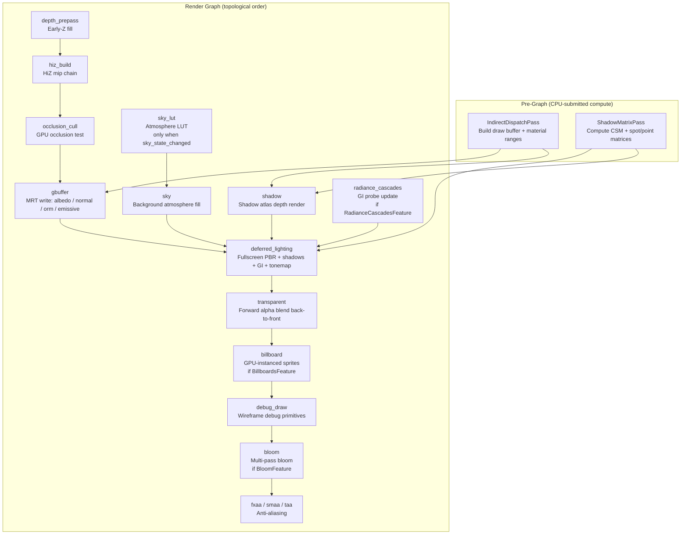
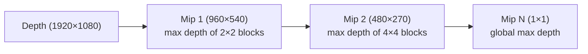
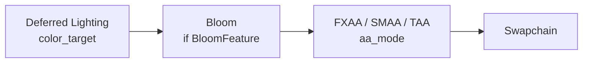
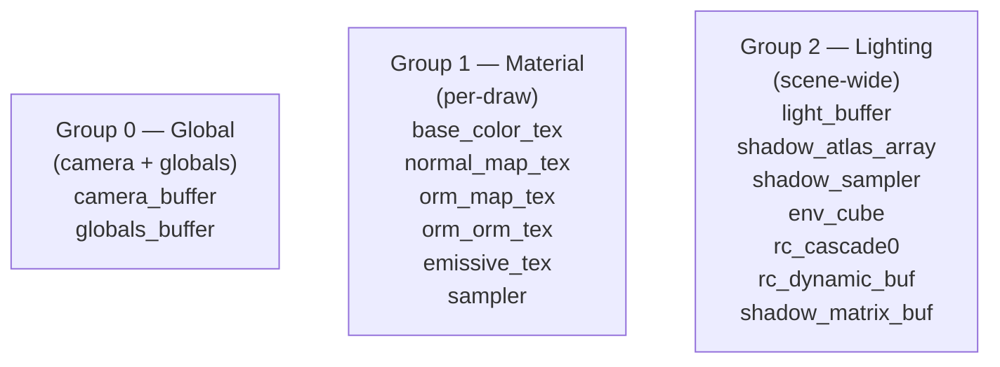
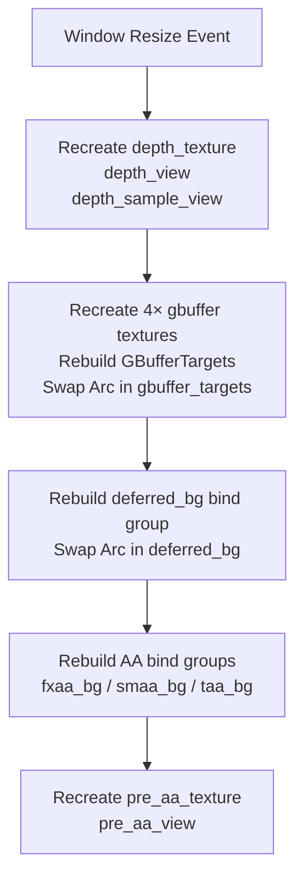
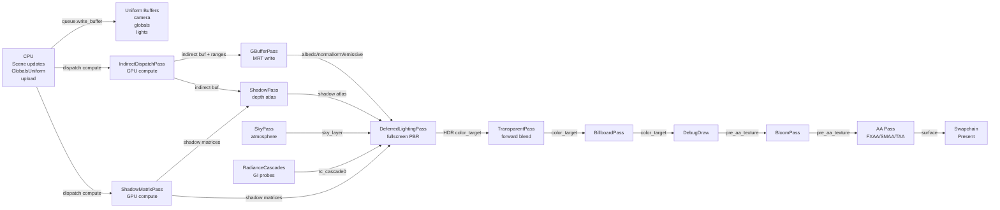

# Deferred Rendering Pipeline

Helio's rendering pipeline is built around a **deferred shading** architecture powered by **GPU-driven indirect rendering**. Together these two ideas allow the renderer to handle large, complex scenes with dozens of lights and thousands of draw calls at a CPU cost that scales with the number of *unique materials* rather than the number of *objects* in the scene.

This page walks through every stage of the pipeline in execution order, explaining the data flow between passes, the bind group layout that ties them together, and the reasoning behind the design choices made at each step.

<!-- screenshot: overview of a scene rendered with Helio showing shadows, GI, and atmospheric sky -->

---

## Why Deferred Shading?

In a traditional **forward renderer** every fragment produced by a draw call must evaluate every light in the scene. If you have `N` opaque objects and `L` lights the worst-case shading cost is `O(N × L)`. Techniques like clustered forward rendering can reduce this considerably, but the fundamental coupling between geometry submission and lighting evaluation remains.

**Deferred shading** breaks that coupling by splitting rendering into two completely separate phases:

1. **Geometry phase** — draw every opaque object once, writing surface properties into a set of textures called the *G-buffer*. No lighting is computed here at all.
2. **Lighting phase** — draw a single full-screen triangle. The fragment shader reads G-buffer textures and evaluates every light for each *screen pixel*, not for each triangle. Because the G-buffer is at screen resolution, you never shade a fragment that will be hidden by another — visibility is already resolved.

The shading cost becomes `O(screen_pixels × L)`, which is bounded by your resolution rather than your scene complexity. Adding a thousand extra meshes to the scene costs geometry bandwidth, but it does not make lighting slower.

Expressing the two approaches formally:

**Forward rendering** evaluates lighting per fragment per light:
$$\text{Cost}_{\text{forward}} = O(N_{\text{fragments}} \times N_{\text{lights}})$$

**Deferred rendering** separates the geometry and lighting passes:
$$\text{Cost}_{\text{deferred}} = O(N_{\text{overdraw}} \times N_{\text{geo\_passes}}) + O(N_{\text{pixels}} \times N_{\text{lights}})$$

With deferred, $$$1$$ in the G-buffer pass is minimised by the depth prepass (typically 1.0×–1.1× overdraw on opaque geometry). The lighting evaluation is then exactly 1 pass over the screen.

> [!NOTE]
> Deferred shading has a well-known weakness: it cannot handle **transparency** without extra work. Helio solves this by running a separate **forward transparent pass** after the deferred lighting pass, reusing the depth buffer written during the geometry phase.

---

## The G-Buffer Layout

The G-buffer is the heart of the deferred pipeline. Helio allocates **four render targets** that together encode everything the lighting pass needs to evaluate physically-based materials.

```rust
pub struct GBufferTargets {
    pub albedo_view:   wgpu::TextureView,  // Rgba8UnormSrgb
    pub normal_view:   wgpu::TextureView,  // Rgba16Float
    pub orm_view:      wgpu::TextureView,  // Rgba8Unorm
    pub emissive_view: wgpu::TextureView,  // Rgba16Float
}
```

### Albedo — `Rgba8UnormSrgb`

The albedo target stores the **base colour** of each surface in sRGB-encoded 8-bit per channel form. The `Srgb` suffix means the hardware applies gamma expansion automatically when the shader samples it, so shader code always works in linear light. Four bytes per pixel. Alpha is stored but currently reserved for future material layering work.

### Normal — `Rgba16Float`

World-space surface normals are stored as 16-bit floats per channel. Half-precision is sufficient for normals because the lighting error introduced by quantisation is below perceptual threshold for the specular highlights Helio produces. The fourth channel stores the **roughness** value mapped from the ORM texture, keeping roughness in half-precision alongside the normal it modulates.

> [!IMPORTANT]
> Normals are stored in **world space**, not view space. This means the G-buffer remains valid if the camera moves between the geometry pass and the lighting pass — a useful invariant for future TAA reprojection work and for any pass that wants to read G-buffer data in a deferred compute shader.

### ORM — `Rgba8Unorm`

ORM stands for **Occlusion / Roughness / Metallic**. Each channel stores one scalar property of the PBR material, packed into a single 8-bit unorm. The layout matches the glTF standard: R = ambient occlusion, G = roughness, B = metallic, A = unused. 8-bit precision is adequate for all three of these properties; the eye is not sensitive to fine metallic gradients.

### Emissive — `Rgba16Float`

Emissive radiance is stored in HDR half-precision because emissive surfaces can be much brighter than the [0, 1] range of unorm formats. The RGB channels store the emissive colour in linear light. This target is sampled by the deferred lighting pass and its value is added directly to the lit output before tonemapping.

<!-- screenshot: false-colour visualisation of each G-buffer target for a test scene -->

### Memory Budget

At 1920×1080 the four targets consume:

| Target    | Format          | Size per pixel | Total   |
|-----------|-----------------|----------------|---------|
| Albedo    | Rgba8UnormSrgb  | 4 bytes        | ~8 MB   |
| Normal    | Rgba16Float     | 8 bytes        | ~16 MB  |
| ORM       | Rgba8Unorm      | 4 bytes        | ~8 MB   |
| Emissive  | Rgba16Float     | 8 bytes        | ~16 MB  |
| **Total** |                 |                | ~48 MB  |

This is modest compared to the scene geometry that would otherwise need to be re-shaded for every light.

---

## GPU-Driven Indirect Rendering

Before any pass in the render graph executes, the CPU submits two compute dispatches that set up all the data the geometry pass will need. This is the "GPU-driven" half of the architecture.

### The Problem with CPU-Driven Draw Calls

A naive renderer loops over every object and calls `draw_indexed` once per object. The loop runs on the CPU, which must read object data, check visibility, select a pipeline, and encode a command for every single mesh. With ten thousand objects this loop alone can burn several milliseconds per frame — and it cannot be parallelised across GPU cores.

### IndirectDispatchPass: Building the Draw Buffer

`IndirectDispatchPass` is a GPU compute shader that runs **before** `graph.execute()`. It reads the `GpuScene` instance buffer — a flat array of per-object transforms, material IDs, bounding spheres, and flags — and writes a `wgpu::Buffer` full of `DrawIndexedIndirect` commands.

```rust
// Each entry in the indirect buffer maps to one mesh instance
// The GPU writes these; the CPU never touches them after submission
struct DrawIndexedIndirect {
    index_count:    u32,
    instance_count: u32,
    first_index:    u32,
    base_vertex:    i32,
    first_instance: u32,
}
```

The compute shader also **classifies** each object as opaque or transparent and groups opaque objects by material, producing a sorted indirect buffer. From that sorted buffer it generates a compact array of `MaterialRange` structs:

```rust
pub struct MaterialRange {
    pub start: u32,   // index into indirect draw buffer (opaque only)
    pub count: u32,
    pub bind_group: Arc<wgpu::BindGroup>,
}
```

Each `MaterialRange` represents a contiguous slice of the indirect buffer that shares the same material bind group. The G-buffer pass then iterates over `material_ranges` and fires one `multi_draw_indexed_indirect` call per range.

> [!NOTE]
> The CPU cost of the G-buffer draw step is **O(unique_materials)**, not **O(N_objects)**. A scene with 10 000 meshes using 40 unique materials fires exactly 40 GPU commands from the CPU, regardless of how many instances of each material appear.

With `multi_draw_indexed_indirect`, the CPU cost scales with materials rather than objects:

$$\text{CPU cost} = O(N_{\text{unique\_materials}}) \text{ draw calls}$$

Instead of the naive approach:

$$\text{CPU cost} = O(N_{\text{objects}}) \text{ draw calls}$$

For a scene with 10,000 objects using 50 unique materials: **50 draw calls** instead of 10,000.

### ShadowMatrixPass

`ShadowMatrixPass` is the second pre-graph compute dispatch. It reads the light buffer and a `shadow_dirty_buffer` — a bitfield where each bit corresponds to one light — and recomputes shadow projection matrices only for lights whose dirty bit is set. This avoids recomputing CSM splits and cube-face matrices every frame when the camera and lights have not moved.

```rust
// shadow_dirty_buffer: one u32 per group of 32 lights
// Only lights with their bit set trigger shadow matrix recalculation
```

Both pre-graph passes write their results into `Arc<Mutex<>>` shared buffers that are then handed to the appropriate in-graph passes through `Arc` clones, avoiding any data copy.

---

## Full Pass Execution Order

The complete pipeline executes in the following order every frame. Pre-graph passes run synchronously before `graph.execute()`; in-graph passes are scheduled by the render graph's topological sort.



### Why Pre-Graph Passes Run Outside the Graph

The render graph tracks resource reads and writes to infer execution order and insert barriers automatically. Both `IndirectDispatchPass` and `ShadowMatrixPass` produce data that is consumed by *multiple* in-graph passes — the indirect buffer is read by both the G-buffer pass and the shadow pass, and the shadow matrices are read by both the shadow pass and the deferred lighting pass.

Threading these through the graph's resource-dependency system would require the graph to understand GPU-buffer aliasing, which would complicate both the graph implementation and its barrier insertion logic. Running them manually before the graph — and sharing results via `Arc<Mutex<>>` — keeps the graph focused on render target management and the pre-graph phase focused on scene-level data preparation.

---

## Depth Prepass

The depth prepass renders every opaque object into the depth buffer and nothing else. No colour attachment is bound. The same pool vertex and index buffers used by the G-buffer pass are used here, and the same indirect draw buffer is consumed.

### Early-Z Benefits

GPUs can exploit a dedicated depth prepass through a feature called **early-Z rejection**: after the prepass the depth buffer already contains the correct final depth value for every pixel. When the G-buffer pass subsequently draws geometry, the hardware tests each fragment against the existing depth and discards it *before* running the vertex and fragment shaders if it would be hidden. This can eliminate a large fraction of shading work in scenes with significant depth complexity.

> [!TIP]
> Early-Z is most valuable in scenes with many overlapping objects viewed from angles where depth complexity is high — dense foliage, interior rooms, cityscapes. For simpler outdoor scenes its benefit is smaller, but the prepass costs little because it uses the same draw commands and skips all fragment shading.

The depth buffer format is `Depth32Float`, providing enough precision to avoid Z-fighting at typical view distances. The view is `depth_view` for writing and a separate `depth_sample_view` using the `DepthOnly` aspect for reading in the G-buffer and deferred lighting bind groups.

The depth value stored in the buffer is non-linear (hyperbolic). The NDC depth is:

$$z_{\text{ndc}} = \frac{f \cdot (z - n)}{z \cdot (f - n)}$$

To recover the linear view-space depth from a sampled depth value, the inverse is:

$$z_{\text{linear}} = \frac{n \cdot f}{f - z_{\text{ndc}} \cdot (f - n)}$$

where $$$1$$ = near plane distance and $$$1$$ = far plane distance. This is used by passes that need metric depth values (e.g., SSAO, Hi-Z projection):

```wgsl
fn linearize_depth(depth: f32, near: f32, far: f32) -> f32 {
    return (near * far) / (far - depth * (far - near));
}
```

### Interaction with the Indirect Buffer

The depth prepass uses the same `shared_indirect_buf` produced by `IndirectDispatchPass`. However, because the depth prepass pipeline has no colour attachments and uses a minimal vertex layout (position only), a **separate depth-prepass pipeline** is compiled at startup. This pipeline shares the same pool vertex and index buffers but discards all vertex attributes except position, keeping bandwidth low.

> [!TIP]
> On tile-based deferred renderers (common on mobile GPUs), the depth prepass is even more important: it allows the TBDR hardware to fully resolve depth on-tile before shading begins, eliminating tile memory spills entirely. Helio's architecture is compatible with TBDR even though it primarily targets desktop and console platforms.

---

## Hierarchical Z-Buffer and Occlusion Culling

After the depth prepass, two passes work together to discard objects that are entirely occluded before the G-buffer pass draws them.

### hiz_build

`hiz_build` takes the depth buffer and constructs a **mip chain** where each level stores the *maximum* depth value of its four children in the finer level. This is sometimes called a depth pyramid or Hi-Z (Hierarchical Z) buffer. The resulting texture has `log2(max(width, height))` mip levels, each at half the resolution of the previous.



The maximum (farthest) depth is used rather than the minimum so that an object whose projected bounding sphere sits entirely *in front of* a coarse HiZ value is guaranteed to be visible — if the coarsest depth that covers its footprint is closer than the object, the object is definitely occluded.

### occlusion_cull

The `occlusion_cull` compute shader tests each object's **bounding sphere** against the HiZ pyramid. For each object it:

1. Projects the bounding sphere centre and radius into clip space.
2. Computes the projected screen-space footprint (a rectangle or conservative circle).
3. Selects the HiZ mip level whose texel size is approximately equal to that footprint.
4. Samples the maximum depth at that mip level.
5. Compares the projected near depth of the sphere against the sampled value. If the sphere is entirely behind the HiZ maximum, the object is occluded.

Occluded objects have their `instance_count` in the indirect draw buffer zeroed out, so the GPU simply skips them during the G-buffer pass without any CPU intervention.

> [!WARNING]
> Hi-Z occlusion culling is **one frame behind**: the HiZ built this frame is based on the depth buffer from the current depth prepass, which itself was built without occlusion culling. Newly visible objects that were occluded last frame may briefly not appear for one frame. This is generally not perceptible at interactive frame rates but can cause transient pop-in artefacts if the camera moves very quickly.

---

## Sky LUT

Helio uses a precomputed **atmosphere lookup table** (LUT) to render a physically-based sky without tracing atmosphere rays every frame.

```
SKY_LUT_W = 256
SKY_LUT_H = 64
SKY_LUT_FORMAT = Rgba16Float
```

The LUT is a 256×64 `Rgba16Float` texture parameterised by (sun elevation, view elevation). Each texel stores the pre-integrated in-scattered radiance for a ray leaving the surface at that combination of angles. Computing it requires a short multi-scattering integration that is too expensive to run per-pixel per-frame.

`sky_lut` re-renders only when `ctx.sky_state_changed` is true — that is, when the sun direction, atmospheric density, or other sky parameters change. For most frames the pass is entirely skipped and the existing LUT remains valid. This makes atmospheric sky rendering essentially free on frames where the sun is stationary.

<!-- screenshot: sky LUT false-colour visualisation showing the scattering gradient -->

---

## G-Buffer Pass

With the depth buffer populated and occlusion culling complete, the G-buffer pass writes the four render targets.

```rust
pub struct GBufferPass {
    targets: Arc<Mutex<GBufferTargets>>,
    pipeline: Arc<wgpu::RenderPipeline>,
    pool_vertex_buffer: SharedPoolBuffer,
    pool_index_buffer: SharedPoolBuffer,
    shared_indirect: Arc<Mutex<Option<Arc<wgpu::Buffer>>>>,
    shared_material_ranges: Arc<Mutex<Vec<MaterialRange>>>,
    has_multi_draw: bool,
}
```

### Pool Vertex and Index Buffers

All scene geometry is uploaded into two large **pool buffers** — `pool_vertex_buffer` and `pool_index_buffer` — that are allocated once and grown as needed. Every mesh in the scene occupies a sub-range of these buffers identified by a base vertex offset and an index range. The indirect draw buffer refers to these offsets via `base_vertex` and `first_index`, so the G-buffer pass binds the pool buffers once and never rebinds them.

This means the G-buffer pass encoder looks approximately like:

```rust
// Bind pool VB + IB once
render_pass.set_vertex_buffer(0, pool_vb.slice(..));
render_pass.set_index_buffer(pool_ib.slice(..), IndexFormat::Uint32);

for range in material_ranges.iter() {
    // Bind per-material textures (group 1)
    render_pass.set_bind_group(1, &range.bind_group, &[]);

    if has_multi_draw {
        // GPU reads draw commands from the indirect buffer
        render_pass.multi_draw_indexed_indirect(
            &indirect_buf,
            range.start as u64 * size_of::<DrawIndexedIndirect>() as u64,
            range.count,
        );
    } else {
        // Fallback: one draw call per command (older hardware / WebGL)
        for i in range.start..range.start + range.count {
            render_pass.draw_indexed_indirect(&indirect_buf, i as u64 * ...);
        }
    }
}
```

The `has_multi_draw` flag is queried from the wgpu adapter at startup. On hardware and backends that support `MULTI_DRAW_INDIRECT`, the inner loop is replaced with a single GPU command; on older hardware the fallback loop runs at O(N_draw_calls) but still avoids re-uploading geometry.

### Declare Resources

The G-buffer pass declares itself as the writer of the `"gbuffer"` resource handle in the render graph. Any downstream pass that reads G-buffer data lists `"gbuffer"` as a dependency, giving the graph the information it needs to insert the correct texture transition barriers.

---

## Deferred Lighting Pass

The deferred lighting pass is a single full-screen draw — one triangle that covers the entire viewport. Its fragment shader is the most complex shader in the pipeline, responsible for PBR lighting, shadow lookup, radiance cascade GI sampling, and tonemapping.

```rust
pub struct DeferredLightingPass {
    gbuffer_bg: Arc<Mutex<Arc<wgpu::BindGroup>>>,
    pipeline: Arc<wgpu::RenderPipeline>,
}
```

### Resource Dependencies

The pass declares the following resource edges in the render graph:

| Direction | Resource        | Source pass              |
|-----------|-----------------|--------------------------|
| Reads     | `gbuffer`       | GBufferPass              |
| Reads     | `shadow_atlas`  | ShadowPass               |
| Reads     | `rc_cascade0`   | RadianceCascadesPass     |
| Reads     | `sky_layer`     | SkyPass                  |
| Writes    | `color_target`  | (output to pre_aa_target) |

### Sky Preservation via `LoadOp::Load`

The colour target is opened with `LoadOp::Load`, not `LoadOp::Clear`. This is intentional: the `SkyPass` runs before `DeferredLightingPass` and writes the atmospheric sky colour into the same render target. The deferred shader reads the G-buffer depth and, for any fragment where depth equals 1.0 — meaning no geometry was drawn there — it discards the fragment entirely, leaving the sky colour underneath intact.

```glsl
// Fragment shader pseudocode
let depth = textureSample(depth_tex, s, uv).r;
if depth >= 1.0 {
    discard; // Sky is already written; don't overwrite it
}
// ... evaluate PBR for this pixel
```

This avoids a costly full-screen blend and keeps sky rendering decoupled from the lighting shader.

### PBR Evaluation

The fragment shader reconstructs the world-space position from depth and the inverse view-projection matrix, then unpacks the G-buffer channels and runs a Cook-Torrance BRDF loop over all lights. Shadows are looked up from the shadow atlas using the shadow matrices computed by `ShadowMatrixPass`. Indirect GI is sampled from the radiance cascade `rc_cascade0` texture. The final HDR colour is written to `color_target` (`pre_aa_texture`).

The position reconstruction from depth avoids storing position in the G-buffer (which would require a full `Rgba32Float` target).

The reconstruction relies on reversing the perspective divide. Clip space maps to NDC as:

$$\mathbf{p}_{\text{ndc}} = \frac{\mathbf{p}_{\text{clip}}}{w_{\text{clip}}}$$

and NDC to screen UV as:

$$\text{uv} = \mathbf{p}_{\text{ndc}}.xy \times 0.5 + 0.5$$

Inverting this: given a screen UV and depth, reconstruct the world position by transforming back through the inverse view-projection matrix with a homogeneous divide:

```wgsl
fn reconstruct_world_pos(uv: vec2<f32>, depth: f32, inv_vp: mat4x4<f32>) -> vec3<f32> {
    let ndc = vec4<f32>(uv * 2.0 - 1.0, depth, 1.0);
    let world_h = inv_vp * ndc;
    return world_h.xyz / world_h.w;
}
```

For each non-sky fragment the shader evaluates:

1. **Directional lights** — iterated from `light_buffer[0..directional_count]`, each using PCF-filtered CSM lookup with cascade selected by `csm_splits`.
2. **Point lights** — iterated over the remainder of `light_buffer`; shadows use a cube-face index derived from the light-to-fragment vector.
3. **Spot lights** — included in the same loop with a cone angle attenuation factor.
4. **Ambient / IBL** — a diffuse ambient term from `GlobalsUniform.ambient_color × ambient_intensity` plus a specular IBL term from `env_cube` sampled at the reflection vector, multiplied by a pre-integrated BRDF LUT.
5. **Radiance cascade GI** — sampled from `rc_cascade0` using the fragment's world position within the `[rc_world_min, rc_world_max]` volume, providing low-frequency indirect diffuse that captures bounce light.
6. **Emissive** — added directly from the G-buffer emissive channel, bypassing all light evaluation.

The sum of all terms is the raw HDR radiance. Tonemapping maps this to [0, 1] before the fragment is written.

> [!NOTE]
> Tonemapping (ACES filmic or Reinhard depending on user setting) is applied at the end of the deferred lighting shader, not in a separate pass. This means the `color_target` contains **tonemapped LDR output** by the time bloom and AA see it. Bloom therefore operates in LDR space, which is a deliberate artistic choice for subtle, controlled glow rather than physically-accurate HDR bloom.

---

## Sky Pass

The `SkyPass` renders a full-screen atmosphere using ray-marching through the sky LUT. It runs **before** the deferred lighting pass so its output sits underneath the geometry that the lighting pass writes.

```rust
// Sky pass uses camera inv_view_proj to reconstruct world-space rays per pixel
// LoadOp::Clear(BLACK) — establishes the base clear colour
// No depth attachment — the geometry passes own the depth buffer
// ctx.has_sky guard — skipped entirely for scenes without a sky
```

When `ctx.has_sky` is false (e.g., indoor scenes with no atmosphere) the sky pass skips execution entirely. The colour target starts with the implicit black from the clear and geometry fills it in.

---

## Shadow Pass

The shadow pass renders geometry into the **shadow atlas** — a large depth texture array where each layer corresponds to one shadow-casting light. CSM (Cascaded Shadow Maps) uses multiple consecutive layers for each directional light, one per cascade. Point lights use six layers (cube faces). Spot lights use one.

Deep coverage of shadow matrix construction, cascade split selection, and PCF filtering is in the companion [Lighting & Shadows](./lighting.md) page. From the pipeline's perspective, the shadow pass reads the same indirect draw buffer as the G-buffer pass and fires its own set of `multi_draw_indexed_indirect` commands, one per material range, for each shadow-casting light.

---

## Radiance Cascades

When `RadianceCascadesFeature` is registered, a GI probe update pass runs after shadows and writes to `rc_cascade0`. The deferred lighting shader samples this texture to add indirect diffuse illumination that accounts for inter-object light bounces. The cascade update is incremental — not all probes are updated every frame — so the GI cost is amortised over time.

<!-- screenshot: scene with radiance cascade GI enabled vs disabled showing bounce light on underside of objects -->

---

## Transparent Pass

After deferred lighting, the transparent pass handles alpha-blended objects using **forward rendering**.

```rust
// ctx.transparent_start: index into draw_list where transparent objects begin
// Transparent draws are sorted back-to-front per frame
// Reads color_target (LoadOp::Load — preserves deferred output)
// Reads depth (DepthOnly — no depth writes, prevents self-occlusion artefacts)
```

Transparent objects cannot be written into the G-buffer because their contributions need to be blended in painter's order. The depth buffer written by the depth prepass and G-buffer pass is bound as read-only so transparent fragments are correctly occluded by opaque geometry but do not interfere with each other's depth values.

The sort is a CPU-side back-to-front sort of `transparent_start..draw_list.len()` indices by the distance of each object's bounding sphere centre from the camera. This is adequate for non-intersecting transparent objects; intersecting geometry would require order-independent transparency (OIT), which is not currently implemented.

### Performance Considerations for Transparent Objects

Because transparent objects are forward-rendered, they do evaluate every light in `light_buffer` per fragment, making them susceptible to the `O(N_transparent × L)` cost that deferred shading avoids for opaque geometry. Keep the number of simultaneously-visible transparent draw calls low and prefer large batched transparent meshes over many small ones. The `transparent_start` split index ensures that the per-frame back-to-front sort only touches the transparent slice, leaving the sorted opaque portion of the draw list undisturbed.

> [!TIP]
> If your scene has no transparent objects, `transparent_start` equals `draw_list.len()` and the transparent pass encoder is empty. The render graph will still issue the pass but it resolves to a no-op with negligible overhead.

---

## Billboard Pass

The `billboard` pass (registered by `BillboardsFeature`) renders GPU-instanced sprites — particles, UI-in-world labels, icons. Each billboard is a camera-facing quad generated by the vertex shader from a single point instance. The billboard pass reads `color_target` and blends into it on top of transparent geometry.

Because billboards are always axis-aligned to the camera and typically small, they do not participate in the G-buffer or occlusion culling systems. They are batched into a single instanced draw call per texture atlas page.

```rust
// Billboard vertex shader: expand point → camera-facing quad
// instance.position + (right * size.x * uv.x) + (up * size.y * uv.y)
// right and up derived from camera view matrix columns
```

<!-- screenshot: particle effect rendered as billboards in a scene showing GPU-instanced sprites -->

---

## Debug Draw Pass

`debug_draw` is a developer-facing utility pass that renders wireframe diagnostic shapes: lines, boxes, spheres, cones, capsules, and arbitrary polylines.

Internally, lines are rendered as **triangle-strip tubes** — each line segment is expanded into a thin flat quad facing the camera. Geometric shapes (box, sphere, cone, capsule) are emitted as indexed triangle meshes generated on the CPU when the debug batch is assembled.

The pass only runs when `debug_batch` is `Some`. In release builds or when no debug shapes are queued this becomes a no-op. The pass reads and writes `color_target` with `LoadOp::Load` and renders with `DepthTestNoWrite` — debug shapes are tested against scene depth so they appear correctly occluded, but they do not pollute the depth buffer.

```rust
// Debug shape API example — queued from game code, consumed once per frame
debug_draw.line(start, end, Color::GREEN);
debug_draw.box_wireframe(transform, half_extents, Color::YELLOW);
debug_draw.sphere(center, radius, Color::RED);
// All shapes expire after one frame unless re-queued
```

> [!TIP]
> Debug shapes are invaluable for visualising bounding volumes, AI navigation paths, physics contacts, and collision shapes during development. Because the entire pass is compiled out when `debug_batch` is `None`, there is zero runtime overhead in shipping builds.

---

## Post-Processing Chain

After `debug_draw`, the pipeline runs a sequence of optional post-processing effects:



### Bloom

When `BloomFeature` is registered, a multi-pass bloom filter samples `color_target`, applies a brightness threshold, and produces an additive glow layer that is composited back into the output. Deep coverage is in the [Post-Processing](./post-processing.md) page.

### Anti-Aliasing

Helio supports three anti-aliasing modes selected by `aa_mode`:

| Mode   | Description                                                   |
|--------|---------------------------------------------------------------|
| `None` | No AA; output goes directly to swapchain                      |
| `FXAA` | Fast approximate AA; one-pass edge-blur filter               |
| `SMAA` | Subpixel morphological AA; two-pass edge + blend weight       |
| `TAA`  | Temporal AA; accumulates jittered samples across frames       |

Each mode has a corresponding optional pass field on `Renderer` (`fxaa_pass`, `smaa_pass`, `taa_pass`). Only the active mode's pass is non-`None`. The AA pass reads from the intermediate `pre_aa_texture` and writes to the swapchain surface.

**FXAA** is the lightest option — a single-pass edge-detect and blur that costs roughly 0.2–0.4 ms at 1080p. It softens high-contrast edges by blending neighbouring pixels, which can slightly reduce sharpness on fine detail.

**SMAA** runs two passes: a geometry edge detection pass that identifies sub-pixel edge patterns, followed by a blend-weight pass that composites the result. It produces sharper results than FXAA, particularly on diagonal lines, at roughly double the cost.

**TAA** accumulates a jittered sub-pixel sample sequence across multiple frames and uses reprojection (via the camera's previous view-projection matrix) to align historical samples to the current frame. It delivers the best image quality and effectively provides super-sampling over time, but it requires the scene to supply per-pixel motion vectors — currently provided by the G-buffer depth and camera delta for static geometry. Dynamic objects with independently moving transforms write explicit motion vectors into a separate `motion_vector` target during the G-buffer pass.

<!-- screenshot: same scene with FXAA, SMAA, and TAA side-by-side showing quality vs cost tradeoffs -->

---

## The `pre_aa_texture` Intermediate Target

All passes up to and including bloom write into `pre_aa_texture` / `pre_aa_view` rather than directly into the swapchain surface. This indirection exists for two reasons:

1. **Format control** — swapchain surfaces use whatever format the OS and display stack negotiate (typically `Bgra8UnormSrgb` or `Rgba8Unorm`). The `pre_aa_texture` can use a well-defined format (`Rgba8UnormSrgb`) so all shaders can make precise assumptions about their output encoding.
2. **AA compatibility** — SMAA and TAA need to sample their input as a regular texture with full sampler controls (mip levels, anisotropy). Swapchain surfaces are often restricted in how they can be bound. Having an explicit intermediate texture removes that constraint.

> [!NOTE]
> `pre_aa_texture` is recreated on resize along with all G-buffer targets. See the [Resize Handling](#resize-handling) section below.

---

## Bind Group Assignments

Helio organises GPU resources into three bind groups with fixed slot assignments across all shaders. Understanding these groups is essential when reading shader source or adding new material features.



### Group 0 — Global

Bound once per frame before any render pass executes. Contains:

- `camera_buffer` — view matrix, projection matrix, inverse view-projection, camera position, near/far planes
- `globals_buffer` — the `GlobalsUniform` struct described below

Because this group never changes within a frame it is bound at group slot 0, which most GPU architectures cache aggressively.

### Group 1 — Material

Bound once per `MaterialRange` inside the G-buffer and shadow passes. Contains the four material textures (`base_color`, `normal_map`, `orm`, `emissive`) and a shared sampler. Each unique material in the scene owns one group-1 bind group, which is why the G-buffer loop iterates `material_ranges` and rebinds only group 1.

### Group 2 — Lighting

Bound once in the deferred lighting pass. Contains all resources needed for light evaluation:

- `light_buffer` — packed array of `GpuLight` structs
- `shadow_atlas` — depth texture array (one layer per shadow map)
- `shadow_sampler` — comparison sampler for PCF
- `env_cube` — environment cube map for IBL specular
- `rc_cascade0` — radiance cascade GI texture
- `rc_dynamic_buf` — dynamic GI probe data
- `shadow_matrix_buf` — view-projection matrices written by `ShadowMatrixPass`

This group is also bound in the shadow pass (to read shadow matrices) and the transparent pass (for per-fragment lighting in the forward path).

---

## GlobalsUniform

Every frame, before any passes execute, the CPU writes a `GlobalsUniform` to a device-local uniform buffer:

```rust
// Uploaded every frame via queue.write_buffer()
struct GlobalsUniform {
    time:              f32,
    delta_time:        f32,
    ambient_color:     [f32; 3],
    ambient_intensity: f32,
    light_count:       u32,
    csm_splits:        [f32; 4],   // 4 cascade split distances in view space
    rc_world_min:      [f32; 4],   // AABB min of radiance cascade volume
    rc_world_max:      [f32; 4],   // AABB max of radiance cascade volume
    frame:             u64,        // monotonically increasing frame counter
}
```

The `csm_splits` array drives the cascade selection logic in the deferred lighting shader — each fragment's view-space depth is compared against these values to determine which shadow map cascade to sample. `rc_world_min` and `rc_world_max` define the world-space AABB over which the radiance cascade GI is valid; fragments outside this volume fall back to the environment cube map for indirect lighting.

The `frame` counter is consumed by the TAA jitter sequence and by the temporal GI accumulation in the radiance cascades pass. Because it is a `u64` it will not overflow even at 1000 fps over the lifetime of a 64-bit OS.

### Upload Timing

`GlobalsUniform` is assembled on the CPU at the start of `Renderer::render()`, immediately after the camera matrices are computed but before any GPU work is submitted. It is written via `queue.write_buffer()` into a host-visible staging region and scheduled for copy into the device-local uniform buffer as part of the same `queue.submit()` call that contains the frame's command encoders. This guarantees all shaders in the frame see a consistent snapshot of global state.

---

## Resize Handling

When the window is resized, `Renderer::resize()` performs a minimal set of reconstructions. Notably, it does **not** rebuild the render graph or recreate render pipelines — these are resolution-independent. Only resources that are inherently tied to the output resolution are recreated:



The `Arc<Mutex<>>` wrappers around `GBufferTargets` and `deferred_bg` allow the resize path to swap out the underlying resource atomically. Passes hold `Arc` clones pointing to these wrappers; after the swap, the next frame's command encoding automatically uses the new resolution textures without any pass needing to be notified.

> [!WARNING]
> Because bind groups hold strong references to the textures they were built from, the old G-buffer textures remain alive until the last frame that might still be in-flight on the GPU finishes executing. In practice wgpu's device-level lifetime tracking handles this correctly, but it means peak memory usage briefly doubles at the moment of resize. On memory-constrained platforms, avoid triggering rapid consecutive resize events.

---

## Full Data Flow Summary

The following diagram shows how data flows between the major systems across a complete frame:



This architecture keeps the CPU submission cost bounded and predictable: the CPU's per-frame work is proportional to unique materials and unique lights, not to total object count. The GPU does the per-instance classification, culling, and batching work in the pre-graph compute passes, leaving the CPU free to update game logic while the GPU renders the previous frame.

### Latency and Pipelining

Helio submits all command encoders in a single `queue.submit()` call at the end of `Renderer::render()`. The wgpu backend schedules these on the GPU and returns immediately; the CPU moves on to the next frame's logic while the GPU works. On platforms that support frame pipelining (most modern Vulkan/DX12 targets) the CPU and GPU overlap by approximately one frame. The `frame` counter in `GlobalsUniform` facilitates correct TAA reprojection and GI accumulation across this pipelined boundary by giving shaders an unambiguous frame identity even when the CPU is one frame ahead.

> [!NOTE]
> The render graph's resource barrier insertion ensures that cross-pass hazards within a single frame are always correctly synchronised, even though command encoding happens on the CPU before the GPU has started executing. Barriers are encoded as part of the command buffer and execute on the GPU at the precise moment they are needed.

---

## Further Reading

- [Render Graph](./render-graph.md) — how pass dependencies, barriers, and resource lifetimes are managed
- [GPU Scene](./gpu-scene.md) — the instance buffer layout, material system, and how geometry is uploaded into pool buffers
- [Lighting & Shadows](./lighting.md) — CSM construction, PCF filtering, point light cube shadows, and shadow atlas packing
- [Post-Processing](./post-processing.md) — bloom, FXAA, SMAA, and TAA in detail
- [Radiance Cascades](./radiance-cascades.md) — the GI probe system and incremental cascade update strategy

---

## Appendix: Pass Quick Reference

| Pass                  | Phase      | Reads                                      | Writes                          | Notes                              |
|-----------------------|------------|--------------------------------------------|---------------------------------|------------------------------------|
| IndirectDispatchPass  | Pre-graph  | gpu_scene instance buffer                  | indirect_buf, material_ranges   | O(objects) GPU, O(materials) CPU   |
| ShadowMatrixPass      | Pre-graph  | light_buffer, shadow_dirty_buffer          | shadow_matrix_buf               | Skips clean lights                 |
| depth_prepass         | In-graph   | pool_vb, pool_ib, indirect_buf             | depth                           | Position-only pipeline             |
| hiz_build             | In-graph   | depth                                      | hi_z (mip chain)                | Max-depth reduction                |
| occlusion_cull        | In-graph   | hi_z, instance bounding spheres            | indirect_buf (zeroed instances) | One frame latency                  |
| sky_lut               | In-graph   | sky params                                 | sky_lut_tex                     | Skipped when !sky_state_changed    |
| gbuffer               | In-graph   | pool_vb, pool_ib, indirect_buf, material   | albedo/normal/orm/emissive      | MRT, O(materials) draw calls       |
| deferred_lighting     | In-graph   | gbuffer, shadow_atlas, rc_cascade0, sky    | color_target (pre_aa)           | LoadOp::Load, discards depth=1     |
| sky                   | In-graph   | sky_lut                                    | sky_layer / color_target        | LoadOp::Clear(BLACK)               |
| shadow                | In-graph   | indirect_buf, shadow_matrix_buf            | shadow_atlas                    | Multiple faces per light           |
| radiance_cascades     | In-graph   | scene geometry, light_buffer               | rc_cascade0                     | Optional feature; incremental      |
| transparent           | In-graph   | color_target, depth (read-only)            | color_target                    | Back-to-front sorted               |
| billboard             | In-graph   | color_target, atlas textures               | color_target                    | Optional feature; instanced        |
| debug_draw            | In-graph   | color_target, depth (read-only)            | color_target                    | Only when debug_batch is Some      |
| bloom                 | In-graph   | color_target                               | color_target                    | Optional feature; multi-pass       |
| fxaa / smaa / taa     | In-graph   | pre_aa_texture                             | swapchain surface               | Depends on aa_mode                 |
