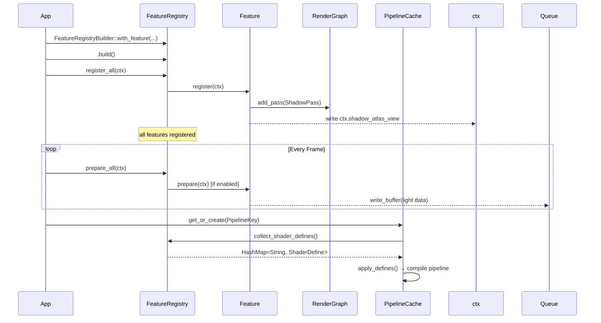
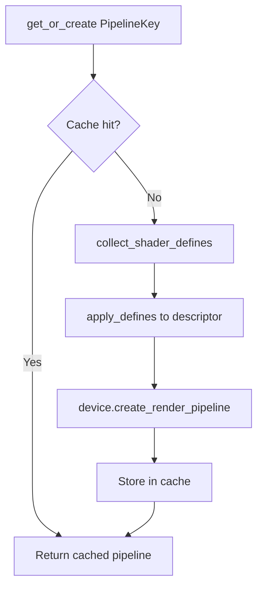
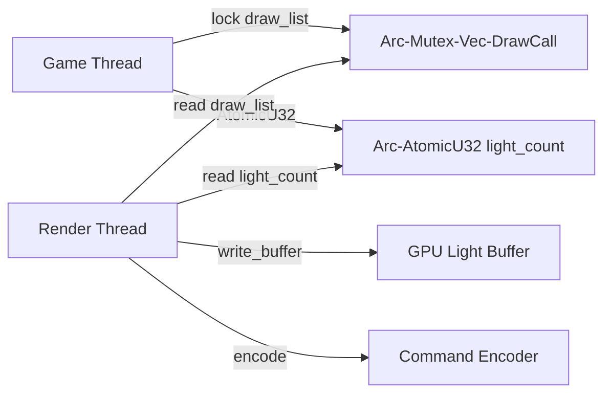

# Feature System

Helio's rendering pipeline has to accommodate a wide range of target hardware, from integrated laptop GPUs
that cannot run real-time shadows to high-end desktop cards that support volumetric clouds, radiance cascades,
and multi-draw indirect in the same frame. Historically, renderers deal with this by sprinkling `#ifdef`
guards through shader source and toggling them at startup — a pattern that works but accumulates debt quickly.
Every new feature adds more guards, more string-replacement passes, and more combinations that can silently
produce wrong output when a define is missing or misspelled. The maintenance burden grows with the square of
the feature count.

Helio takes a different approach: the **Feature System**. Each rendering capability is encapsulated in its
own Rust type that implements the `Feature` trait. That type owns its GPU resources, decides what WGSL
`override` constants it exposes, and participates in a well-defined lifecycle: register once, then prepare
each frame. The pipeline cache uses the current set of active features — expressed as a compact
`FeatureFlags` bitset — as part of every cache key, so incompatible shader variants are never mixed.
The result is a clean, composable architecture where adding a new rendering capability means writing one
new `Feature` implementation, not auditing a thousand lines of existing shader code.

## Why Specialization Constants Instead of String Injection

The original Helio prototype used shader string injection: a preprocessor pass would scan WGSL source for
tokens like `ENABLE_SHADOWS` and replace them with `true` or `false` before compilation. This works for
booleans but becomes fragile for numeric values — what does it mean to replace `BLOOM_INTENSITY` with
`0.3` in a line that already reads `let x = BLOOM_INTENSITY * 2.0;`? The replacement is purely textual and
context-free. Worse, every unique combination of values demands a separate shader compilation, meaning
cache misses proliferated whenever a float was tweaked at runtime.

WGSL's `override` declarations solve this cleanly. An `override` constant is a compile-time constant whose
value can be supplied by the host at pipeline-creation time without re-parsing the WGSL. The pipeline
specialization happens in the driver, not in Rust string code:

```wgsl
override ENABLE_SHADOWS: bool = false;
override MAX_SHADOW_LIGHTS: u32 = 0u;
override BLOOM_INTENSITY: f32 = 0.3;
override BLOOM_THRESHOLD: f32 = 1.0;
```

The host side in `pipeline/cache.rs` calls `apply_defines()`, which injects the final values from the
active feature set into the `wgpu::PipelineDescriptor`. The pipeline cache then keys on both the shader
source path and the `FeatureFlags` bitset, so the expensive compilation only happens once per unique
feature combination, not once per float tweak. Numeric parameters like `BLOOM_INTENSITY` can still be
changed at runtime — but only trigger re-compilation when they cross a boundary that changes the
`FeatureFlags` key, not on every value change.

> [!NOTE]
> wgpu exposes WGSL `override` constants through the `compilation_options` field on
> `wgpu::ProgrammableStageDescriptor`. Helio's `apply_defines()` populates this map from
> the `HashMap<String, ShaderDefine>` collected by `FeatureRegistry::collect_shader_defines`.

---

## The `Feature` Trait

Every rendering capability in Helio implements one trait defined in `features/traits.rs`:

```rust
pub trait Feature: Send + Sync + AsAny {
    fn name(&self) -> &str;
    fn register(&mut self, ctx: &mut FeatureContext) -> Result<()>;
    fn prepare(&mut self, ctx: &PrepareContext) -> Result<()>;

    fn on_state_change(&mut self, enabled: bool, ctx: &mut FeatureContext) -> Result<()> {
        Ok(())
    }
    fn shader_defines(&self) -> HashMap<String, ShaderDefine> {
        HashMap::new()
    }
    fn shader_modules(&self) -> Vec<ShaderModulePath> {
        Vec::new()
    }
    fn cleanup(&mut self, device: &wgpu::Device) {}
    fn required_device_features() -> wgpu::Features
    where
        Self: Sized,
    {
        wgpu::Features::empty()
    }
    fn is_enabled(&self) -> bool {
        true
    }
    fn set_enabled(&mut self, enabled: bool) {}
}
```

### Method Reference

| Method | When Called | Purpose |
|---|---|---|
| `name()` | Always | Stable string key used for registry lookup and log messages |
| `register()` | Once, at renderer init | Allocate GPU resources; inject passes into the render graph |
| `prepare()` | Every frame (enabled only) | Upload per-frame data (lights, matrices, parameters) to GPU |
| `on_state_change()` | When `enable()`/`disable()` is called | React to runtime toggling without full re-registration |
| `shader_defines()` | During `collect_shader_defines` | Return the WGSL `override` constants this feature controls |
| `shader_modules()` | During pipeline construction | Declare additional WGSL modules this feature needs linked |
| `cleanup()` | On renderer drop | Release any resources that need explicit cleanup |
| `required_device_features()` | Before device creation | Declare required `wgpu::Features` flags |
| `is_enabled()` / `set_enabled()` | At any time | Runtime toggle; `prepare()` is skipped when disabled |

`register()` is the most consequential method. It receives a `FeatureContext` that contains mutable
access to the `RenderGraph` and `ResourceManager`, so this is where a feature declares "I need a shadow
atlas texture" or "I need to inject a depth pre-pass before the G-buffer pass". Everything allocated
here persists for the lifetime of the renderer.

`prepare()` is called every frame for every enabled feature, in registration order. It is intentionally
lightweight — its job is to push updated CPU-side data (camera matrices, light positions, bloom
parameters) to GPU buffers that were already allocated in `register()`.

### `AsAny` and Downcasting

The `Feature` trait extends `AsAny` to allow safe downcasting from `&dyn Feature` to a concrete type:

```rust
pub trait AsAny {
    fn as_any(&self) -> &dyn std::any::Any;
    fn as_any_mut(&mut self) -> &mut dyn std::any::Any;
}
```

This is the mechanism behind `FeatureRegistry::get_typed_mut<T>`, discussed in detail in the
[Runtime Downcasting](#runtime-downcasting-with-get_typed_mut) section below.

### Platform Difference: WASM Target

On the `wasm32` target, browser WebWorkers impose different threading guarantees than native OS threads.
The `Feature` trait is therefore conditionally compiled:

```rust
#[cfg(not(target_arch = "wasm32"))]
pub trait Feature: Send + Sync + AsAny { ... }

#[cfg(target_arch = "wasm32")]
pub trait Feature: AsAny { ... }
```

The `Send + Sync` bounds are omitted on WASM because `wgpu` types like `wgpu::Device` are not `Send`
in the browser WebGPU backend. This means you cannot move feature objects across threads on WASM, but
that is acceptable because the browser runtime is single-threaded from the renderer's perspective.

> [!WARNING]
> Code that sends features to background threads using `std::thread::spawn` will silently fail to compile
> on WASM. Design features so their CPU-heavy work (mesh processing, texture decompression) happens
> outside the feature type itself if cross-thread portability matters.

---

## `ShaderDefine` — Typed Override Values

```rust
pub enum ShaderDefine {
    Bool(bool),
    U32(u32),
    F32(f32),
}
```

The three variants map directly to the WGSL types that `override` declarations support: `bool`, `u32`,
and `f32`. The `apply_defines()` function in `pipeline/cache.rs` converts each variant to the
corresponding `wgpu::PipelineOverridableConstant` value before constructing the pipeline descriptor.

Features return their defines from `shader_defines()` as a `HashMap<String, ShaderDefine>`. The keys
must exactly match the identifier names in your WGSL `override` declarations — they are case-sensitive.

```rust
fn shader_defines(&self) -> HashMap<String, ShaderDefine> {
    let mut map = HashMap::new();
    map.insert("ENABLE_BLOOM".into(),    ShaderDefine::Bool(self.enabled));
    map.insert("BLOOM_INTENSITY".into(), ShaderDefine::F32(self.intensity));
    map.insert("BLOOM_THRESHOLD".into(), ShaderDefine::F32(self.threshold));
    map
}
```

> [!TIP]
> Keep shader define names SCREAMING_SNAKE_CASE to visually distinguish them from regular WGSL variables.
> The convention makes it obvious at a glance which identifiers are specialization constants.

---

## Feature Lifecycle

Understanding the lifecycle is essential before writing your own feature. Here is the sequence from
renderer initialization through frame rendering:



### Registration Order

Features are registered in the order they were added to the builder. This matters because some features
depend on outputs written to `FeatureContext` by earlier features. For example, the shadow atlas texture
view (`ctx.shadow_atlas_view`) is written by `ShadowsFeature::register()`. Any feature that needs to
sample the shadow atlas in its pass must be registered *after* `ShadowsFeature`.

The canonical registration order used by the default Helio renderer is:

1. `LightingFeature` — establishes `ctx.light_buffer`
2. `ShadowsFeature` — establishes `ctx.shadow_atlas_view` and `ctx.shadow_sampler`
3. `RadianceCascadesFeature` — establishes `ctx.rc_cascade0_view` and `ctx.rc_world_bounds`
4. `BloomFeature` — no context outputs; depends on nothing
5. `BillboardsFeature` — no context outputs; depends on nothing
6. `GpuPreprocessingFeature` — depends on the draw list infrastructure from earlier features
7. `SdfFeature` — consumes `ctx.rc_cascade0_view` for GI lookups

> [!IMPORTANT]
> Registering features out of order when there are `FeatureContext` output dependencies will cause a
> `None` dereference panic at register time, not at runtime. The failure is loud and immediate, but
> the error message may not clearly indicate which dependency is missing. Check the canonical order
> above if you encounter a panic inside `register()`.

### Runtime Enable / Disable

After initialization, individual features can be toggled:

```rust
registry.disable("bloom")?;
// ... later ...
registry.enable("bloom")?;
```

Both methods call `on_state_change(enabled, ctx)` on the feature. The default implementation is a
no-op, but features that allocate transient GPU resources can use this hook to release them when
disabled and re-allocate when re-enabled, avoiding wasted VRAM on inactive effects.

> [!NOTE]
> Disabling a feature does not remove its render graph passes. The passes simply receive no work
> (empty draw lists, zero light counts) when the feature is disabled. This design avoids the cost
> of rebuilding the render graph on every toggle.

---

## `FeatureContext` — What Features Receive at Registration

`FeatureContext` is a large struct that aggregates every shared resource a feature might need during
its one-time setup:

```rust
pub struct FeatureContext<'a> {
    // Core wgpu handles
    pub device: &'a wgpu::Device,
    pub queue: &'a wgpu::Queue,
    pub device_arc: Arc<wgpu::Device>,
    pub queue_arc: Arc<wgpu::Queue>,
    pub surface_format: wgpu::TextureFormat,

    // Render graph (features add passes here)
    pub graph: &'a mut RenderGraph,
    pub resources: &'a mut ResourceManager,

    // Shared draw infrastructure
    pub draw_list: Arc<Mutex<Vec<DrawCall>>>,
    pub instance_data_buffer: &'a wgpu::Buffer,
    pub pool_vertex_buffer: SharedPoolBuffer,
    pub pool_index_buffer: SharedPoolBuffer,
    pub shared_draw_call_buf: Arc<Mutex<Option<Arc<wgpu::Buffer>>>>,
    pub shared_material_ranges: Arc<Mutex<Vec<MaterialRange>>>,
    pub has_multi_draw: bool,

    // Shadow infrastructure
    pub shadow_matrix_buffer: Arc<wgpu::Buffer>,
    pub light_count_arc: Arc<AtomicU32>,
    pub light_face_counts: Arc<Mutex<Vec<u8>>>,
    pub shadow_cull_lights: Arc<Mutex<Vec<ShadowCullLight>>>,

    // Outputs written by features during register():
    pub light_buffer: Option<Arc<wgpu::Buffer>>,
    pub shadow_atlas_view: Option<Arc<wgpu::TextureView>>,
    pub shadow_sampler: Option<Arc<wgpu::Sampler>>,
    pub rc_cascade0_view: Option<Arc<wgpu::TextureView>>,
    pub rc_world_bounds: Option<([f32; 3], [f32; 3])>,
}
```

The `Option<…>` output fields at the bottom of the struct are the inter-feature communication channel.
A feature that produces a resource writes an `Arc`-wrapped handle into the appropriate field. Later
features read from these fields during their own `register()` call. Because registration is sequential
and single-threaded, there are no data races on these fields — the `Option` is simply `None` until the
producing feature has run.

<!-- screenshot: FeatureContext dependency diagram showing arrows from LightingFeature → light_buffer, ShadowsFeature → shadow_atlas_view+shadow_sampler, RadianceCascadesFeature → rc_cascade0_view -->

---

## `PrepareContext` — Per-Frame Data

Each frame, enabled features receive a slimmer context containing only what is needed for per-frame
uploads:

```rust
pub struct PrepareContext<'a> {
    pub device: &'a wgpu::Device,
    pub queue: &'a wgpu::Queue,
    pub resources: &'a ResourceManager,
    pub frame: u64,
    pub delta_time: f32,
    pub camera: &'a Camera,
}
```

The `frame` counter is useful for effects that need temporal data (TAA, radiance cascade history).
`delta_time` drives time-based animations like animated clouds or flickering lights. The `camera`
provides the current view/projection matrices needed to compute shadow frusta, cascade bounds, and
probe positions.

Crucially, `PrepareContext` provides only *immutable* access to `resources`. The render graph
topology and GPU resource allocations are frozen after registration; `prepare()` is only allowed to
*write data* into already-allocated buffers, not create new ones.

---

## `FeatureRegistry`

The registry is the central store that holds all feature objects and mediates their lifecycle:

```rust
pub struct FeatureRegistry {
    features: HashMap<String, Box<dyn Feature>>,
    active_flags: FeatureFlags,
}
```

### `FeatureFlags` Bitset

```rust
bitflags! {
    pub struct FeatureFlags: u32 {
        const SHADOWS           = 1 << 0;
        const IBL               = 1 << 1;
        const BLOOM             = 1 << 2;
        const VOLUMETRIC_CLOUDS = 1 << 3;
        const PROCEDURAL_SKY    = 1 << 4;
        const BILLBOARDS        = 1 << 5;
    }
}
```

`FeatureFlags` is the compact representation of the active feature set used as part of the
`PipelineKey`. Every combination of enabled features produces a distinct `u32` value, so the pipeline
cache can determine in O(1) whether a compiled variant already exists for the current configuration.

### `collect_shader_defines` and Safe-Off Defaults

Before calling `shader_defines()` on any feature, the registry pre-populates a set of **safe-off
defaults** — values that disable every optional feature in the shader:

| Define | Default |
|---|---|
| `ENABLE_LIGHTING` | `Bool(false)` |
| `ENABLE_SHADOWS` | `Bool(false)` |
| `MAX_SHADOW_LIGHTS` | `U32(0)` |
| `ENABLE_BLOOM` | `Bool(false)` |
| `BLOOM_INTENSITY` | `F32(0.3)` |
| `BLOOM_THRESHOLD` | `F32(1.0)` |

Then each registered feature's `shader_defines()` map is overlaid on top. Because the overlay happens
in registration order, later features can in principle override earlier ones, but in practice each
define is owned by exactly one feature.

This design means that even if a feature is disabled, its WGSL `override` constants are still defined
in every pipeline — they just resolve to their off-state values. There are no `#ifdef`-style branches
that could accidentally leave a constant undefined and trigger a pipeline compilation error.

### The Builder API

```rust
let registry = FeatureRegistry::builder()
    .with_feature(LightingFeature::new())
    .with_feature(
        ShadowsFeature::builder()
            .with_atlas_size(4096)
            .with_max_lights(20)
            .build()
    )
    .with_feature(BloomFeature::builder().with_intensity(0.5).build())
    .with_feature(BillboardsFeature::new())
    .build();
```

`FeatureRegistryBuilder::with_feature` takes any `impl Feature + 'static`, boxes it, and appends it
to an ordered list. Calling `.build()` moves those boxes into the `HashMap` keyed by each feature's
`name()`, in insertion order. Registration order is preserved for `register_all()` and `prepare_all()`.

### Runtime Downcasting with `get_typed_mut`

Because features are stored as `Box<dyn Feature>`, direct field access is impossible through the trait
object. The `AsAny` mechanism enables safe downcasting back to the concrete type:

```rust
// Adjust bloom intensity at runtime without re-registering
if let Some(bloom) = registry.get_typed_mut::<BloomFeature>("bloom") {
    bloom.intensity = 0.8;
}
```

The implementation is straightforward:

```rust
pub fn get_typed_mut<T: Feature + 'static>(&mut self, name: &str) -> Option<&mut T> {
    self.features
        .get_mut(name)?
        .as_any_mut()
        .downcast_mut::<T>()
}
```

This is safe because `downcast_mut` returns `None` rather than producing undefined behavior when the
concrete type does not match `T`. The string key provides an additional layer of protection — if the
name is wrong, the first `?` short-circuits before the downcast is attempted.

> [!WARNING]
> Do not call `get_typed_mut` during `prepare_all` by holding a separate reference to the registry
> from within a feature's `prepare()` method. The registry owns all features; taking a mutable
> reference to one while iterating the others would require two simultaneous mutable borrows, which
> the borrow checker will reject at compile time.

---

## Pipeline Cache Integration

The pipeline cache in `pipeline/cache.rs` uses a compound key to deduplicate compiled shader variants:

```rust
struct PipelineKey {
    shader_id: String,
    features: FeatureFlags,
    variant: PipelineVariant,
}
```

`PipelineVariant` covers every distinct pipeline topology Helio uses:

```
GBufferWrite | DeferredLighting | Shadow | Sky | Transparent |
Billboard | DebugDraw | Bloom | Fxaa | Smaa | Taa | …
```

When `get_or_create` is called, it checks the cache. On a miss it:

1. Calls `registry.collect_shader_defines()` to get the full `HashMap<String, ShaderDefine>`.
2. Calls `apply_defines()` to inject those values into the pipeline descriptor's
   `compilation_options.constants` map.
3. Compiles the pipeline and stores it under the key.

On a hit, the compiled `wgpu::RenderPipeline` is returned immediately without any shader work.
`set_active_features(flags)` updates the flags stored in the cache; this is called whenever a feature
is enabled or disabled, invalidating future lookups for affected keys.



---

## Built-In Features

### `LightingFeature`

The lighting feature is the foundation of the lighting model. Without it, the G-buffer deferred
lighting pass has no light data and renders everything as unlit black.

During `register()`, it allocates a GPU storage buffer large enough for 2048 `GpuLight` entries. Each
`GpuLight` is a tightly packed 64-byte structure:

```rust
struct GpuLight {
    position:   [f32; 3],
    light_type: f32,      // 0=point, 1=spot, 2=directional
    direction:  [f32; 3],
    range:      f32,
    color:      [f32; 3],
    intensity:  f32,
    cos_inner:  f32,
    cos_outer:  f32,
    _pad:       [f32; 2],
}
```

The 64-byte size is deliberate: it aligns to a cache line on most GPUs, avoiding partial-line fetches
when the lighting shader iterates over the light array.

Shader define injected: `ENABLE_LIGHTING = Bool(true)`.
Context output written: `ctx.light_buffer`.

<!-- screenshot: RenderDoc capture showing the light storage buffer in the deferred lighting pass bind group -->

### `ShadowsFeature`

Shadow rendering in Helio uses a **Texture2DArray depth atlas** — all shadow maps for all shadow-casting
lights share a single texture, with each layer corresponding to one cube face of one light. This avoids
the bind group explosion that occurs when every light has its own shadow map.

```
DEFAULT_SHADOW_ATLAS_SIZE  = 2048
DEFAULT_MAX_SHADOW_LIGHTS  = 40
MAX_ATLAS_LAYERS           = 256   (conservative GPU minimum)
ABSOLUTE_MAX_LIGHTS        = 256 / 6 = 42
```

The depth atlas is a `Texture2DArray` of dimensions `size × size × (max_lights * 6)`. A comparison
sampler is created alongside it for hardware PCF (Percentage Closer Filtering).

`ShadowsFeature` also injects a `ShadowPass` into the render graph, which runs before the G-buffer
pass and renders the scene geometry from each light's perspective.

Shader defines injected: `ENABLE_SHADOWS = Bool(true)`, `MAX_SHADOW_LIGHTS = U32(n)`.
Context outputs written: `ctx.shadow_atlas_view`, `ctx.shadow_sampler`.

Builder API:

```rust
ShadowsFeature::builder()
    .with_atlas_size(4096)   // larger atlas = sharper shadows, more VRAM
    .with_max_lights(16)     // max simultaneously shadowing lights
    .build()
```

> [!TIP]
> For mobile or integrated GPU targets, `with_atlas_size(1024).with_max_lights(4)` dramatically
> reduces shadow VRAM from ~192 MB to ~12 MB for RGBA32F-equivalent depth formats.

### `BloomFeature`

Bloom applies a luminance threshold and then a multi-pass separable Gaussian blur to bright pixels,
blending the result back over the HDR buffer before tone-mapping. The feature itself is unusually
lightweight in its `register()` implementation — it only logs that it has been registered. The actual
bloom render passes are created during renderer initialization, not inside the feature. The feature's
primary role is to own the `BLOOM_*` shader defines and provide a runtime API for adjusting parameters.

```rust
BloomFeature::builder()
    .with_intensity(0.5)   // additive blend weight, clamped to [0.0, 2.0]
    .with_threshold(0.8)   // luminance cutoff for bright-pass filter
    .build()
```

Shader defines injected: `ENABLE_BLOOM`, `BLOOM_INTENSITY`, `BLOOM_THRESHOLD`.

<!-- screenshot: Split-screen comparison of scene with bloom disabled vs bloom enabled at intensity=0.5, threshold=0.8 -->

### `RadianceCascadesFeature`

This is the most complex built-in feature. Radiance cascades provide indirect diffuse global
illumination by maintaining a 4-level cascade of 2D radiance probes over the scene. Each cascade
level covers a larger spatial extent but stores lower-directional-resolution radiance:

```
CASCADE_COUNT = 4
PROBE_DIMS    = [16, 8, 4, 2]      probes per axis per cascade
DIR_DIMS      = [4, 8, 16, 32]     directional samples per probe per cascade
T_MAXS        = [0.5, 1.0, 2.0, 1000.0]  metres, ray march distance
ATLAS_W       = 64
ATLAS_HEIGHTS = [1024, 512, 256, 128]
```

Two sets of textures are maintained — `output_textures` (current frame) and `history_textures`
(previous frame) — for temporal accumulation. The feature reads `ctx.rc_cascade0_view` from its own
output to feed back into the deferred lighting pass.

For open-world scenes, the cascade can follow the camera:

```rust
RadianceCascadesFeature::builder()
    .with_world_bounds([-500.0, -10.0, -500.0], [500.0, 200.0, 500.0])
    .with_camera_follow([100.0, 50.0, 100.0])  // half-extents for follow region
    .build()
```

Context outputs written: `ctx.rc_cascade0_view`, `ctx.rc_world_bounds`.

> [!NOTE]
> `sky_color` is updated each frame from the renderer via `get_typed_mut::<RadianceCascadesFeature>`,
> allowing the sky contribution to GI to change dynamically with time-of-day lighting.

### `BillboardsFeature`

Billboards render camera-facing quads — useful for particles, vegetation impostors, debug markers,
and UI-in-world elements. The feature maintains a **persistent registry** of billboard instances, each
identified by a `BillboardId`:

```rust
struct BillboardInstance {
    position:     [f32; 3],
    scale:        [f32; 2],
    color:        [f32; 4],
    screen_scale: bool,   // if true, scale is in screen pixels not world units
}
```

The persistent registry keeps billboard data in sync between CPU and the GPU upload buffer without
requiring a full rebuild each frame:

```rust
let id: BillboardId = feature.add_billboard_persistent(BillboardInstance { ... });
feature.move_billboard(id, [10.0, 2.0, 5.0]);
feature.update_billboard_persistent(id, new_instance);
feature.remove_billboard_persistent(id);
```

The GPU representation packs the data into a 48-byte aligned `GpuBillboardInstance` structure to
satisfy WGSL storage buffer alignment requirements.

### `GpuPreprocessingFeature`

This feature provides GPU-driven rendering infrastructure: a compute pass that performs frustum
culling, generates indirect draw commands, and optionally sorts draw calls by material. It consumes a
`PreprocessInput` carrying scene geometry data and writes out a filled indirect draw buffer that the
main G-buffer pass consumes without any CPU readback.

Registering this feature enables the `has_multi_draw` path in the context, which lets other features
(particularly `BillboardsFeature` and the main geometry pass) use `draw_indexed_indirect` instead of
issuing individual draw calls.

### `SdfFeature`

The SDF feature manages a signed-distance field volume used for screen-space ambient occlusion, soft
contact shadows, and collision queries. It integrates with the radiance cascades feature by consuming
`ctx.rc_cascade0_view` for GI-aware occlusion. Full coverage of the SDF system is in its own
dedicated documentation page.

---

## Writing a Custom Feature

The following worked example implements a screen-space fog feature that adds an exponential height
fog overlay to the final composite pass.

### 1. Define the Feature Struct

```rust
use helio::features::{Feature, FeatureContext, PrepareContext, ShaderDefine, AsAny};
use std::collections::HashMap;

pub struct HeightFogFeature {
    enabled:     bool,
    density:     f32,
    height_falloff: f32,
    fog_color:   [f32; 3],
    fog_buffer:  Option<Arc<wgpu::Buffer>>,
}

impl HeightFogFeature {
    pub fn new(density: f32, height_falloff: f32) -> Self {
        Self {
            enabled: true,
            density,
            height_falloff,
            fog_color: [0.7, 0.8, 0.9],
            fog_buffer: None,
        }
    }
}
```

### 2. Implement `AsAny`

```rust
impl AsAny for HeightFogFeature {
    fn as_any(&self) -> &dyn std::any::Any { self }
    fn as_any_mut(&mut self) -> &mut dyn std::any::Any { self }
}
```

### 3. Implement `Feature`

```rust
impl Feature for HeightFogFeature {
    fn name(&self) -> &str { "height_fog" }

    fn register(&mut self, ctx: &mut FeatureContext) -> Result<()> {
        // Allocate a small uniform buffer for fog parameters
        let buf = ctx.device.create_buffer(&wgpu::BufferDescriptor {
            label: Some("HeightFog Uniforms"),
            size: 32,
            usage: wgpu::BufferUsages::UNIFORM | wgpu::BufferUsages::COPY_DST,
            mapped_at_creation: false,
        });
        self.fog_buffer = Some(Arc::new(buf));

        // Inject a composite post-process pass into the render graph
        ctx.graph.add_pass(HeightFogPass::new(
            self.fog_buffer.clone().unwrap(),
        ));
        Ok(())
    }

    fn prepare(&mut self, ctx: &PrepareContext) -> Result<()> {
        if let Some(buf) = &self.fog_buffer {
            let data: [f32; 8] = [
                self.density, self.height_falloff,
                self.fog_color[0], self.fog_color[1], self.fog_color[2],
                0.0, 0.0, 0.0, // padding
            ];
            ctx.queue.write_buffer(buf, 0, bytemuck::cast_slice(&data));
        }
        Ok(())
    }

    fn shader_defines(&self) -> HashMap<String, ShaderDefine> {
        let mut m = HashMap::new();
        m.insert("ENABLE_HEIGHT_FOG".into(), ShaderDefine::Bool(self.enabled));
        m.insert("FOG_DENSITY".into(),       ShaderDefine::F32(self.density));
        m.insert("FOG_HEIGHT_FALLOFF".into(), ShaderDefine::F32(self.height_falloff));
        m
    }

    fn shader_modules(&self) -> Vec<String> {
        vec!["shaders/height_fog.wgsl".into()]
    }

    fn is_enabled(&self) -> bool { self.enabled }

    fn set_enabled(&mut self, enabled: bool) {
        self.enabled = enabled;
    }

    fn on_state_change(&mut self, enabled: bool, _ctx: &mut FeatureContext) -> Result<()> {
        self.enabled = enabled;
        Ok(())
    }

    fn cleanup(&mut self, _device: &wgpu::Device) {
        self.fog_buffer = None;
    }
}
```

### 4. Add the WGSL Overrides

In `shaders/height_fog.wgsl`:

```wgsl
override ENABLE_HEIGHT_FOG:  bool  = false;
override FOG_DENSITY:        f32   = 0.01;
override FOG_HEIGHT_FALLOFF: f32   = 0.1;

fn apply_height_fog(color: vec3<f32>, world_pos: vec3<f32>) -> vec3<f32> {
    if !ENABLE_HEIGHT_FOG { return color; }
    let fog_amount = 1.0 - exp(-FOG_DENSITY * exp(-FOG_HEIGHT_FALLOFF * world_pos.y));
    return mix(color, fog_uniforms.color.rgb, clamp(fog_amount, 0.0, 1.0));
}
```

### 5. Register with the Builder

```rust
let registry = FeatureRegistry::builder()
    .with_feature(LightingFeature::new())
    .with_feature(ShadowsFeature::new())
    .with_feature(HeightFogFeature::new(0.02, 0.15))
    .build();
```

<!-- screenshot: Scene with height fog applied, showing exponential falloff from ground level -->

---

## Thread Safety Considerations

On native targets, the `Send + Sync` bounds on `Feature` mean that the registry itself can be moved
across threads. In practice, Helio uses a single render thread that owns the registry throughout the
application lifetime. The shared resources (light buffer, draw list, shadow matrices) are wrapped in
`Arc<Mutex<…>>` or `Arc<AtomicU32>` so that the game-logic thread can submit draw calls and update
light data concurrently while the render thread is encoding commands.

The pattern for cross-thread updates is:

```rust
// Game thread
{
    let mut list = ctx.draw_list.lock().unwrap();
    list.push(DrawCall { mesh_id, material_id, transform });
}

// Render thread — in LightingFeature::prepare()
let count = self.light_count.load(Ordering::Acquire);
queue.write_buffer(&self.light_buffer, 0, &light_data[..count]);
```

`Arc<AtomicU32>` is used for the light count because it avoids a full mutex lock on the hot path
where lights are being counted during scene traversal.

> [!IMPORTANT]
> Never hold a `Mutex` lock across a `queue.write_buffer` or `queue.submit` call. The wgpu queue
> operations may internally acquire locks of their own, and holding an application-level lock across
> them risks deadlock with the wgpu device timeline.



---

## Frequently Asked Questions

**Q: Can I register a feature after `register_all` has been called?**

No. The render graph is frozen after `register_all`. Adding passes after that point is not supported.
If you need conditional features, register them all upfront and use `enable()`/`disable()` at runtime
to suppress their `prepare()` work.

**Q: What happens if two features inject the same shader define?**

The last feature to run in `collect_shader_defines` wins, because each feature's map is overlaid in
registration order. In practice, each define should be owned by exactly one feature. If you see
unexpected shader behavior, check `collect_shader_defines` output with a debug print to verify which
value is being applied.

**Q: Can `shader_modules()` return modules that import other modules?**

Yes. wgpu resolves WGSL module imports transitively. List only the top-level entry-point modules that
your feature adds; the pipeline compiler will pull in their transitive dependencies.

**Q: How do I access another feature's data from within a feature's `prepare()`?**

You cannot — `prepare()` receives only `PrepareContext`, which does not reference the registry. Use
`Arc`-wrapped shared state that both features hold references to (established during `register()`)
for inter-feature communication at frame time.

**Q: Does disabling a feature free its VRAM?**

Not automatically. The default `on_state_change` is a no-op. Override it to free and reallocate
GPU resources if VRAM conservation is important for your target platform.
