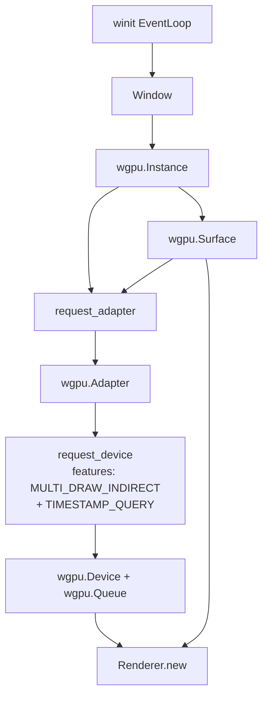
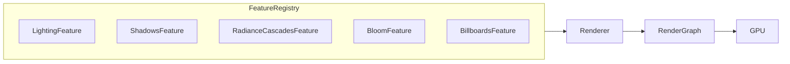
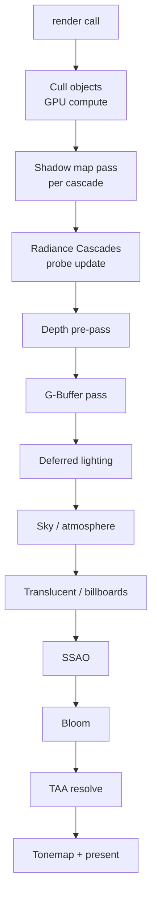

# Getting Started with Helio

Helio is a real-time, GPU-driven renderer built on top of [wgpu](https://wgpu.rs/) (version 28). It is designed as a research and experimentation platform for modern rendering techniques — radiance cascades, volumetric atmospheres, signed-distance-field primitives, temporal anti-aliasing, screen-space ambient occlusion, and much more — all composable through a feature registry rather than a monolithic pipeline. Unlike most renderers that bake every technique into a single draw call submission loop, Helio separates *what* you render from *how* you render it: the render graph decides pass ordering and resource lifetimes while individual `Feature` implementations contribute their own passes independently. If you need a renderer that you can extend one technique at a time, profile at the GPU pass level with zero runtime overhead in release builds, and run on everything from a native desktop to a Chrome tab to an Android phone, Helio is a strong starting point.

> [!NOTE]
> Helio is an experimental crate. Public APIs may change between commits. Pin to a specific revision in your `Cargo.toml` if you need stability.

---

## 1. Prerequisites

Before you can build or run anything, make sure your environment satisfies the following requirements.

### 1.1 Rust Toolchain

Helio requires the **stable** Rust toolchain, version 1.78 or newer (the `async fn` in trait stabilisation and improved WGSL shader error messages both depend on recent stable releases). Install or update via rustup:

```bash
rustup update stable
rustup default stable
```

For WASM targets you also need the `wasm32-unknown-unknown` target and, optionally, `wasm-pack` or the `wasm-bindgen-cli` tools installed by the `build-wasm` scripts:

```bash
rustup target add wasm32-unknown-unknown
cargo install wasm-bindgen-cli   # only if you call wasm-bindgen manually
```

For Android you need the `aarch64-linux-android` target and `cargo-apk`:

```bash
rustup target add aarch64-linux-android
cargo install cargo-apk
```

### 1.2 GPU Requirements

Helio relies on `wgpu` for cross-platform GPU access and maps to a native backend automatically at runtime.

| Platform | Backend | Minimum requirement |
|---|---|---|
| Windows | DirectX 12 or Vulkan | D3D feature level 12.0 / Vulkan 1.1 |
| Linux | Vulkan | Vulkan 1.1 |
| macOS / iOS | Metal | Metal 2 (macOS 10.14+) |
| Android | Vulkan | Vulkan 1.1, `aarch64-linux-android` |
| Browser | WebGPU | Chrome 113+ (desktop recommended) |

> [!WARNING]
> The renderer requests `wgpu::Features::MULTI_DRAW_INDIRECT` and `wgpu::Features::TIMESTAMP_QUERY` unconditionally. Older integrated GPUs on Windows may support DX12 but not multi-draw-indirect; check `adapter.features()` before creating your device if you need a graceful fallback.

### 1.3 wgpu Version

Helio targets **wgpu 28**. If you add helio as a workspace dependency alongside other crates that depend on wgpu, make sure they all resolve to the same major version — otherwise Cargo will duplicate the wgpu dependency and you will get linker errors from two conflicting global GPU state objects.

---

## 2. Cloning the Repository

```bash
git clone https://github.com/your-org/helio.git
cd helio
```

The repository root is a Cargo workspace. You do not need to `cd` into any subdirectory to build or run examples.

---

## 3. Workspace Structure

Understanding where things live saves a lot of `grep`-ing later.

```
helio/
├── crates/
│   ├── helio-core/          # Backend-agnostic math, camera, scene graph primitives
│   ├── helio-render-v2/     # The renderer itself: render graph, features, wgpu integration
│   ├── helio-live-portal/   # Optional web dashboard for real-time GPU profiling
│   ├── examples/            # All runnable demo binaries (see §4)
│   ├── helio-wasm-app/      # Thin wasm wrapper wired to helio-render-v2
│   └── helio-wasm-examples/ # Browser-runnable versions of selected examples
├── build-wasm.ps1           # Windows WASM build script
├── build-wasm.sh            # Unix WASM build script
└── Cargo.toml               # Workspace manifest
```

The workspace `Cargo.toml` pins shared dependency versions so every member crate agrees on `glam`, `winit`, `bytemuck`, and `wgpu`:

```toml
[workspace.dependencies]
bytemuck = { version = "1", features = ["derive"] }
glam     = { version = "0.29", features = ["bytemuck"] }
winit    = "0.30.12"
env_logger = "0.11"
log      = "0.4"
```

Your integration crate should inherit these versions by depending on `helio-render-v2` from path or crates.io, and adding `glam` and `winit` as workspace dependencies yourself to avoid a version mismatch.

> [!TIP]
> The `helio-live-portal` crate has a compile-time guard: it is excluded from the `wasm32` target in its own `build.rs`. Never add it as a dependency in a crate that also targets WASM — you will get a compile error from the native OS networking code.

---

## 4. Running the Bundled Examples

Helio ships a large suite of example binaries inside `crates/examples/`. The two most useful starting points are the sky example — which exercises nearly every rendering feature simultaneously — and the basic example, which is a clean minimal scene you can use as a template.

### 4.1 The Sky Example

```bash
cargo run --example render_v2_sky --release
```

This opens a window showing a procedurally-generated atmosphere with time-of-day control, volumetric clouds, radiance cascade global illumination, and a collection of debug billboards marking light probe positions.

<!-- screenshot: render_v2_sky running at noon, showing blue sky with clouds and terrain -->

### 4.2 The Basic Example

```bash
cargo run --example render_v2_basic --release
```

A stripped-down scene: a single directional light, a flat ground plane, and a handful of mesh objects. Good reference for understanding the minimal surface area of the API.

<!-- screenshot: render_v2_basic showing lit ground plane and simple meshes -->

### 4.3 All Available Examples

| Example name | What it demonstrates |
|---|---|
| `render_v2_sky` | Full atmosphere, clouds, TAA, RC probes, billboards |
| `render_v2_basic` | Minimal scene, single light, no post-processing |
| `indoor_cathedral` | High-contrast interior lighting, SSAO, bloom |
| `indoor_corridor` | Long-occlusion SSAO stress test |
| `indoor_room` | Emissive materials, soft shadows |
| `indoor_server_room` | Many point lights, instanced geometry |
| `outdoor_canyon` | Terrain mesh, directional shadows, fog |
| `outdoor_city` | Large instance count, LOD stress |
| `outdoor_night` | Point and spot lights, no sun |
| `outdoor_volcano` | Emissive terrain, heat-haze distortion |
| `light_benchmark` | Hundreds of dynamic lights, GPU timing readback |
| `rc_benchmark` | Radiance cascades probe density stress test |
| `sdf_demo` | Signed-distance-field primitive rendering |
| `sdf_demos_common` | Shared SDF scene helpers (library, not a binary) |
| `space_station` | Metallic PBR materials, IBL |
| `debug_shapes` | All `DebugShape` variants rendered together |
| `ao_aa_demo` | SSAO radius / TAA blend factor tuning |
| `demo_portal` | Live-portal dashboard integration demo |

> [!TIP]
> Pass `-- 4` as a runtime argument (or press `4` while running) to print per-pass GPU timing to stderr. This is the fastest way to find which render pass is costing the most on your hardware.

### 4.4 Sky Example Controls

| Key / Action | Effect |
|---|---|
| `W` | Move forward |
| `A` | Strafe left |
| `S` | Move backward |
| `D` | Strafe right |
| `Space` | Move up |
| `Left Shift` | Move down |
| `Q` | Rotate sun backwards (earlier time of day) |
| `E` | Rotate sun forwards (later time of day) |
| Mouse drag | Look around (click window to grab cursor) |
| `3` | Toggle radiance-cascade probe visualisation |
| `4` | Toggle GPU timing printout to stderr |
| `Escape` | Release cursor / exit |

---

## 5. Setting Up wgpu

Helio does not create or own a `wgpu::Device`. You create it, you own it, and you pass references into the renderer. This is intentional: it lets you share the same device between Helio and your own wgpu render passes.

The flow from window to device looks like this:



Here is the complete wgpu initialisation pattern taken from the example crates:

```rust
use winit::{
    application::ApplicationHandler,
    event::*,
    event_loop::{ActiveEventLoop, EventLoop},
    window::Window,
};

// Create the wgpu instance, asking for all available backends so wgpu
// picks the best one for the current platform automatically.
let instance = wgpu::Instance::new(&wgpu::InstanceDescriptor {
    backends: wgpu::Backends::all(),
    ..Default::default()
});

// Create the surface from the winit window. This must happen before
// adapter selection so wgpu can filter adapters by surface compatibility.
let surface = instance.create_surface(&window)?;

// Request a high-performance adapter that can render to our surface.
let adapter = instance
    .request_adapter(&wgpu::RequestAdapterOptions {
        power_preference: wgpu::PowerPreference::HighPerformance,
        compatible_surface: Some(&surface),
        force_fallback_adapter: false,
    })
    .await
    .expect("No suitable GPU adapter found");

// Request the device, explicitly enabling the two features Helio needs.
let (device, queue) = adapter
    .request_device(
        &wgpu::DeviceDescriptor {
            label: Some("helio-device"),
            required_features: wgpu::Features::MULTI_DRAW_INDIRECT
                | wgpu::Features::TIMESTAMP_QUERY,
            required_limits: wgpu::Limits::default(),
            memory_hints: wgpu::MemoryHints::Performance,
        },
        None, // trace path
    )
    .await?;
```

> [!IMPORTANT]
> You **must** request `wgpu::Features::MULTI_DRAW_INDIRECT`. Helio's GPU-driven culling pass batches all draw calls into a single indirect buffer and submits them with one `multi_draw_indirect` call. If this feature is absent the renderer will panic when it tries to record the indirect draw command.

---

## 6. Building a FeatureRegistry

The `FeatureRegistry` is how you tell Helio which rendering systems to activate. Features are composable: each one registers its own render passes with the render graph, allocates its own GPU resources, and integrates into the lighting / post-processing pipeline without touching the others.



Build the registry with the fluent builder pattern:

```rust
use helio_render_v2::features::{
    FeatureRegistry,
    LightingFeature,
    ShadowsFeature,
    BloomFeature,
    BillboardsFeature,
    RadianceCascadesFeature,
};

let features = FeatureRegistry::builder()
    // LightingFeature is mandatory — it produces the base lit colour buffer
    // that all other post-process features read from.
    .with_feature(LightingFeature::new())

    // ShadowsFeature adds a cascaded shadow map pass for directional lights.
    .with_feature(ShadowsFeature::new())

    // RadianceCascadesFeature adds 2-D irradiance probe GI. The world_bounds
    // define the axis-aligned box within which probes are placed. Extend this
    // to cover your full scene; probes outside the box receive no GI.
    .with_feature(
        RadianceCascadesFeature::new()
            .with_world_bounds([-10.0, -0.3, -10.0], [10.0, 8.0, 10.0]),
    )

    // BloomFeature adds a physically-based bloom pass. intensity controls
    // the luminance threshold multiplier; 0.4 is a good default.
    .with_feature(BloomFeature::new().with_intensity(0.4))

    // BillboardsFeature renders camera-facing sprites at world positions.
    // Provide a raw RGBA8 sprite sheet and its per-sprite dimensions.
    .with_feature(BillboardsFeature::new(
        &device,
        &queue,
        sprite_rgba,  // &[u8]
        sprite_w,     // u32
        sprite_h,     // u32
    ))

    .build();
```

> [!NOTE]
> Feature ordering within the builder matters for pass scheduling: passes are inserted into the render graph in the order features are registered. For most combinations the framework resolves data-flow dependencies automatically, but if you write a custom feature that reads the output of `BloomFeature`, register your custom feature *after* `BloomFeature`.

---

## 7. Creating a RendererConfig

`RendererConfig` bundles the surface dimensions, surface format, feature registry, and optional post-processing configuration:

```rust
use helio_render_v2::{RendererConfig, AntiAliasingMode, SsaoConfig, TaaConfig};

let config = RendererConfig::new(
    width,          // u32 — initial surface pixel width
    height,         // u32 — initial surface pixel height
    surface_format, // wgpu::TextureFormat from surface.get_preferred_format(&adapter)
    features,       // FeatureRegistry built in §6
)
// Enable screen-space ambient occlusion with default settings.
.with_ssao()

// Or pass a custom SSAO configuration.
// .with_ssao_config(SsaoConfig {
//     radius: 0.5,
//     bias:   0.025,
//     power:  1.5,
// })

// Select the anti-aliasing mode. TAA is strongly recommended for scenes
// with fine geometry or thin shadow maps.
.with_aa(AntiAliasingMode::Taa)

// Fine-tune TAA if needed.
// .with_taa_config(TaaConfig {
//     blend_factor:      0.1,
//     motion_rejection:  true,
//     sharpen:           0.3,
// })
;
```

The full set of `RendererConfig` builder methods:

| Method | Description |
|---|---|
| `new(w, h, fmt, features)` | Required constructor |
| `with_ssao()` | Enable SSAO with defaults |
| `with_ssao_config(cfg)` | Enable SSAO with custom `SsaoConfig` |
| `with_aa(mode)` | Set AA mode (`None`, `Fxaa`, `Taa`) |
| `with_taa_config(cfg)` | Override TAA parameters |

---

## 8. Initialising the Renderer

`Renderer::new` is an `async` function. It compiles all WGSL shaders, allocates GPU buffers, and registers render-graph passes for every feature in the registry. On a modern desktop GPU this typically completes in under 200 ms; the first few frames may be slower while the driver finishes JIT-compiling pipeline state objects in the background.

```rust
use helio_render_v2::{Renderer, RendererConfig};

// Renderer::new must be awaited. In a winit ApplicationHandler you'll
// typically do this inside an async block driven by pollster or tokio.
let mut renderer = Renderer::new(&device, &queue, config).await?;
```

> [!NOTE]
> In desktop examples Helio uses [`pollster::block_on`](https://docs.rs/pollster) to drive the async initialisation from a synchronous `main`. In WASM the `wasm-bindgen-futures` executor is used instead. Both are thin async executors — Helio does not pull in tokio or async-std.

The lifecycle of a `Renderer` matches the surface it was configured for. If the surface is destroyed and recreated (e.g., the user moves the window to a different monitor with a different swap-chain format), you must also recreate the renderer.

---

## 9. Creating Geometry

Helio provides convenience constructors for common primitive shapes on the `Renderer` itself, so you can get something on screen without writing vertex data by hand:

```rust
// Infinite flat ground plane centred at origin, radius 10 world units.
let floor_mesh: GpuMesh = renderer.create_mesh_plane([0.0, 0.0, 0.0], 10.0);

// Axis-aligned box. Arguments: centre, half-extents.
let box_mesh: GpuMesh = renderer.create_mesh_box(
    [0.0, 0.5, 0.0],
    [0.5, 0.5, 0.5],
);

// UV sphere. Arguments: centre, radius, latitude bands, longitude bands.
let sphere_mesh: GpuMesh = renderer.create_mesh_sphere(
    [0.0, 1.0, 0.0],
    0.5,
    32,
    32,
);
```

For custom geometry, upload a `GpuMesh` directly from a slice of `PackedVertex` and an index buffer:

```rust
use helio_render_v2::mesh::{GpuMesh, PackedVertex};

let vertices: Vec<PackedVertex> = my_vertices
    .iter()
    .map(|v| PackedVertex::new(v.position, v.normal, v.uv))
    .collect();

let indices: Vec<u32> = my_indices.clone();

let custom_mesh = GpuMesh::upload(&device, &queue, &vertices, &indices);
```

---

## 10. Adding Objects to the Scene

Once you have a `GpuMesh`, register it with the renderer to obtain an `ObjectId` handle:

```rust
use helio_render_v2::scene::ObjectId;
use glam::Mat4;

// add_object(mesh, material, transform)
// Pass None for material to use the renderer's built-in default PBR material.
let floor_id: ObjectId = renderer.add_object(
    &floor_mesh,
    None,
    Mat4::IDENTITY,
);

// You can update the transform every frame without re-uploading geometry.
renderer.set_object_transform(floor_id, Mat4::from_translation([0.0, 0.0, 5.0].into()));

// Remove an object when it leaves the scene.
renderer.remove_object(floor_id);
```

`ObjectId` is a lightweight opaque handle (a `u32` index internally). Storing it is cheap; cloning it is cheap; losing it means you can no longer mutate or remove that object. There is currently no way to enumerate live object IDs from outside the renderer, so keep your own list if you need to iterate over scene objects.

---

## 11. Adding Lights

Helio supports three light types: directional, point, and spot. All three are created through `SceneLight` and registered with `add_light`, which returns a `LightId` handle analogous to `ObjectId`.

```rust
use helio_render_v2::scene::{SceneLight, LightId};

// --- Directional light (sun) ---
// Arguments: direction (world-space, need not be normalised), colour (linear RGB), intensity (lux)
let sun_id: LightId = renderer.add_light(SceneLight::directional(
    [0.4, -0.8, 0.4],
    [1.0, 0.95, 0.8],
    3.0,
));

// --- Point light ---
// Arguments: position (world-space), colour (linear RGB), intensity (candela), radius (falloff)
let lamp_id: LightId = renderer.add_light(SceneLight::point(
    [2.0, 1.5, 0.0],
    [1.0, 0.6, 0.2],
    200.0,
    5.0,
));

// --- Spot light ---
// Arguments: position, direction, colour, intensity, inner cone angle (rad), outer cone angle (rad)
let spot_id: LightId = renderer.add_light(SceneLight::spot(
    [0.0, 3.0, 0.0],
    [0.0, -1.0, 0.0],
    [0.9, 0.9, 1.0],
    500.0,
    0.2,   // inner — hard edge
    0.4,   // outer — soft penumbra
));

// Lights can be repositioned each frame:
renderer.set_light_direction(sun_id, [0.2, -0.9, 0.3].into());
renderer.set_light_intensity(lamp_id, 150.0);
renderer.remove_light(spot_id);
```

> [!TIP]
> For large open scenes with a moving sun, call `set_light_direction` on the directional light every frame rather than removing and re-adding it. The renderer detects that only the direction changed and avoids rebuilding the shadow map cascade split frustums unnecessarily.

---

## 12. Setting Up the Sky

Helio's sky model combines a physically-based Rayleigh/Mie atmosphere with optional volumetric cloud coverage:

```rust
use helio_render_v2::scene::{SkyAtmosphere, VolumetricClouds, Skylight};

// SkyAtmosphere::default() gives you Earth-like parameters.
renderer.set_sky_atmosphere(Some(SkyAtmosphere::default()));

// VolumetricClouds adds a ray-marched cloud layer above the atmosphere.
renderer.set_volumetric_clouds(Some(
    VolumetricClouds::default()
        .with_coverage(0.5)     // 0.0 = clear sky, 1.0 = overcast
        .with_density(0.8),
));

// Skylight drives ambient indirect lighting from the sky dome.
// with_intensity scales the captured sky irradiance.
renderer.set_skylight(Some(
    Skylight::new().with_intensity(1.0),
));

// Disable the atmosphere at night or in interior scenes:
renderer.set_sky_atmosphere(None);
renderer.set_skylight(None);
```

> [!NOTE]
> `SkyAtmosphere` and `Skylight` are independent. You can have an atmosphere without a skylight (sky visible but no ambient GI from it) or a skylight with a solid-colour ambient term and no atmosphere at all.

---

## 13. The Camera

The `Camera` struct holds view and projection parameters and is consumed by `renderer.render()` each frame. Helio uses a **right-handed, Y-up, reverse-Z** coordinate system — the near clip plane maps to depth 1.0 and the far plane to 0.0. This improves floating-point precision for distant geometry and matches the default wgpu depth format (`Depth32Float`).

```rust
use helio_render_v2::Camera;
use glam::Vec3;
use std::f32::consts::FRAC_PI_4;

let camera = Camera::perspective(
    Vec3::new(0.0, 2.0, -5.0),  // eye position
    Vec3::ZERO,                  // look-at target
    Vec3::Y,                     // up vector
    FRAC_PI_4,                   // vertical field of view (radians) — 45°
    width as f32 / height as f32,// aspect ratio
    0.1,                         // near clip
    1000.0,                      // far clip
    elapsed,                     // f32 time in seconds (used by TAA jitter)
);
```

The `elapsed` parameter feeds the TAA jitter sequence. Pass `0.0` if you are not using TAA. For TAA, pass the wall-clock time in seconds since the application started; the renderer internally maps this to a Halton-sequence sample offset to sub-pixel jitter the projection matrix.

---

## 14. The Render Loop

Putting it all together, a minimal render loop inside a `winit` event handler looks like this:

```rust
fn on_redraw(&mut self, event_loop: &ActiveEventLoop) {
    let elapsed = self.start_time.elapsed().as_secs_f32();

    // Construct the camera from current free-look state each frame.
    let camera = Camera::perspective(
        self.eye,
        self.eye + self.forward,
        glam::Vec3::Y,
        std::f32::consts::FRAC_PI_4,
        self.width as f32 / self.height as f32,
        0.1,
        1000.0,
        elapsed,
    );

    // Update any per-frame scene state.
    self.renderer.set_light_direction(
        self.sun_id,
        self.sun_direction,
    );

    // Debug shapes are cleared each frame so they don't accumulate.
    self.renderer.clear_debug_shapes();
    // Optionally draw bounding boxes, lines, etc. for this frame only.
    // self.renderer.add_debug_shape(DebugShape::aabb(...));

    // Acquire the next swap-chain texture.
    let surface_texture = self.surface
        .get_current_texture()
        .expect("Failed to acquire swap-chain texture");
    let view = surface_texture.texture.create_view(&Default::default());

    // Submit all render work.
    self.renderer
        .render(&self.device, &self.queue, &view, &camera)
        .expect("Render failed");

    surface_texture.present();
    self.window.request_redraw();
}
```

The complete internal pipeline executed by `renderer.render()`:



---

## 15. Handling Window Resize

When the user resizes the window you must reconfigure the wgpu surface *and* notify the renderer of the new dimensions. The renderer internally reallocates any G-buffer or intermediate render targets that are tied to the surface resolution.

```rust
fn on_resize(&mut self, new_width: u32, new_height: u32) {
    self.width  = new_width;
    self.height = new_height;

    // Reconfigure the wgpu surface first.
    self.surface.configure(
        &self.device,
        &wgpu::SurfaceConfiguration {
            usage:        wgpu::TextureUsages::RENDER_ATTACHMENT,
            format:       self.surface_format,
            width:        new_width,
            height:       new_height,
            present_mode: wgpu::PresentMode::Fifo,
            alpha_mode:   wgpu::CompositeAlphaMode::Auto,
            view_formats: vec![],
            desired_maximum_frame_latency: 2,
        },
    );

    // Then tell the renderer so it can resize its internal targets.
    self.renderer.resize(&self.device, &self.queue, new_width, new_height);
}
```

> [!WARNING]
> Do not call `renderer.render()` with a view sized differently from what was last passed to `renderer.resize()`. The depth pre-pass and G-buffer pass bind textures that must match the surface dimensions exactly; mismatched sizes cause a wgpu validation error that terminates the process in debug builds and produces undefined rendering in release builds.

---

## 16. The Live Portal

The `helio-live-portal` crate exposes a minimal HTTP server that streams per-frame GPU timing data to a browser dashboard. It is useful during development when you want to monitor pass budgets across frames without adding instrumentation to your own code.

```rust
// In your application startup, after creating the renderer:
#[cfg(not(target_arch = "wasm32"))]
{
    use helio_live_portal::start_live_portal_default;

    // Starts on http://127.0.0.1:7878 by default.
    // Returns a handle; drop it to shut down the server.
    let _portal = start_live_portal_default(&renderer);
    log::info!("Live portal running at http://127.0.0.1:7878");
}
```

<!-- screenshot: live portal browser dashboard showing per-pass bar chart -->

> [!NOTE]
> `helio-live-portal` must not be used in WASM builds. Guard it with `#[cfg(not(target_arch = "wasm32"))]` as shown above, and do not add it to the `[dependencies]` of any crate whose `lib.rs` is compiled for wasm32.

---

## 17. Building for WASM

Helio can run entirely in the browser via the WebGPU API. The build scripts handle the `wasm-bindgen` post-processing step automatically.

### 17.1 Windows (PowerShell)

```powershell
./build-wasm.ps1
cargo run --release --bin helio-wasm-server
```

### 17.2 Unix (Bash)

```bash
./build-wasm.sh
cargo run --release --bin helio-wasm-server
```

The `helio-wasm-server` binary serves the compiled `.wasm` and generated JS glue over HTTP on `http://localhost:8080`. Open that address in Chrome 113 or newer.

> [!IMPORTANT]
> WebGPU is **not** enabled in Firefox or Safari stable at the time of writing. Chrome Canary has the most complete WebGPU implementation. If you see a blank canvas or a "WebGPU not supported" error, ensure you are on the latest stable Chrome and that hardware acceleration is enabled in `chrome://settings/system`.

The WASM build differs from the desktop build in three ways:
1. `wgpu::Backends::BROWSER_WEBGPU` is selected automatically at runtime.
2. The `winit` event loop uses `wasm-bindgen-futures` instead of `pollster`.
3. `helio-live-portal` is excluded at compile time.

---

## 18. Building for Android

Helio targets `aarch64-linux-android` via Vulkan. Building requires the Android NDK and `cargo-apk`.

```powershell
# Set environment variables pointing at your Android SDK/NDK installation.
$env:ANDROID_HOME     = "C:\Users\<you>\AppData\Local\Android\Sdk"
$env:ANDROID_NDK_ROOT = "$env:ANDROID_HOME\ndk\29.0.14206865"

# Build the APK for the feature-complete Android example.
cargo apk build `
    -p feature_complete_android `
    --target aarch64-linux-android `
    --release

# Install and run on a connected device or emulator.
cargo apk run `
    -p feature_complete_android `
    --target aarch64-linux-android `
    --release
```

> [!TIP]
> NDK version `29.0.14206865` is the version validated by the CI pipeline. Newer NDK versions generally work, but if you see linker errors about missing `libunwind.a`, downgrade to this exact version.

The Android manifest and `cargo-apk` metadata live inside `crates/helio-wasm-app/` (reused via the Android feature flag) and the `feature_complete_android` package directory. You do not need to write any Java or Kotlin — the entire application runs in native Rust via the `android-activity` crate.

---

## 19. Optional Features: SDF and Radiance Cascades

Two features deserve extra configuration notes because they have scene-dependent tuning parameters.

### 19.1 SdfFeature

The SDF feature renders implicit surfaces defined by analytic signed-distance fields. Use it for procedural primitives, UI elements rendered in 3-D space, or soft-shadow-casting area lights.

```rust
use helio_render_v2::features::{SdfFeature, SdfPrimitive};

let features = FeatureRegistry::builder()
    .with_feature(LightingFeature::new())
    .with_feature(SdfFeature::new())
    .build();

// After creating the renderer, add SDF primitives:
renderer.add_sdf_primitive(SdfPrimitive::sphere(
    [0.0, 1.0, 0.0], // centre
    0.5,             // radius
    material_id,
));

renderer.add_sdf_primitive(SdfPrimitive::box_rounded(
    [2.0, 0.5, 0.0],
    [0.4, 0.4, 0.4], // half-extents
    0.1,             // corner radius
    material_id,
));
```

### 19.2 Radiance Cascades Configuration

`RadianceCascadesFeature` requires you to declare the world-space bounds of the scene up front because the probe grid is pre-allocated at init time:

```rust
RadianceCascadesFeature::new()
    // World-space AABB that must contain all geometry receiving GI.
    .with_world_bounds(
        [-50.0, -1.0, -50.0],   // min corner
        [ 50.0, 20.0,  50.0],   // max corner
    )
    // Number of cascade levels. More levels = smoother GI but higher cost.
    // Default is 4; valid range is 2–8.
    .with_cascade_count(5)
    // Probe spacing in world units at the finest cascade level.
    // Smaller = higher resolution GI, higher memory and compute cost.
    .with_base_probe_spacing(0.5)
```

> [!WARNING]
> Setting `with_world_bounds` too tight (smaller than your actual scene) causes GI leaking at the edges of the probe volume. Setting it too large wastes memory and reduces probe density. Profile with the `rc_benchmark` example to find the right balance for your scene scale.

---

## 20. Minimal Working Example

The following is the absolute smallest program that opens a window, initialises Helio, and renders a single frame showing a lit plane under a blue sky. Copy it into `src/main.rs` of a new Cargo package that depends on `helio-render-v2`, `winit`, `glam`, and `pollster`:

```rust
use helio_render_v2::{
    Camera, Renderer, RendererConfig,
    features::{FeatureRegistry, LightingFeature},
    scene::{SceneLight, SkyAtmosphere, Skylight},
};
use std::f32::consts::FRAC_PI_4;

fn main() {
    env_logger::init();

    let event_loop = winit::event_loop::EventLoop::new().unwrap();
    let window = winit::window::WindowBuilder::new()
        .with_title("Helio minimal")
        .with_inner_size(winit::dpi::LogicalSize::new(1280u32, 720u32))
        .build(&event_loop)
        .unwrap();

    pollster::block_on(run(window, event_loop));
}

async fn run(
    window: winit::window::Window,
    event_loop: winit::event_loop::EventLoop<()>,
) {
    let size = window.inner_size();
    let instance = wgpu::Instance::new(&wgpu::InstanceDescriptor {
        backends: wgpu::Backends::all(),
        ..Default::default()
    });
    let surface = instance.create_surface(&window).unwrap();
    let adapter = instance
        .request_adapter(&wgpu::RequestAdapterOptions {
            power_preference: wgpu::PowerPreference::HighPerformance,
            compatible_surface: Some(&surface),
            ..Default::default()
        })
        .await
        .unwrap();

    let (device, queue) = adapter
        .request_device(
            &wgpu::DeviceDescriptor {
                required_features: wgpu::Features::MULTI_DRAW_INDIRECT
                    | wgpu::Features::TIMESTAMP_QUERY,
                ..Default::default()
            },
            None,
        )
        .await
        .unwrap();

    let surface_format = surface
        .get_capabilities(&adapter)
        .formats[0];

    surface.configure(
        &device,
        &wgpu::SurfaceConfiguration {
            usage:        wgpu::TextureUsages::RENDER_ATTACHMENT,
            format:       surface_format,
            width:        size.width,
            height:       size.height,
            present_mode: wgpu::PresentMode::Fifo,
            alpha_mode:   wgpu::CompositeAlphaMode::Auto,
            view_formats: vec![],
            desired_maximum_frame_latency: 2,
        },
    );

    let features = FeatureRegistry::builder()
        .with_feature(LightingFeature::new())
        .build();

    let config = RendererConfig::new(size.width, size.height, surface_format, features);
    let mut renderer = Renderer::new(&device, &queue, config).await.unwrap();

    // Add a ground plane and a sun.
    let plane = renderer.create_mesh_plane([0.0, 0.0, 0.0], 20.0);
    renderer.add_object(&plane, None, glam::Mat4::IDENTITY);
    renderer.add_light(SceneLight::directional([0.4, -0.8, 0.4], [1.0, 0.95, 0.8], 3.0));
    renderer.set_sky_atmosphere(Some(SkyAtmosphere::default()));
    renderer.set_skylight(Some(Skylight::new().with_intensity(1.0)));

    let start = std::time::Instant::now();

    event_loop
        .run(move |event, target| {
            use winit::event::{Event, WindowEvent};
            match event {
                Event::WindowEvent {
                    event: WindowEvent::CloseRequested,
                    ..
                } => target.exit(),

                Event::WindowEvent {
                    event: WindowEvent::RedrawRequested,
                    ..
                } => {
                    let elapsed = start.elapsed().as_secs_f32();
                    let camera = Camera::perspective(
                        glam::Vec3::new(0.0, 2.5, -6.0),
                        glam::Vec3::ZERO,
                        glam::Vec3::Y,
                        FRAC_PI_4,
                        size.width as f32 / size.height as f32,
                        0.1,
                        1000.0,
                        elapsed,
                    );

                    renderer.clear_debug_shapes();

                    let frame = surface.get_current_texture().unwrap();
                    let view  = frame.texture.create_view(&Default::default());
                    renderer.render(&device, &queue, &view, &camera).unwrap();
                    frame.present();
                    window.request_redraw();
                }

                _ => {}
            }
        })
        .unwrap();
}
```

<!-- screenshot: minimal example output — lit grey plane, blue sky, no UI chrome -->

---

## 21. Common Pitfalls

### 21.1 Forgetting `MULTI_DRAW_INDIRECT`

If your `DeviceDescriptor` does not include `wgpu::Features::MULTI_DRAW_INDIRECT`, the renderer will compile and initialise successfully but panic on the first frame with a message like:

```
wgpu error: Validation Error
Caused by: In a RenderPass
  In a set_pipeline call
  Feature MULTI_DRAW_INDIRECT is not enabled
```

Always add both required features together:

```rust
required_features: wgpu::Features::MULTI_DRAW_INDIRECT
    | wgpu::Features::TIMESTAMP_QUERY,
```

### 21.2 Not Awaiting `Renderer::new`

`Renderer::new` returns a `Future`. Calling it without `.await` gives you a no-op compiler warning and a renderer that is never actually constructed. The compiler error message can be confusing in this case — watch for `type mismatch: expected Renderer, found impl Future<Output = Result<Renderer>>`.

### 21.3 Accumulating Debug Shapes

`add_debug_shape` appends to an internal buffer that is never automatically cleared. If you call it in a hot loop without clearing, the buffer grows unboundedly and you will eventually see an out-of-memory GPU error. Always call `renderer.clear_debug_shapes()` at the top of your frame callback before adding shapes for that frame:

```rust
// ✓ correct — clear first, then add
renderer.clear_debug_shapes();
if show_bounds {
    renderer.add_debug_shape(DebugShape::aabb(min, max, [1.0, 0.0, 0.0]));
}

// ✗ wrong — shapes accumulate across frames
renderer.add_debug_shape(DebugShape::aabb(min, max, [1.0, 0.0, 0.0]));
```

### 21.4 Radiance Cascades Bounds Too Small

If objects receive no indirect lighting (appear uniformly dark despite a bright skylight) check that their world positions are inside the bounds passed to `with_world_bounds`. Probes outside the box are clamped to the boundary, causing noticeable GI leaking near scene edges. When in doubt, make the bounds 20% larger than the actual scene extents.

### 21.5 Surface Format Mismatch after Resize

After a resize, always re-query `surface.get_capabilities(&adapter).formats[0]` — on some platforms the preferred format can change if the window moves to a display with a different colour space. If the surface format changes you must recreate `RendererConfig` and call `Renderer::new` again.

---

## What to Read Next

Now that you have a working renderer setup, explore the deeper documentation to understand how to extend it:

- **[Render Graph](./render-graph)** — how passes are scheduled, how to write a custom pass, resource aliasing and lifetime management
- **[Feature System](./feature-system)** — the full `Feature` trait, implementing your own rendering feature, integrating with the deferred lighting pipeline
- **[Helio Overview](../Helio)** — architecture overview, design philosophy, comparison with other renderers
