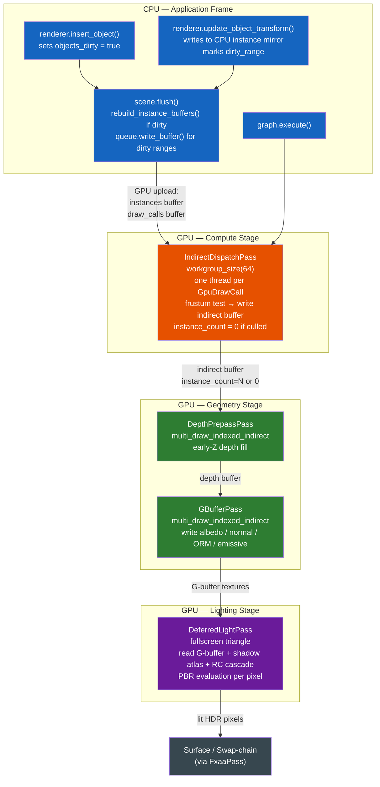

The defining architectural question in any renderer is who does the work of deciding what to draw — and when. In a traditional renderer, the answer is the CPU. Every frame, application code iterates its list of scene objects, tests each one for visibility, selects a shader variant, binds a material, and issues a draw call. This loop scales linearly with scene size: 10 000 objects means 10 000 iterations, 10 000 state-change decisions, and potentially 10 000 GPU submissions. The CPU becomes the bottleneck long before the GPU approaches saturation.

Helio is built around a different answer: the GPU decides. Every object in the scene is described by a flat 128-byte `GpuInstanceData` struct stored in a GPU storage buffer. A compute shader reads that buffer and emits `DrawIndexedIndirect` commands. The render pass then calls `multi_draw_indexed_indirect` once, consuming all those commands without the CPU ever touching individual draw calls. From the perspective of the per-frame hot path, the CPU issues exactly two GPU commands regardless of whether the scene contains ten objects or ten million — one compute dispatch and one indirect multi-draw.

This document covers every layer of that pipeline in full detail: the data structures that make it possible, the sorting strategy that enables automatic hardware instancing, the dirty-tracking system that keeps CPU overhead at steady-state O(1), the GPU frustum culling shader, and the complete data flow from a `renderer.insert_object()` call to pixels on screen.

---

## 1. The Problem with Traditional Rendering

To appreciate why Helio's architecture is the way it is, it helps to be precise about the cost model of the alternative.

In a forward renderer without GPU-driven techniques, a typical frame loop looks roughly like this: iterate all objects, compute a world-space bounding volume, test it against six frustum planes, and if it passes, bind the vertex buffer, bind the index buffer, bind the material textures, write push constants or uniform data, and call `draw_indexed`. Each step has a non-trivial CPU cost. Frustum-testing one object is cheap — a handful of dot products. But the loop overhead, the conditional branch, the cache miss on the object's transform, the driver overhead from the draw call submission — these accumulate. At 1 000 objects the CPU frame budget is uncomfortable. At 10 000 objects it is gone. At 100 000 objects it is impossible on any real hardware.

Manual instancing helps with the raw draw-call count when the scene happens to contain many copies of the same mesh. The renderer groups draws for identical meshes into `draw_instanced` calls, amortising the per-draw overhead across the instance count. But this grouping has to be maintained explicitly by the application: when objects are added or removed, when materials change, when mesh sharing changes, the CPU-side instancing bookkeeping must be updated. It is error-prone, tightly coupled to application logic, and still requires the CPU to iterate all objects to build the group lists.

The deeper problem is that CPU frustum culling itself has an unavoidable O(N) lower bound — you cannot determine visibility without testing each object at least once. GPU-driven rendering moves that lower bound from the CPU to a compute shader thread. On a modern GPU, a workgroup of 64 threads testing 64 bounding spheres in parallel takes roughly the same wall-clock time as the CPU testing one. The asymptotic cost remains O(N), but N is now measured in millions rather than thousands, and it runs concurrently with unrelated CPU work.

---

## 2. Helio's Answer: The GPU-Driven Pipeline

Helio's solution is a three-buffer system that lives entirely on the GPU between frames:

The **instance buffer** is a flat array of `GpuInstanceData` structs (128 bytes each). Every object in the scene has exactly one slot in this buffer. It holds the object's model matrix, normal matrix, bounding sphere, mesh index, material index, and flags. The CPU writes to this buffer only when object data changes.

The **draw call buffer** is a parallel flat array of `GpuDrawCall` structs (20 bytes each). Each entry describes one instanced draw group — a contiguous range of instances in the instance buffer that share the same mesh geometry, along with the index count and first-index for that mesh. One entry covers all objects that share the same `(mesh_id, material_id)` pair. This buffer is rebuilt whenever the scene topology changes (objects added or removed), but is otherwise unchanged between frames.

The **indirect buffer** is the output written by the compute shader and consumed by the render pass. It contains `DrawIndexedIndirectArgs` structs in the layout expected by `multi_draw_indexed_indirect`. The compute shader copies entries from the draw call buffer into the indirect buffer, setting `instance_count` to zero for any group whose bounding sphere lies outside the camera frustum.

The per-frame CPU path reduces to two operations:

`scene.flush()` uploads any dirty instance data to the GPU. When scene topology is stable and only transforms are moving, this is an `O(changed)` operation — only the modified instance slots are written. When objects have been added or removed, `rebuild_instance_buffers()` runs once to re-sort and re-upload the complete instance and draw call data, then the dirty flag is cleared and subsequent frames pay only the per-change cost again.

`graph.execute()` encodes the full render graph. The `IndirectDispatchPass` issues one `dispatch_workgroups` call whose workgroup count equals `ceil(draw_count / 64)`. The `GBufferPass` then issues `multi_draw_indexed_indirect` once. From the CPU's perspective, these are two wgpu commands — the GPU does everything else.

> [!IMPORTANT]
> The CPU **never iterates draw calls** in the per-frame hot path. Object count does not appear in any per-frame CPU loop. Doubling the number of scene objects does not increase per-frame CPU work when the scene topology is stable.

---

## 3. GpuInstanceData Layout

Every object in the scene is fully described by a single `GpuInstanceData` struct. Understanding this layout is foundational to understanding every other piece of the pipeline, since this is the data the GPU reads in both the frustum cull pass and the vertex shader.

```rust
/// Per-instance data for GPU-driven rendering. 128 bytes.
#[repr(C)]
#[derive(Clone, Copy, Pod, Zeroable)]
pub struct GpuInstanceData {
    /// Model matrix columns 0–3 (column-major, 64 bytes)
    pub model: [f32; 16],
    /// Normal matrix (inverse-transpose of upper-left 3×3, padded to 3×vec4, 48 bytes)
    pub normal_mat: [f32; 12],
    /// Bounding sphere center in world space (xyz) + radius (w)
    pub bounds: [f32; 4],
    /// Mesh index into the global mesh table
    pub mesh_id: u32,
    /// Material index into the global material storage buffer
    pub material_id: u32,
    /// Flags (bit 0 = casts_shadow, bit 1 = receives_shadow)
    pub flags: u32,
    pub _pad: u32,
}
```

The WGSL struct definition used in the vertex shader and the culling compute shader mirrors this layout exactly:

```wgsl
struct GpuInstance {
    model_0:     vec4<f32>,  // column 0 of model matrix
    model_1:     vec4<f32>,  // column 1
    model_2:     vec4<f32>,  // column 2
    model_3:     vec4<f32>,  // column 3
    normal_0:    vec4<f32>,  // column 0 of normal matrix (inverse-transpose of model 3×3)
    normal_1:    vec4<f32>,  // column 1
    normal_2:    vec4<f32>,  // column 2 (w component is padding)
    bounds:      vec4<f32>,  // xyz = sphere center (world space), w = sphere radius
    mesh_id:     u32,
    material_id: u32,
    flags:       u32,        // bit 0 = casts shadow, bit 1 = receives shadow
    _pad:        u32,
}
```

Each field serves a specific purpose in the pipeline. The **model matrix** (64 bytes, columns 0–3) transforms vertices from object-local space to world space. It is the full 4×4 column-major matrix, not a compact TRS triple, because arbitrary scale and shear must be representable for deformed or non-uniform-scale objects. The **normal matrix** (48 bytes, padded to three `vec4`) is the inverse-transpose of the model matrix's upper-left 3×3 block. It is precomputed on the CPU in `normal_matrix()` using `Mat3::from_mat4(transform).inverse().transpose()` and stored here so the vertex shader never has to compute a matrix inverse per vertex — an operation that costs a full 3×3 adjugate computation on the GPU. The **bounds** field (16 bytes) encodes a bounding sphere as world-space center plus radius. It is used exclusively by the GPU frustum culling shader; it is not used in the vertex or fragment stages. The **mesh\_id** and **material\_id** fields index into the global mesh table and material storage buffer respectively, and are used by the G-buffer shader to dispatch the correct draw commands. The **flags** field carries per-object render property bits: bit 0 enables shadow casting, bit 1 enables shadow receiving.

The 128-byte size is not accidental. WGSL storage buffer indexing requires elements to be aligned to their own size for efficient GPU access. Powers of two are efficiently indexed without remainder arithmetic. 128 bytes is also exactly two cache lines on most GPU L1 sizes, meaning fetching one instance and its neighbour costs at most two cache misses.

---

## 4. Automatic Instancing: How It Works

The most important user-facing consequence of the GPU-driven design is that **manual instancing is never required**. When you call `scene.insert_object()` multiple times with the same `MeshId` and `MaterialId`, Helio automatically batches all those objects into a single instanced draw call. This happens in `rebuild_instance_buffers()`, which is called from `scene.flush()` whenever the `objects_dirty` flag is set.

The algorithm is a stable grouped sort over all objects by `(mesh_id, material_id)`. After sorting, all objects that share the same mesh and material are contiguous in the sorted order. The function then makes a single pass over this contiguous range to emit one `GpuDrawCall` entry per unique pair, with `instance_count` set to the number of objects in the group and `first_instance` pointing to the start of that group in the sorted instance array. The sorted instance data is written into the GPU instance buffer in the same pass.

The complete rebuild function, simplified for clarity:

```rust
fn rebuild_instance_buffers(&mut self) {
    let n = self.objects.dense_len();

    // 1. Build a sort order grouped by (mesh_id, material_id).
    let mut order: Vec<usize> = (0..n).collect();
    order.sort_by_key(|&i| {
        let r = self.objects.get_dense(i).unwrap();
        (r.instance.mesh_id, r.instance.material_id)
    });

    let mut instances: Vec<GpuInstanceData> = Vec::with_capacity(n);
    let mut draw_calls: Vec<GpuDrawCall> = Vec::new();

    // 2. Sweep through sorted order, emitting one draw call per unique group.
    let mut i = 0;
    while i < order.len() {
        let r0 = self.objects.get_dense(order[i]).unwrap();
        let key = (r0.instance.mesh_id, r0.instance.material_id);
        let group_start = instances.len() as u32;

        while i < order.len() {
            let r = self.objects.get_dense(order[i]).unwrap();
            if (r.instance.mesh_id, r.instance.material_id) != key { break; }
            instances.push(r.instance);
            i += 1;
        }

        let instance_count = instances.len() as u32 - group_start;
        draw_calls.push(GpuDrawCall {
            index_count:    r0.draw.index_count,
            first_index:    r0.draw.first_index,
            vertex_offset:  r0.draw.vertex_offset,
            first_instance: group_start,
            instance_count,
        });
    }

    // 3. Upload sorted instance data and draw call list to GPU.
    self.gpu_scene.instances.set_data(instances);
    self.gpu_scene.draw_calls.set_data(draw_calls);
}
```

The result is that the number of draw calls the GPU ultimately executes equals the number of distinct `(mesh_id, material_id)` pairs in the scene, not the number of objects. A scene with 50 unique material–mesh combinations and 100 000 objects issues 50 draw calls — each one instancing thousands of objects in a single `DrawIndexedIndirect` command. Hardware instancing is activated implicitly and automatically, with no API surface the caller must operate.

> [!TIP]
> To maximise automatic batching, share `MeshId` and `MaterialId` values aggressively. Every unique material (even a tiny parameter difference like roughness value) creates a new instancing group. If you are placing a forest of trees, use one mesh and one material for all tree trunks — they will all be batched into a single draw call.

---

## 5. Adding Objects: The Rust API

The complete workflow for adding renderable objects to a Helio scene is three steps: upload a mesh once, create a material once, then insert as many objects as needed.

```rust
// 1. Upload mesh geometry to the GPU pool once.
let mesh_id = renderer.insert_mesh(MeshUpload {
    label:    Some("Tree Trunk"),
    vertices: trunk_vertices, // Vec<GpuVertex>
    indices:  trunk_indices,  // Vec<u32>
});

// 2. Create a PBR material once.
let material_id = renderer.insert_material(GpuMaterial {
    base_color:         [0.45, 0.32, 0.18, 1.0],
    roughness:          0.85,
    metallic:           0.0,
    ..GpuMaterial::default()
});

// 3. Insert many objects — automatic instancing happens transparently.
let trunk_a = renderer.insert_object(ObjectDescriptor {
    mesh:      mesh_id,
    material:  material_id,
    transform: Mat4::from_translation(Vec3::new(0.0, 0.0, 0.0)),
    bounds:    [0.0, 1.5, 0.0, 1.6],  // sphere center (world) + radius
    flags:     0,
    groups:    GroupMask::NONE,
})?;

let trunk_b = renderer.insert_object(ObjectDescriptor {
    mesh:      mesh_id,   // same mesh
    material:  material_id, // same material
    transform: Mat4::from_translation(Vec3::new(5.0, 0.0, 3.0)),
    bounds:    [5.0, 1.5, 3.0, 1.6],
    flags:     0,
    groups:    GroupMask::NONE,
})?;

// Both trunks are now batched into a single instanced draw call automatically.
// From this point forward, adding more trees with the same mesh+material
// simply increases the instance_count of that one draw call — no new GPU
// commands are issued, no additional CPU work accrues per frame.
```

`insert_object` returns a `Result<ObjectId>`, where the error case occurs only if the provided `MeshId` or `MaterialId` no longer refers to a live resource. `ObjectId` is a generational handle — a slot plus a generation counter — so stale handles from removed objects are safely rejected.

On the first call to `renderer.render()` after inserting objects, `scene.flush()` detects the `objects_dirty` flag, runs `rebuild_instance_buffers()`, uploads the resulting sorted arrays to GPU, and clears the flag. All subsequent frames with the same set of objects skip the rebuild entirely and proceed directly to per-frame GPU upload of only changed transforms.

---

## 6. Updating Transforms at Runtime

Moving objects per-frame is the most common runtime operation, and Helio is designed to make it as cheap as possible. When you call `scene.update_object_transform()` after the scene layout is stable (no pending `objects_dirty`), the update is applied in-place to the GPU instance buffer without triggering a full rebuild:

```rust
pub fn update_object_transform(&mut self, id: ObjectId, transform: Mat4) -> Result<()> {
    let Some((_, record)) = self.objects.get_mut_with_index(id) else {
        return Err(invalid("object"));
    };
    record.instance.model = transform.to_cols_array();
    record.instance.normal_mat = normal_matrix(transform);

    // When layout is stable, update the exact GPU slot in-place.
    // The new transform is included automatically when a rebuild is pending.
    if !self.objects_dirty {
        let slot = record.draw.first_instance as usize;
        self.gpu_scene.instances.update(slot, record.instance);
    }
    Ok(())
}
```

The `slot` field stored in `record.draw.first_instance` is the object's current index in the sorted instance buffer. It is patched during `rebuild_instance_buffers()` and remains valid as long as no objects are added or removed. The `GrowableBuffer::update()` call marks the dirty range covering that single slot, so `flush()` later in the frame issues a `queue.write_buffer` targeting only those 128 bytes. The cost of moving N objects is proportional to N, not to total scene size.

The normal matrix must be recomputed whenever the model matrix changes, because it is the inverse-transpose of the model's 3×3 rotation-scale block. Helio computes this on the CPU with `Mat3::from_mat4(transform).inverse().transpose()` and stores it alongside the model matrix in the instance slot. This is the correct pre-computation to avoid per-vertex inverse operations in the vertex shader — a 3×3 matrix inverse on the CPU at O(1) per moved object is dramatically cheaper than computing it in the shader at O(vertices) per frame.

> [!NOTE]
> If you are animating thousands of objects simultaneously, prefer updating their transforms in a tight loop before calling `render()`. The `GrowableBuffer` dirty tracking coalesces adjacent updates into a single contiguous byte range, which wgpu submits as one `write_buffer` command. Updating slots 0–999 in sequence produces one 128 000-byte upload, not 1 000 separate uploads.

---

## 7. Dirty Tracking and GPU Uploads

Helio's CPU-side dirty tracking operates at two levels, and understanding the difference between them is important for reasoning about per-frame cost.

The first level is the **objects\_dirty flag**, a single boolean on the `Scene` struct. It is set to `true` in three situations: when `insert_object()` is called, when `remove_object()` is called, and when `update_object_material()` is called (because a material change may move an object to a different instancing group). When `flush()` runs and finds `objects_dirty = true`, it calls `rebuild_instance_buffers()` which is an O(N log N) operation — it sorts all objects, rebuilds both the instance and draw-call arrays, and writes them to GPU. This is the only truly expensive path, and it only activates when the topology of the scene changes.

The second level is the **dirty range** tracked inside each `GrowableBuffer`. Each buffer maintains a `dirty_range: Option<(usize, usize)>` that records the minimum and maximum element indices that have been written since the last flush. When `update()` is called on a specific slot, the dirty range expands to cover that slot. When `flush()` runs, it issues a single `queue.write_buffer` covering the contiguous byte range from `start * sizeof(T)` to `end * sizeof(T)`. If nothing was written, `dirty_range` is `None` and `flush()` is a complete no-op for that buffer.

At steady state — a scene where the same objects exist every frame, with some of them moving — the frame cost breaks down as follows. The objects\_dirty flag is false, so no rebuild runs. For each moved object, `update_object_transform` writes 128 bytes into the CPU mirror and expands the dirty range. When `flush()` runs before encoding, it calls `write_buffer` once per dirty buffer, covering only the bytes that changed. The per-frame CPU work is proportional to the number of objects that moved, completely independent of total scene size.

> [!IMPORTANT]
> When the GPU buffer must grow because capacity is exceeded, `GrowableBuffer` allocates a new buffer at 2× capacity and uploads the entire contents. This is an unavoidable O(N) operation, but it is amortised — like a `Vec::push` reallocation, it occurs at most O(log N) times over the lifetime of the scene.

---

## 8. The GpuDrawCall

Each entry in the draw call buffer describes one instanced batch of objects that share the same mesh geometry. The struct maps directly to the `DrawIndexedIndirect` arguments consumed by `multi_draw_indexed_indirect`, with one additional field:

```rust
/// Template draw call built by rebuild_instance_buffers().
#[repr(C)]
#[derive(Clone, Copy, Pod, Zeroable)]
pub struct GpuDrawCall {
    /// Number of indices in this mesh (from the mesh pool's index slice).
    pub index_count:    u32,
    /// First index in the global index buffer for this mesh.
    pub first_index:    u32,
    /// Signed offset added to each index (for vertex pool addressing).
    pub vertex_offset:  i32,
    /// First index into the sorted GpuInstanceData array for this batch.
    pub first_instance: u32,
    /// Number of consecutive instances in this batch (≥ 1).
    pub instance_count: u32,
}
```

The `GpuDrawCall` is the CPU-authored template. The culling compute shader reads it and writes a corresponding `DrawIndexedIndirectArgs` into the indirect buffer, either preserving `instance_count` unchanged (the batch is visible) or setting it to zero (the batch is culled). A `DrawIndexedIndirect` command with `instance_count = 0` is entirely free on all hardware — the GPU skips it immediately, issuing no vertex shader invocations.

The correspondence between `GpuDrawCall` and the GPU-side `DrawIndexedIndirect` struct:

```wgsl
struct GpuDrawCall {
    index_count:    u32,
    first_index:    u32,
    vertex_offset:  i32,
    first_instance: u32,  // base index into instances[] for this batch
    instance_count: u32,  // 0 = culled by compute shader, N = draw N instances
}

struct DrawIndexedIndirect {
    index_count:    u32,
    instance_count: u32,  // note: different field order from GpuDrawCall
    first_index:    u32,
    base_vertex:    i32,
    first_instance: u32,
}
```

The field order differs between the two structs because `GpuDrawCall` is optimised for CPU readability (most significant fields first) while `DrawIndexedIndirect` follows the Vulkan/WebGPU specification wire format. The culling compute shader reads from `GpuDrawCall` and writes to `DrawIndexedIndirect`, performing the reordering as part of its output assignment.

---

## 9. The IndirectDispatchPass: GPU Frustum Culling

The `IndirectDispatchPass` is a compute pass that runs before all geometry passes. Its sole job is to read the draw call buffer and the instance buffer, test each batch's bounding sphere against the camera frustum, and write the result into the indirect buffer. It is the only place in the pipeline where visibility is determined — all subsequent passes read the indirect buffer and trust its contents unconditionally.

The compute shader dispatches one thread per `GpuDrawCall` entry, with a workgroup size of 64:

```wgsl
@compute @workgroup_size(64)
fn main(@builtin(global_invocation_id) gid: vec3<u32>) {
    let idx = gid.x;
    if idx >= cull.draw_count { return; }

    let dc   = draw_calls[idx];
    let inst = instances[dc.first_instance];  // test the first instance of the group

    // Reconstruct the bounding sphere center in world space via the model matrix.
    let model       = mat4x4<f32>(inst.model_0, inst.model_1, inst.model_2, inst.model_3);
    let world_center = (model * vec4<f32>(inst.bounds.xyz, 1.0)).xyz;

    // Scale the sphere radius by the maximum scale component.
    let sx           = length(inst.model_0.xyz);
    let sy           = length(inst.model_1.xyz);
    let sz           = length(inst.model_2.xyz);
    let world_radius = inst.bounds.w * max(sx, max(sy, sz));

    let visible = sphere_in_frustum(world_center, world_radius);

    indirect[idx] = DrawIndexedIndirect(
        dc.index_count,
        select(0u, dc.instance_count, visible),  // 0 = cull, N = draw all
        dc.first_index,
        dc.vertex_offset,
        dc.first_instance,
    );
}
```

The frustum test itself is a signed-distance test against six half-planes. For each frustum plane described by a normal-and-distance vector `(nx, ny, nz, d)`, the signed distance from the sphere centre to the plane is `dot(plane.xyz, center) + plane.w`. If this distance is less than `-radius` for any plane, the sphere is entirely outside that half-space and the batch is culled:

```wgsl
fn sphere_in_frustum(center: vec3<f32>, radius: f32) -> bool {
    for (var i = 0u; i < 6u; i++) {
        let plane = cull.frustum_planes[i];
        let dist  = dot(plane.xyz, center) + plane.w;
        if dist < -radius { return false; }
    }
    return true;
}
```

The six frustum planes are extracted from the view-projection matrix on the CPU using the Gribb–Hartmann method (row sums and differences of the clip matrix rows) and uploaded to the `CullUniforms` buffer in the pass's `prepare()` method each frame — six dot products, O(1), constant cost.

An important design note: Helio uses **group-level culling**, not per-instance culling. The compute shader tests the first instance in each draw group and either preserves or zeroes the entire group's `instance_count`. This means all N objects sharing the same `(mesh_id, material_id)` pair are either all drawn or all culled together. Per-instance culling within a batch would require compaction (a parallel prefix sum) to produce a dense indirect buffer, which adds significant complexity and is rarely worth the extra visibility. Coarse group culling is sufficient for most scenes; extremely large uniform-material scenes with varying spatial extent can split materials by region to enable finer culling granularity.

> [!NOTE]
> The `bounds` field you supply in `ObjectDescriptor` is stored verbatim in `GpuInstanceData.bounds`. The culling shader multiplies this sphere through the model matrix to reconstruct the world-space sphere at cull time. If your mesh has a non-uniform scale, the radius is scaled by `max(sx, sy, sz)` — a conservative approximation that may keep a few objects visible slightly past the frustum edge, but will never incorrectly cull a visible object.

---

## 10. ObjectDescriptor Reference

When calling `renderer.insert_object()`, you provide an `ObjectDescriptor` that fully specifies how the object appears in the scene. Each field maps to one or more components of the GPU data.

```rust
pub struct ObjectDescriptor {
    pub mesh:      MeshId,
    pub material:  MaterialId,
    pub transform: Mat4,
    pub bounds:    [f32; 4],
    pub flags:     u32,
    pub groups:    GroupMask,
}
```

| Field | Type | Description |
|---|---|---|
| `mesh` | `MeshId` | Handle returned by `renderer.insert_mesh()`. Determines which vertex and index data are read from the mesh pool. |
| `material` | `MaterialId` | Handle returned by `renderer.insert_material()` or `renderer.insert_material_asset()`. Determines PBR parameters and bound textures. |
| `transform` | `Mat4` | The object's world-space model matrix. Column-major, right-handed. Stored directly in `GpuInstanceData.model`. |
| `bounds` | `[f32; 4]` | Bounding sphere: `[cx, cy, cz, radius]` in **world space**. Used by the GPU frustum cull. Must be accurate or objects will be incorrectly culled. |
| `flags` | `u32` | Bit 0: object casts shadows. Bit 1: object receives shadows. Pass `0` to disable both. |
| `groups` | `GroupMask` | Group membership bitmask. Use `GroupMask::NONE` for objects that are always visible regardless of `renderer.hide_group()` calls. |

The `mesh` and `material` handles serve a second purpose beyond data lookup: they determine which instancing group the object belongs to. Two objects with the same `mesh` and `material` will always be batched into the same `GpuDrawCall`, with their instance data contiguous in the instance buffer.

---

## 11. The Bounding Sphere and Why It Matters

The `bounds` field is the single most common source of rendering errors when adopting Helio. Because frustum culling happens entirely on the GPU, there is no fallback — if the bounding sphere is wrong, the result is silent incorrect culling that may appear as objects flickering in and out of view, disappearing when the camera moves to a certain angle, or never appearing at all.

The bounding sphere must be specified in **world space at the time of the `insert_object` call**. It is stored in `GpuInstanceData.bounds` alongside the model matrix, and the culling shader transforms the center through the model matrix at cull time. However, if you pass world-space coordinates for bounds that do not match the object's actual extent, the transform will produce a mislocated or misscaled sphere.

The correct values to pass are: `cx`, `cy`, `cz` — the world-space position of the geometric centre of the mesh, typically `transform * local_center`; and `radius` — the radius of the smallest sphere in local space that encloses all vertices, which corresponds to `max(distance(vertex, local_center))` over all vertices. You can compute this from the mesh's vertex positions:

```rust
let local_center: Vec3 = vertices.iter()
    .map(|v| Vec3::from(v.position))
    .fold(Vec3::ZERO, |acc, p| acc + p)
    / vertices.len() as f32;

let radius: f32 = vertices.iter()
    .map(|v| Vec3::from(v.position).distance(local_center))
    .fold(0.0_f32, f32::max);

let world_center = (transform * local_center.extend(1.0)).truncate();
let bounds = [world_center.x, world_center.y, world_center.z, radius];
```

For objects with non-uniform scale, the radius you supply should be the local-space radius. The culling shader scales it by `max(sx, sy, sz)` where `sx`, `sy`, `sz` are the lengths of the model matrix columns — a conservative bound that handles any axis-aligned scale combination.

> [!WARNING]
> Do not pass `[0.0, 0.0, 0.0, 0.0]` as a placeholder. A zero-radius sphere will be culled by every frustum plane test, making the object invisible in all views. If you are unsure of the correct bounds, pass a conservatively large radius (e.g., the diagonal of the object's axis-aligned bounding box). Over-large bounds cause slight over-drawing but are never incorrect.

Bounds updates after insertion are supported through `scene.update_object_bounds()`, which updates the sphere in-place using the same stable-slot mechanism as transform updates — O(1) when scene topology is stable.

---

## 12. The Full Frame Data Flow

The following diagram traces the complete path from a `renderer.insert_object()` call to the final pixel contribution from that object, showing every system boundary and data transformation:



The critical observation is that the CPU contributes to this diagram only through `flush()` (a data upload) and `graph.execute()` (a command encoding step). It does not participate in visibility determination, draw call generation, or instance iteration. All of that happens in GPU threads operating on the data that was uploaded during `flush()`.

---

## 13. Performance Characteristics

The following table summarises the asymptotic cost of each phase of the GPU-driven pipeline. In these expressions, N is the number of scene objects, D is the number of unique `(mesh_id, material_id)` pairs (draw groups), and C is the number of objects with changed data this frame.

| Operation | CPU Cost | GPU Cost | When |
|---|---|---|---|
| Initial scene setup | O(N log N) | O(N) upload | Once on scene construction |
| `insert_object` / `remove_object` | O(1) amortised | — (deferred) | On topology change |
| `flush()` after topology change | O(N log N) rebuild | O(N) upload | Frame after object add/remove |
| `flush()` steady state | O(C) dirty range | O(C) upload | Every frame with moved objects |
| `flush()` fully static | O(1) no-op | — | Every frame with no changes |
| `IndirectDispatchPass` | O(1) one dispatch | O(D) cull test | Every frame |
| `GBufferPass` | O(1) one draw call | O(visible triangles) | Every frame |
| `DeferredLightPass` | O(1) one draw call | O(screen pixels) | Every frame |

The steady-state per-frame CPU cost for a fully static scene — one where objects are never added, removed, or moved — is effectively O(1). `flush()` finds no dirty data anywhere and returns immediately. The render graph encodes two GPU commands. The total CPU work for the geometry pipeline is bounded and constant regardless of scene complexity.

For a dynamic scene where transforms are animated, the cost grows with C (the number of changed objects) rather than N (total objects). A scene with 500 000 objects where 1 000 are animated pays the cost of uploading 1 000 × 128 = 128 KB of instance data per frame, plus one `write_buffer` call. The remaining 499 000 objects contribute zero per-frame CPU cost.

The rebuild triggered by topology changes — `insert_object` and `remove_object` — is the one genuinely expensive operation. At N = 100 000 objects, a full rebuild is a sort plus two `Vec` allocations plus two GPU uploads, taking perhaps a few milliseconds. For applications that stream objects in and out of the scene continuously (open-world streaming, particle systems), this cost should be amortised by batching insertions and removals into a single frame rather than distributing them across many frames. Inserting 100 objects in one frame triggers one rebuild; inserting one object per frame for 100 frames triggers 100 rebuilds.

> [!TIP]
> If your application adds all scene objects at startup and never changes the topology during gameplay, `rebuild_instance_buffers()` runs exactly once — at the end of the first `flush()` call — and is never called again. Every subsequent frame enters the fully-static O(1) path. This is the recommended setup for static environments: build your scene before the first render, then call `render()` every frame with only transform updates for moving entities.
