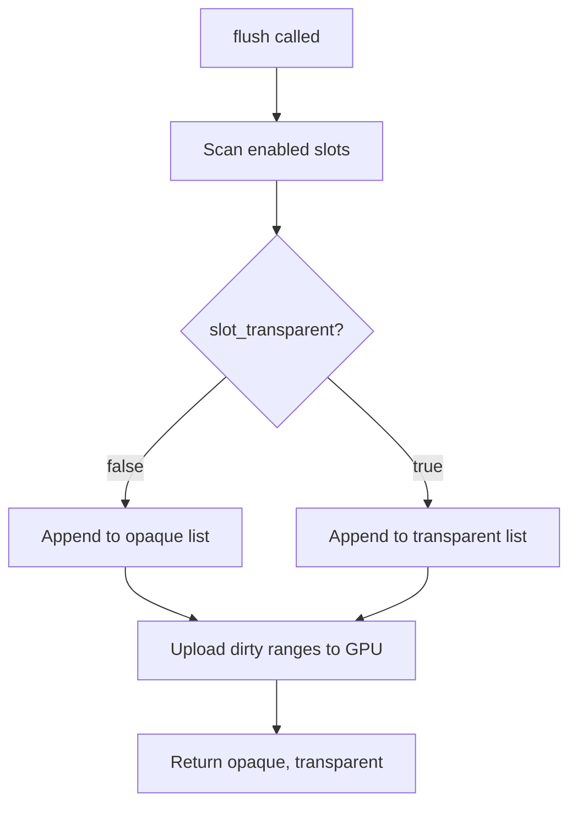
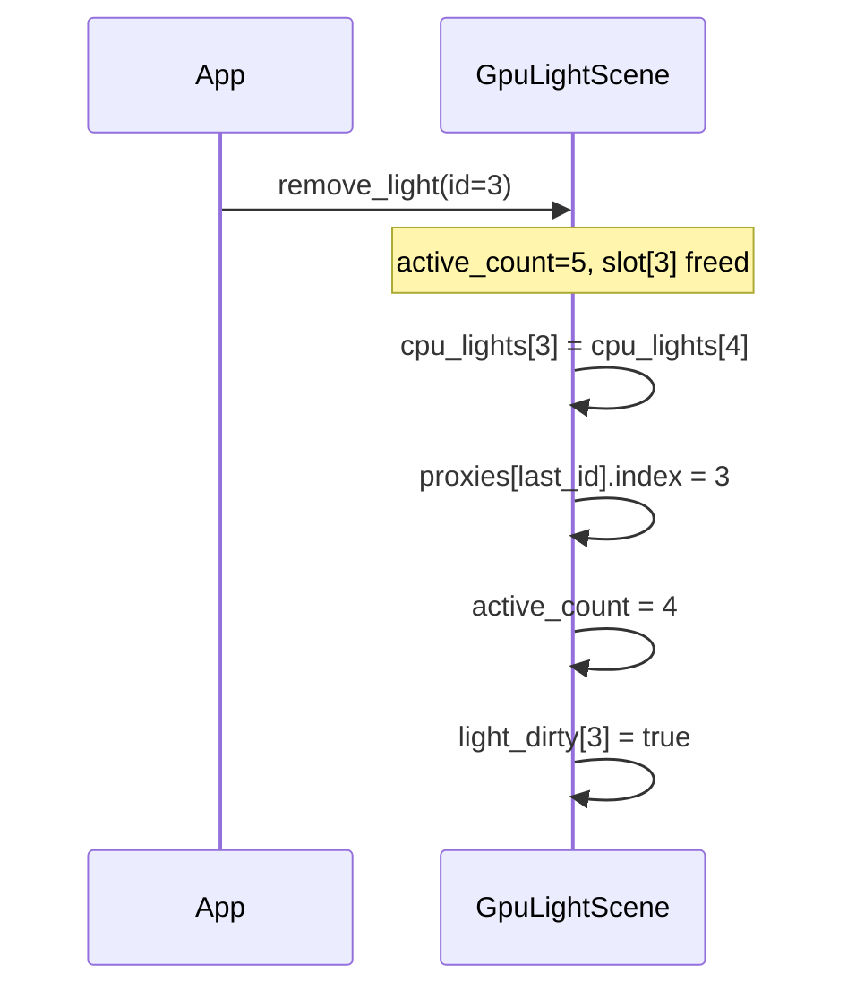
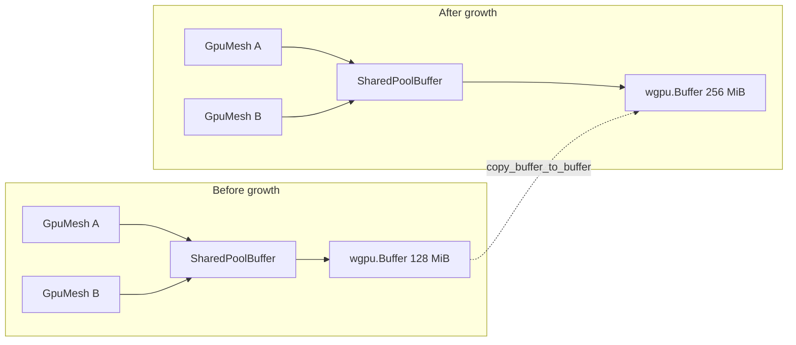
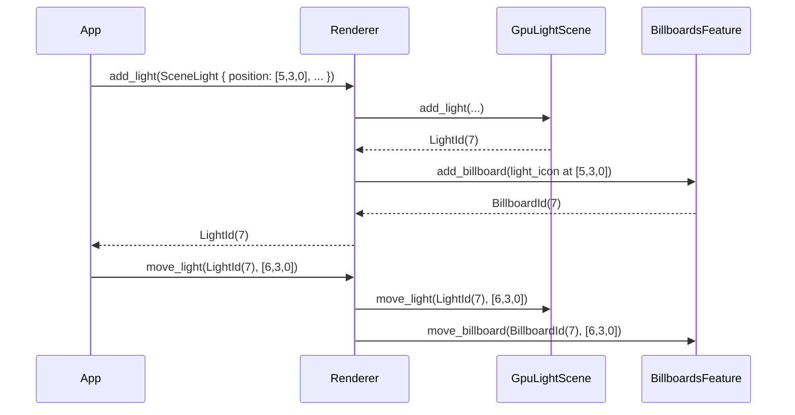
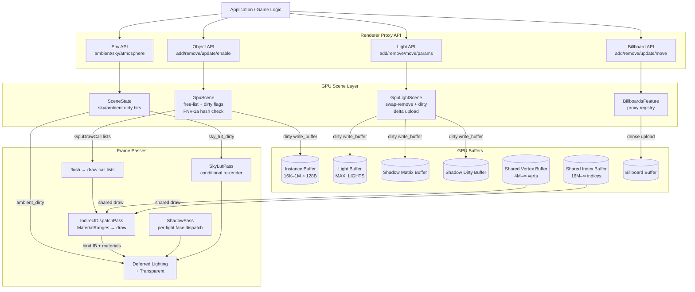

# GPU-Resident Scene

Modern real-time renderers are fundamentally bottlenecked not by GPU arithmetic but by the cost of communicating with the GPU — staging uploads, issuing draw calls, and re-binding resources. Helio's **GPU-Resident Scene** system is the architectural answer to that bottleneck. Inspired by Unreal Engine's `FGPUScene`, it keeps all per-object instance data persistently resident on the GPU in a single large storage buffer, updates only what actually changed each frame via a delta-upload protocol, and issues draw calls by indexing into that buffer rather than by rebinding uniforms per object. The result is a scene that scales to tens of thousands of objects with a CPU cost proportional only to what moved — not to what is visible.

## The Problem With Per-Object Draw Calls

In a naïve renderer, each object owns a uniform buffer containing its transform. Before drawing the object the CPU records a `set_bind_group` command pointing at that buffer, then issues a `draw_indexed` call. The GPU executes the draw. For a scene with ten thousand objects this means ten thousand bind-group rebinds and ten thousand separate draw calls per frame — even when nothing in the scene moved at all. The CPU recording overhead alone typically dominates frame time long before the GPU becomes the bottleneck.

Profiling a mid-complexity scene under this model typically reveals that 60–80% of frame CPU time is spent inside the render command encoder recording those rebinds and draw calls, not in any game logic or physics simulation. The GPU itself is often sitting at 20–40% utilisation because the CPU cannot feed it draw calls fast enough. This is the classic "draw-call bound" problem that has driven renderer architecture evolution since the move to programmable shaders.

The classical mitigation is instancing: pack many objects sharing the same mesh into one `draw_indexed_instanced` call. This works well for repeated geometry like foliage or crowds, but most game/simulation scenes contain predominantly unique objects — a building, a vehicle, a rock — that cannot be batched this way without explicit artist effort.

Unreal Engine's `FGPUScene` solved this at a structural level by reversing the ownership model. Instead of each object owning its own buffer, a **single monolithic storage buffer** on the GPU holds the instance data for every object in the scene at a stable slot index. A draw call no longer carries per-object data via a bind group; instead it carries a single integer — the slot index — which the vertex shader uses to read from the shared buffer. Every draw call in the frame shares the same bind group pointing at that one buffer. Rebinding cost drops to a handful of commands per frame regardless of scene size.

Helio adopts exactly this model. The `GpuScene` struct manages the storage buffer, a CPU mirror for change detection, a free-list allocator for stable slots, and a delta-upload protocol that writes only the slots that actually changed.

> [!NOTE]
> The GPU-Resident Scene is specifically a Helio feature. It is not part of the standard Pulsar rendering pipeline. Everything described in this document lives behind the `experiments/Helio` feature boundary.

The classical mitigation — instancing — works well for repeated geometry like foliage or crowds but requires explicit artist effort and fails for scenes containing predominantly unique objects. Sorting objects into batches on the CPU adds its own overhead. More fundamentally, any scheme that binds per-object data via a uniform buffer will hit the API overhead wall; the only way past it is to eliminate the per-object bind entirely.

Unreal Engine's `FGPUScene`, introduced with their Nanite and Virtual Shadow Map work, solved this by keeping all per-object data in one GPU storage buffer and passing a slot index per draw call rather than a bind group. Helio's GPU-Resident Scene is a wgpu-native implementation of the same idea, adapted to the constraints and idioms of Rust and the WebGPU API model.

## GpuInstanceData Layout

Every object in the scene occupies exactly **128 bytes** in the instance buffer, corresponding to the `GpuInstanceData` struct:

```rust
pub struct GpuInstanceData {
    pub transform:     [f32; 16],   // 64 bytes — model-to-world mat4 (column-major)
    pub normal_mat:    [f32; 12],   // 48 bytes — inverse-transpose 3×3 padded (3 × vec4)
    pub bounds_center: [f32; 3],    // 12 bytes — world-space bounding sphere center
    pub bounds_radius: f32,         //  4 bytes — world-space bounding sphere radius
}
```

The 128-byte size is deliberate. A typical CPU cache line is 64 bytes and a GPU L1 cache line is often 128 bytes. Packing the struct to exactly 128 bytes means that fetching any `GpuInstanceData` from the instance buffer requires exactly one GPU cache-line read, regardless of which field the shader accesses first. There is no wasted bandwidth from partial-line fetches and no cross-line spill for a single object.

The struct's field sizes add up as follows:

$$\underbrace{4 \times 4 \times 4}_{\text{transform: 64B}} + \underbrace{3 \times 4 \times 4}_{\text{normal\_mat: 48B}} + \underbrace{3 \times 4}_{\text{bounds\_center: 12B}} + \underbrace{4}_{\text{bounds\_radius: 4B}} = 128 \text{ bytes}$$

Cache-line size on x86/ARM = 64 bytes. Two cache lines per instance means the GPU can fetch any instance in exactly 2 cache-line reads with no false-sharing between adjacent instances.

**`transform` (64 bytes)** is the model-to-world matrix stored column-major as sixteen `f32` values. This matches the WGSL/GLSL memory layout for `mat4x4<f32>` — columns are contiguous in memory so shader reads are maximally coalesced when adjacent threads read adjacent slots.

**`normal_mat` (48 bytes)** is the inverse-transpose of the upper-left 3×3 of the transform, padded to three `vec4` rows. This is the matrix required for transforming surface normals correctly in the presence of non-uniform scale — a step that is expensive enough (matrix inverse) to be worth precomputing once on the CPU rather than repeating in every vertex shader invocation.

For a model matrix $$$1$$, the normal matrix is:

$$\mathbf{N}_{\text{mat}} = (\mathbf{M}^{-1})^T$$

Only the upper-left 3×3 submatrix is needed (translation doesn't affect normals). In `GpuInstanceData` this is stored as 12 floats (a mat3×4 with padding): $$$1$$.

Why not just use $$$1$$ itself? When a mesh is scaled non-uniformly (e.g., squeezed in X), normals transformed by $$$1$$ would tilt incorrectly. The inverse-transpose restores perpendicularity. For uniform scale and rotation-only transforms, $$$1$$ so the operation is a no-op in the common case.

```rust
// Compute normal matrix from transform
fn normal_matrix(m: &glam::Mat4) -> [[f32; 3]; 3] {
    let inv = m.inverse();
    let t = inv.transpose();
    // Extract upper-left 3×3
    [
        [t.x_axis.x, t.x_axis.y, t.x_axis.z],
        [t.y_axis.x, t.y_axis.y, t.y_axis.z],
        [t.z_axis.x, t.z_axis.y, t.z_axis.z],
    ]
}
```

**`bounds_center` and `bounds_radius` (16 bytes)** encode a world-space bounding sphere. This data enables GPU-side frustum and occlusion culling without any CPU readback. The constructor `GpuInstanceData::from_transform` computes both fields automatically: it transforms the mesh-space bounds center by the full transform matrix and scales the radius by `max(sx, sy, sz)` extracted from the transform, producing a conservative sphere that is never smaller than the actual transformed mesh.

Given a local bounding sphere $$$1$$ and model transform $$$1$$, the world-space sphere is:

$$\mathbf{c}_{\text{world}} = \mathbf{M} \cdot \mathbf{c}_{\text{local}}$$
$$r_{\text{world}} = r_{\text{local}} \cdot \max(s_x, s_y, s_z)$$

where the scale factors are the column magnitudes of $$$1$$:

$$s_x = \|\mathbf{M}_{\text{col}_0}\|, \quad s_y = \|\mathbf{M}_{\text{col}_1}\|, \quad s_z = \|\mathbf{M}_{\text{col}_2}\|$$

Taking the maximum of the three scale factors guarantees the world sphere is a conservative overestimate — no part of the mesh protrudes outside it. This is used for frustum culling; conservative bounds are safe for culling because false positives (keeping an object that is actually off-screen) are merely suboptimal, never incorrect.

```rust
impl GpuInstanceData {
    pub fn from_transform(
        transform: glam::Mat4,
        bounds_center: [f32; 3],
        bounds_radius: f32,
    ) -> Self {
        let scale = Vec3::new(
            transform.x_axis.truncate().length(),
            transform.y_axis.truncate().length(),
            transform.z_axis.truncate().length(),
        );
        let world_center = transform.transform_point3(Vec3::from(bounds_center));
        let world_radius = bounds_radius * scale.max_element();
        // compute inverse-transpose for normal matrix...
        let normal_mat = transform.inverse().transpose();
        Self {
            transform: transform.to_cols_array(),
            normal_mat: [
                normal_mat.x_axis.x, normal_mat.x_axis.y, normal_mat.x_axis.z, 0.0,
                normal_mat.y_axis.x, normal_mat.y_axis.y, normal_mat.y_axis.z, 0.0,
                normal_mat.z_axis.x, normal_mat.z_axis.y, normal_mat.z_axis.z, 0.0,
            ],
            bounds_center: world_center.into(),
            bounds_radius: world_radius,
        }
    }
}
```

> [!IMPORTANT]
> The normal matrix padding bytes (the `0.0` fourth component of each row) are not merely alignment padding — they must be zero. WGSL reads `mat3x3<f32>` as three `vec3` values, but some GPU drivers read the underlying memory as `vec4` and can exhibit undefined behaviour if the padding contains garbage. Always initialise these fields to zero.

## Free-List Slot Allocator

The instance buffer is logically a flat array of `GpuInstanceData` slots. Slots are identified by a `u32` index. When a new object is added to the scene it must be assigned a slot; when an object is removed its slot must be made available for future objects without fragmenting the buffer or requiring a compaction pass.

Helio solves this with a straightforward **free-list allocator**. The `GpuScene` struct maintains a `Vec<u32>` of freed slot indices alongside a `next_slot: u32` counter that records the high-water mark of ever-allocated slots:

```rust
pub struct GpuScene {
    free_slots: Vec<u32>,
    next_slot: u32,
    capacity: u32,
    // ...
}
```

Allocation proceeds as follows: if `free_slots` is non-empty, pop from it and return the recycled slot. If the free list is empty, use `next_slot` and increment it. If `next_slot` would exceed `capacity`, the instance buffer must grow — a new buffer is allocated at double the previous capacity, the old data is copied via a command encoder, and `capacity` is updated.

```rust
fn alloc_slot(&mut self) -> u32 {
    if let Some(slot) = self.free_slots.pop() {
        return slot;
    }
    let slot = self.next_slot;
    self.next_slot += 1;
    if self.next_slot > self.capacity {
        self.grow(device); // doubles capacity, copies data
    }
    // Ensure parallel metadata vecs are initialised
    self.dirty.push(true);
    self.transform_hashes.push(0);
    self.slot_meshes.push(None);
    self.slot_materials.push(None);
    self.slot_transparent.push(false);
    self.slot_enabled.push(true);
    slot
}
```

The initial capacity is 16,384 objects (`INITIAL_CAPACITY = 16 * 1024`), occupying `16384 × 128 = 2 MiB` of VRAM. Doubling on demand means the buffer sizes follow the sequence 2 MiB → 4 MiB → 8 MiB → … reaching 128 MiB at capacity 1,048,576 objects — more than any real-time scene would need.

> [!TIP]
> Because removed slots return to the free list, long-running scenes with frequent add/remove cycles (particle systems, streaming, editor undo/redo) do not accumulate dead slots. The buffer high-water mark is bounded by the peak concurrent object count, not the total historical object count.

## Stable Handle Types: ObjectId, LightId, BillboardId

Every persistent scene entity is identified by a handle — a typed wrapper around a monotonically increasing integer. Helio defines three:

```rust
pub struct ObjectId(pub(crate) u64);    // monotonic, never 0; INVALID = 0
pub struct LightId(pub(crate) u32);     // monotonic; INVALID = u32::MAX
pub struct BillboardId(pub(crate) u32); // monotonic; INVALID = u32::MAX
```

The monotonic counter ensures that a handle is never reused after the corresponding object is removed. If stale code holds an `ObjectId` from a removed object and attempts to call `update_transform` with it, the `id_to_slot` map lookup will return `None` and the call is silently ignored rather than corrupting a different object that now occupies the same slot.

The sentinel values are type-specific: `ObjectId(0)` is `INVALID` because zero is excluded from the monotonic sequence (the counter starts at 1). `LightId(u32::MAX)` and `BillboardId(u32::MAX)` use the maximum value because the underlying counter is `u32` starting at 0. Callers should always check against `INVALID` before using a handle, though in practice the construction APIs never return `INVALID` — it is reserved for default-initialised values in data structures.

> [!NOTE]
> `ObjectId` uses `u64` while the others use `u32`. This reflects the anticipated scale difference: a scene might contain millions of transient objects over its lifetime (streaming, particles, editor history) but at most a few thousand lights and billboards.

## Shader Side: Reading from the Instance Buffer

Understanding how the GPU consumes instance data is as important as understanding how the CPU writes it. In Helio's vertex shaders, the instance buffer is bound as a read-only storage buffer at binding group 0, binding 0. The `slot` value is delivered as a push constant — a small block of data embedded directly in the command stream, with zero bind-group overhead:

```wgsl
struct InstanceData {
    transform:     mat4x4<f32>,
    normal_mat_r0: vec4<f32>,
    normal_mat_r1: vec4<f32>,
    normal_mat_r2: vec4<f32>,
    bounds_center: vec3<f32>,
    bounds_radius: f32,
}

@group(0) @binding(0)
var<storage, read> instances: array<InstanceData>;

struct PushConstants {
    slot: u32,
}
var<push_constant> pc: PushConstants;

@vertex
fn vs_main(vertex: VertexInput) -> VertexOutput {
    let inst = instances[pc.slot];
    let world_pos = inst.transform * vec4<f32>(vertex.position, 1.0);
    let normal_mat = mat3x3<f32>(
        inst.normal_mat_r0.xyz,
        inst.normal_mat_r1.xyz,
        inst.normal_mat_r2.xyz,
    );
    var out: VertexOutput;
    out.position = camera.view_proj * world_pos;
    out.world_normal = normalize(normal_mat * vertex.normal);
    out.world_pos = world_pos.xyz;
    return out;
}
```

The push constant carrying `slot` is a `u32` — four bytes. This is the only per-draw data that varies between objects in the same material batch. Everything else — transforms, bounds, normal matrices — is fetched from the storage buffer by the slot index. The GPU's memory subsystem handles the random-access pattern efficiently when adjacent draw calls access adjacent slots, which is exactly the allocation pattern produced by the free-list (new objects fill adjacent slots when added in sequence).

> [!TIP]
> Because the instance buffer is a storage buffer (not a uniform buffer), there is no 64 KiB per-binding size limit. The 16K initial capacity uses 2 MiB; even a 1M-object scene would use only 128 MiB — well within storage buffer limits on any discrete GPU and on modern integrated GPUs.

## Delta Upload Protocol

The central performance insight of the GPU-Resident Scene is that most objects do not move most frames. A static building, a parked vehicle, a piece of furniture — their transforms are set once and never touched again. Uploading their data every frame would waste both PCIe/UMA bandwidth and GPU cache entries.

Helio tracks whether each slot needs uploading via two parallel mechanisms:

**Dirty flags** — a `Vec<bool>` with one entry per slot. Any operation that modifies a slot's data (`add_object`, `update_transform`, `set_object_bounds`) sets `dirty[slot] = true`. The dirty flag is cleared after the data is uploaded.

**FNV-1a transform hash** — a `Vec<u64>` storing the FNV-1a hash of the last-uploaded transform bytes for each slot. When `update_transform` is called, the new transform is hashed and compared to the stored hash. If they match, the object did not actually move — perhaps the same world matrix was written redundantly by application logic — and the dirty flag is **not** set. This makes the common case of "set transform every frame even when stationary" completely free.

```rust
// Inside update_transform:
let hash = fnv1a_hash(bytemuck::bytes_of(&new_instance_data.transform));
if hash != self.transform_hashes[slot] {
    self.cpu_instances[slot] = new_instance_data;
    self.dirty[slot] = true;
    self.transform_hashes[slot] = hash;
}
```

### FNV-1a Hash Implementation

The FNV-1a (Fowler–Noll–Vo) hash is used specifically because it is extremely fast for small, fixed-size inputs — the 64 bytes of a transform matrix. The hash function operates byte-by-byte with two operations per byte (XOR and multiply), making it faster than CRC32 on inputs too small to benefit from SIMD and faster than xxHash on inputs this small due to lower setup overhead.

The 64-bit FNV-1a algorithm is defined by:

$$h_0 = 14\,695\,981\,039\,346\,656\,037$$
$$h_{i+1} = (h_i \oplus b_i) \times 1\,099\,511\,628\,211 \pmod{2^{64}}$$

where $$$1$$ is the $$$1$$-th byte of the input and $$$1$$ is bitwise XOR. All arithmetic is unsigned 64-bit with wrapping overflow. Applied to the full 64 bytes of a transform matrix: if $$$1$$ the transform is unchanged — skip the GPU upload. The birthday bound for a false positive over $$$1$$ frames is $$$1$$ — essentially zero for any real application.

```rust
const FNV_OFFSET: u64 = 14_695_981_039_346_656_037;
const FNV_PRIME:  u64 = 1_099_511_628_211;

fn fnv1a_64(bytes: &[u8]) -> u64 {
    let mut hash = FNV_OFFSET;
    for &b in bytes {
        hash ^= b as u64;
        hash = hash.wrapping_mul(FNV_PRIME);
    }
    hash
}

// Usage: check if transform changed
let new_hash = fnv1a_64(bytemuck::bytes_of(&transform));
if new_hash != self.transform_hashes[slot] {
    self.transform_hashes[slot] = new_hash;
    self.dirty.insert(slot);
}
```

For a 64-byte transform (sixteen `f32` values), this is 64 iterations — roughly 128 arithmetic operations. On a modern CPU that takes under 5 nanoseconds. Compared to a `write_buffer` call that takes 50–500 nanoseconds depending on driver overhead, the hash check pays for itself the moment it avoids even a single upload. For a static scene with 10,000 objects and 200 animated ones, the hash check saves roughly 9,800 potential `write_buffer` byte ranges per frame.

> [!NOTE]
> Hash collisions are theoretically possible (two different transforms producing the same 64-bit hash) but practically negligible. The FNV-1a collision probability for 64-byte inputs is on the order of 2⁻⁶⁴ — you would need to process more transforms in the lifetime of the universe than atoms in the observable universe to expect a single collision. The consequence of a collision would be a single frame where one object's transform is not uploaded — a one-frame visual glitch at worst.

### Dirty Range Merging

After the hash check, dirty slot indices are collected and merged into contiguous ranges before issuing `write_buffer` calls. This matters because `write_buffer` has a fixed per-call overhead (descriptor allocation, synchronisation fence check, staging buffer management) that is paid regardless of how many bytes are written. Writing 100 adjacent slots as one 12,800-byte call is dramatically cheaper than writing them as 100 individual 128-byte calls.

Given a set of dirty slots $$$1$$ (sorted), each slot is 128 bytes. Adjacent or near-adjacent slots are merged into contiguous ranges for a single `write_buffer` call:

$$\text{ranges} = \{[s_i \cdot 128,\; s_j \cdot 128 + 128) \mid s_{j+1} - s_j > \text{GAP}\}$$

Merging slots that are within a configurable gap threshold avoids $$$1$$ individual `queue.write_buffer()` calls at the cost of uploading a few unchanged bytes between them. The optimal gap threshold depends on the cost model of the wgpu backend.

```rust
// Pseudocode for dirty range merging in flush():
let mut ranges: Vec<(u32, u32)> = Vec::new(); // (start_slot, end_slot exclusive)
let mut range_start: Option<u32> = None;

for (slot, &dirty) in self.dirty.iter().enumerate() {
    if dirty {
        if range_start.is_none() { range_start = Some(slot as u32); }
    } else if let Some(start) = range_start.take() {
        ranges.push((start, slot as u32));
    }
}
if let Some(start) = range_start {
    ranges.push((start, self.dirty.len() as u32));
}

for (start, end) in &ranges {
    let byte_start = (*start as u64) * INSTANCE_SIZE as u64;
    let byte_end   = (*end   as u64) * INSTANCE_SIZE as u64;
    let data = bytemuck::cast_slice(&self.cpu_instances[*start as usize..*end as usize]);
    queue.write_buffer(&self.instance_buffer, byte_start, data);
}
```


<!-- screenshot: Frame profiler showing GPU-Scene flush with two write_buffer calls covering a dirty range across 300 objects, total upload 38 KiB -->

<!-- screenshot: CPU profiler trace showing GpuScene::flush taking 0.18ms for a 6000-object scene; the two write_buffer calls account for 0.03ms, the remaining time is draw-list construction -->

## Draw Call Generation

`GpuScene::flush` returns two `Vec<GpuDrawCall>` — one for opaque geometry and one for transparent geometry:

```rust
pub fn flush(
    &mut self,
    device: &wgpu::Device,
    queue: &wgpu::Queue,
) -> (Vec<GpuDrawCall>, Vec<GpuDrawCall>) // (opaque, transparent)
```

Each `GpuDrawCall` carries everything needed to record one `draw_indexed` command:

```rust
pub struct GpuDrawCall {
    pub index_count: u32,
    pub first_index: u32,
    pub base_vertex: u32,
    pub material_bind_group: Arc<wgpu::BindGroup>,
    pub transparent: bool,
    pub slot: u32,  // index into the instance buffer — pushed as a push constant
}
```

Critically, `material_bind_group` is the *only* per-draw bind group. The instance buffer itself is bound once for the entire frame as a storage buffer in bind group 0. The `slot` field is passed to the vertex shader via a push constant. This means that an entire 10,000-object scene may require only as many bind-group rebinds as there are distinct materials — often in the hundreds rather than thousands.

### draw_list_generation Counter

`GpuScene` maintains a `generation: u64` counter that increments whenever the **structure** of the scene changes — when objects are added or removed. It does **not** increment when `update_transform` is called, even if the transform is dirty. This distinction is intentional: systems that cache the draw call list (the indirect dispatch pass, for example) can cheaply check whether they need to rebuild their indirect argument buffer by comparing against a stored generation value. A pure transform update does not change the set of draw calls, only the data behind them.

```
add_object    → generation++
remove_object → generation++
update_transform → (no generation change)
enable_object → generation++ (draw list changes)
disable_object → generation++ (draw list changes)
```

> [!WARNING]
> Do not cache a draw call list across frames without checking `generation`. Enabling or disabling an object with `enable_object`/`disable_object` increments `generation` because the draw call is added to or removed from the list, even though the object's slot data may be unchanged.

## The Opaque / Transparent Split

`GpuScene` maintains a `slot_transparent: Vec<bool>` that records whether each slot's material requires blending. The `flush` function separates draw calls into two lists on this basis. The opaque list is rendered first with depth writes enabled; the transparent list is rendered back-to-front with depth writes disabled. This split is determined at `add_object` time based on the material's blend mode and never changes for the lifetime of the object.



## The Full Renderer Proxy API

Application code never interacts with `GpuScene` directly. All mutations flow through the `Renderer` struct, which acts as the public-facing proxy. This indirection serves two purposes: it keeps the `GpuScene` internals private so the allocator and dirty-tracking logic cannot be bypassed, and it allows the renderer to coalesce related side effects (e.g., updating the light scene and the object scene in the same frame submission).

### Objects

```rust
// Add a mesh/material pair to the scene. Returns a stable handle.
pub fn add_object(
    &mut self,
    mesh: &GpuMesh,
    material: Option<&GpuMaterial>,
    transform: glam::Mat4,
) -> ObjectId

// Remove the object. The slot is returned to the free list immediately.
pub fn remove_object(&mut self, id: ObjectId)

// Update a single object's world transform.
pub fn update_transform(&mut self, id: ObjectId, transform: glam::Mat4)

// Batch transform update — prefer this when moving many objects in one system tick.
pub fn update_transforms(&mut self, updates: &[(ObjectId, glam::Mat4)])

// Exclude an object from draw call generation without removing its slot.
pub fn disable_object(&mut self, id: ObjectId)
pub fn enable_object(&mut self, id: ObjectId)
pub fn is_object_enabled(&self, id: ObjectId) -> bool

// Override the bounding sphere radius (useful when mesh bounds are imprecise).
pub fn set_object_bounds(&mut self, id: ObjectId, radius: f32)

// Current count of active (non-freed) slots.
pub fn object_count(&self) -> usize
```

`update_transforms` is the preferred API when many objects move in a single game-tick — a physics update, a crowd simulation step, an animated model with a hundred bones' worth of mesh sections. Passing a slice lets the flush logic process all dirty slots in a single pass rather than interleaving scene mutation with individual dirty-flag checks.

> [!TIP]
> When you know an object will be invisible for a long period (e.g., an off-screen streaming zone), prefer `disable_object` over `remove_object`. Disabling excludes the object from draw call generation at zero GPU cost but keeps the slot allocated, so the object can be re-enabled in a single call with no allocator churn.

### Persistent Scene Environment

```rust
pub fn set_ambient(&mut self, color: [f32;3], intensity: f32)
pub fn set_sky_color(&mut self, color: [f32;3])
pub fn set_sky_atmosphere(&mut self, atm: Option<SkyAtmosphere>)
pub fn set_skylight(&mut self, skylight: Option<Skylight>)
```

These methods mutate `SceneState`, an internal struct that tracks the scene's global environment parameters and their own dirty flags:

```rust
struct SceneState {
    ambient_color: [f32; 3],
    ambient_intensity: f32,
    sky_color: [f32; 3],
    sky_atmosphere: Option<SkyAtmosphere>,
    skylight: Option<Skylight>,
    sky_lut_dirty: bool,   // triggers SkyLutPass re-render + SkyUniform upload
    ambient_dirty: bool,   // triggers RC ambient color update
    cached_sun_direction: [f32; 3],
    cached_sun_intensity: f32,
}
```

`sky_lut_dirty` is initialised to `true` so that the sky look-up texture is always rendered on the first frame, even before the application calls any `set_sky_*` method. This guarantees that the sky LUT bind group is never in an uninitialised state when the deferred lighting pass samples it. After that first render it is cleared to `false` and only set again when the atmosphere parameters actually change — sky LUT computation is expensive and should not run every frame.

`ambient_dirty` is separate because ambient changes affect the lighting uniform buffer but not the sky LUT. Decoupling the two dirty flags prevents a cheap ambient colour tweak from triggering a full atmosphere LUT re-render.

<!-- screenshot: Editor property panel showing sky atmosphere controls; the "Sun Direction" knob only triggers a sky LUT rebuild when released, not while dragging -->

## GpuLightScene — Delta Uploads for Lights

Lights are managed by a parallel system, `GpuLightScene`, that applies the same delta-upload principles as the object scene. Two pre-allocated GPU buffers hold light data and shadow matrices respectively, at `MAX_LIGHTS` capacity each. Because both buffers are allocated at construction time and never reallocated, the lighting bind group never needs to be rebuilt — a significant saving given that bind group creation is among the more expensive wgpu operations.

```rust
pub(super) struct GpuLightScene {
    pub light_buffer: Arc<wgpu::Buffer>,
    cpu_lights: Vec<GpuLight>,
    light_dirty: Vec<bool>,
    pub shadow_matrix_buffer: Arc<wgpu::Buffer>,
    pub shadow_dirty_buffer: Arc<wgpu::Buffer>,   // per-light dirty flags on GPU
    shadow_dirty: Vec<bool>,
    pub shadow_hash_buffer: Arc<wgpu::Buffer>,    // hash written by compute pass
    shadow_generation: Vec<u64>,
    proxies: HashMap<u32, LightProxy>,
    pub active_count: u32,
    pub face_counts: Vec<u8>,   // 6=point, 4=directional, 1=spot
    pub cull_lights: Vec<ShadowCullLight>,
}
```

### Swap-Remove on Deletion

Unlike the object free-list, lights use a **swap-remove** strategy. When `remove_light` is called, the last active light's data is moved into the freed slot, `active_count` is decremented, and the proxy map is updated. This keeps the active lights in a dense prefix of the arrays — from `[0, active_count)` — which means shadow culling loops and upload scans never touch dead entries.

The trade-off is that light slot indices are **not** stable across removals: the light that was at the last position moves to fill the gap. This is why `GpuLightScene` uses a `proxies: HashMap<u32, LightProxy>` rather than direct indexing by `LightId` — the map translates the stable `LightId` to the current (possibly moved) dense-array index.



### Face Counts and Shadow Pass Integration

The `face_counts: Vec<u8>` array records how many shadow faces each light requires: `6` for a point light (one per cube face), `4` for a directional light with four CSM cascades, `1` for a spot light. The shadow rendering pass iterates this array to determine how many frustums to cull and how many shadow map slices to allocate. By keeping face counts in the light scene rather than in the shadow pass, the shadow pass can be written without knowledge of light types — it simply iterates `face_counts`.

The `shadow_dirty_buffer` and `shadow_hash_buffer` enable a further optimisation: if a light and its affected geometry have not moved, the shadow map for that light can be reused from the previous frame. The compute pass writes a hash of the relevant scene data into `shadow_hash_buffer`; the CPU compares against `shadow_generation` to decide whether the shadow pass needs to run for that light at all. Shadow map rendering is often the single largest GPU workload in a scene with multiple lights; skipping it for stationary lights reduces GPU frame time by 30–60% in typical architectural and game scenes where most lights and most geometry are static.

The light flush loop itself mirrors the object flush but operates over the dense prefix `[0, active_count)` rather than all allocated slots:

```rust
pub fn flush(&mut self, queue: &wgpu::Queue) {
    // Upload dirty light data
    for i in 0..self.active_count as usize {
        if self.light_dirty["i] {
            let offset = (i * std::mem::size_of::<GpuLight>()) as u64;
            queue.write_buffer(
                &self.light_buffer,
                offset,
                bytemuck::bytes_of(&self.cpu_lights[i"]),
            );
            self.light_dirty[i] = false;
        }
    }
    // Upload dirty shadow matrices
    for i in 0..self.active_count as usize {
        if self.shadow_dirty[i] {
            // shadow_matrix_buffer layout: each light has face_counts[i] matrices
            // compute byte offset based on cumulative face counts...
            self.shadow_dirty[i] = false;
        }
    }
}
```

Note that the light flush does **not** merge contiguous ranges the way the object flush does. This is intentional: the maximum number of lights in a typical scene is small enough (tens to low hundreds) that the per-call overhead of individual `write_buffer` calls is cheaper than the range-scanning bookkeeping. The object flush merges ranges because it must handle up to millions of dirty checks; the light flush handles at most `MAX_LIGHTS` entries.

### The Light Proxy API

```rust
pub fn add_light(&mut self, light: SceneLight) -> LightId
pub fn remove_light(&mut self, id: LightId)
pub fn update_light(&mut self, id: LightId, light: SceneLight)

// Convenience: move without rebuilding full SceneLight
pub fn move_light(&mut self, id: LightId, position: [f32; 3])

// Convenience: adjust colour/intensity without touching position/direction
pub fn set_light_params(&mut self, id: LightId, color: [f32; 3], intensity: f32)

// Iterate all active lights with their IDs
pub fn iter_lights(&self) -> impl Iterator<Item = (LightId, &SceneLight)>

// Legacy compatibility shim — replaces all lights atomically
pub fn sync_lights(&mut self, lights: &[SceneLight])
```

The `move_light` and `set_light_params` convenience methods exist because the two most common light mutations — animating a light source along a path and pulsing its intensity — each touch a small subset of the `SceneLight` fields. Providing targeted methods avoids the overhead of constructing and hashing a full `SceneLight` just to update a position.

`sync_lights` is a legacy shim retained for compatibility with older Pulsar scene loaders that represent lights as a plain `Vec<SceneLight>` without IDs. It performs an atomic replacement of all lights, rebuilding the proxy map entirely. New code should use the ID-based API.

<!-- screenshot: RenderDoc frame capture showing lighting bind group bound once for the entire deferred lighting dispatch, with both light_buffer and shadow_matrix_buffer visible as storage buffer bindings -->

## GpuBufferPool — Shared Geometry Storage

Individual meshes uploaded to the GPU each need vertex and index data. In a naïve implementation each mesh owns its own `wgpu::Buffer`. This creates problems at scale: hundreds or thousands of small buffers fragment VRAM, and — more critically — issuing a `multi_draw_indexed_indirect` command requires all geometry to live in the same vertex and index buffer so that `base_vertex` and `first_index` offsets can address any object in the scene without a buffer rebind.

`GpuBufferPool` solves this by maintaining **one large shared vertex buffer and one large shared index buffer** into which all mesh data is packed:

```rust
pub struct GpuBufferPool {
    vertex_buffer: SharedPoolBuffer,  // Arc<Mutex<Arc<wgpu::Buffer>>>
    index_buffer: SharedPoolBuffer,
    next_vertex: u32,
    next_index: u32,
    vertex_capacity: u32,
    index_capacity: u32,
    overflow_count: u32,
}
```

Initial capacities are 4 million vertices (at 32 bytes per vertex, that is 128 MiB) and 16 million indices (at 4 bytes per index, that is 64 MiB). Allocation is pure bump allocation — `alloc` records the current `next_vertex`/`next_index` as the base offsets, advances both counters by the requested counts, and returns a `MeshAlloc`:

```rust
pub struct MeshAlloc {
    pub base_vertex: u32,
    pub first_index: u32,
    pub vertex_count: u32,
    pub index_count: u32,
}
```

These fields map directly to the `base_vertex` and `first_index` fields of `GpuDrawCall`, and from there into the `draw_indexed` call parameters.

### Buffer Growth

When `next_vertex + requested > vertex_capacity`, the pool must grow. Growth doubles the capacity up to approximately 70% of `device.limits().max_buffer_size`, with an absolute hard cap of 4 GiB. Growth works as follows:

1. A new `wgpu::Buffer` is allocated at double the old capacity.
2. A command encoder copies the existing data from the old buffer into the new buffer using `copy_buffer_to_buffer`.
3. The inner `Arc<wgpu::Buffer>` inside the `SharedPoolBuffer` (`Arc<Mutex<Arc<wgpu::Buffer>>>`) is swapped for the new buffer.

The double-Arc-Mutex pattern (`SharedPoolBuffer = Arc<Mutex<Arc<wgpu::Buffer>>>`) is what makes growth transparent to callers. Any `GpuMesh` that holds a clone of the outer `Arc<Mutex<…>>` will automatically see the new buffer when it next locks the mutex — there is no need to notify or re-wire mesh handles. The inner `Arc` swap is the only operation that requires the mutex to be held, and it is instantaneous.



> [!WARNING]
> Buffer growth issues a GPU copy command and must happen before the frame's render commands are submitted. Growth is detected at mesh upload time (when `alloc` is called), not at draw time, so it will never occur mid-frame during command recording.

### Pool vs Standalone Fallback

`GpuBufferPool::alloc` returns `Option<MeshAlloc>`. It returns `None` only when the pool has reached the absolute VRAM cap and cannot grow further. In this case the mesh loader falls back to allocating a standalone `wgpu::Buffer` for that mesh. The `GpuDrawCall` for a standalone mesh still contains valid `base_vertex=0` and `first_index=0` offsets — the draw call simply binds its own buffers rather than the shared pool buffers.

Callers never need to handle this distinction. The `GpuMesh` abstraction hides whether its data lives in the pool or in a standalone buffer. The `GpuDrawCall` it produces is valid in either case.

> [!NOTE]
> In practice the standalone fallback almost never triggers. At a pool cap of 4 GiB the pool can hold roughly 128 million vertices — far beyond any real scene. The fallback exists as a safety valve against malformed assets with pathologically large meshes.

## MaterialRange and the Indirect Dispatch Pass

After `flush` produces a `Vec<GpuDrawCall>`, the `IndirectDispatchPass` groups draw calls by material to minimise bind-group changes. Each unique material bind group defines a `MaterialRange`:

```rust
pub struct MaterialRange {
    pub start: u32,  // first draw call index in the sorted list
    pub count: u32,
    pub bind_group: Arc<wgpu::BindGroup>,
}
```

The pass sorts the draw call list by `material_bind_group` pointer (by `Arc` address), then scans to build the ranges. The resulting render loop is:

```
for range in material_ranges:
    bind material_bind_group once
    for draw in draw_calls[range.start .. range.start + range.count]:
        push_constant(draw.slot)
        draw_indexed(draw.index_count, draw.first_index, draw.base_vertex)
```

This structure minimises expensive bind-group rebinds. A scene with 10,000 objects and 50 distinct materials issues 50 bind-group commands and 10,000 draw-indexed commands. With `multi_draw_indexed_indirect` support (where available) those 10,000 draw commands collapse further into 50 indirect dispatch calls, one per material range.

The sort key being the `Arc` pointer address rather than a material ID is a deliberate choice: pointer comparison is a single integer compare with no hash computation, and pointer stability is guaranteed by `Arc` semantics — the same material bind group always has the same pointer address for the lifetime of the material. Objects sharing the same `Arc<wgpu::BindGroup>` (identical materials) will always sort adjacent regardless of their slot indices. The only edge case is materials that compare as different pointers despite being semantically identical; this cannot happen in Helio because bind groups are deduplicated at material creation time.

> [!NOTE]
> The sort is not stable between frames — draw calls within the same material range may appear in different order from frame to frame as slot allocation and object enable/disable operations change the iteration order. This is harmless for opaque geometry (depth buffer resolves any order dependency) but means the transparent list must be **explicitly sorted back-to-front by depth** after the material sort. Helio performs a secondary sort on the transparent list by `slot_bounds_center` projected onto the camera forward vector.

<!-- screenshot: Helio editor with 8,000-object scene; Material Ranges panel on right showing 42 material ranges, total draw calls 8,000, bind group changes 42 -->

## Billboard Persistent Registry

Billboards — camera-facing quads used for editor icons, particle sprites, and debug markers — are managed by `BillboardsFeature`, which maintains its own persistent registry of `BillboardInstance` proxies keyed by `BillboardId`. This mirrors the object/light pattern but is kept separate because billboards have different per-instance data (texture, world position, size) and do not participate in the deferred geometry buffer.

```rust
pub fn add_billboard(&mut self, instance: BillboardInstance) -> BillboardId
pub fn remove_billboard(&mut self, id: BillboardId)
pub fn update_billboard(&mut self, id: BillboardId, instance: BillboardInstance)
pub fn move_billboard(&mut self, id: BillboardId, position: [f32; 3])
```

`move_billboard` follows the same pattern as `move_light` — it updates only the position field of a stored proxy, avoiding a full instance rebuild for the common animation case. Billboards are uploaded as a dense array to a separate GPU buffer each frame they have dirty entries; they do not share the main instance buffer.

### Editor Mode Light Billboards

When Helio is running in editor mode, `GpuLightScene` automatically manages a paired `BillboardId` for each light. Adding a light also adds a billboard at the light's position showing a light-bulb icon; removing a light removes the billboard. Moving a light with `move_light` calls `move_billboard` on the paired billboard. This coupling is handled internally and is invisible to the application — the `LightId` alone is sufficient to manage the visual representation in the editor.



> [!NOTE]
> Billboard IDs and Light IDs share the same monotonic counter in editor mode, so `BillboardId(7)` and `LightId(7)` always refer to the same paired entity. This is an implementation detail and should not be relied upon by application code.

## Complete System Architecture

The following diagram shows how all components of the GPU-Resident Scene fit together within a single frame:



The diagram makes two structural relationships explicit that are worth calling out. First, the `Renderer` is the only entry point into the GPU Scene Layer — application code cannot reach `GpuScene` or `GpuLightScene` directly, so the invariants of the allocators and dirty-tracking state are fully encapsulated. Second, every GPU buffer flows into one and only one frame pass: the instance buffer is consumed exclusively by `IndirectDispatchPass`, the light buffer by `Deferred Lighting`, and the shadow matrix buffer by `ShadowPass`. This clean separation means each pass can be optimised, replaced, or disabled independently without affecting the others.

## The Cost Model at Steady State

Understanding *what costs nothing* at steady state is as important as understanding what costs something. Here is the breakdown for a frame where no objects have moved and no lights have changed:

| Operation | Cost |
|---|---|
| `GpuScene::flush` dirty scan | O(n) bool comparisons — < 1 µs for 64K objects |
| GPU upload (no dirty slots) | Zero `write_buffer` calls |
| Draw call list construction | O(active_objects) — list is rebuilt each frame |
| Bind group operations | One per unique material in the frame |
| Light buffer upload | Zero `write_buffer` calls if no lights dirty |
| Sky LUT pass | Skipped (`sky_lut_dirty = false`) |
| Shadow pass (static lights) | Skipped per-light if shadow hash unchanged |

The dominant remaining cost at true steady state is draw call list construction and sorting — the `O(active_objects)` scan that builds `Vec<GpuDrawCall>` from enabled slots. For scenes that are truly static (exhibition, architectural visualisation) this can be further eliminated by caching the draw call list across frames and only rebuilding when `generation` changes.

```rust
// Pattern for caching draw lists across frames:
if self.cached_generation != self.gpu_scene.generation {
    let (opaque, transparent) = self.gpu_scene.flush(device, queue);
    self.cached_opaque = opaque;
    self.cached_transparent = transparent;
    self.cached_generation = self.gpu_scene.generation;
} else {
    // Only upload dirty transform data — no draw list rebuild
    self.gpu_scene.flush_uploads_only(queue);
}
```

> [!IMPORTANT]
> The `generation` counter only increments on structural changes (add, remove, enable, disable). A scene with 10,000 objects where 500 are animated and 9,500 are static will still rebuild the draw list every frame because the animated objects are present. If you need the static-cache optimisation, separate static and dynamic objects into different `GpuScene` instances.

## Putting It All Together: A Typical Scene Setup

The following example demonstrates the complete lifecycle of objects, lights, and environment in a simple Helio scene:

```rust
// Initial scene setup
let building_id = renderer.add_object(
    &building_mesh,
    Some(&stone_material),
    Mat4::from_translation(Vec3::new(0.0, 0.0, 0.0)),
);

let vehicle_id = renderer.add_object(
    &vehicle_mesh,
    Some(&metal_material),
    Mat4::from_translation(Vec3::new(10.0, 0.0, 5.0)),
);

let sun_id = renderer.add_light(SceneLight::Directional {
    direction: Vec3::new(-0.5, -1.0, -0.3).normalize(),
    color: [1.0, 0.95, 0.85],
    intensity: 80_000.0,
});

renderer.set_ambient([0.3, 0.35, 0.4], 1.0);
renderer.set_sky_atmosphere(Some(SkyAtmosphere::earth_default()));

// Per-frame update — only the vehicle moves
fn update(&mut self, dt: f32) {
    self.vehicle_pos.x += 5.0 * dt;
    // Building transform unchanged → FNV-1a hash match → no GPU upload
    // Vehicle transform changed → dirty flag set → one write_buffer call
    self.renderer.update_transform(
        self.vehicle_id,
        Mat4::from_translation(self.vehicle_pos),
    );
}

// Cleanup
renderer.remove_object(building_id);  // slot returned to free list
renderer.remove_object(vehicle_id);
renderer.remove_light(sun_id);
```

In this example, once per-frame `update` is running, the GPU upload each frame consists of exactly one `write_buffer` call covering the 128 bytes of the vehicle's instance slot. The building, the sun, the ambient colour, and the sky atmosphere all cost zero GPU upload bandwidth every frame.

<!-- screenshot: Performance overlay on a 5000-object scene with 200 animated objects; "GPU Scene Upload" counter reads "25.6 KiB/frame" (200 × 128B), confirming only dirty slots are uploaded -->

## Debugging and Diagnostics

Working with a GPU-resident system introduces debugging challenges that do not exist in a naïve per-object-buffer design. When an object appears in the wrong position, you cannot simply inspect the "object's uniform buffer" — the data is packed into a large shared buffer at a slot offset. Helio provides several tools for diagnosing GPU-scene problems.

### Slot Inspection

The CPU mirror (`cpu_instances: Vec<GpuInstanceData>`) is always authoritative and can be read at any time. Given an `ObjectId`, you can inspect the CPU-side data:

```rust
// Diagnostic: inspect the CPU-side data for a specific object
if let Some(&slot) = gpu_scene.id_to_slot.get(&object_id.0) {
    let inst = &gpu_scene.cpu_instances[slot as usize];
    let pos = Vec3::new(
        inst.transform[12], // column-major: translation is at [12, 13, 14]
        inst.transform[13],
        inst.transform[14],
    );
    log::debug!("Object {:?} → slot {}, world pos {:?}", object_id, slot, pos);
    log::debug!("  bounds_center={:?} radius={}", inst.bounds_center, inst.bounds_radius);
    log::debug!("  dirty={}", gpu_scene.dirty[slot as usize]);
}
```

### Verifying Upload

If an object appears to not be updating on the GPU despite `update_transform` being called, the most common causes are:

1. **FNV-1a hash collision** — vanishingly rare but theoretically possible. Temporarily disable the hash check to confirm.
2. **Stale `ObjectId`** — the object was removed and the ID is now invalid. The `id_to_slot` lookup silently returns `None`. Add an assertion: `assert!(renderer.is_object_enabled(id), "ObjectId is invalid or removed")`.
3. **`flush` not called** — `GpuScene::flush` must be called once per frame before the render pass begins. If called after command encoding starts, the `write_buffer` calls race with in-flight GPU commands.
4. **Object disabled** — `disable_object` excludes the object from draw calls without clearing its slot data. Check `is_object_enabled`.

> [!WARNING]
> Never call `update_transform` from a thread other than the one calling `flush`. The dirty flag array and CPU mirror are not internally synchronised. If your game logic runs transforms on a worker thread, collect the updates into a `Vec<(ObjectId, Mat4)>` and apply them on the render thread via `update_transforms`.

### Observing generation

The `generation` counter is public and can be logged to trace unexpected structural changes:

```rust
let gen_before = renderer.gpu_scene.generation;
// ... some scene mutation code ...
let gen_after = renderer.gpu_scene.generation;
if gen_after != gen_before {
    log::debug!("Scene generation changed by {}", gen_after - gen_before);
}
```

Each add/remove/enable/disable increments `generation` by exactly 1. If you see unexpected increments, instrument the object manipulation calls to find the source.

<!-- screenshot: Helio debug overlay showing per-frame "Scene gen" counter and "Dirty slots" counter side by side; generation is stable across frames but dirty slots shows 47 per frame from animated foliage -->

## Performance Scaling Characteristics

The GPU-Resident Scene's performance characteristics scale differently from both a naïve per-object-buffer design and a fully GPU-driven indirect draw system. Understanding where it sits on this spectrum helps set expectations:

```
Naïve (N bind groups/frame):
  CPU record time  ∝ total_objects
  GPU upload BW    ∝ total_objects
  VRAM usage       ∝ total_objects × uniform_overhead

GPU-Resident (Helio):
  CPU record time  ∝ unique_materials (bind groups) + active_objects (draw cmds)
  GPU upload BW    ∝ dirty_objects (typically: moving_objects)
  VRAM usage       ∝ peak_concurrent_objects × 128 bytes

Fully Indirect (GPU culling):
  CPU record time  ∝ unique_materials (one indirect dispatch per)
  GPU upload BW    ∝ dirty_objects
  VRAM usage       ∝ peak_concurrent_objects × 128 bytes + indirect arg buffers
```

Helio currently implements the middle tier. The `GpuDrawCall` list is built on the CPU each frame, which means the CPU still spends `O(active_objects)` time constructing draw commands. This is by design — GPU-side culling (which would push this to `O(visible_objects)`) is planned for a future milestone and will slot in without changing the `GpuInstanceData` layout or the `GpuScene` allocator.

For typical game scenes (1,000–20,000 objects), the CPU draw-list construction takes under 2ms and the GPU achieves near-100% utilisation because the bind-group rebind overhead is negligible. The crossover point where GPU-driven indirect becomes necessary is typically around 50,000–100,000 objects per frame, well above what most Pulsar applications target.

### Memory Budget Reference

| Concurrent objects | Instance buffer | Notes |
|---|---|---|
| 16,384 (default) | 2 MiB | Initial allocation |
| 65,536 | 8 MiB | After 2 growth cycles |
| 262,144 | 32 MiB | After 4 growth cycles |
| 1,048,576 | 128 MiB | 6 growth cycles; typical discrete GPU VRAM budget 4–16 GiB |

The shared vertex/index pool starts at 192 MiB combined (128 MiB vertices + 64 MiB indices) and grows to meet demand. For scenes with many unique high-poly meshes, the pool is typically the larger VRAM consumer; for scenes with repeated geometry (instanced trees, ground tiles) the pool stays small because many `GpuDrawCall`s share the same `base_vertex`/`first_index`.

> [!TIP]
> You can query current pool usage by calling `buffer_pool.vertex_usage()` and `buffer_pool.index_usage()`, which return `(used, capacity)` pairs. These are useful in profiling sessions to identify whether a scene is pool-bound and whether growth events are occurring.

## Summary

The GPU-Resident Scene in Helio is a complete reimplementation of the renderer's object management layer around the principle that GPU data should be treated as persistent state, not a per-frame upload target. Key design decisions and their rationale:

- **128-byte `GpuInstanceData`** — GPU cache-line aligned; includes precomputed normal matrix and bounding sphere to avoid per-frame shader work.
- **Free-list slot allocator** — stable `ObjectId` handles survive remove/re-add cycles; peak VRAM usage bounded by peak concurrent object count.
- **FNV-1a hash deduplication** — static objects with redundant `update_transform` calls cost nothing; no application-side change tracking required.
- **Contiguous dirty range merging** — single `write_buffer` call per dirty run rather than one call per dirty slot.
- **`generation` counter decoupled from dirty flags** — systems caching draw lists can cheaply detect structural changes without scanning slot arrays.
- **`GpuBufferPool` with Arc-swap growth** — shared VB/IB enables `multi_draw_indexed_indirect`; growth is transparent to all mesh handle holders.
- **`GpuLightScene` swap-remove** — lights stay in a dense prefix; shadow culling loops touch only active lights.
- **Pre-allocated light buffers** — the lighting bind group is created once and never rebuilt, regardless of how many lights are added or removed.
- **`sky_lut_dirty` initialised true** — sky LUT is always valid from frame 1 with no special-case initialisation code.
- **Editor billboard auto-management** — light visual indicators are coupled to `LightId` internally, keeping the application API clean.
- **MaterialRange sort by Arc pointer** — zero-cost deduplication of identical material bind groups; no separate material ID system required.
- **Transparent depth sort** — secondary sort on transparent draw calls ensures correct blending without a separate scene-graph traversal.

Together these decisions produce a renderer whose CPU cost at steady state is dominated by draw call list sorting — an O(active_objects) pass that runs in microseconds for typical scene sizes — with GPU upload bandwidth proportional only to what actually changed. The system is designed to remain unchanged at its public API surface when GPU-driven indirect dispatch is added in a future milestone; applications written against the `Renderer` proxy API today will benefit automatically from that upgrade.

For related topics, see the [Deferred Pipeline](../deferred-pipeline) page for how `GpuDrawCall` lists are consumed by the geometry and lighting passes, and the [Materials](../materials) page for how `Arc<wgpu::BindGroup>` material bind groups are created and managed.
