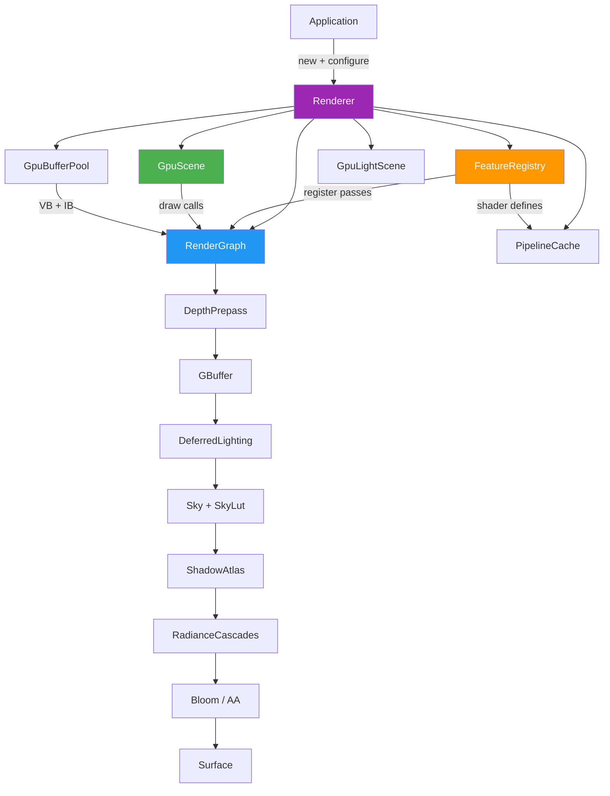

Helio is a production-grade real-time renderer built on [wgpu](https://wgpu.rs/) in pure Rust. It provides a clean, data-driven architecture: a **dependency-driven render graph** that orders passes automatically from resource declarations, a **feature system** backed by WGSL specialization constants, a **GPU-resident scene** that batches all per-object data into a single storage buffer with dirty-only uploads, and a **unified geometry pool** that enables `multi_draw_indexed_indirect` across the entire opaque scene in a single GPU call. The result is a renderer that runs on Vulkan, Metal, DirectX 12, and WebGPU — desktop, Android, and browser — from one codebase.


## Architecture at a Glance

The `Renderer` struct owns five cooperating subsystems. The **`RenderGraph`** executes GPU work in a dependency-sorted pass sequence each frame. The **`FeatureRegistry`** holds modular rendering features — shadows, bloom, global illumination, billboards — that each register passes, allocate GPU resources, and contribute WGSL `override` constants. The **`GpuScene`** keeps all per-object instance data in a single GPU storage buffer with a free-list allocator and FNV-1a hash dirty-tracking. The **`GpuBufferPool`** holds all mesh vertices and indices in two large shared buffers. The **`PipelineCache`** deduplicates and reuses `wgpu::RenderPipeline` objects across the entire frame.



Every `render()` call follows a three-phase loop: **prepare** (upload dirty GPU data, call `prepare()` on each enabled feature), **execute** (run the sorted pass list), and **present** (submit the command encoder to the queue).

## In This Section

The Helio documentation is organized into focused topic pages. Start with **Getting Started** if you are new, or jump directly to any subsystem.

---

### [Getting Started](./getting-started)

Prerequisites, Cargo workspace structure, running the bundled examples, a step-by-step minimal integration walkthrough, WASM build instructions, and Android cross-compilation.

---

### [The Render Graph](./render-graph)

How passes declare resource reads, writes, and creates through `PassResourceBuilder`. Kahn's topological sort and cycle detection. Runtime pass toggling with `set_pass_enabled`. The full default pass execution order and how to extend it with custom passes.

---

### [The Feature System](./feature-system)

The `Feature` trait lifecycle (`register` → `prepare` → `on_state_change`). `ShaderDefine` and WGSL `override` constants. `FeatureContext` and `PrepareContext`. All six built-in features. Writing a custom feature with a complete worked example.

---

### [The Deferred Pipeline](./deferred-pipeline)

The depth prepass, hierarchical-Z occlusion culling, the four-target G-buffer, workflow-resolved specular `F0` packing, GPU-driven `multi_draw_indexed_indirect`, deferred lighting bind groups, transparent forward pass, and the full bind group assignment table.

---

### [GPU-Resident Scene](./gpu-scene)

`GpuInstanceData` layout (128 bytes, free-list allocator, FNV-1a hash). The persistent proxy API (`add_object`, `update_transform`, `disable_object`, `remove_object`). `GpuBufferPool` grow-on-demand logic. `GpuLightScene` and shadow atlas layer assignment.

---

### [Materials and Geometry](./materials)

The `Material` / `GpuMaterial` type system. Metallic-roughness and explicit specular/IOR workflows. Texture channel conventions (ORM packing, sRGB vs linear). `PackedVertex` SNORM8x4 layout with tangent handedness. Frustum culling with Gribb-Hartmann plane extraction and Arvo AABB transform.

---

### [Asset Loading and Material Workflows](./asset-loading)

The `helio-asset-compat` bridge for FBX, glTF 2.0, OBJ, and USD scenes. Relative texture resolution, embedded bytes, UV Y-flip handling, per-primitive mesh splitting, and how imported materials map into Helio's metallic-roughness vs specular/IOR workflows.

---

### [Lighting and Shadows](./lighting)

Point, spot, and directional light constructors. The `GpuLight` 64-byte GPU layout. `LightingFeature` and `ShadowsFeature`. The 2048×2048 shadow atlas (`Texture2DArray`, up to 256 layers). Four-cascade CSM with logarithmic splits and front-face culling. PCF sampling. `GpuLightScene` dirty-tracking.

---

### [Sky and Atmosphere](./sky-atmosphere)

Rayleigh + Mie scattering LUTs (256×64 `Rgba16Float`). `SkyAtmosphere` parameters. `VolumetricClouds`. The `Skylight` ambient contribution. Sun-direction detection for GI synchronization. Lazy LUT re-rendering on `sky_state_changed`.

---

### [Radiance Cascades](./radiance-cascades)

Screen-space global illumination with a four-level hierarchical probe grid. Cascade dimensions (PROBE_DIMS, DIR_DIMS, T_MAXS). Atlas layout (ATLAS_W=64, Rgba16Float). History blending for temporal stability. Hardware ray-query path vs screen-space fallback. `with_world_bounds` and `with_camera_follow` configuration.

---

### [SDF Constructive Solid Geometry](./sdf)

Implicit surfaces and boolean operations without mesh artifacts. `SdfShapeType`, `BooleanOp`, smooth blending. The `SdfEditList` ordered evaluation. Multi-level clip maps centered on camera. Sparse brick maps with u8-quantized SDF values. The `EditBvh` for O(log N) tile culling. CPU-side `pick_ray` for surface selection.

---

### [Post-Processing](./post-processing)

Physically-based bloom (multi-pass downsample/upsample). Anti-aliasing: FXAA, SMAA, TAA (feedback 0.88–0.97, history blending), MSAA. SSAO configuration. The `pre_aa_texture` intermediate target. `RendererConfig` builder methods.

---

### [Debug Visualization and Profiling](./debug-profiling)

`DebugShape` variants and per-frame draw API. `DebugVizSystem` with built-in overlays (light ranges, mesh bounds, world grid) and custom `DebugRenderer` registration. Editor mode (automatic light billboard icons). `GpuProfiler` with double-buffered `TIMESTAMP_QUERY` readback. The `profile_scope!` macro — zero-cost when no portal is connected.

---

### [Live Portal](./live-portal)

The optional real-time web performance dashboard (`helio-live-portal` Cargo feature). `start_live_portal_default()` opens a browser tab at `http://0.0.0.0:7878`. `PortalFrameSnapshot` data — pass timings, draw call counts, scene delta updates. Zero-overhead profiling gate via `AtomicBool`.

---

## Platform Support

| Platform | Backend | Notes |
|---|---|---|
| Windows | DirectX 12, Vulkan | Full feature set |
| Linux | Vulkan | Full feature set |
| macOS / iOS | Metal | Full feature set |
| Android | Vulkan | `aarch64-linux-android` via `cargo-apk` |
| Browser | WebGPU | `wasm32-unknown-unknown`; live portal unavailable |

> [!NOTE]
> WebGPU support in browsers requires a recent version of Chrome. The `helio-live-portal` crate is excluded from WASM builds — the `start_live_portal` API always exists on native targets but returns `Err` if the `live-portal` Cargo feature is not enabled.

## Quick Start

```rust
use helio_render_v2::{Renderer, RendererConfig, Camera, SceneLight, SkyAtmosphere};
use helio_render_v2::features::*;
use helio_render_v2::passes::AntiAliasingMode;

// 1. Feature registry
let features = FeatureRegistry::builder()
    .with_feature(LightingFeature::new())
    .with_feature(ShadowsFeature::new())
    .with_feature(BloomFeature::new().with_intensity(0.4))
    .build();

// 2. Renderer
let config = RendererConfig::new(width, height, surface_format, features)
    .with_aa(AntiAliasingMode::Taa);
let mut renderer = Renderer::new(&device, &queue, config).await?;

// 3. Scene
let mesh  = renderer.create_mesh_unit_cube();
let _obj  = renderer.add_object(&mesh, None, glam::Mat4::IDENTITY);
let _sun  = renderer.add_light(SceneLight::directional(
    [0.4, -0.8, 0.4], [1.0, 0.95, 0.8], 3.0,
));
renderer.set_sky_atmosphere(Some(SkyAtmosphere::default()));

// 4. Render loop
let camera = Camera::perspective(eye, target, up, fov_y, aspect, 0.1, 1000.0, elapsed);
renderer.render(&device, &queue, &surface_view, &camera)?;
```

See **[Getting Started](./getting-started)** for the full walkthrough including wgpu device setup, resize handling, and WASM/Android build instructions.
