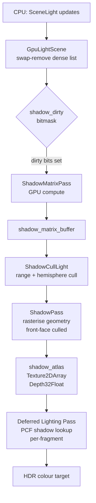
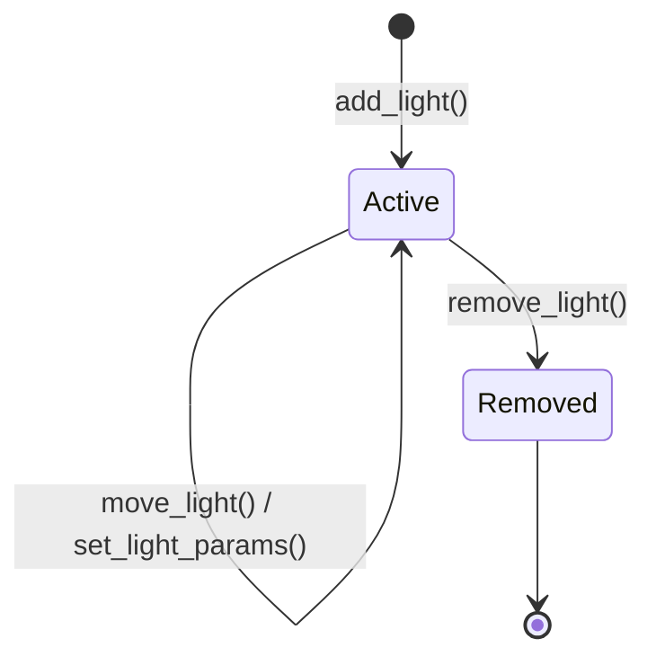
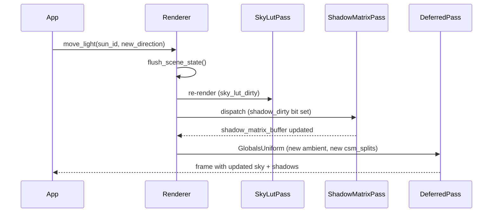

# Lighting and Shadows

Helio's lighting system is built around three tightly coupled subsystems: a **physically based
shading** (PBS) model evaluated in the deferred lighting pass, a **persistent light manager** that
keeps GPU-side light data dense and always up-to-date, and a **cascaded shadow map** (CSM) pipeline
with GPU-driven culling and matrix computation. Together they produce soft, plausible shadows at
scale while keeping CPU overhead low enough to suit real-time workloads.

This page covers every layer of that stack — from the Cook-Torrance BRDF to the `shadow_generation`
dirty counter — so you can understand, configure, and extend Helio's lighting without surprises.

---

## Physically Based Shading

Helio uses the **Cook-Torrance microfacet specular BRDF** paired with a Lambertian diffuse lobe.
Every surface is described by two material parameters — **base color** (albedo), **metallic**, and
**roughness** — and those parameters feed the same shading equation for every light type, including
the ambient contribution at the end.

### The Cook-Torrance Model

The specular reflectance for a single light is:

$$f_r(\mathbf{v}, \mathbf{l}) = \frac{D(\mathbf{h},\alpha) \cdot G(\mathbf{v},\mathbf{l},\alpha) \cdot F(\mathbf{v},\mathbf{h},F_0)}{4\,(\mathbf{n} \cdot \mathbf{v})\,(\mathbf{n} \cdot \mathbf{l})}$$

Where:
- $\mathbf{h} = \text{normalize}(\mathbf{v} + \mathbf{l})$ — half-vector between view and light
- $\mathbf{n}$ — surface normal
- $\alpha = \text{roughness}^2$

| Term | Meaning | Helio implementation |
|------|---------|----------------------|
| `D`  | Normal distribution function | GGX / Trowbridge-Reitz |
| `G`  | Geometry / self-shadowing term | Smith-GGX height-correlated |
| `F`  | Fresnel reflectance | Schlick approximation |
| `α`  | Perceptual roughness² | read from G-buffer roughness channel |
| `F₀` | Specular colour at 0° | lerp(0.04, albedo, metallic) |

#### F₀ — Base Reflectance

$F_0$ is the specular colour at normal incidence ($\theta = 0°$). Dielectrics (water, glass, plastic) have $F_0 \approx 0.04$ — about 4% reflectance. Metals set $F_0$ equal to the albedo: all energy goes to specular, tinted by the surface base colour.

$$F_0 = \text{lerp}(0.04,\; \text{albedo},\; \text{metallic})$$

#### GGX Normal Distribution Function

$D$ counts the statistical fraction of microfacets whose normal aligns with the half-vector $\mathbf{h}$:

$$D(\mathbf{n},\mathbf{h},\alpha) = \frac{\alpha^2}{\pi\bigl[(\mathbf{n}\cdot\mathbf{h})^2(\alpha^2-1)+1\bigr]^2}$$

where $\alpha = \text{roughness}^2$. High $\alpha$ (rough surface) produces a wide distribution and a broad highlight. Low $\alpha$ (smooth surface) produces a sharp peak at $\mathbf{n}\cdot\mathbf{h}=1$, giving mirror-like reflection.

#### Smith Geometry Shadowing Function

$G$ models the probability that a microfacet is visible from both the view and light directions — i.e. not self-shadowed or masked:

$$G_1(\mathbf{n},\mathbf{x},k) = \frac{\mathbf{n}\cdot\mathbf{x}}{(\mathbf{n}\cdot\mathbf{x})(1-k)+k}, \quad k = \frac{(\alpha+1)^2}{8}$$

$$G(\mathbf{n},\mathbf{v},\mathbf{l},k) = G_1(\mathbf{n},\mathbf{v},k)\cdot G_1(\mathbf{n},\mathbf{l},k)$$

#### Schlick Fresnel Approximation

$F$ gives the fraction of light reflected at a given view angle. Reflectance increases at grazing angles — surfaces look more mirror-like when viewed edge-on:

$$F(\mathbf{v},\mathbf{h},F_0) = F_0 + (1-F_0)(1-\mathbf{v}\cdot\mathbf{h})^5$$

#### Energy Conservation

The full BRDF balances specular and diffuse so the surface cannot emit more energy than it receives. The Fresnel term $F$ determines what fraction of incoming light becomes specular; the remainder $(1-F)$ is available for diffuse. For metals (`metallic = 1`) the diffuse term is zero — all energy goes to specular with albedo-tinted $F_0$:

$$f(\mathbf{v},\mathbf{l}) = k_d \frac{\text{albedo}}{\pi} + k_s \cdot f_r(\mathbf{v},\mathbf{l})$$

$$k_s = F, \quad k_d = (1 - F)(1 - \text{metallic})$$

```wgsl
let ks = fresnel;
let kd = (vec3(1.0) - ks) * (1.0 - metallic);
let diffuse  = kd * albedo / PI;
let specular = (D * G * F) / max(4.0 * n_dot_v * n_dot_l, 0.0001);
let Lo = (diffuse + specular) * radiance * n_dot_l;
```

The diffuse term uses the Lambertian model multiplied by `(1 − F) · (1 − metallic)` to ensure
energy conservation — a fully metallic surface has no diffuse contribution.

Because Helio uses a **deferred pipeline**, the BRDF is evaluated once per pixel per light in the
lighting pass, not per-geometry. The G-buffer stores packed albedo, normal, metallic, roughness,
and depth, and the full screen-space shading loop iterates over all active lights, accumulating
diffuse and specular into the HDR colour target.

<!-- screenshot: deferred G-buffer channels visualised side-by-side (albedo / normal / metallic-roughness) -->

> [!NOTE]
> The shading loop is in the deferred lighting pass WGSL shader.  The loop bound is `light_count`
> from `GlobalsUniform`, so lights you have not added to the scene cost nothing at all.

---

## Light Types

Helio exposes three physical light archetypes through `LightType`:

```rust
pub enum LightType {
    Directional,
    Point,
    Spot { inner_angle: f32, outer_angle: f32 },
}
```

### Directional Light

A directional light models an infinitely distant source — the Sun, the Moon, a studio key light at
the horizon.  It has a **direction** but no meaningful position, so attenuation is not applied; the
full intensity reaches every surface regardless of world-space distance.

Helio's shadow system allocates **four atlas layers** (one per CSM cascade) for each directional
light.  There is no range limit, but the CSM `shadow_max_distance` governs how far cascades extend
from the camera.

### Point Light

A point light radiates uniformly in all directions from a single world-space position.  Helio uses
a physically correct inverse-square attenuation windowed by the `range` field:

$$\text{attenuation}(d, r) = \frac{\text{saturate}\!\left(1 - \left(\tfrac{d}{r}\right)^4\right)^2}{d^2}$$

where $d$ is the distance to the light and $r$ is the light's range. The $(d/r)^4$ term creates a smooth rolloff at the boundary — attenuation reaches exactly 0 when $d = r$, eliminating harsh cutoff artefacts. The $1/d^2$ term is physically correct inverse-square falloff. Together they give physically-based behaviour near the light while guaranteeing zero contribution beyond the range.

```wgsl
fn point_attenuation(dist: f32, range: f32) -> f32 {
    let ratio = dist / range;
    let window = saturate(1.0 - ratio * ratio * ratio * ratio);
    return (window * window) / max(dist * dist, 0.0001);
}
```

The smooth window prevents hard cutoffs while respecting the `range` bound for culling.  Point
lights allocate **six atlas layers** — one per cube face — when shadow casting is enabled.

### Spot Light

A spot light is a point light restricted to a cone defined by two half-angles:

- **`inner_angle`** — the angle from the cone axis within which light is at full intensity.
- **`outer_angle`** — the angle at which light reaches zero (the soft edge).

Both are stored on `GpuLight` as precomputed **cosines** (`cos_inner`, `cos_outer`) to eliminate
per-fragment trig in the shader.  The falloff between the two angles is a smooth Hermite curve,
giving control over the penumbra without extra parameters.

$$\text{falloff}(\theta) = \text{smoothstep}(\cos\theta_{\text{outer}},\; \cos\theta_{\text{inner}},\; \cos\theta_{\text{actual}})$$

$\theta_{\text{inner}}$ is the half-angle of the full-brightness cone; $\theta_{\text{outer}}$ is the half-angle of the dark boundary. `smoothstep` applies a smooth Hermite curve between them — no hard edge. Note: because a larger angle corresponds to a smaller cosine, the arguments are in reverse cosine order — `cos_outer` (smaller value) is the low edge and `cos_inner` (larger value) is the high edge.

```wgsl
fn spot_falloff(cos_theta: f32, cos_inner: f32, cos_outer: f32) -> f32 {
    return smoothstep(cos_outer, cos_inner, cos_theta);
}
```

Spot lights allocate **one atlas layer** for shadows — a single perspective frustum aligned with
the cone axis.

> [!TIP]
> Keep `outer_angle − inner_angle` ≥ 0.05 radians to avoid a harsh spotlight edge.  Very narrow
> cones (outer < 0.1 rad) still render correctly but the shadow frustum becomes very tight, which
> can exaggerate shadow-map precision artefacts at range.

---

## Creating Lights

`SceneLight` has three named constructors that set sensible defaults for each archetype:

```rust
pub struct SceneLight {
    pub light_type: LightType,
    pub position:   [f32; 3],
    pub direction:  [f32; 3],
    pub color:      [f32; 3],
    pub intensity:  f32,
    pub range:      f32,
}
```

### `SceneLight::directional`

```rust
pub fn directional(direction: [f32; 3], color: [f32; 3], intensity: f32) -> Self
```

Creates a directional light.  `position` defaults to `[0, 0, 0]` (unused by the shader) and
`range` to `1000.0` (used only as the CSM shadow extent hint).  Pass a normalised direction vector
pointing **from** the light source **toward** the scene — for a midday Sun, something like
`[0.0, -1.0, 0.2]`.

### `SceneLight::point`

```rust
pub fn point(position: [f32; 3], color: [f32; 3], intensity: f32, range: f32) -> Self
```

`direction` defaults to `[0, -1, 0]` and is unused for shading but is kept for consistent struct
layout.  `range` is the world-space radius of influence; beyond it attenuation is effectively zero.
A typical interior point light might use `range = 8.0` with `intensity = 400.0` (physical lumens).

### `SceneLight::spot`

```rust
pub fn spot(
    position:    [f32; 3],
    direction:   [f32; 3],
    color:       [f32; 3],
    intensity:   f32,
    range:       f32,
    inner_angle: f32,  // half-angle of full-brightness cone, radians
    outer_angle: f32,  // half-angle of zero-brightness edge, radians
) -> Self
```

Both angles are **half-angles** measured from the cone axis.  The constructor precomputes nothing —
`cos_inner` and `cos_outer` are computed when the light is uploaded to the GPU (see `GpuLight`
below).

---

## GPU Light Representation

The CPU `SceneLight` is translated into `GpuLight` before upload to the GPU storage buffer:

```rust
pub(crate) struct GpuLight {
    pub position:   [f32; 3],
    pub light_type: f32,    // 0.0 = directional, 1.0 = point, 2.0 = spot
    pub direction:  [f32; 3],
    pub range:      f32,
    pub color:      [f32; 3],
    pub intensity:  f32,
    pub cos_inner:  f32,    // cos(inner_angle) — precomputed once at upload
    pub cos_outer:  f32,    // cos(outer_angle) — precomputed once at upload
    pub _pad:       [f32; 2],
}
```

The struct is exactly **64 bytes**, matching the WGSL side-by-side.  Keeping the struct power-of-two
aligned means the GPU can address any light with a single stride multiply without any runtime
offset arithmetic.

`light_type` is encoded as a float rather than an integer to avoid WGSL uniform type restrictions
on some backends.  The WGSL shader compares with `== 0.0`, `== 1.0`, and `== 2.0` which is safe
for these small whole-number values.

`cos_inner` and `cos_outer` are precomputed on the CPU once at light-upload time.  The spotlight
falloff in the shader then becomes a single `smoothstep(cos_outer, cos_inner, cos_theta)` — no
`acos`, no `atan2`, no branching.

> [!NOTE]
> For directional and point lights, `cos_inner` and `cos_outer` are both 0.0.  The shader skips
> the cone test entirely for those light types, so there is no wasted computation.

### Light Buffer Capacity

```rust
pub(crate) const MAX_LIGHTS: u32 = 2048;
```

The GPU storage buffer is pre-allocated for 2048 `GpuLight` entries (128 KiB total).  This constant
was chosen to fit comfortably within the tiled light list budget used by the deferred shading pass
on all WebGPU-capable hardware.  In practice, scenes rarely exceed a few hundred dynamic lights;
the remainder of the buffer is wasted space but costs nothing at runtime because `light_count` in
`GlobalsUniform` limits the shader's iteration bound.

---

## The `LightingFeature`

`LightingFeature` is a render-graph feature that allocates the GPU light buffer and injects the
lighting shader defines:

```rust
pub struct LightingFeature {
    enabled: bool,
    light_buffer: Option<Arc<wgpu::Buffer>>,
}

impl LightingFeature {
    pub fn new() -> Self { ... }
}
```

During `register()`, `LightingFeature`:

1. Creates a GPU **storage buffer** large enough for `MAX_LIGHTS` `GpuLight` structs.
2. Stores the buffer handle in `ctx.light_buffer` for downstream passes.
3. Sets the shader define `ENABLE_LIGHTING = true`, which gates the entire lighting loop in the
   deferred WGSL shader via `#ifdef`.

If `LightingFeature` is omitted from the renderer, the deferred pass compiles without the lighting
loop and renders only unlit albedo — useful for debugging G-buffer contents.

---

## The `ShadowsFeature`

Shadow mapping in Helio is configured through `ShadowsFeature`, which manages the shadow atlas
texture and the PCF comparison sampler:

```rust
pub struct ShadowsFeature {
    atlas_size:        u32,
    max_shadow_lights: u32,
    shadow_atlas:      Option<wgpu::Texture>,
    shadow_atlas_view: Option<Arc<wgpu::TextureView>>,
    shadow_sampler:    Option<Arc<wgpu::Sampler>>,
}
```

### Construction and Configuration

```rust
ShadowsFeature::new()
    .with_atlas_size(4096)       // larger tiles per face → sharper shadows
    .with_max_lights(32)         // fewer lights → more GPU memory headroom
```

| Method | Default | Effect |
|--------|---------|--------|
| `with_atlas_size(u32)` | 2048 | Side length of each atlas layer in texels |
| `with_max_lights(u32)` | 40 | Max simultaneous shadow-casting lights |

> [!IMPORTANT]
> `max_shadow_lights` is internally capped at **42** — derived from `MAX_ATLAS_LAYERS / 6 = 256 / 6
> = 42`.  Values above 42 are silently reduced.  The default of 40 (40 × 6 = 240 layers) leaves a
> small safety margin below the 256-layer hard limit.

### What `register()` Does

During `register()`, `ShadowsFeature`:

1. Computes the safe cap: `min(max_shadow_lights, 256 / 6)`.
2. Creates the **shadow atlas** — a `Texture2DArray` with `Depth32Float` format, `atlas_size ×
   atlas_size` per layer, `max_shadow_lights × max_faces_per_type` total layers.
3. Creates the **comparison sampler** with `compare_function = Less`, enabling PCF filtering
   directly in the sampler without any manual loop in the shader.
4. Registers a `ShadowPass` with the render graph.
5. Stores `shadow_atlas_view` and `shadow_sampler` in `ctx` for use by the geometry and lighting
   passes.
6. Sets `ENABLE_SHADOWS = true` and `MAX_SHADOW_LIGHTS = N` as shader defines.

---

## Shadow Atlas Layout

The shadow atlas is a **`Texture2DArray`** — a single GPU texture object with many layers of
identical `atlas_size × atlas_size` depth images.

```
Layer 0  ┌──────────────┐  Directional cascade 0  (nearest, highest resolution)
Layer 1  ├──────────────┤  Directional cascade 1
Layer 2  ├──────────────┤  Directional cascade 2
Layer 3  ├──────────────┤  Directional cascade 3  (furthest)
Layer 4  ├──────────────┤  Point light 0, cube face +X
Layer 5  ├──────────────┤  Point light 0, cube face -X
Layer 6  ├──────────────┤  Point light 0, cube face +Y
Layer 7  ├──────────────┤  Point light 0, cube face -Y
Layer 8  ├──────────────┤  Point light 0, cube face +Z
Layer 9  ├──────────────┤  Point light 0, cube face -Z
Layer 10 ├──────────────┤  Spot light 0, single face
  ...
```

Face counts by light type:

| Light type | Atlas layers consumed |
|------------|-----------------------|
| Directional | 4 (one per CSM cascade) |
| Point | 6 (one per cube face) |
| Spot | 1 (single perspective frustum) |

The `face_counts` vector in `GpuLightScene` is rebuilt whenever lights are added or removed.  It
records exactly how many consecutive atlas layers each light slot owns, allowing the shadow pass to
iterate only the layers that are actually allocated.

> [!NOTE]
> Unused layers at the end of the atlas are never written or sampled, so keeping
> `max_shadow_lights` at the minimum your scene needs reduces GPU memory and texture cache pressure.

<!-- screenshot: RenderDoc capture of shadow atlas layers 0-9 showing CSM cascades and one point light cube-face set -->

---

## Cascaded Shadow Maps

Directional lights use a **4-cascade CSM** to balance shadow resolution near the camera against
coverage far away.

### Split Scheme

Cascade splits are computed from the camera's near and far planes using a logarithmic scheme that
weights more layers toward the viewer. For $N$ cascades with near plane $z_n$ and far plane $z_f$:

$$z_i^{\text{log}} = z_n \left(\frac{z_f}{z_n}\right)^{i/N}$$

$$z_i^{\text{uni}} = z_n + (z_f - z_n)\frac{i}{N}$$

$$z_i = \lambda \cdot z_i^{\text{log}} + (1-\lambda) \cdot z_i^{\text{uni}}$$

Pure logarithmic splits ($z_i^{\text{log}}$) allocate more cascade precision near the camera where detail is needed most. Uniform splits ($z_i^{\text{uni}}$) distribute coverage evenly across the view range. The blend factor $\lambda$ (PSSM correction factor, typically 0.5–0.9) mixes the two to avoid extremely thin near cascades on large outdoor scenes while preserving close-range shadow detail.

The four resulting world-space depths are uploaded every frame in `GlobalsUniform.csm_splits`:

```rust
struct GlobalsUniform {
    csm_splits: [f32; 4],   // world-space far edges of cascades 0..3
    ...
}
```

The deferred shader uses `csm_splits` to select which cascade layer to sample, choosing the
smallest cascade whose far plane exceeds the fragment's depth.

### Cascade Indices

| Index | Coverage | Resolution |
|-------|----------|------------|
| 0 | Nearest (~0–10 m typical) | Finest — full atlas tile |
| 1 | Near-mid (~10–40 m) | Fine |
| 2 | Far-mid (~40–150 m) | Coarse |
| 3 | Furthest (~150–500 m) | Coarsest — whole scene fits |

> [!TIP]
> If you see shadow resolution drop sharply at a visible seam, the logarithmic split ratio is too
> aggressive.  Lower the far plane of your camera or increase `atlas_size` for cascade 2 and 3.

### Front-Face Culling and Peter Panning

Helio renders shadow geometry with **front-face culling** (discarding front-facing triangles,
keeping back-facing ones).  This means the depth stored in the shadow map comes from the back
surface of each occluder rather than its front.

This technique is the standard cure for **Peter Panning** — the floating shadow artefact caused by
a depth bias large enough to push the shadow receiver off the caster.  By reading back-face depth,
the natural surface thickness acts as an implicit bias, so Helio sets depth bias to **zero** on all
directional shadow passes.

```
Without front-face culling:          With front-face culling (Helio):
  Shadow stored at front face          Shadow stored at back face
  + explicit depth bias nudge          Thickness = implicit bias
  → Peter Pan artefact likely          → Zero explicit bias required
```

> [!WARNING]
> Extremely thin geometry (single-sided planes, foliage cards) has no back face and will be
> invisible to the shadow pass.  Ensure foliage is either two-sided or uses an alpha-tested shadow
> shader that writes depth from the front face explicitly.

---

## GPU Shadow Matrix Computation

Helio does not recompute shadow matrices on the CPU every frame.  Instead, a **GPU compute pass**
(`ShadowMatrixPass`) reads light state and writes view-projection matrices, driven by a dirty
bitmask.

```
┌─────────────────────┐     dirty bits      ┌──────────────────────────┐
│  GpuLightScene (CPU)│ ──────────────────► │ shadow_dirty_buffer (GPU)│
└─────────────────────┘                     └────────────┬─────────────┘
                                                         │ dispatch
                                                         ▼
                                            ┌──────────────────────────┐
                                            │  shadow_matrix.wgsl      │
                                            │  (compute shader)        │
                                            │  reads: positions/types  │
                                            │  writes: shadow matrices │
                                            └────────────┬─────────────┘
                                                         │
                                                         ▼
                                            ┌──────────────────────────┐
                                            │  shadow_matrix_buffer    │
                                            │  (GPU storage)           │
                                            └──────────────────────────┘
```

Each light slot has a `shadow_generation: u64` — a monotonic counter incremented whenever
`shadow_dirty` is set for that light.  Passes downstream can compare the stored generation against
the last generation they consumed to decide whether cached data is still valid, without reading any
light parameters.

The compute shader:

- **Directional lights**: computes 4 orthographic view-projection matrices, one per CSM cascade,
  fitting the frustum slice for that cascade around the camera-facing hemisphere.
- **Point lights**: computes 6 perspective view-projection matrices, one per cube face.
- **Spot lights**: computes 1 perspective view-projection matrix aligned to the cone axis, with FOV
  equal to `2 × outer_angle`.

Only slots whose dirty bit is set are reprocessed.  A scene with 200 static lights and 3 moving
lights dispatches matrix work for only those 3 slots.

---

## Shadow Culling

Before the shadow-map rasterisation pass, Helio runs a **CPU-side culling stage** that determines
which meshes need to be rendered into which shadow atlas layers.

### `ShadowCullLight`

```rust
pub struct ShadowCullLight {
    pub position:       [f32; 3],
    pub direction:      [f32; 3],
    pub range:          f32,
    pub is_directional: bool,
    pub is_point:       bool,
    pub matrix_hash:    u64,  // FNV-1a hash of shadow matrices — changes when light moves
}
```

The `matrix_hash` is an FNV-1a hash of the raw shadow matrix bytes.  When the hash is identical
frame-over-frame, the shadow pass can skip re-rendering that light entirely, relying on the atlas
contents from the previous frame.  This gives static lights essentially free shadows after the
first frame.

FNV-1a is a 64-bit non-cryptographic hash well suited to small fixed-size inputs like a 64-byte transform matrix:

$$h_0 = 14695981039346656037$$

$$h_{i+1} = (h_i \oplus b_i) \times 1099511628211$$

where $b_i$ is byte $i$ of the input data and $\oplus$ is bitwise XOR. The $2^{64}$ hash space makes false positives negligible in practice — if the output hash matches the cached hash, the matrices are unchanged and shadow rasterisation is skipped entirely for that light.

```rust
const FNV_OFFSET: u64 = 14_695_981_039_346_656_037;
const FNV_PRIME:  u64 = 1_099_511_628_211;

fn fnv1a_64(data: &[u8]) -> u64 {
    let mut hash = FNV_OFFSET;
    for &byte in data {
        hash ^= byte as u64;
        hash = hash.wrapping_mul(FNV_PRIME);
    }
    hash
}
```

### Range Cull — 5× Extension

For point and spot lights, the cull radius is extended to **5× the light's `range`**:

```
cull_radius = light.range * 5.0
```

This aggressive extension is intentional.  The regular `range` field governs light *intensity*
attenuation, but a caster just outside the attenuation sphere can still cast a shadow into the
sphere.  Extending the cull radius ensures distant large occluders (building walls, terrain) are
included in shadow renders even when they receive no direct illumination from the light.

### Hemisphere Cull (Point Lights)

For each of the six cube-face passes of a point light, meshes that lie entirely on the **opposite
hemisphere** from the face direction are skipped.  This is a fast dot-product test against the
face's outward normal; meshes straddling the equator are conservatively included.

```
Face +X normal = [1, 0, 0]
For each mesh AABB centre C:
    if dot(C − light.position, face_normal) < −aabb_radius → skip face
```

Combined with range culling, hemisphere culling typically eliminates 30–50 % of draw calls per
point light face in typical interior scenes.

<!-- screenshot: shadow culling debug overlay showing per-light draw counts per face -->

---

## Shadow Pipeline Data Flow

The following diagram shows the full per-frame shadow pipeline:



---

## The Persistent Light API

Helio's light manager (`GpuLightScene`) maintains a dense, monotonically growing list of light
slots.  You interact with it through four verbs on the renderer:

```rust
// Add a light — returns a stable LightId handle
let sun_id: LightId = renderer.add_light(SceneLight::directional(
    [0.3, -0.9, 0.3],
    [1.0, 0.95, 0.85],
    120_000.0,
));

// Move or re-orient the light (marks shadow matrices dirty)
renderer.move_light(sun_id, new_position, new_direction);

// Change colour, intensity, range, or cone angles (marks dirty if shadow-relevant)
renderer.set_light_params(sun_id, |light| {
    light.intensity = 80_000.0;
    light.color = [0.9, 0.75, 0.6];  // sunset tint
});

// Remove the light entirely
renderer.remove_light(sun_id);
```

### `LightId` Semantics

`LightId` is a monotonic `u32` — it is **never reused**.  `LightId::INVALID` is `u32::MAX`.
Passing an invalid or stale `LightId` to any method is a no-op (debug builds assert, release builds
silently skip).



### Swap-Remove Deletion

When a light is removed, its slot is filled by the **last active light** in the list (swap-remove
semantics).  This keeps the light array dense without holes, so GPU uploads and shader loops never
skip indices.

After a swap-remove:

1. The swapped light's GPU slot is overwritten with its data.
2. Both the freed slot and the swapped slot are marked `shadow_dirty`.
3. The `face_counts` vector is rebuilt for the affected range.
4. The `shadow_generation` counter for the swapped-into slot is incremented so downstream passes
   know to treat cached shadow data as stale.

> [!IMPORTANT]
> Never cache the internal slot index of a light.  Always use `LightId` to reference lights.  The
> slot index can silently change on any `remove_light` call if a swap-remove occurs.

---

## Shadow Generation Counters

```rust
shadow_generation: Vec<u64>  // one entry per light slot
```

`shadow_generation[slot]` is a monotonic counter that is bumped whenever `shadow_dirty` is set for
that slot.  It serves as a **change token** for any pass or system that caches per-light state:

- If the generation at read time equals the generation at last-write time, the cached state is valid.
- If it differs, the cache is stale and must be rebuilt.

This is cheaper than hashing light parameters and lets the CPU side opt into fine-grained
invalidation without the shadow pass needing to understand the semantics of each parameter.

The `ShadowCullLight.matrix_hash` (FNV-1a) is a complementary mechanism at a different
granularity: it hashes the actual shadow matrices, allowing the entire rasterisation step to be
skipped for a light that is dirty-flagged (e.g. a small intensity change) but whose view frustum
has not changed.

---

## Ambient Lighting

Every scene in Helio has an ambient light contribution that fills surfaces not reached by any
direct light source.  It is composed of two orthogonal mechanisms.

### Analytical Ambient

```rust
struct SceneState {
    ambient_color:     [f32; 3],
    ambient_intensity: f32,
    ...
}
```

`ambient_color × ambient_intensity` is a flat, isotropic colour added to every fragment after the
direct lighting loop.  It has no directionality and is very cheap — a single multiply-add in the
shader.

### Skylight Contribution

When the sky-atmosphere system is active and a `Skylight` is configured, `flush_scene_state`
automatically composites the sky contribution into the effective ambient:

```
scene_ambient_color = ambient_color × ambient_intensity
                    + skylight.color × skylight.intensity
```

The skylight tint typically comes from the sky LUT rendered by `SkyLutPass` and represents the
integrated irradiance from the visible sky hemisphere.  As the Sun moves and the sky colour shifts
from blue to orange-red at dusk, the skylight tint updates automatically.

`GlobalsUniform.ambient_color` and `ambient_intensity` receive the composed value each frame, so
the deferred lighting shader always reads the final effective ambient without needing to know
whether a sky atmosphere is active.

<!-- screenshot: scene at sunset showing warm ambient fill from skylight tint versus flat white analytical ambient -->

> [!TIP]
> Set `ambient_intensity` to a small non-zero value even in dark interior scenes.  A value of
> 0.03–0.05 prevents fully unlit surfaces from rendering as pure black, which rarely looks correct
> and can cause floating-point precision issues in tone-mapping.

---

## `flush_scene_state` and Dynamic Time-of-Day

Each frame, `flush_scene_state` performs the ambient composition and several change-detection
checks:

```rust
// Pseudocode for flush_scene_state:
if scene_state.sky_lut_dirty {
    render SkyLutPass();
    scene_state.sky_lut_dirty = false;
}

let composed_ambient = scene_state.ambient_color * scene_state.ambient_intensity
                     + skylight_contribution();
globals_uniform.ambient_color     = composed_ambient;
globals_uniform.ambient_intensity = 1.0;  // already baked in

let sun = get_directional_light(sun_light_id);
if sun.direction != scene_state.cached_sun_direction
|| sun.intensity != scene_state.cached_sun_intensity
{
    scene_state.cached_sun_direction = sun.direction;
    scene_state.cached_sun_intensity = sun.intensity;
    mark_shadow_matrices_dirty(sun_light_id);
    scene_state.sky_lut_dirty = true;   // re-render sky for new sun angle
    scene_state.ambient_dirty = true;   // re-composite ambient
}
```

This means that updating your directional light each frame to simulate a moving Sun requires only
calling `move_light` (or `set_light_params` for intensity) — the rest of the pipeline reacts
automatically:

1. Shadow matrices are recomputed by `ShadowMatrixPass`.
2. The sky LUT is re-rendered by `SkyLutPass`, shifting the sky colour.
3. The ambient is recomposited with the new skylight tint.
4. `csm_splits` are re-uploaded in `GlobalsUniform` (they are recalculated each frame relative to
   the camera frustum regardless of the Sun position).



### CSM Splits Each Frame

Even when the Sun is static, `csm_splits` in `GlobalsUniform` are recalculated and uploaded every
frame:

```rust
struct GlobalsUniform {
    csm_splits: [f32; 4],   // world-space far edges, recomputed from camera near/far
    ...
}
```

This is because the optimal split positions depend on the camera's current near and far planes,
which can change whenever the camera moves through very open or very enclosed spaces.  Recomputing
every frame is cheap (four scalar operations) and ensures cascade transitions remain smooth even
during fast camera movement.

---

## Performance Guidance

```mermaid
quadrantChart
    title Shadow cost vs scene benefit
    x-axis Low benefit --> High benefit
    y-axis Low cost --> High cost
    quadrant-1 Use sparingly
    quadrant-2 Avoid if possible
    quadrant-3 Always fine
    quadrant-4 Best value
    Directional (CSM): [0.75, 0.45]
    Spot (small range): [0.55, 0.25]
    Spot (wide, long range): [0.65, 0.75]
    Point (small range): [0.45, 0.55]
    Point (large range): [0.30, 0.85]
    Analytical ambient: [0.70, 0.05]
    Skylight: [0.80, 0.15]
```

| Tip | Rationale |
|-----|-----------|
| Prefer spot lights over point lights indoors | Spot = 1 shadow face vs 6; 6× cheaper per shadow-caster |
| Keep point light `range` tight | Both intensity cull and cull radius scale with `range` |
| Use `max_shadow_lights(16)` for mobile | Halves atlas memory; most mobile scenes need ≤ 10 shadow casters |
| Raise `atlas_size` for the directional only | 4096 × 4096 directional + 2048 × 2048 points is a better trade-off than uniform 4096 |
| Set `shadow_max_distance` conservatively | Cascade 3 covers less area → each cascade captures more detail |
| Animate only the Sun direction | Direction change = 1 dirty bit; colour/intensity change alone does not dirty shadow matrices |

> [!WARNING]
> Adding more than ~40 shadow-casting lights simultaneously is not recommended even if the cap
> allows it.  Shadow pass draw calls scale with `lights × meshes × faces`, and GPU performance can
> degrade non-linearly above this threshold on integrated hardware.

---

## Putting It All Together

The following minimal Helio setup demonstrates a day/night scene with a Sun, a handful of interior
point lights, and ambient filled by the sky atmosphere:

```rust
use helio::prelude::*;

fn setup_scene(renderer: &mut Renderer) {
    // Sky atmosphere drives ambient automatically
    renderer.set_sky_atmosphere(SkyAtmosphere::earth());
    renderer.set_skylight(Skylight::default());

    // Small analytical ambient fill for interiors not reached by sky
    renderer.set_ambient(AmbientLight {
        color:     [1.0, 1.0, 1.0],
        intensity: 0.04,
    });

    // Directional Sun — flush_scene_state watches this for sky/shadow dirty
    let sun = renderer.add_light(SceneLight::directional(
        [0.35, -0.85, 0.40],
        [1.0, 0.98, 0.92],
        110_000.0,
    ));

    // Interior point lights — small range → 1 shadow face × 6, but tight culling
    for pos in interior_lamp_positions() {
        renderer.add_light(SceneLight::point(
            pos,
            [1.0, 0.85, 0.60],  // warm filament
            800.0,
            6.0,
        ));
    }

    // Entrance spot light
    renderer.add_light(SceneLight::spot(
        [2.0, 4.5, 0.0],
        [0.0, -1.0, 0.0],
        [1.0, 1.0, 1.0],
        2000.0,
        12.0,
        f32::to_radians(15.0),  // inner half-angle
        f32::to_radians(25.0),  // outer half-angle
    ));
}

fn update_sun(renderer: &mut Renderer, sun_id: LightId, time_of_day: f32) {
    // Rotate the Sun direction around the east-west axis
    let angle = (time_of_day - 0.5) * std::f32::consts::PI;
    let direction = [angle.cos() * 0.6, -angle.sin().abs(), angle.sin() * 0.4];
    renderer.move_light(sun_id, [0.0, 0.0, 0.0], direction);
    // flush_scene_state() called internally each frame:
    // → SkyLutPass re-renders, shadow matrices recomputed, ambient recomposited
}
```

<!-- screenshot: the above scene at three time-of-day values showing shadow direction sweep and sky colour transition -->

> [!NOTE]
> `move_light` on the Sun does not stall the GPU.  Shadow matrix recomputation is a GPU compute
> dispatch, and the sky LUT is a small texture render; both complete before the main geometry pass
> begins in the same frame.

---

## Summary

| System | Key type | Key constant | What it owns |
|--------|----------|--------------|--------------|
| Light data | `GpuLight` (64 B) | `MAX_LIGHTS = 2048` | GPU storage buffer |
| Light feature | `LightingFeature` | — | Buffer alloc, shader defines |
| Shadow atlas | `ShadowsFeature` | `DEFAULT_SHADOW_ATLAS_SIZE = 2048` | `Texture2DArray`, PCF sampler |
| Atlas layers | `face_counts` vec | `MAX_ATLAS_LAYERS = 256` | Layer assignment per light |
| Shadow matrices | `ShadowMatrixPass` | — | GPU compute, dirty flags |
| Shadow culling | `ShadowCullLight` | cull = range × 5 | Draw call selection |
| CSM | `shadow_math.rs` | 4 cascades | Log splits, zero-bias front-face cull |
| Ambient | `SceneState` | — | Analytical + skylight composite |
| Frame sync | `flush_scene_state` | — | Sky LUT, ambient, dirty propagation |

Helio's lighting is designed to be **additive** — each feature is opt-in, and the defaults work
well for most scenes without any manual configuration.  When you do need to tune, every major
knob (`atlas_size`, `max_shadow_lights`, cascade count, ambient intensity) is exposed at feature
construction time and costs nothing at runtime beyond the memory it allocates.
