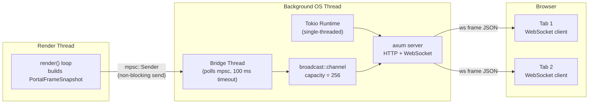
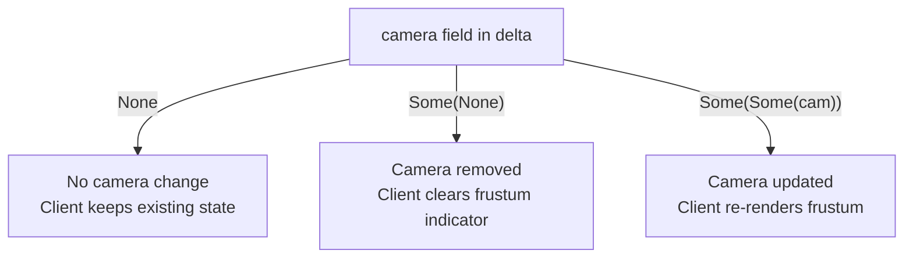
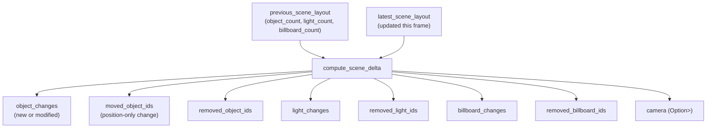
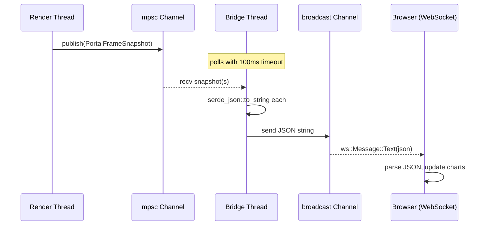

# Live Portal

The Helio Live Portal is a real-time web dashboard that streams frame-level telemetry from the renderer directly into a browser window. Rather than sifting through log output or attaching a heavyweight GPU profiler, you open a local URL and watch live charts update with every rendered frame: how long each render pass took on the GPU and CPU, how many draw calls were issued, where the scene objects and lights are in world space, what the camera is looking at, and a full CPU scope tree derived from `profile_scope!` annotations. It is designed to answer the question *"what is the renderer actually doing right now?"* without stopping the frame loop or altering timing characteristics in any meaningful way.

The dashboard is intentionally browser-hosted rather than integrated into a native window. This keeps the renderer itself free of GUI dependencies, makes the interface trivially cross-platform, and means you can monitor a renderer running on a headless build server from a laptop on the same network. The WebSocket transport means you can also have multiple browser tabs open simultaneously, each receiving the same stream.

<!-- screenshot: overview of the live portal browser window showing the frame timeline at the top, the per-pass bar chart below it, and the scene hierarchy panel on the right -->

## The `live-portal` Feature Gate

All portal code is gated behind a Cargo feature flag. In `helio-render-v2/Cargo.toml` the dependency is declared conditionally:

```toml
[features]
live-portal = ["dep:helio-live-portal"]
```

The `helio-live-portal` crate brings in `axum` for the HTTP and WebSocket server, `tokio` for the async runtime, and `serde`/`serde_json` for serialization. These are heavyweight dependencies for a production binary, so they are opt-in by default. More importantly, the axum server spawns OS threads and opens TCP sockets — neither of which is available in a WebAssembly context. Enabling the feature on a WASM target would fail to compile.

> [!IMPORTANT]
> Do **not** enable the `live-portal` feature when building for WebAssembly targets. The crate unconditionally depends on `std::thread`, `std::net`, and Tokio primitives that are unavailable in a `wasm32` environment.

The `Renderer::start_live_portal` method and its `_default` variant always exist in the public API regardless of the feature flag. When the feature is disabled they return `Err` immediately with a descriptive message, so calling code does not need its own `#[cfg]` guards just to call the method — only the *enable* site (Cargo.toml) needs the flag.

```rust
// Works unconditionally; returns Err when feature = "live-portal" is absent
let url = renderer.start_live_portal_default()?;
```

All portal-specific struct definitions, server startup logic, and snapshot publishing are wrapped in `#[cfg(feature = "live-portal")]` internally.

## Starting the Portal

### `start_live_portal` and `start_live_portal_default`

There are two entry points on `Renderer`:

```rust
/// Bind on a specific address.
pub fn start_live_portal(&mut self, bind_addr: &str) -> Result<String>

/// Convenience wrapper — binds on "0.0.0.0:7878".
pub fn start_live_portal_default(&mut self) -> Result<String>
```

Both return the full HTTP URL as a `String` (e.g. `"http://0.0.0.0:7878"`). They are **idempotent**: if the portal server is already running, they return the existing URL without creating a second server. This makes it safe to call from a hot-reload path or from multiple initialization sites without worrying about duplicate servers or port conflicts.

When the portal starts successfully the renderer:
1. Creates a `LivePortalHandle` by calling `helio_live_portal::start_live_portal(bind_addr)`.
2. Logs `"Helio live portal started at {url}"` at info level.
3. Calls `open_url_in_browser` to open the dashboard in the system's default browser automatically.

The browser-open step is a best-effort helper; it will not fail the overall startup if the OS cannot open a browser (for example on a headless CI machine).

The most common integration pattern, drawn from `demo_portal.rs` in the examples directory, is:

```rust
// Silently ignore the result on CI; inspect it in interactive sessions.
renderer.start_live_portal_default().ok();
```

For interactive sessions you usually want to surface the URL to the user:

```rust
match renderer.start_live_portal_default() {
    Ok(url) => println!("Live portal: {url}"),
    Err(e)  => eprintln!("Portal unavailable: {e}"),
}
```

> [!TIP]
> If you need the portal on a non-default port — for example because port 7878 is already in use by another service — pass an explicit bind address:
> ```rust
> renderer.start_live_portal("0.0.0.0:9090").ok();
> ```
> You can also bind to `127.0.0.1` to prevent remote connections when that matters for your environment.

## Server Architecture

Understanding the data path from renderer to browser helps when reasoning about latency, backpressure, and what happens when the dashboard is not open.



### The `mpsc` Channel

The render thread holds an `mpsc::Sender<PortalFrameSnapshot>`. Calling `portal.publish(snapshot)` performs a non-blocking send into this channel. If the channel is full (because the bridge thread is behind), the send simply fails — the render loop never blocks waiting for the dashboard to catch up. This is critical: the portal must not introduce frame-time variance in the main renderer.

### The Bridge Thread

A dedicated OS thread runs alongside the Tokio runtime. It polls the `mpsc` receiver with a 100 ms timeout. When snapshots arrive it collects them into a `Vec`, then flushes the whole batch at once. Each snapshot is serialized to a JSON string with `serde_json::to_string`, then sent into a `tokio::sync::broadcast::Sender`. The broadcast channel has a capacity of 256 messages. If any connected WebSocket client is lagging more than 256 frames behind, it will receive a `RecvError::Lagged` and the bridge will skip those messages for that client — other clients are unaffected.

> [!NOTE]
> The 100 ms batch window means clients see updates slightly delayed relative to the actual frame time, but in practice frames arrive far more frequently than 100 ms, so the window fills quickly and latency stays well under a second on a local connection.

### HTTP Routes

The axum server serves three categories of routes:

| Route | Description |
|---|---|
| `GET /` | Renders the dashboard HTML shell. |
| `GET /js/:file` | Serves JavaScript ES modules for the dashboard UI. |
| `GET /vendor/:file` | Serves third-party JavaScript and CSS (charting libraries, etc.). |
| `GET /ws` | WebSocket upgrade endpoint; clients subscribe here for frame data. |

All static assets are embedded in the binary at compile time so no external files need to be deployed alongside the renderer binary.

### WebSocket Endpoint

Navigating to `/ws` performs an HTTP upgrade to WebSocket. Once connected, clients receive a continuous stream of JSON-encoded `PortalFrameSnapshot` objects, one message per frame (or batched group of frames if the bridge thread accumulates more than one during a 100 ms window). There is no client-to-server message protocol — the connection is purely unidirectional for now.

> [!NOTE]
> Because the broadcast channel drops old messages when full, a client that reconnects after being disconnected will not receive the frames it missed. The dashboard always shows the *current* state of the renderer, not a historical replay.

## `LivePortalHandle`

`start_live_portal` returns a `LivePortalHandle`. The renderer stores this as `Option<LivePortalHandle>` and the handle must be kept alive for the server to remain running.

```rust
pub struct LivePortalHandle {
    tx: mpsc::Sender<PortalFrameSnapshot>,
    pub url: String,
    _server_thread: std::thread::JoinHandle<()>,
}
```

The `_server_thread` field is a `JoinHandle` for the background OS thread that owns the Tokio runtime and axum server. The leading underscore signals that it is intentionally never joined — its only purpose is to keep the thread alive via RAII. When the `LivePortalHandle` is dropped (typically when the `Renderer` is dropped), the `JoinHandle` is dropped, the channel closes, the bridge thread exits its poll loop, and the Tokio runtime shuts down, closing all WebSocket connections.

### `publish` and `sender`

```rust
impl LivePortalHandle {
    /// Send a snapshot from the owning thread.
    pub fn publish(&self, snapshot: PortalFrameSnapshot);

    /// Clone the sender for use from other threads.
    pub fn sender(&self) -> mpsc::Sender<PortalFrameSnapshot>;
}
```

`publish` is the standard path used by the render loop. `sender()` returns a clone of the `mpsc::Sender` so that other threads — a simulation thread, an asset streaming thread, a scripting runtime — can each hold their own sender and push snapshots without going through the renderer. All senders feed the same channel and the same bridge thread.

```rust
// Example: hand a sender to a worker thread.
let sender = portal_handle.sender();
std::thread::spawn(move || {
    loop {
        let snapshot = build_snapshot_for_worker();
        let _ = sender.send(snapshot); // non-blocking, drops on error
        std::thread::sleep(Duration::from_millis(16));
    }
});
```

> [!WARNING]
> Each `sender()` call clones the underlying `mpsc::Sender`. The channel stays open as long as *any* sender is alive. If you store senders in long-lived threads that outlive the `LivePortalHandle`, the bridge thread will continue running even after the renderer shuts down. Make sure worker threads that hold senders are joined or their senders are dropped before the application exits.

## `PortalFrameSnapshot` — the Main Data Envelope

Every frame the renderer assembles a `PortalFrameSnapshot` and sends it through the portal handle. This struct is the complete picture of that frame:

```rust
pub struct PortalFrameSnapshot {
    pub frame: u64,
    pub timestamp_ms: u128,
    pub frame_time_ms: f32,
    pub frame_to_frame_ms: f32,
    pub total_gpu_ms: f32,
    pub total_cpu_ms: f32,
    pub pass_timings: Vec<PortalPassTiming>,
    pub pipeline_order: Vec<String>,
    pub pipeline_stage_id: Option<String>,
    pub scene_delta: Option<PortalSceneLayoutDelta>,
    pub object_count: usize,
    pub light_count: usize,
    pub billboard_count: usize,
    pub draw_calls: DrawCallMetrics,
    pub stage_timings: Vec<PortalStageTiming>,
}
```

| Field | Source | Meaning |
|---|---|---|
| `frame` | Monotonic counter | Absolute frame number since renderer started. |
| `timestamp_ms` | `std::time` epoch milliseconds | Wall-clock time at snapshot creation. |
| `frame_time_ms` | Render loop timer | Total elapsed time for this frame (CPU wall time). |
| `frame_to_frame_ms` | Delta from previous frame start | Actual frame-to-frame interval; inverse is the live FPS. |
| `total_gpu_ms` | Sum of `pass_timings[*].gpu_ms` | Aggregate GPU work across all passes. |
| `total_cpu_ms` | Sum of `pass_timings[*].cpu_ms` | Aggregate CPU driver/dispatch time. |
| `pass_timings` | `GpuProfiler::timings()` | Per-pass timing breakdown (see below). |
| `pipeline_order` | `graph.execution_pass_names()` | Pass names in the order the frame graph executed them. |
| `pipeline_stage_id` | Graph metadata | Optional string identifying which stage group owns this snapshot in the `stage_timings` tree. |
| `scene_delta` | `compute_scene_delta` | Scene object/light/billboard/camera changes this frame; `None` when nothing changed. |
| `object_count` | Live GPU scene | Total mesh objects currently in the scene. |
| `light_count` | Live GPU scene | Total lights currently in the scene. |
| `billboard_count` | Live GPU scene | Total billboards currently in the scene. |
| `draw_calls` | GPU scene statistics | Opaque + transparent draw call split. |
| `stage_timings` | `profile_scope!` collector | CPU scope tree (see below). |

> [!NOTE]
> GPU timestamps are read from the *previous* frame's queries because the GPU executes asynchronously. `total_gpu_ms` therefore always trails the current frame by one. This is standard behavior for GPU profiling and matches what tools like RenderDoc and PIX report.

## `PortalPassTiming` — Per-Pass GPU and CPU Times

```rust
pub struct PortalPassTiming {
    pub name: String,
    pub gpu_ms: f32,
    pub cpu_ms: f32,
}
```

Each entry corresponds to one named render pass (e.g. `"depth_prepass"`, `"gbuffer"`, `"ssao"`, `"lighting"`, `"tonemapping"`). The `gpu_ms` value comes from GPU timestamp queries managed by `GpuProfiler`: a begin/end timestamp pair is inserted around each pass's command recording, and the delta is converted to milliseconds using the device's timestamp period. The `cpu_ms` value measures the CPU time spent recording that pass's commands — not the time the GPU executed them.

The pass names in `pass_timings` correspond 1:1 to entries in `pipeline_order`, which gives you the execution sequence so the dashboard can render them in the correct left-to-right order on a timeline bar.

<!-- screenshot: per-pass horizontal bar chart showing depth_prepass, gbuffer, ssao, lighting, and tonemapping bars colored by pass category -->

## `PortalStageTiming` — the CPU Scope Tree

```rust
pub struct PortalStageTiming {
    pub id: String,
    pub name: String,
    pub ms: f32,
    pub children: Vec<PortalStageTiming>,
}
```

While `PortalPassTiming` measures GPU passes, `PortalStageTiming` captures the CPU scope tree produced by `profile_scope!` macros throughout the renderer. These macros record wall-clock durations around logical sections of the frame loop — not just render pass recording but also culling, animation updates, scene graph traversal, and any other annotated work.

The tree structure mirrors the nesting of `profile_scope!` calls. A top-level `"frame"` scope might contain `"culling"`, `"render"`, and `"present"` children; `"render"` in turn might contain `"geometry"` and `"post_process"` children. The dashboard renders this as a nested flame-graph row below the main timeline.

The `id` field is a stable string identifier used by the dashboard to diff successive frames when animating the tree — it prevents reordering artifacts when scope names happen to repeat across siblings.

`children` uses `skip_serializing_if = "Vec::is_empty"` so leaf scopes do not bloat the JSON payload with empty arrays.

## `DrawCallMetrics` — Opaque and Transparent Split

```rust
pub struct DrawCallMetrics {
    pub total: usize,
    pub opaque: usize,
    pub transparent: usize,
}
```

The renderer maintains separate bucket counts for opaque and transparent draw calls because they follow different sort orders and often have very different frame-to-frame counts. `total` is always `opaque + transparent`. These counts come from the GPU scene's per-bucket statistics and are updated as part of normal render bookkeeping, so collecting them for the portal adds no additional overhead.

## Scene Data Structures

The portal provides a live spatial view of the scene: where every mesh object, light, and billboard is in world space, plus the camera's current position and direction.

### `PortalSceneObject`

```rust
pub struct PortalSceneObject {
    pub id: u32,
    pub bounds_center: [f32; 3],
    pub bounds_radius: f32,
    pub has_material: bool,
}
```

Each mesh object in the GPU scene is represented by its bounding sphere (`bounds_center` + `bounds_radius`) and a flag indicating whether it currently has a material assigned. The dashboard uses the bounding sphere to draw a schematic top-down layout view. The `id` is stable for the lifetime of the object and is used by the delta system to track additions, moves, and removals.

### `PortalSceneLight`

```rust
pub struct PortalSceneLight {
    pub id: u32,
    pub position: [f32; 3],
    pub color: [f32; 3],
    pub intensity: f32,
    pub range: f32,
}
```

Point lights are transmitted with their world-space position, linear RGB color, intensity scalar, and effective range. The dashboard draws lights as colored circles in the scene layout view, sized proportionally to `range`.

### `PortalSceneBillboard`

```rust
pub struct PortalSceneBillboard {
    pub id: u32,
    pub position: [f32; 3],
    pub scale: [f32; 2],
}
```

Billboard sprites are sent as a position and a 2D scale. They appear in the scene view as rectangles oriented to face the viewer, useful for tracking particle emitters, sprites, and UI elements anchored in world space.

### `PortalSceneCamera`

```rust
pub struct PortalSceneCamera {
    pub position: [f32; 3],
    pub forward: [f32; 3],
}
```

The active camera's world position and normalized forward direction. The dashboard overlays a camera frustum indicator in the scene layout so you can see at a glance what fraction of the scene is in view.

### `PortalSceneLayout` — Full Scene Snapshot

```rust
pub struct PortalSceneLayout {
    pub objects: Vec<PortalSceneObject>,
    pub lights: Vec<PortalSceneLight>,
    pub billboards: Vec<PortalSceneBillboard>,
    pub camera: Option<PortalSceneCamera>,
}
```

`PortalSceneLayout` represents the complete, authoritative scene state. It is used internally by the renderer to track `latest_scene_layout` and `previous_scene_layout` for delta computation. It is **not** sent directly over the wire — only deltas (`PortalSceneLayoutDelta`) are transmitted to save bandwidth.

On the very first frame after the portal connects, there is no previous layout to diff against. In this case `compute_scene_delta` treats the entire current layout as new and emits all objects, lights, and billboards in the `*_changes` fields of the delta, effectively bootstrapping the client's scene state.

## `PortalSceneLayoutDelta` — Bandwidth-Efficient Scene Updates

```rust
pub struct PortalSceneLayoutDelta {
    pub object_changes: Vec<PortalSceneObject>,
    pub moved_object_ids: Vec<u32>,
    pub removed_object_ids: Vec<u32>,
    pub light_changes: Vec<PortalSceneLight>,
    pub removed_light_ids: Vec<u32>,
    pub billboard_changes: Vec<PortalSceneBillboard>,
    pub removed_billboard_ids: Vec<u32>,
    pub camera: Option<Option<PortalSceneCamera>>,
}
```

Rather than transmitting the full scene layout on every frame, the portal sends only what changed. In a typical scene with hundreds of static meshes and a moving camera, only the `camera` field needs updating most frames, keeping the WebSocket payload tiny.

The delta semantics per entity type are:

- **`*_changes`** — objects/lights/billboards that are new or whose properties changed (position, material, color, etc.). The client upserts these by `id`.
- **`moved_object_ids`** — object IDs that moved but whose other properties did not change. The client updates only the bounding sphere position for these, avoiding a full upsert.
- **`removed_*_ids`** — entity IDs that were removed from the scene this frame. The client deletes them from its local state.

> [!NOTE]
> The `scene_delta` field on `PortalFrameSnapshot` is `Option<PortalSceneLayoutDelta>`. When it is `None`, the scene is completely unchanged from the previous frame and the client should not touch its local scene state at all.

### The `camera` Field — Doubly-Nested Option

The camera field deserves special attention:

```rust
pub camera: Option<Option<PortalSceneCamera>>,
```

This double-Option encodes three distinct states:

| Value | Meaning |
|---|---|
| `None` | Camera did not change this frame; client keeps its current camera state. |
| `Some(Some(cam))` | Camera changed; client updates to the new position and direction. |
| `Some(None)` | Camera was removed (no active camera); client should clear its camera indicator. |

The outer `Option` is the *change flag* — `None` means "no diff". The inner `Option` is the *camera existence flag* — `None` means "camera is absent". This is more expressive than a boolean `changed` field paired with an `Option<Camera>` because it allows the struct to be serialized compactly (outer `None` serializes as `null` or is skipped, avoiding any nested payload).



## `compute_scene_delta` — Diffing the Scene

Each frame, after the GPU scene is updated, the renderer calls an internal `compute_scene_delta` function (in `portal.rs`) that compares `previous_scene_layout` to `latest_scene_layout` and produces a `PortalSceneLayoutDelta`.

The diff logic operates on each entity class independently:



The renderer tracks a `portal_scene_key` — a tuple of `(object_count, light_count, billboard_count)` — and sets a `pending_layout_changed` flag whenever these counts change. This provides a fast path: if the key is unchanged and no individual entity positions have moved, the delta can be skipped and `scene_delta` is set to `None` in the snapshot.

For the first frame (when `previous_scene_layout` is `None`), `compute_scene_delta` emits all current objects in `object_changes`, all current lights in `light_changes`, all current billboards in `billboard_changes`, and sets `camera` to `Some(current_camera)`. This bootstraps the client's scene state from scratch.

## The `profiling_active` Gate — Zero Overhead When Disconnected

Running `profile_scope!` macros unconditionally — even on frames where no dashboard is watching — would introduce measurable overhead from timestamp collection and bookkeeping. To avoid this, Helio uses a global `AtomicBool` to gate profiling work:

```rust
// In profiler.rs:
static PROFILING_ACTIVE: AtomicBool = AtomicBool::new(false);

pub fn profiling_active() -> bool {
    PROFILING_ACTIVE.load(Ordering::Relaxed)
}

macro_rules! profile_scope {
    ($name:expr) => {
        if crate::profiler::profiling_active() {
            // record scope timing
        }
    };
}
```

The lifecycle is:

1. **Portal starts** → `PROFILING_ACTIVE` is set to `true`. All `profile_scope!` sites begin recording.
2. **Portal disconnects** → the `mpsc` channel closes (all senders dropped or the handle dropped). The bridge thread detects this and sets `PROFILING_ACTIVE` back to `false`.
3. **No dashboard connected** → every `profile_scope!` call is a single relaxed atomic load that evaluates to `false` and immediately returns. The branch predictor eliminates any meaningful overhead.

> [!IMPORTANT]
> This design means that in a production build with the `live-portal` feature enabled but no browser connected, profiling overhead is essentially zero. You can ship a build with portal support enabled and activate it on-demand without impacting release performance.

## Viewing the Dashboard

Once the portal server is running, open the URL printed to the console (default: `http://localhost:7878`) in any modern browser. The dashboard loads from embedded static assets — no npm install or separate server is required.

<!-- screenshot: browser showing the full dashboard with the top-level navigation, the real-time FPS graph, and the per-pass timeline below -->

The dashboard is organized into several panels:

**Frame Timeline** — A rolling chart of `frame_time_ms` and `frame_to_frame_ms` across the last N frames. Spikes in `frame_to_frame_ms` indicate dropped frames or hitches. The Y-axis auto-scales and a horizontal reference line shows the 16.67 ms (60 fps) budget.

**Pass Profiler** — A horizontal bar chart with one bar per entry in `pass_timings`, ordered according to `pipeline_order`. Each bar is split into GPU time (measured from hardware timestamps) and CPU command-recording time. Hovering a bar shows the exact millisecond values.

<!-- screenshot: pass profiler panel showing depth_prepass, gbuffer, ssao, lighting, tonemapping bars with GPU/CPU split coloring -->

**Stage Timings (CPU Flame Graph)** — Renders the `stage_timings` tree as a hierarchical flame row. The root spans the full frame width; children are proportionally sized sub-spans. This view is most useful for identifying which high-level CPU subsystem is consuming time beyond pure GPU dispatch.

**Scene Inspector** — A 2D top-down view of the scene using `PortalSceneObject` bounding spheres, `PortalSceneLight` positions and ranges, and `PortalSceneBillboard` positions. The active camera frustum is drawn from `PortalSceneCamera.position` and `.forward`. You can zoom and pan the view to inspect crowded scenes.

<!-- screenshot: scene inspector panel showing a top-down view with mesh bounding spheres in grey, lights as colored circles, and a camera frustum indicator -->

**Draw Call Counter** — A live readout of `draw_calls.total`, `.opaque`, and `.transparent` with a small spark line showing count history.

**Scene Stats** — Running counts of `object_count`, `light_count`, and `billboard_count` sourced directly from `PortalFrameSnapshot`.

## Full Integration Example

The following is representative of the `demo_portal.rs` example pattern — the minimal code needed to attach the portal to a running renderer:

```rust
use helio_render_v2::Renderer;

fn main() -> anyhow::Result<()> {
    let mut renderer = Renderer::new(/* ... */)?;

    // Start portal on the default address.
    // Prints URL and opens browser automatically.
    match renderer.start_live_portal_default() {
        Ok(url) => println!("Live portal: {url}"),
        Err(e)  => eprintln!("Portal unavailable (feature not enabled?): {e}"),
    }

    // Normal render loop — portal publishing happens inside renderer.render().
    loop {
        renderer.render()?;
    }
}
```

Inside `renderer.render()`, the frame snapshot is assembled and published automatically. You do not need to manually build a `PortalFrameSnapshot` unless you are implementing a custom renderer loop outside the standard `Renderer` abstraction.

### Multi-Threaded Publishing with `sender()`

In a multi-threaded architecture where different threads drive different parts of the frame, you can distribute portal senders to each thread:

```rust
// Main setup (on the main thread):
renderer.start_live_portal_default().ok();

// Retrieve senders for worker threads.
let sim_sender   = renderer.portal_handle().map(|h| h.sender());
let audio_sender = renderer.portal_handle().map(|h| h.sender());

// Simulation thread:
std::thread::spawn(move || {
    loop {
        let snapshot = build_sim_snapshot();
        if let Some(ref tx) = sim_sender {
            let _ = tx.send(snapshot);
        }
        tick();
    }
});

// Audio thread:
std::thread::spawn(move || {
    loop {
        let snapshot = build_audio_snapshot();
        if let Some(ref tx) = audio_sender {
            let _ = tx.send(snapshot);
        }
        update_audio();
    }
});
```

All senders feed the same mpsc channel and the same bridge thread, so snapshots from all threads are interleaved in arrival order and broadcast to WebSocket clients as a unified stream.

> [!WARNING]
> If different threads send snapshots for the same logical frame number, the dashboard will display them as separate frames since it keys on the `frame` field. Coordinate frame numbering across threads or use a shared atomic frame counter to keep the display coherent.

## Data Flow Summary



The render thread is never blocked by this path. If the bridge thread is behind or no clients are connected, `publish()` either succeeds immediately (channel has space) or silently drops the snapshot (channel full). The renderer's frame loop is completely decoupled from the dashboard's rendering speed.

## Troubleshooting

**Dashboard shows no data after opening the URL**

Check that the `live-portal` feature is enabled in your `Cargo.toml` and that `start_live_portal_default()` returned `Ok`. The server only starts if the feature is compiled in.

**Frame data freezes for a moment then jumps forward**

The broadcast channel capacity is 256. If your frame rate is very high (>256 frames per 100 ms batch window, i.e. >2560 fps), old frames will be dropped. This is cosmetic — the renderer itself is unaffected.

**Scene inspector shows no objects despite objects being in the scene**

The scene inspector relies on `scene_delta` being non-`None` on at least one frame after connecting. If the scene is completely static and was built before the portal connected, `pending_layout_changed` may never be set. Try moving a scene object or toggling a light to force a delta.

> [!TIP]
> You can force a full scene re-broadcast by calling `renderer.invalidate_portal_scene_cache()` if that method is exposed, or by temporarily modifying any scene entity to trigger `pending_layout_changed`.

**Port 7878 is already in use**

Pass an explicit bind address to `start_live_portal`:
```rust
renderer.start_live_portal("0.0.0.0:9090").ok();
```

**Dashboard loads but shows `WebSocket connection failed`**

Your browser may be blocking insecure WebSocket connections on non-localhost addresses. The portal serves plain `ws://`, not `wss://`. On Chrome, try navigating to `chrome://flags/#unsafely-treat-insecure-origin-as-secure` and adding your portal's origin, or use `127.0.0.1` as the bind address and access it from the same machine.

## Performance Overhead Budget

The portal is designed so that even with a browser connected and receiving data, the overhead imposed on the render loop stays below noise. Here is a rough breakdown of where time is spent:

| Work | Location | Overhead |
|---|---|---|
| Building `PortalFrameSnapshot` | Render thread | ~1–5 µs per frame (field copies, no allocations for static scenes) |
| `mpsc::Sender::send` | Render thread | ~100–300 ns (non-blocking queue push) |
| `profile_scope!` macros (active) | Render thread | ~50–200 ns per scope (one `Instant::now()` call each end) |
| `profile_scope!` macros (inactive) | Render thread | ~1 ns (single relaxed atomic load, branch predicted not-taken) |
| JSON serialization | Bridge thread | Off render thread entirely; no render impact |
| WebSocket broadcast | Bridge thread | Off render thread entirely; no render impact |

The most significant variable cost is `profile_scope!` annotation density. A renderer with 200 annotated scopes per frame adds roughly 10–40 µs while the portal is connected — noticeable in a profiler, but negligible relative to a 16 ms frame budget. When no browser is connected, this collapses to essentially zero.

> [!TIP]
> If you are profiling at sub-millisecond precision and need absolute confidence that the portal introduces zero render-thread overhead, disable the `live-portal` feature entirely for that measurement run. The conditional compilation ensures the mpsc channel, snapshot construction, and all profiling infrastructure are completely absent from the binary.

## Extending the Snapshot

If you need to add custom telemetry to the portal — say, a physics engine's contact count or an audio system's active voice count — the cleanest approach is to attach it to a new `PortalFrameSnapshot` variant or to piggyback on the `stage_timings` tree by emitting a synthetic `PortalStageTiming` node:

```rust
// Emit a synthetic "physics" scope with a fake ms reading.
let physics_node = PortalStageTiming {
    id: "physics".to_string(),
    name: "Physics".to_string(),
    ms: physics_step_duration.as_secs_f32() * 1000.0,
    children: vec![
        PortalStageTiming {
            id: "physics.broad".to_string(),
            name: "Broadphase".to_string(),
            ms: broadphase_ms,
            children: vec![],
        },
        PortalStageTiming {
            id: "physics.narrow".to_string(),
            name: "Narrowphase".to_string(),
            ms: narrowphase_ms,
            children: vec![],
        },
    ],
};
// Then push this node onto the snapshot's stage_timings before publishing.
```

This approach requires no changes to the portal's Rust API or the dashboard protocol — the frontend renders whatever tree it receives. The `id` field ensures the flame graph animates smoothly across frames even as child counts vary.

> [!NOTE]
> Because `stage_timings` is a flat `Vec<PortalStageTiming>` at the top level (with nesting expressed through `children`), you can freely add or remove top-level nodes without disrupting the existing renderer-produced nodes. The dashboard renders them all side by side.

## JSON Wire Format Reference

Understanding the JSON shape helps when writing custom dashboard consumers or debugging WebSocket traffic with a tool like `websocat`.

A minimal single-frame message with no scene changes and a flat (no children) stage timing tree looks approximately like:

```json
{
  "frame": 1042,
  "timestamp_ms": 1710230400123,
  "frame_time_ms": 14.2,
  "frame_to_frame_ms": 14.8,
  "total_gpu_ms": 8.3,
  "total_cpu_ms": 2.1,
  "pass_timings": [
    { "name": "depth_prepass", "gpu_ms": 0.9, "cpu_ms": 0.2 },
    { "name": "gbuffer",       "gpu_ms": 3.1, "cpu_ms": 0.5 },
    { "name": "ssao",          "gpu_ms": 1.4, "cpu_ms": 0.1 },
    { "name": "lighting",      "gpu_ms": 2.5, "cpu_ms": 0.8 },
    { "name": "tonemapping",   "gpu_ms": 0.4, "cpu_ms": 0.1 }
  ],
  "pipeline_order": ["depth_prepass", "gbuffer", "ssao", "lighting", "tonemapping"],
  "pipeline_stage_id": null,
  "scene_delta": null,
  "object_count": 347,
  "light_count": 12,
  "billboard_count": 8,
  "draw_calls": { "total": 355, "opaque": 320, "transparent": 35 },
  "stage_timings": [
    { "id": "frame",   "name": "Frame",  "ms": 14.2,
      "children": [
        { "id": "frame.cull",   "name": "Culling",  "ms": 1.1 },
        { "id": "frame.render", "name": "Render",   "ms": 11.6 },
        { "id": "frame.flip",   "name": "Present",  "ms": 1.5 }
      ]
    }
  ]
}
```

When a scene change occurs (`scene_delta` is non-null), only the changed entities are present. An example delta with one moved object and a camera update:

```json
{
  "scene_delta": {
    "object_changes": [],
    "moved_object_ids": [42],
    "removed_object_ids": [],
    "light_changes": [],
    "removed_light_ids": [],
    "billboard_changes": [],
    "removed_billboard_ids": [],
    "camera": { "position": [10.0, 2.5, -3.0], "forward": [0.0, 0.0, 1.0] }
  }
}
```

Note that `camera` here is `Some(Some(PortalSceneCamera))` in Rust — serialized as a plain object. `Some(None)` would serialize as `null`. Outer `None` (no camera change) means the field is omitted entirely from the delta object.

## See Also

- [Debug Profiling](./debug-profiling) — the `profile_scope!` macro system and GPU timestamp infrastructure that feeds the portal's timing data.
- [Getting Started](./getting-started) — setting up a basic Helio renderer, which is the prerequisite for portal integration.
- [Helio Overview](../) — the high-level architecture of the Helio renderer experiment.
