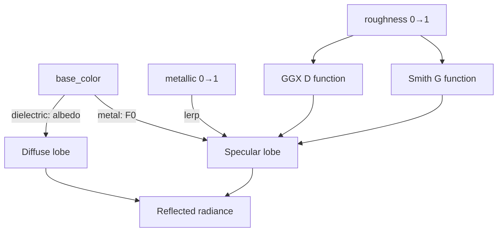
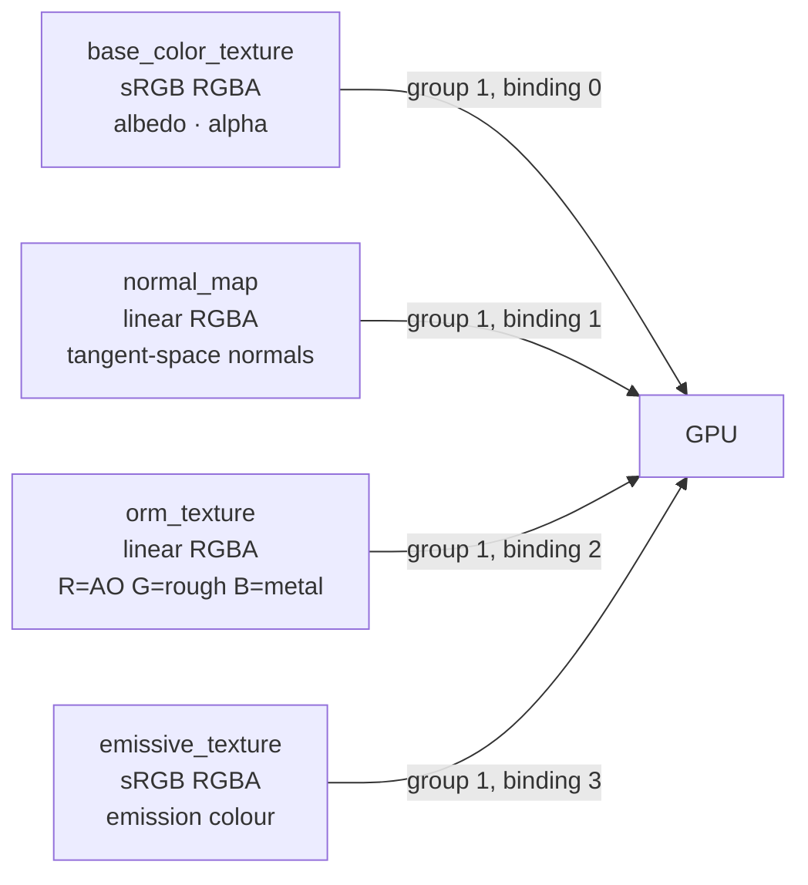
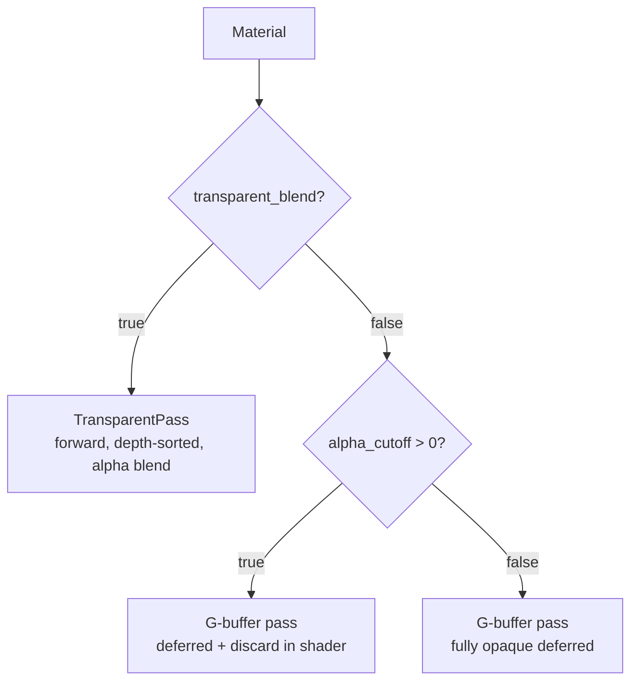
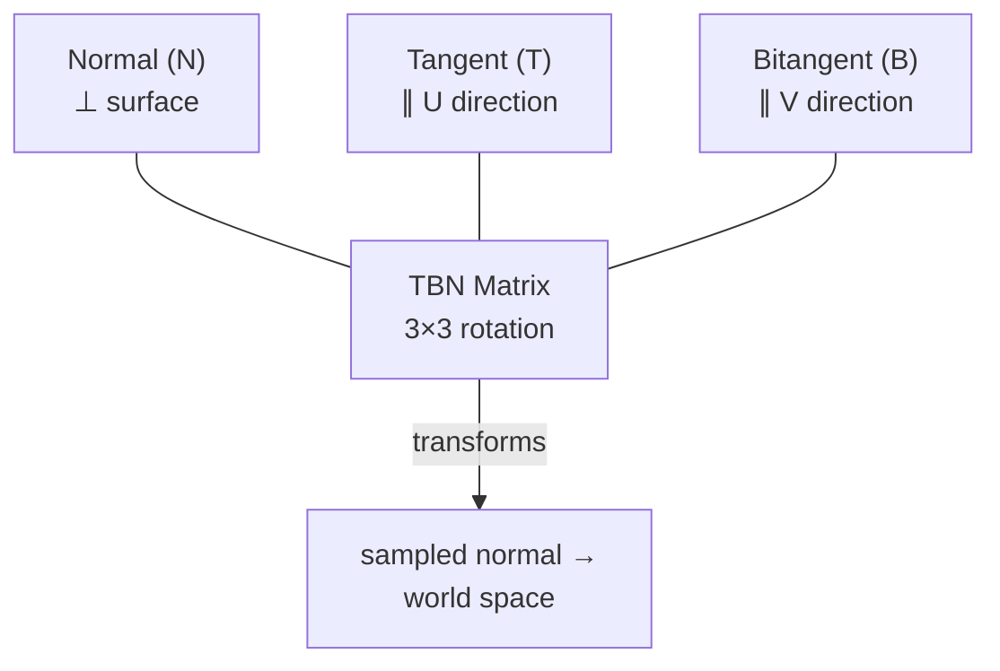
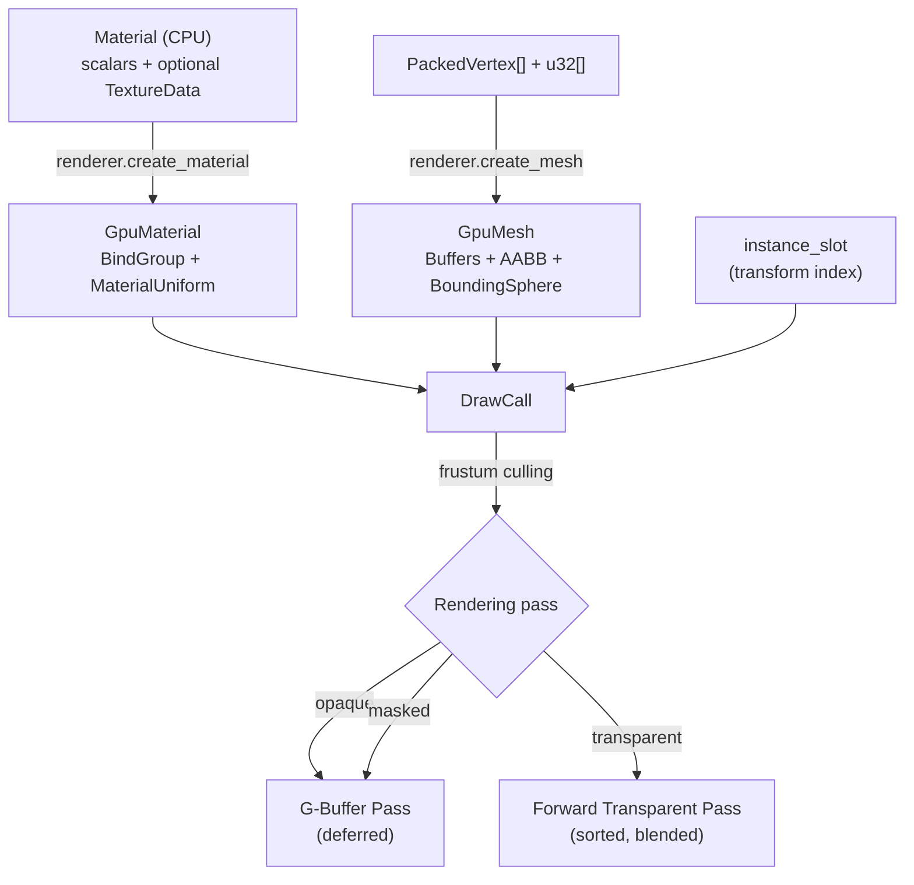

# Materials and Geometry

Helio's rendering pipeline is built around two interlocking systems: a **physically-based material model** that describes how a surface responds to light, and a **geometry system** that encodes meshes into a compact, GPU-friendly vertex format. Understanding how these two systems work—and how they interact—is the foundation for producing visually correct results and maintaining the performance guarantees that GPU-driven rendering demands.

This page covers the full lifecycle of a renderable object, from the CPU-side `Material` and `PackedVertex` structs through GPU upload, bind-group assembly, frustum culling, and the final `DrawCall` that reaches the geometry passes.

---

## The Cook-Torrance BRDF

Helio uses the **Cook-Torrance microfacet BRDF** as its shading model, which is the de-facto standard for real-time physically-based rendering. At its heart the model describes a surface as a collection of microscopically tiny mirrors—"microfacets"—whose statistical distribution determines how light scatters.

The reflectance equation evaluated per-fragment is:

```
f(l, v) = f_diffuse + f_specular
        = (albedo / π) + (D · F · G) / (4 · (n·l) · (n·v))
```

where:

- **D** is the GGX/Trowbridge-Reitz **normal distribution function** — controls how "sharp" or "blurry" specular highlights appear. Driven by `roughness`.
- **F** is the **Fresnel term** (Schlick approximation) — describes how reflectivity increases at grazing angles. Driven by `metallic` and `base_color`.
- **G** is the **geometry/shadow-masking function** (Smith combined) — accounts for microfacets occluding each other. Also driven by `roughness`.

Dielectric materials (plastics, stone, wood) have an `F0` (reflectance at normal incidence) of roughly 0.04, meaning 4% of light is reflected even at straight-on angles. Metals absorb rather than transmit the refracted portion, so their `F0` is taken directly from `base_color`, and their diffuse contribution is zero. The `metallic` parameter linearly blends between these two behaviours.



> [!NOTE]
> Helio's BRDF is energy-conserving: diffuse and specular contributions always sum to ≤ 1. You do not need to manually reduce albedo to compensate for strong specular — the model handles this automatically via the `(1 - F)` factor applied to the diffuse term.

---

## The `Material` Struct

The CPU-side `Material` is a plain Rust struct you build with a fluent builder API and then hand to `renderer.create_material()`. Every field has a well-defined physical meaning.

```rust
pub struct Material {
    // --- Scalar factors ---
    pub base_color: [f32; 4],     // Linear-space RGBA tint; multiplied with albedo texture
    pub metallic: f32,            // 0 = fully dielectric, 1 = fully metallic
    pub roughness: f32,           // 0 = mirror-smooth, 1 = fully diffuse
    pub ao: f32,                  // Scalar ambient occlusion override (0–1)
    pub emissive_color: [f32; 3], // Linear RGB colour of self-emission
    pub emissive_factor: f32,     // Brightness multiplier for emission
    pub alpha_cutoff: f32,        // Fragments with alpha < cutoff are discarded
    pub transparent_blend: bool,  // Enable forward alpha-blend pass

    // --- Optional textures ---
    pub base_color_texture: Option<TextureData>,
    pub normal_map: Option<TextureData>,
    pub orm_texture: Option<TextureData>,
    pub emissive_texture: Option<TextureData>,
}
```

### Field reference

| Field | Default | Range | Physical meaning |
|---|---|---|---|
| `base_color` | `[1,1,1,1]` | `[0,1]⁴` | Linear tint multiplied with the albedo texture. Pure white = no tint. |
| `metallic` | `0.0` | `0–1` | How "metallic" the surface is. Avoid values between 0.1 and 0.9 in practice — most real materials are either clearly one or the other. |
| `roughness` | `0.5` | `0–1` | Surface micro-roughness. 0 = perfectly smooth mirror; 1 = chalk-like Lambertian. |
| `ao` | `1.0` | `0–1` | Scalar ambient occlusion. Multiplied with the R channel of `orm_texture`. Value of 1 = no extra darkening. |
| `emissive_color` | `[0,0,0]` | `[0,∞)³` | Linear RGB of the emitted light. Combined as `emissive_texture × emissive_color × emissive_factor`. |
| `emissive_factor` | `0.0` | `≥ 0` | Master brightness multiplier. 0 = emission fully off regardless of other fields. |
| `alpha_cutoff` | `0.0` | `0–1` | Masking threshold. Pixels below this alpha are discarded in the shader. 0 = masking disabled. |
| `transparent_blend` | `false` | bool | Routes material to the forward transparent pass instead of the deferred G-buffer. |

### Builder API

```rust
use helio::material::Material;

// A rough stone surface with a slight warm tint
let stone = Material::new()
    .with_base_color([0.92, 0.87, 0.80, 1.0])
    .with_metallic(0.0)
    .with_roughness(0.85);

// A polished metal panel
let metal = Material::new()
    .with_base_color([0.72, 0.72, 0.72, 1.0])
    .with_metallic(1.0)
    .with_roughness(0.15);

// A glowing neon tube
let neon = Material::new()
    .with_base_color([0.05, 0.9, 0.7, 1.0])
    .with_emissive([0.05, 0.9, 0.7], 12.0);

// Foliage — uses alpha masking, stays in the deferred G-buffer path
let leaves = Material::new()
    .with_base_color([1.0, 1.0, 1.0, 1.0])
    .with_roughness(0.9)
    .with_alpha_cutoff(0.5);

// Semi-transparent glass — uses forward blend pass
let glass = Material::new()
    .with_base_color([0.8, 0.9, 1.0, 0.3])
    .with_metallic(0.0)
    .with_roughness(0.05)
    .transparent();
```

> [!TIP]
> Keep `base_color` values in a perceptually plausible range. For non-metals (dielectrics), luminance should stay between roughly 0.04 and 0.9 (i.e., avoid pure black and pure white albedo). For metals, the tint encodes the wavelength-dependent F0 directly — copper is `[0.95, 0.64, 0.54]`, gold is `[1.0, 0.86, 0.57]`.

---

## `TextureData` — Raw RGBA Upload

`TextureData` is a thin wrapper around raw bytes that you provide when attaching image data to a material:

```rust
pub struct TextureData {
    pub data: Vec<u8>,  // Raw RGBA bytes, row-major, 4 bytes per pixel
    pub width: u32,
    pub height: u32,
}

impl TextureData {
    pub fn new(data: Vec<u8>, width: u32, height: u32) -> Self
}
```

The `data` field must be exactly `width × height × 4` bytes. Helio does not perform any format conversion at upload time — you are responsible for providing data in the correct colour space and channel layout for each texture slot (see below).

To load a PNG from disk you might use the `image` crate:

```rust
use image::GenericImageView;
use helio::material::TextureData;

fn load_texture(path: &str) -> TextureData {
    let img = image::open(path).expect("failed to open texture").to_rgba8();
    let (w, h) = img.dimensions();
    TextureData::new(img.into_raw(), w, h)
}
```

> [!WARNING]
> Do not convert colour images to linear space before uploading as `base_color_texture` or `emissive_texture`. Helio's GPU upload path marks those slots as `wgpu::TextureFormat::Rgba8UnormSrgb`, which means the hardware applies the sRGB→linear conversion automatically during sampling. Manually linearising will double-correct the values, producing washed-out results.

---

## Texture Channel Conventions

Helio uses four texture slots, each with a specific format expectation and channel layout:



### `base_color_texture` — sRGB RGBA

Albedo colour in the red, green, and blue channels. The alpha channel carries opacity, read by the `alpha_cutoff` discard test and the transparent blend pass. The texture is sampled as `Rgba8UnormSrgb` so the GPU decodes sRGB values to linear light automatically before multiplication with the `base_color` scalar factor.

### `normal_map` — linear RGBA

Tangent-space normals packed into the `[0, 1]` range as is standard for OpenGL/DirectX normal maps (X→R, Y→G, Z→B). The shader unpacks them with `n = sample * 2.0 - 1.0`. Only the XY channels are required; Z is reconstructed from `sqrt(1 - x² - y²)` (the map is assumed to encode unit vectors). Upload as linear (`Rgba8Unorm`) — do **not** use sRGB for normal maps.

### `orm_texture` — linear RGBA (ORM packing)

This is the most important channel convention to get right. Helio follows the glTF 2.0 standard of packing three distinct PBR parameters into a single texture:

- **R channel** — Ambient Occlusion (0 = fully occluded, 1 = no occlusion)
- **G channel** — Roughness (0 = smooth, 1 = rough)
- **B channel** — Metallic (0 = dielectric, 1 = metal)

The rationale for this specific order is hardware efficiency. Most GPU texture samplers can fetch RGBA in a single instruction. By co-locating the three parameters that are always needed together in the same texel fetch, you halve the number of texture reads compared to separate textures.

> [!NOTE]
> Many third-party DCC tools (Substance Painter, Marmoset Toolbag) export roughness/metallic as separate images, or in a different channel order. You will need to recombine them before constructing a `TextureData`. A simple offline tool or a small Rust function using the `image` crate can pack the channels at asset pipeline time.

```rust
/// Combine separate AO, roughness, and metallic images into a single ORM texture.
fn pack_orm(
    ao: &image::GrayImage,
    roughness: &image::GrayImage,
    metallic: &image::GrayImage,
) -> TextureData {
    assert_eq!(ao.dimensions(), roughness.dimensions());
    assert_eq!(ao.dimensions(), metallic.dimensions());
    let (w, h) = ao.dimensions();
    let mut data = Vec::with_capacity((w * h * 4) as usize);
    for ((ao_px, rgh_px), met_px) in ao.pixels().zip(roughness.pixels()).zip(metallic.pixels()) {
        data.push(ao_px[0]);    // R = ambient occlusion
        data.push(rgh_px[0]);   // G = roughness
        data.push(met_px[0]);   // B = metallic
        data.push(255u8);       // A = unused
    }
    TextureData::new(data, w, h)
}
```

### `emissive_texture` — sRGB RGBA

Colour of the emissive region. Sampled as `Rgba8UnormSrgb`. The final emission value reaching the light accumulation buffer is:

```
emission = emissive_texture.rgb × emissive_color × emissive_factor
```

Setting `emissive_factor` to `0.0` (the default) suppresses all emission regardless of texture content, which is a convenient way to reuse a material with emission toggled off.

<!-- screenshot: side-by-side comparison of a metallic sphere at roughness=0.0, 0.3, 0.7, 1.0 with the ORM texture visualised below each -->

---

## Rendering Paths: Transparent Blend vs Alpha Cutoff

Helio operates two distinct rendering passes for non-opaque content, and the choice between them has significant performance and visual consequences:



### Alpha Masking (`alpha_cutoff > 0`)

Alpha masking stays in the deferred G-buffer path. The vertex shader writes position and the fragment shader discards any pixel whose sampled alpha falls below `alpha_cutoff`. This is ideal for **foliage, fences, chain-link, hair cards** — geometry that would be expensive to represent as actual triangles but needs hard transparency edges. Because it participates in the G-buffer, masked surfaces receive deferred lighting at no extra cost.

```rust
// Fence mesh with mask — draws into G-buffer, discards transparent pixels
let fence = Material::new()
    .with_base_color_texture(load_texture("fence_albedo.png"))
    .with_roughness(0.8)
    .with_alpha_cutoff(0.3);  // discard pixels with alpha < 30%
```

### Alpha Blending (`transparent_blend = true`)

Transparent blending routes the material to a separate **forward pass** that runs after deferred lighting. Objects in this pass are sorted back-to-front every frame and drawn with standard `SrcAlpha / OneMinusSrcAlpha` blending. This is correct for **glass, water surfaces, particle effects, decals with soft edges**, but it is more expensive than masking because:

1. Each transparent draw call is a separate render pass draw, not bundled into GPU-driven indirect.
2. Overdraw compounds — many overlapping transparent layers quickly saturate fill rate.
3. The sort is O(n log n) per frame on the CPU.

> [!IMPORTANT]
> Avoid combining `transparent_blend = true` and `alpha_cutoff > 0` on the same material. The blend path does not execute the discard, so `alpha_cutoff` would be ignored. If you need masked geometry that also fades smoothly (e.g., dissolve effects), handle the fade in a custom shader variant rather than mixing the two flags.

---

## From `Material` to `GpuMaterial`

Calling `renderer.create_material(material)` uploads all texture data to GPU memory and assembles a `wgpu::BindGroup` that the renderer can bind during draw calls:

```rust
pub struct GpuMaterial {
    pub bind_group: Arc<wgpu::BindGroup>,
    pub transparent_blend: bool,
}
```

The bind group layout for `group(1)` in the material shaders is:

| Binding | Type | Contents |
|---|---|---|
| 0 | `Texture2D` | `base_color_texture` |
| 1 | `Texture2D` | `normal_map` |
| 2 | `Texture2D` | `orm_texture` |
| 3 | `Texture2D` | `emissive_texture` |
| 4 | `Sampler` | Shared filtering sampler (linear/linear, repeat) |
| 5 | `UniformBuffer` | `MaterialUniform` (64 bytes) |

The `MaterialUniform` buffer packs all scalar factors into a tight 64-byte layout:

```
offset  0: base_color     [f32; 4]   16 bytes
offset 16: metallic       f32         4 bytes
offset 20: roughness      f32         4 bytes
offset 24: ao             f32         4 bytes
offset 28: emissive_factor f32        4 bytes
offset 32: emissive_color [f32; 3]   12 bytes
offset 44: alpha_cutoff   f32         4 bytes
offset 48: (padding)                 16 bytes
total: 64 bytes
```

### Default Fallback Textures

When a `Material` field is `None`, Helio substitutes a pre-allocated **1×1 default texture** created during renderer initialisation. This means every material, even `Material::new()`, binds a complete set of four textures — the bind group layout is always satisfied.

| Slot | Default pixel | Visual effect |
|---|---|---|
| `base_color_texture` | `(255, 255, 255, 255)` — white | `base_color` scalar tint is applied without texture modulation |
| `normal_map` | `(128, 128, 255, 255)` — flat up | No normal perturbation; surface normals come from the vertex normal only |
| `orm_texture` | `(255, 128, 0, 255)` — AO=1, roughness=0.5, metallic=0 | Half-rough dielectric, no occlusion |
| `emissive_texture` | `(0, 0, 0, 255)` — black | No emission contribution |

> [!TIP]
> The flat normal default `(128, 128, 255)` unpacks to `(0, 0, 1)` in tangent space — a normal pointing directly out of the surface. This is exactly the correct identity value for a normal map. Never use `(0, 0, 0)` as a normal map fill colour; a zero vector causes division-by-zero artefacts when normalised.

---

## `PackedVertex` — The Vertex Format

Every mesh in Helio uses the `PackedVertex` format. It is exactly **32 bytes** per vertex, matching the WGSL vertex layout declared in `geometry.wgsl`:

```rust
pub struct PackedVertex {
    pub position:       [f32; 3],  // 12 bytes — world/object-space XYZ
    pub bitangent_sign: f32,       //  4 bytes — handedness of tangent frame (+1 or -1)
    pub tex_coords:     [f32; 2],  //  8 bytes — UV coordinates (can be > 1 for tiling)
    pub normal:         u32,       //  4 bytes — SNORM8x4 packed XYZ + padding
    pub tangent:        u32,       //  4 bytes — SNORM8x4 packed XYZ + padding
}
```

The 32-byte size is deliberate: modern GPUs fetch vertex data in cache lines of 64 bytes, and two `PackedVertex` records fill one cache line exactly. Keeping the format tight reduces vertex buffer bandwidth in geometry-heavy scenes.

### SNORM8x4 Packing

Normals and tangents are stored as four signed 8-bit integers packed into a single `u32`. Each component is compressed from the `[-1, 1]` float range into `[-127, 127]`:

```rust
fn pack_snorm8x4(x: f32, y: f32, z: f32, w: f32) -> u32 {
    let pack = |v: f32| -> u32 {
        let clamped = v.clamp(-1.0, 1.0);
        ((clamped * 127.0).round() as i8) as u8 as u32
    };
    pack(x) | (pack(y) << 8) | (pack(z) << 16) | (pack(w) << 24)
}
```

The fourth component (`w`) in the normal field is unused padding (set to 0). In the tangent field the `w` component is similarly unused because the handedness information is stored separately in `bitangent_sign`.

> [!NOTE]
> SNORM8 gives roughly 0.008 precision per unit (1/127), which corresponds to about 0.46° angular error for a unit normal. This is imperceptible for lighting calculations in typical scenes but can cause minor artefacts for highly smooth specular on geometry with extremely low vertex density. In practice the geometry tessellation introduces far more normal variation than the quantisation error.

### `bitangent_sign`

The bitangent (also called binormal) is not stored in the vertex — it is reconstructed in the shader as:

```wgsl
let bitangent = cross(normal, tangent) * bitangent_sign;
```

The sign is either `+1.0` or `-1.0` and encodes the handedness of the tangent frame. This sign is required because UV maps sometimes use left-handed or right-handed coordinate systems depending on how the geometry was unwrapped. Storing it as a full `f32` rather than a bit keeps the struct aligned to 4-byte boundaries throughout.

### Constructing Vertices

```rust
use helio::mesh::PackedVertex;

// Simple vertex with automatically derived tangent
let v = PackedVertex::new(
    [0.0, 1.0, 0.0],   // position
    [0.0, 1.0, 0.0],   // normal (pointing up)
    [0.5, 0.5],         // UV centre
);

// Vertex with explicit tangent for correct normal mapping
let v_tangent = PackedVertex::new_with_tangent(
    [0.0, 0.0, 0.0],
    [0.0, 1.0, 0.0],   // normal
    [0.0, 0.0],
    [1.0, 0.0, 0.0],   // tangent along +X
);
```

> [!WARNING]
> The `new()` constructor computes a tangent as a **perpendicular fallback** using `normal_to_tangent(normal)`. This is stable for simple shapes but will produce incorrect tangent frames for UV-unwrapped meshes, leading to shearing artefacts in normal maps. Always use `new_with_tangent()` and provide Mikktspace-computed tangents when attaching a normal map to an authored mesh.

---

## Tangent Space and Normal Mapping

Normal maps encode surface detail as per-texel offsets from the geometric normal. The offsets are expressed in **tangent space** — a local coordinate frame defined by three orthogonal vectors at each vertex:



The tangent must align with the U direction of the UV map so that the X axis of the normal map matches the U axis of the texture. If tangents are computed from geometry position and UV coordinates simultaneously (Mikktspace algorithm, the industry standard), the resulting TBN matrix is a consistent rotation — normal maps authored in any major DCC tool will decode correctly.

Incorrect or missing tangents manifest as streaking highlights that do not match the surface curvature, or normals that appear to bend in the wrong direction as the camera or light moves. When in doubt, recompute tangents using Mikktspace on export from your DCC.

---

## `GpuMesh` — The GPU-Side Mesh

After uploading, mesh data lives in a `GpuMesh`:

```rust
pub struct GpuMesh {
    pub vertex_buffer:    Arc<wgpu::Buffer>,
    pub index_buffer:     Arc<wgpu::Buffer>,
    pub index_count:      u32,
    pub vertex_count:     u32,

    // Bounding volumes (local space, used for culling)
    pub bounds_center:    [f32; 3],
    pub bounds_radius:    f32,
    pub aabb_min:         [f32; 3],
    pub aabb_max:         [f32; 3],

    // GPU-driven indirect fields
    pub pool_base_vertex: u32,
    pub pool_first_index: u32,
    pub pool_allocated:   bool,
}
```

### Bounding Volumes

Every `GpuMesh` stores both a **bounding sphere** (`bounds_center` + `bounds_radius`) and an **AABB** (`aabb_min` / `aabb_max`) in local object space. These are computed automatically by the mesh upload path by iterating over the provided vertices.

The bounding sphere is used for fast approximate frustum culling — a sphere-plane test requires just six dot products. The AABB is used for tighter culling when the sphere test passes, and also by the shadow atlas allocation code to estimate shadow cascade coverage.

### The Buffer Pool and `pool_allocated`

Helio manages a shared `GpuBufferPool` — a single large vertex buffer and index buffer pair into which all meshes are sub-allocated. This enables the GPU-driven indirect rendering path, where a single `DrawIndexedIndirect` command can reference any mesh in the scene without re-binding vertex/index buffers between objects.

When `pool_allocated` is `true`, `pool_base_vertex` and `pool_first_index` give the offsets into the shared pool buffers. When the pool is full, `upload_standalone` is used instead and `pool_allocated` is `false` — the mesh gets its own private buffer pair. Standalone meshes still render correctly but fall outside the GPU-driven indirect path, incurring a separate CPU-side draw call per object.

<!-- screenshot: RenderDoc capture showing a single multi-draw-indirect call covering 300+ pool-allocated meshes vs. individual draw calls for standalone meshes -->

---

## Mesh Primitive Constructors

The renderer exposes a set of convenience methods for common geometric shapes. These generate CPU-side vertices and indices, then upload them through the pool:

```rust
// A 1×1×1 cube centred at the origin — the most common primitive
let unit_cube: GpuMesh = renderer.create_mesh_unit_cube();

// An arbitrary cube
let big_cube: GpuMesh = renderer.create_mesh_cube([0.0, 2.0, 0.0], 2.5);

// A flat quad (horizontal plane, normal pointing up)
let floor: GpuMesh = renderer.create_mesh_plane([0.0, 0.0, 0.0], 10.0);

// An axis-aligned box with independent per-axis extents
let pillar: GpuMesh = renderer.create_mesh_rect3d([0.0, 3.0, 0.0], [0.5, 3.0, 0.5]);

// A UV sphere — subdivisions controls both stacks and slices
// stacks  = max(subdivisions, 2)
// slices  = max(subdivisions * 2, 4)
let ball: GpuMesh = renderer.create_mesh_sphere([0.0, 0.5, 0.0], 0.5, 16);
```

Each constructor delegates to the corresponding `GpuMesh::*_data()` static method that generates vertex and index arrays, then calls `create_mesh()` which routes to the pool:

```rust
pub fn create_mesh(&mut self, vertices: &[PackedVertex], indices: &[u32]) -> GpuMesh {
    // 1. Attempt GpuMesh::upload_to_pool(queue, &self.pool, vertices, indices)
    // 2. On None (pool full), fall back to GpuMesh::upload_standalone(device, vertices, indices)
}
```

### Sphere Geometry Details

The sphere generator uses a UV sphere (latitude/longitude parameterisation). With `subdivisions = n`:

- `stacks = max(n, 2)` horizontal rings, creating `stacks - 1` interior latitude bands plus caps.
- `slices = max(n * 2, 4)` longitude segments.
- Index count: `slices × 2 × (stacks - 1) × 3` (triangulated quad strips + 2 × slices cap triangles).

At `subdivisions = 8` the sphere has 9 stacks and 16 slices — 128 triangles. At `subdivisions = 32` it has 33 stacks and 64 slices — 2048 triangles. For most interactive objects, 16–24 is a good balance of visual smoothness and polygon count.

> [!TIP]
> For normal-mapped sphere surfaces, the UV sphere parameterisation produces a tangent frame that is correct everywhere except at the poles, where UVs converge to a point and tangents become degenerate. If you need high-quality normal maps near the poles, consider generating an icosphere instead and providing custom vertices via `create_mesh()`.

<!-- screenshot: wireframe render of sphere primitives at subdivisions 4, 8, 16, and 32 side by side -->

---

## `DrawCall` — The Render Unit

A `DrawCall` bundles everything the geometry passes need to render one mesh with one material:

```rust
pub struct DrawCall {
    pub mesh:               GpuMesh,
    pub instance_slot:      u32,
    pub material_bind_group: Arc<wgpu::BindGroup>,
    pub transparent_blend:  bool,
}

impl DrawCall {
    pub fn new(
        mesh: &GpuMesh,
        instance_slot: u32,
        material_bind_group: Arc<wgpu::BindGroup>,
        transparent: bool,
    ) -> Self
}
```

The `instance_slot` is an index into the GPU-side per-instance transform buffer (see the GPU Scene page). It tells the vertex shader which model matrix to fetch from the instance buffer, decoupling the mesh geometry from its world-space placement.

The geometry passes iterate over the list of `DrawCall`s collected during scene traversal. Opaque and masked calls are bucketed into the G-buffer pass; transparent calls are sorted back-to-front and issued in the forward transparent pass after deferred lighting has resolved. The `transparent_blend` flag on the `DrawCall` mirrors the same flag on `GpuMaterial` and drives this bucketing.

A typical frame submission looks like:

```rust
// During scene update / render preparation
let gpu_mat = renderer.create_material(
    Material::new()
        .with_base_color([0.8, 0.4, 0.2, 1.0])
        .with_roughness(0.6)
);

let gpu_mesh = renderer.create_mesh_unit_cube();

let call = DrawCall::new(
    &gpu_mesh,
    instance_slot,          // comes from scene.allocate_instance()
    gpu_mat.bind_group.clone(),
    gpu_mat.transparent_blend,
);

renderer.submit_draw(call);
```

---

## Frustum Culling

Before submitting draw calls, Helio performs CPU-side frustum culling to avoid issuing draw calls for geometry outside the camera's view. The culling system provides two complementary tests.

### The `Frustum` Struct

```rust
pub struct Frustum {
    planes: [Vec4; 6],  // (nx, ny, nz, d) — plane equation: dot(n, x) + d >= 0 means inside
}

impl Frustum {
    pub fn from_view_proj(vp: &Mat4) -> Self
    pub fn test_sphere(&self, center: Vec3, radius: f32) -> bool
    pub fn test_aabb(&self, aabb: &Aabb) -> bool
}
```

The six frustum planes are extracted from the combined view-projection matrix using the **Gribb-Hartmann method**. Each row of the VP matrix encodes a half-space; summing row pairs produces the six clip planes in world space without requiring an explicit frustum decomposition. The planes are stored in the form `(nx, ny, nz, d)` where `nx, ny, nz` is the plane normal and `d` is the signed distance from the origin.

> [!NOTE]
> The planes stored by `Frustum` are **not pre-normalised**. The `test_sphere()` method divides the signed distance by the normal magnitude to obtain the correct signed distance for the sphere radius comparison. The `test_aabb()` method uses the positive vertex trick (selecting the component of `aabb_max` or `aabb_min` that contributes maximally in the normal direction) and does not require normalisation.

### Sphere Test

```rust
// Returns true if the sphere MAY be visible (inside or intersecting the frustum)
pub fn test_sphere(&self, center: Vec3, radius: f32) -> bool {
    for plane in &self.planes {
        let n = Vec3::new(plane.x, plane.y, plane.z);
        let dist = n.dot(center) + plane.w;
        if dist < -radius * n.length() {
            return false;  // sphere is entirely on the outside half-space
        }
    }
    true
}
```

The sphere test has a false-positive rate — a sphere that clips a frustum corner may pass all six half-space tests but still not be visible. For the performance budget of typical scenes this is acceptable; the GPU clips the few remaining invisible triangles at no cost.

### AABB Test

The AABB test uses the **positive vertex method**: for each plane, it finds the corner of the AABB whose component values align maximally with the plane normal (the "positive vertex") and checks whether that corner is outside. If it is, the entire AABB is outside:

```rust
pub fn test_aabb(&self, aabb: &Aabb) -> bool {
    for plane in &self.planes {
        let n = Vec3::new(plane.x, plane.y, plane.z);
        // positive vertex: pick max or min per axis based on normal sign
        let p = Vec3::new(
            if n.x >= 0.0 { aabb.max.x } else { aabb.min.x },
            if n.y >= 0.0 { aabb.max.y } else { aabb.min.y },
            if n.z >= 0.0 { aabb.max.z } else { aabb.min.z },
        );
        if n.dot(p) + plane.w < 0.0 {
            return false;
        }
    }
    true
}
```

The AABB test is tighter than the sphere test and should be preferred when the bounding sphere's radius is large relative to the actual mesh extent (e.g., long thin objects where a sphere would hugely over-estimate the volume).

### `Aabb` and the Arvo Transform Method

The `Aabb` struct provides a `transform` method for computing the world-space AABB of a locally-defined bounding box after applying a model matrix:

```rust
pub struct Aabb {
    pub min: Vec3,
    pub max: Vec3,
}

impl Aabb {
    pub fn transform(&self, m: &Mat4) -> Self
}
```

Naively transforming all eight corners of the AABB and recomputing min/max requires 8 matrix-vector multiplications. The **Arvo method** (from James Arvo's _Graphics Gems_ paper, 1990) achieves the same result in just three operations by exploiting the separability of the min/max:

```rust
pub fn transform(&self, m: &Mat4) -> Self {
    // Start with the translation component
    let mut new_min = m.w_axis.truncate();  // translation column
    let mut new_max = new_min;

    // For each of the 3×3 sub-matrix columns, add contribution based on sign
    for i in 0..3 {
        let col = m.col(i).truncate();
        let a = col * self.min[i];
        let b = col * self.max[i];
        new_min += a.min(b);
        new_max += a.max(b);
    }
    Aabb { min: new_min, max: new_max }
}
```

This is particularly efficient in scenes with many moving objects, since each entity only needs three dot products plus component-wise min/max rather than eight full matrix multiplies per bounding box transform.

```mermaid
flowchart LR
    LA["Local AABB<br/>(aabb_min, aabb_max)"] -->|Aabb::transform(model_matrix)| WA["World AABB"]
    WA -->|Frustum::test_aabb| V{Visible?}
    V -->|yes| DC[Submit DrawCall]
    V -->|no| SKIP[Skip]
```

### Using the Camera Frustum

The camera exposes a `frustum()` method that returns the current frame's `Frustum` derived from the combined view-projection matrix. A typical per-frame culling loop looks like:

```rust
let frustum = camera.frustum();

for entity in scene.entities() {
    let world_aabb = entity.mesh.local_aabb().transform(&entity.transform);
    if frustum.test_aabb(&world_aabb) {
        renderer.submit_draw(DrawCall::new(
            &entity.mesh,
            entity.instance_slot,
            entity.material.bind_group.clone(),
            entity.material.transparent_blend,
        ));
    }
}
```

> [!TIP]
> For scenes with thousands of objects, consider running the culling loop in parallel using `rayon`. The `Frustum` and `Aabb` structs are `Send + Sync`; the only synchronisation point is the submit queue where collected draw calls are gathered. A common pattern is to collect into a `Vec` per thread and then concatenate before submitting.

---

## Putting It All Together

The following example creates a complete scene with a textured floor, a metallic sphere, and a transparent glass panel, demonstrating the full pipeline from CPU material definition through GPU upload and culling:

```rust
use helio::{material::Material, mesh::DrawCall};

fn setup_scene(renderer: &mut Renderer, scene: &mut Scene) {
    // --- Floor ---
    let floor_mat = renderer.create_material(
        Material::new()
            .with_base_color([0.6, 0.55, 0.5, 1.0])
            .with_roughness(0.9)
            .with_metallic(0.0)
    );
    let floor_mesh = renderer.create_mesh_plane([0.0, 0.0, 0.0], 20.0);
    let floor_slot = scene.allocate_instance(glam::Mat4::IDENTITY);
    scene.add_draw(DrawCall::new(&floor_mesh, floor_slot, floor_mat.bind_group.clone(), false));

    // --- Metallic sphere ---
    let sphere_mat = renderer.create_material(
        Material::new()
            .with_base_color([0.95, 0.64, 0.54, 1.0])  // copper F0
            .with_metallic(1.0)
            .with_roughness(0.2)
    );
    let sphere_mesh = renderer.create_mesh_sphere([0.0, 1.0, 0.0], 1.0, 24);
    let sphere_slot = scene.allocate_instance(glam::Mat4::IDENTITY);
    scene.add_draw(DrawCall::new(&sphere_mesh, sphere_slot, sphere_mat.bind_group.clone(), false));

    // --- Glass panel ---
    let glass_mat = renderer.create_material(
        Material::new()
            .with_base_color([0.85, 0.92, 1.0, 0.25])
            .with_metallic(0.0)
            .with_roughness(0.04)
            .transparent()
    );
    let glass_mesh = renderer.create_mesh_rect3d([3.0, 1.5, 0.0], [0.05, 1.5, 1.0]);
    let glass_slot = scene.allocate_instance(glam::Mat4::IDENTITY);
    scene.add_draw(DrawCall::new(&glass_mesh, glass_slot, glass_mat.bind_group.clone(), true));
}

fn render_frame(renderer: &mut Renderer, scene: &Scene, camera: &Camera) {
    let frustum = camera.frustum();

    for draw in scene.draw_calls() {
        let world_aabb = draw.mesh.local_aabb().transform(scene.transform(draw.instance_slot));
        if frustum.test_aabb(&world_aabb) {
            renderer.submit_draw(draw.clone());
        }
    }

    renderer.flush();
}
```

<!-- screenshot: final render showing the copper sphere reflecting the environment, the rough floor with subtle occlusion, and the transparent glass panel with correct alpha blend -->

---

## Summary



The materials and geometry systems are designed to be simple to use correctly and hard to use incorrectly. The builder API guides you toward physically plausible values, default textures ensure bind groups are always complete, and the pool upload path automatically selects the most GPU-efficient storage strategy. Understanding the texture channel conventions — particularly the ORM packing — and the vertex format requirements for normal mapping will account for the vast majority of rendering quality decisions you make while working with Helio.
