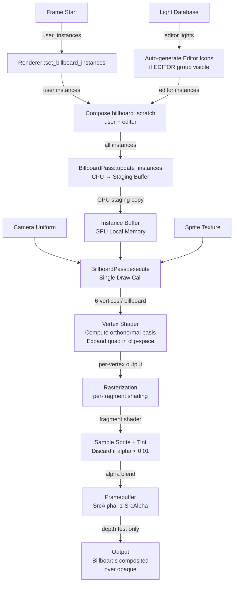
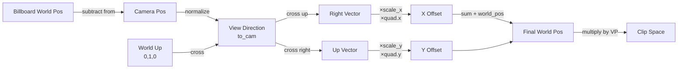

# Billboard Pass

## Introduction

The **Billboard Pass** is a specialized render pipeline for efficiently drawing camera-facing quads. Billboards are essential for rendering visual markers that always face the camera: editor light icons, particle systems, HUD elements, world-space UI, damage numbers, and any effect that should be viewed straight-on.

Traditional mesh-based rendering would require transforming geometry matrices, submitting separate draw calls, or complex shader logic. Billboards sidestep this by computing a per-vertex screen-facing basis *inside* the vertex shader — the GPU expands a simple unit quad into a full camera-aligned rectangle at render time.

### Why Billboards Matter

In a deferred rendering architecture like Helio, billboards occupy a privileged position in the rendering timeline: they execute *after* opaque geometry has been written to the G-buffer and depth buffer, but *before* any post-process passes run. This placement is not incidental — it means billboards can depth-test against the fully resolved scene while still compositing cleanly into an image that post-process effects will later refine. Editor light icons exploit this directly, giving artists an immediate visual feedback loop during light placement and intensity adjustment without any overhead from mesh draw calls.

From a performance perspective, the billboard system issues a single `O(1)` GPU draw call regardless of how many instances are visible. GPU instancing hands the parallelism entirely to the hardware: one call, six vertices per billboard, thousands of quads rasterized simultaneously. The two sizing modes — world-space and screen-space — further extend flexibility. World-space sizing lets particles and environmental markers shrink naturally with distance, feeling like true inhabitants of the scene geometry; screen-space sizing keeps HUD icons and editor indicators at a constant pixel footprint no matter how far the camera has retreated.

### The Challenge

Standard quad vertices in world space do not naturally face the camera. Making them do so requires constructing a fresh orthonormal basis — a right vector and an up vector both perpendicular to the current view direction — for every vertex, then expanding the unit quad (±0.5 in local XY) along those axes. On top of that, the system must handle two fundamentally different scaling behaviours: world-space mode, where standard perspective division lets distant billboards shrink naturally, and screen-space mode, where the offset must be pre-multiplied by view-axis depth so that perspective division cancels it out and the billboard occupies a constant number of NDC units regardless of distance. All of this must blend over opaque geometry without ever writing to the depth buffer, leaving the depth attachment valid for every subsequent pass. Helio's billboard system resolves all of these concerns in a single, streamlined GPU pipeline.

---

## The Vertex Transform

The vertex shader's core job is to transform a small local quad vertex into world-space and then into clip-space while ensuring the quad is always perpendicular to the view direction.

### Orthonormal Basis Construction

Given:
- Billboard world position: $$\mathbf{p}_{world}$$
- Camera world position: $$\mathbf{p}_{cam}$$
- Quad local position (in unit square): $$\mathbf{q} \in [-0.5, 0.5]^2$$

The shader first computes the *view direction*:

$$\mathbf{v} = \text{normalize}(\mathbf{p}_{cam} - \mathbf{p}_{world})$$

Next, it constructs a right-hand orthonormal basis perpendicular to $$\mathbf{v}$$. Using the world up direction as a reference:

$$\mathbf{right} = \text{normalize}(\mathbf{up}_{world} \times \mathbf{v})$$

$$\mathbf{up} = \mathbf{v} \times \mathbf{right}$$

These two vectors define the quad's local axes in world space: they span the plane perpendicular to the view direction.

### World-Space Offset

The quad's local position is expanded along the basis:

$$\mathbf{offset}_{world} = \mathbf{q}_x \cdot \text{scale}_x \cdot \mathbf{right} + \mathbf{q}_y \cdot \text{scale}_y \cdot \mathbf{up}$$

where $$\text{scale} = (\text{scale}_x, \text{scale}_y)$$ is the per-instance width/height in world units.

The final world position becomes:

$$\mathbf{p}_{final} = \mathbf{p}_{world} + \mathbf{offset}_{world}$$

### Clip-Space Projection

The final world position is then transformed by the combined view-projection matrix:

$$\mathbf{p}_{clip} = \mathbf{VP} \cdot \mathbf{p}_{final}$$

where $$\mathbf{VP}$$ is the 4×4 view-projection matrix (camera.view_proj).

This standard perspective division ensures that billboards recede into the distance and shrink naturally as the camera moves away—the hallmark of world-space sizing.

---

## World-Space vs. Screen-Space Sizing

One of the Billboard Pass's powerful features is the ability to toggle between two distinct sizing modes per-instance, controlled by a single float flag.

### World-Space Sizing (Flag z = 0.0)

When `scale_flags.z < 0.5`, the billboard is rendered in **world-space size mode**. The quad's width and height are expressed in world units (metres, for example), and standard perspective division is applied after clip-space projection. As a result, a billboard recedes and shrinks naturally as the camera moves away: a 1 m × 1 m quad at 10 m distance appears noticeably smaller than the same quad at 2 m. This makes world-space mode the right choice for particles, environmental markers, and any effect that should feel embedded in the scene geometry rather than fixed to the screen.

**Use case**: Particles, environmental markers, anything that should feel *part of the geometry*.

### Screen-Space Sizing (Flag z = 1.0)

When `scale_flags.z > 0.5`, the billboard shifts to **screen-space size mode**. Rather than letting perspective division shrink the quad with distance, the shader pre-multiplies the world-space offset by the view-axis depth, so that the subsequent perspective division cancels the distance factor and the quad occupies a constant number of NDC units regardless of how far away it sits:

$$\mathbf{offset}_{final} = \mathbf{offset}_{world} \times \text{view\_depth}$$

where:

$$\text{view\_depth} = \max(\mathbf{forward}_{cam} \cdot (\mathbf{p}_{world} - \mathbf{p}_{cam}), 0.001)$$

The key insight: after perspective division, a quad scaled by view-depth yields constant NDC coordinates:

$$\text{NDC size} = \frac{\text{scale} \times \text{view\_depth}}{\text{view\_depth}} = \text{scale}$$

It is **critical** to use view-axis depth — the dot product of the camera's forward vector with the billboard offset — rather than the raw Euclidean distance to the billboard. Euclidean distance includes the lateral component of the billboard's position relative to the principal axis, which means off-axis billboards at large viewing angles would be incorrectly scaled up, growing visibly larger the further they stray from the screen centre. View-axis depth eliminates this artifact entirely.

**Use case**: HUD icons, editor light indicators, UI elements that should remain crisp and consistently sized on-screen.

---

## BillboardInstance Struct

The CPU-side structure that defines a single billboard. It is tightly packed (48 bytes) and uploaded as instance buffer data.

```rust
#[repr(C)]
#[derive(Clone, Copy, Pod, Zeroable)]
pub struct BillboardInstance {
    /// World-space position (xyz) + unused pad (w).
    pub world_pos:   [f32; 4],
    /// Scale (xy), screen_scale flag as f32 (z), unused (w).
    pub scale_flags: [f32; 4],
    /// RGBA tint color.
    pub color:       [f32; 4],
}
```

### Field Layout and Byte Offsets

| Field            | Offset (bytes) | Size (bytes) | Format         | Description                      |
|------------------|----------------|--------------|----------------|----------------------------------|
| `world_pos[0]`   | 0              | 4            | `f32`          | World X position                 |
| `world_pos[1]`   | 4              | 4            | `f32`          | World Y position                 |
| `world_pos[2]`   | 8              | 4            | `f32`          | World Z position                 |
| `world_pos[3]`   | 12             | 4            | `f32`          | Unused (padding for alignment)   |
| `scale_flags[0]` | 16             | 4            | `f32`          | Scale X (width in world units)   |
| `scale_flags[1]` | 20             | 4            | `f32`          | Scale Y (height in world units)  |
| `scale_flags[2]` | 24             | 4            | `f32`          | Screen-space sizing flag (0 or 1)|
| `scale_flags[3]` | 28             | 4            | `f32`          | Unused (padding)                 |
| `color[0]`       | 32             | 4            | `f32`          | Red tint (0–1)                   |
| `color[1]`       | 36             | 4            | `f32`          | Green tint (0–1)                 |
| `color[2]`       | 40             | 4            | `f32`          | Blue tint (0–1)                  |
| `color[3]`       | 44             | 4            | `f32`          | Alpha transparency (0–1)         |

**Total: 48 bytes per instance.**

> [!NOTE]
> The `world_pos[3]` and `scale_flags[3]` fields are reserved for future use or alignment. They should be set to `0.0`.

### Field Semantics

`world_pos[3]` is currently unused and reserved for potential future extensions — for example, per-instance rotation would require a quaternion, whose fourth component could occupy this slot. Until such an extension lands, callers must set it to `0.0`; the shader ignores it entirely, but leaving it uninitialised risks GPU undefined behaviour on some drivers.

`scale_flags[2]` is the sizing-mode discriminant. Any value strictly less than `0.5` selects world-space sizing, where perspective applies normally. Any value strictly greater than `0.5` — including the canonical `1.0` — selects screen-space sizing. The shader comparison is `screen_scale > 0.5`, so the full range `(0.5, 1.0]` is treated identically as screen-space; values near the boundary should be avoided.

---

## The WGSL Shaders

### Bind Group Layout

The Billboard Pass uses two bind groups: Group 0 carries the per-frame camera and global uniforms shared across the entire deferred pipeline, while Group 1 is local to the billboard pass and holds the sprite texture and its accompanying sampler. This two-group split lets the renderer rebind only Group 1 when swapping sprite textures between different billboard passes, leaving the expensive camera uniform bind group undisturbed.

#### Group 0: Global Uniforms
Shared camera and frame state.

```wgsl
@group(0) @binding(0) var<uniform> camera: Camera;
@group(0) @binding(1) var<uniform> globals: Globals;
```

**Camera** (368 bytes):
```wgsl
struct Camera {
    view:          mat4x4<f32>,   // offset   0 — world→view
    proj:          mat4x4<f32>,   // offset  64 — view→clip
    view_proj:     mat4x4<f32>,   // offset 128 — combined VP
    inv_view_proj: mat4x4<f32>,   // offset 192 — clip→world
    position_near: vec4<f32>,     // offset 256 — xyz=world pos, w=near
    forward_far:   vec4<f32>,     // offset 272 — xyz=forward, w=far
    jitter_frame:  vec4<f32>,     // offset 288
    prev_view_proj: mat4x4<f32>,  // offset 304
}
```

**Globals** (16 bytes):
```wgsl
struct Globals {
    frame: u32,
    delta_time: f32,
    ambient_intensity: f32,
    _padding: f32,
}
```

#### Group 1: Sprite Texture & Sampler

```wgsl
@group(1) @binding(0) var sprite_tex:     texture_2d<f32>;
@group(1) @binding(1) var sprite_sampler: sampler;
```

### Vertex Shader

```wgsl
struct QuadVertex {
    @location(0) position: vec2<f32>,
    @location(1) uv:       vec2<f32>,
}

struct BillboardInstance {
    // world position (xyz) + unused pad (w)
    @location(2) world_pos_pad: vec4<f32>,
    // scale (xy), screen_scale flag as f32 (z), unused (w)
    @location(3) scale_flags:   vec4<f32>,
    // RGBA tint color
    @location(4) color:         vec4<f32>,
}

struct VertexOut {
    @builtin(position) clip_pos: vec4<f32>,
    @location(0)       uv:       vec2<f32>,
    @location(1)       color:    vec4<f32>,
}

@vertex
fn vs_main(quad: QuadVertex, inst: BillboardInstance) -> VertexOut {
    let world_pos    = inst.world_pos_pad.xyz;
    let scale        = inst.scale_flags.xy;
    let screen_scale = inst.scale_flags.z > 0.5;

    // Build camera-facing (billboard) basis vectors
    let cam_pos = camera.position_near.xyz;
    let to_cam  = normalize(cam_pos - world_pos);

    // Right and up vectors perpendicular to the view direction
    let world_up = vec3<f32>(0.0, 1.0, 0.0);
    let right    = normalize(cross(world_up, to_cam));
    let up       = cross(to_cam, right);

    // Offset in world space using the quad's local position
    var offset = right * quad.position.x * scale.x
               + up    * quad.position.y * scale.y;

    // Optional: constant screen-space scaling.
    // We must scale by VIEW-AXIS depth (dot with forward), NOT Euclidean distance.
    // Perspective division uses view-depth, so: world_size = scale * view_depth
    // → projected NDC size = scale * view_depth / view_depth = scale (constant).
    // Using Euclidean distance instead causes off-axis billboards to appear larger.
    if screen_scale {
        let view_depth = max(dot(camera.forward_far.xyz, world_pos - cam_pos), 0.001);
        offset        *= view_depth;
    }

    let final_pos = world_pos + offset;

    var out: VertexOut;
    out.clip_pos = camera.view_proj * vec4<f32>(final_pos, 1.0);
    out.uv       = quad.uv;
    out.color    = inst.color;
    return out;
}
```

The orthonormal basis is recomputed fresh for every vertex from the camera position read out of the uniform buffer, ensuring that billboards remain correctly oriented even as the camera moves between frames. When screen-space sizing is active, the view-depth multiplier is applied to the world-space offset before clip-space projection, so that the subsequent perspective division cancels it and the billboard occupies a constant NDC footprint. UV coordinates are passed through to the fragment stage unchanged, where they will drive the sprite texture sample.

### Fragment Shader

```wgsl
@fragment
fn fs_main(in: VertexOut) -> @location(0) vec4<f32> {
    let tex_color = textureSample(sprite_tex, sprite_sampler, in.uv);
    // Tint the sprite by the per-instance color; use texture alpha for transparency
    let rgb   = tex_color.rgb * in.color.rgb;
    let alpha = tex_color.a   * in.color.a;
    if alpha < 0.01 { discard; }
    return vec4<f32>(rgb, alpha);
}
```

The sampled sprite colour is multiplied component-wise by the per-instance tint, allowing a single white or grayscale sprite to be recoloured at zero additional texture cost. Both the sprite's own alpha and the instance's alpha channel contribute multiplicatively to the final transparency, so either can fade a billboard independently. Fragments whose combined alpha falls below `0.01` are discarded immediately, acting as a cheap alpha-test that prevents the blend hardware from touching pixels that are effectively invisible.

---

## Editor Light Icons

The Helio renderer includes a sophisticated automatic icon system for in-editor visualization of light sources. This system is built *entirely* on top of the standard Billboard Pass and demonstrates its flexibility.

### How It Works

When rendering a frame, the high-level `Renderer` maintains a map of all active lights:

```rust
editor_lights: HashMap<LightId, crate::GpuLight>
```

In the `render()` method, **if** `GroupId::EDITOR` is currently visible (not hidden), the renderer auto-generates a billboard instance for each light:

```rust
if !self.scene.is_group_hidden(GroupId::EDITOR) {
    for (_, light) in &self.editor_lights {
        let [x, y, z, _] = light.position_range;
        let [r, g, b, _] = light.color_intensity;
        self.billboard_scratch.push(helio_pass_billboard::BillboardInstance {
            world_pos:   [x, y, z, 0.0],
            // scale_flags.z = 0.0 → world-space size
            scale_flags: [0.25, 0.25, 0.0, 0.0],
            color:       [r, g, b, 1.0],
        });
    }
}
```

### Visual Properties

Each editor light icon is positioned exactly at the light's world-space XYZ coordinate and rendered as a 0.25 m × 0.25 m world-space quad — large enough to be spotted at a glance in the viewport, small enough to stay unobtrusive. Its RGB channels are taken directly from the light's own colour data, so a warm-tinted point light shows an orange icon and a cool fill light shows a blue one, giving artists immediate colour-accuracy feedback without opening a properties panel. The alpha channel is locked at `1.0` for full opacity. The sprite itself is the `spotlight.png` image embedded in the Helio binary, a visually distinctive icon whose world-space sizing mode means it recedes naturally with distance, consistent with how the light's influence itself diminishes.

### Integration with GroupId::EDITOR

Editor icon synthesis is entirely automatic: the renderer regenerates the full set of billboard instances from the live light database on every frame, so creating, deleting, or repositioning a light is immediately reflected in the viewport without any manual billboard bookkeeping by the caller.

Visibility of editor icons is controlled through the `GroupId::EDITOR` group mechanism. Calling `renderer.hide_group(GroupId::EDITOR)` suppresses all light icons — useful for clean screenshots or shipping builds — while `renderer.show_group(GroupId::EDITOR)` restores them. This visibility toggle is checked once per frame at composition time; there is no per-light override.

User-supplied billboards — particles, damage numbers, HUD markers — are kept in an entirely separate list and are always rendered regardless of `GroupId::EDITOR` visibility. Editor icons are appended to the scratch buffer *after* user instances during composition, meaning they occupy the tail of the instance array and are never interleaved with user content.

> [!IMPORTANT]
> Editor light icons are synthesized per-frame directly from the light data. If a light is created, deleted, or updated, the corresponding icon is automatically updated the next frame—no manual billboard management required.

### The Spotlight Sprite

The default icon sprite is `spotlight.png`, a small PNG image embedded in the Helio library binary via `include_bytes!()`. This icon provides a visually distinctive "light bulb" appearance suitable for in-editor context.

---

## Bind Group Layout Reference

### Helio Bind Group Layout Conventions

The Billboard Pass follows Helio's standard bind group naming and organization:

| Group | Binding | Name               | Type              | Visibility    | Purpose                                      |
|-------|---------|-------------------|-------------------|----------------|----------------------------------------------|
| 0     | 0       | camera            | Uniform Buffer    | Vertex         | Camera matrices (view, projection, etc.)     |
| 0     | 1       | globals           | Uniform Buffer    | Vertex+Fragment| Frame globals (frame count, time, etc.)      |
| 1     | 0       | sprite_tex        | Texture 2D        | Fragment      | Billboard sprite image (RGBA or luminance)  |
| 1     | 1       | sprite_sampler    | Sampler           | Fragment      | Linear filtering, clamp-to-edge sampler      |

---

## API Reference

### C++ / Rust API

#### `BillboardPass::new()`

Create a new billboard pass with a default white (1,1,1,1) sprite texture.

```rust
pub fn new(
    device:        &wgpu::Device,
    queue:         &wgpu::Queue,
    camera_buf:    &wgpu::Buffer,
    target_format: wgpu::TextureFormat,
) -> Self
```

`device` is the standard wgpu handle used for all buffer and texture allocations inside the pass. `queue` is used to upload the initial 1×1 white sprite texture at construction time. `camera_buf` must point to a live uniform buffer containing the current `Camera` struct (368 bytes); the pass binds this buffer directly and does not own it — the caller is responsible for keeping it alive and writing updated camera data each frame. `target_format` specifies the colour attachment format of the render target (e.g., `Rgba16Float` or `Rgba8Unorm`) and must match the format of the texture passed to `execute()`.

> [!NOTE]
> The camera buffer must be kept alive and updated by the caller. The pass does not create it.

#### `BillboardPass::new_with_sprite_rgba()`

Create a billboard pass with a custom sprite texture loaded from raw RGBA bytes.

```rust
pub fn new_with_sprite_rgba(
    device:        &wgpu::Device,
    queue:         &wgpu::Queue,
    camera_buf:    &wgpu::Buffer,
    target_format: wgpu::TextureFormat,
    rgba:          &[u8],
    width:         u32,
    height:        u32,
) -> Self
```

`device`, `queue`, `camera_buf`, and `target_format` carry the same semantics as in `BillboardPass::new()`. `rgba` must be a flat, row-major array of raw RGBA8 bytes — four bytes per pixel, no padding between rows — with a total length of exactly `width × height × 4`. `width` and `height` give the texture dimensions in pixels. If either dimension is zero or the byte count does not match, the constructor silently falls back to a 1×1 white texture rather than panicking, so callers should validate their image data before passing it in. There is no API to swap the sprite texture after construction; if a different sprite is required, a new `BillboardPass` must be created.

**Example:**

```rust
let icon_bytes = include_bytes!("custom_icon.png");
let decoded = image::load_from_memory_with_format(
    icon_bytes,
    image::ImageFormat::Png
)?.to_rgba8();
let pass = BillboardPass::new_with_sprite_rgba(
    &device,
    &queue,
    &camera_buf,
    wgpu::TextureFormat::Rgba16Float,
    &decoded,
    decoded.width() as u32,
    decoded.height() as u32,
);
```

> [!TIP]
> Use a tool like `image` crate to decode PNG/JPEG files into raw RGBA bytes, then pass them here.

#### `BillboardPass::update_instances()`

Upload a fresh set of billboard instances to the GPU. Call once per frame (or whenever the set changes).

```rust
pub fn update_instances(&mut self, queue: &wgpu::Queue, instances: &[BillboardInstance])
```

`instances` is a slice of billboard data to upload. The pass enforces a hard cap of `MAX_BILLBOARDS = 65,536` instances; if the slice is longer it is silently truncated to that limit. Passing an empty slice is valid and simply results in no billboards being rendered until `update_instances()` is called again with non-empty data.

The CPU cost of this call is `O(n)`: the instance data is `memcpy`'d into a staging buffer of fixed size. The subsequent staging-to-local GPU copy is issued asynchronously as part of the command queue submission, so the GPU rasterizes the previous frame's data while the copy for the current frame is in flight — a standard double-buffering arrangement that keeps both the CPU and GPU busy.

> [!NOTE]
> Calling `update_instances()` with an empty slice disables billboards until explicitly re-enabled.

#### `Renderer::set_billboard_instances()`

High-level API to set user billboards in the Helio renderer. Called before each `render()`.

```rust
pub fn set_billboard_instances(&mut self, instances: &[helio_pass_billboard::BillboardInstance])
```

This method sets the user-supplied instance list for the current frame. At render time, the renderer composes a combined buffer by appending user instances first, followed by any auto-generated editor light icons (provided `GroupId::EDITOR` is visible), then uploads the resulting concatenated list to the GPU in a single `update_instances()` call. This composition happens inside `render()`, so the caller need not be aware of how many editor icons exist.

**Example:**

```rust
let billboards = vec![
    BillboardInstance {
        world_pos:   [0.0, 5.0, 0.0, 0.0],
        scale_flags: [0.5, 0.5, 0.0, 0.0], // world-space 0.5m × 0.5m
        color:       [1.0, 0.0, 0.0, 1.0], // red
    },
];
renderer.set_billboard_instances(&billboards);
renderer.render(&camera, &target)?;
```

---

## Alpha Blending Configuration

Billboards use **pre-multiplied alpha over** blending, the standard for transparent geometry:

```rust
blend:  Some(wgpu::BlendState {
    color: wgpu::BlendComponent {
        src_factor: wgpu::BlendFactor::SrcAlpha,
        dst_factor: wgpu::BlendFactor::OneMinusSrcAlpha,
        operation:  wgpu::BlendOperation::Add,
    },
    alpha: wgpu::BlendComponent::OVER,
}),
```

### Blend Equation

For each output pixel:

$$C_{out} = C_{src} \cdot A_{src} + C_{dst} \cdot (1 - A_{src})$$

where:
- $$C_{src}$$ = billboard fragment color (RGB from sprite × instance tint)
- $$A_{src}$$ = billboard fragment alpha (sprite alpha × instance alpha)
- $$C_{dst}$$ = existing framebuffer color
- $$C_{out}$$ = final blended color

This produces correct **over** compositing: opaque billboards fully occlude the background, semi-transparent ones blend smoothly.

### Depth Test: Read-Only

Billboards are depth-tested but do **not** write to the depth buffer:

```rust
depth_stencil: Some(wgpu::DepthStencilState {
    format:              wgpu::TextureFormat::Depth32Float,
    depth_write_enabled: false,
    depth_compare:       wgpu::CompareFunction::LessEqual,
    // ...
}),
```

Disabling depth writes while keeping the depth test active is the correct design for transparent geometry layered over an opaque scene. A billboard that passes the `LessEqual` depth test is correctly hidden behind closer opaque surfaces, but because it never writes its own depth value back, the depth buffer remains unmodified and fully valid for every subsequent pass — post-process effects such as FXAA, TAA, and depth-of-field can all read a consistent, geometry-only depth buffer. If billboards were permitted to write depth, each semi-transparent quad would corrupt the depth values in the pixels it covers, causing later transparent draws and post-process samples to receive erroneous depth readings.

---

## Custom Textures and Sprite Management

By default, the Billboard Pass creates a 1×1 white texture. This is sufficient for tint-only billboards where all visual information comes from the per-instance colour, but detailed sprite graphics require a custom texture provided at construction time via `BillboardPass::new_with_sprite_rgba()`. There is no API to swap the sprite texture after the pass has been created; applications that need multiple distinct sprites must instantiate a separate `BillboardPass` for each one and execute them in sequence.

### Pattern: Custom Sprite at Pass Creation

```rust
let icon_data = include_bytes!("spotlight.png");
let decoded_image = image::load_from_memory(icon_data)?
    .to_rgba8();

let billboard_pass = BillboardPass::new_with_sprite_rgba(
    &device,
    &queue,
    &camera_buf,
    surface_format,
    &decoded_image.into_raw(),
    decoded_image.width(),
    decoded_image.height(),
);
```

### Pattern: Colour Tinting

If you use a mostly-opaque sprite (e.g., a grayscale icon), the instance colour acts as a tint multiplier:

```rust
BillboardInstance {
    world_pos:   [x, y, z, 0.0],
    scale_flags: [0.5, 0.5, 0.0, 0.0],
    color:       [0.2, 0.8, 0.2, 1.0], // green tint
}
```

The fragment shader computes:

$$\text{rgb} = \text{sprite\_rgb} \times \text{tint\_rgb}$$

A fully white sprite (`[1, 1, 1]`) multiplied by any tint produces the tint colour directly, making a white sprite equivalent to a solid-colour billboard. A grayscale sprite acts as a luminance mask: bright regions of the sprite let the tint shine through at full intensity while dark regions suppress it, producing a naturally shaded icon tinted in the chosen hue.

### Pattern: Per-Instance Transparency

Use the instance colour's alpha channel for fading:

```rust
BillboardInstance {
    world_pos:   [x, y, z, 0.0],
    scale_flags: [0.5, 0.5, 0.0, 0.0],
    color:       [1.0, 1.0, 1.0, 0.5], // 50% transparent
}
```

---

## Performance Characteristics

### Single Draw Call

The entire billboard system is rendered via one GPU draw call, regardless of instance count:

```wgsl
pass.draw(0..6, 0..instance_count);
```

This is O(1) in CPU overhead. The GPU rasterizes 6 vertices (one quad, two triangles) per billboard, so throughput is linear in instance count.

### Staging Buffer Upload

Billboard instance data is uploaded via a staging buffer in three distinct phases. On the CPU side, `update_instances()` performs an `O(n)` `memcpy` of the instance slice into a pre-allocated staging buffer — for 65,536 instances this is roughly 3.1 MB of contiguous memory movement, typically completing in well under a millisecond. The queue submission then issues a staging-to-local copy command at `O(1)` CPU cost; the GPU executes this copy asynchronously, overlapped with rasterization of the previous frame's data. Finally, at draw time, the GPU reads the local instance buffer and rasterizes 6 vertices per billboard, a workload that is fully parallelised across shader units.

For typical use cases:

| Instance Count | Staging Upload | Approx. CPU Time |
|---------------|---------------|-----------------|
| 1,000         | ~48 KB        | negligible       |
| 10,000        | ~480 KB       | sub-millisecond  |
| 65,536        | ~3.1 MB       | typically <1 ms  |

### VRAM Footprint

The instance buffer is allocated at the maximum capacity of `MAX_BILLBOARDS × 48 bytes`, which amounts to 65,536 × 48 = **3.1 MB** regardless of how many instances are actually in use at any given frame. The sprite texture size depends on the image format and resolution — the default 1×1 white fallback is just 4 bytes, while a 512×512 RGBA8 icon costs 1 MB. Camera and globals uniforms, bind group descriptors, and pipeline state together add approximately 400 bytes. In total the pass occupies roughly **3.5 MB of VRAM at minimum**, growing linearly with sprite resolution.

### Vertex Shader Cost

The vertex shader performs a view-direction normalization, two cross products and a second normalization to build the orthonormal basis, two multiply-add operations to expand the quad, an optional dot product and scalar multiply for screen-space depth scaling, and a full 4×4 matrix-vector product for the final clip-space projection — amounting to roughly **20–30 ALU cycles** per vertex, fully parallelizable across GPU shader units.

### Fragment Shader Cost

The fragment shader executes a single texture fetch, three component-wise multiplies for RGB tinting, one alpha multiply, and a conditional discard — amounting to roughly **5–10 cycles** per fragment. In practice this workload is dominated by texture sampling latency, which the GPU's thread scheduler hides by switching to other in-flight warps while the memory system services the request.

---

## Mermaid Diagrams

### Billboard Rendering Pipeline



### Camera-Facing Basis Construction



---

## Advanced Topics

### Screen-Space Sizing and Off-Axis Viewing

When using screen-space sizing, it is critical to scale by **view-axis depth** (the projection of the billboard offset onto the camera's forward vector), not Euclidean distance. This ensures constant NDC size even for billboards far off the camera's principal axis.

**Incorrect approach** (Euclidean distance):
$$\text{offset}_{final} = \text{offset}_{world} \times |\mathbf{p}_{world} - \mathbf{p}_{cam}|$$

At extreme viewing angles, this inflates off-axis billboards, causing them to appear much larger than intended.

**Correct approach** (view-axis depth, used in Helio):
$$\text{offset}_{final} = \text{offset}_{world} \times \max(\mathbf{forward}_{cam} \cdot (\mathbf{p}_{world} - \mathbf{p}_{cam}), 0.001)$$

The `0.001` clamp prevents division-by-zero artifacts when billboards are behind the camera.

### Quadrants and Degenerate Cases

The orthonormal basis computation assumes:
- The view direction is not parallel to the world up vector (0, 1, 0)
- The cross product $$\text{world\_up} \times \text{to\_cam}$$ is non-zero

If the billboard is directly above/below the camera, the right vector computation becomes unstable. Helio does **not** explicitly handle this edge case; the resulting basis will be rotated but still orthonormal. For critical applications, consider a more robust basis construction (e.g., choosing an alternative "up" vector if collinearity is detected).

### Cascading Transparency

Billboards are designed for **over** blending, and this makes them suitable for compositing particles over opaque geometry, layering HUD markers over the scene, or placing icons that integrate naturally into the final image. When a different blending mode is required — for example, additive blending to simulate glowing light flares or energy effects — the cleanest solution is to create a second `BillboardPass` configured with a custom blend state and execute it immediately after the standard pass. Both passes share the same camera bind group and depth buffer, so they integrate into the pipeline at zero additional bind overhead:

```rust
color: wgpu::BlendComponent {
    src_factor: wgpu::BlendFactor::One,
    dst_factor: wgpu::BlendFactor::One,
    operation:  wgpu::BlendOperation::Add,
},
```

---

## Troubleshooting

### Billboards Appear at Wrong Positions

The most common cause is a stale camera buffer: the billboard basis computation reads `camera.position_near.xyz` directly from the uniform buffer, so if the buffer is not updated before the draw call the shader operates on last frame's camera position and all world-space offsets are computed relative to the wrong origin. Verify that the camera buffer is written every frame before `execute()` is called. A secondary cause is a mismatch in coordinate conventions: `world_pos` values must be in the same world-space units as the camera matrices — typically metres — not pixels, normalised device coordinates, or any other space.

### Screen-Space Billboards Vary in Size with Distance

If screen-space billboards are shrinking or growing with camera distance, check that `scale_flags[2]` is set to a value greater than `0.5`. A value of `0.0` silently enables world-space sizing, which is the correct perspective-shrinking behaviour for particles but wrong for HUD icons. If `scale_flags[2]` is confirmed to be `1.0` and size variation persists, verify that the shader is reading `camera.forward_far.xyz` correctly and that the forward vector in the uniform buffer is being updated each frame.

### Billboards Appear with Incorrect Orientation

The orthonormal basis is constructed using a hard-coded world-up direction of `(0, 1, 0)`. If the scene convention uses a different up axis — for example, `(0, 0, 1)` in a Z-up coordinate system — billboards will be tilted by 90 degrees. The fix is either to pre-rotate the billboard world positions before submission, or to patch the vertex shader to use the correct world-up vector. There is currently no per-instance up-vector override.

### Alpha-Tested Edges Look Noisy or Aliased

Billboards use alpha-test (the `discard` instruction) rather than alpha-to-coverage. The `0.01` threshold produces a hard, unfiltered silhouette edge that can appear aliased at low resolutions or on sprites with very soft alpha gradients. For smooth edges, use a sprite texture with a pre-antialiased border baked into the alpha channel, ensuring the alpha transitions from opaque to transparent over several pixels rather than in a single texel step. Alternatively, enabling **Multisample Anti-Aliasing (MSAA)** on the render pass will supersample billboard edges along with everything else in the scene.

### Performance Drops with Many Billboards

First confirm with a GPU profiling tool such as RenderDoc or PIX that the bottleneck is actually the billboard pass rather than a CPU-side upload stall or congestion in a different pass. If the billboard pass itself is the culprit, the most effective mitigations are reducing the instance count to a budget appropriate for the target hardware (typically 1,000–10,000 on mid-range GPUs), and preferring screen-space sizing for HUD and UI billboards since that mode avoids the optional dot product and saves a few ALU cycles per vertex.