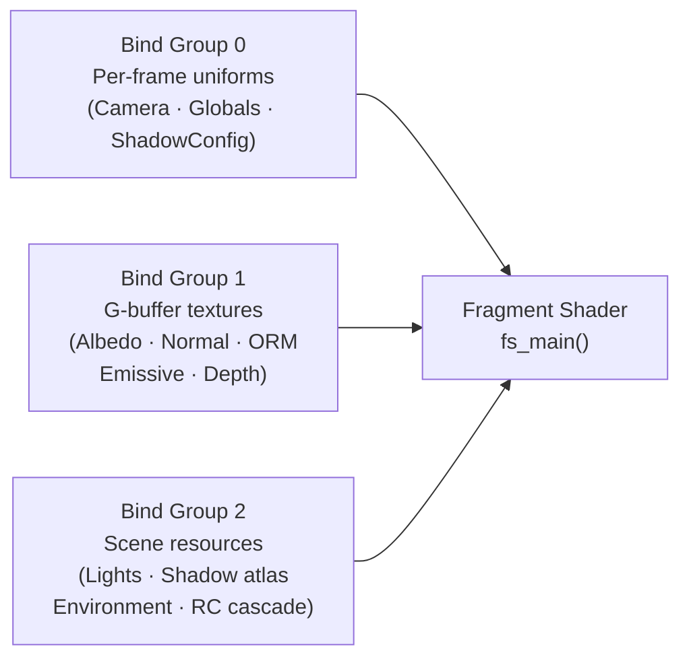
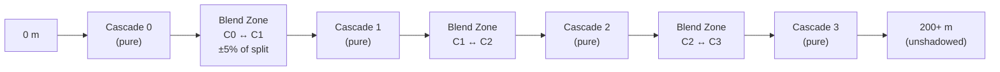
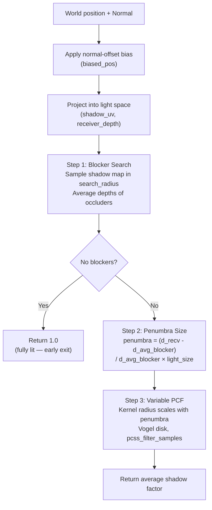
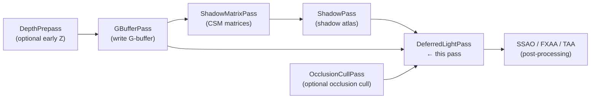
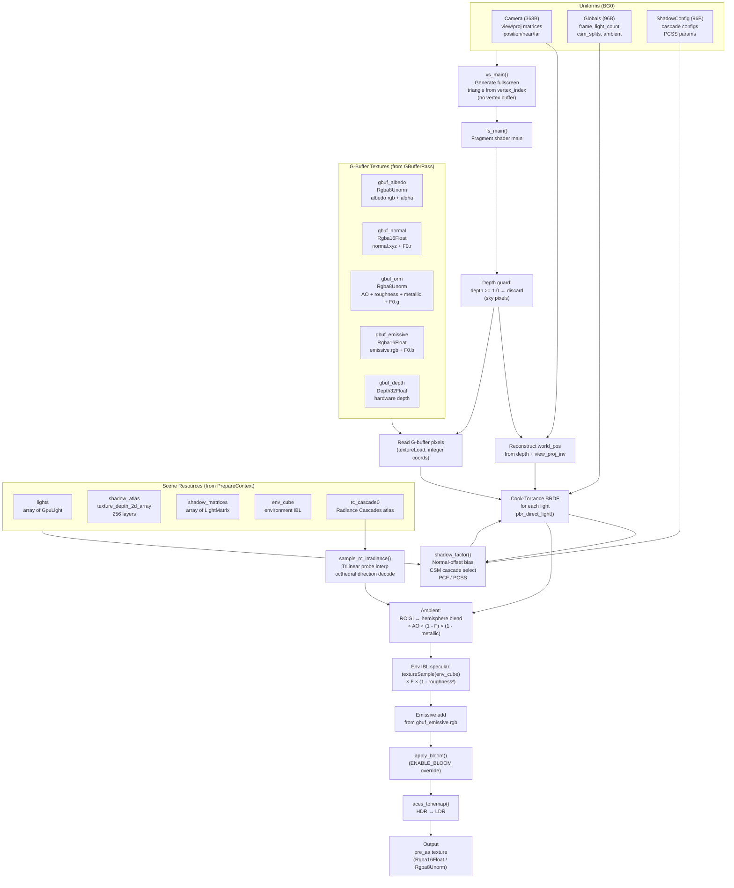

The `DeferredLightPass` is Helio's single most expensive and most feature-rich render pass. It evaluates the full physically-based lighting model — Cook-Torrance BRDF with GGX distribution, cascaded shadow maps with optional contact-hardening (PCSS), Radiance Cascades indirect illumination, and environment IBL — across every visible pixel in a single screen-space draw call. This document covers the complete architecture, every shader function, and the design decisions behind each technique.

---

## 1. Deferred Shading Philosophy

Traditional **forward rendering** evaluates every light's contribution for every fragment generated by every draw call. In a scene with `T` triangles generating `F` fragments and `L` lights, the cost is roughly `O(F × L)`. Worse, fragments that are subsequently occluded by closer geometry still pay the full lighting cost — a phenomenon called overdraw.

**Deferred shading** separates geometry rasterisation from lighting evaluation into two distinct phases:

1. **Geometry pass (G-buffer pass):** All meshes are rasterised once. Each visible fragment writes its surface properties — albedo, world-space normal, occlusion/roughness/metallic, emissive colour — into a set of render targets called the **G-buffer**. The GPU's early-Z hardware ensures only the frontmost fragment writes, so there is zero lighting overdraw.

2. **Lighting pass (this pass):** A single fullscreen draw reads the G-buffer and evaluates all lights for every pixel. Cost is strictly `O(screen_pixels × light_count)`, completely independent of scene triangle count.

The deferred approach becomes dramatically more efficient as scene complexity grows. At 100 000 triangles with 64 lights in a 1080p viewport:

| Approach | Approximate Fragment-Light Operations |
|---|---|
| Forward (no depth prepass) | ~28 billion (with overdraw) |
| Forward (depth prepass) | ~1.2 billion |
| **Deferred** | **~125 million** |

The reduction is roughly 10× in this example, and continues to grow with light count. The tradeoff is increased G-buffer memory bandwidth and the difficulty of handling transparent geometry (which cannot write to the G-buffer at all — transparents require a separate forward pass).

> [!IMPORTANT]
> Helio writes transparents in a dedicated forward transparent pass that runs **after** the deferred lighting pass. The deferred pass only evaluates opaque geometry.

---

## 2. The Fullscreen Triangle Technique

The lighting pass needs to shade every pixel on screen. The naive approach is a screen-sized quad (two triangles). Helio instead uses a single oversized triangle — a technique that has measurable GPU advantages.

The vertex shader generates vertex positions directly from the hardware `vertex_index` builtin, requiring **no vertex buffer** at all:

```wgsl
struct VSOut {
    @builtin(position) clip_pos: vec4<f32>,
}

@vertex
fn vs_main(@builtin(vertex_index) vi: u32) -> VSOut {
    // Three vertices covering the entire NDC square.
    // No vertex buffer required — just draw(3, 1, 0, 0).
    var pos = array<vec2<f32>, 3>(
        vec2<f32>(-1.0, -1.0),
        vec2<f32>( 3.0, -1.0),
        vec2<f32>(-1.0,  3.0),
    );
    var out: VSOut;
    out.clip_pos = vec4<f32>(pos[vi], 0.0, 1.0);
    return out;
}
```

Why does this oversized triangle correctly cover the viewport? Consider the three vertices in NDC space: `(-1,-1)`, `(3,-1)`, `(-1,3)`. These form a right triangle whose legs have length 4 along each axis. The unit square `[-1,1]²` fits entirely inside this triangle — you can verify this by checking that every corner of the square satisfies the half-plane inequalities of the three triangle edges. The GPU clips the triangle to the viewport, so the oversized parts are never rasterised.

The advantage over a quad is subtle but real: a quad's diagonal seam creates a strip of pixels processed twice (once per triangle) along the diagonal. This **diagonal overdraw** produces divergent execution paths in fragment shaders, breaking SIMD warp coherence. The single-triangle approach eliminates the seam entirely. On tile-based mobile GPUs the effect is even more pronounced because the tile fill algorithm handles the single triangle more efficiently.

> [!TIP]
> Because there is no vertex buffer, the Rust-side draw call is a trivially simple `pass.draw(0..3, 0..1)` with no buffer binding required before it.

---

## 3. Bind Group Layout Overview

The pass uses three bind groups with clearly separated concerns:



Bind groups 1 and 2 are recreated lazily when the underlying texture views or buffer pointers change (tracked via pointer-address keys). Bind group 0 is created once on construction and updated only through `queue.write_buffer()` to the underlying uniform buffers.

---

## 4. Bind Group 0 — Per-Frame Uniforms

Three uniform buffers provide per-frame data. Binding 0 and 1 are visible to the fragment stage only.

### 4.1 Camera Uniform (Binding 0)

The `Camera` struct is 368 bytes and shared across all passes that need view/projection matrices:

```wgsl
struct Camera {
    view:           mat4x4<f32>,   // 64 bytes — world-to-view
    proj:           mat4x4<f32>,   // 64 bytes — view-to-clip
    view_proj:      mat4x4<f32>,   // 64 bytes — world-to-clip (precomputed)
    view_proj_inv:  mat4x4<f32>,   // 64 bytes — clip-to-world (for depth reconstruction)
    position_near:  vec4<f32>,     // 16 bytes — xyz: camera world pos, w: near plane
    forward_far:    vec4<f32>,     // 16 bytes — xyz: camera forward dir, w: far plane
    jitter_frame:   vec4<f32>,     // 16 bytes — xy: TAA jitter, zw: frame/reserved
    prev_view_proj: mat4x4<f32>,   // 64 bytes — previous frame view_proj (for TAA/motion)
}
```

The `view_proj_inv` matrix is the most critical field for this pass — it is used to reconstruct world-space positions from the depth buffer, as detailed in Section 7.

### 4.2 Globals Uniform (Binding 1)

The `Globals` struct carries per-frame scalar data that varies between frames:

```wgsl
struct Globals {
    frame:             u32,       // Monotonically increasing frame number
    delta_time:        f32,       // Frame time in seconds
    light_count:       u32,       // Live light count this frame
    ambient_intensity: f32,       // Scene ambient intensity multiplier
    ambient_color:     vec4<f32>, // RGBA ambient sky colour
    rc_world_min:      vec4<f32>, // Radiance Cascade volume min corner (xyz)
    rc_world_max:      vec4<f32>, // Radiance Cascade volume max corner (xyz)
    csm_splits:        vec4<f32>, // Cascade split distances (meters): x=C0, y=C1, z=C2, w=C3
    debug_mode:        u32,       // 0=normal, 1-20=various debug visualisations
    _pad0:             u32,
    _pad1:             u32,
    _pad2:             u32,
}
```

The `csm_splits` field holds the hard-coded cascade far-planes in world-space meters: `(5.0, 20.0, 60.0, 200.0)`. These are uploaded from the Rust side during `prepare()` and consumed by the cascade selection logic in the shader. The `frame` counter is used to seed per-pixel PCF rotation hashes — see Section 11.

The corresponding Rust struct mirrors the WGSL layout byte-for-byte using `bytemuck::Pod`:

```rust
#[repr(C)]
#[derive(Clone, Copy, Pod, Zeroable)]
struct DeferredGlobals {
    frame:             u32,
    delta_time:        f32,
    light_count:       u32,
    ambient_intensity: f32,
    ambient_color:     [f32; 4],
    rc_world_min:      [f32; 4],
    rc_world_max:      [f32; 4],
    csm_splits:        [f32; 4],
    debug_mode:        u32,
    _pad0:             u32,
    _pad1:             u32,
    _pad2:             u32,
}
```

### 4.3 ShadowConfig Uniform (Binding 7)

The gap in binding indices (0, 1, 7) is intentional — bindings 2–6 are reserved in the layout for future per-frame data without forcing a bind group recreation. The `ShadowConfig` occupies binding 7:

```wgsl
/// Per-cascade shadow configuration (16 bytes, matches libhelio::CascadeConfig)
struct CascadeConfig {
    split_distance:   f32,  // Far plane distance (meters)
    depth_bias:       f32,  // Base depth bias
    filter_radius:    f32,  // PCF filter radius (texels in shadow atlas)
    pcss_light_size:  f32,  // PCSS virtual light size (meters, 0.0 = disable PCSS)
}

/// Global shadow configuration (96 bytes, matches libhelio::ShadowConfig)
struct ShadowConfig {
    cascades:             array<CascadeConfig, 4>,  // 64 bytes — 4 × 16-byte cascade configs
    enable_pcss:          u32,                      // Global PCSS toggle (0=PCF, 1=PCSS)
    pcss_blocker_samples: u32,                      // Blocker search sample count
    pcss_filter_samples:  u32,                      // PCSS filter sample count
    _pad:                 u32,                      // 16-byte alignment padding
}
```

The `ShadowConfig` is the only bind group 0 resource that changes at runtime — users call `DeferredLightPass::set_shadow_quality()` which triggers a single `queue.write_buffer()`. This is a zero-CPU-cost-per-frame design: the buffer update is amortised across many frames.

---

## 5. Bind Group 1 — G-Buffer Inputs

Five textures written by `GBufferPass` and published through `FrameResources`. All five are sampled via `textureLoad()` (integer pixel coordinates, no filtering) because the deferred pass maps one lighting pixel exactly to one G-buffer pixel.

| Binding | Name | Format | Contents |
|---|---|---|---|
| 0 | `gbuf_albedo` | `Rgba8Unorm` | albedo.rgb in [0,1] + alpha |
| 1 | `gbuf_normal` | `Rgba16Float` | world-space normal XYZ + F0.r (specular red channel) |
| 2 | `gbuf_orm` | `Rgba8Unorm` | ambient occlusion (R), perceptual roughness (G), metallic (B), F0.g |
| 3 | `gbuf_emissive` | `Rgba16Float` | pre-multiplied emissive RGB + F0.b |
| 4 | `gbuf_depth` | `Depth32Float` | hardware depth (0=near, 1=far in wgpu reversed-Z convention) |

> [!NOTE]
> The **F0 (specular reflectance at normal incidence)** value is stored split across three G-buffer channels: `normal.w` (red), `orm.a` (green), and `emissive.a` (blue). This avoids allocating an entire extra render target for a single 3-component value. The shader reconstructs it as:
> ```wgsl
> let F0 = clamp(vec3<f32>(normal_r.w, orm_r.a, emissive_r.a), vec3<f32>(0.0), vec3<f32>(0.999));
> ```

The `Rgba8Unorm` format for `gbuf_orm` is sufficient because AO, roughness, and metallic are all perceptual values in [0,1] with 8-bit precision. The `Rgba16Float` for normals is necessary because world-space normals can span [-1,1] and require more than 8-bit precision to avoid visible banding on smooth curved surfaces.

---

## 6. Bind Group 2 — Lights, Shadows, and Environment

Eight resources providing dynamic scene lighting data:

| Binding | Name | Type | Contents |
|---|---|---|---|
| 0 | `lights` | `storage<read>` array | `GpuLight` structs (64 bytes each) |
| 1 | `shadow_atlas` | `texture_depth_2d_array` | Depth atlas with 256 array layers, one per shadow map |
| 2 | `shadow_sampler` | `sampler_comparison` | `LessEqual` comparison for hardware PCF |
| 3 | `env_cube` | `texture_cube<f32>` | IBL environment cubemap |
| 4 | `shadow_matrices` | `storage<read>` array | `LightMatrix` (mat4×4) per shadow layer |
| 5 | `rc_cascade0` | `texture_2d<f32>` | Radiance Cascades output atlas (probe irradiance) |
| 6 | `env_sampler` | `sampler` | Bilinear filtering for environment cubemap |
| 7 | `shadow_depth_sampler` | `sampler` | Non-comparison sampler for PCSS blocker depth reads |

The critical distinction between bindings 2 and 7: `shadow_sampler` is a **comparison sampler** that returns a value in [0,1] indicating what fraction of samples pass the `LessEqual` depth test — this is hardware PCF. `shadow_depth_sampler` is a plain **filtering sampler** that returns raw depth values, used in the PCSS blocker search that needs actual depth values to compute average occluder distance.

The `GpuLight` struct layout:

```wgsl
/// GpuLight (64 bytes, matches libhelio::GpuLight)
struct GpuLight {
    position_range:  vec4<f32>,  // xyz = world position, w = effective range (metres)
    direction_outer: vec4<f32>,  // xyz = light direction, w = spot outer cone cos(angle)
    color_intensity: vec4<f32>,  // xyz = linear RGB colour, w = intensity multiplier
    shadow_index:    u32,        // First shadow atlas layer (0xFFFFFFFF = no shadow)
    light_type:      u32,        // 0 = directional, 1 = point, 2 = spot
    inner_angle:     f32,        // Spot inner cone cos(angle)
    _pad:            u32,
}
```

---

## 7. World Position Reconstruction from Depth

The deferred lighting pass does not read a world-position G-buffer target. Instead it reconstructs the world-space position of each pixel from the hardware depth value. The rationale for this is memory efficiency: a full Rgba32Float world-position buffer at 4K (3840×2160) would consume:

$$
3840 \times 2160 \times 4 \times 4 = 132\,710\,400 \text{ bytes} \approx 127 \text{ MB}
$$

Reconstructing from depth requires only the existing `Depth32Float` buffer and a matrix multiply. The mathematics follow standard homogeneous projection inversion:

$$
\text{uv}_{01} = \frac{\text{frag\_coord.xy}}{\text{screen\_size}}
$$

$$
\text{ndc.xy} = \left(\text{uv}_{01.x} \cdot 2 - 1,\quad 1 - \text{uv}_{01.y} \cdot 2\right)
$$

Note the Y flip: viewport coordinates have Y increasing downward, while wgpu NDC has Y increasing upward.

$$
\vec{w}_h = M_{\text{view\_proj\_inv}} \cdot \begin{pmatrix} \text{ndc.x} \\ \text{ndc.y} \\ d \\ 1 \end{pmatrix}
$$

$$
\vec{p}_\text{world} = \frac{\vec{w}_h.\textit{xyz}}{\vec{w}_h.w}
$$

The homogeneous divide by `w` is mandatory — the inverse view-projection matrix maps from clip space which uses homogeneous coordinates. The WGSL implementation directly follows:

```wgsl
// clip_pos.xy is viewport space (0→width, 0→height, y↓).
// Convert to NDC: x ∈ [-1,1], y ∈ [1,-1] (wgpu NDC y+ = up, viewport y+ = down).
let screen_size = vec2<f32>(textureDimensions(gbuf_albedo));
let uv_01       = in.clip_pos.xy / screen_size;
let ndc_xy      = vec2<f32>(uv_01.x * 2.0 - 1.0, 1.0 - uv_01.y * 2.0);
let world_h     = camera.view_proj_inv * vec4<f32>(ndc_xy, depth, 1.0);
let world_pos   = world_h.xyz / world_h.w;
```

The sky guard runs before reconstruction to avoid the cost for background pixels:

```wgsl
let depth = textureLoad(gbuf_depth, pix, 0);
if depth >= 1.0 { discard; }
```

Pixels with depth exactly `1.0` were never written by the G-buffer pass — they represent sky or empty space. Discarding them here prevents unnecessary work and avoids reconstructing infinite or NaN world positions from the far plane.

---

## 8. Cook-Torrance BRDF — Complete Derivation

The lighting model used in Helio is the **Cook-Torrance microfacet BRDF**, the industry-standard physically-based reflectance model. This section derives each component from first principles and shows the corresponding WGSL implementations.

### 8.1 The Rendering Equation

The discrete-light approximation of the rendering equation evaluated at surface point `p` along outgoing direction `ω_o`:

$$
L_o(p, \omega_o) = L_e(p, \omega_o) + \sum_{i=1}^{N} f_r(p, \omega_i, \omega_o) \cdot L_i(p, \omega_i) \cdot (\omega_i \cdot \hat{n}) \cdot s_i
$$

where `L_e` is emitted light, `f_r` is the BRDF, `L_i` is the incoming radiance from light `i`, `(ω_i · n̂)` is the Lambert cosine term attenuating grazing-angle light, and `s_i ∈ [0,1]` is the shadow factor.

### 8.2 Cook-Torrance Specular BRDF

The Cook-Torrance specular reflectance model:

$$
f_r^\text{spec}(p, \omega_i, \omega_o) = \frac{D(h) \cdot G(\omega_i, \omega_o) \cdot F(\omega_o, h)}{4\,(\omega_o \cdot \hat{n})\,(\omega_i \cdot \hat{n})}
$$

where `h` is the half-vector `normalize(ω_i + ω_o)`, and:

- **D** is the Normal Distribution Function (NDF) — statistical distribution of microfacet normals
- **G** is the Geometry/Masking-Shadowing function — accounts for self-occlusion between microfacets
- **F** is the Fresnel term — ratio of reflected to refracted light at `ω_o · h` incidence

### 8.3 GGX Normal Distribution Function

The GGX (Trowbridge-Reitz) NDF gives the fraction of microfacets oriented toward the half-vector `h`:

$$
D(h) = \frac{\alpha^2}{\pi \left[(\hat{n} \cdot h)^2 (\alpha^2 - 1) + 1\right]^2}
$$

where `α = roughness²`. Note that the perceptual roughness value from the G-buffer is squared before use — this remapping produces a more perceptually linear response to roughness changes and is standard practice (see Disney PBR, Epic Unreal Engine 4).

```wgsl
fn distribution_ggx(N: vec3<f32>, H: vec3<f32>, roughness: f32) -> f32 {
    let a    = roughness * roughness;
    let a2   = a * a;
    let NdH  = max(dot(N, H), 0.0);
    let denom = NdH * NdH * (a2 - 1.0) + 1.0;
    return a2 / (PI * denom * denom + 0.0001);
}
```

The `+ 0.0001` epsilon in the denominator prevents division by zero when both roughness and NdH are exactly 0. In practice this represents a perfectly mirror-smooth surface aligned exactly with the half-vector — a degenerate but valid case.

### 8.4 Smith-GGX Geometry Function

The Smith geometry function separates the masking (view direction) and shadowing (light direction) terms into two independent factors. Helio uses the Schlick-GGX approximation to Smith:

$$
G_1(v, n) = \frac{(\hat{n} \cdot v)}{(\hat{n} \cdot v)(1 - k) + k}, \qquad k = \frac{(\text{roughness} + 1)^2}{8}
$$

$$
G(\omega_i, \omega_o) = G_1(\omega_o, \hat{n}) \cdot G_1(\omega_i, \hat{n})
$$

```wgsl
fn geometry_schlick_ggx(NdotV: f32, roughness: f32) -> f32 {
    let r = roughness + 1.0;
    let k = (r * r) / 8.0;
    return NdotV / (NdotV * (1.0 - k) + k + 0.0001);
}

fn geometry_smith(N: vec3<f32>, V: vec3<f32>, L: vec3<f32>, roughness: f32) -> f32 {
    let NdV = max(dot(N, V), 0.0);
    let NdL = max(dot(N, L), 0.0);
    return geometry_schlick_ggx(NdV, roughness) * geometry_schlick_ggx(NdL, roughness);
}
```

Note that `k = (r² / 8)` uses the remapped form `r = roughness + 1` (not the IBL form `k = α²/2`). This produces better results for direct lighting where the light direction is known exactly.

### 8.5 Schlick Fresnel Approximation

The Fresnel term controls the fraction of light that is specularly reflected versus refracted into the surface. Schlick's approximation:

$$
F(\omega_o, h) = F_0 + (1 - F_0)(1 - \omega_o \cdot h)^5
$$

where `F_0` is the specular reflectance at normal incidence (stored in the G-buffer). For dielectrics, `F_0` is typically `(0.04, 0.04, 0.04)` (4% reflectance). For metals, `F_0` is the tinted base colour of the metal.

Helio also provides a roughness-modified Fresnel for IBL use:

```wgsl
fn fresnel_schlick(cos_theta: f32, F0: vec3<f32>) -> vec3<f32> {
    return F0 + (1.0 - F0) * pow5(clamp(1.0 - cos_theta, 0.0, 1.0));
}

fn fresnel_schlick_roughness(cos_theta: f32, F0: vec3<f32>, roughness: f32) -> vec3<f32> {
    let one_minus_r = vec3<f32>(1.0 - roughness);
    return F0 + (max(one_minus_r, F0) - F0) * pow5(clamp(1.0 - cos_theta, 0.0, 1.0));
}
```

The `pow5` helper avoids repeated multiplication:

```wgsl
fn pow5(x: f32) -> f32 { let x2 = x * x; return x2 * x2 * x; }
```

### 8.6 Lambertian Diffuse

The diffuse term assumes perfectly uniform (Lambertian) scattering. In normalised form:

$$
f_\text{diffuse} = \frac{c_\text{albedo}}{\pi}
$$

The `π` denominator arises from integrating the constant BRDF over the hemisphere. In WGSL this appears in the combined evaluation as `kD * albedo / PI`.

### 8.7 Energy Conservation — The kD Factor

Physically, the fraction of light that is specularly reflected reduces the fraction available for diffuse scattering. The diffuse contribution is modulated by the **specular deficiency** `kD`:

$$
k_D = (1 - F)(\,1 - \text{metallic}\,)
$$

Metallic surfaces (`metallic = 1`) have zero diffuse component — all incoming light is either specularly reflected or absorbed by the conductor substrate. Non-metallic surfaces have their diffuse contribution reduced by the fraction of light already accounted for by the Fresnel specular term.

### 8.8 Complete Direct Light Evaluation

The following function assembles all components and evaluates one light's contribution with a full Cook-Torrance BRDF:

```wgsl
fn pbr_direct_light(
    light:     GpuLight,
    world_pos: vec3<f32>,
    N:         vec3<f32>,   // Surface normal (world space, normalised)
    V:         vec3<f32>,   // View direction (world_pos → camera, normalised)
    F0:        vec3<f32>,   // Specular reflectance at normal incidence
    albedo:    vec3<f32>,   // Diffuse base colour
    roughness: f32,
    metallic:  f32,
    sf:        f32,         // Shadow factor [0,1]
) -> vec3<f32> {
    var L:        vec3<f32>;
    var radiance: vec3<f32>;

    if light.light_type == 0u {  // Directional light
        L        = normalize(-light.direction_outer.xyz);
        radiance = light.color_intensity.xyz * light.color_intensity.w;
    } else {
        let to_light = light.position_range.xyz - world_pos;
        let dist     = length(to_light);
        if dist > light.position_range.w { return vec3<f32>(0.0); }
        L = to_light / dist;
        let ratio   = dist / light.position_range.w;
        let falloff = max(0.0, 1.0 - ratio * ratio);
        var atten   = falloff * falloff;
        if light.light_type == 2u {  // Spot light
            let cos_a = dot(-L, light.direction_outer.xyz);
            atten    *= smoothstep(light.direction_outer.w, light.inner_angle, cos_a);
        }
        radiance = light.color_intensity.xyz * light.color_intensity.w * atten;
    }

    let NdL = max(dot(N, L), 0.0);
    if NdL == 0.0 { return vec3<f32>(0.0); }
    if all(radiance < vec3<f32>(0.002)) { return vec3<f32>(0.0); }

    let H        = normalize(V + L);
    let D        = distribution_ggx(N, H, roughness);
    let G        = geometry_smith(N, V, L, roughness);
    let F        = fresnel_schlick(max(dot(H, V), 0.0), F0);
    let kD       = (1.0 - F) * (1.0 - metallic);
    let specular = D * G * F / (4.0 * max(dot(N, V), 0.0) * NdL + 0.0001);

    return (kD * albedo / PI + specular) * radiance * NdL * sf;
}
```

Two early exits provide significant performance wins: the range check `dist > light.position_range.w` culls point and spot lights before any heavy computation, and the radiance check `all(radiance < 0.002)` skips the BRDF for lights so dim their contribution would be imperceptible.

---

## 9. Light Attenuation by Type

### 9.1 Point Light Smooth Falloff

Helio uses a windowed quadratic falloff that guarantees exact zero at the range boundary:

$$
a(d, r) = \left[\max\left(0,\, 1 - \left(\frac{d}{r}\right)^2\right)\right]^2
$$

where `d` is the distance to the light and `r` is the configured range. The inner term produces a smoothly-decaying value that reaches exactly zero at `d = r`, ensuring no abrupt cutoff at the range boundary. The outer squaring steepens the falloff curve to resemble physically-realistic inverse-square attenuation near the centre while still going to zero at the boundary.

> [!NOTE]
> This differs from the classic `1/(d² + 1)` inverse-square formula used in older engines. The `+ 1` in the denominator prevents a singularity at `d = 0` but never actually reaches zero, forcing a hard cutoff. Helio's formulation has a continuous zero at `d = r` which eliminates any visible light boundary discontinuity.

In the WGSL:

```wgsl
let ratio   = dist / light.position_range.w;   // d / r
let falloff = max(0.0, 1.0 - ratio * ratio);    // max(0, 1 - (d/r)²)
var atten   = falloff * falloff;                 // squared
```

### 9.2 Spot Light Cone Modulation

Spot lights apply an additional smoothstep fade between the inner and outer cone angles:

$$
a_\text{spot} = \text{smoothstep}(\cos\theta_\text{outer},\, \cos\theta_\text{inner},\, \cos\theta_\text{pixel})
$$

The comparison is done in cosine space (dot product of the negated light direction with the light-to-fragment vector), which avoids expensive `acos()` calls. `smoothstep` produces a smooth Hermite interpolation — 0 outside the outer cone, 1 inside the inner cone, with a smooth cubic ramp in between.

```wgsl
if light.light_type == 2u {
    let cos_a = dot(-L, light.direction_outer.xyz);
    atten    *= smoothstep(light.direction_outer.w, light.inner_angle, cos_a);
}
```

Here `light.direction_outer.w` stores `cos(outer_angle)` and `light.inner_angle` stores `cos(inner_angle)`. Since cosine is a decreasing function, the argument order to `smoothstep` is reversed relative to the angle comparison.

### 9.3 Directional Light

Directional lights model infinitely distant sources (sun, moon). They have no position, no range, and constant radiance across the entire scene:

```wgsl
if light.light_type == 0u {
    L        = normalize(-light.direction_outer.xyz);
    radiance = light.color_intensity.xyz * light.color_intensity.w;
}
```

No attenuation is applied. The shadow factor, however, is computed using **Cascaded Shadow Maps** — see Section 12.

---

## 10. Normal-Offset Shadow Bias

Shadow acne (self-shadowing) arises because a shadow map stores depth with finite precision. When a surface point is projected into light space, floating-point rounding can place it fractionally behind the recorded shadow depth, causing it to incorrectly read as shadowed. The naive fix — adding a constant depth bias — pushes shadow-depth comparisons apart, but also creates a visible gap (Peter Panning) where objects appear to float above their shadows.

Helio uses **normal-offset bias**: instead of offsetting in depth, the world-space query point is displaced along the surface normal before being projected into light space:

$$
\vec{p}_\text{biased} = \vec{p}_\text{world} + \hat{n} \cdot s \cdot (1 - \hat{n} \cdot \hat{l})
$$

where `s = NORMAL_OFFSET_SCALE = 0.05` (5 cm in world units) and `(1 - n̂·l̂)` is the **grazing-angle modulation**.

The key insight of the modulation term: for surfaces facing the light directly (NdotL ≈ 1), the geometry is nearly perpendicular to the light ray, and self-shadowing is impossible — the bias is essentially zero. For surfaces at grazing angles to the light (NdotL ≈ 0), self-shadowing precision requirements are highest — the full offset is applied.

```wgsl
const NORMAL_OFFSET_SCALE: f32 = 0.05;

var light_dir: vec3<f32>;
if light.light_type == 0u {
    light_dir = normalize(-light.direction_outer.xyz);
} else {
    light_dir = normalize(light.position_range.xyz - world_pos);
}
let NdotL         = max(dot(N, light_dir), 0.0);
let normal_offset = N * NORMAL_OFFSET_SCALE * (1.0 - NdotL);
let biased_pos    = world_pos + normal_offset;
```

This technique is used identically by Unreal Engine 4 ("Normal Shadow Bias") and Unity HDRP. It produces shadow quality indistinguishable from much larger constant biases while avoiding any visible detachment of shadows from surfaces.

---

## 11. PCF Shadow Sampling — Vogel Disk

**Percentage Closer Filtering (PCF)** avoids the binary hard-edge result of a single shadow map comparison by sampling the shadow map multiple times at nearby positions and averaging the results. The averaged value represents the fraction of nearby shadow-map texels where the pixel is lit — a continuous penumbra approximation for area lights.

### 11.1 Vogel Disk Distribution

The quality of PCF depends critically on the sample distribution. Regular grids produce visible aliasing patterns. Jittered grids produce noise. Helio uses the **Vogel disk** (also known as the sunflower spiral or golden-angle spiral), which produces a near-optimal blue-noise-like distribution:

$$
r_i = \sqrt{\frac{i + 0.5}{N}}, \qquad \theta_i = i \cdot \phi_\text{golden} + \theta_\text{offset}
$$

$$
\phi_\text{golden} = \frac{2\pi}{\varphi^2} \approx 2.39996323 \text{ rad} \approx 137.508°
$$

where `φ` is the golden ratio. The golden angle ensures successive samples are maximally spread apart in angular space, producing a spiral where each sample is approximately equidistant from its neighbours in area (evidenced by the `sqrt` in the `r` computation). This is identical to the pattern sunflower seeds use to pack optimally in a seed head.

```wgsl
fn vogel_disk_sample(sample_idx: u32, sample_count: u32, theta: f32) -> vec2<f32> {
    let GOLDEN_ANGLE = 2.39996323;  // 2π / φ² (golden angle)
    let r = sqrt(f32(sample_idx) + 0.5) / sqrt(f32(sample_count));
    let angle = f32(sample_idx) * GOLDEN_ANGLE + theta;
    return vec2<f32>(cos(angle), sin(angle)) * r;
}
```

### 11.2 Per-Pixel Rotation

Without per-pixel rotation, the Vogel disk produces a static pattern visible across the image — the same spiral at every pixel. Rotating the pattern differently per pixel breaks up the repetition. Helio uses a low-discrepancy hash seeded by fragment coordinates plus the frame counter:

```wgsl
fn hash22(p: vec2<f32>) -> f32 {
    let p3 = fract(vec3<f32>(p.x, p.y, p.x) * 0.1031);
    let d = dot(p3, vec3<f32>(p3.y + 33.33, p3.z + 33.33, p3.x + 33.33));
    return fract((p3.x + p3.y) * d);
}
```

This hash is seeded with `frag_coord + vec2(f32(frame))`. The frame counter makes the rotation consistent across frames for the same pixel (temporally stable) rather than fully random per frame — this is intentional to reduce temporal flickering under TAA, which relies on stable signal correlation between frames.

### 11.3 Complete PCF Cascade Sampling

The shadow texture transform, bounds check, and PCF loop:

```wgsl
const ATLAS_SIZE: f32 = 1024.0;

override PCF_SAMPLE_COUNT: u32 = 16u;

fn sample_cascade_shadow(
    layer: u32,
    cascade_scale: f32,
    world_pos: vec3<f32>,
    frag_coord: vec2<f32>,
    frame: u32
) -> f32 {
    let light_clip = shadow_matrices[layer].mat * vec4<f32>(world_pos, 1.0);
    if light_clip.w <= 0.0 { return 1.0; }

    let ndc       = light_clip.xyz / light_clip.w;
    let shadow_uv = vec2<f32>(ndc.x * 0.5 + 0.5, -ndc.y * 0.5 + 0.5);

    if any(shadow_uv < vec2<f32>(0.0)) || any(shadow_uv > vec2<f32>(1.0))
       || ndc.z < 0.0 || ndc.z > 1.0 {
        return 1.0;
    }

    let biased_depth  = ndc.z;
    let filter_radius = (2.0 / ATLAS_SIZE) * cascade_scale;
    let theta = hash22(frag_coord + vec2<f32>(f32(frame))) * 6.28318530718;

    var lit_sum = 0.0;
    for (var i = 0u; i < PCF_SAMPLE_COUNT; i++) {
        let offset = vogel_disk_sample(i, PCF_SAMPLE_COUNT, theta) * filter_radius;
        lit_sum += textureSampleCompareLevel(
            shadow_atlas, shadow_sampler,
            shadow_uv + offset,
            i32(layer),
            biased_depth,
        );
    }
    return lit_sum / f32(PCF_SAMPLE_COUNT);
}
```

The `PCF_SAMPLE_COUNT` constant is declared with the `override` keyword, which means its value is injected at pipeline compilation time. This allows quality-tier selection by creating separate pipelines with different override values (8, 16, 32 samples) without any branching in the shader.

The cascade scale factor for the filter radius is `1.0 + cascade_idx × 1.5`. Farther cascades cover more world-space area per texel, so their effective filter radius needs to be larger to produce the same world-space coverage as the near cascade.

---

## 12. Cascade Selection with Blend Zone

Directional lights use **Cascaded Shadow Maps (CSM)** — a set of overlapping shadow maps with increasing frustum size and decreasing resolution, calibrated to the camera's view frustum. The pixel shader selects the innermost cascade that covers the fragment.

The distance from the camera to the fragment determines cascade selection. The global CSM splits are `(5.0, 20.0, 60.0, 200.0)` metres — cascade 0 covers 0–5 m, cascade 1 covers 5–20 m, cascade 2 covers 20–60 m, cascade 3 covers 60–200 m.

At an exact cascade boundary there is a visible discontinuity: cascade 0 has much higher resolution than cascade 1, so shadows sharpen or blur abruptly. Helio eliminates this with a **10% blend zone** around each boundary:



The blend zone is `±5%` of the split distance (total 10%):

```wgsl
const BLEND_ZONE = 0.1;

if dist < splits.x * (1.0 - BLEND_ZONE / 2.0) {
    cascade_a = 0u;            // fully inside cascade 0
} else if dist < splits.x * (1.0 + BLEND_ZONE / 2.0) {
    // Blend zone: interpolate between cascade 0 and 1
    cascade_a = 0u;
    cascade_b = 1u;
    blend = smoothstep(
        splits.x * (1.0 - BLEND_ZONE / 2.0),
        splits.x * (1.0 + BLEND_ZONE / 2.0),
        dist
    );
} else if dist < splits.y * (1.0 - BLEND_ZONE / 2.0) {
    cascade_a = 1u;
} // ... and so on for splits.y, splits.z
```

When blending is active, shadow factor `a` and `b` are both computed and mixed:

```wgsl
let shadow_a = sample_cascade_shadow(layer_a, cascade_scale_a, biased_pos, ...);
// blend > 0.001 check prevents unnecessary computation for pure-cascade pixels
if blend > 0.001 {
    let shadow_b = sample_cascade_shadow(layer_b, cascade_scale_b, biased_pos, ...);
    return mix(shadow_a, shadow_b, blend);
}
return shadow_a;
```

> [!NOTE]
> The blend guard `if blend <= 0.001 { return shadow_a; }` is an important micro-optimisation. The vast majority of pixels in a frame lie solidly within a single cascade and never enter the blend path, so this branch is well-predicted and very cheap.

---

## 13. PCSS — Percentage-Closer Soft Shadows

Standard PCF produces soft shadows with a fixed kernel radius — the softness does not change with the physical distance between the shadow caster and receiver. **PCSS (Percentage-Closer Soft Shadows)** introduces **contact hardening**: shadows are sharp where the caster is close to the receiver (contact shadows) and soft where it is far away (floating object shadows), matching the behaviour of real area light sources.

PCSS is a three-step algorithm. The full pipeline:



### 13.1 Blocker Search

Samples the shadow map with a *non-comparison* sampler (`textureLoad`) to retrieve actual depth values:

```wgsl
fn pcss_blocker_search(
    layer: u32,
    shadow_uv: vec2<f32>,
    receiver_depth: f32,
    search_radius: f32,
    blocker_samples: u32,
    theta: f32
) -> vec2<f32> {  // Returns (avg_blocker_depth, num_blockers)
    var blocker_sum   = 0.0;
    var blocker_count = 0.0;

    for (var i = 0u; i < blocker_samples; i++) {
        let offset      = vogel_disk_sample(i, blocker_samples, theta) * search_radius;
        let sample_uv   = shadow_uv + offset;
        let pixel_coord = vec2<i32>(sample_uv * ATLAS_SIZE);

        if any(pixel_coord < vec2<i32>(0)) || any(pixel_coord >= vec2<i32>(i32(ATLAS_SIZE))) {
            continue;
        }

        let occluder_depth = textureLoad(shadow_atlas, pixel_coord, i32(layer), 0);
        if occluder_depth < receiver_depth - 0.0001 {
            blocker_sum   += occluder_depth;
            blocker_count += 1.0;
        }
    }

    if blocker_count < 0.5 { return vec2<f32>(0.0, 0.0); }
    return vec2<f32>(blocker_sum / blocker_count, blocker_count);
}
```

The epsilon `0.0001` in the blocker test prevents the receiver from counting itself as a blocker due to floating-point rounding — the same self-shadowing problem that normal-offset bias addresses at the world-space level.

### 13.2 Penumbra Size

The physical size of the penumbra scales with the ratio of caster-to-light distance versus receiver-to-light distance:

$$
\text{penumbra} = \frac{d_\text{receiver} - d_\text{avg\_blocker}}{d_\text{avg\_blocker}} \cdot w_\text{light}
$$

```wgsl
fn pcss_penumbra_size(
    receiver_depth: f32,
    avg_blocker_depth: f32,
    light_size: f32
) -> f32 {
    return (receiver_depth - avg_blocker_depth)
         / max(avg_blocker_depth, 0.001)
         * light_size;
}
```

When `d_receiver ≈ d_blocker` (contact shadow), the numerator approaches zero — tight, sharp shadow edge. When the receiver is far behind the blocker, the ratio is large — wide, diffuse shadow edge.

### 13.3 Variable-Kernel PCF

The computed penumbra size directly drives the PCF filter radius:

```wgsl
let penumbra = pcss_penumbra_size(receiver_depth, blocker.x, config.pcss_light_size);
let filter_radius = clamp(
    penumbra / ATLAS_SIZE,
    config.filter_radius / ATLAS_SIZE,          // minimum = configured base radius
    config.filter_radius * 3.0 / ATLAS_SIZE     // maximum = 3× base radius
);

var lit_sum = 0.0;
for (var i = 0u; i < shadow_config.pcss_filter_samples; i++) {
    let offset = vogel_disk_sample(i, shadow_config.pcss_filter_samples, theta) * filter_radius;
    lit_sum += textureSampleCompareLevel(
        shadow_atlas, shadow_sampler,
        shadow_uv + offset,
        i32(layer),
        receiver_depth
    );
}
return lit_sum / f32(shadow_config.pcss_filter_samples);
```

The `clamp` on filter radius serves two purposes: the minimum prevents the filter from collapsing to a single-sample point lookup on contact shadows (which would introduce aliasing); the maximum prevents extremely large penumbras from requiring impractically many samples to fill.

---

## 14. PCSS Cascade Blending and Quality Tiers

When PCSS is enabled, the cascade blend zone handles transitions between cascades that may have different `pcss_light_size` values. Each cascade independently decides whether to use PCSS or PCF based on its `pcss_light_size`:

```wgsl
let use_pcss = shadow_config.enable_pcss != 0u
            && shadow_config.cascades[cascade_a].pcss_light_size > 0.0;
if use_pcss {
    shadow_a = sample_cascade_shadow_pcss(layer_a, cascade_a, biased_pos, ...);
} else {
    shadow_a = sample_cascade_shadow(layer_a, cascade_scale_a, biased_pos, ...);
}
```

### 14.1 Quality Preset Table

The `libhelio::ShadowConfig::from_quality()` function provides four presets that map to different PCF/PCSS configurations:

| Quality | PCF Samples | PCSS | Blocker Samples | Filter Samples | Hardware Target |
|---|---|---|---|---|---|
| **Low** | 8 | Off | 8 | 8 | Low-end / competitive gaming |
| **Medium** | 16 | Off | 16 | 16 | Console / mid-tier PC |
| **High** | 16 | On | 8 | 16 | High-end PC (recommended) |
| **Ultra** | 16 | On | 16 | 32 | Cinematic / photo mode |

### 14.2 Cascade Configuration by Quality

**High preset** cascade splits and parameters:

| Cascade | Split (m) | Depth Bias | Filter Radius (tx) | PCSS Light Size (m) |
|---|---|---|---|---|
| C0 | 16 | 0.00008 | 2.0 | 2.0 |
| C1 | 80 | 0.00012 | 2.5 | 4.0 |
| C2 | 300 | 0.00018 | 3.0 | 8.0 |
| C3 | 1400 | 0.00025 | 4.0 | 16.0 |

**Low preset** (PCF only):

| Cascade | Split (m) | Depth Bias | Filter Radius (tx) | PCSS Light Size |
|---|---|---|---|---|
| C0 | 16 | 0.00010 | 1.0 | 0.0 (disabled) |
| C1 | 80 | 0.00015 | 1.5 | 0.0 |
| C2 | 300 | 0.00020 | 2.0 | 0.0 |
| C3 | 1400 | 0.00030 | 3.0 | 0.0 |

The shadow quality can be changed at any time during a running session via `set_shadow_quality()`:

```rust
pass.set_shadow_quality(libhelio::ShadowQuality::High, &queue);
```

This triggers exactly one `queue.write_buffer()` call and takes effect on the next frame — zero CPU cost per frame.

---

## 15. Point Light Cube Shadow Sampling

Point lights cast shadows in all directions, requiring **cube shadow maps** — one shadow map per face of a cube. The shadow atlas stores these as 6 sequential array layers per point light.

The shader must select the correct face based on the direction from the light to the fragment:

```wgsl
fn point_light_face(dir: vec3<f32>) -> u32 {
    let a = abs(dir);
    if a.x >= a.y && a.x >= a.z {
        return select(0u, 1u, dir.x < 0.0);   // +X = 0, -X = 1
    } else if a.y >= a.x && a.y >= a.z {
        return select(2u, 3u, dir.y < 0.0);   // +Y = 2, -Y = 3
    } else {
        return select(4u, 5u, dir.z < 0.0);   // +Z = 4, -Z = 5
    }
}
```

Face indices: `0=+X`, `1=−X`, `2=+Y`, `3=−Y`, `4=+Z`, `5=−Z`. The face is selected by finding which component of `abs(dir)` is largest — this is which axis the direction is most aligned with — then checking the sign to distinguish the positive and negative faces.

In the shadow factor function, the layer computation adds the face offset to the light's base shadow_index:

```wgsl
if light.light_type > 0u && light.light_type < 2u {  // Point light (type 1)
    let to_frag = biased_pos - light.position_range.xyz;
    layer = light.shadow_index + point_light_face(to_frag);
    return sample_cascade_shadow(layer, 1.0, biased_pos, frag_coord, frame);
}
```

Point lights use a cascade scale of `1.0` (no scale adjustment) because cube face projections all have the same effective texel density.

---

## 16. Radiance Cascades — Indirect GI Integration

The `rc_cascade0` texture is the output of the `RadianceCascadesPass` — a screen-space / world-space global illumination algorithm that computes multi-bounce indirect light. The deferred lighting pass integrates this as diffuse indirect illumination.

### 16.1 Atlas Layout

The RC output is a 2D atlas storing **irradiance per probe per direction**. Probes are arranged on a 3D grid of `RC_PROBE_DIM = 16` cells per axis. Each probe stores `RC_DIR_DIM × RC_DIR_DIM = 4×4 = 16` direction samples, encoded with octahedral mapping. The atlas layout is:

- **X axis:** `probe_x * RC_DIR_DIM + direction_x` (direction within probe row)
- **Y axis:** `(probe_y * RC_PROBE_DIM + probe_z) * RC_DIR_DIM + direction_y` (probe slice, direction row)

### 16.2 Irradiance Sampling with Trilinear Interpolation

The fragment's world position is converted to probe-grid coordinates and trilinear interpolation is performed across the 8 surrounding probe cells. Before interpolating, cosine weights for each of the 16 directions are precomputed once using the surface normal — this eliminates 8 redundant `dot(N, direction)` computation passes during interpolation:

```wgsl
// Precompute per-direction cosine weights ONCE, shared across all 8 trilinear corners.
var cos_weights: array<f32, 16>;
var idx = 0u;
for (var ddx: u32 = 0u; ddx < RC_DIR_DIM; ddx++) {
    for (var ddy: u32 = 0u; ddy < RC_DIR_DIM; ddy++) {
        let dir_uv = (vec2<f32>(f32(ddx), f32(ddy)) + 0.5) / f32(RC_DIR_DIM);
        cos_weights[idx] = max(0.0, dot(normal, rc_oct_decode(dir_uv)));
        idx++;
    }
}
```

The `rc_oct_decode()` function converts octahedral-encoded 2D UV coordinates back to a 3D direction vector. The cosine weight is `max(0, dot(N, dir))` — directions facing away from the surface normal contribute nothing to the irradiance integral.

### 16.3 Volume Fade

Pixels outside the RC volume world bounds receive zero indirect illumination. A 5% fade margin at all edges prevents hard transitions:

```wgsl
let t            = (world_pos - world_min) / world_size;
let fade_margin  = 0.05;
let fade         = smoothstep(vec3<f32>(0.0), vec3<f32>(fade_margin), t)
                 * smoothstep(vec3<f32>(1.0), vec3<f32>(1.0 - fade_margin), t);
let volume_weight = fade.x * fade.y * fade.z;
if volume_weight <= 0.0 { return vec3<f32>(0.0); }
```

### 16.4 Ambient Fallback Blend

When the RC system is inactive (volume size is zero — the fallback state) or the world position is outside the RC volume, the shader falls back to a hemisphere ambient approximation. The blend between RC GI and hemisphere ambient is based on the magnitude of the RC irradiance sample:

```wgsl
let sky_color    = globals.ambient_color.rgb * globals.ambient_intensity;
let ground_color = sky_color * 0.15;
let hemi_t       = N.y * 0.5 + 0.5;
let hemi         = mix(ground_color, sky_color, hemi_t) * albedo;

let rc_weight    = clamp(length(rc_irr) * 4.0, 0.0, 1.0);
let ambient_fallback = mix(hemi, diff_ind, rc_weight);
```

When `rc_irr` is non-zero (RC is contributing), `rc_weight` approaches 1.0 and the hemisphere ambient is fully replaced. When `rc_irr` is zero, the hemisphere ambient acts as fill light, preventing completely black indirect lighting.

---

## 17. Emissive and Ambient Terms

### 17.1 Emissive

The emissive contribution is stored pre-multiplied in the G-buffer by the G-buffer pass. It is added to the final colour after all lighting:

```wgsl
let emissive = emissive_r.rgb;
// (after direct + indirect lighting)
color += emissive;
```

Emissive surfaces appear to glow regardless of shadow or ambient conditions. With bloom enabled (`ENABLE_BLOOM = true`), bright emissive pixels drive the bloom filter through the `apply_bloom()` function.

### 17.2 Ambient Occlusion

The AO term from `gbuf_orm.r` (generated by SSAO or baked ambient occlusion in the G-buffer pass) modulates the **indirect** lighting only. This is physically correct: AO represents the darkening of ambient illumination in crevices and corners, but it does not affect direct lighting (which is handled by shadow maps):

```wgsl
let ao       = orm_r.r;
// ...
let indirect = (ambient_fallback + spec_ind) * ao;
var color    = Lo + indirect;   // Lo = direct; indirect = ambient + env spec, AO-modulated
```

> [!IMPORTANT]
> Shadow maps occlude **direct** lighting. Ambient occlusion occludes **indirect** lighting. The two systems are orthogonal and both must be present for physically correct results: a deeply recessed corner should be dark (AO) *and* cast a contact shadow on the floor below it (shadow map), not just one or the other.

---

## 18. Tonemapping and Bloom

### 18.1 ACES Tonemapping

The lighting computations operate entirely in **linear HDR**. The final step before output applies ACES (Academy Color Encoding System) tonemapping to map the unbounded HDR values into the [0,1] LDR display range:

```wgsl
fn aces_tonemap(x: vec3<f32>) -> vec3<f32> {
    let a = 2.51; let b = 0.03; let c = 2.43; let d = 0.59; let e = 0.14;
    return saturate((x * (a * x + b)) / (x * (c * x + d) + e));
}
```

This is the ACES fitted curve by Krzysztof Narkowicz — a rational polynomial approximation to the full ACES RRT+ODT transform. It produces characteristic filmic behaviour: gentle toe compression in shadows, near-linear midtones, and a shoulder that preserves colour hue as brightness approaches white.

The output is written as `vec4<f32>(color, alpha)`, where `alpha` is the original alpha from the albedo G-buffer. The output format is `pre_aa_format` (typically `Rgba16Float` or `Rgba8Unorm` depending on the anti-aliasing configuration).

### 18.2 Bloom (Optional)

Bloom is gated by the `ENABLE_BLOOM` override constant. When enabled, a pre-tonemap step extracts "excess" luminance above a configurable threshold and adds a glow amount back to the colour:

```wgsl
fn luminance(c: vec3<f32>) -> f32 { return dot(c, vec3<f32>(0.2126, 0.7152, 0.0722)); }

fn apply_bloom(color: vec3<f32>) -> vec3<f32> {
    if !ENABLE_BLOOM { return color; }
    let lum    = luminance(color);
    let excess = max(lum - BLOOM_THRESHOLD, 0.0);
    return color + color * (excess * BLOOM_INTENSITY);
}
```

Default constants: `BLOOM_THRESHOLD = 1.0`, `BLOOM_INTENSITY = 0.3`. This is a simple single-pass glow — a production bloom implementation would use a separate downscale/blur pass for physically accurate light scattering.

---

## 19. Debug Visualisation Modes

The deferred pass has a built-in debug mode system driven by `globals.debug_mode`. This enables the `set_debug_mode()` API on the pass:

| Mode | Name | Description |
|---|---|---|
| 0 | Normal | Full PBR lighting (default) |
| 1 | UV Grid | Raw albedo passthrough — shows UV grid pattern painted by G-buffer pass |
| 2 | Texture Direct | Raw albedo passthrough — shows assigned texture colour |
| 4 | G-buffer readback | Raw albedo from G-buffer without any lighting |
| 5 | World normals | Remaps normal from [−1,1] → [0,1] as RGB (red=+X, green=+Y, blue=+Z) |
| 10 | Shadow heatmap | Average shadow factor across all lights — white=lit, black=shadowed |
| 11 | Light frustum | Orange gradient for pixels inside first light's shadow frustum, dark blue outside |
| 20 | VG triangle debug | Per-cluster colour from virtual geometry G-buffer pass |

Modes 1, 2, 4, and 20 return before world-position reconstruction — no depth samples, no matrix multiplies:

```wgsl
if globals.debug_mode == 1u || globals.debug_mode == 2u
|| globals.debug_mode == 4u || globals.debug_mode == 20u {
    return vec4<f32>(albedo, alpha);
}
if globals.debug_mode == 5u {
    return vec4<f32>(N * 0.5 + 0.5, 1.0);
}
```

Mode 10 (shadow heatmap) is particularly useful during shadow system development — it runs the full `shadow_factor()` path for every light and averages them, providing a visual confirmation that the shadow atlas is populated and projection matrices are correct.

---

## 20. Render Pass Configuration

The complete render pass descriptor from `lib.rs` uses a **clear-load** colour attachment targeting the `pre_aa_view` (the pre-anti-aliasing HDR texture), and **no depth attachment**:

```rust
let color_attachments = [Some(wgpu::RenderPassColorAttachment {
    view: color_target,      // pre_aa_view (or ctx.target if no pre-AA texture)
    resolve_target: None,
    ops: wgpu::Operations {
        load: wgpu::LoadOp::Clear(wgpu::Color::BLACK),
        store: wgpu::StoreOp::Store,
    },
})];
let desc = wgpu::RenderPassDescriptor {
    label: Some("DeferredLight"),
    color_attachments: &color_attachments,
    depth_stencil_attachment: None,   // ← No depth write or test
    timestamp_writes: None,
    occlusion_query_set: None,
};
```

The absence of `depth_stencil_attachment` is intentional: the fullscreen triangle renders at a constant depth in NDC space (`z = 0.0` in the vertex shader), so no depth testing or writing is meaningful. The sky guard (`if depth >= 1.0 { discard; }`) in the fragment shader achieves the equivalent of a depth test entirely in software, without requiring a depth state or a depth attachment.

The pipeline descriptor has no vertex buffers:

```rust
vertex: wgpu::VertexState {
    module: &shader,
    entry_point: Some("vs_main"),
    buffers: &[],  // ← No vertex buffer at all
},
```

And no blending — the output is written unconditionally (modulo discard):

```rust
targets: &[Some(wgpu::ColorTargetState {
    format: pre_aa_format,
    blend: None,        // ← No blending
    write_mask: wgpu::ColorWrites::ALL,
})],
```

The pass is executed with a single three-vertex draw call:

```rust
pass.draw(0..3, 0..1);
```

---

## 21. Performance Characteristics

### 21.1 Theoretical Cost Model

The deferred pass cost is strictly proportional to the number of shaded pixels multiplied by the number of lights evaluated:

$$
C_\text{deferred} = P_\text{visible} \times \left( C_\text{gbuf\_reads} + \sum_{i=1}^{L} C_\text{light}(i) \right)
$$

where `P_visible` is the pixel count minus sky-discarded pixels. The per-light cost `C_light(i)` includes an SIMD-friendly range cull (`if dist > range { continue; }`) before the expensive shadow fetch.

For a 1920×1080 display with 100 lights:

$$
\approx 2{,}073{,}600 \text{ pixels} \times 100 \text{ lights} = 207{,}360{,}000 \text{ BRDF evaluations / frame}
$$

In practice the range cull eliminates most light evaluations for most pixels — a point light covering 10m radius in a scene affects only the pixels in its footprint.

### 21.2 Per-Frame Timeline Position



The deferred pass reads resources written by `GBufferPass` and `ShadowPass`, so both must have completed before this pass executes. Its output (`pre_aa` texture) feeds `FxaaPass`, `SmaaPass`, or `TaaPass`.

### 21.3 Bind Group Caching

The pass uses a key-based lazy bind group recreation strategy. Bind groups are invalidated only when the underlying resource pointers change — e.g. on window resize (G-buffer textures are recreated) or scene change (shadow atlas re-allocated). During steady-state rendering no bind group recreation occurs, keeping frame-to-frame overhead at a single `queue.write_buffer()` for the globals buffer.

```rust
// Pointer-address key comparison for BG1 (G-buffer textures)
let gbuffer_key = (
    gbuffer.albedo as *const _ as usize,
    gbuffer.normal as *const _ as usize,
    gbuffer.orm    as *const _ as usize,
    gbuffer.emissive as *const _ as usize,
    ctx.depth as *const _ as usize,
);
if self.bind_group_1_key != Some(gbuffer_key) {
    // Recreate BG1 only if any texture view pointer changed
    self.bind_group_1 = Some(device.create_bind_group(...));
    self.bind_group_1_key = Some(gbuffer_key);
}
```

---

## 22. Complete Struct Reference

### Camera (368 bytes)

| Field | Type | Bytes | Description |
|---|---|---|---|
| `view` | `mat4x4<f32>` | 64 | World → view transform |
| `proj` | `mat4x4<f32>` | 64 | View → clip (projection) |
| `view_proj` | `mat4x4<f32>` | 64 | World → clip (precomputed) |
| `view_proj_inv` | `mat4x4<f32>` | 64 | Clip → world (depth reconstruction) |
| `position_near` | `vec4<f32>` | 16 | XYZ: camera world pos, W: near plane |
| `forward_far` | `vec4<f32>` | 16 | XYZ: camera forward dir, W: far plane |
| `jitter_frame` | `vec4<f32>` | 16 | XY: TAA jitter, ZW: frame/reserved |
| `prev_view_proj` | `mat4x4<f32>` | 64 | Previous frame view_proj (TAA/motion) |
| **Total** | | **368** | |

### Globals (80 bytes)

| Field | Type | Bytes | Description |
|---|---|---|---|
| `frame` | `u32` | 4 | Frame index (monotonic) |
| `delta_time` | `f32` | 4 | Frame time in seconds |
| `light_count` | `u32` | 4 | Active light count |
| `ambient_intensity` | `f32` | 4 | Ambient scale multiplier |
| `ambient_color` | `vec4<f32>` | 16 | Sky ambient colour (RGBA) |
| `rc_world_min` | `vec4<f32>` | 16 | RC volume AABB minimum (xyz) |
| `rc_world_max` | `vec4<f32>` | 16 | RC volume AABB maximum (xyz) |
| `csm_splits` | `vec4<f32>` | 16 | CSM split distances (m): x=5, y=20, z=60, w=200 |
| `debug_mode` | `u32` | 4 | Debug visualisation mode |
| `_pad0,1,2` | `u32×3` | 12 | Alignment padding |
| **Total** | | **96** | |

### CascadeConfig (16 bytes)

| Field | Type | Bytes | Description |
|---|---|---|---|
| `split_distance` | `f32` | 4 | Cascade far plane (meters) |
| `depth_bias` | `f32` | 4 | Base depth bias |
| `filter_radius` | `f32` | 4 | PCF kernel radius (texels) |
| `pcss_light_size` | `f32` | 4 | PCSS virtual light size (m), 0=disable |
| **Total** | | **16** | |

### ShadowConfig (96 bytes)

| Field | Type | Bytes | Description |
|---|---|---|---|
| `cascades` | `array<CascadeConfig, 4>` | 64 | Per-cascade configuration |
| `enable_pcss` | `u32` | 4 | Global PCSS toggle |
| `pcss_blocker_samples` | `u32` | 4 | Blocker search sample count |
| `pcss_filter_samples` | `u32` | 4 | PCSS variable-kernel PCF samples |
| `_pad` | `u32` | 4 | 16-byte alignment |
| **Total** | | **96** | |

### GpuLight (64 bytes)

| Field | Type | Bytes | Description |
|---|---|---|---|
| `position_range` | `vec4<f32>` | 16 | XYZ: position, W: range (m) |
| `direction_outer` | `vec4<f32>` | 16 | XYZ: direction, W: cos(outer_angle) |
| `color_intensity` | `vec4<f32>` | 16 | XYZ: linear colour, W: intensity |
| `shadow_index` | `u32` | 4 | Base shadow atlas layer (0xFFFFFFFF = none) |
| `light_type` | `u32` | 4 | 0=directional, 1=point, 2=spot |
| `inner_angle` | `f32` | 4 | cos(inner_angle) for spot |
| `_pad` | `u32` | 4 | Alignment |
| **Total** | | **64** | |

### LightMatrix (64 bytes)

| Field | Type | Bytes | Description |
|---|---|---|---|
| `mat` | `mat4x4<f32>` | 64 | World → shadow clip transform |
| **Total** | | **64** | |

---

## 23. Override Constants and Pipeline Variants

The shader uses WGSL `override` declarations for configuration values that are injected at pipeline compilation time, allowing the creation of multiple pipeline variants with different quality tiers without runtime branching:

| Override | Default | Description |
|---|---|---|
| `ENABLE_LIGHTING` | `true` | Kill switch for all direct light evaluation |
| `ENABLE_SHADOWS` | `true` | Kill switch for shadow map sampling |
| `ENABLE_BLOOM` | `false` | Enable in-shader bloom estimation |
| `MAX_SHADOW_LIGHTS` | `42` | Maximum lights that can cast shadows |
| `BLOOM_INTENSITY` | `0.3` | Bloom intensity multiplier |
| `BLOOM_THRESHOLD` | `1.0` | Luminance threshold for bloom |
| `PCF_SAMPLE_COUNT` | `16` | PCF shadow samples per pixel |

At pipeline creation, the Rust-side code can inject different values via `wgpu::ShaderModuleDescriptor` compilation options, enabling quality tiers without needing separate shader source files or runtime `#ifdef` equivalents.

> [!TIP]
> Setting `ENABLE_LIGHTING = false` is useful during G-buffer development to verify that geometry pass outputs are correct without any lighting math obscuring the raw values. Combined with debug mode 4 (albedo readback), this gives a completely unlit albedo view.

---

## 24. Full Data-Flow Diagram


