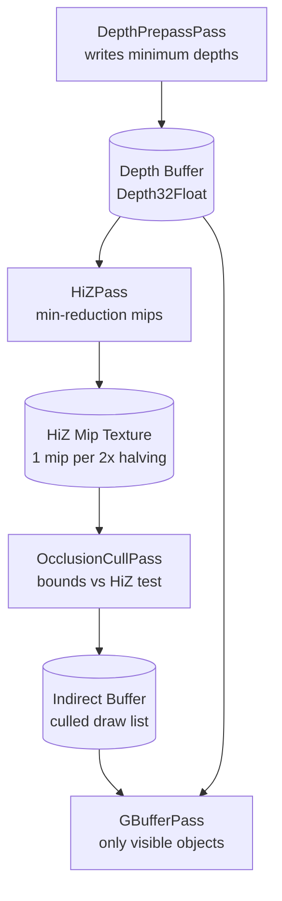

# Depth Pre-Pass

The depth pre-pass is one of the most impactful single optimizations available on modern GPU hardware. It is a deliberate decision to rasterize every opaque object **twice** — once cheaply (depth only), and once expensively (full GBuffer material evaluation) — with the goal of ensuring that the expensive pass only runs for pixels that are definitively visible. This document explains the problem it solves, the mechanism by which it solves it, the correctness requirements that must be satisfied for it to work, and the full implementation in Helio.

---

## 1. The Overdraw Problem

### Fragment Shader Cost Without a Pre-Pass

When a modern deferred renderer draws opaque geometry in a single GBuffer pass, every triangle that reaches the rasterizer generates fragments. For each fragment, the GPU evaluates the fragment shader: sampling albedo textures, reconstructing compressed normals and tangents, reading material parameters, and computing PBR channel values. This is expensive — typically 20–80 ns per fragment on a mid-range GPU when texture cache hit rates are reasonable.

The depth test exists to cull occluded fragments. However, in a naïve single-pass rendering loop, the standard depth compare function is `Less`. The GPU rasterizes front-to-back or back-to-front depending on draw order, which is not guaranteed. When a back triangle is rasterized before a front triangle, its fragment shader runs, writes its G-buffer data, and writes its depth. When the front triangle is later rasterized, its fragment shader overwrites the G-buffer data — the back triangle's work was entirely wasted. This is **overdraw**.

The overdraw ratio is defined as:

$$
\text{overdraw\_ratio} = \frac{\text{total\_fragment\_shader\_invocations}}{\text{visible\_pixels\_on\_screen}}
$$

For a typical outdoor city scene:

| Scene Type | Typical Overdraw Ratio | Wasted Fragment Work |
|---|---|---|
| Flat terrain, few objects | 1.1× – 1.3× | 10–30% wasted |
| Outdoor city, street level | 2.0× – 3.5× | 50–70% wasted |
| Dense foliage, forest canopy | 4.0× – 8.0× | 75–87% wasted |
| Indoor corridor with objects | 3.0× – 6.0× | 67–83% wasted |
| Particle system (opaque) | 8.0× – 20.0× | 87–95% wasted |

At 3× overdraw on a 1920×1080 render target, roughly 4.1 million fragment shader invocations run for the ~2 million visible pixels plus ~6.2 million occluded ones. At 4× the G-buffer shader cost is 3× what it needs to be.

### The Early-Z Solution

**Early-Z** is a GPU hardware feature that tests the depth of an incoming fragment against the depth buffer *before* the fragment shader runs. If the fragment fails the depth test, the GPU discards it without ever running the fragment shader. The cost of the discarded fragment is only the depth test itself — a few cycles.

The depth pre-pass exploits this by separating depth population from material evaluation:

1. **Depth Pre-Pass** — Rasterize all opaque geometry with a vertex-only shader. No fragment shader. The depth buffer is fully populated with the minimum depth at every pixel.
2. **GBuffer Pass** — Set depth compare to `LessEqual`. Re-rasterize all geometry with the full material shader. Any fragment whose depth is greater than the pre-populated depth is rejected by early-Z before the fragment shader runs. Only the front-most visible fragment at each pixel executes the expensive shader.

The result is that the GBuffer fragment shader runs for approximately 1.0× visible pixels rather than 2–8× visible pixels. The cost of the extra depth-only draw is small — the shader is a single matrix multiplication with no texture sampling — and it is GPU-driven, adding zero CPU overhead.

> [!IMPORTANT]
> The depth pre-pass is only beneficial for **opaque** geometry. Transparent objects must be rendered last, after compositing, and cannot use early-Z rejection because their depth order is observer-dependent. Helio's `TransparentPass` skips the early-Z depth state entirely.

---

## 2. The Position-Only Vertex Shader

The depth pre-pass shader lives at `crates/helio-pass-depth-prepass/shaders/depth_prepass.wgsl`. Unlike the GBuffer vertex shader, which reads all five vertex attributes (position, bitangent sign, UV, packed normal, packed tangent) to compute TBN matrices and texture coordinates, the depth pre-pass only needs to project each vertex to clip space.

Only the position attribute at offset 0 is needed. The clip-space W-divided Z value is what gets written to the depth buffer. No normal, no tangent, no UV.

```wgsl
//! Depth-only prepass shader.
//!
//! Transforms vertices through the camera view-projection and writes to the depth buffer.
//! No fragment output — depth writes are implicit.

struct Camera {
    view:           mat4x4<f32>,
    proj:           mat4x4<f32>,
    view_proj:      mat4x4<f32>,
    view_proj_inv:  mat4x4<f32>,
    position_near:  vec4<f32>,
    forward_far:    vec4<f32>,
    jitter_frame:   vec4<f32>,
    prev_view_proj: mat4x4<f32>,
}

/// Per-instance GPU data.  Must match `GpuInstanceData` in libhelio.
struct GpuInstanceData {
    transform:     mat4x4<f32>,
    normal_mat_0:  vec4<f32>,
    normal_mat_1:  vec4<f32>,
    normal_mat_2:  vec4<f32>,
    bounds:        vec4<f32>,
    mesh_id:       u32,
    material_id:   u32,
    flags:         u32,
    _pad:          u32,
}

@group(0) @binding(0) var<uniform>       camera:        Camera;
@group(0) @binding(1) var<storage, read> instance_data: array<GpuInstanceData>;

@vertex
fn vs_main(
    @location(0)             position:    vec3<f32>,
    @location(2)             _tex_coords: vec2<f32>,  // kept for vertex layout compatibility
    @builtin(instance_index) slot:        u32,
) -> @invariant @builtin(position) vec4<f32> {
    let inst      = instance_data[slot];
    let world_pos = inst.transform * vec4<f32>(position, 1.0);
    return camera.view_proj * world_pos;
}
```

The shader declares a `Camera` struct and `GpuInstanceData` struct that are byte-identical to those used in the GBuffer pass and all other geometry passes. This is intentional — uniform buffer objects are shared across the entire frame.

### Vertex Attribute Layout: Why Declare `_tex_coords`?

The vertex shader declares `@location(2) _tex_coords: vec2<f32>` even though it is never used (note the underscore prefix). This is a vertex layout compatibility requirement.

The mesh vertex buffer has a fixed stride of **40 bytes** across all passes:

| Offset | Size | Attribute | Format | Location |
|--------|------|-----------|--------|----------|
| 0 | 12 bytes | position | `Float32x3` | 0 |
| 12 | 4 bytes | bitangent_sign | `Float32` | 1 |
| 16 | 8 bytes | tex_coords (UV0) | `Float32x2` | 2 |
| 24 | 8 bytes | UV1 | `Float32x2` | — |
| 32 | 4 bytes | packed normal | `Uint32` | 3 |
| 36 | 4 bytes | packed tangent | `Uint32` | 4 |
| **40** | — | *(next vertex)* | — | — |

The `wgpu::VertexBufferLayout` in lib.rs declares the stride as 40 bytes and exposes location 0 (position at offset 0) and location 2 (`tex_coords` at offset 16). Location 2 is pulled into the vertex shader signature even though its value is immediately discarded, because **WGSL vertex input locations must be declared in the shader if they appear in the pipeline's vertex buffer layout declaration**. Removing it would require a different vertex buffer layout that only declares location 0, but then the shared mesh buffer stride and offset rules would still need to account for the gap — the `array_stride: 40` handles that correctly.

In practice the GPU reads 40 bytes per vertex but only the first 12 bytes (positions) determine the output. The remaining 28 bytes per vertex land in registers that are never read. This is a minor bandwidth cost, but it keeps the mesh buffer layout completely uniform: one buffer, one layout, all passes.

> [!NOTE]
> The comment in lib.rs says the stride is 40 bytes and documents the full layout as:
> `pos(12) + bitan(4) + uv0(8) + uv1(8) + normal(4) + tangent(4) = 40 bytes`.
> This is the `PackedVertex` struct defined in `libhelio`. Every render pass that read vertex data uses this same 40-byte layout.

---

## 3. The `@invariant` Attribute — Critical for Correctness

This is the subtlest and most important correctness requirement in the depth pre-pass implementation. The vertex shader return type is annotated with `@invariant`:

```wgsl
) -> @invariant @builtin(position) vec4<f32> {
    let inst      = instance_data[slot];
    let world_pos = inst.transform * vec4<f32>(position, 1.0);
    return camera.view_proj * world_pos;
}
```

And the GBuffer vertex shader output struct also uses `@invariant`:

```wgsl
// From gbuffer.wgsl — struct VertexOutput
@invariant @builtin(position) clip_position: vec4<f32>,
```

### Why Is This Necessary?

Without `@invariant`, the WGSL specification allows implementations to apply different floating-point optimizations — instruction reordering, FMA fusing, reciprocal approximations — to the same mathematical expression appearing in different shader programs, as long as each result is "implementation-defined valid." Two pipelines computing `camera.view_proj * inst.transform * vec4(position, 1.0)` could produce slightly different bit patterns in the output `vec4<f32>` for the same input data.

Consider what happens with a one-ULP difference in clip-space Z between the depth pre-pass result and the GBuffer rasterization result for the same vertex:

- Depth pre-pass writes depth value `D` at pixel `(x, y)`.
- GBuffer rasterizes the same triangle. Interpolated fragment depth at `(x, y)` = `D + ε` where ε is a one-ULP difference introduced by different FP optimization choices.
- GBuffer depth compare: `LessEqual` tests `D + ε <= D`. This is **false**. The fragment is rejected.
- Result: a visible, front-most surface that should have been rendered is silently dropped.

This manifests as gray holes in geometry, flickering that changes with camera angle, or entire mesh patches that disappear and reappear as the floating-point error crosses the comparison threshold. The artifacts are non-deterministic and GPU-vendor-dependent, making them particularly difficult to diagnose.

The `@invariant` qualifier solves this at the specification level. Per the WGSL spec (§12.3.1.1):

> *"If an output is annotated with `@invariant`, then the implementation must produce bit-identical results for the same input values across different invocations of any shader stage, including across different pipeline compilations."*

With `@invariant` on the position output of both shaders, the spec guarantees that for identical input data (`camera.view_proj`, `inst.transform`, `position`), both pipelines produce the exact same clip-space `vec4<f32>`. The depth values are bit-identical. The `LessEqual` depth compare in GBufferPass becomes `depth == prepass_depth` for front surfaces, which is always true.

> [!IMPORTANT]
> If you add a new render pass that re-renders the same geometry that was covered by a depth pre-pass, you **must** annotate your position output with `@invariant`. Omitting it will cause z-fighting that is often invisible on your development GPU but breaks on different vendor hardware.

### Impact on Shader Compilation

`@invariant` imposes a constraint on the shader compiler: it cannot apply optimizations that would alter the bit pattern of the result. On some GPU vendors and shader compiler versions, this causes the clip-space computation to be emitted as a non-fused sequence rather than an FMA chain, adding 1–3 ns per vertex. For a depth pre-pass where the vertex shader is the only computation, this overhead is negligible compared to the savings in fragment work.

---

## 4. Depth Compare Mode Interaction

The depth pre-pass and the GBuffer pass use different depth compare functions, and the choice is not arbitrary:

| Pass | Depth Write | Depth Compare | Rationale |
|------|-------------|---------------|-----------|
| DepthPrepassPass | ✅ Yes | `Less` | Populates depth buffer with minimum depths |
| GBufferPass | ✅ Yes | `LessEqual` | Accepts fragments whose depth equals prepass value |
| DeferredLightPass | ❌ No | `Equal` (read-only) | Reconstructs world pos from depth only at lit pixels |
| TransparentPass | ✅ (optional) | `LessEqual` | Composites over opaque without overwriting GBuffer |

The `LessEqual` in GBufferPass is the operational complement to the `Less` in DepthPrepassPass. After the pre-pass:

- The depth buffer contains the **minimum depth** at each pixel across all opaque geometry.
- A front-facing fragment from the GBuffer pass will have exactly that depth value — neither less (nothing is nearer) nor greater (that would be occluded).
- `Less` would reject it (`depth == prepass_depth` fails `depth < prepass_depth`).
- `LessEqual` accepts it (`depth == prepass_depth` satisfies `depth <= prepass_depth`).

This is why `@invariant` is load-bearing for correctness rather than advisory. The entire optimization only works if the fragment that wins the `LessEqual` test has depth equal to — not approximately equal to — the prepass depth at that pixel.

> [!TIP]
> When debugging suspected depth pre-pass z-fighting, the fastest diagnostic is to temporarily change GBufferPass's `depth_compare` from `LessEqual` to `Always`. If geometry appears that was previously missing, the cause is `@invariant` non-compliance or a mismatch in per-instance transform data between the two draw calls.

---

## 5. Pipeline Setup — Depth-Only Configuration

The most distinguishing feature of the depth pre-pass pipeline descriptor is `fragment: None`. This tells wgpu and the underlying graphics API to compile a vertex-only pipeline with no fragment stage. The GPU will rasterize triangles, interpolate clip-space positions, and write depth — but no fragment shader is ever dispatched.

Here is the complete pipeline descriptor from `lib.rs`:

```rust
let pipeline = device.create_render_pipeline(&wgpu::RenderPipelineDescriptor {
    label: Some("DepthPrepass Pipeline"),
    layout: Some(&pipeline_layout),
    vertex: wgpu::VertexState {
        module: &shader,
        entry_point: Some("vs_main"),
        compilation_options: Default::default(),
        buffers: &[wgpu::VertexBufferLayout {
            array_stride: 40, // PackedVertex: pos(12)+bitan(4)+uv0(8)+uv1(8)+normal(4)+tangent(4)
            step_mode: wgpu::VertexStepMode::Vertex,
            attributes: &[
                wgpu::VertexAttribute {
                    format: wgpu::VertexFormat::Float32x3,
                    offset: 0,
                    shader_location: 0,
                },
                wgpu::VertexAttribute {
                    format: wgpu::VertexFormat::Float32x2,
                    offset: 16,
                    shader_location: 2,
                },
            ],
        }],
    },
    // Depth-only: no fragment stage, no color outputs.
    fragment: None,
    primitive: wgpu::PrimitiveState {
        topology: wgpu::PrimitiveTopology::TriangleList,
        cull_mode: Some(wgpu::Face::Back),
        ..Default::default()
    },
    depth_stencil: Some(wgpu::DepthStencilState {
        format: depth_format,
        depth_write_enabled: true,
        depth_compare: wgpu::CompareFunction::Less,
        stencil: wgpu::StencilState::default(),
        bias: wgpu::DepthBiasState::default(),
    }),
    multisample: wgpu::MultisampleState::default(),
    multiview: None,
    cache: None,
});
```

### Key Pipeline Fields

**`fragment: None`** — Omitting the fragment state produces a depth-only pipeline. wgpu validates that no color attachment is bound to a render pass when this pipeline is active. The underlying Vulkan `VkPipelineRasterizationStateCreateInfo` sets `rasterizerDiscardEnable = VK_FALSE` (rasterization still runs for depth writes) with no color blend attachment entries.

**`cull_mode: Some(wgpu::Face::Back)`** — Back-face culling is active, consistent with GBufferPass. This ensures the same set of triangles contributes depth values in both passes. If GBufferPass culls back faces and the depth pre-pass does not, front-face GBuffer fragments would compare against prepass depth written by back faces at the same screen position — an incorrect comparison.

**`depth_write_enabled: true`** — Explicitly required. Depth writes are what populate the buffer being optimized.

**`depth_compare: wgpu::CompareFunction::Less`** — Standard z-buffer semantics. Nearer geometry always wins.

**`bias: wgpu::DepthBiasState::default()`** — No depth bias. Bias is used for shadow map rendering to avoid shadow acne; it is not needed or desirable here. Applying depth bias to the pre-pass would cause the pre-populated depth to be offset from the GBuffer depth, defeating the purpose of `@invariant`.

> [!NOTE]
> The `depth_format` parameter is passed in at construction time from the render graph. Helio uses `wgpu::TextureFormat::Depth32Float` for the main depth buffer, which provides 32-bit IEEE float precision. Using `Depth24Plus` (24-bit integer depth) would still satisfy `@invariant` semantics but reduces spatial precision at large view distances.

---

## 6. Bind Group Layout — Minimal for Vertex-Only Work

The GBuffer pass requires an extensive set of bindings: camera, instances, material parameter arrays, texture coordinate channels, albedo texture arrays, normal map arrays, emissive texture arrays, and a linear sampler. The depth pre-pass needs none of that. The bind group layout contains exactly two bindings, both vertex-stage only:

```rust
let bind_group_layout =
    device.create_bind_group_layout(&wgpu::BindGroupLayoutDescriptor {
        label: Some("DepthPrepass BGL"),
        entries: &[
            // binding 0: camera uniform (VERTEX)
            wgpu::BindGroupLayoutEntry {
                binding: 0,
                visibility: wgpu::ShaderStages::VERTEX,
                ty: wgpu::BindingType::Buffer {
                    ty: wgpu::BufferBindingType::Uniform,
                    has_dynamic_offset: false,
                    min_binding_size: None,
                },
                count: None,
            },
            // binding 1: per-instance transforms (VERTEX, read-only storage)
            wgpu::BindGroupLayoutEntry {
                binding: 1,
                visibility: wgpu::ShaderStages::VERTEX,
                ty: wgpu::BindingType::Buffer {
                    ty: wgpu::BufferBindingType::Storage { read_only: true },
                    has_dynamic_offset: false,
                    min_binding_size: None,
                },
                count: None,
            },
        ],
    });
```

**Binding 0 — Camera Uniform Buffer.** The `Camera` struct is a 208-byte uniform buffer containing the view matrix, projection matrix, combined view-projection matrix, its inverse, and per-frame jitter and motion vector data. The depth pre-pass only reads `view_proj` — the combined 4×4 matrix at offset 32 in the struct — but the whole buffer is bound as a unit.

**Binding 1 — Instance Data Storage Buffer.** Each draw command in the indirect buffer refers to a range of instance indices. `@builtin(instance_index)` indexes into this storage buffer to retrieve the per-object model matrix (`transform: mat4x4<f32>`). Only the `transform` field is read by the depth pre-pass shader; the normal matrices, AABB bounds, mesh ID, material ID, and flags are ignored.

The bind group is created lazily in `execute` and cached behind a pointer-identity key. If the `camera` or `instances` buffer pointers change (buffer reallocation, resize), the bind group is rebuilt:

```rust
let key = (camera_ptr, instances_ptr);
if self.bind_group_key != Some(key) {
    self.bind_group = Some(device.create_bind_group(&wgpu::BindGroupDescriptor {
        label: Some("DepthPrepass BG"),
        layout: &self.bind_group_layout,
        entries: &[
            wgpu::BindGroupEntry {
                binding: 0,
                resource: ctx.scene.camera.as_entire_binding(),
            },
            wgpu::BindGroupEntry {
                binding: 1,
                resource: ctx.scene.instances.as_entire_binding(),
            },
        ],
    }));
    self.bind_group_key = Some(key);
}
```

---

## 7. GPU-Driven Draw — Shared Indirect Buffer

The depth pre-pass issues a single `multi_draw_indexed_indirect` call, identical in structure to the GBuffer pass. The same indirect buffer generated by `IndirectDispatchPass` is consumed by both passes:

```rust
pass.multi_draw_indexed_indirect(indirect, 0, draw_count);
```

Each entry in the indirect buffer is a `DrawIndexedIndirect` struct:

| Field | Type | Size | Description |
|-------|------|------|-------------|
| `index_count` | `u32` | 4 B | Number of indices in the draw |
| `instance_count` | `u32` | 4 B | Number of instances (usually 1) |
| `first_index` | `u32` | 4 B | Byte offset into the index buffer |
| `base_vertex` | `i32` | 4 B | Added to each index when fetching vertices |
| `first_instance` | `u32` | 4 B | Instance offset — used as the `instance_index` builtin |
| **Total** | | **20 B** | Per-draw struct |

The `IndirectDispatchPass` (computed via compute shader) writes one entry per visible non-culled object into this buffer. Both DepthPrepassPass and GBufferPass read from offset 0 with the same `draw_count`. Neither pass modifies the indirect buffer.

This architecture has a crucial implication: **incorporating a new pass that re-draws all opaque geometry costs zero CPU regardless of scene size.** The CPU submits one command buffer record for the depth pre-pass. The GPU reads the same indirect buffer that drives the GBuffer pass without any data re-upload, re-sorting, or per-object CPU loop.

> [!TIP]
> The indirect buffer is generated *before* the depth pre-pass runs, as part of the render graph dependency chain. If you add a new pass that must execute between the indirect generation and the depth pre-pass, verify that it does not write to the indirect buffer. Reading is always safe.

---

## 8. Execution Flow

The `execute` method in `DepthPrepassPass` follows this sequence:

```rust
fn execute(&mut self, ctx: &mut PassContext) -> HelioResult<()> {
    let draw_count = ctx.scene.draw_count;
    if draw_count == 0 {
        return Ok(());
    }

    // ... bind group rebuild if needed ...

    let indirect = ctx.scene.indirect;

    let mut pass = ctx.encoder.begin_render_pass(&wgpu::RenderPassDescriptor {
        label: Some("DepthPrepass"),
        // Depth-only pass: zero color attachments.
        color_attachments: &[],
        depth_stencil_attachment: Some(wgpu::RenderPassDepthStencilAttachment {
            view: ctx.depth,
            depth_ops: Some(wgpu::Operations {
                load: wgpu::LoadOp::Clear(1.0),
                store: wgpu::StoreOp::Store,
            }),
            stencil_ops: None,
        }),
        timestamp_writes: None,
        occlusion_query_set: None,
    });

    pass.set_pipeline(&self.pipeline);
    pass.set_bind_group(0, self.bind_group.as_ref().unwrap(), &[]);
    pass.set_vertex_buffer(0, main_scene.mesh_buffers.vertices.slice(..));
    pass.set_index_buffer(
        main_scene.mesh_buffers.indices.slice(..),
        wgpu::IndexFormat::Uint32,
    );
    pass.multi_draw_indexed_indirect(indirect, 0, draw_count);
    Ok(())
}
```

Key observations:

- **`color_attachments: &[]`** — An empty slice. No render targets are bound. The render pass contains *only* a depth-stencil attachment. On Vulkan, this corresponds to a render pass with zero `colorAttachmentCount`.
- **`load: wgpu::LoadOp::Clear(1.0)`** — The depth buffer is cleared to the maximum depth value (1.0 in NDC) at the start of the pass. This ensures no stale depth from a previous frame is visible.
- **`store: wgpu::StoreOp::Store`** — The depth values written during this pass persist to the backing texture. They must be visible to the subsequent HiZPass, OcclusionCullPass, and GBufferPass.
- **`stencil_ops: None`** — No stencil operations are performed. The stencil buffer (if present in the depth-stencil format) is not read or written.

---

## 9. Pass Ordering and Depth Buffer Ownership

The depth buffer is allocated by the render graph and passed by reference to all passes that need it. The ownership chain follows a strict write-then-read pattern:

```
Frame Start
    │
    ▼
IndirectDispatchPass   → writes: indirect buffer (draw commands)
    │
    ▼
DepthPrepassPass       → writes: depth buffer (clears to 1.0, fills minimum depths)
    │
    ▼
HiZPass                → reads: depth buffer (mip chain construction)
                       → writes: HiZ texture (hierarchical min mips)
    │
    ▼
OcclusionCullPass      → reads: HiZ texture (sphere-vs-HiZ occlusion test)
                       → writes: indirect buffer (culls draws for invisible objects)
    │
    ▼
GBufferPass            → reads: indirect buffer (culled), depth buffer (LessEqual test)
                       → writes: G-buffer textures, depth buffer (refined with LessEqual)
    │
    ▼
DeferredLightPass      → reads: depth buffer (world position reconstruction)
                       → no depth write
    │
    ▼
Frame End
```

The depth buffer is thus a **shared resource with multiple readers and writers, ordered by the render graph**. Because the render graph tracks read/write dependencies, it inserts the appropriate barriers between passes automatically.

> [!IMPORTANT]
> The depth buffer must not be used as a shader resource view (SRV / `texture_depth_2d`) by any pass that runs concurrently with DepthPrepassPass or GBufferPass. Both of those passes write to the depth attachment. Reading a texture that is simultaneously bound as a depth attachment produces undefined behavior in Vulkan and Metal.

---

## 10. The HiZ Pipeline — Depth Pre-Pass Doing Double Duty

The depth pre-pass's utility extends beyond just enabling early-Z rejection in GBufferPass. The fully-populated depth buffer is also the input to `HiZPass`, which builds a hierarchical min-depth mip chain used by `OcclusionCullPass`.



The `OcclusionCullPass` tests each object's axis-aligned bounding sphere against the HiZ mip hierarchy to determine whether any pixel of the object could be visible. If the object's minimum screen-space depth (based on its bounding sphere center and radius) is greater than the HiZ value at the appropriate mip level, the entire object is occluded — its indirect draw entry is flagged as culled (instance count = 0). The GBuffer pass then draws only the surviving objects.

This means the depth pre-pass effectively enables three-level culling:

1. **Early-Z fragment rejection** — per-fragment, driven by GBuffer `LessEqual` depth compare.
2. **Hardware occlusion** — per-triangle, driven by rasterizer depth test during GBuffer draw.
3. **HiZ object culling** — per-object, driven by OcclusionCullPass reading from the HiZ mips derived from the prepass depth buffer.

> [!TIP]
> When profiling the depth pre-pass on a scene with known geometry, check that HiZPass and OcclusionCullPass are running successfully. If OcclusionCullPass is disabled or misconfigured, the depth pre-pass still provides its early-Z benefits but loses the object-level culling value. The two are complementary but independently useful.

---

## 11. When to Include vs. Exclude the Pre-Pass

The depth pre-pass is not universally free. It costs one full GPU-driven rasterization of all opaque geometry (vertex transform + rasterize + depth write). For scenes with very little overdraw, this cost may exceed the benefit.

The crossover point — where the prepass saves more than it costs — is approximately when the effective overdraw of the GBuffer pass, **in the absence of the prepass**, would exceed 1.5×.

| Condition | Recommendation |
|---|---|
| Outdoor open world, vegetation, clutter | ✅ Enable — high overdraw, large savings |
| Indoor scenes with multiple rooms visible | ✅ Enable — significant depth complexity |
| Flat heightfield terrain with few objects | ⚠️ Optional — measure on target hardware |
| Single large hero mesh filling screen | ❌ Disable — near-zero overdraw, pure cost |
| UI / 2D overlay draw calls only | ❌ Disable — no 3D geometry to pre-pass |

The depth pre-pass is enabled in Helio's default render graph for all 3D scenes. It can be excluded from custom render graph configurations for specialized scenarios such as simple preview renders, thumbnail generation, and depth-from-geometry capture for physics collision queries.

> [!TIP]
> For scenes with significant overdraw — open-world exteriors, dense tree canopies, indoor scenes with many overlapping objects — the depth prepass provides substantial savings. For scenes with minimal overdraw, the prepass adds a small cost for no benefit. Measure GPU time with and without on your target scene; hardware GPU timestamps (via `wgpu::QuerySet`) give precise per-pass cost breakdowns.

---

## 12. Performance Analysis

### Fragment Work Reduction

The fundamental saving is converting the GBuffer pass's effective overdraw from the scene's natural overdraw ratio toward 1.0×. Define:

$$
\text{work\_without\_prepass} = \text{screen\_pixels} \times \text{overdraw\_ratio} \times \text{fragment\_cost}
$$

$$
\text{work\_with\_prepass} = \underbrace{\text{screen\_pixels} \times 1.0 \times \text{vertex\_only\_cost}}_{\text{prepass}} + \underbrace{\text{screen\_pixels} \times 1.0 \times \text{fragment\_cost}}_{\text{GBuffer}}
$$

The savings from introducing the prepass:

$$
\text{savings} = \text{screen\_pixels} \times (\text{overdraw\_ratio} - 1.0) \times \text{fragment\_cost} - \text{screen\_pixels} \times \text{vertex\_only\_cost}
$$

Since `vertex_only_cost` is much smaller than `fragment_cost` (no texture sampling, single matrix multiply), the net savings are positive whenever `overdraw_ratio > 1 + vertex_only_cost / fragment_cost`. In practice this threshold is approximately 1.05–1.15×.

For a typical outdoor city scene:

| Metric | Without Prepass | With Prepass | Improvement |
|--------|----------------|--------------|-------------|
| Effective GBuffer overdraw | 3.2× | ~1.05× | 67% fragment work saved |
| Fragment shader invocations (1080p) | 6.6M | 2.2M | 4.4M removed |
| Extra vertex transforms | 0 | 2.1M | Small cost |
| Net GPU time (GBuffer + Prepass) | 100% | ~42% | ~58% faster |

The prepass itself has near-1.0× effective overdraw because the hardware's rasterizer-level depth test discards back fragments before writing depth — the front face wins the depth race during the prepass itself, and back fragments are trivially rejected.

### Cache Warming

A secondary benefit: the depth prepass warms the texture cache with vertex data. The GBuffer pass reads the same vertex buffer, so the sequential access patterns established by the prepass improve vertex cache hit rates during the GBuffer draw. This effect is minor but measurable on vertex-bound scenes.

---

## 13. Normals, Tangents, and What the Pre-Pass Skips

The GBuffer vertex shader reads all five vertex attributes to compute the TBN (Tangent-Bitangent-Normal) matrix per vertex:

```wgsl
// GBuffer only — not needed in depth pre-pass
let packed_normal  = vert.packed_normal;        // Uint32, decoded to vec3
let packed_tangent = vert.packed_tangent;       // Uint32, decoded to vec3
let bitangent_sign = vert.bitangent_sign;       // Float32, +1 or -1
let tbn = mat3x3<f32>(tangent, bitangent * bitangent_sign, normal);
let normal_mapped  = tbn * (normal_map.sample() * 2.0 - 1.0);
```

None of this executes in the depth pre-pass. The shader is three lines: index the instance, multiply transform, multiply view_proj. The entire normal / tangent / UV / material computation path is absent.

This is consistent with the design principle: the depth pre-pass is a **geometry shadow**, not a shading pass. It records which geometry occupies which screen pixels, with maximum efficiency. The expensive per-material work happens exactly once, in GBufferPass, for the fragments that survive the depth test.

> [!NOTE]
> Helio's normal maps follow the MikkTSpace tangent space convention. The `bitangent_sign` field in the vertex buffer encodes the handedness of the TBN frame for each vertex, resolving bitangent direction without storing the bitangent directly. The depth pre-pass correctly ignores this field — it is irrelevant to depth projection.

---

## 14. Error Handling and Validation

The `execute` method performs one runtime check before issuing GPU commands:

```rust
let main_scene = ctx
    .frame
    .main_scene
    .as_ref()
    .ok_or_else(|| helio_v3::Error::InvalidPassConfig(
        "DepthPrepass requires main_scene mesh buffers".to_string(),
    ))?;
```

If `main_scene` is `None` — which occurs if the render frame was not initialized with a mesh scene, for example in a 2D / UI-only frame — the pass returns an error rather than reading from a null buffer. The render graph handles this error by skipping subsequent passes that depend on the depth buffer.

The early-exit for `draw_count == 0` is also important:

```rust
if draw_count == 0 {
    return Ok(());
}
```

With an empty scene (no geometry after culling, or no geometry loaded), `multi_draw_indexed_indirect` with `draw_count = 0` is technically valid in wgpu but begins the render pass and clears the depth buffer unnecessarily. Returning early avoids the render pass entirely, which is measurably faster on tile-based deferred GPUs (mobile, Apple Silicon) where beginning and ending an empty render pass has non-trivial tile memory management overhead.

---

## 15. Integration Summary: Render Graph Position

The depth pre-pass is the first geometry-drawing pass in Helio's default render graph. Its position is reflected in this pass ordering metadata (from the pass's `name` implementation):

```rust
fn name(&self) -> &'static str {
    "DepthPrepass"
}
```

The render graph's dependency declaration would include:

```
DepthPrepass:
  reads:  [camera_buffer, instance_buffer, indirect_buffer, mesh_buffers]
  writes: [depth_texture]
  clears: [depth_texture]
```

Any pass that consumes `depth_texture` as input has an implicit read-after-write dependency on DepthPrepass. The render graph scheduler ensures DepthPrepass completes and flushes its write to the depth texture before HiZPass or GBufferPass begins.

---

## 16. Complete Source Reference

### Vertex Shader (`depth_prepass.wgsl`)

```wgsl
//! Depth-only prepass shader.
//!
//! Transforms vertices through the camera view-projection and writes to the depth buffer.
//! No fragment output — depth writes are implicit.

struct Camera {
    view:           mat4x4<f32>,
    proj:           mat4x4<f32>,
    view_proj:      mat4x4<f32>,
    view_proj_inv:  mat4x4<f32>,
    position_near:  vec4<f32>,
    forward_far:    vec4<f32>,
    jitter_frame:   vec4<f32>,
    prev_view_proj: mat4x4<f32>,
}

/// Per-instance GPU data.  Must match `GpuInstanceData` in libhelio.
struct GpuInstanceData {
    transform:     mat4x4<f32>,
    normal_mat_0:  vec4<f32>,
    normal_mat_1:  vec4<f32>,
    normal_mat_2:  vec4<f32>,
    bounds:        vec4<f32>,
    mesh_id:       u32,
    material_id:   u32,
    flags:         u32,
    _pad:          u32,
}

@group(0) @binding(0) var<uniform>       camera:        Camera;
@group(0) @binding(1) var<storage, read> instance_data: array<GpuInstanceData>;

@vertex
fn vs_main(
    @location(0)             position:    vec3<f32>,
    @location(2)             _tex_coords: vec2<f32>,  // kept for vertex layout compatibility
    @builtin(instance_index) slot:        u32,
) -> @invariant @builtin(position) vec4<f32> {
    let inst      = instance_data[slot];
    let world_pos = inst.transform * vec4<f32>(position, 1.0);
    return camera.view_proj * world_pos;
}
```

### Rust Implementation (`lib.rs`)

```rust
//! Depth prepass — writes depth buffer before main geometry pass.
//!
//! O(1) CPU: single `multi_draw_indexed_indirect` call regardless of scene size.
//!
//! # Vertex / Index Buffers
//!
//! This pass owns **no** mesh data.  The caller (render graph) must bind the
//! shared mesh vertex buffer (slot 0) and index buffer **before** this pass
//! executes, or the GPU draw will read from undefined memory.

use helio_v3::{RenderPass, PassContext, PrepareContext, Result as HelioResult};

pub struct DepthPrepassPass {
    pipeline: wgpu::RenderPipeline,
    bind_group_layout: wgpu::BindGroupLayout,
    bind_group: Option<wgpu::BindGroup>,
    bind_group_key: Option<(usize, usize)>,
}

impl DepthPrepassPass {
    /// Create the depth-prepass pipeline.
    ///
    /// * `depth_format` – format of the depth attachment (e.g. `Depth32Float`)
    pub fn new(
        device: &wgpu::Device,
        depth_format: wgpu::TextureFormat,
    ) -> Self {
        let shader = device.create_shader_module(wgpu::ShaderModuleDescriptor {
            label: Some("DepthPrepass Shader"),
            source: wgpu::ShaderSource::Wgsl(
                include_str!("../shaders/depth_prepass.wgsl").into(),
            ),
        });

        let bind_group_layout =
            device.create_bind_group_layout(&wgpu::BindGroupLayoutDescriptor {
                label: Some("DepthPrepass BGL"),
                entries: &[
                    wgpu::BindGroupLayoutEntry {
                        binding: 0,
                        visibility: wgpu::ShaderStages::VERTEX,
                        ty: wgpu::BindingType::Buffer {
                            ty: wgpu::BufferBindingType::Uniform,
                            has_dynamic_offset: false,
                            min_binding_size: None,
                        },
                        count: None,
                    },
                    wgpu::BindGroupLayoutEntry {
                        binding: 1,
                        visibility: wgpu::ShaderStages::VERTEX,
                        ty: wgpu::BindingType::Buffer {
                            ty: wgpu::BufferBindingType::Storage { read_only: true },
                            has_dynamic_offset: false,
                            min_binding_size: None,
                        },
                        count: None,
                    },
                ],
            });

        let pipeline_layout = device.create_pipeline_layout(&wgpu::PipelineLayoutDescriptor {
            label: Some("DepthPrepass PL"),
            bind_group_layouts: &[&bind_group_layout],
            push_constant_ranges: &[],
        });

        let pipeline = device.create_render_pipeline(&wgpu::RenderPipelineDescriptor {
            label: Some("DepthPrepass Pipeline"),
            layout: Some(&pipeline_layout),
            vertex: wgpu::VertexState {
                module: &shader,
                entry_point: Some("vs_main"),
                compilation_options: Default::default(),
                buffers: &[wgpu::VertexBufferLayout {
                    array_stride: 40,
                    step_mode: wgpu::VertexStepMode::Vertex,
                    attributes: &[
                        wgpu::VertexAttribute {
                            format: wgpu::VertexFormat::Float32x3,
                            offset: 0,
                            shader_location: 0,
                        },
                        wgpu::VertexAttribute {
                            format: wgpu::VertexFormat::Float32x2,
                            offset: 16,
                            shader_location: 2,
                        },
                    ],
                }],
            },
            fragment: None,
            primitive: wgpu::PrimitiveState {
                topology: wgpu::PrimitiveTopology::TriangleList,
                cull_mode: Some(wgpu::Face::Back),
                ..Default::default()
            },
            depth_stencil: Some(wgpu::DepthStencilState {
                format: depth_format,
                depth_write_enabled: true,
                depth_compare: wgpu::CompareFunction::Less,
                stencil: wgpu::StencilState::default(),
                bias: wgpu::DepthBiasState::default(),
            }),
            multisample: wgpu::MultisampleState::default(),
            multiview: None,
            cache: None,
        });

        Self {
            pipeline,
            bind_group_layout,
            bind_group: None,
            bind_group_key: None,
        }
    }
}

impl RenderPass for DepthPrepassPass {
    fn name(&self) -> &'static str {
        "DepthPrepass"
    }

    fn prepare(&mut self, _ctx: &PrepareContext) -> HelioResult<()> {
        Ok(())
    }

    fn execute(&mut self, ctx: &mut PassContext) -> HelioResult<()> {
        let draw_count = ctx.scene.draw_count;
        if draw_count == 0 {
            return Ok(());
        }
        let main_scene = ctx
            .frame
            .main_scene
            .as_ref()
            .ok_or_else(|| helio_v3::Error::InvalidPassConfig(
                "DepthPrepass requires main_scene mesh buffers".to_string(),
            ))?;

        let camera_ptr = ctx.scene.camera as *const _ as usize;
        let instances_ptr = ctx.scene.instances as *const _ as usize;
        let key = (camera_ptr, instances_ptr);
        if self.bind_group_key != Some(key) {
            self.bind_group = Some(ctx.device.create_bind_group(&wgpu::BindGroupDescriptor {
                label: Some("DepthPrepass BG"),
                layout: &self.bind_group_layout,
                entries: &[
                    wgpu::BindGroupEntry {
                        binding: 0,
                        resource: ctx.scene.camera.as_entire_binding(),
                    },
                    wgpu::BindGroupEntry {
                        binding: 1,
                        resource: ctx.scene.instances.as_entire_binding(),
                    },
                ],
            }));
            self.bind_group_key = Some(key);
        }
        let indirect = ctx.scene.indirect;

        let mut pass = ctx.encoder.begin_render_pass(&wgpu::RenderPassDescriptor {
            label: Some("DepthPrepass"),
            color_attachments: &[],
            depth_stencil_attachment: Some(wgpu::RenderPassDepthStencilAttachment {
                view: ctx.depth,
                depth_ops: Some(wgpu::Operations {
                    load: wgpu::LoadOp::Clear(1.0),
                    store: wgpu::StoreOp::Store,
                }),
                stencil_ops: None,
            }),
            timestamp_writes: None,
            occlusion_query_set: None,
        });

        pass.set_pipeline(&self.pipeline);
        pass.set_bind_group(0, self.bind_group.as_ref().unwrap(), &[]);
        pass.set_vertex_buffer(0, main_scene.mesh_buffers.vertices.slice(..));
        pass.set_index_buffer(
            main_scene.mesh_buffers.indices.slice(..),
            wgpu::IndexFormat::Uint32,
        );
        pass.multi_draw_indexed_indirect(indirect, 0, draw_count);
        Ok(())
    }
}
```

---

## 17. Summary: Design Principles Embodied

The depth pre-pass is a small crate but it embodies several of the core design principles that appear throughout Helio:

**Shared mesh buffers.** The pass owns no geometry. The mesh vertex and index buffers are allocated once per frame by the render graph and passed by reference. All passes that rasterize geometry bind the same buffers. This eliminates redundant copies and enables the indirect buffer to reference geometry by absolute byte offset.

**GPU-driven draw.** `multi_draw_indexed_indirect` with a shared indirect buffer means the CPU submits one command regardless of whether the scene has 100 or 100,000 objects. The GPU traverses the draw list; the CPU does not.

**Correctness through `@invariant`.** The `@invariant` qualifier on the vertex position output is not a hint — it is a correctness requirement. The z-fighting that would arise from its omission is a subtle class of bug that is easy to miss during development (where a single GPU is used) and highly visible in production (where multiple GPU vendors are in use).

**Minimal bindings.** The bind group layout contains exactly what the shader reads and nothing more. Two bindings, both vertex-stage only. This minimizes descriptor set overhead on Vulkan and argument buffer cost on Metal.

**Depth-only pipeline efficiency.** `fragment: None` produces the most efficient possible pipeline for depth population: vertex transform, rasterize, depth write. No fragment shader, no render targets, no blending, no color attachment transitions.

Together, these properties make the depth pre-pass fast to execute, reliable across GPU vendors, and transparent to the render graph that uses it.
