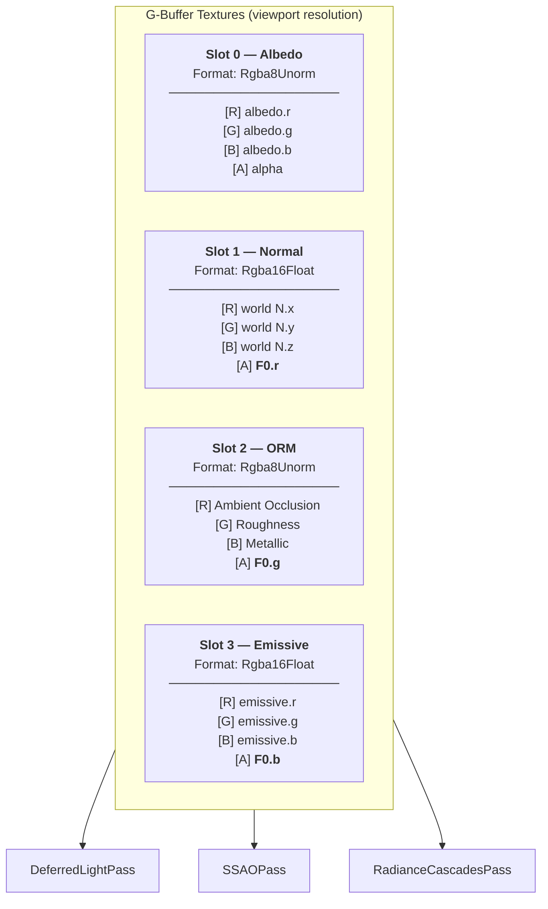
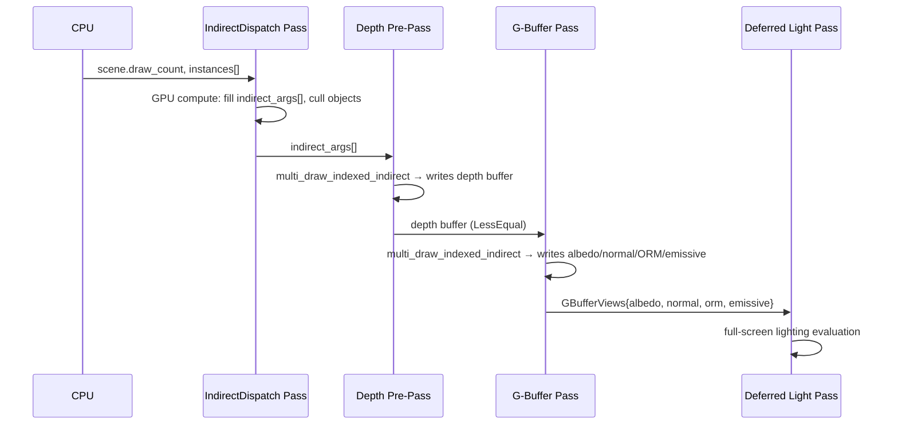

# G-Buffer Pass

The G-Buffer pass is the cornerstone of Helio's deferred rendering pipeline. Its sole responsibility is to transform raw scene geometry into a compact, screen-resolution description of every visible surface — capturing albedo, surface normals, material parameters, and emissive light into four textures that downstream passes read directly, never re-rasterizing geometry again.

Every subsequent lighting computation — direct lighting, ambient occlusion, radiance cascades, screen-space effects — operates on this frozen snapshot of the scene. The G-Buffer pass shifts the cost model: geometry is touched exactly once per frame, and lighting is then a series of full-screen image operations with no vertex processing.

<!-- screenshot: a split view showing raw G-buffer targets (albedo, normal, ORM, emissive) alongside the final composited lit scene -->

---

## 1. Introduction — Deferred Geometry Capture

In a forward renderer, every draw call processes both geometry and lighting together. This means each triangle is rasterized, and its fragment shader resolves all light contributions before writing a single pixel to the framebuffer. In scenes with hundreds of dynamic lights or complex material networks, this rapidly becomes untenable: the fragment shader workload scales as O(geometry × lights).

Helio's deferred approach breaks this coupling. The G-Buffer pass performs a single geometry-only rasterization pass that writes material properties into intermediate textures. The actual lighting evaluation happens in a separate `DeferredLightPass` that runs as a full-screen compute or rasterization pass, reading from the G-Buffer textures. The fragment cost now scales as O(screen pixels × lights) rather than O(geometry × lights), which is far more predictable.

The critical architectural decision beyond deferred vs. forward is **GPU-driven rendering**. Helio does not loop over draw calls on the CPU. Instead, it submits a single `multi_draw_indexed_indirect` draw call. The GPU reads an indirect buffer (written by `IndirectDispatchPass` earlier in the frame) and fans out to every object independently. The CPU cost is O(1) regardless of scene size.

> [!IMPORTANT]
> The G-Buffer pass executes **after** the Depth Pre-Pass. It uses `LoadOp::Load` on depth and `CompareFunction::LessEqual` to re-use the depth values that the pre-pass wrote. Only fragments that exactly match the pre-pass depth will survive — the early-Z hardware kills the rest before fragment shading begins. The result is zero wasted fragment work.

The G-Buffer pass is implemented in `crates/helio-pass-gbuffer/src/lib.rs` and `crates/helio-pass-gbuffer/shaders/gbuffer.wgsl`.

---

## 2. The Four Render Targets

The pass writes to exactly four color attachments every frame, plus the shared depth buffer. All textures are created at the renderer's current viewport resolution and live for the entire frame; downstream passes access them via `GBufferViews` published to `FrameResources`.

| Slot | Field Name   | Format        | Channel Layout                         | Bit Depth / Channel |
|------|--------------|---------------|----------------------------------------|---------------------|
| 0    | `albedo`     | `Rgba8Unorm`  | R=albedo.r, G=albedo.g, B=albedo.b, A=alpha | 8 bits            |
| 1    | `normal`     | `Rgba16Float` | R=N.x, G=N.y, B=N.z, A=**F0.r**      | 16-bit float        |
| 2    | `orm`        | `Rgba8Unorm`  | R=AO, G=roughness, B=metallic, A=**F0.g** | 8 bits          |
| 3    | `emissive`   | `Rgba16Float` | R=emissive.r, G=emissive.g, B=emissive.b, A=**F0.b** | 16-bit float |

### Format Selection Rationale

**`Rgba8Unorm` for albedo and ORM** — Albedo is a base color representing reflectance in the 0–1 range. Eight bits per channel provides 256 steps of precision, which is imperceptibly fine for sRGB imagery. AO, roughness, and metallic are likewise scalar PBR parameters that live in [0, 1] and do not require sub-8-bit precision. Using 8-bit formats halves the memory bandwidth and render target memory compared to 16-bit alternatives.

**`Rgba16Float` for normal and emissive** — World-space normals are unit vectors whose components span [-1, 1]. Eight bits would give a precision of ~0.008 per component, which after the lighting dot-product calculation produces visible banding artifacts, especially on smooth metallic surfaces under directional light. Sixteen-bit floats provide sufficient precision to eliminate banding while keeping memory footprint below that of `Rgba32Float`. Emissive values can exceed 1.0 (HDR bloom sources) and must retain sub-unorm precision; 16-bit float is the natural choice.

### The F0 Packing Trick

PBR lighting requires the specular reflectance at normal incidence, **F0**, as a `vec3` (one value per color channel, needed for colored metallics and colored glass). Storing this directly would require a fifth full-resolution render target — adding 50% more bandwidth to every downstream pass that reads the G-Buffer.

Helio avoids this by observing that the `normal`, `orm`, and `emissive` targets each have an alpha channel that is otherwise wasted:

- `normal.a` stores **F0.r**
- `orm.a` stores **F0.g**
- `emissive.a` stores **F0.b**

This packs the full three-component F0 at no additional memory cost. The only constraint is that downstream passes must reconstruct F0 by reading `.a` from three different textures — a trivial cost.

<!-- screenshot: G-buffer visualization showing (top-left) albedo target, (top-right) packed normal+F0.r target, (bottom-left) ORM+F0.g target, (bottom-right) emissive+F0.b target with false-color alpha channel overlay -->

### G-Buffer Memory Layout Diagram



### Memory Cost

For a 1920×1080 viewport:

| Target   | Format        | Bytes/Pixel | Total        |
|----------|---------------|-------------|--------------|
| albedo   | Rgba8Unorm    | 4           | ~8.3 MB      |
| normal   | Rgba16Float   | 8           | ~16.6 MB     |
| orm      | Rgba8Unorm    | 4           | ~8.3 MB      |
| emissive | Rgba16Float   | 8           | ~16.6 MB     |
| **Total**| —             | **24**      | **~49.8 MB** |

At 4K (3840×2160) the total is ~199 MB, a significant but manageable portion of VRAM. The alternation of 8-bit and 16-bit formats is a deliberate trade-off: using all 16-bit would double the memory cost of albedo and ORM for no perceptible quality gain.

---

## 3. The Vertex Layout — 40-Byte Interleaved Stride

All scene geometry shares a single interleaved vertex buffer. The layout is defined at pipeline creation in `GBufferPass::new()` and must match the binary layout of the mesh data written by the asset importer.

```rust
buffers: &[wgpu::VertexBufferLayout {
    array_stride: 40,
    step_mode: wgpu::VertexStepMode::Vertex,
    attributes: &[
        wgpu::VertexAttribute {
            format: wgpu::VertexFormat::Float32x3,
            offset: 0,
            shader_location: 0,
        },
        wgpu::VertexAttribute {
            format: wgpu::VertexFormat::Float32,
            offset: 12,
            shader_location: 1,
        },
        wgpu::VertexAttribute {
            format: wgpu::VertexFormat::Float32x2,
            offset: 16,
            shader_location: 2,
        },
        // offset 24: tex_coords1 (Float32x2) — skipped, no shader_location,
        //            reserved for secondary UV channel (lightmap, detail textures)
        wgpu::VertexAttribute {
            format: wgpu::VertexFormat::Uint32,
            offset: 32,
            shader_location: 3,
        },
        wgpu::VertexAttribute {
            format: wgpu::VertexFormat::Uint32,
            offset: 36,
            shader_location: 4,
        },
    ],
}],
```

| Component        | Format        | Byte Offset | Shader Location | WGSL Type |
|------------------|---------------|-------------|-----------------|-----------|
| `position`       | `Float32x3`   | 0           | 0               | `vec3<f32>` |
| `bitangent_sign` | `Float32`     | 12          | 1               | `f32`       |
| `tex_coords`     | `Float32x2`   | 16          | 2               | `vec2<f32>` |
| *(tex_coords1)*  | `Float32x2`   | 24          | *(reserved)*    | —           |
| `normal`         | `Uint32`      | 32          | 3               | `u32`       |
| `tangent`        | `Uint32`      | 36          | 4               | `u32`       |

**Total stride: 40 bytes.**

### Packed Normal and Tangent Encoding

Storing normals and tangents as `Float32x3` costs 12 bytes each — 24 bytes total. By packing them as `Uint32` (snorm8x4 encoding), they each consume exactly 4 bytes — a **6× reduction** in per-vertex normal/tangent storage.

The encoding uses WGSL's `unpack4x8snorm`, which interprets a `u32` as four packed signed 8-bit values in the range [-127/127, 1.0]:

```wgsl
fn decode_snorm8x4(packed: u32) -> vec3<f32> {
    return unpack4x8snorm(packed).xyz;
}
```

The fourth component (`.w`) of the unpacked vec4 is discarded — it holds nothing meaningful for normals and tangents, which are 3-component vectors. On the CPU side, the mesh importer calls the equivalent `pack4x8snorm` before uploading.

The precision loss from 32-bit float → snorm8 is approximately ±0.004 per component. For unit vectors this means an angular error of roughly 0.23 degrees, which is imperceptible in normal-mapped PBR lighting at any typical viewing distance.

### The `bitangent_sign` Float

Rather than storing the full bitangent vector (another 12 to 24 bytes), Helio stores only its **handedness** as a single `f32` with value ±1.0. The bitangent is reconstructed in the vertex shader as:

```wgsl
let B = cross(N_geom, T) * input.bitangent_sign;
```

This is the **MikkTSpace convention**, the industry standard tangent space used by Blender, Maya, 3ds Max, Substance Painter, and Marmoset Toolbag. Any normal map baked by one of these tools can be decoded correctly as long as the mesh exporter preserved the bitangent sign.

The ±1.0 value distinguishes **mirrored UVs**: on symmetric meshes (e.g., the left vs. right half of a character face), the UV layout is often mirrored to save texture space. The bitangent direction flips across the mirror seam, and only the sign bit captures this flip. Without it, normal maps would appear "flipped" on one half of the mirror.

> [!NOTE]
> The secondary UV channel (`tex_coords1` at offset 24) is reserved in the vertex buffer layout but not yet bound to a shader location. It will be used in a future update to support lightmap UVs and per-texel detail UV channels. The slot is already paid for in the 40-byte stride, so adding it will not change the vertex buffer format.

---

## 4. GpuInstanceData — 144 Bytes

The vertex shader does not receive per-instance data through instanced vertex attributes. Instead, `@builtin(instance_index)` provides an index into a storage buffer of `GpuInstanceData` structs. This design allows per-instance data to be written by compute shaders (e.g., `IndirectDispatchPass`) without the restrictions imposed on vertex buffer data.

```wgsl
/// Per-instance data (144 bytes). Must match `GpuInstanceData` in libhelio.
struct GpuInstanceData {
    transform:    mat4x4<f32>,  // offset   0  (64 bytes)
    normal_mat_0: vec4<f32>,    // offset  64  — row 0 of inv-transpose 3×3
    normal_mat_1: vec4<f32>,    // offset  80
    normal_mat_2: vec4<f32>,    // offset  96
    bounds:       vec4<f32>,    // offset 112
    mesh_id:      u32,          // offset 128
    material_id:  u32,          // offset 132
    flags:        u32,          // offset 136
    _pad:         u32,          // offset 140
}
```

| Field        | Byte Offset | Size        | Description |
|--------------|-------------|-------------|-------------|
| `transform`  | 0           | 64          | World-space model matrix (column-major `mat4x4<f32>`) |
| `normal_mat_0` | 64        | 16          | Row 0 of the 3×3 inverse-transpose of the model matrix |
| `normal_mat_1` | 80        | 16          | Row 1 of the 3×3 inverse-transpose |
| `normal_mat_2` | 96        | 16          | Row 2 of the 3×3 inverse-transpose |
| `bounds`     | 112         | 16          | World-space bounding sphere: xyz=center, w=radius |
| `mesh_id`    | 128         | 4           | Index into the mesh draw-arguments table |
| `material_id`| 132         | 4           | Index into `materials[]` and `material_textures[]` arrays |
| `flags`      | 136         | 4           | Per-instance feature flags (reserved) |
| `_pad`       | 140         | 4           | Alignment padding to 144 bytes |

**Total: 144 bytes per instance.**

### Why the Normal Matrix is Pre-Computed

Normals are not position vectors — they are **covariant vectors** (covectors) that must transform by the **inverse-transpose** of the model matrix to remain perpendicular to the surface after the model transforms. For a model matrix **M**:

$$
\mathbf{N}_{\text{world}} = \left(\mathbf{M}^{-1}\right)^{\top} \cdot \mathbf{N}_{\text{local}}
$$

Computing this inverse-transpose in the vertex shader would require a full 3×3 matrix inverse, a transpose, and then a matrix-vector multiply — roughly 9–18 FLOP more per vertex. For a scene rendering 1 million vertices at 60 fps, that is 60 million spurious matrix inversions per second.

Instead, the CPU computes the inverse-transpose once when an object is added or moved, stores it as three `vec4<f32>` rows (padding to 16 bytes each for alignment), and the shader simply reads and multiplies:

```wgsl
let normal_mat = mat3x3<f32>(
    inst.normal_mat_0.xyz,
    inst.normal_mat_1.xyz,
    inst.normal_mat_2.xyz,
);
out.world_normal = normalize(normal_mat * decode_snorm8x4(v.normal));
```

### Why Tangents Use the Regular Upper-3×3

Tangents are **covariant vectors** that lie in the surface plane and point in a UV-space direction. Unlike normals, tangents transform by the **regular** (non-inverted, non-transposed) upper-3×3 of the model matrix:

$$
\mathbf{T}_{\text{world}} = \mathbf{M}_{3\times3} \cdot \mathbf{T}_{\text{local}}
$$

Physically: if a surface scales non-uniformly, normals tilt to remain perpendicular (requiring the inverse-transpose), but tangents simply stretch along with the surface geometry. Using the inverse-transpose on tangents would cause them to tilt the wrong direction, breaking the TBN basis.

The shader extracts this matrix directly from the instance transform's column vectors:

```wgsl
let model_mat3 = mat3x3<f32>(
    inst.transform[0].xyz,
    inst.transform[1].xyz,
    inst.transform[2].xyz,
);
out.world_tangent = normalize(model_mat3 * decode_snorm8x4(v.tangent));
```

---

## 5. Bind Group 0 — Camera, Globals, Instances

Bind group 0 provides the per-frame uniform data needed by the vertex and fragment shaders. It is keyed to the raw memory pointers of the camera buffer and instances buffer: Helio uses `GrowableBuffer` for the instances storage, which reallocates when the object count exceeds the current capacity. A pointer change signals that the bind group is stale.

```rust
let bind_group_layout_0 =
    device.create_bind_group_layout(&wgpu::BindGroupLayoutDescriptor {
        label: Some("GBuffer BGL 0"),
        entries: &[
            // binding 0: camera (uniform, VERTEX | FRAGMENT)
            wgpu::BindGroupLayoutEntry {
                binding: 0,
                visibility: wgpu::ShaderStages::VERTEX | wgpu::ShaderStages::FRAGMENT,
                ty: wgpu::BindingType::Buffer {
                    ty: wgpu::BufferBindingType::Uniform, ..
                },
                count: None,
            },
            // binding 1: globals (uniform, FRAGMENT)
            wgpu::BindGroupLayoutEntry {
                binding: 1,
                visibility: wgpu::ShaderStages::FRAGMENT,
                ty: wgpu::BindingType::Buffer {
                    ty: wgpu::BufferBindingType::Uniform, ..
                },
                count: None,
            },
            // binding 2: instance_data (storage read, VERTEX)
            wgpu::BindGroupLayoutEntry {
                binding: 2,
                visibility: wgpu::ShaderStages::VERTEX,
                ty: wgpu::BindingType::Buffer {
                    ty: wgpu::BufferBindingType::Storage { read_only: true }, ..
                },
                count: None,
            },
        ],
    });
```

| Binding | Name            | Visibility          | Type         | WGSL Struct |
|---------|-----------------|---------------------|--------------|-------------|
| 0       | `camera`        | VERTEX + FRAGMENT   | `uniform`    | `Camera`    |
| 1       | `globals`       | FRAGMENT            | `uniform`    | `Globals`   |
| 2       | `instance_data` | VERTEX              | `storage,read` | `array<GpuInstanceData>` |

### GBufferGlobals — The Per-Frame Constant Block

Every frame, `GBufferPass::prepare()` uploads a fresh `GBufferGlobals` struct to the GPU:

```rust
#[repr(C)]
#[derive(Clone, Copy, Pod, Zeroable)]
pub struct GBufferGlobals {
    pub frame:             u32,    // frame counter (wraps at u32::MAX)
    pub delta_time:        f32,    // frame time in seconds
    pub light_count:       u32,    // number of active lights this frame
    pub ambient_intensity: f32,    // global ambient light strength
    pub ambient_color:     [f32; 4], // ambient tint color (RGBA)
    pub rc_world_min:      [f32; 4], // radiance cascade world AABB min
    pub rc_world_max:      [f32; 4], // radiance cascade world AABB max
    pub csm_splits:        [f32; 4], // cascade shadow map split distances (meters)
    pub debug_mode:        u32,    // 0=normal, 1=UV vis, 2=tex direct, 3=geo normal
    pub _pad0:             u32,
    pub _pad1:             u32,
    pub _pad2:             u32,
}
```

The struct is exactly **64 bytes** (4+4+4+4 + 16 + 16 + 16 + 16 + 4+4+4+4 = 96 bytes). All fields are aligned to their natural size, so the Rust `repr(C)` layout matches the WGSL `struct Globals` without any hidden padding.

> [!IMPORTANT]
> `csm_splits` mirrors the cascade shadow map split distances used by `ShadowMatrixPass`. The values `[5.0, 20.0, 60.0, 200.0]` define the near distances of the four shadow cascades in **world-space meters**. These constants must stay **in sync** with the `ShadowMatrixPass` shader's parallel constants. If they diverge, the shadow cascade that the deferred light pass selects for a pixel will not correspond to the shadow map that was actually rendered for that depth range — causing either shadow leaks or complete shadow drop-out.

The `rc_world_min` and `rc_world_max` fields define the axis-aligned bounding box for the radiance cascade world grid. They are forwarded to the gbuffer globals so that the fragment shader can optionally query global illumination data within the sampled world extent.

### Lazy Bind Group Rebuild

```rust
let camera_ptr    = ctx.scene.camera   as *const _ as usize;
let instances_ptr = ctx.scene.instances as *const _ as usize;
let key = (camera_ptr, instances_ptr);
if self.bind_group_0_key != Some(key) {
    // Rebuild bind group 0 ...
    self.bind_group_0_key = Some(key);
}
```

`GrowableBuffer` is a dynamically-resizing GPU buffer. When the scene adds more objects than the current buffer capacity, it allocates a new, larger buffer and copies data over. The old buffer's GPU address becomes invalid. Storing the raw pointer as a `usize` key detects this reallocation: if the buffer's address changes, the key mismatches and the bind group is rebuilt immediately. This avoids the overhead of tracking buffer versions separately.

---

## 6. Bind Group 1 — Bindless Material Textures

Bind group 1 is the heart of Helio's material system. It exposes **all** scene textures simultaneously to the fragment shader through bindless arrays.

```rust
fn create_gbuffer_material_bgl(device: &wgpu::Device) -> wgpu::BindGroupLayout {
    const MAX_TEXTURES: usize = 256;
    let texture_array_count = NonZeroU32::new(MAX_TEXTURES as u32).unwrap();

    device.create_bind_group_layout(&wgpu::BindGroupLayoutDescriptor {
        label: Some("GBuffer BGL 1"),
        entries: &[
            // binding 0: materials storage buffer
            // binding 1: material_textures storage buffer
            // binding 2: scene_textures (256-slot binding_array)
            // binding 3: scene_samplers (256-slot binding_array)
        ],
    })
}
```

The WGSL declarations:

```wgsl
@group(1) @binding(0) var<storage, read>    materials:          array<GpuMaterial>;
@group(1) @binding(1) var<storage, read>    material_textures:  array<MaterialTextureData>;
@group(1) @binding(2) var                   scene_textures:     binding_array<texture_2d<f32>, 256>;
@group(1) @binding(3) var                   scene_samplers:     binding_array<sampler, 256>;
```

| Binding | Name                | Type                                | Visibility  | Size / Element |
|---------|---------------------|-------------------------------------|-------------|----------------|
| 0       | `materials`         | `array<GpuMaterial>` storage        | FRAGMENT    | 96 bytes each  |
| 1       | `material_textures` | `array<MaterialTextureData>` storage| FRAGMENT    | 224 bytes each |
| 2       | `scene_textures`    | `binding_array<texture_2d<f32>, 256>` | FRAGMENT  | 256 slots      |
| 3       | `scene_samplers`    | `binding_array<sampler, 256>`       | FRAGMENT    | 256 slots      |

### Why Bindless?

Without bindless arrays, each unique material texture would need its own bind group binding or its own descriptor set. The maximum number of simultaneously bound textures per pipeline in standard WebGPU/Vulkan is severely limited (typically 16 per bind group). A scene with 128 unique albedo textures would be impossible to render in a single draw call — you would need 8+ draw calls with bind group swaps between them.

Bindless arrays sidestep this entirely. By registering all textures once into a 256-slot array, every fragment in every draw call can address any texture by index. The material's `tex_base_color`, `tex_normal`, etc. fields are simply integers 0–255 (or the sentinel `0xFFFFFFFF` for "no texture").

### Required wgpu Features

Bindless arrays require explicit opt-in to GPU features:

```rust
// Required wgpu device features:
wgpu::Features::TEXTURE_BINDING_ARRAY
wgpu::Features::SAMPLED_TEXTURE_AND_STORAGE_BUFFER_ARRAY_NON_UNIFORM_INDEXING
```

The `NON_UNIFORM_INDEXING` feature deserves explanation. In GPU shader programming, an index is "uniform" if it has the same value in all active lanes of a SIMD wave. An index is "non-uniform" if different fragments within the same wave may have different index values. The `material_id` coming from the instance buffer is non-uniform — two adjacent pixels may belong to different objects with different materials and thus index different textures. Without the non-uniform indexing feature, the hardware assumes all lanes share the index and may read only one texture incorrectly. This feature enables the SPIR-V `NonUniform` decoration that signals the hardware to handle per-lane divergence correctly.

### Bind Group 1 Rebuild Strategy

Unlike bind group 0 (which tracks buffer pointer changes), bind group 1 tracks a **version counter** on the material texture table:

```rust
let needs_rebuild = self.bind_group_1_version
    != Some(main_scene.material_textures.version)
    || self.bind_group_1.is_none();
if needs_rebuild {
    // Rebuild bind group 1 ...
    self.bind_group_1_version = Some(main_scene.material_textures.version);
}
```

The version counter increments whenever the scene's texture table is modified (e.g., a new texture is streamed in, a material parameter changes). This ensures the bind group always references the current texture array without per-frame rebuild overhead.

---

## 7. GpuMaterial — 96 Bytes

`GpuMaterial` is the primary material descriptor passed to the GPU. It carries the baseline material parameters — the "fallback" values used when no texture is provided for a given channel.

```wgsl
/// GPU material (96 bytes, matches libhelio::GpuMaterial)
struct GpuMaterial {
    base_color:         vec4<f32>,   // linear RGBA base color (multiplied with texture)
    emissive:           vec4<f32>,   // xyz=emissive color tint, w=emissive strength
    roughness_metallic: vec4<f32>,   // x=roughness, y=metallic/specular, z=IOR, w=specular_tint
    tex_base_color:     u32,         // bindless texture slot, or NO_TEXTURE (0xffffffff)
    tex_normal:         u32,         // bindless texture slot, or NO_TEXTURE
    tex_roughness:      u32,         // bindless texture slot, or NO_TEXTURE
    tex_emissive:       u32,         // bindless texture slot, or NO_TEXTURE
    tex_occlusion:      u32,         // bindless texture slot, or NO_TEXTURE
    workflow:           u32,         // 0 = metallic-roughness, 1 = specular-gloss
    flags:              u32,         // per-material feature flags
    _pad:               u32,         // alignment padding to 96 bytes
}
```

| Field                | Bytes | Description |
|----------------------|-------|-------------|
| `base_color`         | 16    | Linear RGBA. Multiplied with the base color texture sample. |
| `emissive`           | 16    | `xyz` is the emissive tint, `w` is a strength multiplier applied before writing to the emissive buffer. |
| `roughness_metallic` | 16    | `x`=roughness (0=smooth, 1=rough), `y`=metallic (or specular weight in workflow 1), `z`=IOR for dielectric F0, `w`=specular tint strength. |
| `tex_base_color`     | 4     | Index into `scene_textures[]`, or `0xFFFFFFFF` for no texture (uses `base_color` alone). |
| `tex_normal`         | 4     | Normal map slot. |
| `tex_roughness`      | 4     | ORM-packed roughness/metallic/AO texture slot. |
| `tex_emissive`       | 4     | Emissive texture slot. |
| `tex_occlusion`      | 4     | Separate AO texture slot (distinct from ORM.r when using non-ORM workflows). |
| `workflow`           | 4     | `0` = metallic-roughness (glTF standard), `1` = specular-gloss (legacy DCC). |
| `flags`              | 4     | Reserved for future per-material feature flags. |
| `_pad`               | 4     | Padding to reach 96-byte alignment. |

**Total: 96 bytes per material.**

The `NO_TEXTURE` sentinel value `0xFFFFFFFF` is checked in `sample_texture()`:

```wgsl
const NO_TEXTURE: u32 = 0xffffffffu;

fn sample_texture(slot: MaterialTextureSlot, base_uv: vec2<f32>, fallback: vec4<f32>) -> vec4<f32> {
    if slot.texture_index == NO_TEXTURE {
        return fallback;
    }
    let uv = select_uv(slot, base_uv);
    return textureSample(scene_textures[slot.texture_index], scene_samplers[slot.texture_index], uv);
}
```

When no texture is assigned, the fallback value (typically `vec4(1.0)`) passes through, and the material's own constant values provide the final appearance.

---

## 8. MaterialTextureData — Per-Material UV Transforms

`GpuMaterial` stores texture slot indices, but many materials need per-texture UV transforms: tiling, offset, rotation. These cannot be stored in `GpuMaterial` because they would require separate entries per texture type, making the struct variable-length. Instead, `MaterialTextureData` provides a parallel array of per-material texture metadata, indexed by `material_id`.

```wgsl
/// Per-material texture metadata (224 bytes)
struct MaterialTextureSlot {
    texture_index: u32,          // index into scene_textures[]/scene_samplers[]
    uv_channel:    u32,          // UV channel to use (0=tex_coords, 1=tex_coords1)
    _pad0:         u32,
    _pad1:         u32,
    offset_scale:  vec4<f32>,    // xy=UV offset, zw=UV scale (tiling)
    rotation:      vec4<f32>,    // x=sin(angle), y=cos(angle), z/w=unused
}

struct MaterialTextureData {
    base_color:         MaterialTextureSlot,   // 32 bytes
    normal:             MaterialTextureSlot,   // 32 bytes
    roughness_metallic: MaterialTextureSlot,   // 32 bytes
    emissive:           MaterialTextureSlot,   // 32 bytes
    occlusion:          MaterialTextureSlot,   // 32 bytes
    specular_color:     MaterialTextureSlot,   // 32 bytes (specular-gloss workflow)
    specular_weight:    MaterialTextureSlot,   // 32 bytes (specular-gloss workflow)
    params:             vec4<f32>,             // 16 bytes: x=normal_scale, y=occlusion_strength, z=alpha_cutoff
}
```

**Total: 7 × 32 + 16 = 240 bytes per material.** (Described as 224 in the WGSL comment; the GPU layout may be slightly different depending on alignment. The Rust-side struct is the authoritative size.)

### The `select_uv` Transform Pipeline

Each texture sample passes through `select_uv()` before sampling. The function applies a full 2D affine transform to the UV coordinates:

```wgsl
fn select_uv(slot: MaterialTextureSlot, base_uv: vec2<f32>) -> vec2<f32> {
    // Step 1: Scale (tiling)
    let scaled = base_uv * slot.offset_scale.zw;
    // Step 2: Rotation
    let s = slot.rotation.x;  // sin(angle)
    let c = slot.rotation.y;  // cos(angle)
    let rotated = vec2<f32>(
        scaled.x * c - scaled.y * s,
        scaled.x * s + scaled.y * c,
    );
    // Step 3: Offset (translation)
    return rotated + slot.offset_scale.xy;
}
```

The transform order is scale → rotate → translate, which matches standard DCC-tool UV transform conventions (Blender's Mapping node, Substance Painter's UV transform, glTF `KHR_texture_transform`). The rotation is stored pre-computed as `(sin(angle), cos(angle))` rather than as a raw angle to avoid calling `sin()/cos()` in the fragment shader — a minor but worthwhile optimization since many fragments may share the same material.

### `params` — Material Constants Beyond the Struct

The `params` vector carries three scalars that modulate the texture samples:

| Component | Name                | Description |
|-----------|---------------------|-------------|
| `params.x` | `normal_scale`     | Multiplies the XY components of the sampled normal map tangent-space vector, controlling normal map intensity. 1.0 = full strength. 0.0 = flat (geometry normal only). |
| `params.y` | `occlusion_strength` | Lerp weight between 1.0 (no occlusion) and the AO sample: `ao = 1.0 + (sample.r - 1.0) * strength`. 0.0 ignores AO completely; 1.0 applies it at full strength. |
| `params.z` | `alpha_cutoff`     | Fragments with `alpha < alpha_cutoff` are discarded (alpha-tested transparency). 0.0 disables clipping. 0.5 is the glTF default for `MASK` mode materials. |

---

## 9. The Vertex Shader — World-Space Transform

The vertex shader transforms geometry from local space to world space and clip space, and resolves per-instance data from the storage buffer.

```wgsl
@vertex
fn vs_main(v: Vertex, @builtin(instance_index) slot: u32) -> VertexOutput {
    let inst       = instance_data[slot];
    let world_pos  = inst.transform * vec4<f32>(v.position, 1.0);

    // Normals transform by the inverse-transpose (stored in normal_mat).
    let normal_mat = mat3x3<f32>(
        inst.normal_mat_0.xyz,
        inst.normal_mat_1.xyz,
        inst.normal_mat_2.xyz,
    );

    // Tangents are NOT normals — they transform by the regular upper-3×3 of
    // the model matrix (no inverse-transpose).  Extract it from column vectors.
    let model_mat3 = mat3x3<f32>(
        inst.transform[0].xyz,
        inst.transform[1].xyz,
        inst.transform[2].xyz,
    );

    var out: VertexOutput;
    out.clip_position  = camera.view_proj * world_pos;
    out.world_position = world_pos.xyz;
    out.world_normal   = normalize(normal_mat  * decode_snorm8x4(v.normal));
    out.world_tangent  = normalize(model_mat3  * decode_snorm8x4(v.tangent));
    out.bitangent_sign = v.bitangent_sign;
    out.tex_coords     = v.tex_coords;
    out.material_id    = inst.material_id;
    return out;
}
```

### The `@invariant` Guarantee

The `VertexOutput.clip_position` field is decorated with `@invariant`:

```wgsl
struct VertexOutput {
    @invariant @builtin(position) clip_position: vec4<f32>,
    ...
}
```

The `@invariant` keyword in WGSL guarantees that — given the same input values — the computed `clip_position` will produce **bit-identical** floating-point results across all draw calls that use the same expression. Without this, floating-point non-determinism (different instruction scheduling, fused-multiply-add reordering) can cause the G-Buffer pass and Depth Pre-Pass to compute slightly different clip depths for the same vertex.

This matters because the depth stencil state is `CompareFunction::LessEqual` (to allow re-use of pre-pass depth). If the G-Buffer pass computes a clip depth even 1 ULP different from the pre-pass depth, the comparison fails, and the fragment is discarded — producing black holes in the rendered image. `@invariant` eliminates this risk by forcing consistent computation.

### `multi_draw_indexed_indirect` and `instance_index`

In a multi-draw indirect scenario, `@builtin(instance_index)` does not necessarily start at 0 for each draw. It may be the cumulative instance offset across all draws in the indirect buffer. The CPU-side data expects `instance_data[slot]` to index into the global instance array — each per-object draw command carries the correct `first_instance` value to map the built-in correctly. The `IndirectDispatchPass` is responsible for filling this field.

### Vertex Output Layout

```wgsl
struct VertexOutput {
    @invariant @builtin(position) clip_position: vec4<f32>,
    @location(0) world_position: vec3<f32>,
    @location(1) world_normal:   vec3<f32>,
    @location(2) tex_coords:     vec2<f32>,
    @location(3) world_tangent:  vec3<f32>,
    @location(4) bitangent_sign: f32,
    @location(5) material_id:    u32,
}
```

All of `world_position`, `world_normal`, `world_tangent`, and `bitangent_sign` are interpolated by the rasterizer across the triangle before reaching the fragment shader. The `material_id` is a flat `u32` (no interpolation — all fragments of a triangle receive the same integer material index from the provoking vertex).

---

## 10. The Fragment Shader — Material Resolution

The fragment shader is where all material parameters converge. It implements the full PBR material evaluation chain for the metallic-roughness and specular-gloss workflows, then packs the results into the four G-Buffer targets.

### Alpha Testing

Early-out checks run before any texture-heavy operations:

```wgsl
let base_sample = sample_texture(material_tex.base_color, uv, vec4<f32>(1.0));
let albedo      = material.base_color * base_sample;
let alpha       = albedo.a;

if alpha <= 0.001 { discard; }          // fully transparent — always skip
if alpha < material_tex.params.z { discard; }  // alpha cutoff (mask mode)
```

The two-level check covers both near-zero alpha (numerically indistinguishable from transparent) and the material's explicit cutoff threshold. Discarding transparent fragments early prevents them from writing incorrect data into the G-Buffer targets, which would corrupt the lighting calculation.

### Normal Mapping — MikkTSpace Gram-Schmidt Pipeline

The most complex part of the fragment shader is TBN normal reconstruction. The raw vertex normal `N_geom` is the geometry normal, which is smooth-shaded (interpolated from vertex normals over the triangle). The normal map sample `norm_ts` provides a tangent-space perturbation.

```wgsl
if material_tex.normal.texture_index != NO_TEXTURE {
    // Gram-Schmidt re-orthogonalization: ensure T is perpendicular to N_geom
    // after interpolation across the triangle face.
    let T = normalize(input.world_tangent - dot(input.world_tangent, N_geom) * N_geom);
    let B = cross(N_geom, T) * input.bitangent_sign;

    // Sample normal map: remap [0,1] → [-1,1]
    var norm_ts = sample_texture(material_tex.normal, uv, vec4<f32>(0.5, 0.5, 1.0, 1.0)).rgb
                  * 2.0 - 1.0;

    // Apply normal scale to XY (Z is left at full strength to preserve hemisphere constraint)
    norm_ts = vec3<f32>(
        norm_ts.x * material_tex.params.x,  // normal_scale
        norm_ts.y * material_tex.params.x,
        norm_ts.z,
    );

    N = normalize(T * norm_ts.x + B * norm_ts.y + N_geom * norm_ts.z);
} else {
    N = N_geom;
}
```

**Why Gram-Schmidt?** Vertex tangents are computed in model space and stored as integers. When the rasterizer linearly interpolates the tangent and normal across a triangle, the interpolated tangent may drift slightly away from being perpendicular to the interpolated normal. The Gram-Schmidt step

$$
T' = \text{normalize}\!\left(T - \left(T \cdot N\right) N\right)
$$

projects the tangent back into the plane perpendicular to N, restoring the orthogonality of the TBN basis. Without this, the normal perturbed by the normal map would not be in the correct hemisphere for samples near triangle edges.

**Why not screen-space derivatives?** An older technique computes the TBN basis analytically per-fragment using `dpdx`/`dpdy` on world position and UV coordinates, avoiding the need for stored tangent attributes entirely. Helio previously used this approach. However, `dpdx` and `dpdy` compute finite differences between adjacent 2×2 quads of fragments. At UV seam boundaries — where a triangle edge separates UV islands — the finite difference spans discontinuous UV coordinates. The resulting tangent vectors point in arbitrary directions, producing a characteristic checkerboard artifact visible at every hard UV seam on a model. Storing per-vertex tangents from the DCC tool avoids this entirely.

### PBR Parameter Resolution — Metallic-Roughness Workflow

```wgsl
let orm_sample      = sample_texture(material_tex.roughness_metallic, uv, vec4<f32>(1.0));
let occlusion_sample = sample_texture(material_tex.occlusion, uv, vec4<f32>(1.0));
let emissive_sample  = sample_texture(material_tex.emissive, uv, vec4<f32>(1.0));

// ORM channel packing: R=Occlusion, G=Roughness, B=Metallic
let ao        = 1.0 + (occlusion_sample.r - 1.0) * material_tex.params.y;
let roughness = clamp(material.roughness_metallic.x * orm_sample.g, 0.045, 1.0);
let metallic  = clamp(material.roughness_metallic.y * orm_sample.b, 0.0, 1.0);
```

**The roughness minimum clamp to 0.045** is a critical numerical guard. In a GGX/Trowbridge-Reitz microfacet BRDF, roughness appears in the denominator of the distribution function:

$$
D_{\text{GGX}}(h) = \frac{\alpha^2}{\pi \left( (N \cdot h)^2 (\alpha^2 - 1) + 1 \right)^2}
$$

When roughness (α) approaches zero, the denominator can collapse to near-zero for fragments where `N·h ≈ 1`, producing infinite or NaN radiance values that survive the final output as bright white pixels ("fireflies"). The 0.045 clamp ensures the BRDF always has a finite, GPU-friendly upper bound.

### F0 Resolution

$$
F_0 = \text{mix}\!\left(\vec{0.04},\; \text{albedo},\; \text{metallic}\right)
$$

This is the standard glTF metallic-roughness F0 formula. For purely dielectric materials (`metallic = 0`), F0 is a constant 0.04 (4% specular reflectance — a good average for common dielectrics like plastic, wood, and stone). For purely metallic materials (`metallic = 1`), F0 equals the albedo color (colored metallics have colored specular). Intermediate values blend between the two.

For the specular-gloss workflow (used by some older FBX materials):

$$
F_0 = \text{specular\_tint} \cdot w_{\text{specular}} \cdot \mathbf{c}_{\text{specular}} \cdot \left(\frac{\text{IOR} - 1}{\text{IOR} + 1}\right)^2
$$

```wgsl
fn resolve_specular_f0(
    material: GpuMaterial,
    material_tex: MaterialTextureData,
    albedo: vec3<f32>,
    metallic: f32,
    uv: vec2<f32>,
) -> vec3<f32> {
    if material.workflow == MATERIAL_WORKFLOW_SPECULAR {
        let specular_color  = sample_texture(material_tex.specular_color,  uv, vec4<f32>(1.0)).rgb;
        let specular_weight = sample_texture(material_tex.specular_weight, uv, vec4<f32>(1.0)).a;
        let ior            = max(material.roughness_metallic.z, 1.0);
        let dielectric_f0  = pow((ior - 1.0) / (ior + 1.0), 2.0);
        return material.roughness_metallic.w * specular_weight * specular_color * dielectric_f0;
    }
    // Metallic workflow: F0 = mix(0.04, albedo, metallic)
    return clamp(mix(vec3<f32>(0.04), albedo, metallic), vec3<f32>(0.0), vec3<f32>(0.999));
}
```

The Fresnel-Schlick term at normal incidence from IOR uses the Schlick approximation for the dielectric base reflectance. The `specular_weight * specular_color` modulates the amount and color of specular contribution — this is the `KHR_materials_specular` glTF extension model.

The 0.999 upper clamp on F0 prevents metallic surfaces from reflecting 100% of light at normal incidence, which would make them physically implausible (even the most reflective metals absorb a small amount).

### F0 Packing Into Alpha Channels

```wgsl
var out: GBufferOutput;
out.albedo   = vec4<f32>(albedo.rgb, alpha);
out.normal   = vec4<f32>(N, specular_f0.r);       // F0.r → normal.a
out.orm      = vec4<f32>(ao, roughness, metallic, specular_f0.g);  // F0.g → orm.a
out.emissive = vec4<f32>(emissive, specular_f0.b); // F0.b → emissive.a
return out;
```

This is the F0 packing scheme described in Section 2. The three components fan out across three separate alpha channels, and downstream passes reconstruct `F0 = vec3(normal.a, orm.a, emissive.a)`.

### Emissive Scaling

```wgsl
let emissive = material.emissive.rgb * material.emissive.w * emissive_sample.rgb;
```

The `emissive.w` field acts as a brightness multiplier separate from the texture sample. Setting `emissive.w = 10.0` on a material tagged as a lamp allows the emissive buffer to hold HDR values greater than 1.0, which will cause bloom and glow in the post-processing pipeline. The `Rgba16Float` format supports this; `Rgba8Unorm` would clamp to 1.0 and destroy the HDR signal.

---

## 11. Debug Modes

The `debug_mode` field in `GBufferGlobals` enables in-engine visual debugging without recompiling shaders. The mode is checked early in `fs_main` before any expensive material operations.

| Mode | Name              | Description |
|------|-------------------|-------------|
| `0`  | Normal            | Standard PBR G-Buffer output. All downstream passes read this. |
| `1`  | UV Visualization  | Outputs `(R=U, G=V, B=0, A=1)` to the albedo target. Normal is set to `(0,0,1)`, ORM and emissive to zero. Used to verify UV layout, detect UV seams, and diagnose tiling artifacts. |
| `2`  | Texture Direct    | Outputs the raw base color texture sample to albedo, bypassing the material color multiply. Useful for verifying texture binding — if the texture is bound correctly, you see it unmodified. |
| `3`  | Geometry Normal   | Skips normal mapping and uses `N_geom` (the vertex-interpolated normal) directly. Used to isolate TBN basis issues: if the geometry normal looks correct but the normal-mapped result is wrong, the problem is in tangent data or the normal map itself. |

```wgsl
// DEBUG MODE 1: Show UVs as colors
if globals.debug_mode == 1u {
    return GBufferOutput(
        vec4<f32>(uv.x, uv.y, 0.0, 1.0),
        vec4<f32>(0.0, 0.0, 1.0, 0.0),
        vec4<f32>(0.0),
        vec4<f32>(0.0)
    );
}

// DEBUG MODE 2: Show texture sample directly (bypass material multiply)
if globals.debug_mode == 2u {
    return GBufferOutput(
        vec4<f32>(tex_sample.rgb, 1.0),
        vec4<f32>(0.0, 0.0, 1.0, 0.0),
        vec4<f32>(0.0),
        vec4<f32>(0.0)
    );
}
```

Mode 3 is integrated into the normal mapping branch rather than being an early return — the code falls through to the full PBR evaluation using `N_geom`:

```wgsl
var N: vec3<f32>;
if globals.debug_mode == 3u {
    N = N_geom;
} else {
    // full normal map resolve ...
}
```

> [!TIP]
> To quickly diagnose a material with incorrect normals: set `debug_mode = 3` first. If the geometry normals look correct (smooth shading, no artifacts), the bug is in the tangent data or normal map. If geometry normals show faceting or flipping, re-export the mesh with smooth normals from the DCC tool.

<!-- screenshot: four panels showing the same mesh in debug modes 0 (normal), 1 (UV), 2 (texture direct), and 3 (geometry normal) -->

---

## 12. GPU-Driven Draw — O(1) CPU Cost

The defining property of the G-Buffer pass is that the CPU does exactly **one** draw call:

```rust
fn execute(&mut self, ctx: &mut PassContext) -> HelioResult<()> {
    let draw_count = ctx.scene.draw_count;
    if draw_count == 0 {
        return Ok(());
    }
    // ...bind groups, vertex/index buffers...
    pass.multi_draw_indexed_indirect(indirect, 0, draw_count);
    Ok(())
}
```

`multi_draw_indexed_indirect` reads `draw_count` draw commands from the `indirect` buffer. Each command is a structure:

```rust
// wgpu indirect draw command layout (20 bytes):
struct DrawIndexedIndirectArgs {
    index_count:    u32,   // number of indices to draw
    instance_count: u32,   // always 1 (one instance per object)
    first_index:    u32,   // starting index in the index buffer
    base_vertex:    i32,   // vertex offset within the vertex buffer
    first_instance: u32,   // instance_index for instance_data[] lookup
}
```

The `IndirectDispatchPass` (which runs earlier in the frame) populates this buffer with one entry per visible object. Culled objects receive an `instance_count: 0` — they consume no processing time. Non-culled objects receive `first_instance` equal to their slot in the instance data array, so `@builtin(instance_index)` maps directly to `instance_data[slot]`.

### Data Flow Through the Frame



### Depth Compare: `LessEqual`

```rust
depth_stencil: Some(wgpu::DepthStencilState {
    format: wgpu::TextureFormat::Depth32Float,
    depth_write_enabled: true,
    depth_compare: wgpu::CompareFunction::LessEqual,
    ..
}),
```

The choice of `LessEqual` rather than `Less` is intentional and tightly coupled to the `@invariant` guarantee. The depth pre-pass writes exact clip-space depths. The G-Buffer pass re-submits the same geometry with the same camera and must produce identical clip depths for the same vertices. `@invariant` makes this hold. `LessEqual` passes both cases: fragments equal to the pre-pass depth (the common case) and fragments shallower (rare, in the event of floating-point edge cases). Using `Less` alone would fail any fragment that matches the pre-pass depth exactly, producing missing pixels.

The depth pre-pass attachment is loaded with `LoadOp::Load` (preserving previously written depth values) rather than `LoadOp::Clear`:

```rust
depth_stencil_attachment: Some(wgpu::RenderPassDepthStencilAttachment {
    view: ctx.depth,
    depth_ops: Some(wgpu::Operations {
        load: wgpu::LoadOp::Load,   // depth prepass already wrote depth
        store: wgpu::StoreOp::Store,
    }),
    stencil_ops: None,
}),
```

---

## 13. Texture Sizing and Resolution Dependence

All four G-Buffer textures are screen-resolution. They are allocated in `GBufferPass::new()` via the `gbuffer_texture()` helper:

```rust
fn gbuffer_texture(
    device: &wgpu::Device,
    width: u32,
    height: u32,
    format: wgpu::TextureFormat,
    label: &str,
) -> (wgpu::Texture, wgpu::TextureView) {
    let tex = device.create_texture(&wgpu::TextureDescriptor {
        label: Some(label),
        size: wgpu::Extent3d { width, height, depth_or_array_layers: 1 },
        mip_level_count: 1,
        sample_count: 1,
        dimension: wgpu::TextureDimension::D2,
        format,
        usage: wgpu::TextureUsages::RENDER_ATTACHMENT | wgpu::TextureUsages::TEXTURE_BINDING,
        view_formats: &[],
    });
    let view = tex.create_view(&wgpu::TextureViewDescriptor::default());
    (tex, view)
}
```

Key properties:
- `mip_level_count: 1` — G-Buffer targets are sampled at native resolution by downstream passes, so mipmaps are never needed.
- `sample_count: 1` — no MSAA; Helio uses TAA for temporal anti-aliasing instead.
- `usage: RENDER_ATTACHMENT | TEXTURE_BINDING` — the texture must be writable as a render target and readable as a shader texture by subsequent passes.

### Resize Handling

When the viewport size changes, all four G-Buffer textures must be recreated. The pass exposes a `resize()` method:

```rust
pub fn resize(&mut self, device: &wgpu::Device, width: u32, height: u32) {
    let (albedo_tex,   albedo_view)   = gbuffer_texture(device, width, height,
        wgpu::TextureFormat::Rgba8Unorm,  "GBuffer/Albedo");
    let (normal_tex,   normal_view)   = gbuffer_texture(device, width, height,
        wgpu::TextureFormat::Rgba16Float, "GBuffer/Normal");
    let (orm_tex,      orm_view)      = gbuffer_texture(device, width, height,
        wgpu::TextureFormat::Rgba8Unorm,  "GBuffer/ORM");
    let (emissive_tex, emissive_view) = gbuffer_texture(device, width, height,
        wgpu::TextureFormat::Rgba16Float, "GBuffer/Emissive");
    self.albedo_tex    = albedo_tex;
    self.albedo_view   = albedo_view;
    self.normal_tex    = normal_tex;
    self.normal_view   = normal_view;
    self.orm_tex       = orm_tex;
    self.orm_view      = orm_view;
    self.emissive_tex  = emissive_tex;
    self.emissive_view = emissive_view;
}
```

All public fields are updated atomically: `albedo_tex`, `albedo_view`, `normal_tex`, `normal_view`, `orm_tex`, `orm_view`, `emissive_tex`, `emissive_view`. The old textures are dropped in place (Rust's ownership system ensures the GPU resources are released when the old values are overwritten).

Downstream passes that hold references to the old views (`DeferredLightPass`, `SSAOPass`, `RadianceCascadesPass`) must re-query the `GBufferViews` published by `publish()` after any resize event. The renderer is responsible for calling `resize()` and then re-running the `publish()` cycle before the next frame begins.

### Why Textures Are `pub`

```rust
pub albedo_tex:   wgpu::Texture,
pub albedo_view:  wgpu::TextureView,
pub normal_tex:   wgpu::Texture,
pub normal_view:  wgpu::TextureView,
pub orm_tex:      wgpu::Texture,
pub orm_view:     wgpu::TextureView,
pub emissive_tex: wgpu::Texture,
pub emissive_view: wgpu::TextureView,
```

The views are `pub` because downstream passes need to create bind groups that reference them. `DeferredLightPass` samples all four G-Buffer views to compute the final lit image. Keeping these fields public avoids needing an accessor method for each one. The `publish()` method wraps them into a `GBufferViews` reference that the pass system distributes to all passes that declare a dependency.

> [!NOTE]
> The textures themselves (`pub albedo_tex`, etc.) are also public for the resize path: after `resize()`, the render graph may need to reconstruct any cached bind groups in other passes that were built using the old texture views. Having both the texture and the view public makes it straightforward to detect that a rebuild is needed.

---

## 14. Complete Reference — Render Targets, Formats, and Downstream Consumers

### Render Target Reference

| Field           | Format        | Channels (RGBA)                             | Precision | Size @ 1080p |
|-----------------|---------------|---------------------------------------------|-----------|--------------|
| `albedo_tex`    | `Rgba8Unorm`  | R=albedo.r, G=albedo.g, B=albedo.b, A=alpha | 8-bit/ch  | ~8.3 MB      |
| `normal_tex`    | `Rgba16Float` | R=N.x, G=N.y, B=N.z, A=F0.r                | fp16/ch   | ~16.6 MB     |
| `orm_tex`       | `Rgba8Unorm`  | R=AO, G=roughness, B=metallic, A=F0.g       | 8-bit/ch  | ~8.3 MB      |
| `emissive_tex`  | `Rgba16Float` | R=emissive.r, G=emissive.g, B=emissive.b, A=F0.b | fp16/ch | ~16.6 MB |

### Bind Group Reference

| Group | Binding | Name                | Type              | Visibility          |
|-------|---------|---------------------|-------------------|---------------------|
| 0     | 0       | `camera`            | uniform           | VERTEX + FRAGMENT   |
| 0     | 1       | `globals`           | uniform           | FRAGMENT            |
| 0     | 2       | `instance_data`     | storage read      | VERTEX              |
| 1     | 0       | `materials`         | storage read      | FRAGMENT            |
| 1     | 1       | `material_textures` | storage read      | FRAGMENT            |
| 1     | 2       | `scene_textures`    | binding_array×256 | FRAGMENT            |
| 1     | 3       | `scene_samplers`    | binding_array×256 | FRAGMENT            |

### Pipeline State Reference

| Property           | Value                           |
|--------------------|---------------------------------|
| Topology           | `TriangleList`                  |
| Cull Mode          | `Back`                          |
| Depth Format       | `Depth32Float`                  |
| Depth Write        | Enabled                         |
| Depth Compare      | `LessEqual`                     |
| Depth Load         | `Load` (pre-pass depth reused)  |
| MSAA               | 1× (no MSAA)                    |
| Blend              | None (opaque only)              |
| Vertex Stride      | 40 bytes                        |

### Struct Size Reference

| Struct               | Size    | Source |
|----------------------|---------|--------|
| `GBufferGlobals`     | 96 B    | `lib.rs` |
| `Camera` (WGSL)      | 208 B   | `gbuffer.wgsl` |
| `GpuInstanceData`    | 144 B   | `gbuffer.wgsl` |
| `GpuMaterial`        | 96 B    | `gbuffer.wgsl` |
| `MaterialTextureSlot`| 32 B    | `gbuffer.wgsl` |
| `MaterialTextureData`| 240 B   | `gbuffer.wgsl` (7×32 + 16) |

### Downstream Consumers of G-Buffer Views

| Pass                    | Reads                      | Purpose |
|-------------------------|----------------------------|---------|
| `DeferredLightPass`     | albedo, normal, orm, emissive | Direct + indirect PBR lighting |
| `SSAOPass`              | normal, (depth)            | Screen-space ambient occlusion |
| `RadianceCascadesPass`  | albedo, normal, orm        | Global illumination injection |
| `TAAPass`               | (depth, velocity)          | Temporal anti-aliasing (uses depth, not G-Buffer directly) |
| `DebugShapesPass`       | (renders on top)           | Wireframe / bounding box overlays |

### Constants Reference

| Constant             | Value          | Location         | Notes |
|----------------------|----------------|------------------|-------|
| `NO_TEXTURE`         | `0xFFFFFFFF`   | `gbuffer.wgsl`   | Sentinel for unassigned texture slots |
| `MATERIAL_WORKFLOW_METALLIC` | `0` | `gbuffer.wgsl`   | glTF metallic-roughness workflow |
| `MATERIAL_WORKFLOW_SPECULAR` | `1` | `gbuffer.wgsl`   | Legacy specular-gloss workflow |
| `MAX_TEXTURES`       | `256`          | `lib.rs`         | Bindless texture array size |
| `roughness_min`      | `0.045`        | `gbuffer.wgsl` (inline) | GGX singularity guard |
| CSM splits (default) | `[5, 20, 60, 200]` m | `lib.rs` | Must match `ShadowMatrixPass` |

---

## 15. Pass Lifecycle Summary

```mermaid
flowchart LR
    A["GBufferPass::new(device, w, h)"] --> B["Create shader module"]
    B --> C["Create BGL 0 + BGL 1"]
    C --> D["Create render pipeline"]
    D --> E["Allocate 4 G-buffer textures"]
    E --> F["GBufferPass ready"]
    F --> G{"per-frame"}
    G --> H["prepare(): upload GBufferGlobals"]
    H --> I["execute(): lazy rebuild BG0/BG1 if needed"]
    I --> J["begin_render_pass (4 color + depth)"]
    J --> K["set_pipeline + bind groups + vertex/index"]
    K --> L["multi_draw_indexed_indirect"]
    L --> M["G-Buffer textures written"]
    M --> N["publish(): GBufferViews → FrameResources"]
    N --> O["DeferredLightPass reads textures"]
    F --> P{"on resize"}
    P --> Q["GBufferPass::resize(device, w, h)"]
    Q --> R["Recreate 4 textures at new resolution"]
    R --> F
```



> [!IMPORTANT]
> `GBufferPass` does **not** own the vertex buffer, index buffer, or indirect draw buffer. These are managed by the scene layer and passed via `PassContext`. This design allows the same mesh data to be shared across the Depth Pre-Pass, G-Buffer Pass, and any shadow passes without duplication or ownership conflicts.

> [!TIP]
> When profiling GPU frame time, the G-Buffer pass is typically the largest single pass because it processes every visible vertex and fragment exactly once. However, because it runs after the Depth Pre-Pass, nearly all fragments will be early-Z killed before reaching the fragment shader — only the **frontmost** fragment of each pixel runs `fs_main`. Profile both vertex throughput (vertex count × 60 fps) and alive fragment count separately to identify whether the bottleneck is in vertex processing or material evaluation.

---

*Source files: `crates/helio-pass-gbuffer/src/lib.rs`, `crates/helio-pass-gbuffer/shaders/gbuffer.wgsl`*
