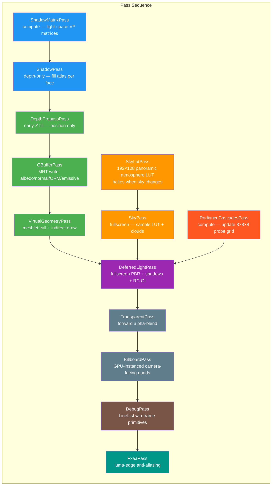

Helio is built around the idea that every stage of the frame — shadow atlas generation, G-buffer fill, atmospheric sky, global illumination, post-processing — is its own isolated, independently replaceable crate. Each crate implements the `RenderPass` trait from `helio-v3`, declares the GPU resources it reads and writes, and is otherwise unaware of the rest of the pipeline.

The default graph wires these passes together in a proven order that minimises redundant work and maximises GPU parallelism. You can extend it with custom passes using `renderer.add_pass()`, or replace the entire graph with `renderer.set_graph()`. This section documents every pass in the default pipeline, from the shadow atlas generation to the final anti-aliasing stage.

## The RenderPass Contract

Every pass in Helio is a Rust struct that implements two traits: `RenderPass` from `helio-v3`, and optionally `publish` for providing GPU resources to downstream passes.

```rust
pub trait RenderPass: Send + Sync {
    fn name(&self) -> &'static str;

    /// Upload per-frame CPU data to GPU buffers.  Runs before command encoding begins.
    fn prepare(&mut self, ctx: &PrepareContext) -> Result<()> { Ok(()) }

    /// Record GPU commands into the shared command encoder.
    fn execute(&mut self, ctx: &mut PassContext) -> Result<()>;

    /// Expose this pass's GPU textures / buffers to the FrameResources slot
    /// so downstream passes can bind them.
    fn publish<'a>(&'a self, frame: &mut FrameResources<'a>) {}
}
```

The `publish` method is how passes share outputs without a formal resource graph. `ShadowPass` publishes `frame.shadow_atlas` and `frame.shadow_sampler`. `GBufferPass` publishes `frame.gbuffer`. `SkyLutPass` publishes `frame.sky_lut`. Downstream passes receive these through `PassContext`, which holds a `FrameResources` populated by running every prior pass's `publish` in sequence.

## PassContext

The pass context is the zero-allocation view of the complete frame state:

```rust
pub struct PassContext<'a> {
    pub encoder: &'a mut wgpu::CommandEncoder,
    pub device:  &'a wgpu::Device,
    pub queue:   &'a wgpu::Queue,
    pub target:  &'a wgpu::TextureView,    // current HDR render target
    pub depth:   &'a wgpu::TextureView,    // scene depth buffer (read-write)
    pub scene:   &'a SceneResources<'a>,   // all GPU scene buffers
    pub frame:   &'a FrameResources<'a>,   // outputs published by prior passes
    pub width:   u32,
    pub height:  u32,
    pub frame_num: u64,
}
```

`SceneResources` holds borrowed references to every buffer the scene owns — camera uniforms, instance transforms, mesh vertex/index pools, material storage, light storage, and the indirect draw buffer. Passes record commands into `ctx.encoder` and submit nothing — submission happens once after all passes complete.

## Default Pipeline Execution Order



## Resource Flow

| Pass | Reads | Writes / Publishes |
|------|-------|--------------------|
| `ShadowMatrixPass` | lights buffer, camera uniform | shadow matrices buffer |
| `ShadowPass` | shadow matrices, scene instances, indirect buffer | `frame.shadow_atlas`, `frame.shadow_sampler` |
| `DepthPrepassPass` | scene instances, indirect buffer | depth buffer |
| `GBufferPass` | camera, globals, instances, materials, textures | `frame.gbuffer` (albedo/normal/ORM/emissive), depth |
| `VirtualGeometryPass` | meshlet buffer, instances | `frame.gbuffer` (appended), depth |
| `SkyLutPass` | sky uniforms | `frame.sky_lut` — 192×108 Rgba16Float |
| `SkyPass` | camera, sky uniforms, sky LUT | HDR target (sky region) |
| `RadianceCascadesPass` | G-buffer, sky LUT, scene geometry | `frame.rc_cascade` — 32×256 Rgba16Float |
| `DeferredLightPass` | G-buffer, shadow atlas, RC probes, sky LUT, depth | HDR target (lit geometry) |
| `TransparentPass` | camera, materials, depth (read-only) | HDR target |
| `BillboardPass` | camera, billboard instances | HDR target |
| `DebugPass` | camera, debug vertices | HDR target |
| `FxaaPass` | HDR target (sampled) | surface / swap-chain |

## CPU Cost Model

A key design goal is that CPu cost per frame is **O(1) with respect to scene complexity**. This means doubling the number of meshes or lights does not increase the per-frame CPU work in the hot path. Here is how each pass achieves this:

- **ShadowPass**: face loop bounded by `MAX_SHADOW_FACES = 256` (compile-time constant). One `multi_draw_indexed_indirect` per face — no per-object iteration.
- **GBufferPass**: one `multi_draw_indexed_indirect` per unique material. With 50 materials and 100,000 objects, the CPU issues 50 GPU commands.
- **VirtualGeometryPass**: one compute dispatch + one indirect draw. GPU does all per-meshlet work.
- **DeferredLightPass**: one fullscreen triangle draw. GPU iterates all lights in the fragment shader.
- **SkyLutPass**: one fullscreen draw. Skipped via early return when sky state hasn't changed.
- **SkyPass**: one fullscreen triangle draw.
- **RadianceCascadesPass**: one compute dispatch per cascade level.

The only passes whose CPU cost grows are `BillboardPass` (proportional to billboard instance count, not scene mesh count) and `DebugPass` (proportional to submitted debug line count). Both are bounded at 65,536 entries.

## Per-Pass Documentation

Each pass has its own dedicated page in this section with complete documentation of its:

- Internal Rust struct and constants
- Bind group layouts (all bindings, types, visibility)
- Vertex layout and stride
- Shader entry points and key algorithms
- Pipeline state (depth test, blend mode, cull mode, etc.)
- Memory budget (VRAM usage for textures and buffers)
- Integration with the deferred pipeline
- Configuration options

Start with [Shadow Pass](./shadow) for the depth atlas and CSM, then [G-Buffer Pass](./gbuffer) for the geometry stage, or jump to any pass of interest from the navigation on the left.
