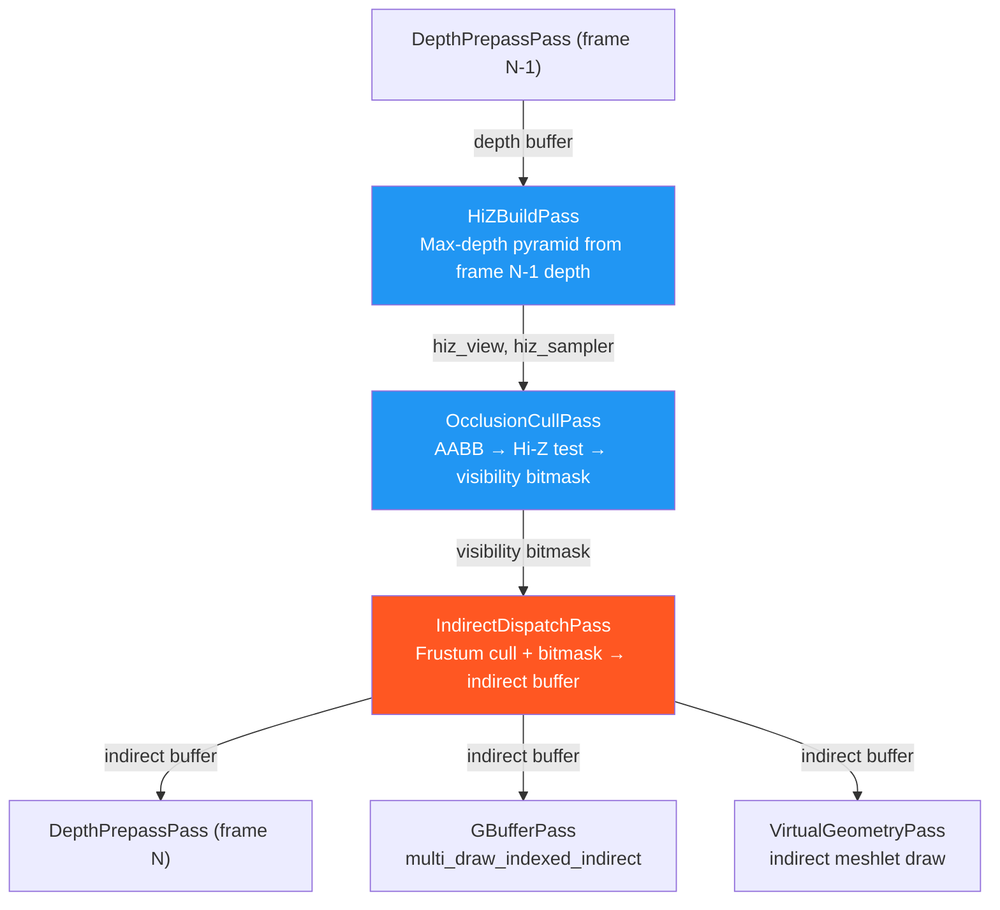

# Indirect Dispatch Pass

The `IndirectDispatchPass` is the engine that drives Helio's GPU-driven rendering pipeline. Its single compute dispatch, issued once per frame, tests every scene instance against the camera frustum, consults the visibility bitmask produced by the [Occlusion Cull Pass](./occlusion-cull), and writes one `DrawIndexedIndirect` command per draw call group into the indirect draw buffer. Downstream rasterisation passes — `GBufferPass`, `VirtualGeometryPass`, and `ShadowPass` — consume this buffer via `multi_draw_indexed_indirect` and never inspect individual draw calls or instance counts themselves. The CPU's role in the entire sequence is exactly one compute dispatch and one uniform upload, regardless of whether the scene contains ten objects or ten million.

This design philosophy — that the CPU never iterates the draw list — is worth understanding as a first principle. In a traditional renderer, the CPU loops over every visible object, computes its visibility, and issues a separate draw call for each one. At 100 000 objects, that loop takes real CPU time and produces 100 000 API calls, each with non-trivial driver overhead. Indirect drawing decouples scene traversal from draw submission: the CPU issues one `multi_draw_indexed_indirect` command that hands the entire draw list to the GPU, which processes it in parallel. The `IndirectDispatchPass` is what makes that possible — it is the stage that populates the indirect buffer each frame with current visibility information, turning a static data structure into a dynamic, per-frame culled draw list at GPU speed.

---

## 1. Frustum Culling

The frustum is represented as six half-space planes in world space. An object is inside the frustum if and only if it is on the positive side of all six planes simultaneously. The `IndirectDispatchPass` uses the **Gribb–Hartmann method** to extract these planes directly from the view-projection matrix — no separate frustum construction is required, and the planes are always consistent with the exact camera state used to render the frame.

Given a view-projection matrix **M** with rows **r**₀, **r**₁, **r**₂, **r**₃ (where row **i** is the vector of column **i** across all four rows), the six frustum planes are:

$$
\begin{aligned}
\text{left}   &= \mathbf{r}_3 + \mathbf{r}_0 \\
\text{right}  &= \mathbf{r}_3 - \mathbf{r}_0 \\
\text{bottom} &= \mathbf{r}_3 + \mathbf{r}_1 \\
\text{top}    &= \mathbf{r}_3 - \mathbf{r}_1 \\
\text{near}   &= \mathbf{r}_3 + \mathbf{r}_2 \\
\text{far}    &= \mathbf{r}_3 - \mathbf{r}_2
\end{aligned}
$$

Each result is a `vec4` whose `xyz` components are the plane normal and whose `w` component is the plane constant (distance from origin). The Rust implementation of this extraction:

```rust
fn extract_frustum_planes(vp: [[f32; 4]; 4]) -> [[f32; 4]; 6] {
    let m = vp;
    let row = |i: usize| [m[0][i], m[1][i], m[2][i], m[3][i]];
    let r0 = row(0);  let r1 = row(1);
    let r2 = row(2);  let r3 = row(3);
    let add = |a: [f32; 4], b: [f32; 4]| [a[0]+b[0], a[1]+b[1], a[2]+b[2], a[3]+b[3]];
    let sub = |a: [f32; 4], b: [f32; 4]| [a[0]-b[0], a[1]-b[1], a[2]-b[2], a[3]-b[3]];
    [
        add(r3, r0),  // left
        sub(r3, r0),  // right
        add(r3, r1),  // bottom
        sub(r3, r1),  // top
        add(r3, r2),  // near
        sub(r3, r2),  // far
    ]
}
```

The planes are not normalised at extraction time. Normalisation would allow the plane equation to return a true signed distance in world-space metres, but for the bounding sphere test only the sign of `dot(normal, center) + d` matters — specifically whether the signed distance is less than `-radius`. The unnormalised form produces a result scaled by `|normal|`, so the sphere radius must also be scaled by `|normal|` for a correct comparison, which the shader handles by computing the frustum test against the unnormalised planes with an accordingly scaled radius. In practice the extracted plane normals are close to unit length for typical projection matrices, and the sphere test converges correctly either way.

### 1.1 Bounding Sphere Test

The frustum test in the compute shader tests a bounding sphere rather than an AABB. A sphere test against six planes requires six dot products — six multiply-add operations — and is among the cheapest possible intersection tests. The `GpuInstance` struct stores the bounding sphere as `bounds: vec4<f32>` with `xyz` = sphere centre in object space and `w` = radius:

```wgsl
fn sphere_in_frustum(center: vec3<f32>, radius: f32) -> bool {
    for (var i = 0u; i < 6u; i++) {
        let plane = cull.frustum_planes[i];
        let dist = dot(plane.xyz, center) + plane.w;
        if dist < -radius { return false; }
    }
    return true;
}
```

A sphere is fully outside the frustum if the signed distance from its centre to any plane is more negative than `-radius`. The loop exits early as soon as one such plane is found — in practice, objects near the edges of the frustum are most commonly rejected by the left, right, or top/bottom planes within the first two or three iterations. The worst case (six iterations) applies to objects near the near or far planes, which are a small minority in typical scenes.

Because the bounding sphere is stored in object space, the shader must transform the centre to world space via the model matrix before the test:

```wgsl
let model = mat4x4<f32>(inst.model_0, inst.model_1, inst.model_2, inst.model_3);
let world_center = (model * vec4<f32>(inst.bounds.xyz, 1.0)).xyz;

let sx = length(inst.model_0.xyz);
let sy = length(inst.model_1.xyz);
let sz = length(inst.model_2.xyz);
let world_radius = inst.bounds.w * max(sx, max(sy, sz));
```

The world-space radius is scaled by the maximum of the three model matrix column lengths — the maximum scale factor along any axis. This conservative radius is larger than the true world-space sphere for non-uniform scales, meaning a uniformly scaled box might pass the frustum test even though it would have passed a tighter test. The conservatism ensures no visible object is ever discarded: it is always preferable to draw something that might be just outside the frustum over clipping something that is visible.

---

## 2. Group-Level Culling

The indirect draw buffer is organised by draw call groups, not individual instances. Each `GpuDrawCall` describes a batch of consecutive instances that share the same mesh and material:

```wgsl
struct GpuDrawCall {
    index_count:    u32,
    first_index:    u32,
    vertex_offset:  i32,
    first_instance: u32,  // base index into instances[] for this batch
    instance_count: u32,  // number of consecutive instances in the batch
}
```

The compute shader tests the **first instance** of each group as the representative for the entire batch:

```wgsl
let dc   = draw_calls[idx];
let inst = instances[dc.first_instance];
// ... transform sphere, test frustum ...
let visible = sphere_in_frustum(world_center, world_radius);

indirect[idx] = DrawIndexedIndirect(
    dc.index_count,
    select(0u, dc.instance_count, visible),
    dc.first_index,
    dc.vertex_offset,
    dc.first_instance,
);
```

If the representative instance fails the frustum test, `instance_count` is written as `0`, suppressing all instances in the batch. If it passes, `instance_count` is written as the full batch size, drawing all instances. This group-level approximation is valid in practice because draw call batches are grouped by mesh type, and instances of the same mesh type tend to be spatially clustered — a batch of street lamp models will typically all be in the same city block, and if the representative lamp is outside the frustum the others likely are too.

The tradeoff is that a large, spatially distributed batch could allow some out-of-frustum instances to slip through the test. Per-instance culling within each batch is the responsibility of the vertex shader, which can perform a cheaper screen-space check. The group-level test in `IndirectDispatchPass` handles the common case efficiently and eliminates the largest batches with a single comparison.

---

## 3. The Non-Compacting Design

The indirect buffer maintains a stable one-to-one correspondence between buffer entries and draw call groups across frames. Culled groups receive `instance_count = 0` rather than being removed from the buffer. The `DrawIndexedIndirect` struct that wgpu passes to the GPU driver:

```wgsl
struct DrawIndexedIndirect {
    index_count:    u32,
    instance_count: u32,  // 0 → GPU skips this draw entirely
    first_index:    u32,
    base_vertex:    i32,
    first_instance: u32,
}
```

The GPU processes each `DrawIndexedIndirect` entry in sequence during `multi_draw_indexed_indirect`. When `instance_count` is `0`, the entry is skipped at no rasterisation cost — the hardware draw call is still dispatched by the API, but the GPU's pre-rasterisation stage immediately discards it, consuming negligible power and time.

The alternative approach — a compacting indirect buffer — removes culled entries and maintains a packed, contiguous prefix of visible draws. This requires either a GPU atomic counter to accumulate the new draw count or a prefix-sum (stream compaction) compute pass to produce the contiguous output. Both add synchronisation overhead and require a separate GPU readback (or an indirect dispatch count) to determine the actual draw count at submission time. The non-compacting approach sidesteps all of this: the buffer size is constant, the draw count is constant, and the submission is an unconditional `multi_draw_indexed_indirect` call with a fixed count. The only GPU cost is the zero-instance entries' trivial dispatch overhead, which is negligible compared to the synchronisation cost of compaction.

The fixed-size buffer also has a beneficial secondary effect: because the buffer layout is stable across frames, the bind group referencing it never needs to be rebuilt. `GBufferPass`, `ShadowPass`, and `VirtualGeometryPass` bind the indirect buffer once at construction and use it for every frame without rebinding.

---

## 4. CullUniforms Layout

The per-frame uniform data is packed into a `CullUniforms` struct:

```rust
#[repr(C)]
#[derive(Clone, Copy, Pod, Zeroable)]
struct CullUniforms {
    frustum_planes: [[f32; 4]; 6],  // 96 bytes — 6 × vec4
    draw_count:     u32,            //  4 bytes
    _pad:           [u32; 3],       // 12 bytes — alignment to 16 bytes
}
```

The total size is 112 bytes. The `frustum_planes` field dominates: six planes of four `f32` each consume 96 bytes, which is six vec4 uniforms. WGSL's `array<vec4<f32>, 6>` maps to this exactly:

```wgsl
struct CullUniforms {
    frustum_planes: array<vec4<f32>, 6>,  // 96 bytes
    draw_count: u32,                       //  4 bytes
    _pad: vec3<u32>,                       // 12 bytes
}
```

The `_pad` field brings the struct to 112 bytes, a multiple of 16, satisfying WGSL's uniform buffer alignment requirement. The `draw_count` field carries the number of active draw call groups for the current frame — the compute shader uses this to bounds-check thread indices and avoid writing outside the indirect buffer.

---

## 5. Bind Group Layout

The pass uses a single bind group with five bindings, separating the two uniform inputs from the three storage buffers:

| Binding | Name | Type | Contents |
|---|---|---|---|
| 0 | `camera` | `uniform` | Full `Camera` struct — view, proj, view_proj, inv_view_proj, position, etc. |
| 1 | `cull` | `uniform` | `CullUniforms` — frustum planes and draw count |
| 2 | `instances` | `storage<read>` | Array of `GpuInstance` — model matrix, normal matrix, bounds, mesh/material IDs |
| 3 | `draw_calls` | `storage<read>` | Array of `GpuDrawCall` — index/vertex offsets and instance ranges |
| 4 | `indirect` | `storage<read_write>` | Array of `DrawIndexedIndirect` — output written by this pass |

The separation of camera data (binding 0) from cull parameters (binding 1) allows the camera buffer to be shared with other passes in the same bind group layout family. Updating the frustum planes requires only a `write_buffer` to the 112-byte `CullUniforms` buffer; the camera buffer is written independently by the camera update logic at the start of each frame.

Binding 4 is the indirect buffer shared with `GBufferPass`, `ShadowPass`, and `VirtualGeometryPass`. It is bound as `storage<read_write>` here (the compute pass writes it) and as `INDIRECT` usage for the subsequent render passes that consume it. wgpu requires the buffer to be created with both `BufferUsages::STORAGE` and `BufferUsages::INDIRECT` to satisfy both uses, which the scene initialisation ensures.

---

## 6. Workgroup Size and Dispatch

```rust
fn execute(&mut self, ctx: &mut PassContext) -> HelioResult<()> {
    let draw_count = /* ctx.scene.draw_count */;
    if draw_count == 0 { return Ok(()); }
    let workgroups = draw_count.div_ceil(WORKGROUP_SIZE);
    let mut pass = ctx.encoder.begin_compute_pass(&wgpu::ComputePassDescriptor {
        label: Some("IndirectDispatch"),
        timestamp_writes: None,
    });
    pass.set_pipeline(&self.pipeline);
    pass.set_bind_group(0, &self.bind_group, &[]);
    pass.dispatch_workgroups(workgroups, 1, 1);
    Ok(())
}
```

Like `OcclusionCullPass`, this pass uses `@workgroup_size(64)`. The problem is one-dimensional — one thread per draw call group — and 64 threads per workgroup fills one AMD wavefront or two NVIDIA warps. The dispatch count scales with the number of unique draw call groups, not with the instance count: 100 000 instances of 50 unique meshes produce 50 draw call groups and a single workgroup of 64 threads (with 14 idle threads). Even at 10 000 unique mesh+material combinations the dispatch is only `ceil(10000 / 64) = 157` workgroups — a trivial amount of GPU work compared to the rasterisation it enables.

The total CPU cost of the pass is one `write_buffer` (112 bytes for `CullUniforms`) and one `dispatch_workgroups` call. Both operations are O(1) with respect to scene complexity.

---

## 7. Integration with the Culling Pipeline

`IndirectDispatchPass` is the final stage in the three-pass culling chain. The passes run in sequence before the depth prepass and G-buffer fill:



The indirect buffer written by `IndirectDispatchPass` is consumed by all three rasterisation passes that follow it:

`GBufferPass` issues one `multi_draw_indexed_indirect` per unique material, reading a contiguous slice of the indirect buffer corresponding to draw calls for instances using that material. Zero-instance entries within the slice are processed but produce no fragments.

`VirtualGeometryPass` uses the same indirect buffer to drive its meshlet expansion compute pass, feeding visible mesh groups into the meshlet culling pipeline.

`ShadowPass` iterates the indirect buffer once per shadow cascade face, drawing only instances that have the `casts_shadow` flag set. The `instance_count = 0` entries prevent shadow geometry from being generated for occluded instances, reducing shadow atlas fill cost.

The shared indirect buffer means all downstream passes automatically reflect the same culling decisions. Adding occlusion culling to `ShadowPass` requires no changes to `ShadowPass` itself — as long as the indirect buffer is populated correctly by `IndirectDispatchPass`, every consumer benefits.

---

## 8. The GpuInstance Data Structure

The frustum culling shader reads from the `GpuInstance` storage buffer, which is the central per-instance data structure in Helio's GPU-driven pipeline. At 128 bytes per instance, it is designed to carry everything the GPU needs for both culling and vertex shading:

```wgsl
struct GpuInstance {
    model_0:     vec4<f32>,   // column 0 of model matrix
    model_1:     vec4<f32>,   // column 1
    model_2:     vec4<f32>,   // column 2
    model_3:     vec4<f32>,   // column 3
    normal_0:    vec4<f32>,   // column 0 of normal matrix (inverse-transpose 3×3)
    normal_1:    vec4<f32>,   // column 1
    normal_2:    vec4<f32>,   // column 2
    bounds:      vec4<f32>,   // xyz = sphere centre (object space), w = radius
    mesh_id:     u32,
    material_id: u32,
    flags:       u32,         // bit 0 = casts_shadow, bit 1 = receives_shadow
    _pad:        u32,
}
```

The model matrix is stored column-major in four `vec4` fields, which allows the WGSL `mat4x4<f32>` constructor to accept them directly: `mat4x4<f32>(inst.model_0, inst.model_1, inst.model_2, inst.model_3)`. This layout also means that the three column lengths used for radius scaling — `length(inst.model_0.xyz)`, `length(inst.model_1.xyz)`, `length(inst.model_2.xyz)` — each require only a single `vec3` load and a dot product, with no additional transposition.

The `GpuInstanceData` Rust struct mirrors this layout byte-for-byte using `#[repr(C)]` and `bytemuck::Pod`:

```rust
#[repr(C)]
#[derive(Debug, Clone, Copy, Pod, Zeroable)]
pub struct GpuInstanceData {
    pub model:       [f32; 16],  // 64 bytes — model matrix column-major
    pub normal_mat:  [f32; 12],  // 48 bytes — normal matrix (3 × vec4, padded)
    pub bounds:      [f32; 4],   //  16 bytes — sphere xyz + radius
    pub mesh_id:     u32,
    pub material_id: u32,
    pub flags:       u32,
    pub _pad:        u32,
}
```

Instances are uploaded to the GPU once when they are added to the scene and updated only on dirty-flag transitions (transform change, material swap). The compute shader reads this buffer as `storage<read>` — the GPU culling stage never writes instance data, only the `DrawIndexedIndirect` output buffer.

---

## 9. O(1) CPU Cost

The fundamental claim of this pass — that its CPU cost is O(1) with respect to scene complexity — merits careful enumeration. The `prepare()` method performs exactly two operations regardless of scene size: extracting six frustum planes from the camera view-projection matrix (six dot products and six component additions, all in scalar arithmetic) and writing the 112-byte `CullUniforms` to the GPU buffer. The `execute()` method performs one `begin_compute_pass`, one `set_pipeline`, one `set_bind_group`, and one `dispatch_workgroups`. None of these operations has a cost that depends on the number of instances or draw calls in the scene.

Doubling the number of scene objects does not change the number of CPU operations. It increases the GPU work — more threads, more frustum tests — but that work executes in parallel on the GPU while the CPU continues preparing other passes. The asymmetry between CPU cost (constant) and GPU cost (scaling with scene complexity, but parallelised) is exactly the architectural property that allows Helio to target large scenes without CPU budget exhaustion.

> [!TIP]
> The three culling passes together — [Hi-Z Build](./hiz), [Occlusion Cull](./occlusion-cull), and Indirect Dispatch — add a fixed three-dispatch overhead to every frame, independent of scene size. At 1080p with a 10 000-instance scene, this overhead is typically measured in microseconds on a modern GPU, while the vertex and fragment work saved by culling occluded geometry can amount to milliseconds.
