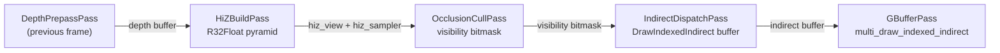

The `OcclusionCullPass` is Helio's GPU-driven occlusion culling stage. It receives the hierarchical depth pyramid produced by the [Hi-Z Build Pass](./hiz) and the world-space axis-aligned bounding boxes (AABBs) of every scene instance, projects each AABB into screen space, and tests whether the projected region is entirely behind the occluder geometry encoded in the pyramid. The result is a per-instance visibility bitmask written to a GPU buffer. The [Indirect Dispatch Pass](./indirect-dispatch) consumes this bitmask to suppress draw commands for hidden instances before they ever reach the rasteriser.

To understand why this pass exists alongside frustum culling, it helps to think about what frustum culling cannot accomplish. Frustum culling, handled by `IndirectDispatchPass`, eliminates every instance whose bounding volume lies completely outside the six planes of the view frustum. In an outdoor scene with a wide field of view this is a substantial reduction. But in an indoor scene — a city street viewed from street level, a cave system, an interior environment — the frustum may contain dozens or hundreds of objects that are entirely hidden behind walls, floors, and other large occluders. Frustum culling keeps all of them, and they proceed through the vertex and fragment pipeline generating real GPU work. Occlusion culling eliminates this redundant work at the cost of a single compute dispatch per frame.

---

## 1. Temporal Reprojection and the One-Frame Lag

Before examining the test itself, the temporal design of the pass must be understood. The Hi-Z pyramid that `OcclusionCullPass` samples was built from the **previous frame's** depth buffer. This is not an oversight — it is an intentional and principled design decision.

The alternative — building the Hi-Z from the current frame's depth prepass and using it in the same frame — requires a pipeline barrier between the depth prepass and the occlusion cull dispatch to ensure the depth texture write is fully visible to the subsequent compute read. While this is technically possible, it inserts a hard synchronisation point that stalls the GPU command processor and breaks the overlap between rasterisation and compute workloads. By using the previous frame's depth buffer instead, the pyramid can be constructed asynchronously after the previous frame's depth prepass without any synchronisation with the current frame's work, and the occlusion cull can begin immediately at the start of the current frame.

The consequence is a one-frame latency: an object that was occluded last frame and becomes visible this frame will be incorrectly culled for one frame. The visibility bitmask is initialised to all-ones (all instances visible) at the start of each frame before the compute shader runs, so any instance with no history defaults to visible. In practice, single-frame temporal lag is imperceptible at typical frame rates; the object appears on screen on the very next frame with no visible pop-in at interactive speeds.

> [!NOTE]
> Newly spawned instances whose slots have never been touched default to visible because the bitmask buffer is cleared to all-ones before the compute dispatch. The compute shader's zero-AABB check detects empty slots (where the instance has not been assigned geometry yet) and explicitly clears their visibility bits, preventing phantom draw calls.

---

## 2. The Hi-Z Test

The occlusion test runs in `occlusion_cull.wgsl` with entry point `occlusion_cull`. Each GPU thread handles one instance slot. The test for a single instance proceeds in four stages: project the AABB corners to screen space, compute the screen-space footprint rectangle, select the Hi-Z mip level that matches the footprint, and compare the object's nearest depth against the pyramid sample.

The compute shader receives a unified input structure that carries the camera matrices, screen dimensions, and pyramid parameters:

```wgsl
struct OcclusionCullInput {
    view_proj:      mat4x4f,
    view_proj_inv:  mat4x4f,
    camera_pos:     vec3f,
    _pad0:          u32,
    screen_width:   u32,
    screen_height:  u32,
    total_slots:    u32,   // high-water mark of the slot allocator
    hiz_mip_count:  u32,
}
```

Instance bounding volumes are stored as world-space AABBs in a separate buffer. The `GpuInstanceAabb` struct is 32 bytes, padded to ensure 16-byte alignment of both the min and max vectors:

```wgsl
struct GpuInstanceAabb {
    aabb_min: vec3f,
    _pad0:    f32,
    aabb_max: vec3f,
    _pad1:    f32,
}
```

### 2.1 Projecting AABB Corners

The shader projects all eight corners of the world-space AABB into normalised device coordinates (NDC). An AABB has eight corners — the Cartesian product of {min.x, max.x} × {min.y, max.y} × {min.z, max.z} — and all eight must be tested because the projected screen-space bounding rectangle can be determined only by finding the extreme NDC coordinates across all of them. Projecting only the min and max corners would be incorrect for perspective projections, where the screen-space extremes of a 3-D box do not necessarily correspond to its 3-D extremes.

```wgsl
let corners = array<vec3f, 8>(
    vec3f(lo.x, lo.y, lo.z),  vec3f(hi.x, lo.y, lo.z),
    vec3f(lo.x, hi.y, lo.z),  vec3f(hi.x, hi.y, lo.z),
    vec3f(lo.x, lo.y, hi.z),  vec3f(hi.x, lo.y, hi.z),
    vec3f(lo.x, hi.y, hi.z),  vec3f(hi.x, hi.y, hi.z),
);
```

Each corner is projected via the view-projection matrix. The `project()` helper function returns a `vec4f` where the `w` channel is `1.0` if the projection is valid (the homogeneous `w > 0`) and `0.0` if the point is behind or at the camera plane:

```wgsl
fn project(world_pos: vec3f) -> vec4f {
    let clip = cull_input.view_proj * vec4f(world_pos, 1.0);
    if clip.w <= 0.0 { return vec4f(0.0, 0.0, 0.0, 0.0); }
    let ndc = clip.xyz / clip.w;
    return vec4f(ndc, 1.0);
}
```

The shader accumulates the per-axis min and max NDC coordinates across all valid projections. If all eight corners project behind the camera (`any_valid = false`), the instance is assumed visible. This conservative fallback handles the case where the camera is inside the AABB: an object that encloses the camera clearly cannot be occluded, and the assumption of visibility is correct.

### 2.2 The Minimum-Depth Convention

After projecting all corners, the shader extracts the minimum NDC depth: the closest point of the AABB to the camera. In wgpu's depth convention (0 = near, 1 = far), a lower depth value means a closer surface. The object's minimum projected depth is therefore the smallest NDC Z value across all projected corners, clamped to the valid range `[0, 1]`.

This minimum depth is the quantity that is compared against the Hi-Z pyramid. The logic is: if even the **closest** point of the object's bounding volume is farther from the camera than the maximum occluder depth in the region, then the entire object is guaranteed to be behind the occluder geometry. A visible object might have some corners behind occluders and some in front; only if the closest corner fails the test can we be certain the whole object is hidden.

---

## 3. Mip Level Selection

The Hi-Z pyramid was constructed specifically to make the occlusion test independent of object size. Large objects project to large screen-space footprints; small objects project to small footprints. Sampling the pyramid at the wrong mip level introduces error in both directions: sampling too fine (low mip) means the single sample may not cover the entire footprint of the object, potentially missing occluders at the edges of the region. Sampling too coarse (high mip) means the pyramid texel covers a region much larger than the object, possibly including large depth values from nearby geometry outside the object's actual footprint, causing false occlusion.

The correct mip level is the one where a single pyramid texel covers approximately the object's projected screen footprint. Given a footprint of `F` pixels along its longest dimension, the appropriate mip level `M` satisfies `2^M ≈ F`, i.e., `M = log2(F)`:

$$
M = \lfloor \log_2\!\left(\max(\text{footprint\_px},\; 1)\right) \rfloor
$$

The WGSL implementation converts the screen-space footprint from UV coordinates to pixel dimensions before computing the mip:

```wgsl
let sw = f32(cull_input.screen_width);
let sh = f32(cull_input.screen_height);
let footprint_px = max((uv_max.x - uv_min.x) * sw,
                       (uv_max.y - uv_min.y) * sh);

let mip_f = log2(max(footprint_px, 1.0));
let mip   = clamp(u32(mip_f), 0u, cull_input.hiz_mip_count - 1u);
```

The `max(..., 1.0)` guards against a zero-area footprint (an object whose AABB projects to a single point) and ensures `log2` returns a non-negative value. The `u32()` cast truncates the float, giving floor, and the `clamp` bounds the result to the range of available mip levels. For a very large object that fills the entire screen, the mip saturates at `hiz_mip_count - 1`, sampling the coarsest level of the pyramid. For a sub-pixel object, the mip saturates at 0, sampling the full-resolution base level — the correct behaviour in both cases, since no pyramid level would provide finer data.

Using floor (rather than ceil) for the mip level slightly favours visibility: the selected mip's texels are somewhat smaller than the footprint, meaning the single sample may represent a subset of the footprint rather than a superset. This makes the test slightly less aggressive about culling. The alternative, using ceil, would be more conservative but increases the risk of sampling a texel that covers geometry far outside the object's footprint, producing false occlusion for objects near large occluders. The floor choice prioritises correctness (no false culling) over maximum culling rate.

---

## 4. The Visibility Bitmask

The output of `OcclusionCullPass` is an `array<atomic<u32>>` buffer where bit `N` of word `N / 32` corresponds to instance slot `N`. A set bit indicates the instance is potentially visible; a cleared bit indicates it was determined to be occluded.

The shader writes the bitmask using atomic operations:

```wgsl
let word = slot / 32u;
let bit  = slot % 32u;
if occluded {
    atomicAnd(&visibility[word], ~(1u << bit));
} else {
    atomicOr(&visibility[word], 1u << bit);
}
```

The atomic operations are essential because multiple threads in the same workgroup may address the same `u32` word. With 64 threads per workgroup and 32 bits per word, every workgroup's first two threads share a `u32` word with threads from adjacent slots. Without atomic read-modify-write semantics, two threads performing `visibility[word] |= (1 << bit)` simultaneously would produce a race condition: one thread's bit would be silently lost. `atomicOr` and `atomicAnd` serialize these operations to hardware, guaranteeing correctness.

The bit-packing design reduces the visibility buffer size by 32× compared to storing one `u32` per instance. For 65 536 instances, the full bitmask is `65536 / 32 × 4 = 8 192` bytes — 8 KB, small enough to fit in GPU L1 cache and be read with minimal latency by the subsequent `IndirectDispatchPass`.

### 4.1 Empty Slot Handling

The instance slot allocator uses a high-water mark strategy: slots are never explicitly freed until a full rebuild, so the `total_slots` count in the uniform may exceed the number of active instances. Empty slots are detected by the zero-AABB convention: a slot is empty if both `aabb_min` and `aabb_max` are the zero vector. The shader clears the visibility bit for empty slots to prevent phantom draw calls from reaching the rasteriser:

```wgsl
if all(inst.aabb_min == vec3f(0.0)) && all(inst.aabb_max == vec3f(0.0)) {
    let word = slot / 32u;
    let bit  = slot % 32u;
    atomicAnd(&visibility[word], ~(1u << bit));
    return;
}
```

---

## 5. Bind Group Layout

The pass uses a single bind group with five bindings:

| Binding | Name | Type | Contents |
|---|---|---|---|
| 0 | `cull_input` | `uniform` | `OcclusionCullInput` — camera matrices, screen dims, mip count |
| 1 | `aabb_buf` | `storage<read>` | Array of `GpuInstanceAabb` — one per slot |
| 2 | `hiz_tex` | `texture_2d<f32>` | Full Hi-Z pyramid (all mips) from `HiZBuildPass` |
| 3 | `hiz_sampler` | `sampler` (non-filtering) | Nearest/clamp sampler from `HiZBuildPass` |
| 4 | `visibility` | `storage<read_write>` | `array<atomic<u32>>` — output visibility bitmask |

Bindings 2 and 3 are borrowed directly from `HiZBuildPass` at construction time. The `hiz_view` and `hiz_sampler` fields of `HiZBuildPass` are `pub` precisely for this purpose. Because the Hi-Z texture is a fixed allocation that survives the lifetime of the pass, no rebinding is needed per-frame unless the render resolution changes, in which case both passes are rebuilt together.

The `OcclusionUniforms` Rust struct (uploaded to the underlying `OcclusionCullInput` buffer during `prepare()`) carries the four scalar parameters that change per-frame:

```rust
#[repr(C)]
#[derive(Clone, Copy, Pod, Zeroable)]
struct OcclusionUniforms {
    instance_count: u32,
    hiz_width:      u32,
    hiz_height:     u32,
    hiz_mip_count:  u32,
}
```

This is 16 bytes — exactly one cache line — and is the sole per-frame CPU→GPU upload for this pass. The full camera matrices are already resident in the camera uniform buffer, written once during the camera update pass.

---

## 6. Workgroup Size and Dispatch

The entry point is declared `@compute @workgroup_size(64)` — a one-dimensional workgroup of 64 threads, where each thread handles one instance slot. The dispatch launches `ceil(total_slots / 64)` workgroups along the X axis:

```rust
fn execute(&mut self, ctx: &mut PassContext) -> HelioResult<()> {
    let count = ctx.scene.instance_count;
    if count == 0 { return Ok(()); }
    let wg = count.div_ceil(WORKGROUP_SIZE);
    let mut pass = ctx.encoder.begin_compute_pass(&wgpu::ComputePassDescriptor {
        label: Some("OcclusionCull"),
        timestamp_writes: None,
    });
    pass.set_pipeline(&self.pipeline);
    pass.set_bind_group(0, &self.bind_group, &[]);
    pass.dispatch_workgroups(wg, 1, 1);
    Ok(())
}
```

The choice of 64 threads per workgroup is driven by GPU hardware architecture. On AMD GCN and RDNA architectures, the hardware SIMD unit is a 64-thread wavefront: all 64 threads in a workgroup execute in lockstep, sharing instruction fetch and decode hardware. A workgroup of exactly 64 threads occupies exactly one wavefront with no idle lanes. On NVIDIA architectures with 32-thread warps, 64 threads form two warps within the same workgroup, which the hardware can schedule interleaved to hide memory latency. Either way, 64 is the smallest power-of-two workgroup size that achieves full SIMD utilisation on both major GPU vendors.

A one-dimensional workgroup is appropriate here because the problem is inherently one-dimensional: one thread per instance slot, with no spatial locality relationship between consecutive slots that would benefit from a 2-D tile arrangement. The one-dimensional layout also makes the global invocation index computation trivial — `gid.x` is directly the slot index with no coordinate flattening required.

---

## 7. NDC-to-UV Coordinate Transformation

The shader converts projected NDC coordinates to UV texture coordinates before sampling the Hi-Z pyramid. The wgpu NDC convention places the origin at the centre of the viewport with X increasing right and Y increasing **up**. Texture UV coordinates in wgpu have the origin at the top-left, with V increasing **down**. The transformation accounts for this Y-axis flip:

```wgsl
// NDC: x ∈ [-1,1] (left→right), y ∈ [-1,1] (down→up)
// UV:  u ∈ [0,1]  (left→right), v ∈ [0,1]  (top→bottom)
let uv_min = vec2f( ndc_min.x * 0.5 + 0.5,  0.5 - ndc_max.y * 0.5);
let uv_max = vec2f( ndc_max.x * 0.5 + 0.5,  0.5 - ndc_min.y * 0.5);
let uv_center = (uv_min + uv_max) * 0.5;
```

Note that `ndc_max.y` maps to `uv_min.v` (the Y flip inverts the ordering). The pyramid is sampled at `uv_center` — the centre of the projected bounding rectangle — using `textureSampleLevel` with the computed mip:

```wgsl
let hiz_val = textureSampleLevel(hiz_tex, hiz_sampler, uv_center, f32(mip)).r;
```

Sampling at the centre of the footprint rather than at an edge is important for correctness: the Hi-Z value at the centre of the footprint is the maximum depth within the pyramid texel that covers the centre, which under the max-reduction pyramid is guaranteed to be representative of — and in general larger than — any individual depth value within that texel's footprint. Sampling at an edge risks placing the UV coordinate in a neighbouring texel that covers a different screen region.

---

## 8. Integration

`OcclusionCullPass` sits between `HiZBuildPass` and `IndirectDispatchPass` in the culling pipeline. The three passes form a directed chain: Hi-Z produces the pyramid that OcclusionCull consumes; OcclusionCull produces the visibility bitmask that IndirectDispatch uses to suppress draw commands.



The [Indirect Dispatch Pass](./indirect-dispatch) reads the visibility bitmask alongside the frustum cull results to produce the final draw command buffer. Objects that pass the frustum test but fail the occlusion test have their `instance_count` zeroed in the indirect buffer, and the GPU skips these draw commands automatically.
