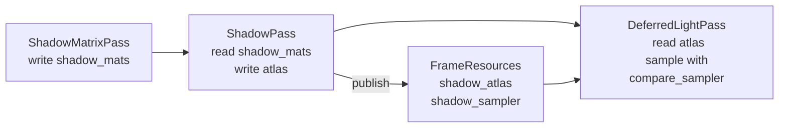

# Shadow Pass

Helio's shadow system is a fully GPU-driven, zero-CPU-overhead pipeline for rendering depth-only geometry into a persistent shadow atlas. It is split across two cooperating render passes that are executed back-to-back every frame: **ShadowMatrixPass** (compute) followed by **ShadowPass** (depth rasterisation). This document is the authoritative technical reference for both.

> [!IMPORTANT]
> This document describes production source. All code blocks are taken verbatim from `crates/helio-pass-shadow` and `crates/helio-pass-shadow-matrix`. Constant values, byte offsets, and algorithm descriptions are guaranteed to match the implementation.

---

## 1. Two-Pass Shadow Architecture

The classical approach to CPU-driven shadow rendering works as follows: the CPU builds view-projection matrices for every shadow-casting light face, uploads them to a GPU buffer, then iterates over each face issuing draw calls. For a scene with 42 point lights — each requiring 6 cube-face matrices — that is 252 matrix constructions and 252 separate render passes on the CPU per frame. Add 4 CSM cascades for the directional light and any spot lights and the total easily surpasses 256 shader-visible matrices.

The problem is not just arithmetic cost. The real bottleneck is **synchronisation**: before the GPU can begin rendering shadow faces, the CPU must have computed and uploaded every matrix. This introduces a hard dependency that serialises GPU shadow work behind CPU work, wasting the pipeline parallelism that modern GPUs are designed to exploit.

Helio eliminates this bottleneck with a two-pass design:

```
┌──────────────────────────────────────────────────┐
│  Frame N                                         │
│                                                  │
│  ShadowMatrixPass  ─── compute dispatch ───┐     │
│  (GPU computes all light-space matrices)   │     │
│                                            ▼     │
│  ShadowPass  ─── depth render (all faces) ─┘     │
│  (GPU reads matrices, draws all geometry)        │
│                                                  │
│  DeferredLightPass ─── reads shadow atlas ──────┘│
└──────────────────────────────────────────────────┘
```

**ShadowMatrixPass** is a compute pass with a single dispatch. Each GPU thread handles one light: a point light thread writes 6 cube-face matrices, a directional light thread writes 4 CSM matrices, and a spot light thread writes 1 perspective matrix. Total CPU cost: one `queue.write_buffer` call uploading 16 bytes of uniforms (light count + atlas size), plus the dispatch call itself. The matrices are written by the GPU into a persistent `GpuShadowMatrix` storage buffer shared with `ShadowPass`.

**ShadowPass** is a depth-only rasterisation pass. For each active shadow face it opens a render pass targeting that face's layer in the shadow atlas, binds the pre-computed matrices via a dynamic uniform offset, and issues a single `multi_draw_indexed_indirect` call that covers the entire scene. The CPU does not touch or inspect the matrix data — it simply drives the face loop.

The result is that the GPU executes matrix computation and shadow rasterisation as a single uninterrupted queue of work. The CPU submits both encoded command buffers in one `queue.submit` call, never blocking on the GPU side for readback.

> [!NOTE]
> `ShadowMatrixPass` runs before `ShadowPass` in the pass graph. The wgpu command encoder inserts an implicit GPU-side ordering barrier between the compute pass and the subsequent render pass because they write and read the same `shadow_matrices` buffer, satisfying the WebGPU memory model.

---

## 2. The Shadow Atlas

The shadow atlas is a single `Depth32Float` texture array allocated once at startup and never resized. Each array layer corresponds to one shadow face: cube-face for point lights, cascade slice for directional lights, or a single frustum for spot lights.

<!-- screenshot: false color visualization of all 256 shadow atlas layers rendered as a 16×16 thumbnail grid -->

### Atlas Specification

| Property | Value |
|---|---|
| Format | `Depth32Float` |
| Per-face resolution | `1024 × 1024` texels (`SHADOW_RES`) |
| Array layers | `256` (`MAX_SHADOW_FACES`) |
| Mip levels | `1` (shadow maps are not mip-mapped) |
| Sample count | `1` (no MSAA on depth-only targets) |
| Dimension | `D2` per face view, `D2Array` for sampling |
| Usage flags | `RENDER_ATTACHMENT \| TEXTURE_BINDING` |

### VRAM Budget

Each face stores one 32-bit floating-point depth value per texel. The calculation is exact:

$$
\text{VRAM} = \text{SHADOW\_RES}^2 \times 4 \;\text{bytes} \times \text{MAX\_SHADOW\_FACES}
$$

$$
= 1024^2 \times 4 \times 256 = 1{,}073{,}741{,}824 \;\text{bytes} = 1 \;\text{GiB}
$$

This 1 GiB reservation is fixed at startup regardless of how many lights are currently active. Pre-allocation is a deliberate design choice: it eliminates all mid-frame texture creation and avoids GPU memory fragmentation from repeated alloc/free cycles on resource-constrained platforms. On the GPU, a pre-allocated pool of known size is substantially cheaper than dynamic allocation even when most layers are unused.

### Texture Views

Two distinct views are created from the atlas texture, serving different purposes:

**Per-face render-target views** — 256 `TextureViewDimension::D2` views, one per layer. These are stored in `face_views: Box<[wgpu::TextureView]>`. Each is used as the `depth_stencil_attachment` for its corresponding render pass. Using `Box<[_]>` rather than `Vec<_>` communicates to the compiler that the slice is fixed-capacity and prevents accidental growth.

**Full atlas D2Array view** (`atlas_view`) — a `TextureViewDimension::D2Array` view spanning all 256 layers. This is the texture resource handed to the deferred lighting pass via `frame.shadow_atlas`. WGSL addresses it as `texture_depth_2d_array<f32>`, indexing layers by the `shadow_index` field of each `GpuLight`.

```rust
// Per-face 2D render-target views — fixed capacity Box, never grows.
let face_views: Box<[wgpu::TextureView]> = (0..MAX_SHADOW_FACES as u32)
    .map(|i| {
        atlas_tex.create_view(&wgpu::TextureViewDescriptor {
            label: Some("Shadow/Face"),
            format: Some(wgpu::TextureFormat::Depth32Float),
            dimension: Some(wgpu::TextureViewDimension::D2),
            base_array_layer: i,
            array_layer_count: Some(1),
            ..Default::default()
        })
    })
    .collect();

// Full D2Array view for downstream sampling.
let atlas_view = atlas_tex.create_view(&wgpu::TextureViewDescriptor {
    label: Some("Shadow/AtlasArray"),
    format: Some(wgpu::TextureFormat::Depth32Float),
    dimension: Some(wgpu::TextureViewDimension::D2Array),
    ..Default::default()
});
```

### Comparison Sampler

Hardware PCF (Percentage-Closer Filtering) requires a comparison sampler bound alongside the shadow texture. The sampler uses `LessEqual` as its comparison function: a texel's stored depth is compared against the sample's reference depth, and linear interpolation is performed across the 2×2 neighbourhood *after* the comparisons. This is standard ESM/PCF shadow filtering as defined in both Vulkan and WebGPU specifications.

```rust
let compare_sampler = device.create_sampler(&wgpu::SamplerDescriptor {
    label: Some("Shadow/Compare"),
    address_mode_u: wgpu::AddressMode::ClampToEdge,
    address_mode_v: wgpu::AddressMode::ClampToEdge,
    address_mode_w: wgpu::AddressMode::ClampToEdge,
    mag_filter: wgpu::FilterMode::Linear,
    min_filter: wgpu::FilterMode::Linear,
    mipmap_filter: wgpu::FilterMode::Nearest,
    compare: Some(wgpu::CompareFunction::LessEqual),
    ..Default::default()
});
```

`ClampToEdge` addressing prevents the comparison sampler from wrapping around the edges of a face and reading depth values from an adjacent (unrelated) shadow face. Combined with the per-face 2D views, each 1024×1024 face is fully self-contained.

---

## 3. Bind Group Layout — ShadowPass

The shadow rasterisation pipeline uses a single bind group (group 0) with three bindings. Understanding the purpose of each binding is essential before reading the per-face execute loop.

### Bind Group Layout Table

| Binding | Stage | Buffer type | `has_dynamic_offset` | Contents |
|---|---|---|---|---|
| 0 | VERTEX | Storage (read-only) | false | Shadow matrices — `array<mat4x4<f32>>`, one per face |
| 1 | VERTEX | Storage (read-only) | false | Per-instance world transforms — `array<GpuInstanceData>` |
| 2 | VERTEX | Uniform | **true** | Face index — `u32` packed in a 256-byte stride |

```rust
let bgl_0 = device.create_bind_group_layout(&wgpu::BindGroupLayoutDescriptor {
    label: Some("Shadow BGL 0"),
    entries: &[
        // binding 0: shadow_matrices — array of mat4x4 light-space transforms
        wgpu::BindGroupLayoutEntry {
            binding: 0,
            visibility: wgpu::ShaderStages::VERTEX,
            ty: wgpu::BindingType::Buffer {
                ty: wgpu::BufferBindingType::Storage { read_only: true },
                has_dynamic_offset: false,
                min_binding_size: None,
            },
            count: None,
        },
        // binding 1: instances — per-instance world transforms
        wgpu::BindGroupLayoutEntry {
            binding: 1,
            visibility: wgpu::ShaderStages::VERTEX,
            ty: wgpu::BindingType::Buffer {
                ty: wgpu::BufferBindingType::Storage { read_only: true },
                has_dynamic_offset: false,
                min_binding_size: None,
            },
            count: None,
        },
        // binding 2: face index — 16-byte uniform, dynamic offset selects face
        wgpu::BindGroupLayoutEntry {
            binding: 2,
            visibility: wgpu::ShaderStages::VERTEX,
            ty: wgpu::BindingType::Buffer {
                ty: wgpu::BufferBindingType::Uniform,
                has_dynamic_offset: true,
                min_binding_size: None,
            },
            count: None,
        },
    ],
});
```

### The Dynamic Offset Trick

The central performance insight of this bind group design is that **binding 2 is addressed via a dynamic byte offset rather than a distinct bind group per face**. Without this technique, the shadow pass would need to either:

1. Maintain 256 separate bind groups — one per face — consuming GPU memory and causing a bind group change between every render pass, or
2. Upload a new face index to a staging buffer before each face's render pass — causing 256 `queue.write_buffer` calls and associated staging allocations per frame.

Instead, `face_idx_buf` is a single `UNIFORM` buffer of size `MAX_SHADOW_FACES × FACE_BUF_STRIDE = 256 × 256 = 65,536 bytes`, written once at construction time using `mapped_at_creation: true`:

```rust
let face_idx_buf = device.create_buffer(&wgpu::BufferDescriptor {
    label: Some("Shadow/FaceIdx"),
    size: MAX_SHADOW_FACES as u64 * FACE_BUF_STRIDE,
    usage: wgpu::BufferUsages::UNIFORM,
    mapped_at_creation: true,
});
{
    let mut map = face_idx_buf.slice(..).get_mapped_range_mut();
    for i in 0..MAX_SHADOW_FACES {
        let offset = i * FACE_BUF_STRIDE as usize;
        // Write the face index as a little-endian u32; the rest of the 256-byte
        // slot is zero-initialised by wgpu (mapped buffers are zeroed).
        map[offset..offset + 4].copy_from_slice(&(i as u32).to_ne_bytes());
    }
}
face_idx_buf.unmap();
```

At this point, `face_idx_buf[0]` = `0u32` (padded to 256 bytes), `face_idx_buf[256]` = `1u32` (padded to 256 bytes), and so on through face 255. The buffer is **never written again** after `unmap()`.

During the execute loop, the correct face index is selected by passing `face × FACE_BUF_STRIDE` as the dynamic offset to `set_bind_group`. The GPU reads `face` from that offset inside the shader's `FaceIndex` uniform.

Why 256-byte stride? The WebGPU specification requires `dynamic_offset` values to be a multiple of `min_uniform_buffer_offset_alignment`, which is guaranteed to be at most 256 bytes on all wgpu backends (Metal, Vulkan, DX12, WebGPU). Choosing 256 unconditionally satisfies this constraint everywhere without querying device limits at runtime.

> [!TIP]
> This pattern — pre-writing a stride-aligned buffer and using dynamic offsets to index into it — is applicable to any scenario where a small uniform changes value between many otherwise-identical draw calls. It converts N `write_buffer` calls into N `set_bind_group` calls, which have far lower driver overhead.

The 16-byte `FaceIndex` struct in WGSL carries three explicit padding dwords. This matches the minimum `uniform` binding size of 16 bytes required by the WebGPU specification:

```wgsl
struct FaceIndex {
    value: u32,
    _pad0: u32,
    _pad1: u32,
    _pad2: u32,
}
```

---

## 4. The Shadow Pipeline

The render pipeline is constructed for depth-only output: no `fragment` stage, no colour attachments, `Depth32Float` as the sole render target.

### Why No Fragment Shader?

Modern GPU rasterisers can write per-fragment depth without executing a fragment shader at all. When `fragment: None` is set, the hardware performs transformed vertex position interpolation across triangles and writes the resulting `z/w` value to the depth buffer automatically. Removing the fragment stage eliminates fragment shader invocations entirely — on a scene with millions of triangles, shadow depth writes are bounded purely by fill rate and early-Z throughput, not shader execution.

### Front-Face Culling

The pipeline uses `cull_mode: Some(wgpu::Face::Front)`. This is counterintuitive on first reading — ordinarily, back-face culling is used to skip faces invisible to the camera. In a shadow pass, however, the convention is reversed and deliberate.

The shadow pass renders geometry from the light's perspective. When the resulting depth values are later compared in the lighting pass (where the camera is different from the light), the depth stored in the shadow map for a lit surface and the reconstructed depth for that same surface can be arithmetically equal to within floating-point precision, causing self-shadowing: the surface shadows itself. This is the classic "shadow acne" artifact.

Culling front faces during shadow rasterisation shifts the stored depth from the *near* surface to the *far* surface. Since the far surface of a mesh is never directly lit (it faces away from the light), comparing the camera's depth against the far-surface depth always yields a non-zero positive offset — the lit surface is in front of the far surface in light space — which resolves to "not in shadow". This matches the convention used by Unreal Engine 4's Shadow Depth Pass and Unity HDRP's Shadow Caster Pass.

Combined with the slope-scale depth bias, this approach reliably eliminates shadow acne for all surface types:

```rust
primitive: wgpu::PrimitiveState {
    topology: wgpu::PrimitiveTopology::TriangleList,
    // Front-face culling: light "looks into" the scene; culling the faces
    // visible to the light prevents writing depth for lit-surface geometry
    // directly, eliminating shadow acne.  Identical convention to UE4/Unity.
    cull_mode: Some(wgpu::Face::Front),
    ..Default::default()
},
depth_stencil: Some(wgpu::DepthStencilState {
    format: wgpu::TextureFormat::Depth32Float,
    depth_write_enabled: true,
    depth_compare: wgpu::CompareFunction::Less,
    stencil: wgpu::StencilState::default(),
    // slope_scale compensates for FP depth precision on surfaces at
    // grazing angles to the light.  Without it the shadow map depth for
    // a surface can be equal-to or less-than the depth reconstructed in
    // the lighting shader for that same surface, causing self-shadowing.
    bias: wgpu::DepthBiasState {
        constant: 0,
        slope_scale: 2.0,
        clamp: 0.0,
    },
}),
```

The `slope_scale: 2.0` bias adds a depth offset proportional to the slope of the depth surface — steeper slopes (surface nearly parallel to the light direction) receive more offset. This is the standard formula specified by both Vulkan and Direct3D. A slope scale of 2.0 is a conservative value that prevents acne on grazing-angle surfaces without introducing visible light leaking.

### Vertex Input Layout

The shadow vertex shader reads only vertex position — normals, UVs, and tangents are irrelevant for depth projection. The vertex buffer layout must match the shared mesh buffer format used by the GBuffer pass (stride = 40 bytes):

```rust
buffers: &[wgpu::VertexBufferLayout {
    array_stride: 40,
    step_mode: wgpu::VertexStepMode::Vertex,
    attributes: &[wgpu::VertexAttribute {
        format: wgpu::VertexFormat::Float32x3,
        offset: 0,
        shader_location: 0,
    }],
}],
```

Only `Float32x3` at offset 0 (the position) is declared in the vertex attribute list. The remaining 28 bytes of each vertex (normal, UV, tangent, etc.) are in the buffer but the shader simply ignores them, consuming no bandwidth for the unused attributes.

### Full Vertex Shader (shadow.wgsl)

The complete WGSL source of the shadow pass shader is reproduced here. There is no fragment entry point; the file terminates after the vertex stage.

```wgsl
// Shadow caster pass — depth-only, GPU-driven.
//
// Vertex shader projects world-space geometry into each light's clip space using
// the pre-computed shadow matrix for this face.  There is no fragment stage —
// the rasteriser writes depth automatically.
//
// Design mirrors Unreal Engine 4 "Shadow Depth Pass" and Unity HDRP
// "Shadow Caster Pass": position-only transform, depth-write only,
// front-face culled to eliminate self-shadowing acne.

// ── Types ─────────────────────────────────────────────────────────────────────

// Per-instance world transform.  Must match GpuInstanceData in libhelio (144 bytes).
struct GpuInstanceData {
    transform:    mat4x4<f32>,   // offset   0
    normal_mat_0: vec4<f32>,     // offset  64  (unused in shadow pass)
    normal_mat_1: vec4<f32>,     // offset  80
    normal_mat_2: vec4<f32>,     // offset  96
    bounds:       vec4<f32>,     // offset 112
    mesh_id:      u32,           // offset 128
    material_id:  u32,           // offset 132
    flags:        u32,           // offset 136
    _pad:         u32,           // offset 140
}

// Which shadow atlas face is being rendered this pass.
// Addressed via dynamic uniform buffer offset — one 16-byte slot per face.
struct FaceIndex {
    value: u32,
    _pad0: u32,
    _pad1: u32,
    _pad2: u32,
}

// ── Bindings ──────────────────────────────────────────────────────────────────

// Pre-computed light-space view-projection matrices; one per shadow atlas face.
@group(0) @binding(0) var<storage, read> shadow_matrices: array<mat4x4<f32>>;
// Per-instance world transforms for the entire scene.
@group(0) @binding(1) var<storage, read> instances:       array<GpuInstanceData>;
// Current face selection, updated each pass via dynamic offset into a pre-written buffer.
@group(0) @binding(2) var<uniform>       face:            FaceIndex;

// ── Vertex stage ──────────────────────────────────────────────────────────────

@vertex
fn vs_main(
    @location(0)             position: vec3<f32>,
    @builtin(instance_index) slot:     u32,
) -> @builtin(position) vec4<f32> {
    let world = instances[slot].transform * vec4<f32>(position, 1.0);
    return shadow_matrices[face.value] * world;
}

// No fragment stage: the GPU writes depth automatically for the depth-only pipeline.
```

The vertex shader is deliberately minimal: one instance buffer lookup, two matrix multiplications, one vec4 output. On tile-based deferred renderers (Apple Silicon, mobile GPUs) this translates to extremely high triangle throughput as the fragment stage overhead is zero.

---

## 5. Bind Group Rebuild Strategy

Bind group creation is a non-trivial operation on GPU drivers: it involves descriptor heap allocation, validation, and descriptor write operations. Creating one bind group per frame — even if the underlying buffers haven't changed — wastes CPU time and may cause GPU-side descriptor set thrashing.

Helio avoids this with a lazy key-based rebuild strategy. The `ShadowPass` struct stores:

```rust
/// Single bind group for the whole pass.  Rebuilt when buffer pointers change.
bg_0: Option<wgpu::BindGroup>,
/// (shadow_matrices ptr, instances ptr) — detects GrowableBuffer reallocations.
bg_0_key: Option<(usize, usize)>,
```

At the start of `execute()`, the raw pointers of the `shadow_matrices` and `instances` buffers are extracted and compared against the stored key:

```rust
let sm_ptr   = ctx.scene.shadow_matrices as *const _ as usize;
let inst_ptr = ctx.scene.instances       as *const _ as usize;
let key = (sm_ptr, inst_ptr);

if self.bg_0_key != Some(key) {
    self.bg_0 = Some(ctx.device.create_bind_group(&wgpu::BindGroupDescriptor {
        label: Some("Shadow BG 0"),
        layout: &self.bgl_0,
        entries: &[
            wgpu::BindGroupEntry {
                binding: 0,
                resource: ctx.scene.shadow_matrices.as_entire_binding(),
            },
            wgpu::BindGroupEntry {
                binding: 1,
                resource: ctx.scene.instances.as_entire_binding(),
            },
            wgpu::BindGroupEntry {
                binding: 2,
                resource: wgpu::BindingResource::Buffer(wgpu::BufferBinding {
                    buffer: &self.face_idx_buf,
                    offset: 0,
                    size: std::num::NonZeroU64::new(16),
                }),
            },
        ],
    }));
    self.bg_0_key = Some(key);
}
```

Both `shadow_matrices` and `instances` are `GrowableBuffer` instances — GPU-resident storage buffers that double in capacity when they overflow. A reallocation changes the underlying `wgpu::Buffer` object and therefore its pointer. The key comparison detects this automatically.

In steady state — when no new geometry is streamed in and no new lights are added — neither buffer reallocates, the pointers remain identical across all frames, and the `if` branch is never taken. The amortised frequency of reallocations is O(log N) over the complete lifetime of the scene (doubling strategy), which means the bind group rebuild cost is effectively zero over any fixed time window once the scene has reached equilibrium.

> [!TIP]
> This pattern generalises: any pass that binds a `GrowableBuffer` can use raw pointer comparison as an O(1) staleness check, trading a potentially expensive `create_bind_group` for a single pointer comparison per frame.

---

## 6. The Per-Face Execute Loop

The execute function iterates over all active shadow faces. The loop index is bounded by `face_count = min(ctx.scene.shadow_count, MAX_SHADOW_FACES)`, which is at most 256 — a compile-time constant.

```rust
fn execute(&mut self, ctx: &mut PassContext) -> HelioResult<()> {
    let draw_count = ctx.scene.draw_count;
    let face_count = (ctx.scene.shadow_count as usize).min(MAX_SHADOW_FACES);

    if draw_count == 0 || face_count == 0 {
        return Ok(());
    }

    let main_scene = ctx.frame.main_scene.as_ref().ok_or_else(|| {
        helio_v3::Error::InvalidPassConfig("ShadowPass requires main_scene".into())
    })?;

    // [... bind group rebuild omitted for brevity ...]

    let bg       = self.bg_0.as_ref().unwrap();
    let pipeline = &self.pipeline;
    let vertices = main_scene.mesh_buffers.vertices;
    let indices  = main_scene.mesh_buffers.indices;
    let indirect = ctx.scene.indirect;

    for face in 0..face_count {
        let face_view  = &self.face_views[face];
        // Byte offset into face_idx_buf that holds the u32 for this face.
        let dyn_offset = (face as u64 * FACE_BUF_STRIDE) as u32;

        let mut pass = ctx.encoder.begin_render_pass(&wgpu::RenderPassDescriptor {
            label: Some("Shadow"),
            color_attachments: &[],
            depth_stencil_attachment: Some(wgpu::RenderPassDepthStencilAttachment {
                view: face_view,
                depth_ops: Some(wgpu::Operations {
                    load: wgpu::LoadOp::Clear(1.0),
                    store: wgpu::StoreOp::Store,
                }),
                stencil_ops: None,
            }),
            timestamp_writes: None,
            occlusion_query_set: None,
        });

        pass.set_pipeline(pipeline);
        pass.set_bind_group(0, bg, &[dyn_offset]);
        pass.set_vertex_buffer(0, vertices.slice(..));
        pass.set_index_buffer(indices.slice(..), wgpu::IndexFormat::Uint32);
        pass.multi_draw_indexed_indirect(indirect, 0, draw_count);
    }

    Ok(())
}
```

### Per-Iteration Analysis

Each iteration of the face loop performs exactly the following wgpu calls, in order:

1. `begin_render_pass` — opens a new render pass targeting `face_views[face]` with `LoadOp::Clear(1.0)`. Clearing to 1.0 sets all depth values to the maximum (farthest) depth, so any shadow caster closer than the far plane will overwrite it.
2. `set_pipeline` — sets the depth-only pipeline. No state change if the pipeline is already bound, but wgpu records the command unconditionally.
3. `set_bind_group(0, bg, &[dyn_offset])` — binds the single bind group with the face-specific dynamic offset. This is the sole per-face variable.
4. `set_vertex_buffer` and `set_index_buffer` — bind the shared mesh buffers. These are the same every iteration.
5. `multi_draw_indexed_indirect` — issues one indirect multi-draw covering all `draw_count` draw calls in the scene's indirect buffer. The GPU expands this into individual draw calls internally, exploiting the dedicated multi-draw hardware path where available.

> [!IMPORTANT]
> Every draw command for every shadow face is the same `indirect` buffer. All shadow casters are drawn for all faces. Per-face occlusion culling (e.g., skipping geometry outside a point light's sphere) is not performed at this layer — it is expected to be handled by the upstream occlusion culling pass that populates the indirect buffer.

The data flow through the execute loop can be visualised as follows:

```mermaid
flowchart TD
    A[face = 0] --> B{face < face_count?}
    B -->|yes| C[begin_render_pass\nface_views[face], clear=1.0]
    C --> D[set_bind_group\ndyn_offset = face × 256]
    D --> E[multi_draw_indexed_indirect\nall draw_count draws]
    E --> F[end render pass / drop]
    F --> G[face++]
    G --> B
    B -->|no| H[return Ok]
```

---

## 7. ShadowMatrixPass — GPU Compute Architecture

Before the shadow depth pass can render anything meaningful, each atlas face needs a valid view-projection matrix that transforms world-space geometry into that face's clip space. `ShadowMatrixPass` is responsible for computing all of these matrices on the GPU.

### Why GPU-Side Matrix Computation?

For a scene with 42 active point lights, 1 directional light, and 5 spot lights, the required matrix count is:

$$
42 \times 6 + 1 \times 4 + 5 \times 1 = 252 + 4 + 5 = 261 \;\text{matrices}
$$

Computing 261 4×4 matrix multiplications on the CPU is not expensive by itself. The cost is in the surrounding work: memory barriers, cache coherency writes to the staging buffer, the `write_buffer` call, and the implicit synchronisation requirement that all matrices be uploaded before the GPU begins rendering shadow faces.

At 60 fps, this synchronisation point creates a 16.67 ms window in which the CPU must complete matrix computation and upload before the GPU can proceed. Moving the computation to a compute shader removes this constraint: the compute pass and the depth rasterisation pass can be recorded into the same command buffer, submitted once, and the GPU executes them sequentially with no CPU involvement between them.

### Pass Structure

```rust
pub struct ShadowMatrixPass {
    pipeline: wgpu::ComputePipeline,
    bind_group_layout: wgpu::BindGroupLayout,
    uniform_buf: wgpu::Buffer,
    bind_group: wgpu::BindGroup,
}
```

The `uniform_buf` is the only resource written per frame (16 bytes of `ShadowMatrixUniforms`). All other resources — lights buffer, shadow matrix buffer, camera uniform, dirty bitset, hash buffer — are bound at construction and never change.

### Bind Group Layout

The compute pass uses a single bind group (group 0) with six bindings:

| Binding | Access | Type | Contents |
|---|---|---|---|
| 0 | `storage, read` | `array<GpuLight>` | All scene lights |
| 1 | `storage, read_write` | `array<GpuShadowMatrix>` | Output matrices (consumed by ShadowPass binding 0) |
| 2 | `uniform` | `CameraUniforms` | Camera view/proj/inv_view_proj for CSM |
| 3 | `uniform` | `ShadowMatrixParams` | `light_count`, `camera_moved` |
| 4 | `storage, read` | `array<u32>` | Shadow dirty bitset |
| 5 | `storage, read_write` | `array<u32>` | Per-light FNV-1a hashes |

Binding 1 (`shadow_mats`) is the same GPU buffer that `ShadowPass` binds at binding 0. The compute pass writes it; the depth pass reads it. wgpu inserts the appropriate memory barrier between the command buffer's compute pass and the subsequent render pass.

### Dispatch

```rust
fn execute(&mut self, ctx: &mut PassContext) -> HelioResult<()> {
    let count = ctx.scene.light_count;
    if count == 0 {
        return Ok(());
    }
    let wg = count.div_ceil(WORKGROUP_SIZE);   // WORKGROUP_SIZE = 64
    let mut pass = ctx.encoder.begin_compute_pass(&wgpu::ComputePassDescriptor {
        label: Some("ShadowMatrix"),
        timestamp_writes: None,
    });
    pass.set_pipeline(&self.pipeline);
    pass.set_bind_group(0, &self.bind_group, &[]);
    pass.dispatch_workgroups(wg, 1, 1);
    Ok(())
}
```

The dispatch is one-dimensional: each invocation maps to one light by global invocation ID (`gid.x`). Threads past `light_count` are discarded immediately:

```wgsl
@compute @workgroup_size(64)
fn compute_shadow_matrices(@builtin(global_invocation_id) gid: vec3u) {
    let light_idx = gid.x;
    if light_idx >= params.light_count { return; }
    // ...
}
```

For 48 lights, `wg = ceil(48 / 64) = 1` — a single workgroup containing 64 threads, 16 of which exit immediately. This is the typical case for mid-complexity scenes.

```mermaid
flowchart LR
    A[CPU: dispatch_workgroups\nceil\(light_count / 64\)] --> B[GPU Workgroup]
    B --> C[Thread 0: Point Light\nwrites 6 matrices]
    B --> D[Thread 1: Directional Light\nwrites 4 CSM matrices]
    B --> E[Thread 2: Spot Light\nwrites 1 matrix]
    B --> F[Threads N+: light_idx >= count\nreturn immediately]
```

---

## 8. Point Light Cube Matrices

A point light casts shadows in all directions, requiring six shadow atlas faces — one per axis-aligned cube face. Each face renders a 90° field-of-view perspective frustum aligned along ±X, ±Y, or ±Z from the light's world position.

### Projection Parameters

| Parameter | Value | Rationale |
|---|---|---|
| FOV (vertical) | `FRAC_PI_2` = 90° | Exactly tiles a sphere: adjacent 90° FOV frusta share edges |
| Aspect ratio | 1.0 | Atlas faces are square |
| Near plane | 0.05 | Small value avoids clipping geometry very close to the light |
| Far plane | `max(range, 0.1) × 2.5` | 2.5× provides full spherical coverage with margin for diagonal corners |

The 2.5× multiplier on the far plane is derived from the bounding analysis of a 90° frustum cube: the maximum depth from the light's origin to a corner of the cube is

$$
\text{far} = \text{range} \times \sqrt{3} \approx \text{range} \times 1.732
$$

using 2.5× provides a ~44% margin beyond the theoretical maximum, ensuring that geometry at the extreme corners of the shadow volume is never clipped even under floating-point rounding.

### Cube Face Directions and Up Vectors

The six views are constructed with `mat4_look_at_rh`:

```wgsl
let views = array<mat4x4f, 6>(
    mat4_look_at_rh(position, position + vec3f( 1.0,  0.0,  0.0), vec3f(0.0, -1.0,  0.0)),  // +X
    mat4_look_at_rh(position, position + vec3f(-1.0,  0.0,  0.0), vec3f(0.0, -1.0,  0.0)),  // -X
    mat4_look_at_rh(position, position + vec3f( 0.0,  1.0,  0.0), vec3f(0.0,  0.0,  1.0)),  // +Y
    mat4_look_at_rh(position, position + vec3f( 0.0, -1.0,  0.0), vec3f(0.0,  0.0, -1.0)),  // -Y
    mat4_look_at_rh(position, position + vec3f( 0.0,  0.0,  1.0), vec3f(0.0, -1.0,  0.0)),  // +Z
    mat4_look_at_rh(position, position + vec3f( 0.0,  0.0, -1.0), vec3f(0.0, -1.0,  0.0)),  // -Z
);
```

The up vectors follow the OpenGL cube-map convention. The ±Y faces require special treatment: looking straight up or down means the default up vector `(0, 1, 0)` is parallel to the look direction, causing a degenerate basis. +Y uses `(0, 0, 1)` and -Y uses `(0, 0, -1)` to resolve this.

### WGSL Helper Functions

Both perspective and look-at helpers are implemented in WGSL to be callable from the compute shader. These are right-handed projections with depth range [0, 1] matching the WebGPU NDC convention:

```wgsl
/// Build perspective projection matrix (RH, depth [0,1])
fn mat4_perspective_rh(fovy: f32, aspect: f32, near: f32, far: f32) -> mat4x4f {
    let f = 1.0 / tan(fovy * 0.5);
    let nf = 1.0 / (near - far);
    return mat4x4f(
        vec4f(f / aspect, 0.0, 0.0,  0.0),
        vec4f(0.0,        f,   0.0,  0.0),
        vec4f(0.0,        0.0, far * nf,    -1.0),
        vec4f(0.0,        0.0, near * far * nf, 0.0),
    );
}

/// Build look-at view matrix (RH)
fn mat4_look_at_rh(eye: vec3f, center: vec3f, up: vec3f) -> mat4x4f {
    let f = normalize(center - eye);
    let s = normalize(cross(f, up));
    let u = cross(s, f);
    return mat4x4f(
        vec4f(s.x, u.x, -f.x, 0.0),
        vec4f(s.y, u.y, -f.y, 0.0),
        vec4f(s.z, u.z, -f.z, 0.0),
        vec4f(-dot(s, eye), -dot(u, eye), dot(f, eye), 1.0),
    );
}
```

The final matrix for each cube face is `proj * views[i]`, stored at `shadow_mats[shadow_index + i]`.

### Full `compute_point_light_matrices`

```wgsl
fn compute_point_light_matrices(light_idx: u32, position: vec3f, range: f32) {
    let base = lights[light_idx].shadow_index;
    let far_plane = max(range, 0.1) * 2.5;
    let proj = mat4_perspective_rh(FRAC_PI_2, 1.0, 0.05, far_plane);

    let views = array<mat4x4f, 6>(
        mat4_look_at_rh(position, position + vec3f( 1.0,  0.0,  0.0), vec3f(0.0, -1.0,  0.0)),
        mat4_look_at_rh(position, position + vec3f(-1.0,  0.0,  0.0), vec3f(0.0, -1.0,  0.0)),
        mat4_look_at_rh(position, position + vec3f( 0.0,  1.0,  0.0), vec3f(0.0,  0.0,  1.0)),
        mat4_look_at_rh(position, position + vec3f( 0.0, -1.0,  0.0), vec3f(0.0,  0.0, -1.0)),
        mat4_look_at_rh(position, position + vec3f( 0.0,  0.0,  1.0), vec3f(0.0, -1.0,  0.0)),
        mat4_look_at_rh(position, position + vec3f(0.0,  0.0, -1.0), vec3f(0.0, -1.0,  0.0)),
    );

    for (var i = 0u; i < 6u; i++) {
        shadow_mats[base + i].mat = proj * views[i];
    }
}
```

---

## 9. Spot Light Matrix

Spot lights require exactly one shadow matrix. The shadow frustum is a perspective projection from the light's world position, looking along the normalised `direction_outer.xyz`, with the field of view derived from the outer cone angle.

### FOV Derivation

The `direction_outer.w` component of `GpuLight` stores `cos(outer_angle)`, not the angle itself. To recover the FOV for the shadow projection, the outer half-angle is extracted with `acos` and doubled:

$$
\text{FOV} = 2 \times \arccos(\cos_\text{outer})
$$

This FOV is clamped to the range [45°, 179°] to prevent degenerate projections. An outer angle smaller than 22.5° would require a very wide FOV that exceeds the shadow atlas resolution, and an angle of 90° or more would require FOV ≥ 180° which is geometrically undefined for a perspective matrix.

```wgsl
fn compute_spot_matrix(
    light_idx: u32,
    position:  vec3f,
    direction: vec3f,
    range:     f32,
    cos_outer: f32
) {
    let base = lights[light_idx].shadow_index;
    let dir  = normalize(direction);

    let outer_angle = acos(cos_outer);
    let fov = clamp(outer_angle * 2.0, PI * 0.25, PI - 0.01);

    // Choose an up vector not parallel to the light direction
    let up = select(
        vec3f(0.0, 0.0, 1.0),
        vec3f(0.0, 1.0, 0.0),
        abs(dot(dir, vec3f(0.0, 1.0, 0.0))) < 0.99
    );

    let view = mat4_look_at_rh(position, position + dir, up);
    let proj = mat4_perspective_rh(fov, 1.0, 0.05, max(range, 0.1));

    shadow_mats[base].mat = proj * view;
}
```

Slot `shadow_index` is written; slots `shadow_index + 1` through `shadow_index + 5` are left as-is (they are populated with identity matrices by the directional or point light path, or remain zero-initialised from buffer creation). The deferred lighting pass only reads the relevant number of matrices based on `light_type`.

---

## 10. Cascaded Shadow Maps for Directional Lights

Directional light shadows are the most algorithmically complex part of the shadow system. A single shadow map for a directional light would either cover the entire scene at low resolution (poor quality near the camera) or cover only the near view frustum (missing shadows on distant objects). Cascaded Shadow Maps (CSM) solve this by using multiple shadow maps at different scales, each covering a different depth range of the view frustum.

### Cascade Split Distances

Helio uses 4 CSM cascades with the following world-space split distances (in metres from the camera's near plane):

```wgsl
const CSM_SPLITS: vec4f = vec4f(16.0, 80.0, 300.0, 1400.0);
```

| Cascade | Near (m) | Far (m) | Typical use |
|---|---|---|---|
| 0 | 0 | 16 | Close geometry — characters, props |
| 1 | 16 | 80 | Mid-range — buildings, terrain nearby |
| 2 | 80 | 300 | Far terrain, large structures |
| 3 | 300 | 1400 | Distant mountains, skyline |

The split distances are chosen to give high-density texels in the near range (most perceptually important) while maximising coverage of the far range. This is an exponential-ish distribution weighted toward the near end.

### The Frustum-Fit Algorithm

The challenge with CSM is building a tight, stable orthographic projection for each cascade slice. An AABB fit in world space is straightforward but produces a projection that changes size as the camera rotates, causing the shadow to visibly "swim" — texels shift position each frame even though the light hasn't moved.

Helio uses a **sphere-fit** approach combined with **texel-grid snapping**. This is the same algorithm used in ShaderX6 (Engel 2007) and adopted by most modern AAA engines.

#### Step 1: Unproject Camera Frustum to World Space

The 8 NDC corners of the view frustum are unprojected through `inv_view_proj` to get their world-space positions:

```wgsl
let ndc = array<vec4f, 8>(
    vec4f(-1.0, -1.0, 0.0, 1.0), vec4f(1.0, -1.0, 0.0, 1.0),
    vec4f(-1.0,  1.0, 0.0, 1.0), vec4f(1.0,  1.0, 0.0, 1.0),
    vec4f(-1.0, -1.0, 1.0, 1.0), vec4f(1.0, -1.0, 1.0, 1.0),
    vec4f(-1.0,  1.0, 1.0, 1.0), vec4f(1.0,  1.0, 1.0, 1.0),
);

var world: array<vec3f, 8>;
for (var i = 0u; i < 8u; i++) {
    let v = camera.inv_view_proj * ndc[i];
    world[i] = v.xyz / v.w;
}
```

The perspective divide (`v.xyz / v.w`) is required because `inv_view_proj` maps homogeneous clip-space coordinates back to world space, and the resulting `w` component is not 1 in general.

#### Step 2: Slice the Frustum for Each Cascade

Each cascade is a longitudinal slice `[t0, t1]` of the full frustum. Near corners (indices 0–3) are at `t = 0`; far corners (indices 4–7) are at `t = 1`. The slice corners are linearly interpolated:

```wgsl
let t0 = clamp((prev_d[cascade_idx] - near_dist) / depth, 0.0, 1.0);
let t1 = clamp((CSM_SPLITS[cascade_idx] - near_dist) / depth, 0.0, 1.0);

var cc: array<vec3f, 8>;
for (var j = 0u; j < 4u; j++) {
    cc[j * 2u]      = mix(world[j], world[j + 4u], t0);
    cc[j * 2u + 1u] = mix(world[j], world[j + 4u], t1);
}
```

This produces 8 world-space corners for the cascade sub-frustum.

#### Step 3: Sphere Fit

The centroid and bounding radius of the 8 slice corners are computed:

```wgsl
var centroid = vec3f(0.0);
for (var i = 0u; i < 8u; i++) { centroid += cc[i]; }
centroid /= 8.0;

var radius = 0.0;
for (var i = 0u; i < 8u; i++) {
    radius = max(radius, length(cc[i] - centroid));
}
```

Why a sphere and not an AABB? The bounding sphere of the frustum slice has a **constant radius** as the camera rotates around the world-space Y axis. The AABB does not — it grows when diagonal frustum corners align with the AABB axes. Constant radius means the orthographic projection never changes size, which in turn means the texel grid never scales — eliminating one of the two components of shadow swimming.

#### Step 4: Texel-Grid Snapping

Even with a stable radius, the shadow map will swim if the centroid moves continuously. The texel-snap step quantises the centroid to the shadow map's texel grid in light view space:

$$
\text{texel\_size} = \frac{2 \cdot \text{radius}}{\text{ATLAS\_TEXELS}}
$$

$$
\text{snap} = \text{texel\_size}
$$

$$
\text{snapped}_{x,y} = \text{round}\!\left(\frac{\text{centroid}_{x,y}^{\text{LS}}}{\text{snap}}\right) \times \text{snap}
$$

where superscript LS denotes light-view-space coordinates. The snapped centroid is then transformed back to world space by applying the delta along the light's right and up axes:

```wgsl
let texel_size = (2.0 * radius) / ATLAS_TEXELS;
let radius_snap = ceil(radius / texel_size) * texel_size;

let light_view_raw = mat4_look_at_rh(centroid - dir * SCENE_DEPTH, centroid, up);
let centroid_ls_v4 = light_view_raw * vec4f(centroid, 1.0);
let centroid_ls = centroid_ls_v4.xyz / centroid_ls_v4.w;
let snap = texel_size;
let snapped_x = round(centroid_ls.x / snap) * snap;
let snapped_y = round(centroid_ls.y / snap) * snap;

let right_ws = normalize(vec3f(light_view_raw[0][0], light_view_raw[1][0], light_view_raw[2][0]));
let up_ws    = normalize(vec3f(light_view_raw[0][1], light_view_raw[1][1], light_view_raw[2][1]));
let snap_offset = right_ws * (snapped_x - centroid_ls.x) + up_ws * (snapped_y - centroid_ls.y);
let stable_centroid = centroid + snap_offset;
```

The `ATLAS_TEXELS` constant is `2048.0`, chosen as a round power-of-two slightly larger than the per-face resolution of 1024. It controls the granularity of the snap; a value closer to the actual texel count produces finer snapping at the cost of more frequent centroid discretisation jumps.

#### Step 5: Build the Orthographic Matrix

The final view and orthographic projection are constructed from the snapped centroid:

```wgsl
let light_view = mat4_look_at_rh(
    stable_centroid - dir * SCENE_DEPTH,
    stable_centroid,
    up
);
let proj = mat4_orthographic_rh(
    -radius_snap, radius_snap,
    -radius_snap, radius_snap,
    0.1, SCENE_DEPTH * 2.0
);

shadow_mats[base + cascade_idx].mat = proj * light_view;
```

The orthographic volume is a cube of half-extent `radius_snap` centered on the stable centroid, with depth range `[0.1, SCENE_DEPTH × 2.0]` = `[0.1, 8000.0]` metres. This range is intentionally asymmetric: `SCENE_DEPTH = 4000.0` metres behind the centroid to catch all shadow casters behind the camera, `SCENE_DEPTH` in front for all forward casters.

### The Orthographic Helper

```wgsl
fn mat4_orthographic_rh(
    left: f32, right: f32, bottom: f32, top: f32, near: f32, far: f32
) -> mat4x4f {
    let rml = 1.0 / (right - left);
    let tmb = 1.0 / (top - bottom);
    let fmn = 1.0 / (far - near);
    return mat4x4f(
        vec4f(2.0 * rml, 0.0,       0.0,  0.0),
        vec4f(0.0,       2.0 * tmb, 0.0,  0.0),
        vec4f(0.0,       0.0,       fmn,  0.0),
        vec4f(-(right + left) * rml, -(top + bottom) * tmb, -near * fmn, 1.0),
    );
}
```

<!-- screenshot: side-by-side comparison of shadow swimming with AABB-fit vs stable texels with sphere-fit + snap -->

> [!NOTE]
> Cascades 4 and 5 of the `shadow_mats` slots (relative to `shadow_index`) are filled with identity matrices by the directional light path, since only 4 cascade matrices are needed but the atlas allocates 6 slots per light for uniform stride.

---

## 11. FNV-1a Hash for Dirty Detection

The `shadow_hashes` buffer (binding 5) stores one `u32` per light, holding the FNV-1a hash of that light's previously computed output matrices. The intention is to allow the compute shader to skip recomputing matrices for lights that have not moved since the last frame.

### FNV-1a Constants

FNV-1a (Fowler–Noll–Vo hash variant 1a) is a non-cryptographic hash function with the following 32-bit parameters:

| Parameter | Value |
|---|---|
| Offset basis | `2166136261` (`0x811C9DC5`) |
| Prime | `16777619` (`0x01000193`) |

The algorithm XORs each byte with the accumulator, then multiplies by the prime. It is chosen here because: it is trivially implementable in WGSL (no intrinsics required), produces uniform distribution for floating-point bit patterns, and has no licence restrictions.

### WGSL Implementation

The hash is computed over the bit patterns of all 16 floats in a `mat4x4f`, then combined across all 6 matrices for a light:

```wgsl
fn fnv_hash_mat(m: mat4x4f) -> u32 {
    var hash: u32 = 2166136261u;
    for (var col = 0u; col < 4u; col++) {
        for (var row = 0u; row < 4u; row++) {
            let bits = bitcast<u32>(m[col][row]);
            hash ^= (bits & 0xFFu);
            hash = hash * 16777619u;
            hash ^= ((bits >> 8u) & 0xFFu);
            hash = hash * 16777619u;
            hash ^= ((bits >> 16u) & 0xFFu);
            hash = hash * 16777619u;
            hash ^= ((bits >> 24u) & 0xFFu);
            hash = hash * 16777619u;
        }
    }
    return hash;
}

fn fnv_hash_mats_6(base_idx: u32) -> u32 {
    var hash: u32 = 2166136261u;
    for (var i = 0u; i < 6u; i++) {
        let mat_hash = fnv_hash_mat(shadow_mats[base_idx + i].mat);
        hash ^= (mat_hash & 0xFFu);
        hash = hash * 16777619u;
        hash ^= ((mat_hash >> 8u) & 0xFFu);
        hash = hash * 16777619u;
        hash ^= ((mat_hash >> 16u) & 0xFFu);
        hash = hash * 16777619u;
        hash ^= ((mat_hash >> 24u) & 0xFFu);
        hash = hash * 16777619u;
    }
    return hash;
}
```

### Usage Caveat

> [!IMPORTANT]
> In the current implementation (`compute_shadow_matrices` entry point), the `shadow_dirty` bitset is never written by the CPU side, so it always reads as zero. The `shadow_hashes` mechanism is present as infrastructure for a future optimisation pass that will skip re-rendering shadow faces whose hashes match. For now, all lights have their matrices recomputed every frame and all shadow faces are re-rendered. The compute shader comment notes this explicitly:
>
> *"Compute matrices based on light type (every frame; dirty tracking removed because shadow_dirty is never written and would skip all non-directional lights)"*

When the dirty-detection optimisation is activated, the flow will be:
1. Compare `fnv_hash_mats_6(shadow_index)` against `shadow_hashes[light_idx]`.
2. If equal, skip recomputing matrices and skip re-rendering those faces.
3. If different, recompute matrices and write the new hash.

This would reduce shadow atlas update cost to zero for fully static lighting scenes, and O(dirty lights) for partially dynamic scenes.

---

## 12. GpuLight and GpuShadowMatrix Memory Layout

### GpuLight (64 bytes)

```rust
#[repr(C)]
#[derive(Debug, Clone, Copy, Pod, Zeroable)]
pub struct GpuLight {
    pub position_range:  [f32; 4],  // xyz = world position, w = effective range
    pub direction_outer: [f32; 4],  // xyz = normalised direction, w = cos(outer_angle)
    pub color_intensity: [f32; 4],  // xyz = linear RGB, w = intensity (cd / lux)
    pub shadow_index:    u32,       // first shadow atlas slot; u32::MAX = no shadow
    pub light_type:      u32,       // 0=Directional, 1=Point, 2=Spot
    pub inner_angle:     f32,       // cos(inner_angle) for spot cone gradient
    pub _pad:            u32,       // alignment padding
}
```

| Byte range | Field | Notes |
|---|---|---|
| 0–15 | `position_range` | Position `xyz`, range `w` |
| 16–31 | `direction_outer` | Direction `xyz` normalized, outer-cone `cos` in `w` |
| 32–47 | `color_intensity` | Linear RGB `xyz`, intensity `w` |
| 48–51 | `shadow_index` | Base index into `shadow_mats`; `0xFFFFFFFF` = no shadow |
| 52–55 | `light_type` | `0` Directional, `1` Point, `2` Spot |
| 56–59 | `inner_angle` | Spot inner cone `cos` |
| 60–63 | `_pad` | Explicit padding for 16-byte member alignment |

### GpuShadowMatrix (64 bytes)

```rust
#[repr(C)]
#[derive(Debug, Clone, Copy, Pod, Zeroable)]
pub struct GpuShadowMatrix {
    pub light_view_proj: [f32; 16],  // column-major mat4x4
}
```

Each matrix occupies exactly 64 bytes (16 × 4). The `shadow_mats` storage buffer holds `MAX_SHADOW_FACES = 256` entries, for a total of `256 × 64 = 16,384 bytes = 16 KiB`.

### Shadow Atlas Allocation Convention

Each light is assigned 6 consecutive shadow matrix slots, starting at `shadow_index`:

| Slot offset | Point Light | Directional Light | Spot Light |
|---|---|---|---|
| `+0` | Face +X | Cascade 0 (near) | Perspective |
| `+1` | Face -X | Cascade 1 | Identity |
| `+2` | Face +Y | Cascade 2 | Identity |
| `+3` | Face -Y | Cascade 3 (far) | Identity |
| `+4` | Face +Z | Identity | Identity |
| `+5` | Face -Z | Identity | Identity |

This fixed-6-slot-per-light allocation simplifies address calculation to a multiply-add and avoids variable-length slot management. The trade-off is that spot lights and directional lights waste 5 and 2 atlas face slots respectively, but with `MAX_SHADOW_FACES = 256` there is ample capacity.

---

## 13. Integration — Data Flow Downstream

The shadow pass is a **producer** of two frame resources: the atlas texture view and the comparison sampler. These are published via `publish()` and consumed by `DeferredLightPass`.

### Publishing

```rust
impl RenderPass for ShadowPass {
    fn publish<'a>(&'a self, frame: &mut libhelio::FrameResources<'a>) {
        frame.shadow_atlas   = Some(&self.atlas_view);
        frame.shadow_sampler = Some(&self.compare_sampler);
    }
    // ...
}
```

`frame.shadow_atlas` is the `D2Array` view. In the deferred lighting shader it is bound as:

```wgsl
@group(1) @binding(N) var shadow_atlas:   texture_depth_2d_array<f32>;
@group(1) @binding(M) var shadow_sampler: sampler_comparison;
```

A shadow lookup for a given light is:

```wgsl
fn shadow_factor(light: GpuLight, world_pos: vec3f) -> f32 {
    let mat       = shadow_mats[light.shadow_index];
    let clip      = mat * vec4f(world_pos, 1.0);
    let ndc       = clip.xyz / clip.w;
    let shadow_uv = ndc.xy * 0.5 + 0.5;
    let ref_depth = ndc.z;

    return textureSampleCompare(
        shadow_atlas,
        shadow_sampler,
        shadow_uv,
        i32(light.shadow_index),  // array layer
        ref_depth
    );
}
```

`textureSampleCompare` with a `sampler_comparison` bound to `LessEqual` returns a value in [0, 1] representing the fraction of the 2×2 bilinear neighbourhood that is in light (reference depth ≤ stored depth). This is hardware PCF — the four depth comparisons and the bilinear interpolation execute in a single GPU instruction on all hardware that supports it.

### Frame Resource Lifetime



All three passes execute within a single `queue.submit` call. The resource lifetimes are managed by `FrameResources`, which is stack-allocated per frame and dropped after the submit.

---

## 14. Memory Layout Reference

### VRAM Budget Summary

| Resource | Size | Notes |
|---|---|---|
| Shadow atlas texture | 1,024 MiB (1 GiB) | 1024² × 4B × 256 layers |
| `shadow_mats` buffer | 16 KiB | 256 × 64B matrices |
| `face_idx_buf` | 64 KiB | 256 × 256B stride entries |
| `lights` buffer | ≤ 16 KiB (256 lights) | 256 × 64B `GpuLight` entries |
| `shadow_hashes` buffer | 1 KiB | 256 × 4B FNV-1a hashes |
| `shadow_dirty` buffer | 1 KiB | 256 × 4B bitset words |
| `uniform_buf` (matrix pass) | 16 B | `ShadowMatrixUniforms` |
| **Total** | **~1,025 MiB** | Dominated by atlas texture |

### Constant Values

| Constant | Value | Location |
|---|---|---|
| `MAX_SHADOW_FACES` | `256` | `helio-pass-shadow/src/lib.rs` |
| `SHADOW_RES` | `1024` | `helio-pass-shadow/src/lib.rs` |
| `FACE_BUF_STRIDE` | `256` bytes | `helio-pass-shadow/src/lib.rs` |
| `WORKGROUP_SIZE` | `64` | `helio-pass-shadow-matrix/src/lib.rs` |
| `CSM_SPLITS` | `(16, 80, 300, 1400)` m | `shadow_matrices.wgsl` |
| `SCENE_DEPTH` | `4000.0` m | `shadow_matrices.wgsl` |
| `ATLAS_TEXELS` | `2048.0` | `shadow_matrices.wgsl` |
| `FACES_PER_LIGHT` | `6` | `shadow_matrices.wgsl` |
| Point light near plane | `0.05` | `shadow_matrices.wgsl` |
| Point light far scale | `×2.5` | `shadow_matrices.wgsl` |
| Spot light near plane | `0.05` | `shadow_matrices.wgsl` |
| Slope-scale depth bias | `2.0` | `helio-pass-shadow/src/lib.rs` |
| FNV-1a offset basis | `2166136261` | `shadow_matrices.wgsl` |
| FNV-1a prime | `16777619` | `shadow_matrices.wgsl` |

### GpuInstanceData Memory Layout (shadow pass relevance)

The per-instance transforms in `instances` (binding 1) are 144-byte structs. The shadow vertex shader only reads the first 64 bytes (the `transform` `mat4x4<f32>`):

| Byte range | Field | Shadow usage |
|---|---|---|
| 0–63 | `transform: mat4x4<f32>` | **Read** — world transform |
| 64–79 | `normal_mat_0: vec4<f32>` | Unused |
| 80–95 | `normal_mat_1: vec4<f32>` | Unused |
| 96–111 | `normal_mat_2: vec4<f32>` | Unused |
| 112–127 | `bounds: vec4<f32>` | Unused |
| 128–131 | `mesh_id: u32` | Unused |
| 132–135 | `material_id: u32` | Unused |
| 136–139 | `flags: u32` | Unused |
| 140–143 | `_pad: u32` | Unused |

The storage buffer binding still covers the entire `GpuInstanceData`; the hardware reads only the 64 bytes consumed by the `transform` uniform. On GPUs with wide cache lines this has no additional bandwidth cost — the entire cache line is fetched regardless.

---

## 15. Integration Example

The following example demonstrates how to set up a scene with mixed light types, configure shadow quality, and correctly assign shadow indices to lights.

### Assigning Shadow Indices

Shadow indices must be assigned before uploading the `lights` buffer. Each light that casts shadows must have `shadow_index` set to a valid base index into the shadow atlas. The application is responsible for managing atlas slot allocation:

```rust
use libhelio::{GpuLight, LightType};

fn build_lights(lights: &mut Vec<GpuLight>) {
    let mut next_shadow_slot: u32 = 0;

    // Directional light — 4 CSM cascades, occupies 6 slots (2 unused)
    lights.push(GpuLight {
        position_range:  [0.0, 0.0, 0.0, f32::MAX],
        direction_outer: [-0.577, -0.577, -0.577, 1.0],  // cos(0°) = 1.0, unused
        color_intensity: [1.0, 0.98, 0.95, 100_000.0],   // sunny daylight, lux
        shadow_index:    next_shadow_slot,
        light_type:      LightType::Directional as u32,
        inner_angle:     0.0,
        _pad:            0,
    });
    next_shadow_slot += 6;  // always reserve 6 slots regardless of type

    // Point light — 6 cube faces
    lights.push(GpuLight {
        position_range:  [10.0, 3.0, -5.0, 15.0],  // position + 15m range
        direction_outer: [0.0, 0.0, 0.0, 0.0],      // unused for point lights
        color_intensity: [1.0, 0.8, 0.6, 800.0],    // warm 800 cd
        shadow_index:    next_shadow_slot,
        light_type:      LightType::Point as u32,
        inner_angle:     0.0,
        _pad:            0,
    });
    next_shadow_slot += 6;

    // Spot light — 1 frustum
    let outer_angle_rad: f32 = 30.0_f32.to_radians();
    let inner_angle_rad: f32 = 20.0_f32.to_radians();
    lights.push(GpuLight {
        position_range:  [0.0, 4.0, 0.0, 20.0],
        direction_outer: [0.0, -1.0, 0.0, outer_angle_rad.cos()],
        color_intensity: [0.9, 0.9, 1.0, 2000.0],
        shadow_index:    next_shadow_slot,
        light_type:      LightType::Spot as u32,
        inner_angle:     inner_angle_rad.cos(),
        _pad:            0,
    });
    next_shadow_slot += 6;

    // Non-shadow-casting fill light — shadow_index = u32::MAX
    lights.push(GpuLight {
        position_range:  [-20.0, 10.0, 20.0, 50.0],
        direction_outer: [0.0, 0.0, 0.0, 0.0],
        color_intensity: [0.4, 0.5, 0.6, 200.0],
        shadow_index:    u32::MAX,  // no shadow
        light_type:      LightType::Point as u32,
        inner_angle:     0.0,
        _pad:            0,
    });
    // No slot reserved for non-shadow-casting lights

    assert!(next_shadow_slot <= 256, "Shadow atlas capacity exceeded");
}
```

> [!IMPORTANT]
> Non-shadow-casting lights **must** use `shadow_index = u32::MAX` (`0xFFFFFFFF`). The deferred lighting shader checks this sentinel value and skips the shadow lookup entirely for those lights.

### Pass Graph Ordering

The two shadow passes must run in the correct order in the pass graph. `ShadowMatrixPass` produces the data that `ShadowPass` consumes, and `ShadowPass` produces the data that `DeferredLightPass` consumes:

```rust
let pass_graph = PassGraph::new()
    .add(ShadowMatrixPass::new(
        device,
        &scene.lights_buf,
        &scene.shadow_matrix_buf,
        &camera_buf,
        &shadow_dirty_buf,
        &shadow_hashes_buf,
    ))
    .add(ShadowPass::new(device))
    .add(GBufferPass::new(device))
    .add(DeferredLightPass::new(device))
    // ... remaining passes
    ;
```

> [!TIP]
> The pass graph framework in `helio-v3` guarantees ordering based on declared resource reads and writes. If you use it, you do not need to manually place `ShadowMatrixPass` before `ShadowPass` — the dependency is inferred from the `shadow_matrices` buffer appearing as `read_write` in the matrix pass and `read` in the shadow pass.

### Monitoring Shadow Atlas Utilisation

To check how many shadow atlas faces are in use at runtime:

```rust
let used_faces = scene.shadow_count;        // set by the scene system
let total_faces = 256u32;                   // MAX_SHADOW_FACES
let utilisation = used_faces as f32 / total_faces as f32 * 100.0;
println!("Shadow atlas: {}/{} faces ({:.1}%)", used_faces, total_faces, utilisation);
```

At maximum capacity (256 faces), performance headroom can be reclaimed by:
- Reducing point lights to spot lights where full sphere coverage is not needed (6 faces → 1 face)
- Disabling shadows on point lights with small ranges if they are far from the camera
- Implementing distance-based shadow LOD that sets `shadow_index = u32::MAX` for lights beyond a threshold

---

## Appendix: Full shadow_matrices.wgsl

For completeness, the complete compute shader source is reproduced here. This is the canonical reference for all matrix math described in this document.

```wgsl
/// GPU shadow matrix computation
///
/// Computes shadow light-space matrices entirely on GPU to eliminate CPU overhead.
/// One thread per light; each light can output 1–6 matrices depending on type:
///   - Point lights: 6 cube-face matrices (±X, ±Y, ±Z)
///   - Directional lights: 4 CSM cascade matrices
///   - Spot lights: 1 perspective matrix

const FACES_PER_LIGHT: u32 = 6u;
const CSM_SPLITS:      vec4f = vec4f(16.0, 80.0, 300.0, 1400.0);
const SCENE_DEPTH:     f32   = 4000.0;
const ATLAS_TEXELS:    f32   = 2048.0;

const LIGHT_TYPE_DIRECTIONAL: u32 = 0u;
const LIGHT_TYPE_POINT:       u32 = 1u;
const LIGHT_TYPE_SPOT:        u32 = 2u;

const PI:       f32 = 3.14159265359;
const FRAC_PI_2: f32 = 1.57079632679;

// ── Structs ───────────────────────────────────────────────────────────────────

struct GpuLight {
    position_range:   vec4f,
    direction_outer:  vec4f,
    color_intensity:  vec4f,
    shadow_index:     u32,
    light_type:       u32,
    inner_angle:      f32,
    _pad:             u32,
}

struct GpuShadowMatrix {
    mat: mat4x4f,
}

struct CameraUniforms {
    view:           mat4x4f,
    proj:           mat4x4f,
    view_proj:      mat4x4f,
    inv_view_proj:  mat4x4f,
    position_near:  vec4f,
    forward_far:    vec4f,
    jitter_frame:   vec4f,
    prev_view_proj: mat4x4f,
}

struct ShadowMatrixParams {
    light_count:  u32,
    camera_moved: u32,
    _pad0:        u32,
    _pad1:        u32,
}

// ── Bindings ──────────────────────────────────────────────────────────────────

@group(0) @binding(0) var<storage, read>       lights:        array<GpuLight>;
@group(0) @binding(1) var<storage, read_write> shadow_mats:   array<GpuShadowMatrix>;
@group(0) @binding(2) var<uniform>             camera:        CameraUniforms;
@group(0) @binding(3) var<uniform>             params:        ShadowMatrixParams;
@group(0) @binding(4) var<storage, read>       shadow_dirty:  array<u32>;
@group(0) @binding(5) var<storage, read_write> shadow_hashes: array<u32>;

// ── Matrix helpers (see §8–10 for full descriptions) ──────────────────────────

fn mat4_perspective_rh(fovy: f32, aspect: f32, near: f32, far: f32) -> mat4x4f { /* ... */ }
fn mat4_orthographic_rh(l: f32, r: f32, b: f32, t: f32, n: f32, f: f32) -> mat4x4f { /* ... */ }
fn mat4_look_at_rh(eye: vec3f, center: vec3f, up: vec3f) -> mat4x4f { /* ... */ }
fn fnv_hash_mat(m: mat4x4f) -> u32 { /* ... */ }
fn fnv_hash_mats_6(base_idx: u32) -> u32 { /* ... */ }

// ── Per-type matrix builders (see §8–10) ─────────────────────────────────────

fn compute_point_light_matrices(light_idx: u32, position: vec3f, range: f32) { /* ... */ }
fn compute_spot_matrix(light_idx: u32, position: vec3f, direction: vec3f, range: f32, cos_outer: f32) { /* ... */ }
fn compute_directional_cascades(light_idx: u32, direction: vec3f) { /* ... */ }

// ── Entry point ───────────────────────────────────────────────────────────────

@compute @workgroup_size(64)
fn compute_shadow_matrices(@builtin(global_invocation_id) gid: vec3u) {
    let light_idx = gid.x;
    if light_idx >= params.light_count { return; }

    let light = lights[light_idx];

    if light.light_type == LIGHT_TYPE_POINT {
        compute_point_light_matrices(
            light_idx,
            light.position_range.xyz,
            light.position_range.w
        );
    } else if light.light_type == LIGHT_TYPE_DIRECTIONAL {
        compute_directional_cascades(light_idx, light.direction_outer.xyz);
    } else if light.light_type == LIGHT_TYPE_SPOT {
        compute_spot_matrix(
            light_idx,
            light.position_range.xyz,
            light.direction_outer.xyz,
            light.position_range.w,
            light.direction_outer.w
        );
    }
}
```

> [!NOTE]
> The full, unabbreviated WGSL source is in [crates/helio-pass-shadow-matrix/shaders/shadow_matrices.wgsl](https://github.com/Far-Beyond-Pulsar/Helio/blob/4573a485e6a50ba5800e31f1f9c8191a49721024/crates/helio-pass-shadow-matrix/shaders/shadow_matrices.wgsl). The Rust integration is in [crates/helio-pass-shadow-matrix/src/lib.rs](https://github.com/Far-Beyond-Pulsar/Helio/blob/4573a485e6a50ba5800e31f1f9c8191a49721024/crates/helio-pass-shadow-matrix/src/lib.rs) and [crates/helio-pass-shadow/src/lib.rs](https://github.com/Far-Beyond-Pulsar/Helio/blob/4573a485e6a50ba5800e31f1f9c8191a49721024/crates/helio-pass-shadow/src/lib.rs).
