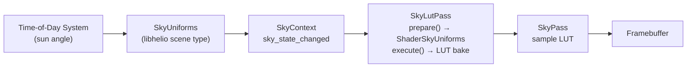

# Sky LUT Pass

The `SkyLutPass` bakes a 192×108 panoramic lookup texture that encodes physically-based single-scatter atmospheric luminance for every view direction around the horizon. It implements the sky-view LUT technique described in Sébastien Hillaire's 2020 EGSR paper, which observes that for an observer at sea level the sky colour depends only on view direction and sun angle — not on absolute camera position. By pre-integrating the atmosphere into this compact texture once per changed sky state, the downstream `SkyPass` can sample atmospheric luminance at O(1) cost per screen pixel instead of tracing a full radiative transfer integral for each one.

---

## 1. The Atmospheric Scattering Problem

The atmosphere is a participating medium: as sunlight travels through it, gas molecules and aerosol particles scatter some fraction of the beam sideways, and some of that scattered light reaches the observer's eye along the view ray. Computing this rigorously requires evaluating the radiative transfer equation along the view ray, computing the phase function at each sample point, and solving for the in-scattered solar radiance at each altitude. This is a nested integral: for each primary sample point along the view ray you must integrate the transmittance along a secondary ray toward the sun to determine how much solar illumination survives to that point.

In a naïve per-pixel implementation at 1280×720 with 16 primary steps, the fragment shader would execute on approximately 921 000 sky pixels. Each pixel requires one atmosphere boundary intersection, 16 primary sample points, and at each sample point an earth-shadow test plus a 4-step sun-transmittance integral — in total on the order of 23 million ray-sphere intersection evaluations and millions of exponential density evaluations per frame. At 60 Hz this is completely impractical.

The Hillaire technique exploits two key observations. First, the sky luminance at sea level is a function purely of view direction and sun position: the exact world-space camera translation is irrelevant because the planet is enormous relative to scene scale. Second, sky luminance is spatially very low frequency — adjacent view directions produce nearly identical colours. These two facts together mean the entire sky hemisphere can be pre-baked into a compact panoramic texture, sampled in O(1) by the rendering pass, and rebuilt only when the sun angle or atmosphere parameters change. The shader comment records the result directly: the LUT achieves approximately 46× cost reduction at 1280×720.

---

## 2. The Hillaire 2020 Atmospheric Model

Helio's atmosphere shader implements a single-scatter Nishita model with two participating species: air molecules (Rayleigh) and aerosols (Mie). The physics of each are fundamentally different and require separate treatment throughout the integration.

### 2.1 Rayleigh Scattering

Rayleigh scattering is caused by gas molecules — primarily O₂ and N₂ — whose physical size is far smaller than the wavelengths of visible light. The scattering cross-section scales as $\lambda^{-4}$, which is the reason the sky is blue: a photon of 450 nm blue light is scattered approximately $(700/450)^4 \approx 6.8\times$ more than a 700 nm red photon. Helio encodes this wavelength dependence directly in the per-channel scattering coefficient vector `rayleigh_scatter = [5.8×10⁻³, 1.35×10⁻², 3.31×10⁻²]` km⁻¹ for RGB respectively, with the red channel roughly $5.7\times$ smaller than the blue channel — closely matching the $\lambda^{-4}$ ratio for a visible-spectrum RGB discretisation.

The vertical density of air follows an exponential profile. At altitude $h$ above the surface the Rayleigh density is:

$$
\rho_r(h) = \exp\!\left(-\frac{h}{H \cdot s_r}\right)
$$

where $H = r_\text{atm} - r_\text{earth} = 60\,\text{km}$ is the atmosphere thickness and $s_r = 0.1$ is `rayleigh_h_scale`, giving a characteristic scale height of $60 \times 0.1 = 6\,\text{km}$. This matches the accepted mean scale height for Earth's atmosphere.

The Rayleigh phase function describes how light is distributed into different scattering angles $\theta$:

$$
P_r(\theta) = \frac{3}{16\pi}\left(1 + \cos^2\theta\right)
$$

This function is symmetric around $\theta = 0$ and $\theta = \pi$ — Rayleigh scattering sends equal energy forward and backward, with a minimum at 90°. The $\cos^2\theta$ dependence produces the characteristic slight brightening toward the sun and the anti-solar point.

### 2.2 Mie Scattering

Mie scattering is caused by aerosol particles — dust, haze, water droplets, pollen — whose size is comparable to the wavelength of light. Unlike Rayleigh, Mie scattering is nearly wavelength-independent (all RGB channels share the scalar coefficient `mie_scatter = 2.1×10⁻³` km⁻¹), but it is strongly anisotropic. Aerosols scatter a large fraction of energy in the forward direction, producing the bright white glare around the sun disk that is absent from a purely molecular atmosphere.

The Henyey-Greenstein phase function parametrises Mie anisotropy with a single asymmetry parameter $g \in (-1, 1)$:

$$
P_m(\theta, g) = \frac{3(1-g^2)}{8\pi(2+g^2)} \cdot \frac{1+\cos^2\theta}{\left(1 + g^2 - 2g\cos\theta\right)^{3/2}}
$$

Helio uses $g = 0.76$ (`mie_g`). At $g = 0$ the function reduces to isotropic; as $g \to 1$ it concentrates almost all energy into an infinitely narrow forward lobe. The value 0.76 is a standard fit for typical clear-sky aerosols, producing a visible forward peak without over-brightening the sun halo. The aerosol density follows the same exponential form as Rayleigh but with a lower scale height controlled by `mie_h_scale = 0.075`, giving $60 \times 0.075 = 4.5\,\text{km}$ — aerosols are more concentrated near the surface than clean air.

### 2.3 Beer-Lambert Transmittance

As light travels a distance $\Delta s$ through a medium with extinction coefficient $\kappa$, the surviving fraction follows the Beer-Lambert law:

$$
T = \exp(-\kappa \cdot \Delta s)
$$

For a non-homogeneous medium the exponent becomes an integral, but the exponential form is preserved. In the shader the total optical depth $\tau$ from camera position to a sample point accumulates contributions from both species:

$$
\tau_r = \sigma_r \cdot D_r, \qquad \tau_m = \sigma_m \cdot 1.11 \cdot D_m
$$

where $\sigma_r$ and $\sigma_m$ are the scattering coefficients, $D_r$ and $D_m$ are the integrated density values, and the factor 1.11 accounts for Mie extinction being larger than Mie scattering (aerosols absorb as well as scatter). The combined transmittance is then:

$$
T = \exp\!\left(-\tau_r - \tau_m\right) = \exp\!\left(-(\sigma_r \cdot D_r + \sigma_m \cdot 1.11 \cdot D_m)\right)
$$

This transmittance is computed twice per sample: once along the view ray from the camera to the sample point (camera transmittance), and once along the shadow ray from the sample point toward the sun (sun transmittance). Their product gives the total fraction of sunlight that reaches the camera after passing through both path segments.

### 2.4 Single-Scatter Approximation

The physically complete solution requires integrating all orders of light scattering — photons that scatter once, then again, then again. In practice, single scatter (each sample considers only the direct solar contribution, not light scattered from other atmosphere columns) captures the dominant visual features for clear-sky conditions: the blue sky, the orange horizon at sunset, and the Mie forward peak around the sun. The error manifests mainly in the absence of multiple-scatter brightening of the sky dome at low sun angles, which would require either pre-computed transmittance LUTs or iterative radiance cascades to handle exactly. For most real-time applications the single-scatter result is indistinguishable from reference at high sun angles, and acceptably close near the horizon.

---

## 3. LUT Resolution and Panoramic Parametrisation

The LUT texture is allocated at 192×108, a 16:9 aspect ratio with 20 736 texels total. At the `Rgba16Float` format (8 bytes per texel) this occupies approximately 162 KB — a negligible cost for a resource that replaces millions of per-pixel integration calls each frame.

The choice of 192×108 rather than a round number is deliberate. The 16:9 aspect matches the typical display aspect ratio used by the downstream `SkyPass`, minimising anisotropic stretching when the LUT is sampled with bilinear filtering. The resolution itself is a compromise: atmospheric luminance is smooth enough that 192 texels of horizontal resolution produces no visible banding even under close scrutiny, while the small texel count keeps the baking pass fast on any hardware tier.

The UV-to-direction mapping avoids a naive linear elevation parametrisation. If $v$ mapped linearly to elevation angle, the texels would be equally spaced in angle across the full $-90°$ to $+90°$ range. Since most of the visual detail in a sky — the horizon glow, the Rayleigh-Mie transition band, the belt of Venus — is concentrated within 15° to 20° of the horizon, a linear mapping wastes most texels on the featureless zenith. Instead the shader uses a sine mapping:

$$
v = \sin(\text{elev}) \cdot 0.5 + 0.5 \quad \Longleftrightarrow \quad \sin(\text{elev}) = v \cdot 2 - 1
$$

Because $\sin^{-1}$ has an infinite derivative at $\pm 1$ and a finite derivative of 1 at 0, this concentrates texels near the horizon (where $\sin\theta \approx \theta$ and small elevation changes map to large $v$ changes) relative to the zenith. The effect is a non-uniform but analytically invertible distribution that provides roughly twice the effective resolution near the horizon compared to a linear map.

The full UV-to-direction decode in the fragment shader is:

$$
\text{azimuth} = (u - 0.5) \cdot 2\pi \quad \in [-\pi,\, \pi]
$$

$$
\sin(\text{elev}) = v \cdot 2 - 1 \quad \in [-1,\, 1]
$$

$$
\cos(\text{elev}) = \sqrt{\max(1 - \sin^2(\text{elev}),\, 0)}
$$

$$
\hat{d} = \bigl(\cos(\text{elev})\cdot\cos(\text{az}),\ \sin(\text{elev}),\ \cos(\text{elev})\cdot\sin(\text{az})\bigr)
$$

The result is a right-handed direction vector in world space with Y pointing up, spanning a full sphere in azimuth and a hemisphere (plus a small region below the horizon to $v = 0$) in elevation. Texels below $\sin(\text{elev}) < -0.01$ store black; the sky rendering pass handles the ground plane separately.

> [!NOTE]
> Azimuth $u = 0.5$ maps to $\text{az} = 0$, which points in the $+X$ direction. The LUT wraps continuously in the horizontal direction because increasing azimuth past $\pi$ at $u = 1$ returns to $-\pi$ at $u = 0$ — these are the same direction, so no seam is visible when the LUT is sampled with repeat addressing.

---

## 4. The Integration Loop

The atmosphere integration is split into two functions: `optical_depth`, which computes the integrated medium density along a ray segment, and `atmosphere`, which assembles the full single-scatter radiance estimate.

### 4.1 Ray-Sphere Intersection

Both functions rely on `ray_sphere`, which solves the ray-sphere intersection analytically:

```wgsl
fn ray_sphere(ro: vec3<f32>, rd: vec3<f32>, r: f32) -> vec2<f32> {
    let b    = dot(ro, rd);
    let c    = dot(ro, ro) - r * r;
    let disc = b * b - c;
    if disc < 0.0 { return vec2<f32>(-1.0, -1.0); }
    let s = sqrt(disc);
    return vec2<f32>(-b - s, -b + s);
}
```

The function returns $\vec{2}(t_\text{near}, t_\text{far})$ in the parametric form $\mathbf{p} = \mathbf{o} + t\hat{d}$. A return value of $(-1, -1)$ indicates a miss. The derivation follows by substituting the ray equation into the sphere equation $|\mathbf{o} + t\hat{d}|^2 = r^2$ and solving the resulting quadratic.

### 4.2 Optical Depth Sub-Integral

The `optical_depth` function uses 4-step midpoint quadrature to integrate the medium density along a ray segment of length `ray_len`. For each sub-step the altitude $h = |\mathbf{p}| - r_\text{earth}$ is computed and the density evaluated using the exponential density model:

```wgsl
fn optical_depth(ro: vec3<f32>, rd: vec3<f32>, ray_len: f32) -> vec2<f32> {
    var dr = 0.0; var dm = 0.0;
    let ds = ray_len / f32(DEPTH_STEPS);
    var t  = ds * 0.5;
    for (var i = 0u; i < DEPTH_STEPS; i++) {
        let p  = ro + rd * t;
        let h  = max(length(p) - sky.earth_radius, 0.0);
        let th = sky.atm_radius - sky.earth_radius;
        dr += exp(-h / (th * sky.rayleigh_h_scale)) * ds;
        dm += exp(-h / (th * sky.mie_h_scale))      * ds;
        t  += ds;
    }
    return vec2<f32>(dr, dm);
}
```

The returned `vec2f` holds $(D_r, D_m)$, the dimensioned optical depths in km for Rayleigh and Mie respectively. Multiplying by the scattering coefficients $\sigma_r$ and $\sigma_m$ gives the dimensionless optical depths $\tau_r$ and $\tau_m$ used in the Beer-Lambert exponent. Only 4 sub-steps are used here because `optical_depth` is called once per primary step — using more would multiply the cost linearly. The total integration cost is $N_\text{primary} \times N_\text{depth} = 16 \times 4 = 64$ exponential evaluations per LUT texel for each of the two species.

### 4.3 Primary Atmosphere Integration

The `atmosphere` function performs the 16-step primary ray march:

```wgsl
fn atmosphere(ro: vec3<f32>, rd: vec3<f32>) -> vec3<f32> {
    let atm_hit = ray_sphere(ro, rd, sky.atm_radius);
    if atm_hit.y < 0.0 { return vec3<f32>(0.0); }

    let t_start   = max(atm_hit.x, 0.0);
    let seg_len   = atm_hit.y - t_start;
    let ds        = seg_len / f32(ATMO_STEPS);
    let cos_theta = dot(rd, sky.sun_direction);
    let pr        = phase_rayleigh(cos_theta);
    let pm        = phase_mie(cos_theta, sky.mie_g);

    var scatter_r = vec3<f32>(0.0);
    var scatter_m = vec3<f32>(0.0);
    var t         = t_start + ds * 0.5;

    for (var i = 0u; i < ATMO_STEPS; i++) {
        let p  = ro + rd * t;
        let h  = max(length(p) - sky.earth_radius, 0.0);
        let th = sky.atm_radius - sky.earth_radius;

        let density_r = exp(-h / (th * sky.rayleigh_h_scale));
        let density_m = exp(-h / (th * sky.mie_h_scale));

        let earth_hit = ray_sphere(p, sky.sun_direction, sky.earth_radius);
        if earth_hit.x < 0.0 || earth_hit.y < 0.0 {
            let depth_cam = optical_depth(ro, rd, t);
            let sun_atm   = ray_sphere(p, sky.sun_direction, sky.atm_radius);
            let depth_sun = optical_depth(p, sky.sun_direction, max(sun_atm.y, 0.0));
            let tau_r     = sky.rayleigh_scatter * (depth_cam.x + depth_sun.x);
            let tau_m     = sky.mie_scatter * 1.11 * (depth_cam.y + depth_sun.y);
            let transmit  = exp(-(tau_r + vec3<f32>(tau_m)));
            scatter_r    += density_r * transmit * ds;
            scatter_m    += density_m * transmit * ds;
        }
        t += ds;
    }

    return sky.sun_intensity * (
        pr * sky.rayleigh_scatter * scatter_r +
        pm * sky.mie_scatter      * scatter_m
    );
}
```

Each iteration advances along the view ray in equal-length steps $\Delta s = (t_\text{far} - t_\text{start}) / 16$, using midpoint quadrature. At each step the earth shadow test fires a ray from the sample point $\mathbf{p}$ toward `sun_direction` and calls `ray_sphere` against `earth_radius`. If both returned intersection parameters are non-negative, the earth lies between the sample point and the sun — the sample is in shadow and contributes no in-scattered light. When neither intersection parameter is positive (disc < 0, or the earth is entirely behind the point), the sample is sunlit and the full optical depth chain is evaluated.

The phase functions $P_r$ and $P_m$ are computed once before the loop, because `cos_theta = dot(rd, sun_direction)` is constant across all steps for a single view direction and sun position. This is a deliberate optimisation: the phase value depends only on the angle between the view ray and the sun ray, not on the sample point's altitude.

> [!IMPORTANT]
> The `optical_depth(ro, rd, t)` call integrates from the **camera origin** to the current distance `t` along the view ray, not from the sample point backwards. This gives the camera-to-sample transmittance. The sun transmittance is then integrated forward from the sample point to the atmosphere boundary along `sun_direction`. The two optical depth values are summed before computing `transmit`, giving the total extinction on the camera–sample–sun path.

The final return value scales the accumulated scatter by `sun_intensity`, the per-channel scattering coefficients, and the phase function:

$$
L = I_\odot \left(P_r \cdot \sigma_r \cdot \int \rho_r(\mathbf{p})\,T(\mathbf{p})\,\mathrm{d}s + P_m \cdot \sigma_m \cdot \int \rho_m(\mathbf{p})\,T(\mathbf{p})\,\mathrm{d}s\right)
$$

This is the single-scatter in-band solar radiance arriving at the camera from direction $\hat{d}$. The integral is approximated by the midpoint sums `scatter_r` and `scatter_m`.

---

## 5. ShaderSkyUniforms — Complete Field Reference

The `ShaderSkyUniforms` struct is 112 bytes, 16-byte aligned, and mirrors the WGSL `SkyUniforms` layout exactly using `#[repr(C)]` and `bytemuck::Pod`. Every field is uploaded at the start of `prepare()` via a single `queue.write_buffer()` call.

| Field | Type | Default | Physical Meaning |
|---|---|---|---|
| `sun_direction` | `[f32; 3]` | normalised `[0, 0.9, 0.4]` | Normalised world-space direction toward the sun. Y+ is up. |
| `sun_intensity` | `f32` | `22.0` | Solar irradiance scale in W·m⁻²-like units. Controls overall sky brightness. |
| `rayleigh_scatter` | `[f32; 3]` | `[5.8e-3, 1.35e-2, 3.31e-2]` | Per-channel Rayleigh scattering coefficient in km⁻¹. Encodes the $\lambda^{-4}$ wavelength dependence. |
| `rayleigh_h_scale` | `f32` | `0.1` | Fractional Rayleigh scale height. Multiplied by `atm_radius - earth_radius` (60 km) to give 6 km characteristic scale height. |
| `mie_scatter` | `f32` | `2.1e-3` | Mie scattering coefficient in km⁻¹. Wavelength-independent; shared across all RGB channels. |
| `mie_h_scale` | `f32` | `0.075` | Fractional Mie scale height. Gives $60 \times 0.075 = 4.5\,\text{km}$ — aerosols are more concentrated near the surface. |
| `mie_g` | `f32` | `0.76` | Henyey-Greenstein asymmetry parameter. Range $(-1, 1)$; 0 = isotropic, 0.76 = strong forward peak. |
| `sun_disk_cos` | `f32` | `0.9998` | Cosine of the sun's angular radius ($\approx \cos 1.3°$). Used by the sky pass to render the solar disk: view directions with $\cos\theta > $ this value are inside the disk. |
| `earth_radius` | `f32` | `6360.0` | Earth's radius in kilometres. |
| `atm_radius` | `f32` | `6420.0` | Atmosphere outer boundary radius in kilometres. The difference $6420 - 6360 = 60\,\text{km}$ is the atmosphere thickness. |
| `exposure` | `f32` | `0.1` | Pre-exposure multiplier. The LUT stores radiance values before tone mapping; this factor is applied by the consuming pass. |
| `clouds_enabled` | `u32` | `0` | Boolean flag. Non-zero activates cloud integration in a future cloud rendering stage. |
| `cloud_coverage` | `f32` | `0.0` | Fraction of sky covered by clouds, $[0, 1]$. |
| `cloud_density` | `f32` | `0.0` | Optical thickness of the cloud layer. |
| `cloud_base` | `f32` | `0.0` | Cloud base altitude in kilometres above sea level. |
| `cloud_top` | `f32` | `0.0` | Cloud top altitude in kilometres above sea level. |
| `cloud_wind_x` | `f32` | `0.0` | Cloud drift velocity in the world X direction, in km/s. |
| `cloud_wind_z` | `f32` | `0.0` | Cloud drift velocity in the world Z direction, in km/s. |
| `cloud_speed` | `f32` | `0.0` | Global cloud animation speed multiplier. |
| `time_sky` | `f32` | `0.0` | Accumulated sky time in seconds. Drives cloud noise animation. |
| `skylight_intensity` | `f32` | `0.0` | Ambient skylight contribution scale for indirect diffuse. |
| `_pad0`, `_pad1`, `_pad2` | `f32` × 3 | `0.0` | Explicit padding to reach 112 bytes and maintain 16-byte alignment. |

> [!NOTE]
> The `sun_disk_cos` threshold of `0.9998` corresponds to an angular radius of $\cos^{-1}(0.9998) \approx 1.15°$, which is slightly larger than the true solar disk (radius $\approx 0.27°$). The larger value compensates for the discrete UV resolution of the LUT: a true $0.27°$ disk would be sub-texel at 192-wide resolution and disappear entirely. The downstream sky pass renders the sun disk at a more accurate size using a separate analytical disk test against the same `sun_disk_cos` parameter.

---

## 6. Cloud Parameters

The eight cloud-related fields — `clouds_enabled`, `cloud_coverage`, `cloud_density`, `cloud_base`, `cloud_top`, `cloud_wind_x`, `cloud_wind_z`, and `cloud_speed`, along with `time_sky` — are present in `ShaderSkyUniforms` and occupy the struct's upper 36 bytes. In the current version all cloud defaults are zero and no cloud rendering code is active in the LUT shader. The fields are reserved for a future volumetric cloud integration that would layer cloud shadows and inscattering on top of the clear-sky atmosphere result.

When cloud integration is implemented, `clouds_enabled` will gate a second ray march through the cloud layer bounded by `cloud_base` and `cloud_top`. The `cloud_coverage` and `cloud_density` values control the procedural noise threshold and opacity of this layer, while `cloud_wind_x`, `cloud_wind_z`, and `cloud_speed` drive an offset into a tileable 3D noise texture that is sampled using `time_sky` as the temporal coordinate. The LUT parametrisation is well-suited to this extension: a single cloud noise evaluation per primary step at the cloud altitude can inject volumetric shadow terms and additional in-scattered light without changing the outer integration structure.

> [!TIP]
> Because the cloud parameters are already present in the uniform buffer and in the shader's `SkyUniforms` WGSL struct, adding cloud rendering requires only shader code changes — no Rust-side struct modifications, buffer reallocations, or bind group layout changes.

---

## 7. Lazy Update and Cost

The `SkyContext` type in `libhelio` carries a `sky_state_changed` boolean that is set true whenever the sun direction, sun intensity, or any atmosphere parameter changes — for example when an in-game time-of-day system advances the sun's position. The intended design is for `SkyLutPass::prepare()` to inspect this flag and skip the buffer write and subsequent LUT rebuild when the sky is static:

```rust
pub struct SkyContext {
    pub has_sky: bool,
    pub sky_state_changed: bool,  // LUT needs rebuild this frame
    pub sky_color: [f32; 3],      // approximation ambient for non-sky areas
}
```

A static sky — one where neither the sun nor atmosphere parameters change between frames — pays near-zero GPU cost after the first frame. The LUT texture persists across frames as a regular texture binding; the downstream `SkyPass` simply continues sampling the cached result. The render pass itself is not submitted at all when there is nothing to update, meaning the GPU sees no draw call for the LUT on those frames.

The current `prepare()` implementation always uploads `ShaderSkyUniforms::earth_like()` regardless of `sky_state_changed`, which serves as a correct and stable placeholder during development:

```rust
fn prepare(&mut self, ctx: &PrepareContext) -> HelioResult<()> {
    let uniforms = ShaderSkyUniforms::earth_like();
    ctx.write_buffer(&self.sky_uniform_buf, 0, bytemuck::bytes_of(&uniforms));
    Ok(())
}
```

This means the LUT is rebuilt every frame in the current code. The lazy path — gating the write and the draw on `ctx.sky.sky_state_changed` — is the intended production behaviour and is a straightforward extension of the existing structure.

---

## 8. The Fullscreen Triangle Draw

Like `DeferredLightPass`, the sky LUT pass rasterises a single oversized triangle that covers the entire render target. No vertex buffer is needed; the vertex shader generates clip-space positions from the hardware `vertex_index` builtin:

```wgsl
@vertex
fn vs_main(@builtin(vertex_index) vid: u32) -> VertexOutput {
    let pos = array<vec2<f32>, 3>(
        vec2<f32>(-1.0, -1.0),
        vec2<f32>( 3.0, -1.0),
        vec2<f32>(-1.0,  3.0),
    );
    let xy = pos[vid];
    var out: VertexOutput;
    out.clip_pos = vec4<f32>(xy, 0.0, 1.0);
    out.uv       = xy * 0.5 + 0.5; // [0,1]
    return out;
}
```

The three vertices form a right triangle in NDC with legs of length 4 along each axis. The $[-1, 1]^2$ unit square sits entirely inside this triangle; the GPU clips the excess area before rasterisation. The UV interpolation `xy * 0.5 + 0.5` maps the NDC square to $[0,1]^2$ at the clip boundary, providing correct panoramic UV coordinates to `fs_main` across the entire 192×108 target.

The Rust-side draw call requires no buffer binding at all:

```rust
pass.set_pipeline(&self.pipeline);
pass.set_bind_group(0, &self.bind_group_0, &[]);
pass.set_bind_group(1, &self.bind_group_1, &[]);
pass.draw(0..3, 0..1);
```

The render target is cleared to black at load time (`wgpu::LoadOp::Clear(wgpu::Color::BLACK)`), and the depth-stencil attachment is `None` — the LUT is a pure compute-style render and has no use for a depth buffer.

> [!NOTE]
> The pipeline is constructed with `depth_stencil: None` and `blend: None`. There is no alpha blending because every texel is written exactly once and the output is pre-exposed linear HDR radiance, not a composited result. The `Rgba16Float` format stores the full floating-point range without clamping, which is essential for HDR values at low sun angles where sky luminance can span several orders of magnitude.

---

## 9. Integration and the Rust API

`SkyLutPass::publish()` writes a reference to the LUT texture view into the shared `FrameResources` structure, making it available to every subsequent pass in the frame graph:

```rust
fn publish<'a>(&'a self, frame: &mut libhelio::FrameResources<'a>) {
    frame.sky_lut = Some(&self.sky_lut_view);
}
```

The downstream `SkyPass` consumes `frame.sky_lut` by binding it as a `texture_2d<f32>` and sampling it using the panoramic inverse mapping: for each sky pixel it converts the view direction to azimuth and $\sin(\text{elev})$, computes the UV, and samples the LUT with bilinear filtering. The sampling is a single `textureSample` call — the entire atmospheric integration is amortised into that one instruction.

The `SkyUniforms` struct in `libhelio` provides the higher-level API that the engine's scene system uses to describe sky state. It is a compact 48-byte structure carrying three `vec4` fields:

```rust
pub struct SkyUniforms {
    pub sun_direction: [f32; 4],  // xyz: normalised direction, w: sun angular radius
    pub sun_color:     [f32; 4],  // xyz: linear irradiance, w: exposure
    pub rayleigh_mie:  [f32; 4],  // xyz: Rayleigh coefficients, w: Mie asymmetry g
}
```

This is not the same layout as `ShaderSkyUniforms`. `SkyUniforms` is a scene-graph type — it carries only the fields that are meaningful to the rest of the engine (sun colour, exposure, Rayleigh/Mie summary) and omits the integration-specific parameters like `earth_radius`, `atm_radius`, and the cloud fields. The `SkyLutPass::prepare()` method is responsible for deriving a `ShaderSkyUniforms` from the engine's `SkyUniforms` before upload. In the current implementation this derivation is bypassed by the `earth_like()` defaults, but the intended pipeline is for `prepare()` to receive a `SkyContext` and map `SkyUniforms` fields to `ShaderSkyUniforms` fields, propagating changes driven by the time-of-day system.



The separation between `SkyUniforms` (scene API) and `ShaderSkyUniforms` (shader layout) is a deliberate boundary: the scene layer remains independent of the shader's packing requirements and padding constraints, while the pass layer is free to restructure the data for optimal GPU alignment without touching the public API.
