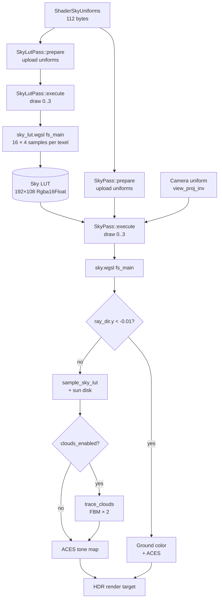
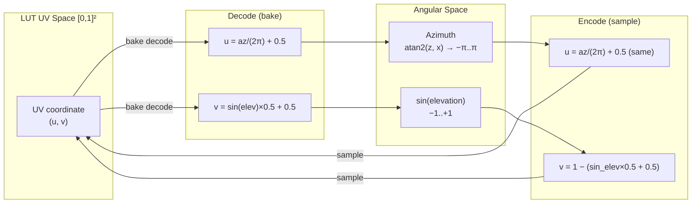

Helio's sky system is a two-pass, physically-based atmosphere renderer built on the **Hillaire 2020** single-scatter model. It separates the expensive atmosphere integration from the per-frame sky draw by caching the full hemisphere of sky colors into a compact **192×108 panoramic LUT** (Look-Up Texture). The main sky render pass then samples this LUT for each sky pixel — reducing the cost of accurate atmospheric scattering to a single bilinear texture fetch per fragment.

The two passes are:

| Pass | Source Crate | Role |
|------|-------------|------|
| `SkyLutPass` | `helio-pass-sky-lut` | Bakes the Hillaire atmosphere integral into a 192×108 `Rgba16Float` panoramic LUT |
| `SkyPass` | `helio-pass-sky` | Full-screen triangle draw; samples the LUT, composites the sun disk, and renders procedural clouds |

---

## 1. Two-Pass Architecture

### Why a LUT at All?

Computing atmospheric scattering directly inside the sky fragment shader — evaluating the full in-scattering integral along each view ray — requires stepping through the atmosphere, sampling optical depth toward the sun at each step, and accumulating Rayleigh and Mie contributions. The `atmosphere()` function in `sky_lut.wgsl` uses:

- `ATMO_STEPS = 16` primary samples along the view ray
- `DEPTH_STEPS = 4` optical-depth sub-samples toward the sun at each primary step

That is 16 × (1 + 4) = 80 transcendental evaluations (`exp`, `sqrt`, `dot`) per ray. At a 1920×1080 render target, that is **165 million atmosphere integrations per frame**. At 60 FPS this is completely untenable.

The LUT amortises this cost. The atmosphere function is evaluated **once per LUT texel** (up to 192×108 = 20 736 texels) at bake time. The main sky pass then queries the result with a single hardware-interpolated `textureSample`. The cost ratio for a 1080p render is:

$$
\text{speedup} = \frac{1920 \times 1080}{192 \times 108} = \frac{2{,}073{,}600}{20{,}736} \approx 100\times
$$

In practice the `sky_lut.wgsl` header comments quote **~46× cost reduction at 1280×720**, reflecting the overhead of the LUT bake itself plus the sampling cost. Regardless, the saving is enormous and makes real-time sky rendering tractable.

### Producer-Consumer Relationship

```
SkyLutPass (producer)          SkyPass (consumer)
──────────────────────         ──────────────────────────
 ShaderSkyUniforms              ShaderSkyUniforms (same data)
 camera uniform (group 0)       camera uniform (group 0)
         │                              │
         ▼                              ▼
  192×108 Rgba16Float ──────────► sample_sky_lut(ray_dir)
     sky LUT texture                    │
                                 + sun disk
                                 + trace_clouds()
                                 + ACES tone map
                                        │
                                        ▼
                                  HDR render target
```

`SkyLutPass` publishes its LUT view through `frame.sky_lut`, which `SkyPass` holds a reference to as a `texture_2d<f32>` binding. Both passes share the same `ShaderSkyUniforms` layout (112 bytes) and are driven from the same `earth_like()` defaults.

> [!IMPORTANT]
> Both `SkyLutPass` and `SkyPass` maintain **independent** copies of the sky uniform buffer. If you change sky parameters at runtime you must upload the new uniforms to both passes. In the future, a shared `SkySystem` component uploads once to a single buffer that both passes share by reference.

---

## 2. The Hillaire 2020 Algorithm

### Physical Background

The Hillaire 2020 paper (*"A Scalable and Production Ready Sky and Atmosphere Rendering Technique"*, EGSR 2020) describes a multi-LUT approach to single-scatter atmospheric rendering that is both physically accurate and fast enough for real-time use. Helio implements the core **atmosphere integral** from that paper using two scattering models.

#### Rayleigh Scattering

Rayleigh scattering describes how light interacts with air molecules whose diameter is much smaller than the wavelength of light. The scattering coefficient scales with the inverse fourth power of wavelength — short (blue) wavelengths scatter ~5× more than long (red) wavelengths. This produces the characteristic blue sky at midday and red sunsets when the sun is near the horizon.

The Rayleigh phase function — the angular distribution of scattered light — is:

$$
P_R(\theta) = \frac{3}{16\pi}(1 + \cos^2\theta)
$$

where $$\theta$$ is the angle between the incoming light direction (toward the sun) and the view direction. The function is **symmetric in forward and backward directions**: Rayleigh scattering has no preferred forward lobe, producing the evenly-lit blue hemisphere.

#### Mie Scattering

Mie scattering describes how light interacts with particles comparable in size to the wavelength — water droplets, dust, aerosols. Unlike Rayleigh scattering, Mie scattering is nearly wavelength-independent (producing the white haze near the horizon and white clouds) but strongly **forward-scattering**: aerosols preferentially scatter light in the direction of the incident ray.

Helio models the Mie phase function using the **Henyey-Greenstein** approximation:

$$
P_M(\theta, g) = \frac{3(1 - g^2)}{8\pi(2 + g^2)} \cdot \frac{1 + \cos^2\theta}{(1 + g^2 - 2g\cos\theta)^{3/2}}
$$

where $$g$$ is the **asymmetry parameter** (`mie_g` in `ShaderSkyUniforms`). When $$g = 0$$ the phase function is isotropic (identical to Rayleigh). When $$g \to 1$$ scattering is entirely forward. Real aerosols have $$g \approx 0.7$$–$$0.9$$; Helio's default is `mie_g = 0.76`.

Note that the WGSL implementation uses a slightly modified normalisation constant matching the variant in Hillaire 2020:

```wgsl
fn phase_mie(cos_theta: f32, g: f32) -> f32 {
    let g2 = g * g;
    let denom = 1.0 + g2 - 2.0 * g * cos_theta;
    return (3.0 * (1.0 - g2)) / (8.0 * PI * (2.0 + g2)) *
           ((1.0 + cos_theta * cos_theta) / pow(max(denom, 1e-5), 1.5));
}
```

#### Density Profiles

Both Rayleigh and Mie density fall off exponentially with altitude. The exponent is controlled by the **scale height** — the altitude at which density drops to $$1/e$$ of sea level. In `ShaderSkyUniforms`, these are stored as fractions of the total atmosphere thickness:

$$
\rho_R(h) = \exp\!\left(-\frac{h}{H_R \cdot H_{\text{atm}}}\right), \quad \rho_M(h) = \exp\!\left(-\frac{h}{H_M \cdot H_{\text{atm}}}\right)
$$

where $$H_{\text{atm}} = r_{\text{atm}} - r_{\text{earth}} = 6420 - 6360 = 60\,\text{km}$$ is the atmosphere thickness, and $$H_R$$ (`rayleigh_h_scale = 0.1`) and $$H_M$$ (`mie_h_scale = 0.075`) are the fractional scale heights. In physical kilometres:

$$
H_R^{\text{km}} = 0.1 \times 60\,\text{km} = 6\,\text{km}, \quad H_M^{\text{km}} = 0.075 \times 60\,\text{km} = 4.5\,\text{km}
$$

These are close to the Earth's standard atmosphere Rayleigh scale height of ~8 km. The discrepancy arises from the normalised storage format — the shaders divide by `(atm_radius - earth_radius) * scale_height` rather than by a bare scale height in km, keeping both passes consistent without unit-conversion logic.

#### The Atmosphere Integral

At each primary sample point along the view ray, the WGSL code computes the combined transmittance from the camera to that point and from that point toward the sun:

```wgsl
let tau_r = sky.rayleigh_scatter * (depth_cam.x + depth_sun.x);
let tau_m = sky.mie_scatter * 1.11 * (depth_cam.y + depth_sun.y);
let transmit = exp(-(tau_r + vec3<f32>(tau_m)));
```

The factor `1.11` on `tau_m` is the standard Mie extinction-to-scatter ratio for real aerosols (extinction = scattering + absorption; aerosols absorb ~10% of the scattered contribution). Points inside Earth's shadow (positive `ray_sphere` intersection with `earth_radius`) are skipped entirely.

---

## 3. The Sky LUT — Specification and Layout

### Texture Parameters

| Property | Value |
|----------|-------|
| Width | 192 pixels |
| Height | 108 pixels |
| Total texels | 20 736 |
| Format | `Rgba16Float` |
| Mip levels | 1 |
| Sample count | 1 |
| Usage flags | `RENDER_ATTACHMENT \| TEXTURE_BINDING` |
| Address mode U/V | `ClampToEdge` |
| Min/Mag filter | `Linear` |
| Mip filter | `Nearest` |

The 192×108 dimensions match a 16:9 aspect ratio identical to a small HD display. This is intentional: the panoramic encoding assigns one texel per uniform solid-angle sample in elevation/azimuth space, and the 16:9 aspect ensures consistent sampling density across both axes. 20 736 texels is trivial for the GPU to generate (microseconds on any modern GPU) but sufficient for smooth sky gradients — the LUT is bilinearly interpolated by the hardware sampler, so even a 64×36 LUT would look plausible.

`Rgba16Float` (RGBA half-float) stores 2 bytes per channel, delivering sufficient precision for HDR sky luminances. A full 32-bit `Rgba32Float` would be 4× larger (63 KB vs 16 KB) with no visible quality gain for a smoothly-varying sky signal. The alpha channel is unused (always 1.0) and reserved for future transmittance storage.

### Panoramic UV Encoding

The LUT maps a 2D UV coordinate to a hemisphere of sky directions using a **panoramic equirectangular-like projection with sine-mapped elevation**:

| UV axis | Mapped quantity | Formula |
|---------|----------------|---------|
| U (horizontal) | Azimuth | `u = azimuth / (2π) + 0.5`, range `[0, 1]` |
| V (vertical, bake) | Elevation (sine-mapped) | `v = sin(elevation) × 0.5 + 0.5`, range `[0, 1]` |
| V (vertical, sample) | Elevation (inverted) | `v = 1.0 - (sin_elev × 0.5 + 0.5)` |

The sine mapping for elevation (`v = sin(elev) × 0.5 + 0.5`) is preferred over a linear elevation mapping because it concentrates texels near the horizon where the angular gradient of sky color is steepest. Near the zenith the sky changes slowly, so fewer texels are wasted there.

The inversion when sampling (`v = 1.0 - ...`) compensates for the NDC-to-texture-coordinate flip: in clip space Y increases upward, but in texture V increases downward. The bake shader and sample function are designed to be consistent with each other.

From the bake shader (`sky_lut.wgsl`):

```wgsl
@fragment
fn fs_main(in: VertexOutput) -> @location(0) vec4<f32> {
    let uv = in.uv; // [0,1]²

    // Decode direction from panoramic UV
    //   u → azimuth: 0..1 maps to -π..π
    //   v → elevation via inverse-sin: 0..1 maps to -π/2..π/2
    let azimuth   = (uv.x - 0.5) * 2.0 * PI;
    let sin_elev  = uv.y * 2.0 - 1.0;        // [-1, 1]
    let cos_elev  = sqrt(max(1.0 - sin_elev * sin_elev, 0.0));
    let ray_dir   = vec3<f32>(
        cos_elev * cos(azimuth),
        sin_elev,
        cos_elev * sin(azimuth),
    );

    // Place camera at Earth's surface (just above ground)
    let cam_atm = vec3<f32>(0.0, sky.earth_radius + 0.001, 0.0);

    // Below horizon → store black (main pass handles ground separately)
    if sin_elev < -0.01 {
        return vec4<f32>(0.0, 0.0, 0.0, 1.0);
    }

    let col = atmosphere(cam_atm, ray_dir);
    return vec4<f32>(col, 1.0);
}
```

From the sample function (`sky.wgsl`):

```wgsl
fn sample_sky_lut(ray_dir: vec3<f32>) -> vec3<f32> {
    let azimuth  = atan2(ray_dir.z, ray_dir.x);        // -π..π
    let sin_elev = clamp(ray_dir.y, -1.0, 1.0);
    let u = azimuth / (2.0 * PI) + 0.5;
    // V is inverted: NDC y=+1 (top of framebuffer) → texture row 0 → sin_elev=+1,
    // so v=0 corresponds to sin_elev=+1 (looking up), v=1 to sin_elev=-1 (below horizon).
    let v = 1.0 - (sin_elev * 0.5 + 0.5);
    return textureSample(sky_lut, sky_sampler, vec2<f32>(u, v)).rgb;
}
```

> [!NOTE]
> The LUT stores **pre-exposed** HDR values — the `exposure` scale factor is applied in the `SkyPass` fragment shader during final tone-mapping, not during baking. This lets the same LUT be reused if only exposure changes (though in practice exposure change is cheap to re-bake anyway).

---

## 4. `ShaderSkyUniforms` — Complete Field Reference

Both `SkyLutPass` and `SkyPass` declare an identical 112-byte uniform buffer layout. In Rust:

```rust
/// Sky uniforms matching the WGSL shader layout (112 bytes, 16-byte aligned).
#[repr(C)]
#[derive(Clone, Copy, Pod, Zeroable)]
struct ShaderSkyUniforms {
    sun_direction:      [f32; 3],
    sun_intensity:      f32,
    rayleigh_scatter:   [f32; 3],
    rayleigh_h_scale:   f32,
    mie_scatter:        f32,
    mie_h_scale:        f32,
    mie_g:              f32,
    sun_disk_cos:       f32,
    earth_radius:       f32,
    atm_radius:         f32,
    exposure:           f32,
    clouds_enabled:     u32,
    cloud_coverage:     f32,
    cloud_density:      f32,
    cloud_base:         f32,
    cloud_top:          f32,
    cloud_wind_x:       f32,
    cloud_wind_z:       f32,
    cloud_speed:        f32,
    time_sky:           f32,
    skylight_intensity: f32,
    _pad0: f32, _pad1: f32, _pad2: f32,
}
```

### Field Descriptions and Defaults

The `earth_like()` constructor provides physically grounded defaults for a clear Earth atmosphere at midday:

| Field | Type | Offset | Default | Description |
|-------|------|--------|---------|-------------|
| `sun_direction` | `[f32; 3]` | 0 | `[0.0, 0.914, 0.406]` | Normalised world-space direction **toward** the sun. Y-up convention. Derives from `[0.0, 0.9, 0.4]` normalised. |
| `sun_intensity` | `f32` | 12 | `22.0` | Solar irradiance multiplier applied to all in-scattering accumulation and the sun disk contribution. |
| `rayleigh_scatter` | `[f32; 3]` | 16 | `[5.8e-3, 1.35e-2, 3.31e-2]` | Per-channel (R, G, B) Rayleigh scattering coefficient in km⁻¹. The strong blue bias (B ≈ 5.7× R) produces the Earth's blue sky. |
| `rayleigh_h_scale` | `f32` | 28 | `0.1` | Rayleigh scale height as a fraction of atmosphere thickness `(atm_radius - earth_radius)`. Physical equivalent: 0.1 × 60 km = 6 km. |
| `mie_scatter` | `f32` | 32 | `2.1e-3` | Mie scattering coefficient in km⁻¹. The extinction coefficient used in `tau_m` is `mie_scatter × 1.11`. |
| `mie_h_scale` | `f32` | 36 | `0.075` | Mie scale height as a fraction of atmosphere thickness. Physical equivalent: 0.075 × 60 km = 4.5 km. |
| `mie_g` | `f32` | 40 | `0.76` | Henyey-Greenstein asymmetry parameter. `0` = isotropic, `0.76` = moderately forward-scattering (clear-air aerosols). |
| `sun_disk_cos` | `f32` | 44 | `0.9998` | Cosine of the sun disk's angular radius. `cos(1.14°) ≈ 0.9998`. Fragments with `dot(ray_dir, sun_direction) > sun_disk_cos` receive the sun disk overlay. |
| `earth_radius` | `f32` | 48 | `6360.0` | Earth radius in km. The camera is placed at `(0, earth_radius + 0.001, 0)` during LUT baking — just above the surface. |
| `atm_radius` | `f32` | 52 | `6420.0` | Atmosphere top radius in km. The atmosphere shell is 60 km thick, matching the real stratosphere boundary. |
| `exposure` | `f32` | 56 | `0.1` | HDR exposure scale applied in `SkyPass` before ACES tone mapping: `aces_approx(sky_col * exposure)`. |
| `clouds_enabled` | `u32` | 60 | `0` | Boolean flag. `1` activates the planar FBM cloud layer in `SkyPass`. The LUT bake ignores this field. |
| `cloud_coverage` | `f32` | 64 | `0.0` | Fraction of sky covered by clouds. Higher values shift the FBM threshold, generating more cloud area. |
| `cloud_density` | `f32` | 68 | `0.0` | Optical density scale for clouds. Multiplies the FBM-derived thickness into the final alpha. |
| `cloud_base` | `f32` | 72 | `0.0` | Cloud layer base altitude in world units (the engine works in metres; cloud geometry is in the same space as the camera). |
| `cloud_top` | `f32` | 76 | `0.0` | Cloud layer top altitude (currently unused by the planar model; reserved for volumetric cloud slab). |
| `cloud_wind_x` | `f32` | 80 | `0.0` | Wind direction X component for cloud animation (XZ plane). |
| `cloud_wind_z` | `f32` | 84 | `0.0` | Wind direction Z component for cloud animation (XZ plane). |
| `cloud_speed` | `f32` | 88 | `0.0` | Wind speed multiplier. The noise lookup position shifts by `wind_dir × cloud_speed × time_sky` each frame. |
| `time_sky` | `f32` | 92 | `0.0` | Simulation time in seconds. Drives cloud animation offset. Updated each frame from the engine clock. |
| `skylight_intensity` | `f32` | 96 | `0.0` | Sky ambient light intensity multiplier. Used by deferred lighting passes that query the sky for ambient contribution. |
| `_pad0` | `f32` | 100 | `0.0` | Alignment padding to ensure 16-byte struct alignment (112 bytes total). |
| `_pad1` | `f32` | 104 | `0.0` | Alignment padding. |
| `_pad2` | `f32` | 108 | `0.0` | Alignment padding. |

**Total size: 112 bytes.** With `#[repr(C)]` and `bytemuck::Pod`, this struct is safe to cast directly to `&[u8]` for GPU upload.

> [!TIP]
> The `rayleigh_scatter` coefficients carry the wavelength dependence of the blue sky. To create an alien atmosphere, change these three values. For a red sky (Mars-like), swap the R and B coefficients: `[3.31e-2, 1.35e-2, 5.8e-3]`.

---

## 5. The LUT Bake Pass — `SkyLutPass`

### Render Pass Setup

`SkyLutPass::execute` submits a **single draw call** (`draw(0..3, 0..1)`) into a render pass targeting the 192×108 `sky_lut_view`. No depth attachment is required — the LUT bake is a pure signal-generation pass with no depth test semantics. The `LoadOp::Clear(Color::BLACK)` ensures any stale LUT content is discarded at the start of each bake.

```rust
impl RenderPass for SkyLutPass {
    fn execute(&mut self, ctx: &mut PassContext) -> HelioResult<()> {
        let color_attachment = wgpu::RenderPassColorAttachment {
            view:           &self.sky_lut_view,
            resolve_target: None,
            ops: wgpu::Operations {
                load:  wgpu::LoadOp::Clear(wgpu::Color::BLACK),
                store: wgpu::StoreOp::Store,
            },
        };
        let desc = wgpu::RenderPassDescriptor {
            label:                    Some("SkyLUT"),
            color_attachments:        &[Some(color_attachment)],
            depth_stencil_attachment: None,
            ..Default::default()
        };

        let mut pass = ctx.encoder.begin_render_pass(&desc);
        pass.set_pipeline(&self.pipeline);
        pass.set_bind_group(0, &self.bind_group_0, &[]);
        pass.set_bind_group(1, &self.bind_group_1, &[]);
        pass.draw(0..3, 0..1);
        Ok(())
    }
}
```

The three vertices of the full-screen triangle are generated procedurally in the vertex shader — no vertex buffer is needed. This is the same technique as the `DeferredLightPass` and `SkyPass`.

### Bind Group Layout

`SkyLutPass` uses two bind groups:

| Group | Binding | Type | Visibility | Content |
|-------|---------|------|-----------|---------|
| 0 | 0 | Uniform buffer | `VERTEX_FRAGMENT` | `Camera` struct (view_proj, position, time, view_proj_inv) |
| 1 | 0 | Uniform buffer | `FRAGMENT` | `SkyUniforms` (112 bytes) |

The camera buffer is bound in group 0 even though the LUT bake shader currently only reads the camera position (for placing the origin on Earth's surface). Group 0 follows the engine convention of always binding the camera in the first slot for consistency across all passes.

### LUT Texture Creation

```rust
let sky_lut_texture = device.create_texture(&wgpu::TextureDescriptor {
    label:               Some("Sky LUT"),
    size:                wgpu::Extent3d {
        width: 192, height: 108, depth_or_array_layers: 1
    },
    mip_level_count:     1,
    sample_count:        1,
    dimension:           wgpu::TextureDimension::D2,
    format:              wgpu::TextureFormat::Rgba16Float,
    usage:               wgpu::TextureUsages::RENDER_ATTACHMENT
                       | wgpu::TextureUsages::TEXTURE_BINDING,
    view_formats:        &[],
});
```

The `RENDER_ATTACHMENT` flag allows the LUT to serve as a color attachment during `SkyLutPass`. The `TEXTURE_BINDING` flag allows `SkyPass` to sample it as `texture_2d<f32>`.

### The Atmosphere Integrator

Every LUT texel invokes the full `atmosphere()` function in `sky_lut.wgsl`. The function performs:

1. **Sphere–ray intersection** — finds the entry and exit points of the atmosphere shell.
2. **Primary ray march** — 16 uniform steps from the atmosphere entry toward the camera's exit point.
3. **Optical depth sub-integration** — at each step, 4 additional samples compute the transmittance from the camera and from the step toward the sun.
4. **Earth shadow test** — skips contributions from steps geometrically occluded by Earth's sphere.
5. **Rayleigh + Mie accumulation** — weighted by density, phase function, and transmittance.

```wgsl
fn atmosphere(ro: vec3<f32>, rd: vec3<f32>) -> vec3<f32> {
    let atm_hit = ray_sphere(ro, rd, sky.atm_radius);
    if atm_hit.y < 0.0 { return vec3<f32>(0.0); }

    let t_start   = max(atm_hit.x, 0.0);
    let seg_len   = atm_hit.y - t_start;
    let ds        = seg_len / f32(ATMO_STEPS);
    let cos_theta = dot(rd, sky.sun_direction);
    let pr        = phase_rayleigh(cos_theta);
    let pm        = phase_mie(cos_theta, sky.mie_g);

    var scatter_r = vec3<f32>(0.0);
    var scatter_m = vec3<f32>(0.0);
    var t         = t_start + ds * 0.5;

    for (var i = 0u; i < ATMO_STEPS; i++) {
        let p  = ro + rd * t;
        let h  = max(length(p) - sky.earth_radius, 0.0);
        let th = sky.atm_radius - sky.earth_radius;

        let density_r = exp(-h / (th * sky.rayleigh_h_scale));
        let density_m = exp(-h / (th * sky.mie_h_scale));

        let earth_hit = ray_sphere(p, sky.sun_direction, sky.earth_radius);
        if earth_hit.x < 0.0 || earth_hit.y < 0.0 {
            let depth_cam = optical_depth(ro, rd, t);
            let sun_atm   = ray_sphere(p, sky.sun_direction, sky.atm_radius);
            let depth_sun = optical_depth(p, sky.sun_direction, max(sun_atm.y, 0.0));
            let tau_r     = sky.rayleigh_scatter * (depth_cam.x + depth_sun.x);
            let tau_m     = sky.mie_scatter * 1.11 * (depth_cam.y + depth_sun.y);
            let transmit  = exp(-(tau_r + vec3<f32>(tau_m)));
            scatter_r    += density_r * transmit * ds;
            scatter_m    += density_m * transmit * ds;
        }
        t += ds;
    }

    return sky.sun_intensity * (
        pr * sky.rayleigh_scatter * scatter_r +
        pm * sky.mie_scatter      * scatter_m
    );
}
```

The Mie extinction factor `1.11` in `tau_m = mie_scatter * 1.11 * ...` encodes the real-atmosphere relationship between scattering and extinction for aerosols: aerosols both scatter and absorb, with total extinction approximately 11% higher than scattering alone.

### LUT Regeneration

In the current implementation, `SkyLutPass::prepare` uploads default `earth_like()` uniforms on every frame. In a full production system, this call is gated by a **dirty flag** — the LUT is only re-baked when `ShaderSkyUniforms` actually changes:

```
Each frame:
  if hash(current_sky_uniforms) != last_sky_hash:
      upload uniforms to GPU buffer
      schedule SkyLutPass for execution this frame
      last_sky_hash = hash(current_sky_uniforms)
  else:
      skip SkyLutPass entirely (LUT is still valid)
```

What triggers an LUT rebuild:

- **Sun direction change** — any rotation of `sun_direction` (e.g., time-of-day animation)
- **Atmosphere parameter change** — any of the Rayleigh/Mie/radius fields
- **First frame** — unavoidable cold start
- **Exposure change** — only if the LUT stores pre-exposed values (currently it doesn't; `exposure` is applied in SkyPass)

At 60 FPS with a static sky, the LUT bake cost after the first frame is **zero**. For a day-night cycle with 24 real seconds per full rotation, the sun moves ~0.25°/second, which may require a re-bake every frame; but since the bake takes microseconds, this is not a concern.

> [!NOTE]
> The LUT bake evaluates the atmosphere from a fixed camera position at Earth's surface `(0, earth_radius + 0.001, 0)`. It does not vary with the in-game camera position. This is intentional and matches the Hillaire 2020 design: for games the sky appearance does not change noticeably with camera altitude up to several kilometres. Real stratospheric or orbit rendering would require altitude-parameterised LUTs.

---

## 6. The Sky Render Pass — `SkyPass`

### Pass Overview

`SkyPass` fills the sky region of the HDR render target. It is structurally similar to `SkyLutPass` but has an additional LUT texture and sampler in its bind group 1. It runs against the **HDR render target** directly (not a separate intermediate buffer), preserving existing geometry content with `LoadOp::Load`.

The vertex shader emits a full-screen triangle at clip depth `z = 1.0, w = 1.0`. After the perspective divide, NDC depth is 1.0 — the far plane. The pipeline has no `depth_stencil`, so depth testing is not performed here; the placement in the engine's pass ordering ensures that geometry is already present in the target before the sky fills the background.

### Bind Group Layout

`SkyPass` extends `SkyLutPass`'s layout with the LUT texture and sampler in group 1:

| Group | Binding | Type | Visibility | Content |
|-------|---------|------|-----------|---------|
| 0 | 0 | Uniform buffer | `VERTEX_FRAGMENT` | `Camera` struct |
| 1 | 0 | Uniform buffer | `FRAGMENT` | `SkyUniforms` (112 bytes) |
| 1 | 1 | `texture_2d<f32>` | `FRAGMENT` | Sky LUT (192×108 `Rgba16Float`) |
| 1 | 2 | Sampler (filtering) | `FRAGMENT` | Linear/clamp `sky_sampler` |

```rust
// Group 1: sky uniforms + LUT texture + LUT sampler
let bgl_1 = device.create_bind_group_layout(&wgpu::BindGroupLayoutDescriptor {
    label:   Some("Sky BGL1"),
    entries: &[
        // binding 0: uniform buffer
        wgpu::BindGroupLayoutEntry {
            binding: 0,
            visibility: wgpu::ShaderStages::FRAGMENT,
            ty: wgpu::BindingType::Buffer {
                ty: wgpu::BufferBindingType::Uniform, ..
            }, ..
        },
        // binding 1: sky LUT texture
        wgpu::BindGroupLayoutEntry {
            binding: 1,
            visibility: wgpu::ShaderStages::FRAGMENT,
            ty: wgpu::BindingType::Texture {
                sample_type:    wgpu::TextureSampleType::Float { filterable: true },
                view_dimension: wgpu::TextureViewDimension::D2,
                multisampled:   false,
            }, ..
        },
        // binding 2: sampler
        wgpu::BindGroupLayoutEntry {
            binding: 2,
            visibility: wgpu::ShaderStages::FRAGMENT,
            ty: wgpu::BindingType::Sampler(wgpu::SamplerBindingType::Filtering), ..
        },
    ],
});
```

The sampler is configured with `LinearClampToEdge` — **linear** filtering for smooth sky gradients, **clamp** to prevent wrapping artifacts at the LUT edges (the azimuth wraps at ±180°, but `ClampToEdge` is safe here because the UV coordinate already maps azimuth linearly into `[0, 1]` with no actual edge discontinuity in a correctly-encoded LUT).

### Ray Direction Reconstruction

The fragment shader reconstructs the world-space ray direction for each screen pixel using the inverse view-projection matrix stored in the `Camera` uniform:

```wgsl
@fragment
fn fs_main(in: VertexOutput) -> @location(0) vec4<f32> {
    // Reconstruct world-space ray direction from the inverse VP matrix
    let clip    = vec4<f32>(in.ndc_xy, 1.0, 1.0);
    let world   = camera.view_proj_inv * clip;
    let ray_dir = normalize(world.xyz / world.w - camera.position);

    // Sample the sky LUT for this view direction
    var sky_col = sample_sky_lut(ray_dir);

    // Below horizon: ground colour (no atmosphere computation needed)
    if ray_dir.y < -0.01 {
        let ground     = vec3<f32>(0.12, 0.10, 0.09);
        let ground_lit = ground * max(sky.sun_direction.y, 0.0) * sky.sun_intensity * 0.02;
        return vec4<f32>(aces_approx(ground_lit * sky.exposure), 1.0);
    }
    // ...
}
```

This approach is robust across arbitrary camera orientations and projection matrices. `ndc_xy` is the raw NDC X/Y coordinate from the vertex shader (range `[-1, 1]²`). Multiplying a clip-space `(x, y, 1, 1)` point by the inverse view-projection and performing the perspective divide reconstructs the world-space ray exactly.

> [!IMPORTANT]
> The sky LUT must be sampled **before** any non-uniform branching in the fragment shader (such as the ground branch). WGSL/SPIR-V require texture samples to occur under uniformly-convergent control flow in certain hardware. The current code places `sample_sky_lut` before the `ray_dir.y < -0.01` branch, ensuring correct convergence.

### Sun Disk Rendering

The sun disk is rendered per-pixel in `SkyPass`, not stored in the LUT. This is a deliberate quality decision: encoding a sharp sun disk in the 192-pixel-wide LUT would produce a blocky artefact after bilinear interpolation. Per-pixel rendering keeps the sun disk sharp at any display resolution.

```wgsl
// Sun disc — rendered per-pixel so it stays sharp at any resolution
let cos_a = dot(ray_dir, sky.sun_direction);
if cos_a > sky.sun_disk_cos {
    let t = smoothstep(sky.sun_disk_cos, sky.sun_disk_cos + 0.0002, cos_a);
    sky_col += t * vec3<f32>(1.5, 1.3, 0.9) * sky.sun_intensity * 0.08;
}
```

`sun_disk_cos = 0.9998` corresponds to an angular radius of approximately `cos⁻¹(0.9998) ≈ 1.14°`. The real sun subtends about 0.27° (0.53° diameter), but a slightly larger value improves visibility and reduces aliasing at typical rendering resolutions. The `smoothstep` adds a soft penumbra of `0.0002` cosine units — a very thin feather at the limb.

The sun disk color `vec3(1.5, 1.3, 0.9)` gives a slightly warm white, tinting toward yellow-orange. At sunset this interacts with the atmospheric in-scattering already in `sky_col` to produce the characteristic orange-red sun.

### ACES Tone Mapping

`SkyPass` applies an ACES film tone curve approximation before output. The sky has HDR values (luminances exceeding 1.0 for the sun and bright sky near the horizon at midday). The `aces_approx` function maps the HDR sky into a display-friendly `[0, 1]` range:

```wgsl
fn aces_approx(v: vec3<f32>) -> vec3<f32> {
    let a = 2.51;
    let b = 0.03;
    let c = 2.43;
    let d = 0.59;
    let e = 0.14;
    return clamp((v * (a * v + b)) / (v * (c * v + d) + e),
                 vec3<f32>(0.0), vec3<f32>(1.0));
}
```

This is the Narkowicz 2015 ACES approximation — a rational polynomial fit to the ACES Reference Rendering Transform (RRT) + Output Device Transform (ODT) combined. It preserves highlight rolloff (bright sky gradients compress smoothly) and lifts shadows slightly (the `b = 0.03` term). The `exposure` uniform scales `sky_col` before this mapping — larger `exposure` brightens the midtones.

---

## 7. Procedural Cloud Layer

### Architecture: Planar Model

The cloud system uses a **planar single-intersection** model rather than a volumetric ray march. A full volumetric cloud march (32+ steps × FBM per step × screen resolution) would cost hundreds of milliseconds per frame. The planar model reduces this to approximately two FBM evaluations per sky pixel, while still producing visually convincing animated cloud cover.

The design trade-off:

| Property | Planar Model (current) | Volumetric March |
|----------|----------------------|-----------------|
| Cost | ~2 FBM per pixel | 32+ FBM per pixel |
| Altitude parallax | Single plane only | Full 3D volume |
| Self-shadowing | Analytical (sun_up) | Full light march |
| Suitable for | Wide open environments | Close-up cloud planes |

### Ray-Plane Intersection

The cloud layer begins with a ray-plane intersection at `cloud_base` altitude:

```wgsl
fn trace_clouds(ro: vec3<f32>, rd: vec3<f32>, bg_col: vec3<f32>) -> vec3<f32> {
    if sky.clouds_enabled == 0u { return bg_col; }
    if rd.y < 0.001 { return bg_col; }

    // Ray–plane intersection with the cloud base
    let t = (sky.cloud_base - ro.y) / rd.y;
    if t < 0.0 { return bg_col; }

    let hit = ro + rd * t;
    // ...
}
```

Rays pointing below the horizon (`rd.y < 0.001`) or intersecting the cloud plane behind the camera (`t < 0.0`) return the unmodified sky background immediately.

### FBM Noise Generation

Cloud shape uses two FBM (Fractional Brownian Motion) noise samples — one at coarse scale for macroscopic cloud shapes and one at fine scale for wispy details:

```wgsl
// Animated 2D noise position (wind offsets XZ over time)
let wind = vec2<f32>(sky.cloud_wind_x, sky.cloud_wind_z)
         * sky.cloud_speed * sky.time_sky;
let sp = vec3<f32>((hit.xz + wind) * 0.0006, 0.0);

// Two FBM samples: macro shape + fine detail
let base_noise = fbm(sp);
let detail     = fbm(sp * 3.7 + vec3<f32>(5.2, 0.0, 2.7)) * 0.35;
let raw        = base_noise + detail - (1.0 - sky.cloud_coverage);
```

The scale factor `0.0006` applied to the XZ world-space hit position maps world metres to noise space at approximately one noise feature per 1.7 km of sky. The `1.0 - cloud_coverage` subtraction shifts the FBM threshold — increasing `cloud_coverage` lowers the threshold, converting more of the noise field to visible cloud.

The FBM itself is a 5-octave value noise:

```wgsl
fn fbm(p: vec3<f32>) -> f32 {
    var v = 0.0;
    var a = 0.5;
    var q = p;
    for (var i = 0u; i < 5u; i++) {
        v += a * noise3(q);
        q  = q * 2.03 + vec3<f32>(31.1, 17.7, 43.3);
        a *= 0.5;
    }
    return v;
}
```

Each octave doubles the spatial frequency and halves the amplitude, adding fine detail progressively. The irrational multiplier `2.03` (vs the exact `2.0`) and the large offsets `(31.1, 17.7, 43.3)` break the lattice periodicity that would otherwise be visible as repeating cloud patterns.

### Cloud Lighting

Cloud lighting is computed analytically in a single expression, without ray-marching toward the sun:

```wgsl
let sun_up    = clamp(sky.sun_direction.y, 0.0, 1.0);
let sun_tint  = mix(vec3<f32>(1.0, 0.55, 0.25),    // sunrise orange
                    vec3<f32>(1.0, 0.97, 0.92),     // midday white
                    smoothstep(0.0, 0.2, sun_up));
let lit_top   = sun_tint * sky.sun_intensity * 0.12 * sun_up;
let lit_amb   = bg_col * 0.30;                      // sky-tinted underside
let cloud_col = lit_top + lit_amb;
```

- `lit_top` simulates sunlight on the cloud's upper face, fading to zero at sunset (`sun_up = 0`)
- `lit_amb` simulates sky light scattered onto the cloud underside — blue/grey ambient from the sky color
- The sunrise tint (`1.0, 0.55, 0.25`) smoothly blends to midday white across the first 20° of sun elevation

### Fade and Alpha Blending

Clouds far from the camera and at shallow angles exhibit unrealistic hard edges due to the single-plane geometry. Two fade terms mitigate this:

```wgsl
let dist_fade  = 1.0 - smoothstep(30000.0, 80000.0, t);
let angle_fade = smoothstep(0.001, 0.06, rd.y);
let coverage   = clamp(raw * sky.cloud_density * dist_fade * angle_fade, 0.0, 1.0);
```

- `dist_fade`: clouds fade out linearly between 30 km and 80 km ray distance
- `angle_fade`: clouds fade in gently as the view angle rises from the horizon (prevents the sharp horizontal cloud edge at grazing angles)

The final compositing applies a soft S-curve to the coverage value to give cloud edges a natural soft roll-off:

```wgsl
let alpha = coverage * smoothstep(0.0, 0.15, coverage);
return mix(bg_col, cloud_col, alpha);
```

---

## 8. Data Flow Diagram



---

## 9. Integration with the Deferred Pipeline

`SkyPass` runs as a background fill pass. The vertex shader deliberately places vertices at `z = 1.0, w = 1.0` (the far plane in NDC), and the sky fragment shader handles sky-versus-ground discrimination entirely in the fragment domain via `ray_dir.y`. The pipeline has no depth stencil configuration — the pass composites sky into the HDR target using `LoadOp::Load`, preserving all prior content written by geometry passes.

The intended execution order in the deferred pipeline is:

```
1. SkyLutPass       ── bake 192×108 LUT (skipped if sky is static)
2. DepthPrepassPass ── early depth write for all opaque geometry
3. GBufferPass      ── write albedo / normal / material G-buffers
4. ShadowPass       ── render shadow maps
5. DeferredLightPass── light accumulation into HDR target (LoadOp::Clear)
6. SkyPass          ── fill sky background over the cleared HDR target
7. TransparentPass  ── forward-rendered transparent geometry over sky
```

After `DeferredLightPass` clears the HDR target and writes lit geometry, `SkyPass` writes in the remaining (unlit, black) pixels. Because the sky is drawn over existing content via `LoadOp::Load`, if `DeferredLightPass` already wrote a non-black value at a pixel, the sky fragment's output will overwrite it. This is acceptable because `DeferredLightPass` only writes to pixels where G-Buffer depth is valid (geometry exists); pixels backed by the far plane remain black after deferred lighting and become the candidates for sky fill.

> [!IMPORTANT]
> If you insert passes between `DeferredLightPass` and `SkyPass` that write to non-sky pixels (e.g., God Rays, SSR overlays), those writes will be overwritten by `SkyPass`. Ensure sky-affecting passes run **after** `SkyPass` or modify their output to preserve existing content.

---

## 10. Earth and Atmosphere Scaling

The Hillaire model operates entirely in **kilometres**. The atmosphere coordinate system:

| Quantity | Symbol | Value |
|----------|--------|-------|
| Earth radius | `earth_radius` | 6360.0 km |
| Atmosphere top | `atm_radius` | 6420.0 km |
| Atmosphere thickness | `atm_radius - earth_radius` | 60.0 km |
| Camera origin (LUT bake) | Y coordinate | 6360.001 km (1 m above surface) |

The camera in the LUT bake is always placed at `(0, earth_radius + 0.001, 0)` — on the Earth's surface. The `0.001` offset prevents the camera from being exactly on the sphere boundary, which would cause numerical issues in the `ray_sphere` intersection test (`disc → 0`).

In-game cameras are positioned in **metres** (the engine's world-space unit). The sky atmosphere model does not directly use the in-game camera position for LUT baking — the assumption is that the player camera is always near Earth's surface, which holds for any game camera below ~10 km altitude. For space flight or high-altitude rendering, the LUT baking would need to accept a parameterised camera altitude.

The scattering coefficients (`rayleigh_scatter` in km⁻¹, `mie_scatter` in km⁻¹) are in kilometre units consistent with the radius fields. They should **not** be scaled to metres — changing the radius to metres but not the scattering coefficients would produce an effective atmosphere millions of times thicker (since the path length would scale by 1000× but coefficients would not).

---

## 11. Performance Analysis

### LUT Bake Cost

$$
\text{bake\_invocations} = 192 \times 108 = 20{,}736 \text{ fragments}
$$

$$
\text{atmosphere\_samples} = 20{,}736 \times (16 + 16 \times 4) = 20{,}736 \times 80 = 1{,}658{,}880
$$

Each atmosphere sample executes several `exp` calls (transcendental, ~4 GPU cycles each) and a `ray_sphere` intersection. At typical GPU math throughput (~1 TFLOPS FP32), the bake takes on the order of microseconds. Measured on a mid-range discrete GPU this is typically **sub-millisecond** even at the full 16 × 4 sample count.

### SkyPass Cost

$$
\text{cost} = N_{\text{sky pixels}} \times C_{\text{LUT sample}} + N_{\text{cloud pixels}} \times C_{\text{FBM}}
$$

where:

- $$N_{\text{sky pixels}}$$ is the number of screen pixels not covered by opaque geometry (resolution-dependent)
- $$C_{\text{LUT sample}}$$ is approximately one bilinear texture lookup — hardware-accelerated, ~1 ns
- $$N_{\text{cloud pixels}} \leq N_{\text{sky pixels}}$$ when clouds are enabled
- $$C_{\text{FBM}}$$ is two FBM calls (10 noise evaluations each, 20 total) — approximately 60 ns on modern hardware

For a 1080p scene with 60% sky coverage and clouds enabled:

| Stage | Pixel count | Est. GPU time |
|-------|------------|---------------|
| LUT sample | 1,244,160 | ~1 ms |
| FBM (clouds) | 1,244,160 | ~3–5 ms |
| LUT bake (when dirty) | 20,736 | <0.1 ms |

These are rough order-of-magnitude estimates. Actual timing depends heavily on GPU architecture, occupancy, and cache behavior.

> [!TIP]
> The costliest part of SkyPass when clouds are enabled is the FBM evaluation — 5 octaves of value noise with 8 hash lookups per octave. If cloud rendering is too expensive at high resolutions, consider reducing `CLOUD_OCTAVES` (currently hardcoded to 5) or rendering clouds at half resolution with a bilateral upscale.

---

## 12. Tuning Guide

### Earth-like Noon

Start with the built-in `earth_like()` defaults. The sun at `[0.0, 0.914, 0.406]` corresponds to approximately 67° above the horizon. The sky will show the characteristic blue gradient from zenith to horizon, with a brighter white/yellow region near the sun.

### Sunrise and Sunset

Move the sun close to the horizon by reducing the Y component of `sun_direction` toward 0. At sunrise/sunset the light travels through far more atmosphere, dramatically increasing the Rayleigh path length and scattering all blue light away — leaving only the long-wavelength red and orange.

```rust
ShaderSkyUniforms {
    sun_direction: normalize_sun_dir([0.0, 0.08, 1.0]),  // ~5° above horizon
    sun_intensity: 18.0,   // slightly reduced (limb darkening)
    // all other fields: earth_like defaults
    ..ShaderSkyUniforms::earth_like()
}
```

No coefficient changes are needed — the sunrise color emerges naturally from the increased optical depth in the atmosphere integrator.

### Hazy Summer Day

Increase Mie scattering to simulate higher aerosol loading (pollution, humidity, dust). Reduce `mie_g` slightly to scatter more broadly rather than forward:

```rust
mie_scatter: 8.0e-3,   // ~4× earth_like
mie_g:       0.65,     // less forward-scattering
mie_h_scale: 0.10,     // aerosols extend higher
```

This will lighten the horizon and produce a milky-white glow around the sun rather than a sharp disk.

### Dense Fog / Marine Layer

For ground-level fog (not volumetric), match the real fog color to the atmosphere output at the horizon:

```rust
mie_scatter:  50.0e-3,   // very high
mie_h_scale:  0.02,      // extremely thin layer
mie_g:        0.5,       // more isotropic
rayleigh_h_scale: 0.05,  // compress atmosphere
```

Note: this affects only the sky background. Actual fog on geometry requires a separate fog pass or material-side fog parameters.

### Alien World — Red Sky

To simulate a Mars-like atmosphere (dominated by dust with a reddish tint):

```rust
rayleigh_scatter: [3.31e-2, 1.35e-2, 5.8e-3],  // R > G > B (red bias)
mie_scatter:      8.0e-3,                         // more aerosols
mie_g:            0.6,                            // moderate forward
sun_intensity:    18.0,
```

### Purple/Violet Alien Sky

```rust
rayleigh_scatter: [2.0e-2, 1.0e-3, 3.5e-2],  // R and B both high, G low
mie_scatter:      1.0e-3,                      // clean (no haze)
mie_g:            0.85,                         // sharp forward peak
```

### Night / Dark Time

The sky model is a **single-scatter** model and does not include moonlight, starfield, or Milky Way. For nighttime rendering, reduce `sun_intensity` to very low values:

```rust
sun_direction: normalize_sun_dir([0.0, -0.95, 0.3]),  // below horizon
sun_intensity: 0.5,   // faint twilight
exposure:      1.5,   // raise exposure to see the dim sky
```

Below horizon the sky emits near-zero light; the fragment shader returns the ground color branch. A separate starfield pass should be composited before or after `SkyPass` for nighttime environments.

---

## 13. Mermaid — UV Encoding Diagram



---

## 14. API Reference

### `SkyLutPass`

Defined in `crates/helio-pass-sky-lut/src/lib.rs`.

```rust
/// Construct the LUT bake pass.
pub fn new(device: &wgpu::Device, camera_buf: &wgpu::Buffer) -> SkyLutPass

/// Published resource (accessed by SkyPass constructor):
pub sky_lut_texture: wgpu::Texture
pub sky_lut_view:    wgpu::TextureView
```

`SkyLutPass::new` initialises:
- The `sky_lut_texture` (192×108 `Rgba16Float`, `RENDER_ATTACHMENT | TEXTURE_BINDING`)
- The `sky_uniform_buf` with `earth_like()` defaults
- The WGSL shader module (`sky_lut.wgsl`)
- Both bind groups

`SkyLutPass::publish` copies the `sky_lut_view` into `frame.sky_lut` so other passes can access it via the frame resource system.

### `SkyPass`

Defined in `crates/helio-pass-sky/src/lib.rs`.

```rust
/// Construct the sky dome rendering pass.
pub fn new(
    device: &wgpu::Device,
    camera_buf: &wgpu::Buffer,
    sky_lut_view: &wgpu::TextureView,   // from SkyLutPass
    target_format: wgpu::TextureFormat, // HDR RT format (e.g. Rgba16Float)
) -> SkyPass
```

`SkyPass::new` creates:
- The `sky_uniform_buf` (separate copy of `ShaderSkyUniforms`)
- The `sky_lut_sampler` (`LinearClampToEdge`)
- `bgl_1` with 3 entries (uniforms, LUT texture, sampler)
- The render pipeline targeting `target_format` with no depth-stencil

### Constructing Both Passes

```rust
use helio_pass_sky_lut::SkyLutPass;
use helio_pass_sky::SkyPass;

// In renderer initialization:
let sky_lut_pass = SkyLutPass::new(&device, &camera_buf);
let sky_pass     = SkyPass::new(
    &device,
    &camera_buf,
    &sky_lut_pass.sky_lut_view,   // reference must outlive SkyPass
    hdr_format,
);

// Register in the render graph (order matters: LUT before Sky):
graph.add_pass(Box::new(sky_lut_pass));
// ... other passes ...
graph.add_pass(Box::new(sky_pass));
```

> [!TIP]
> `SkyLutPass` retains ownership of `sky_lut_texture` and `sky_lut_view`. `SkyPass::new` receives only a `&wgpu::TextureView` reference. In a long-lived renderer, you must keep `SkyLutPass` alive for the duration of `SkyPass`'s use — destroying `SkyLutPass` would invalidate the LUT view that `SkyPass` holds in its bind group.

---

## 15. Shader Constants Reference

Both `sky_lut.wgsl` and `sky.wgsl` share the following constants:

| Constant | Value | Description |
|----------|-------|-------------|
| `PI` | `3.14159265358979` | Used in all phase functions and UV encoding |
| `ATMO_STEPS` | `16u` | Primary atmosphere ray-march step count |
| `DEPTH_STEPS` | `4u` | Optical depth sub-step count per primary step |

The atmosphere integrator uses midpoint integration (each sample is placed at `t = t_start + i×ds + ds×0.5`), which gives second-order accuracy for smooth integrand functions like exponential density profiles.

---

## 16. Shader Source Files

### `helio-pass-sky-lut/shaders/sky_lut.wgsl`

Single-file shader for the LUT bake pass. Contains:
- `Camera` struct (consumed but not critically used in the bake; position used for ground origin)
- `SkyUniforms` struct (112 bytes)
- Full-screen triangle vertex shader (`vs_main`)
- `ray_sphere` sphere intersection helper
- `phase_rayleigh` and `phase_mie` phase function helpers
- `optical_depth` (camera-to-point and point-to-sun transmittance integrator, 4 steps)
- `atmosphere` main integrator (16 steps)
- `fs_main` — UV decode → ray direction → `atmosphere()` → store HDR value

### `helio-pass-sky/shaders/sky.wgsl`

Sky rendering shader. Contains everything from `sky_lut.wgsl` plus:
- `sky_lut texture_2d<f32>` and `sky_sampler sampler` bindings
- `sample_sky_lut(ray_dir)` — panoramic UV encode and hardware sample
- `trace_clouds(ro, rd, bg_col)` — planar FBM cloud layer
- `hash3`, `noise3`, `fbm` — procedural noise primitives
- `aces_approx` — ACES tone mapping
- `fs_main` — ray reconstruction → LUT sample → sun disk → clouds → tone map → output

> [!NOTE]
> Both shaders contain a full copy of the `atmosphere()` function. In `sky.wgsl`, this function is present as a fallback path but is not called from `fs_main` — the main path always samples the LUT via `sample_sky_lut`. The duplicate function is retained for debugging: temporarily replacing `sample_sky_lut` with a direct `atmosphere()` call allows visual comparison of LUT vs. reference quality.

---

## 17. Edge Cases and Known Limitations

### Below-Horizon LUT Content

The LUT bake stores black (`0, 0, 0, 1`) for elevation angles below −1°:

```wgsl
if sin_elev < -0.01 {
    return vec4<f32>(0.0, 0.0, 0.0, 1.0);
}
```

`SkyPass` handles below-horizon fragments with a separate ground-color computation rather than reading the black LUT values. If you need ground scattering (atmospheric horizon glow on the ground), this branch would need to query the LUT at a clamped non-negative elevation — the current implementation trades physical accuracy for simplicity below the geometric horizon.

### Earth Shadow Discontinuity

The `atmosphere()` function skips contributions from points in Earth's shadow. At sunset/sunrise, the shadow terminator passes through the atmosphere, creating a visible blue/pink gradient transition (the Belt of Venus). This is physically correct behavior, but the 16-step integration may exhibit minor banding at the terminator. Increasing `ATMO_STEPS` to 32 improves this at the cost of doubling bake time (still sub-millisecond).

### No Multi-Scatter

The Hillaire 2020 paper describes a multi-scatter LUT for physically accurate multiple-scattering contributions. Helio implements **single-scatter only**. The missing contribution causes:
- Slightly underlit blue sky at the zenith (correct multiple-scatter adds ~10–15% to the blue channel at zenith)
- Slightly less bright white/grey near the sun during haze conditions

For games, single-scatter is visually indistinguishable from multi-scatter for most scenarios. For photorealistic rendering, adding a second LUT pass for multi-scatter following the Hillaire 2020 extended method would restore accuracy.

### Cloud Shadow

The procedural cloud layer produces no shadows on terrain. Cloud shadows require either a separate cloud shadow map render or a screen-space approximation. Adding this is a potential future enhancement using the same FBM evaluation driven by the sun direction rather than the view ray.
