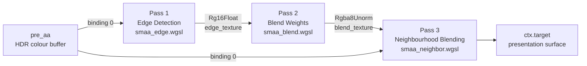

# SMAA Pass

The `SmaaPass` implements Subpixel Morphological Anti-Aliasing across three sequential fullscreen draw calls. Where FXAA applies a single luma gradient softening filter and TAA accumulates results across frames, SMAA occupies the middle ground: it classifies edges by their geometric shape using a dedicated edge detection pass, computes per-pixel blend weights based on the detected morphology, and then applies those weights as a final neighbourhood blend. The result is higher edge quality than FXAA — particularly at T-junctions and diagonal edges — without any temporal dependency that would introduce ghosting on moving geometry. This document covers the complete three-pass architecture, the intermediate texture formats, the bind group layouts, and the cost model.

---

## 1. Morphological Anti-Aliasing

FXAA asks a simple question at each pixel: is there a luma contrast edge here, and if so, which direction does it run? The answer drives a single bilinear shift. The problem with this approach is that it has no geometric context — it cannot distinguish between a long straight edge (which should receive gentle, coherent softening along its entire length) and a pixel-wide spike that happens to have high local contrast (which should not). The result is that FXAA tends to soften uniformly, blurring fine texture details as readily as aliased geometry.

Morphological anti-aliasing addresses this by treating edges as **geometric patterns** rather than as isolated local gradients. The algorithm first identifies which pixels sit on edges, then classifies the shape of each edge segment — is it a straight line, a diagonal, an L-corner, a T-junction? — and finally computes blend weights that respect the geometry. A long straight horizontal edge receives a blend weight profile that smoothly ramps from zero at the edge start to a maximum at the midpoint and back to zero at the end. A diagonal edge receives an asymmetric blend weight that correctly represents the 45-degree crossing. This geometric awareness is what gives SMAA its visible quality advantage.

SMAA was introduced by Jorge Jimenez et al. in their 2012 SIGGRAPH paper "Practical Morphological Anti-Aliasing on the GPU". The technique encodes all known crossing patterns in a pair of precomputed lookup textures — the **area texture** (which maps edge crossing lengths to blend weights) and the **search texture** (which accelerates the walk along an edge to find its endpoints). Helio's implementation follows the three-pass structure of the original design and accurately implements luma-based edge detection with separate horizontal and vertical edge channels. The blend weight calculation stage uses a simplified pattern-matching approach rather than the full area and search texture lookup; this is documented explicitly in the pass's WGSL source and represents a deliberate quality-versus-complexity trade-off in the current implementation.

> [!NOTE]
> The `smaa_blend.wgsl` source includes the comment: *"In a full implementation, this would use pattern matching and search textures."* The current blend weight calculation assigns uniform `0.5` weights to detected horizontal and vertical edges. This produces good results on straight, axis-aligned edges but does not accurately model diagonal edge patterns. Upgrading to the full area and search texture approach requires adding two precomputed RGBA textures to the bind group and replacing the weight calculation in `smaa_blend.wgsl`. The edge detection and neighbourhood blending passes are already fully correct and do not require modification.

---

## 2. Three-Pass Architecture

The pass executes as three sequential fullscreen draw calls, each one depending on the output of the previous:



The separation of concerns is strict: Pass 1 produces no colour output, only an edge map; Pass 2 consumes the edge map and produces blend weights; Pass 3 uses the blend weights to selectively filter the original colour buffer. Pass 3 reads from the original pre-AA colour buffer directly — not from Pass 2 — because the neighbourhood blend needs the actual scene colours, not the edge data.

All three passes use the same oversized-triangle vertex shader technique described in the [Deferred Lighting Pass](./deferred-light) documentation. No vertex buffer is bound; positions and UVs are computed analytically from `vertex_index`. Each pass issues a single `draw(0..3, 0..1)`.

---

## 3. Pass 1: Edge Detection

The edge detection pass reads the pre-AA colour buffer and writes a two-channel floating-point edge map. It uses a luma-based approach with ITU-R BT.709 coefficients — the same standard used in HDTV — rather than the BT.601 coefficients used by FXAA:

```wgsl
fn rgb2luma(color: vec3<f32>) -> f32 {
    return dot(color, vec3<f32>(0.2126, 0.7152, 0.0722));
}
```

BT.709 places slightly more weight on blue (`0.0722` vs. BT.601's `0.114`) and slightly less on red (`0.2126` vs. `0.299`). For most scenes the difference is imperceptible, but BT.709 is the correct standard for wide-colour or HDR content where the input buffer may contain values rendered for a BT.709 or DCI-P3 display.

The fragment shader performs a 5-tap cross-neighbourhood sample — centre, left, right, top, and bottom — and computes the luma difference between the centre and each cardinal neighbour:

```wgsl
let delta_left   = abs(luma_center - luma_left);
let delta_right  = abs(luma_center - luma_right);
let delta_top    = abs(luma_center - luma_top);
let delta_bottom = abs(luma_center - luma_bottom);
```

It then classifies each axis independently against a threshold:

```wgsl
const EDGE_THRESHOLD: f32 = 0.1;

if max(delta_left, delta_right) > EDGE_THRESHOLD { edges.x = 1.0; }
if max(delta_top, delta_bottom) > EDGE_THRESHOLD { edges.y = 1.0; }
```

The output is a `vec2<f32>` where the R channel (`edges.x`) encodes the presence of a horizontal edge and the G channel (`edges.y`) encodes the presence of a vertical edge. These are written directly as the fragment output into the `Rg16Float` edge texture, which is cleared to transparent (`(0,0,0,0)`) at the start of each frame. The 10% contrast threshold (`EDGE_THRESHOLD = 0.1`) is intentionally higher than FXAA's `EDGE_THRESHOLD_MAX = 0.125` expressed as a relative ratio — at typical scene luminance levels this produces a more selective, less noisy edge map.

### 3.1 Sampling Strategy

The edge pass samples the input colour buffer using the linear sampler (`linear_sampler` at binding 1), which means the luma values for the left, right, top, and bottom neighbours are bilinearly filtered from the source texture rather than read as exact integer texels. This has a subtle effect: because bilinear filtering at a half-texel offset reads between two adjacent pixels, each "neighbour" sample is already partially blended. In practice this slightly softens the edge detection, reducing the number of pixels flagged as edges at the cost of some edge crispness. The alternative — using `textureLoad` at integer coordinates — would produce sharper but potentially noisier edge detection on fine texture.

---

## 4. Pass 2: Blend Weight Calculation

The blend weight pass reads the `Rg16Float` edge texture from Pass 1 and writes a four-channel `Rgba8Unorm` blend weight texture. The four channels encode the weights for blending in each of the four cardinal directions: `(weight_left, weight_top, weight_right, weight_bottom)`. For any pixel that did not register as an edge in Pass 1, all four weights are zero and the shader exits early:

```wgsl
let edges = textureSample(edge_tex, point_sampler, in.uv).xy;
if edges.x == 0.0 && edges.y == 0.0 {
    return vec4<f32>(0.0);
}
```

The early exit is sampled with the **point sampler** (`point_sampler` at binding 2), not the linear sampler, because blend weight calculation requires exact per-pixel edge flags rather than a filtered average of neighbouring edge values. Bilinearly sampling the edge texture at this stage would cause edge flags to bleed across pixel boundaries, misidentifying adjacent non-edge pixels as edge pixels.

In the current implementation, blend weights are assigned uniformly for detected edges:

```wgsl
if edges.x > 0.0 { weights.x = 0.5;  weights.z = 0.5; }  // horizontal edge
if edges.y > 0.0 { weights.y = 0.5;  weights.w = 0.5; }  // vertical edge
```

This means that every pixel on a horizontal edge receives a 50% blend weight toward its left and right neighbours, and every pixel on a vertical edge receives a 50% blend weight toward its top and bottom neighbours. The `Rgba8Unorm` format encodes the `[0, 1]` range with 8-bit precision, giving a step size of approximately `0.0039` — sufficient for the coarse 0.5/0.0 binary weights in the current implementation and for the finely-graduated weights that a full area-texture implementation would produce.

### 4.1 The Full SMAA Blend Weight Algorithm

Understanding the current simplified implementation requires knowing what the full algorithm would do. In the Jimenez et al. formulation, the blend weight pass walks the edge texture in both directions from each detected edge pixel to locate the two endpoints of the current edge segment. With these endpoints known, it looks up the appropriate blend weight profile in the **area texture** — a precomputed 160×560 RGBA texture that encodes, for every possible combination of edge crossing distances and pattern types, the correct sub-pixel blend weights derived by analytically integrating a box filter across the geometric edge. The **search texture** — a compact 66×33 byte texture — accelerates the endpoint walk by encoding how many pixels can be skipped in a single step for various edge run-length patterns.

The two lookup textures encode information that would take hundreds of instructions to compute analytically on the GPU; the area texture alone is the result of a precomputation that integrates over all crossing-line configurations. Helio's current simplified implementation replaces this entire pattern-matching and lookup system with fixed 0.5 weights, which is correct for axis-aligned edges of approximately one texel thickness but does not accurately model longer edges, diagonals, or T-junctions.

---

## 5. Pass 3: Neighbourhood Blending

The neighbourhood blending pass reads both the original pre-AA colour buffer and the blend weight texture, and writes the anti-aliased result to `ctx.target`. It operates in five bilinear-filtered taps over the source image:

```wgsl
let center = textureSample(input_tex, linear_sampler, in.uv);
let tl = textureSample(input_tex, linear_sampler, in.uv + vec2<f32>(-0.5,  0.5) * texel_size);
let tr = textureSample(input_tex, linear_sampler, in.uv + vec2<f32>( 0.5,  0.5) * texel_size);
let bl = textureSample(input_tex, linear_sampler, in.uv + vec2<f32>(-0.5, -0.5) * texel_size);
let br = textureSample(input_tex, linear_sampler, in.uv + vec2<f32>( 0.5, -0.5) * texel_size);

let result = (center + tl + tr + bl + br) * 0.2;
```

The ±0.5 texel offsets are intentional. Sampling at a half-texel offset into each corner activates bilinear filtering, which returns a weighted average of the two texels on either side of the sample point. Combined with the one-fifth average across all five taps, this produces a gentle wide-neighbourhood smoothing that effectively blurs along the edge direction while preserving detail in the perpendicular direction. In the full SMAA algorithm the neighbourhood blend uses the four-component blend weight from Pass 2 to selectively apply different mix amounts for horizontal and vertical edges; the current implementation applies a uniform 5-tap average, which is perceptually similar on straight edges but less precise on corners and T-junctions.

> [!TIP]
> The neighbourhood blending pass reads from `input_view`, the original pre-AA buffer, rather than from the edge texture or blend texture. This is architecturally important: it means that the blending pass always works from clean, unmodified colour data. No AA-related information is ever fed back into the colour path — only the blend weights, which are ephemeral per-frame data written to and consumed from the blend texture within a single frame.

---

## 6. Internal Textures

`SmaaPass` owns two full-resolution intermediate textures created at construction time:

### 6.1 Edge Texture

```rust
let edge_texture = device.create_texture(&wgpu::TextureDescriptor {
    label:  Some("SMAA Edge Texture"),
    size:   wgpu::Extent3d { width, height, depth_or_array_layers: 1 },
    format: wgpu::TextureFormat::Rg16Float,
    usage:  wgpu::TextureUsages::TEXTURE_BINDING | wgpu::TextureUsages::RENDER_ATTACHMENT,
    // ...
});
```

`Rg16Float` provides two 16-bit float channels at 4 bytes per pixel. At 1920×1080 this is 8.3 MB. The `R` channel encodes horizontal edge presence and the `G` channel encodes vertical edge presence, both as binary `0.0` / `1.0` values in this implementation. The `Rg16Float` format is overkill for a binary flag — `Rg8Unorm` would suffice — but `Rg16Float` is universally supported as a render attachment across all wgpu backends, whereas 8-bit two-channel render attachment support is less consistent.

The edge texture is cleared to `Color::TRANSPARENT` (`(0,0,0,0)`) at the start of Pass 1 each frame via `LoadOp::Clear`. This ensures that edge flags from the previous frame do not bleed into the current frame's blend weight calculation.

### 6.2 Blend Texture

```rust
let blend_texture = device.create_texture(&wgpu::TextureDescriptor {
    label:  Some("SMAA Blend Texture"),
    size:   wgpu::Extent3d { width, height, depth_or_array_layers: 1 },
    format: wgpu::TextureFormat::Rgba8Unorm,
    usage:  wgpu::TextureUsages::TEXTURE_BINDING | wgpu::TextureUsages::RENDER_ATTACHMENT,
    // ...
});
```

`Rgba8Unorm` provides four 8-bit channels at 4 bytes per pixel — the same memory cost as the edge texture despite having twice as many channels, because 8-bit channels are half the size of 16-bit channels. At 1920×1080 this is 8.3 MB. The four channels encode the four directional blend weights (left, top, right, bottom). Like the edge texture, the blend texture is cleared to transparent each frame.

**Total SMAA intermediate VRAM:** `2 × 8.3 MB = 16.6 MB` at 1080p, `2 × 33.2 MB = 66.4 MB` at 4K.

### 6.3 Texture Lifecycle

Both intermediate textures are created in the `SmaaPass::new()` constructor at the render resolution provided by the `width` and `height` parameters. They are not recreated automatically on resize. If the render target dimensions change, the enclosing system must drop the existing `SmaaPass` and construct a new one at the new resolution. The public `edge_texture`, `edge_view`, `blend_texture`, and `blend_view` fields are exposed to allow the surrounding renderer to inspect or publish these resources if needed.

---

## 7. Bind Group Layout

All three passes share the same bind group layout shape, parameterised only by whether the main texture binding must be filterable:

| Binding | Name | Type | Passes |
|---|---|---|---|
| 0 | `input_tex` / `edge_tex` | `Texture2D<f32>` (filterable) | Pass 1: pre-AA input; Pass 2: edge texture; Pass 3: pre-AA input |
| 1 | `linear_sampler` | `Sampler (Filtering)` | All passes |
| 2 | `point_sampler` | `Sampler (NonFiltering)` | All passes |

Each pass has its own `BindGroupLayout` instance and its own `BindGroup`, created at construction time. The bind groups are not recreated lazily on pointer key change as in `FxaaPass` — instead, `SmaaPass::new()` requires the `input_view` at construction time and binds it directly. If the upstream texture view changes after construction (for example on a window resize), the `SmaaPass` must be rebuilt.

The presence of both a linear sampler and a point sampler in every pass's bind group is a matter of API uniformity. Pass 1 uses only the linear sampler; Pass 2 uses only the point sampler; Pass 3 uses only the linear sampler. Both samplers are present in all passes to avoid needing three different bind group layout shapes, which would complicate the `bgl()` and `make_pipeline()` helper closures in the constructor.

---

## 8. O(1) Guarantee

The `execute()` method records exactly three render passes, each containing exactly one draw call:

```rust
// Pass 1 — edge detection
{
    let mut pass = ctx.encoder.begin_render_pass(&edge_desc);
    pass.set_pipeline(&self.edge_pipeline);
    pass.set_bind_group(0, &self.edge_bind_group, &[]);
    pass.draw(0..3, 0..1);
}
// Pass 2 — blend weight calculation
{
    let mut pass = ctx.encoder.begin_render_pass(&blend_desc);
    pass.set_pipeline(&self.blend_pipeline);
    pass.set_bind_group(0, &self.blend_bind_group, &[]);
    pass.draw(0..3, 0..1);
}
// Pass 3 — neighbourhood blending
{
    let mut pass = ctx.encoder.begin_render_pass(&neighbor_desc);
    pass.set_pipeline(&self.neighbor_pipeline);
    pass.set_bind_group(0, &self.neighbor_bind_group, &[]);
    pass.draw(0..3, 0..1);
}
```

There are no scene-size-dependent loops, no indirect draw buffers, and no compute dispatches. The only variation in GPU workload is the number of pixels that pass the edge threshold in Pass 1 — and even that affects only shader execution time (which the GPU manages transparently), not the number of commands on the CPU side.

---

## 9. Rust API

### 9.1 Construction

```rust
pub fn new(
    device:        &wgpu::Device,
    width:         u32,
    height:        u32,
    input_view:    &wgpu::TextureView,
    target_format: wgpu::TextureFormat,
) -> SmaaPass
```

All five parameters are required at construction time. Unlike `FxaaPass`, which defers bind group creation to the first frame, `SmaaPass` creates all three bind groups immediately in the constructor. This means the `input_view` must be available and valid before the pass is constructed — typically immediately after the deferred lighting pass's output texture is created.

`target_format` is the format of `ctx.target` — the surface the final pass writes into. In the default pipeline this is the swap-chain surface format, typically `Bgra8UnormSrgb` or `Rgba8UnormSrgb` depending on the platform.

### 9.2 Integration

```rust
let smaa = SmaaPass::new(
    &device,
    render_width,
    render_height,
    &pre_aa_view,
    surface_format,
);
renderer.add_pass(smaa);
```

Unlike `FxaaPass`, `SmaaPass` does not read from `ctx.frame.pre_aa`. It takes the input view directly at construction time and stores it in its bind groups. If you need to replace `FxaaPass` with `SmaaPass` in the default pipeline, ensure you pass the same `pre_aa` texture view that `FxaaPass` would have read.

On window resize, drop the existing `SmaaPass` instance and construct a new one at the new resolution. The intermediate textures (`edge_texture`, `blend_texture`) are owned by the pass and will be dropped and freed automatically.
