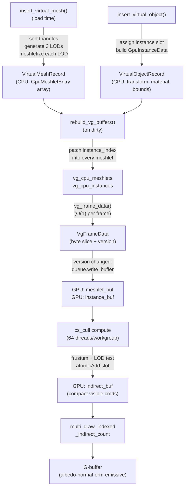

# Virtual Geometry Pass

The `VirtualGeometryPass` is Helio's answer to a fundamental scalability problem: how do you render scenes whose triangle counts exceed what the CPU can usefully manage per frame? Traditional draw-call-based pipelines require the CPU to examine every object in the scene, cull it against the view frustum, decide its LOD, and issue a draw call. At a few hundred objects this is unnoticeable overhead. At hundreds of thousands of distinct meshlets distributed across large static environments — terrain, architecture, dense foliage — the CPU becomes the bottleneck long before the GPU is saturated.

Helio's virtual geometry system eliminates that bottleneck by moving the entire visibility and LOD decision onto the GPU. Meshes are decomposed at load time into small clusters of triangles called **meshlets**, each with a precomputed bounding sphere and backface cone. On every frame, a single compute dispatch tests all meshlets in parallel, writing one `DrawIndexedIndirect` command per visible cluster into a GPU-resident buffer. A subsequent `multi_draw_indexed_indirect` call then renders exactly the surviving meshlets, producing G-buffer output identical to the standard `GBufferPass`. The CPU never iterates over geometry; its per-frame cost is strictly O(1) regardless of how many triangles the scene contains.

This design is closely related to the GPU-driven rendering approach popularised by Ubisoft's *Assassin's Creed: Unity* and later taken to its logical extreme by Epic's Nanite in Unreal Engine 5. Helio's implementation is deliberately pragmatic: it uses the wgpu indirect draw API available today, incorporates a three-level vertex-cluster LOD system, and integrates transparently with the existing G-buffer pipeline so that virtual geometry objects are lit by the same deferred shading pass as every other object in the scene.

---

## 1. Architecture Overview

The virtual geometry pipeline is divided into three phases that occur at different points in the application lifecycle. Understanding the separation between load-time work and per-frame work is key to understanding why the system is efficient.

**Load time:** When a mesh is registered with `insert_virtual_mesh()`, the CPU decomposes it into meshlets across three LOD levels and stores the resulting `GpuMeshletEntry` descriptors in CPU-side buffers. This is the only moment the CPU touches individual triangles. All subsequent operations are driven by the GPU.

**Per-frame, prepare phase:** The `VirtualGeometryPass::prepare()` method checks whether the scene's VG buffer version has changed since the last upload. If it has — because objects were added, removed, or their transforms were updated — it writes the meshlet and instance arrays to GPU storage buffers via `queue.write_buffer()`. If the GPU buffers are too small for the current scene, they are reallocated at twice the required capacity, an amortised O(1) strategy. LOD quality thresholds and the total meshlet count are uploaded as a small `CullUniforms` struct. The entire CPU cost of this step is dominated by a handful of buffer writes, not by any per-meshlet iteration.

**Per-frame, execute phase:** Two GPU passes execute in sequence. The compute cull pass dispatches `ceil(meshlet_count / 64)` workgroups. Each thread reads one `GpuMeshletEntry`, transforms its bounding sphere into world space, tests it against the six view-frustum planes, checks the LOD screen-coverage criterion, and — if the meshlet is visible and at the correct LOD level — atomically appends a `DrawIndexedIndirect` command to a compact output array. The rasteriser draw pass then issues a single `multi_draw_indexed_indirect_count` call, consuming exactly the GPU-written command count with no CPU readback and no stale zero-instance-count entries to skip.



---

## 2. The Meshlet: Unit of GPU-Driven Culling

A meshlet is a small, spatially-coherent cluster of at most 64 triangles carved from a larger mesh. The choice of 64 is not arbitrary: it corresponds to one wavefront on AMD GCN/RDNA hardware and a full pair of 32-thread warps on NVIDIA, which means a single workgroup in the culling compute shader processes exactly one meshlet per thread with perfect occupancy. Raising this limit to 128 would reduce the number of draw commands but produce looser bounding spheres, weakening the frustum culling effectiveness for large meshes viewed from the side.

The GPU-side descriptor for a single meshlet is `GpuMeshletEntry`, a 64-byte struct laid out to be directly addressable as a storage-buffer array:

```rust
/// GPU-side descriptor for a single meshlet. Exactly 64 bytes.
#[repr(C)]
#[derive(Debug, Clone, Copy, Pod, Zeroable)]
pub struct GpuMeshletEntry {
    /// Bounding sphere center in mesh-local space.
    pub center: [f32; 3],
    /// Bounding sphere radius (before applying the object's world transform).
    pub radius: f32,

    /// Backface cone apex in mesh-local space (centroid approximation).
    pub cone_apex: [f32; 3],
    /// cos(half-angle) of the backface cone. Set to 2.0 to disable cone culling.
    pub cone_cutoff: f32,

    /// Normalised backface cone axis in mesh-local space.
    pub cone_axis: [f32; 3],
    /// LOD level encoded as a float: 0.0 = full, 1.0 = medium, 2.0 = coarse.
    pub lod_error: f32,

    /// Absolute offset into the global index mega-buffer.
    pub first_index: u32,
    /// Number of indices in this meshlet (triangles × 3, ≤ 192).
    pub index_count: u32,
    /// Base vertex added by the GPU to every index when drawing.
    pub vertex_offset: i32,
    /// Slot in the VG instance buffer for this meshlet's owning object.
    pub instance_index: u32,
}
```

The 64-byte size is enforced by a compile-time assertion and is deliberate: it makes every meshlet naturally aligned to a cache line on all target architectures, so loading `meshlets[idx]` in the compute shader touches exactly one cache line with no padding waste.

The `first_index` and `vertex_offset` fields are **global** offsets into the scene's shared index and vertex mega-buffers. Rather than allocating separate GPU buffers per mesh, Helio maintains a single large vertex buffer and a single large index buffer shared across all geometry. Meshlets address into these buffers directly — `first_index` is the byte-offset of the first index for this cluster, and `vertex_offset` is added to every index value by the GPU draw hardware (the `base_vertex` parameter of the draw indirect command). This means the culling compute shader never needs to know about mesh boundaries at all; it just copies these fields verbatim into the outgoing `DrawIndexedIndirect` command.

The `instance_index` field is the most dynamically managed. It is assigned during `rebuild_vg_buffers()` on the CPU and encodes the row in the per-frame `GpuInstanceData` array that holds the world transform and material ID for the object this meshlet belongs to. Because every meshlet of a given object shares the same `instance_index`, the vertex shader can look up the transform in a single storage-buffer load keyed by the draw's `first_instance` value, which the cull shader sets to `m.instance_index`.

---

## 3. CPU-Side Meshletization

When `Scene::insert_virtual_mesh()` is called, the CPU performs the only per-triangle work that will ever happen for that mesh. Three things occur in sequence: LOD generation, spatial sorting, and meshletization.

### 3.1 LOD Generation

Three LOD levels are derived from the original mesh by vertex clustering. The `generate_lod_meshes()` function partitions the mesh's bounding box into a uniform 3-D grid and collapses every vertex within the same grid cell to a single representative point — the first vertex encountered in that cell. Triangles that degenerate (all three corners land in the same cell) are discarded. The grid resolution controls the aggressiveness of simplification:

```rust
pub fn generate_lod_meshes(
    vertices: &[PackedVertex],
    indices:  &[u32],
) -> Vec<(Vec<PackedVertex>, Vec<u32>)> {
    let lod0 = (vertices.to_vec(), indices.to_vec()); // full detail
    let lod1 = vertex_cluster_simplify(vertices, indices, 64); // ~25 % triangles
    let lod2 = vertex_cluster_simplify(vertices, indices, 16); // ~6 % triangles
    vec![lod0, lod1, lod2]
}
```

A 64-cell grid produces approximately 25 % of the original triangle count; a 16-cell grid produces approximately 6 %. These ratios emerge from the fact that each cell contains on average $$64^3 / V$$ vertices, where $$V$$ is the total vertex count, but the precise ratio depends on the spatial distribution of the source geometry. The fallback is conservative: if simplification would reduce the triangle count to zero — which can happen for very small or degenerate meshes — the original mesh is returned unchanged.

Each LOD level is uploaded to the shared MeshPool independently, occupying its own slice in the vertex and index mega-buffers. The returned `MeshId` handles are stored in the `VirtualMeshRecord.mesh_ids` array at indices 0, 1, and 2, which correspond to full, medium, and coarse detail. The three distinct mesh pool entries share no GPU memory — each LOD is a complete, independent vertex and index dataset, sized to its own simplified geometry.

### 3.2 Spatial Triangle Sorting

Before meshletization, the indices of each LOD level are reordered so that spatially adjacent triangles appear consecutively in the index buffer. The `sort_triangles_spatially()` function computes the centroid of each triangle and sorts them by X, then Z, then Y. This step is crucial to the quality of the bounding spheres that `meshletize()` will compute: if spatially scattered triangles land in the same 64-element chunk, their bounding sphere will be large and the frustum culling will be ineffective. With spatial sorting, each 64-triangle chunk corresponds to a tight local neighbourhood of the mesh surface, and the Ritter sphere computed over that neighbourhood will be compact.

> [!NOTE]
> The sorted index buffer is the data that is actually uploaded to the MeshPool and that `meshletize()` receives. The per-meshlet global `first_index` offset is therefore relative to the sorted buffer, not the original. This means the original unsorted indices are discarded after upload — the scene holds only the spatially sorted representation.

### 3.3 Meshletization

With sorted indices in hand, `meshletize()` performs a simple greedy sequential partition: it walks the index buffer in 64-triangle strides and emits one `GpuMeshletEntry` per stride. For each chunk it computes:

- **Bounding sphere** using Ritter's incremental algorithm: find the axis-aligned extent along X, initialise a sphere from the extreme pair, then expand to cover every remaining point in a single pass. The result is a tight but not optimal sphere — optimal sphere construction is O(n) with a larger constant; Ritter's is fast and deterministic.

- **Backface cone** — the apex (centroid of the cluster), a normalised average face normal (the cone axis), and a cosine cutoff angle. The cutoff is computed as $$\sqrt{1 - \dot{\mathbf{n}}_\text{min}^2} + 0.1$$, where $$\dot{\mathbf{n}}_\text{min}$$ is the minimum dot product between any individual face normal and the cluster average. The 0.1 margin guards against false culls at silhouette edges. When the spread angle exceeds 90°, cone culling cannot reject the meshlet from any viewing direction and the cutoff is set to the sentinel value `2.0`.

All coordinates in `GpuMeshletEntry` are stored in mesh-local space. The world-space position and scale are applied in the compute shader at cull time.

After meshletization, the CPU patches each `GpuMeshletEntry.lod_error` field with the floating-point encoding of its LOD level (`0.0`, `1.0`, or `2.0`) and stores the combined array of all three LODs in `VirtualMeshRecord.meshlets`. The GPU sees all LOD meshlets in a single flat buffer; the LOD selection logic in the cull shader decides which level is active for each meshlet independently.

---

## 4. The `VirtualMeshRecord` and Per-Object Instance Data

The scene maintains two parallel data structures for virtual geometry objects. `VirtualMeshRecord` is the per-asset record, owned by the `vg_meshes` hash map and keyed by `VirtualMeshId`. It holds the three MeshPool handles, the flattened meshlet descriptor array, and a reference count. The reference count prevents the removal of a mesh that is still in use by one or more live objects — `remove_virtual_mesh()` returns `SceneError::ResourceInUse` if it is non-zero.

`VirtualObjectRecord` is the per-instance record, stored in the dense arena `vg_objects`. Each object holds the `VirtualMeshId` it was created from, a `GroupMask` for visibility group membership, and a `GpuInstanceData` struct pre-built from the descriptor passed to `insert_virtual_object()`. The `GpuInstanceData` includes the full 4×4 world transform, a precomputed 3×3 normal matrix (the transpose of the inverse of the upper-left 3×3 of the model matrix), the world-space bounding sphere used for per-object LOD selection, the material slot index, and a flags bitmask:

```wgsl
struct GpuInstanceData {
    transform:    mat4x4<f32>,  // 64 bytes
    normal_mat_0: vec4<f32>,    // 16 bytes — column 0 of the 3x3 normal matrix
    normal_mat_1: vec4<f32>,    // 16 bytes — column 1
    normal_mat_2: vec4<f32>,    // 16 bytes — column 2
    bounds:       vec4<f32>,    // 16 bytes — xyz: world-space sphere center, w: radius
    mesh_id:      u32,          //  4 bytes
    material_id:  u32,          //  4 bytes
    flags:        u32,          //  4 bytes
    _pad:         u32,          //  4 bytes — 16-byte alignment
}                               // 144 bytes total
```

When `update_virtual_object_transform()` is called, it recomputes the model matrix and the normal matrix in-place and marks the VG object set as dirty. The normal matrix is computed eagerly rather than in the vertex shader to avoid a matrix inversion per-vertex on the GPU. The `bounds` field carries the world-space bounding sphere that the cull shader reads to compute screen-coverage for LOD selection — this must be kept consistent with the object's world transform when the transform changes.

Whenever the dirty flag is set, the next `flush()` call triggers `rebuild_vg_buffers()`, which iterates over the dense object arena and rebuilds the flat CPU meshlet and instance arrays. During this rebuild, each meshlet's `instance_index` field is patched to point at the correct row in the instance array. The `vg_buffer_version` counter is incremented, causing the GPU pass to detect the change on the next `prepare()` call and re-upload.

> [!IMPORTANT]
> The `VgFrameData` returned by `vg_frame_data()` is a zero-copy byte-slice view of the CPU-side buffers. It becomes invalid after the next `flush()` call, but because `render()` consumes it within the same frame, lifetime is always satisfied. The byte slices are passed directly to `queue.write_buffer()` in the prepare phase with no intermediate copy.

---

## 5. The GPU Cull Pass

The compute shader `vg_cull.wgsl` performs all visibility and LOD determination for a frame. Its design follows a pattern sometimes called the "AAA indirect compaction" approach: rather than writing a draw command per meshlet with `instance_count` set to 0 or 1 and relying on the GPU to skip zero-count commands, it maintains a single atomic counter and writes only visible commands to consecutive buffer slots. This produces a compact draw list with no gaps, which `multi_draw_indexed_indirect_count` can consume without reading beyond the live command range.

### 5.1 Workgroup Structure and Thread Assignment

The shader is declared with `@workgroup_size(64)`, dispatching one thread per meshlet:

```wgsl
@compute @workgroup_size(64)
fn cs_cull(@builtin(global_invocation_id) gid: vec3<u32>) {
    let idx = gid.x;
    if idx >= cull_uni.meshlet_count { return; }
    // ...
}
```

The dispatch size on the Rust side is `ceil(meshlet_count / 64)` workgroups. Threads beyond `meshlet_count` perform a cheap early return. The WORKGROUP_SIZE of 64 matches `MESHLET_MAX_TRIANGLES` deliberately: the same number of threads that fits in one workgroup is the same number of triangles that fits in one meshlet. In a compute-shader task-graph architecture, this would allow future work where a single workgroup processes both culling and software rasterisation of its assigned meshlet.

### 5.2 Bounding Sphere Transformation

Each meshlet stores its bounding sphere in mesh-local space. The cull shader transforms the center to world space using the owning object's model matrix:

```wgsl
let model     = inst.transform;
let center_ws = (model * vec4<f32>(m.center, 1.0)).xyz;

let scale_x = length(model[0].xyz);
let scale_y = length(model[1].xyz);
let scale_z = length(model[2].xyz);
let world_radius = m.radius * max(scale_x, max(scale_y, scale_z));
```

The world-space radius is derived from the maximum of the three axis scale factors. This is a conservative approximation for non-uniform scales — it may over-estimate the radius, which means the sphere test may pass for meshlets that are just outside the frustum, but it will never falsely cull a visible meshlet. True ellipsoid-frustum intersection would be more precise but requires an eigendecomposition of the normal matrix, which is prohibitively expensive per meshlet.

### 5.3 Frustum Culling

Six frustum planes are extracted from the combined view-projection matrix using the Gribb/Hartmann method. For a column-major matrix `VP`, the left plane normal is `VP[0][3] + VP[0][0], VP[1][3] + VP[1][0], VP[2][3] + VP[2][0]` with `d = VP[3][3] + VP[3][0]`. The plane normals are **not** normalised — normalisation would require a `sqrt` per plane, but the sphere test can be written correctly without it by scaling the radius by the plane normal's magnitude:

```wgsl
let visible =
    (dot(pl0.xyz, center_ws) + pl0.w >= -world_radius * length(pl0.xyz))
 && (dot(pl1.xyz, center_ws) + pl1.w >= -world_radius * length(pl1.xyz))
 && (dot(pl2.xyz, center_ws) + pl2.w >= -world_radius * length(pl2.xyz))
 && (dot(pl3.xyz, center_ws) + pl3.w >= -world_radius * length(pl3.xyz))
 && (dot(pl4.xyz, center_ws) + pl4.w >= -world_radius * length(pl4.xyz))
 && (dot(pl5.xyz, center_ws) + pl5.w >= -world_radius * length(pl5.xyz));
```

The near-plane encoding `pl4` uses the reversed-Z convention: in wgpu's depth mapping, NDC depth ∈ [0, 1] with 0 at the near plane, so the near plane is simply the Z row of the VP matrix without the W-component subtraction that characterises the far plane.

> [!NOTE]
> The backface cone data stored in `GpuMeshletEntry` is computed at meshletization time and uploaded to the GPU, but cone culling is intentionally **disabled** in the current shader. The comment in the source notes that the centroid-based cone apex approximation produces false culls when the camera is close to the surface. Per-triangle backface culling is already performed free-of-charge by the GPU rasterizer's `cull_mode = Back` setting, so disabling the conservative cone test trades a small number of extra draw commands for correctness at close range.

### 5.4 LOD Selection

For meshlets that pass the frustum test, the shader performs a Nanite-style screen-space LOD test. The key insight of this formulation is that a single metric — the fraction of the screen height covered by the object's bounding sphere — captures all the relevant factors: camera distance, field of view, and object size. No per-scene tuning constant or view-dependent bias is needed.

$$
s = \frac{r_{\text{obj}} \cdot f}{\|c_{\text{cluster}} - p_{\text{camera}}\|}
$$

where $$r_{\text{obj}}$$ is the **object's** world-space bounding sphere radius (from `inst.bounds.w`), $$f = \cot(\theta_\text{vfov}/2) = \texttt{proj}[1][1]$$ is the perspective focal length extracted directly from the projection matrix, and the denominator is the distance from the camera to this **meshlet's** world-space center.

The subtlety here — using the object's radius but the meshlet's center distance — is deliberate. It ensures that clusters on opposite sides of a large object receive different screen-coverage values and therefore independently transition between LODs, giving per-cluster LOD selectivity without any seam artefacts. Because every cluster of the same object uses the same object radius, the LOD bands are mutually exclusive: at any given cluster distance, exactly one `lod_level` satisfies the threshold conditions.

```wgsl
let cluster_dist = max(length(center_ws - camera.position_near.xyz), 0.001);
let obj_radius   = max(inst.bounds.w, 0.001);
let focal_len    = camera.proj[1][1];
let screen_size  = (obj_radius * focal_len) / cluster_dist;
let lod_level    = u32(m.lod_error + 0.5);
let lod_ok       = (lod_level == 0u && screen_size >= cull_uni.lod_s0)
                || (lod_level == 1u && screen_size <  cull_uni.lod_s0 && screen_size >= cull_uni.lod_s1)
                || (lod_level == 2u && screen_size <  cull_uni.lod_s1);
if !lod_ok { return; }
```

The thresholds `lod_s0` and `lod_s1` are uploaded from Rust each frame from the active `LodQuality` preset (see [Section 6](#6-lod-quality-presets)). A meshlet only passes the LOD test if its `lod_error` (integer LOD level encoded as float) matches the screen-coverage band: LOD 0 fires when the object is large on screen, LOD 1 at intermediate distances, and LOD 2 when the object subtends a small angle.

### 5.5 Atomic Compaction

Meshlets that pass both the frustum and LOD tests are written into the indirect buffer via atomic slot allocation:

```wgsl
var cmd: DrawIndexedIndirect;
cmd.index_count    = m.index_count;
cmd.instance_count = 1u;
cmd.first_index    = m.first_index;
cmd.base_vertex    = m.vertex_offset;
cmd.first_instance = m.instance_index;

let slot = atomicAdd(&draw_count, 1u);
indirect[slot] = cmd;
```

The `draw_count` buffer is a single `u32` cleared to zero at the start of each frame by `encoder.clear_buffer()`. Each visible meshlet atomically claims a slot and writes its draw command directly. The resulting `indirect` array contains `draw_count` valid commands at indices `[0, draw_count)`, with no zero-padded entries. On hardware that supports `MULTI_DRAW_INDIRECT_COUNT`, the `draw_count` buffer is passed directly to the GPU draw call as the count argument; the hardware reads only as many commands as were written. On hardware without this feature, the indirect buffer is additionally cleared at the start of the frame so that any tail entries beyond the visible set have `instance_count = 0` and are silently skipped by the driver.

---

## 6. LOD Quality Presets

The `LodQuality` enum provides four named presets that control when LOD transitions fire. Each preset specifies two screen-coverage thresholds: `lod_s0` for the full→medium transition and `lod_s1` for the medium→coarse transition. Both are expressed as fractions of screen height.

| Preset | LOD 0→1 threshold | LOD 1→2 threshold | Intended use |
|---|---|---|---|
| `Low` | 2 % of screen height | 0.4 % | Low-end GPUs, performance testing |
| `Medium` _(default)_ | 5 % | 1.0 % | Balanced quality/performance |
| `High` | 10 % | 2.0 % | Higher fidelity at a distance |
| `Ultra` | 18 % | 4.0 % | Near-cinematic, transitions barely visible |

A value of 5 % means that when an object's bounding sphere covers less than 5 % of the screen's vertical extent, the full-detail meshlets are suppressed and medium-detail meshlets are drawn instead. Because the metric is screen-height fraction rather than world-space distance, the same preset is correct across all field-of-view settings and all object sizes — a tiny object close to the camera and a large object far away that both subtend the same angle will receive the same LOD, which is precisely the correct behaviour.

The quality preset is set on the pass directly and takes effect on the next rendered frame:

```rust
renderer.virtual_geometry_pass.lod_quality = LodQuality::High;
```

> [!TIP]
> On dynamic camera systems with narrow vertical FOV (telephoto lens simulation), `lod_s0` effectively fires at a larger world-space distance than with a wide FOV, because the same world-space radius projects to a smaller screen fraction. This is correct behaviour: if the camera has a narrow FOV and therefore sees distant objects in more apparent detail, those objects should receive higher-quality geometry. No manual adjustment is required.

---

## 7. The VG G-Buffer Draw Pass

After the cull compute pass writes its compact indirect command list, the render pass `vg_gbuffer.wgsl` draws the surviving meshlets into the shared G-buffer. The design is specifically crafted to be compatible with the output of the standard `GBufferPass`: both write to the same four render targets in the same formats, and both use `LoadOp::Load` so that their contributions are additive within a single frame. The deferred lighting pass then reads the combined G-buffer without any knowledge of whether a pixel was produced by a standard draw or a virtual geometry draw.

### 7.1 The Vertex Shader

The vertex shader reads instance data from the VG instance buffer indexed by `@builtin(instance_index)`, which the GPU populates from the `first_instance` field of each indirect draw command — the same field the cull shader set to `m.instance_index`. This makes the indirect instance lookup completely automatic: the hardware translates the indirect command's `first_instance` into the `instance_index` builtin, and the shader uses that to read the correct world transform and material ID.

```wgsl
@vertex
fn vs_main(v: Vertex, @builtin(instance_index) slot: u32) -> VertexOutput {
    let inst      = instance_data[slot];
    let world_pos = inst.transform * vec4<f32>(v.position, 1.0);

    let normal_mat = mat3x3<f32>(
        inst.normal_mat_0.xyz,
        inst.normal_mat_1.xyz,
        inst.normal_mat_2.xyz,
    );

    var out: VertexOutput;
    out.clip_position  = camera.view_proj * world_pos;
    out.world_position = world_pos.xyz;
    out.world_normal   = normalize(normal_mat * decode_snorm8x4(v.normal));
    out.world_tangent  = normalize(model_mat3 * decode_snorm8x4(v.tangent));
    out.bitangent_sign = v.bitangent_sign;
    out.tex_coords     = v.tex_coords;
    out.material_id    = inst.material_id;
    return out;
}
```

Vertex normals and tangents are stored packed as SNORM8×4 in the `PackedVertex` struct. The `decode_snorm8x4()` function unpacks them using WGSL's built-in `unpack4x8snorm()`. The packed format halves vertex bandwidth compared to `Float32x3` while maintaining sufficient precision for smooth normal-map shading.

### 7.2 The Fragment Shader and Bindless Textures

The fragment shader is functionally identical to the standard G-buffer fragment shader. It reads the material by `input.material_id`, samples textures through the 256-element bindless arrays, applies normal mapping, resolves specular F0 for both PBR metallic-roughness and specular-glossiness workflows, and outputs the four G-buffer values:

```wgsl
@group(1) @binding(2) var scene_textures: binding_array<texture_2d<f32>, 256>;
@group(1) @binding(3) var scene_samplers: binding_array<sampler, 256>;
```

The `256` hard limit on the bindless array size is enforced at the Rust bind-group-layout level with `NonZeroU32::new(MAX_TEXTURES)`. The `PARTIALLY_BOUND` texture binding flag is not required because all 256 slots are always populated — slots without a real texture receive a 1×1 white fallback from the texture manager. This avoids the need for the `PARTIALLY_BOUND` wgpu feature and maximises driver compatibility.

The G-buffer targets are opened with `LoadOp::Load` and `StoreOp::Store`:

```rust
ops: wgpu::Operations { load: wgpu::LoadOp::Load, store: wgpu::StoreOp::Store }
```

This is critical: the VG pass appends to a G-buffer that already contains the output of the standard `GBufferPass`. If `LoadOp::Clear` were used here, all standard mesh contributions would be erased.

### 7.3 The Debug Pipeline

A separate render pipeline, `fs_debug`, is compiled conditionally when the device supports `wgpu::Features::SHADER_PRIMITIVE_INDEX`. When `debug_mode == 20`, this pipeline replaces the normal fragment shader and colours every triangle with a hashed colour derived from its `@builtin(primitive_index)`:

```wgsl
@fragment
fn fs_debug(input: VertexOutput, @builtin(primitive_index) prim_id: u32) -> GBufferOutput {
    var h = prim_id * 2747636419u;
    h ^= h >> 16u;
    h *= 2654435769u;
    h ^= h >> 16u;
    let idx = h % 12u;
    // 12-colour palette, one per meshlet triangle
    // ...
}
```

This visualisation makes individual meshlet boundaries visible as colour boundaries in the rendered image — an invaluable tool for verifying that spatial sorting is producing tight clusters and that the LOD transitions fire at the expected distances. Because `primitive_index` tracking carries a small but non-zero hardware cost on some architectures, the debug entry point is kept strictly separate from `fs_main`, which never references it.

---

## 8. The O(1) CPU Guarantee

The claim that the virtual geometry pipeline delivers O(1) CPU cost per frame deserves precise qualification. Three categories of work are performed on the CPU each frame, and each has different complexity:

The `vg_frame_data()` call on the `Scene` struct is a true constant-time operation: it returns a `VgFrameData` struct containing a byte-slice pointer and two integer counts. No iteration is performed; the underlying `vg_cpu_meshlets` and `vg_cpu_instances` vectors are pre-built during `rebuild_vg_buffers()` which runs only when the scene's dirty flag is set.

The `prepare()` call in the pass performs a `queue.write_buffer()` if the version counter changed. The cost of this call is proportional to the buffer size — it is technically O(N meshlets) — but this write only occurs when the scene changes, and the GPU-side upload is pipelined and asynchronous. On frames where nothing changes in the VG scene, `prepare()` short-circuits at the version check and performs no buffer operations.

The `execute()` call submits exactly three GPU commands regardless of scene size: `clear_buffer` for the draw count, `begin_compute_pass` + `dispatch_workgroups`, and `begin_render_pass` + `multi_draw_indexed_indirect_count`. The CPU does not touch the indirect buffer, does not read back any GPU data, and does not iterate over the meshlet or instance arrays. This is the sense in which the pipeline is O(1): the CPU command-recording cost is constant in the number of meshlets.

The contrast with a conventional per-object CPU pipeline is stark. At 100,000 meshlets spread across 5,000 virtual objects, a CPU-driven approach would need to test 5,000 bounding volumes, sort by material, and issue thousands of draw calls. Helio's VG pass instead issues three GPU commands and lets 100,000 parallel compute threads do the visibility work in the time it takes to fill a single wgpu command buffer.

---

## 9. Rust API

The virtual geometry system is accessed through four methods on `Renderer` and `Scene`, designed to follow the same load-then-place pattern used by the standard mesh/object API.

### 9.1 Loading a Mesh

`insert_virtual_mesh()` accepts a `VirtualMeshUpload` containing raw vertex and index data and returns an opaque `VirtualMeshId` handle. All meshletization and LOD generation happens synchronously inside this call:

```rust
use helio::{VirtualMeshUpload, VirtualObjectDescriptor, GroupMask};

// Build or load vertex/index data.
let upload = VirtualMeshUpload {
    vertices: packed_vertices, // Vec<PackedVertex>
    indices:  triangle_indices, // Vec<u32>
};

let mesh_id = renderer.insert_virtual_mesh(upload);
```

The `VirtualMeshId` is a lightweight `Copy` handle backed by a `u32`. It is stable for the lifetime of the mesh registration and is the only token needed to instantiate objects or remove the mesh later.

### 9.2 Placing an Instance

`insert_virtual_object()` creates one instance of a virtual mesh in the scene. It requires a `VirtualObjectDescriptor` specifying the mesh handle, material slot, world transform, a world-space bounding sphere, and optional group membership:

```rust
use glam::Mat4;

let object_id = renderer.insert_virtual_object(VirtualObjectDescriptor {
    virtual_mesh: mesh_id,
    material_id:  my_material_slot,
    transform:    Mat4::from_translation(glam::vec3(10.0, 0.0, -5.0)),
    bounds:       [10.0, 0.0, -5.0, 4.5], // [cx, cy, cz, radius]
    flags:        0,
    groups:       GroupMask::NONE,
})?;
```

The `bounds` field must be the world-space bounding sphere of the object at the given transform. For correct LOD behaviour, the radius should be a tight approximation of the mesh's actual extent under the applied scale. If the transform includes non-uniform scaling, the radius should reflect the largest axis scale multiplied by the mesh's local radius.

### 9.3 Updating the Transform

`update_virtual_object_transform()` updates both the model matrix and the precomputed normal matrix. Calling it marks the VG buffer set as dirty, triggering a `rebuild_vg_buffers()` on the next `flush()`. It does not require re-meshletizing the mesh — the meshlet geometry is fixed; only the per-instance transform record changes:

```rust
renderer.update_virtual_object_transform(
    object_id,
    Mat4::from_translation(glam::vec3(12.0, 0.0, -5.0)),
)?;
```

> [!WARNING]
> When calling `update_virtual_object_transform()`, the `bounds` in the original `VirtualObjectDescriptor` are **not** automatically updated. If the new transform changes the world-space position or scale of the object, you must also call `remove_virtual_object()` followed by `insert_virtual_object()` with corrected bounds to ensure LOD selection remains correct. A future API revision will unify transform and bounds updates.

### 9.4 Removing Objects and Meshes

Objects and meshes are removed in the logical dependency order — objects first, then the mesh they reference:

```rust
// Remove the instance first.
renderer.remove_virtual_object(object_id)?;

// Then remove the mesh (succeeds now that ref_count == 0).
renderer.remove_virtual_mesh(mesh_id)?;
```

Calling `remove_virtual_mesh()` while any object still references it returns `SceneError::ResourceInUse`. This mirrors the reference-counting convention used throughout the scene API and prevents GPU-side use-after-free errors.

### 9.5 Full Example

A complete load-place-animate-remove cycle:

```rust
use helio::{
    Renderer, VirtualMeshUpload, VirtualObjectDescriptor,
    GroupMask, LodQuality,
};
use glam::Mat4;

// ── Startup ──────────────────────────────────────────────────────────────────
let mesh_id = renderer.insert_virtual_mesh(VirtualMeshUpload {
    vertices: load_packed_vertices("assets/terrain_chunk.bin"),
    indices:  load_indices("assets/terrain_chunk.bin"),
});

let obj_id = renderer.insert_virtual_object(VirtualObjectDescriptor {
    virtual_mesh: mesh_id,
    material_id:  terrain_material,
    transform:    Mat4::IDENTITY,
    bounds:       [0.0, 0.0, 0.0, 50.0],
    flags:        0,
    groups:       GroupMask::NONE,
})?;

// Set LOD quality globally on the pass (before rendering).
renderer.virtual_geometry_pass.lod_quality = LodQuality::High;

// ── Per-frame ─────────────────────────────────────────────────────────────────
// No per-frame VG API calls needed — VG is fully automatic once objects are placed.
renderer.render(&camera, &surface_view)?;

// ── Teardown ─────────────────────────────────────────────────────────────────
renderer.remove_virtual_object(obj_id)?;
renderer.remove_virtual_mesh(mesh_id)?;
```

---

## 10. Performance Characteristics and Guidelines

### When to Use Virtual Geometry

Virtual geometry is not universally preferable to standard instanced rendering. The GPU-driven approach carries a fixed overhead — a compute dispatch and an atomic write path — that is more expensive per draw than a simple instanced draw for very small meshlet counts. The crossover point in Helio's implementation is approximately 512 meshlets: below that count, the amortised dispatch overhead dominates and instanced rendering is faster; above it, the per-meshlet frustum culling savings exceed the dispatch cost.

Virtual geometry is well-suited for scenarios where:

- The mesh has high polygon density and only a fraction of its surface is visible from any given viewpoint (terrain, buildings viewed from inside, highly-detailed characters).
- The scene contains few distinct mesh assets but many instances spread across a large world — the meshlet budget scales with total instanced triangles, not with instance count.
- LOD transitions must be invisible or nearly so at the quality levels demanded by the project — the per-cluster LOD selection produces smoother level transitions than whole-mesh LOD swaps.

Standard instanced rendering remains preferable for small, low-polygon meshes where the entire mesh is always either fully visible or fully culled — a simple per-object bounding sphere test in the CPU is cheaper than the compute dispatch overhead for a 4-meshlet mesh.

### Meshlet Count Budgets

The GPU buffers in `VirtualGeometryPass` start at 1024 meshlet capacity and grow on demand. A single 100,000-triangle mesh decomposes into approximately 1,563 full-detail meshlets, 390 medium-detail meshlets, and 98 coarse-detail meshlets — roughly 2,050 meshlets across all LODs. At 64 bytes per `GpuMeshletEntry`, a scene with 1,000 such meshes would require approximately 124 MB of meshlet buffer capacity.

The indirect buffer costs 20 bytes per entry (one `DrawIndexedIndirect`). At 1,000 objects × 2,050 meshlets each, the indirect buffer would be 41 MB in the worst case — though in practice only the visible LOD meshlets need indirect slots, and the `multi_draw_indexed_indirect_count` path reads exactly as many entries as `draw_count` specifies, so the indirect buffer size caps at the total meshlet count, not at the number of visible meshlets.

> [!TIP]
> Profile with `debug_mode = 20` (the triangle-colour debug visualisation) to verify that spatial sorting is producing the intended tight clusters. Large, visually uniform colour regions in the debug view indicate tight clusters with small bounding spheres and high culling effectiveness. A fragmented, salt-and-pepper colour pattern indicates poor spatial coherence and degraded culling — this can happen when meshes are generated by tools that do not preserve spatial triangle locality.

### Integration with the Deferred Lighting Pass

Because the VG pass writes to the existing G-buffer with `LoadOp::Load`, it is compatible with any configuration of the standard rendering pipeline. It runs after the `GBufferPass` and before the `DeferredLightPass`. The deferred lighting pass receives a fully merged G-buffer and evaluates the Cook-Torrance PBR model, cascaded shadow maps, and Radiance Cascades global illumination over all pixels — whether they were produced by a standard mesh draw or by a virtual geometry indirect draw. There is no concept of a "VG pixel" at the lighting stage; the material system and G-buffer format are identical.
