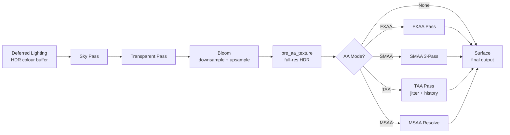
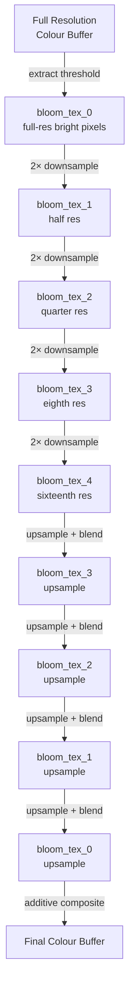
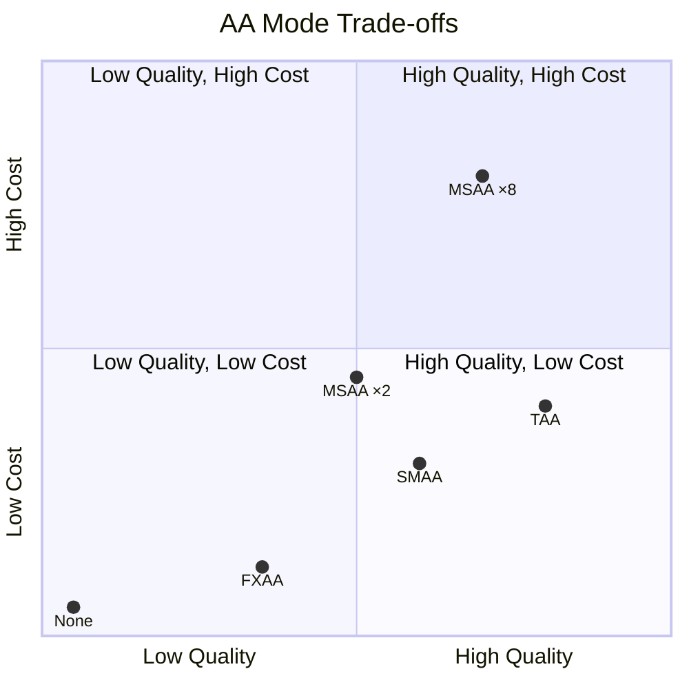
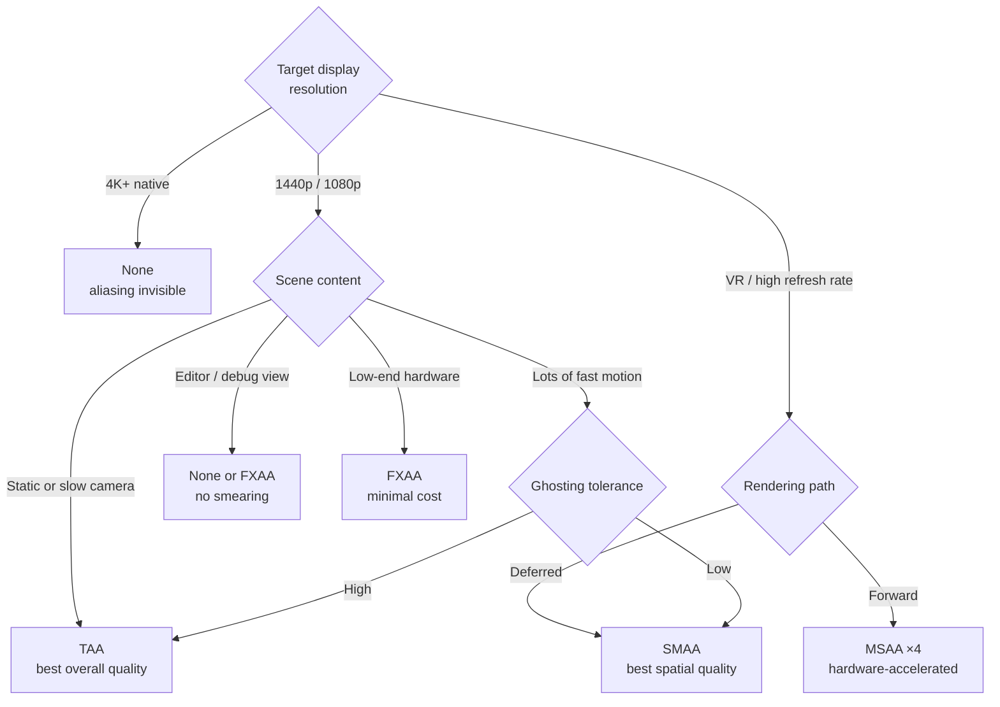
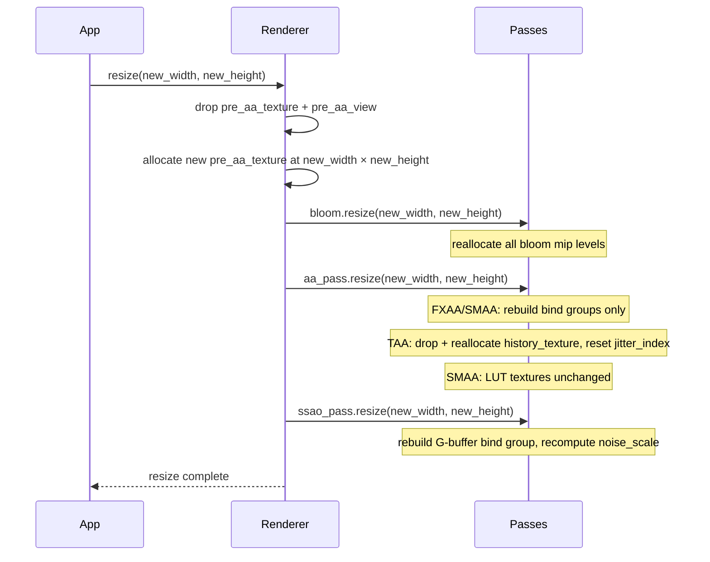

# Post-Processing

Post-processing is the final creative and corrective layer of Helio's rendering pipeline. After the deferred lighting pass has resolved every light's contribution into a fully-lit HDR colour buffer, there is still meaningful work to do: the image needs to look *good*. Bright emissive surfaces should bleed light into their surroundings (bloom), sub-pixel geometry aliasing should be smoothed away (anti-aliasing), and ambient occlusion should pull contact shadows back into crevices and corners (SSAO). This page explains every stage in that sequence, the Rust API that configures it, and the practical trade-offs that should guide your choices.

## The Post-Processing Chain

Post-processing in Helio is not a single monolithic pass — it is an ordered sequence of discrete GPU passes that transform the deferred output into the final surface image. The order matters because each stage consumes the output of the previous one. Each pass in the chain is independently gated — it runs only if it is registered, enabled, and fully initialised — so the chain gracefully collapses to the minimum necessary work when features are turned off.



The deferred lighting pass, sky pass, transparent pass, and bloom pass all write into an intermediate **HDR colour buffer**. Only once that accumulation is complete does the anti-aliasing pass fire, reading from that buffer and writing directly to the swap-chain surface. This separation is deliberate: anti-aliasing algorithms must see the final pre-AA image in its entirety — applying AA mid-pipeline would cause it to smear across geometry that later gets composited on top.

It is worth understanding *why* the sky and transparent passes sit between deferred lighting and bloom, and not after it. The sky is rendered with a fullscreen depth-reject pass (only covering pixels where no geometry was drawn), so it naturally fits after the opaque deferred resolve. Transparent objects are rendered in a separate forward pass because the G-buffer cannot represent multiple layers of translucency — they need to read from the already-resolved opaque lighting result and blend on top of it. Both contribute colour values that could exceed the bloom threshold, so they must complete before bloom extraction runs.

> [!NOTE]
> When `AntiAliasingMode::None` is selected the intermediate `pre_aa_texture` is not needed and the deferred lighting pass writes directly to the surface, saving the cost of one full-resolution texture allocation and copy.

## The `pre_aa_texture` Intermediate Target

Most AA algorithms work as a screen-space post-process: they read the fully-rendered frame and output a smoothed version. To make that possible, Helio allocates a `pre_aa_texture` — a `wgpu::Texture` at the same resolution and format as the surface — into which every pass before AA writes its results.

```rust
// renderer/mod.rs
// pre_aa_texture: wgpu::Texture  — rendered frame BEFORE anti-aliasing
// pre_aa_view: wgpu::TextureView
//
// After deferred_lighting + sky + transparent + bloom → result lives in pre_aa_texture
// AA pass reads pre_aa_texture, writes directly to surface
//
// When aa_mode=None: deferred_lighting writes directly to surface (no pre_aa copy needed)
```

The texture format matches the swap-chain surface format so that the AA pass can write directly to the surface without a format-conversion resolve step. Both textures share the same `wgpu::TextureUsages::RENDER_ATTACHMENT | wgpu::TextureUsages::TEXTURE_BINDING` flags: `RENDER_ATTACHMENT` so earlier passes can render into it, and `TEXTURE_BINDING` so the AA shader can read from it as a sampled texture.

The bind groups that wire this texture into the AA shaders (`fxaa_bind_group`, `smaa_bind_group`, `taa_bind_group`) are stored as `Option<wgpu::BindGroup>` on the renderer. They are **rebuilt on resize** because the underlying texture dimensions change, but they are not rebuilt when you change AA mode — the mode is fixed at renderer creation time and switching it requires re-creating the renderer.

> [!IMPORTANT]
> Because the AA mode is baked into the render pipeline state at initialisation, you cannot switch between FXAA and TAA at runtime. Plan your AA choice as part of your `RendererConfig` before creating the renderer.

On resize, all post-processing resources that depend on screen resolution are re-created: `pre_aa_texture`, the bloom mip chain, the SSAO noise texture, and all AA bind groups. Resources whose size is independent of the viewport (e.g. the SMAA area/search LUT textures, TAA uniform buffer) are left untouched.

One subtle consequence of the `pre_aa_texture` design is that the bloom composite step writes into it, not directly into the surface. This means the AA pass sees the *bloomed* result, which is correct: bloom adds energy to bright edge pixels and the AA algorithm should smooth that added energy along with the underlying geometry. If bloom ran *after* AA, the bloom extraction would operate on an already-blurred image and would miss the sharp high-luminance pixels at geometric edges — exactly the pixels you most want to bloom.

---

## Bloom

### Why Bloom Exists

Real camera lenses and the human eye cannot perfectly focus all wavelengths and intensities of light. Very bright light sources — the sun, an arc welder, an emissive panel at night — bleed into adjacent pixels through chromatic aberration, lens diffusion, and retinal afterglow. Physically-based bloom simulates this bleeding and is essential for making HDR lighting *read* correctly even on an SDR display: without it, a surface at luminance 5.0 looks identical to one at 1.0 because both clamp to white.

Helio's bloom implementation operates in two conceptual phases: **extraction** (isolating the bright parts of the image) and **scatter** (spreading that brightness using a cascade of blurs), followed by a **composite** step that additively blends the scattered result back onto the colour buffer.

### The Downsample / Upsample Algorithm

<!-- screenshot: bloom cascade — left panel shows extracted bright pixels at full res; right panel shows the same scene without bloom for comparison -->

The algorithm used in Helio is a dual Kawase-style pyramid — the same broad approach popularised by the Call of Duty: Advanced Warfare presentation and widely adopted in modern game engines. It avoids the ringing and halo artefacts of a simple Gaussian by progressively blending at multiple scales.

The key insight is that a repeated bilinear downsample approximates a Gaussian kernel very efficiently: a 2×2 box filter at each mip level accumulates into a separable Gaussian whose sigma grows with the number of levels. By accumulating *up* the pyramid as well as down, you get a result whose frequency response closely matches a physically-motivated point-spread function for a lens with a circular aperture — without ever building a large convolution kernel in the shader.



The **extract** step runs a pixel shader over the full-resolution colour buffer. For every texel whose luminance (computed as `dot(colour.rgb, vec3(0.2126, 0.7152, 0.0722))`) exceeds `BLOOM_THRESHOLD`, the texel's colour is written into `bloom_tex_0`; otherwise black is written. This hard cut can be softened to a smooth knee in the WGSL, but the default is a sharp threshold.

#### Rec. 709 Perceptual Luminance

The luminance coefficient vector comes from the ITU-R Rec. 709 (sRGB primaries) standard:

$$Y = 0.2126\, R + 0.7152\, G + 0.0722\, B$$

The human eye is most sensitive to green (~550 nm), less to red, and least to blue. These coefficients convert linear RGB to perceptual brightness. A pixel "blooms" when its *perceived* brightness exceeds the threshold — not just any single channel — which prevents, for example, a fully-saturated blue pixel from triggering bloom even though it reads as dark to a human observer.

```wgsl
fn luminance(colour: vec3<f32>) -> f32 {
    return dot(colour, vec3<f32>(0.2126, 0.7152, 0.0722));
}
fn bloom_extract(colour: vec3<f32>, threshold: f32) -> vec3<f32> {
    let lum = luminance(colour);
    return colour * max(lum - threshold, 0.0) / max(lum, 0.0001);
}
```

The `bloom_extract` variant scales the colour proportionally to how far it exceeds the threshold — a smooth soft-knee lift rather than a binary cut. The `max(lum, 0.0001)` guard prevents a divide-by-zero on black pixels.

The **downsample chain** applies 5–6 half-resolution passes. Each downsample takes a 2×2 box filter plus a set of diagonal samples to produce a gentle pre-blur that prevents aliasing during the upsample phase.

#### Kawase Dual-Filter Downsample

Each downsample step takes four bilinear samples at half-pixel offsets and averages them:

$$C_{\text{down}}(x,y) = \frac{1}{4}\sum_{i \in \{+0.5,\,-0.5\}} \sum_{j \in \{+0.5,\,-0.5\}} C_{\text{src}}\!\left(\frac{x+i}{W_{\text{src}}},\; \frac{y+j}{H_{\text{src}}}\right)$$

Hardware bilinear filtering at the half-pixel offset implicitly averages a 2×2 neighbourhood, so each GPU texture fetch is already a 4-tap box filter. Sampling four such points gives an effective 8×8 coverage footprint per downsample pass for the cost of four texture reads.

```wgsl
fn downsample(tex: texture_2d<f32>, s: sampler, uv: vec2<f32>) -> vec3<f32> {
    let inv_size = 1.0 / vec2<f32>(textureDimensions(tex));
    let o = inv_size * 0.5; // half-pixel offset
    var c = textureSample(tex, s, uv + vec2( o.x,  o.y)).rgb;
    c    += textureSample(tex, s, uv + vec2(-o.x,  o.y)).rgb;
    c    += textureSample(tex, s, uv + vec2( o.x, -o.y)).rgb;
    c    += textureSample(tex, s, uv + vec2(-o.x, -o.y)).rgb;
    return c * 0.25;
}
```

The **upsample chain** works in reverse, reading from each smaller mip and additively accumulating into the next-larger mip. By the time the result reaches `bloom_tex_0` again, it contains a naturally wide Gaussian-shaped spread of the original bright regions.

The **composite** step in `deferred_lighting.wgsl` reads `bloom_tex_0` and adds it to the colour output, scaled by `BLOOM_INTENSITY`. Because this blend is additive, a value of `0.0` produces no bloom at all regardless of threshold, and a value of `2.0` produces a very aggressive, overexposed glow.

#### Bloom Composite (Additive)

$$C_{\text{final}} = C_{\text{scene}} + \text{intensity} \cdot C_{\text{bloom\_up}}$$

where  is the fully upsampled bloom pyramid result. The operation is purely additive — it never darkens the scene. This mirrors the physical process of light scatter in a lens: extra photons arrive at adjacent pixels, but none are removed from the source pixel.

A WGSL extract pass looks approximately like this, with the override constants substituted at pipeline-specialisation time:

```wgsl
override BLOOM_THRESHOLD: f32 = 1.0;
override BLOOM_INTENSITY: f32 = 0.3;
override ENABLE_BLOOM: bool = true;

@fragment
fn extract_fs(in: VertexOutput) -> @location(0) vec4<f32> {
    let colour = textureSample(input_tex, input_sampler, in.uv).rgb;
    // Perceptual luminance (Rec. 709 coefficients)
    let luma = dot(colour, vec3<f32>(0.2126, 0.7152, 0.0722));
    // Extract only pixels above threshold
    let extracted = select(vec3<f32>(0.0), colour, luma > BLOOM_THRESHOLD);
    return vec4<f32>(extracted, 1.0);
}
```

And the composite step in the deferred lighting shader:

```wgsl
@fragment
fn lighting_composite_fs(in: VertexOutput) -> @location(0) vec4<f32> {
    var lit = compute_lighting(in);  // full deferred lighting result
    if ENABLE_BLOOM {
        let bloom_contrib = textureSample(bloom_tex, bloom_sampler, in.uv).rgb;
        lit += bloom_contrib * BLOOM_INTENSITY;
    }
    return vec4<f32>(lit, 1.0);
}
```

> [!TIP]
> Bloom is most convincing when used alongside physically-correct HDR lighting. If your scene never produces luminance values above `1.0`, almost no pixels will pass the extraction threshold and bloom will have no effect. Make emissive materials use values well above `1.0` — `3.0` to `10.0` is typical for emissive panels or light fixtures.

### `BloomFeature` Configuration

Bloom in Helio is a `Feature` — it participates in the feature registry and can be toggled or tuned before renderer creation.

```rust
use helio::features::BloomFeature;

let bloom = BloomFeature::new()
    .with_threshold(0.8)   // extract pixels brighter than 0.8 luminance
    .with_intensity(0.5);  // additive composite strength, clamped 0.0–2.0
```

| Parameter | Default | Range | Description |
|-----------|---------|-------|-------------|
| `threshold` | `1.0` | `≥ 0.0` | Luminance cutoff for extraction. Lower values capture more of the image. |
| `intensity` | `0.3` | `0.0 – 2.0` | Additive blend weight of the upsample result. Clamped at construction time. |

```rust
pub struct BloomFeature {
    enabled: bool,
    pub threshold: f32,  // default 1.0 — luminance cutoff
    pub intensity: f32,  // default 0.3 — clamped 0.0–2.0
}

impl BloomFeature {
    pub fn new() -> Self { /* enabled: true, threshold: 1.0, intensity: 0.3 */ }

    pub fn with_intensity(mut self, intensity: f32) -> Self {
        self.intensity = intensity.clamp(0.0, 2.0);
        self
    }

    pub fn with_threshold(mut self, threshold: f32) -> Self {
        self.threshold = threshold.max(0.0);
        self
    }
}
```

> [!NOTE]
> `BloomFeature::register()` only logs the configured parameters; no GPU resources are allocated at that point. The actual bloom render passes and texture chain are created during renderer initialisation. `BloomFeature::prepare()` is a no-op — the bloom mip chain is a fixed-cost allocation rather than a per-frame dynamic resource.

### WGSL Override Constants

Helio uses WGSL [pipeline-overridable constants](https://www.w3.org/TR/WGSL/#override-decls) to communicate bloom parameters from Rust into the shader at pipeline-specialisation time, avoiding uniform buffer overhead for values that do not change per frame:

| Constant | Type | Value when disabled |
|----------|------|---------------------|
| `ENABLE_BLOOM` | `bool` | `false` |
| `BLOOM_INTENSITY` | `f32` | `0.3` (no-op, zero writes guard in shader) |
| `BLOOM_THRESHOLD` | `f32` | `1.0` |

When `enabled` is `false`, `ENABLE_BLOOM` is set to `false` and the composite step in `deferred_lighting.wgsl` short-circuits the entire bloom branch at compile time — there is no runtime branch cost.

In Rust, the override constants are injected through `wgpu::PipelineCompilationOptions`:

```rust
// Simplified illustration of how BloomFeature injects shader defines
fn shader_defines(&self) -> Vec<(String, ShaderDefValue)> {
    vec![
        ("ENABLE_BLOOM".into(),    ShaderDefValue::Bool(self.enabled)),
        ("BLOOM_INTENSITY".into(), ShaderDefValue::F32(
            if self.enabled { self.intensity } else { 0.3 }
        )),
        ("BLOOM_THRESHOLD".into(), ShaderDefValue::F32(
            if self.enabled { self.threshold } else { 1.0 }
        )),
    ]
}
```

The fact that these values are specialisation constants rather than uniform buffer fields means they are free at runtime: the GPU driver compiles a distinct shader variant for each unique combination of values, and the compiled shader has zero overhead for reading them. The trade-off is that changing them requires re-creating the pipeline — they are not suitable for values that change per-frame.

---

## Anti-Aliasing

### Why Five Modes Exist

Anti-aliasing is one of the oldest unsolved problems in real-time rendering. No single algorithm is universally best: the right choice depends on your target hardware, your scene content, whether you have a depth buffer (deferred rendering always does), motion vector availability, and your tolerance for temporal artefacts. Helio therefore ships five discrete modes, each representing a distinct point in the quality/cost/complexity trade-off space.

It is also worth acknowledging that each mode has a different *failure mode*. FXAA blurs fine detail. SMAA can miss sub-pixel geometry. TAA ghosts. MSAA misses shader-aliasing. Understanding these failure modes is as important as understanding the benefits when making your choice.



```rust
pub enum AntiAliasingMode {
    None,
    Fxaa,
    Smaa,
    Taa,
    Msaa(MsaaSamples),
}

pub enum MsaaSamples { X2 = 2, X4 = 4, X8 = 8 }
```

---

### `AntiAliasingMode::None`

With no anti-aliasing enabled, the output of the last pre-AA pass is written directly to the swap-chain surface. This is not just the cheapest option — it is sometimes the *correct* one:

- **High-DPI displays.** A 4K display at 100% scaling has 4× the pixel density of a 1080p display. At native resolution the pixels are small enough that aliasing is imperceptible, and the cost of AA buys you nothing.
- **Performance-critical paths.** In editor viewports or thumbnail renderers where frame time matters more than final image quality, disabling AA entirely frees GPU budget for more useful work.
- **Debugging.** AA algorithms smear pixels across edges. When debugging G-buffer contents, lighting contributions, or SSAO, disabling AA ensures you see exactly what the shader wrote.

> [!TIP]
> `AntiAliasingMode::None` is the `Default` for `AntiAliasingMode`. If you do not call `.with_aa()` on your `RendererConfig`, you get no AA.

---

### FXAA — Fast Approximate Anti-Aliasing

FXAA is a single-pass screen-space post-process developed by Timothy Lottes at NVIDIA. It is the lowest-cost AA solution that produces a visually meaningful improvement over no AA.

**How it works:** FXAA reads the colour of each output pixel and a small neighbourhood of neighbours. It computes the local luminance gradient to identify edge pixels — pixels that sit on the boundary between a bright region and a dark region. For edge pixels, it blends the colour of the current pixel with the colour of its neighbours *along the edge direction*, effectively sub-pixel averaging without any additional geometry information.

```rust
pub struct FxaaPass {
    pipeline: Arc<wgpu::RenderPipeline>,
    bind_group_layout: wgpu::BindGroupLayout,
    // Reads: pre_aa_texture
    // Writes: surface
    // Uses a linear sampler for sub-pixel blending along detected edges
}
```

**Strengths:**
- Extremely low GPU cost — a single pass with a small texture footprint
- Works on any hardware without depth or motion vector requirements
- Eliminates the most egregious staircase aliasing on high-contrast edges

**Weaknesses:**
- Blurs fine detail, especially thin lines and text
- Does not help with shader aliasing (specular highlights, thin geometry)
- Quality is noticeably lower than SMAA or TAA on close inspection

FXAA is a good choice for mobile or low-end hardware targets, or for any context where you need *some* AA at essentially zero cost.

> [!TIP]
> FXAA's edge detection is entirely luminance-based. This means it cannot anti-alias specular highlights that flicker between frames, thin geometry that covers less than a full pixel, or sub-pixel detail like fine text. If these are problems in your scene, SMAA or TAA will serve you better.

---

### SMAA — Subpixel Morphological Anti-Aliasing

SMAA is a higher-quality screen-space algorithm that analyses edge *shapes* (morphology) rather than just luminance gradients. It requires three GPU render passes per frame internally, but produces significantly sharper results than FXAA while remaining free of temporal ghosting.

```rust
pub struct SmaaPass {
    // Pass 1: edge detection — writes edge_texture
    edge_pipeline: Arc<wgpu::RenderPipeline>,

    // Pass 2: blending weight calculation — uses pre-computed area/search LUTs
    blend_pipeline: Arc<wgpu::RenderPipeline>,

    // Pass 3: neighbourhood blending — final output written to surface
    neighborhood_pipeline: Arc<wgpu::RenderPipeline>,
}
```

**Pass 1 — Edge Detection.** The edge shader scans the colour buffer for luminance discontinuities (similar to FXAA's first step) and writes a binary edge mask into `edge_texture`. This mask identifies which pixel edges are candidates for anti-aliasing.

#### SMAA Detection Threshold

Edge detection uses the absolute luminance gradient between adjacent pixels:

$$\text{edge}(x,y) = \lvert Y(x,y) - Y(x-1,y) \rvert + \lvert Y(x,y) - Y(x,y-1) \rvert > T_{\text{edge}}$$

where . Pixels whose combined horizontal and vertical luminance delta exceeds  are marked as edge pixels and receive anti-aliasing treatment in the subsequent passes. The threshold prevents noise and low-contrast texture detail from being misclassified as geometric edges.

**Pass 2 — Blending Weights.** This is SMAA's distinguishing feature. Using pre-computed look-up textures (the *area LUT* and *search LUT*, both loaded at renderer initialisation), the blending weight pass examines the shapes of edges in the mask and computes how much of each neighbouring pixel should be blended at each edge endpoint. Recognising L-shaped, Z-shaped, and U-shaped edge patterns is what separates SMAA from simpler algorithms.

**Pass 3 — Neighbourhood Blending.** The final pass uses the weight texture computed in Pass 2 to blend each edge pixel with its neighbours, producing the anti-aliased output on the surface.

<!-- screenshot: SMAA quality comparison — 400% crop showing a diagonal edge under None / FXAA / SMAA modes, illustrating the preservation of line sharpness in SMAA -->

> [!NOTE]
> The area and search LUT textures loaded during SMAA initialisation are constant and hardware-independent. They are not rebuilt on resize and add a small (~200 KB) constant memory cost regardless of resolution.

**When to choose SMAA:** SMAA is the best single-frame AA option in Helio. Choose it when you need high spatial quality without the temporal ghosting of TAA — for example in editors with frequent camera cuts, or in scenes with lots of fine geometric detail.

One practical consideration: SMAA's three-pass structure means it submits three sets of draw calls and three texture barriers per frame. On tile-based GPU architectures (many mobile GPUs, Apple Silicon) the on-chip tile memory can make this cheaper than it appears, because the intermediate edge texture and blend weight texture may fit entirely in tile memory. On desktop discrete GPUs the cost is dominated by bandwidth, and three passes over a 1080p target is still well within budget for 60+ FPS.

---

### TAA — Temporal Anti-Aliasing

TAA takes a fundamentally different approach: instead of gathering additional samples *spatially* (from neighbouring pixels in the current frame), it gathers them *temporally* (by accumulating sub-pixel samples across many frames). Over a still or slowly-moving camera, this produces quality equivalent to 8× or 16× SSAA at a fraction of the cost.

```rust
pub struct TaaConfig {
    pub feedback_min: f32,  // default 0.88 — minimum history blend weight
    pub feedback_max: f32,  // default 0.97 — maximum history blend weight
}

pub struct TaaPass {
    pipeline: Arc<wgpu::RenderPipeline>,
    bind_group_layout: wgpu::BindGroupLayout,
    sampler_linear: wgpu::Sampler,
    sampler_point: wgpu::Sampler,
    uniform_buffer: wgpu::Buffer,
    config: TaaConfig,
    history_texture: Option<wgpu::Texture>,  // previous frame's output
    history_view: Option<wgpu::TextureView>,
    jitter_index: u32,                        // cycles through jitter sequence
}
```

**Jitter.** Each frame, TAA applies a sub-pixel offset — the *jitter* — to the projection matrix before the geometry passes run. This shifts the sample position by a fraction of a pixel, so that over a sequence of frames the samples collectively cover the full pixel area. The jitter follows a low-discrepancy sequence (Halton or similar) to ensure good coverage with minimal repetition.

The jitter sequence shifts the projection matrix by a sub-pixel offset each frame, sampling different sub-pixel positions over time:

$$\mathbf{P}_{\text{jittered}} = \mathbf{P} + \frac{1}{2}\begin{pmatrix} j_x / W \\ j_y / H \end{pmatrix} \text{ (in NDC)}$$

where  cycles through a Halton or Hammersley low-discrepancy sequence. The factor of  converts from pixel-space to NDC half-steps. Over a sequence of frames these offsets tile the unit pixel area densely, so temporal accumulation converges to sub-pixel precision.

The jitter is applied to the projection matrix in clip space, not to the viewport transform. This means the jitter is correctly accounted for by the depth buffer — a jittered depth value corresponds to the correct world-space depth for that sub-pixel position. The `jitter_index` field on `TaaPass` advances by one each frame and wraps around after the sequence length (typically 8 or 16 samples), providing repeating but well-distributed sub-pixel coverage.

```rust
// The jitter offset is written into TaaUniform each frame before the pass executes
struct TaaUniform {
    feedback_min: f32,
    feedback_max: f32,
    jitter_offset: [f32; 2],  // current frame's sub-pixel offset in UV space
}
```

**History accumulation.** After the current jittered frame is rendered, the TAA pass blends it with the `history_texture` (the accumulated output from all previous frames). The blend weight is controlled by `feedback_min` and `feedback_max`:

```rust
// TAA blend logic (conceptual WGSL)
let history_weight = clamp(
    computed_weight,  // based on neighbourhood variance, motion vectors
    config.feedback_min,  // 0.88 — floor: at least 88% history
    config.feedback_max,  // 0.97 — ceiling: at most 97% history
);
let output = mix(current_sample, history_sample, history_weight);
```

#### TAA Temporal Blend

$$C_{\text{out}} = \operatorname{lerp}(C_{\text{current}},\; C_{\text{history}},\; \alpha)$$
$$\alpha = \operatorname{clamp}(\alpha_{\text{computed}},\; \alpha_{\min},\; \alpha_{\max})$$

with  and  by default.

 is the **history weight** — how much of the accumulated past frames to keep. High  (→ 0.97) means more averaging across many frames, producing a smooth result but increasing ghosting behind fast-moving objects. Low  (→ 0.88) produces a sharper, more responsive result at the cost of more temporal noise on static geometry. The clamp prevents the blend factor from leaving the stable convergence range.

| `feedback_max` | Effect |
|---------------|--------|
| High (0.97+) | Smoother accumulation, more ghosting behind fast-moving objects |
| Low (0.85–) | Faster response to motion, noisier on static geometry |

> [!WARNING]
> TAA introduces *ghosting* — a smearing artefact that appears behind fast-moving objects because the history buffer still contains colour from where the object used to be. Helio's TAA pass performs neighbourhood clamping (clipping history colour to the AABB of the current pixel's neighbourhood) to suppress ghosting, but the effect can still be visible for very rapid motion. If your scene contains frequent fast motion or camera cuts, SMAA is likely a better choice.

**Neighbourhood clamping** works by computing the minimum and maximum colour values in a 3×3 neighbourhood around the current pixel, then clamping the history sample to that bounding box before blending. This prevents the history from contributing colours that are no longer consistent with the current scene state. It is effective at removing ghosting behind moving objects but can introduce a slight loss of convergence quality on static geometry — the history is partially discarded even in regions where it would have been valid.

**History texture lifecycle.** The `history_texture` is allocated at TAA pass creation time. On resize, it is dropped and re-created at the new resolution. When TAA first starts (or after a resize), there is no valid history — the pass warms up over the first few frames, which may appear momentarily noisier than steady-state.

---

### MSAA — Multisample Anti-Aliasing

MSAA is a hardware-accelerated technique that differs fundamentally from the screen-space algorithms above. Rather than post-processing an already-rendered image, MSAA causes the rasteriser to evaluate triangle coverage at multiple sub-pixel *sample* locations per pixel during the geometry pass itself. Only edge pixels (where multiple triangles cover different sub-pixel samples) incur the cost of multiple colour evaluations.

```rust
pub enum MsaaSamples {
    X2 = 2,
    X4 = 4,
    X8 = 8,
}

impl MsaaSamples {
    pub fn as_u32(&self) -> u32 { *self as u32 }
}
```

> [!IMPORTANT]
> MSAA is most effective in **forward rendering** pipelines. In Helio's deferred pipeline the G-buffer is written per-pixel, not per-sample, which significantly limits the effectiveness of MSAA — the lighting calculation at the resolve step still operates on one sample per pixel. MSAA in Helio's deferred mode mainly anti-aliases the depth/stencil boundaries rather than providing per-fragment multi-sampling of the lighting.

| Sample Count | Memory overhead | AA quality |
|-------------|----------------|------------|
| `X2` | 2× render target size | Modest improvement |
| `X4` | 4× render target size | Good edge smoothing |
| `X8` | 8× render target size | Excellent, diminishing returns |

MSAA is most appropriate when:
- You have a forward or hybrid rendering path
- Your primary aliasing source is geometry edges (not shader aliasing)
- Your target hardware supports the desired sample count natively

For deferred-primary workloads, prefer SMAA or TAA over MSAA.

> [!NOTE]
> `wgpu` exposes MSAA sample counts as a capability query — not all hardware supports all sample counts. Before using `MsaaSamples::X8`, check that `device.limits()` reports adequate multisampling support for your target texture format. Most desktop GPUs support up to ×8; many mobile GPUs are limited to ×4.

---

## SSAO — Screen-Space Ambient Occlusion

Ambient occlusion approximates the self-shadowing of geometry in the ambient lighting term. In crevices, corners, and under ledges, less ambient light reaches the surface because nearby geometry blocks it. SSAO computes this per-pixel by sampling the depth buffer in a hemisphere around the surface normal and checking how many samples are occluded by geometry.

### `SsaoConfig`

```rust
pub struct SsaoConfig {
    pub radius: f32,    // default 0.5 — world-space AO sampling radius
    pub bias: f32,      // default 0.025 — prevents self-occlusion artefacts
    pub power: f32,     // default 2.0 — AO contrast (gamma curve exponent)
    pub samples: u32,   // default 16 — hemisphere sample count
}
```

| Field | Default | Description |
|-------|---------|-------------|
| `radius` | `0.5` | World-space radius of the sampling hemisphere. Larger values catch broad occlusion (under furniture, in rooms) but may produce halo artefacts at large geometric discontinuities. |
| `bias` | `0.025` | Depth offset applied to samples to prevent a surface from occluding itself due to floating-point precision. Too small → self-occlusion noise; too large → missed near-surface occlusion. |
| `power` | `2.0` | Exponent applied to the raw AO factor after accumulation. Higher values increase contrast, darkening occluded areas more aggressively. `1.0` is linear; `3.0+` is very contrasty. |
| `samples` | `16` | Number of hemisphere samples per pixel. More samples → smoother AO at higher cost. `8` is low quality; `32` approaches noise-free on typical scenes. |

#### SSAO Hemisphere Sampling

SSAO samples  random directions in the hemisphere aligned with the surface normal and counts how many sample points lie inside nearby geometry:

$$\text{AO} = \frac{1}{N}\sum_{i=1}^{N} \mathbf{1}\!\left[z_{\text{sample}_i} > z_{\text{depth\_buffer}}\right]$$

$$\text{AO}_{\text{final}} = \text{AO}^{\text{power}}$$

The indicator function  is  when a sample point is occluded (its reconstructed depth is behind the depth buffer) and  when it is not. The `power` exponent (default 2.0) applies a gamma curve to increase contrast in occluded regions. The `bias` term (default 0.025) offsets each sample slightly above the surface before depth comparison, preventing self-occlusion artefacts at grazing angles where floating-point depth precision is lowest.

The SSAO pass writes a single-channel `R8` texture (`ao_texture`) that represents the ambient occlusion factor at each pixel, where `1.0` means fully unoccluded and `0.0` means fully occluded. The deferred lighting pass would multiply the ambient light contribution by this factor.

```rust
struct SsaoUniform {
    radius: f32,
    bias: f32,
    power: f32,
    samples: u32,
    noise_scale: [f32; 2],  // screen_res / noise_tile_size (4×4 tile)
    _pad: [f32; 2],
}
```

The `noise_scale` field tiles a small random rotation texture over the screen to break up the banding patterns that arise from using a fixed hemisphere sample kernel. This is the standard SSAO noise trick — the tiling artefact is then removed by a bilateral blur pass.

<!-- screenshot: SSAO visualisation — single-channel AO texture displayed in false colour, showing dark contact shadows under a mesh sitting on a plane -->

### Current Status: Not Yet Wired

> [!WARNING]
> **SSAO is not yet wired into the render graph.** The `SsaoPass` implementation is complete and the `RendererConfig` fields exist, but the pass is not executed during frame rendering. Enabling SSAO via `RendererConfig` reserves the configuration and allocates the pass struct, but has **no effect on rendered output** in the current version of Helio.

This status will change in a future release when SSAO is connected to the deferred lighting pass. The API is intentionally designed so that existing code using `with_ssao()` will begin producing occlusion output automatically when the wiring is complete, without requiring any API changes on the caller's side.

```rust
// The pass reads from the G-buffer:
// Pass reads: depth_view, G-buffer normals
// Would write: ao_texture (single-channel R8)
// DeferredLightingPass would then multiply ambient by ao_texture
```

When SSAO is eventually wired in, the expected integration point is after the G-buffer is filled but before deferred lighting resolves. The `ao_texture` output would be bound as an additional input to the deferred lighting shader, and the ambient term computation would be multiplied by the sampled AO value:

```wgsl
// Future deferred_lighting.wgsl ambient term (illustrative)
let ao = textureSample(ao_texture, ao_sampler, in.uv).r;
let ambient = ambient_colour * material.base_colour * ao;
```

This means SSAO will have no effect on direct lighting (diffuse, specular) — only on the ambient term. For scenes with strong ambient lighting (outdoor scenes, well-lit interiors) this is noticeable. For scenes with very low ambient (dark interiors lit primarily by point lights) the SSAO contribution will be subtle.

---

## Configuration API

### `RendererConfig`

All post-processing options are configured through `RendererConfig` using a builder pattern. The config is consumed when the renderer is created and cannot be mutated afterwards.

```rust
pub struct RendererConfig {
    pub width: u32,
    pub height: u32,
    pub surface_format: wgpu::TextureFormat,
    pub features: FeatureRegistry,
    pub enable_ssao: bool,
    pub ssao_config: SsaoConfig,
    pub aa_mode: AntiAliasingMode,
    pub taa_config: TaaConfig,
}
```

### Setting the AA Mode

```rust
use helio::{
    renderer::RendererConfig,
    passes::{AntiAliasingMode, MsaaSamples, TaaConfig},
};

// No anti-aliasing (default)
let config = RendererConfig::new(1920, 1080, surface_format, features);

// FXAA — fastest option
let config = RendererConfig::new(1920, 1080, surface_format, features)
    .with_aa(AntiAliasingMode::Fxaa);

// SMAA — best single-frame quality
let config = RendererConfig::new(1920, 1080, surface_format, features)
    .with_aa(AntiAliasingMode::Smaa);

// TAA with default feedback (0.88 min, 0.97 max)
let config = RendererConfig::new(1920, 1080, surface_format, features)
    .with_aa(AntiAliasingMode::Taa);

// TAA with custom feedback — reduce ghosting for fast-motion scenes
let config = RendererConfig::new(1920, 1080, surface_format, features)
    .with_aa(AntiAliasingMode::Taa)
    .with_taa_config(TaaConfig {
        feedback_min: 0.85,
        feedback_max: 0.92,
    });

// MSAA ×4
let config = RendererConfig::new(1920, 1080, surface_format, features)
    .with_aa(AntiAliasingMode::Msaa(MsaaSamples::X4));
```

Note that `.with_taa_config()` is silently ignored if the AA mode is not `Taa`. It is valid to call it regardless — the config is stored and will take effect if you later change the AA mode by re-creating the renderer.

### Configuring SSAO

Even though SSAO output is not currently wired into the render graph, the configuration API is available and stable:

```rust
use helio::{renderer::RendererConfig, passes::SsaoConfig};

// Enable SSAO with defaults (radius 0.5, bias 0.025, power 2.0, 16 samples)
let config = RendererConfig::new(1920, 1080, surface_format, features)
    .with_ssao();

// Enable SSAO with custom parameters
let config = RendererConfig::new(1920, 1080, surface_format, features)
    .with_ssao_config(SsaoConfig {
        radius: 0.3,    // tighter radius for interior scenes
        bias: 0.02,
        power: 1.8,
        samples: 32,    // higher sample count for smoother results
    });
```

### Configuring Bloom via the Feature Registry

Bloom is registered as a `Feature`, not a config field, so it goes through the `FeatureRegistry`:

```rust
use helio::{features::BloomFeature, renderer::RendererConfig};

let mut features = FeatureRegistry::new();
features.register(
    BloomFeature::new()
        .with_threshold(0.9)
        .with_intensity(0.4),
);

let config = RendererConfig::new(1920, 1080, surface_format, features)
    .with_aa(AntiAliasingMode::Smaa);
```

---

## Choosing the Right AA Mode

The following decision tree covers the most common scenarios:



| Scenario | Recommended Mode | Reason |
|----------|-----------------|--------|
| 4K display, modern GPU | None | Pixel density eliminates visible aliasing |
| 1080p, action game | TAA | Best quality; motion handling worth tuning |
| 1080p, strategy / editor | SMAA | No ghosting; sharp lines |
| Low-end / mobile target | FXAA | Negligible cost |
| Forward render VR | MSAA ×4 | Hardware resolve, no post-process latency |
| Debugging / profiling | None | See raw output without smearing |

---

## Runtime Pass Toggling

Individual post-processing passes can be enabled or disabled at runtime without re-creating the renderer. This is useful for in-editor toggles, A/B comparisons during development, or dynamic quality scaling under frame budget pressure.

```rust
// Disable bloom at runtime (e.g., user preference toggle)
renderer.set_pass_enabled("bloom", false);

// Re-enable bloom
renderer.set_pass_enabled("bloom", true);

// Check whether a pass is currently active
let bloom_on = renderer.is_pass_enabled("bloom");
```

> [!NOTE]
> `set_pass_enabled` controls whether a pass *executes* each frame, not whether its GPU resources exist. The bloom mip chain and pipeline remain allocated when bloom is disabled — re-enabling it incurs no allocation cost. If you need to permanently free the bloom resources, that currently requires re-creating the renderer without bloom registered in the feature set.

Pass names are stable string identifiers. The post-processing passes currently supporting runtime toggling are:

| Pass name | Controls |
|-----------|----------|
| `"bloom"` | Bloom extract + downsample + upsample + composite |
| `"ssao"` | SSAO hemisphere sampling (no-op until wired) |

The AA pass does not support runtime toggling because it is baked into the render pipeline graph at creation time.

A practical pattern for editor tooling is to use pass toggling to implement a "compare mode" that lets you quickly A/B between the post-processed and raw deferred output:

```rust
fn toggle_postfx(renderer: &mut Renderer, show_raw: bool) {
    renderer.set_pass_enabled("bloom", !show_raw);
    // AA cannot be toggled, but can be compared across renderer instances
    // SSAO: set_pass_enabled("ssao", !show_raw) — future use
}
```

---

## Resize Handling

When the swap-chain surface is resized (window resize, DPI change, or explicit resolution change), Helio rebuilds all screen-resolution-dependent post-processing resources. The sequence is:



Resources that are **not** rebuilt on resize:
- SMAA area/search LUT textures (content-invariant, resolution-independent)
- TAA uniform buffer (constant size)
- SSAO hemisphere sample kernel buffer (constant sample count)
- Any feature uniform buffers (bloom threshold/intensity, etc.)

> [!TIP]
> After a resize, TAA loses its history and will spend 5–10 frames re-converging to a clean accumulated image. If your application performs frequent programmatic resizes (e.g., a resizable editor panel), consider switching to SMAA for those panels to avoid the constant TAA warm-up cost.

The resize sequence is driven synchronously: the renderer waits for the GPU to finish all in-flight work before dropping and re-creating any textures. This prevents use-after-free hazards at the cost of a brief GPU stall on resize. For interactive applications where resize is rare (window drag events), this stall is imperceptible. For applications that resize continuously (e.g., animated layout transitions), you may want to throttle resize calls to fire only when the resize operation completes.

---

## Performance Budget Reference

Understanding how each post-processing stage affects your frame time helps you make informed trade-offs. The numbers below are approximate measurements on a mid-range discrete GPU (RTX 3060 class) at 1920×1080 with a typical deferred scene. Actual costs vary significantly by scene complexity, texture cache hit rate, and driver.

| Stage | Approx. GPU cost | Notes |
|-------|-----------------|-------|
| Bloom (all mips) | ~0.4 ms | 5-level pyramid; cost scales with resolution |
| FXAA | ~0.08 ms | Single full-screen pass |
| SMAA | ~0.25 ms | 3 passes; intermediate textures fit L2 cache |
| TAA | ~0.15 ms | Single pass with history blend; neighbourhood clamp adds cost |
| MSAA ×4 resolve | ~0.1 ms | Hardware resolve; dependent on geometry complexity |
| SSAO (16 samples) | ~0.6 ms | Not yet active; projected cost based on shader analysis |

> [!NOTE]
> These figures are for the post-processing passes only. The dominant cost for any complex scene remains the G-buffer fill, lighting resolve, and shadow map generation — post-processing is typically under 5% of total frame time on modern hardware.

The bloom cost is the most resolution-sensitive entry in the table. At 4K (3840×2160) the full-resolution extract pass touches 4× as many pixels as at 1080p, and the mip-chain textures grow correspondingly. At 4K with bloom enabled, expect roughly 1.2–1.6 ms for the full bloom sequence. If frame budget is tight at 4K, halving the bloom resolution (running the extract at half-res) is a common optimisation that loses little perceptual quality — emissive light sources are large relative to the screen at high DPI.

---

## Integration Example: Full Post-Processing Setup

The following example shows a complete renderer configuration with bloom, SMAA, and SSAO reserved (for future use), representing a high-quality configuration for a 1080p desktop target:

```rust
use helio::{
    features::{BloomFeature, FeatureRegistry},
    passes::{AntiAliasingMode, SsaoConfig},
    renderer::RendererConfig,
};

fn create_renderer_config(
    width: u32,
    height: u32,
    surface_format: wgpu::TextureFormat,
) -> RendererConfig {
    let mut features = FeatureRegistry::new();

    // Bloom: moderate intensity, tight threshold for emissive-heavy scene
    features.register(
        BloomFeature::new()
            .with_threshold(0.85)
            .with_intensity(0.35),
    );

    RendererConfig::new(width, height, surface_format, features)
        // SMAA for clean single-frame AA — no ghosting in editor context
        .with_aa(AntiAliasingMode::Smaa)
        // Reserve SSAO config for when it's wired into the graph
        .with_ssao_config(SsaoConfig {
            radius: 0.4,
            bias: 0.02,
            power: 2.2,
            samples: 24,
        })
}
```

And a performance-oriented configuration for a mobile or low-end target at the same resolution:

```rust
fn create_low_end_config(
    width: u32,
    height: u32,
    surface_format: wgpu::TextureFormat,
) -> RendererConfig {
    let mut features = FeatureRegistry::new();

    // Bloom with higher threshold — only capture very bright emissives
    features.register(
        BloomFeature::new()
            .with_threshold(1.2)
            .with_intensity(0.25),
    );

    RendererConfig::new(width, height, surface_format, features)
        .with_aa(AntiAliasingMode::Fxaa)
        // No SSAO — not yet active anyway, and we want to keep the config lean
}
```

---

## Interaction Between Post-Processing Stages

Some post-processing interactions are worth calling out explicitly because they can produce unexpected results if you are not aware of them.

**Bloom + TAA.** Bloom runs *before* TAA. This means the history accumulation in TAA also accumulates the bloomed result, which is generally correct — the glow around an emissive object should be temporally stable, not flickering. However, if an emissive object moves rapidly, the bloom halo around it will ghost in the history texture independently of the underlying object. Reducing TAA `feedback_max` (to `0.90` or below) mitigates this at the cost of more noise on static geometry.

**SSAO + Bloom.** When SSAO is eventually wired in, it will run *before* bloom (as part of the deferred lighting resolve). This is correct: ambient occlusion darkens the ambient term, which may push some barely-above-threshold pixels below the bloom cutoff in contact-shadow regions. This is physically reasonable — occluded corners receive less scattered light and should bloom less.

**MSAA + Bloom.** With MSAA enabled, the G-buffer is resolved to single-sample before bloom extraction runs. This means bloom sees the MSAA-resolved colour, which is correct. The alternative — running bloom on the multi-sample buffer — would require per-sample bloom extraction, which is prohibitively expensive and not meaningful.

> [!TIP]
> If you observe bloom haloes that flicker or shimmer in otherwise static scenes, the most common cause is sub-pixel geometry near the bloom threshold: tiny geometry (wires, thin poles, fence meshes) that straddles the threshold as the rasteriser snaps it to different pixel positions frame-to-frame. Raising `threshold` slightly (by `0.05–0.1`) usually eliminates the flicker. Alternatively, enabling TAA will temporally stabilise it.

---

## Debugging Post-Processing Issues

When diagnosing post-processing artefacts, the most productive approach is to disable passes one at a time and observe which change eliminates the problem.

**Isolating bloom artefacts:**
```rust
// Disable bloom temporarily to check if artefact is bloom-related
renderer.set_pass_enabled("bloom", false);
```

**Checking TAA ghosting:**

TAA ghosting is easiest to observe by holding the camera still, rapidly panning past a high-contrast object, then stopping again. Ghosting appears as a colour trail that takes several frames to fade. If ghosting is severe, try reducing `feedback_max`:

```rust
// Re-create renderer with reduced feedback ceiling
let config = RendererConfig::new(w, h, fmt, features)
    .with_aa(AntiAliasingMode::Taa)
    .with_taa_config(TaaConfig {
        feedback_min: 0.85,
        feedback_max: 0.90,  // was 0.97 — reduced to suppress ghosting
    });
```

**Verifying SSAO is not active:**

If you are calling `with_ssao()` and wondering why contact shadows are not appearing, remember that SSAO is not yet wired into the render graph. The expected result when `enable_ssao = true` is currently identical to `enable_ssao = false`. Check the Helio release notes for the version in which SSAO wiring is completed.

<!-- screenshot: debug view comparison — grid of 2×2 showing the same scene corner with AA disabled, FXAA, SMAA, and TAA respectively to illustrate the quality differences on a diagonal railing -->

---

## Summary

Helio's post-processing pipeline is a linear sequence of specialised passes, each configurable through a type-safe Rust API and optimised to do exactly one job well. Bloom adds physical credibility to HDR lighting through a dual-pyramid scatter; FXAA and SMAA trade quality against cost in a single-frame context; TAA delivers the highest long-term quality at the cost of temporal artefacts; MSAA offers hardware-native edge smoothing most suited to forward rendering; and SSAO — though not yet active — is ready to add contact shadow depth to the ambient lighting model as soon as it is connected to the render graph.

The correct combination for your project will depend on your target hardware, your scene's motion characteristics, and whether you are running in a deferred or forward context. The configuration API is intentionally built to make changing these choices low-friction, with all options expressed through a builder on `RendererConfig` before the renderer is created.

The ordering constraint — bloom before AA, sky and transparents before bloom, deferred lighting before all of it — exists to ensure each pass sees a complete, correctly-composited image. Violating this order would produce incorrect results: AA smearing over subsequently-composited layers, bloom extracting from a pre-sky image that is missing luminance from the sky dome, and so forth. The mermaid diagram at the top of this page is the canonical reference for pass ordering.

---

## Quick Reference

### Bloom

```rust
BloomFeature::new()
    .with_threshold(f32)   // ≥ 0.0, default 1.0
    .with_intensity(f32)   // 0.0–2.0, default 0.3
```

### Anti-Aliasing Modes

```rust
AntiAliasingMode::None                     // default — no AA
AntiAliasingMode::Fxaa                     // fast, single-pass
AntiAliasingMode::Smaa                     // 3-pass morphological, best spatial quality
AntiAliasingMode::Taa                      // temporal accumulation, best long-term quality
AntiAliasingMode::Msaa(MsaaSamples::X2)   // hardware MSAA ×2
AntiAliasingMode::Msaa(MsaaSamples::X4)   // hardware MSAA ×4
AntiAliasingMode::Msaa(MsaaSamples::X8)   // hardware MSAA ×8
```

### TAA Feedback

```rust
TaaConfig {
    feedback_min: f32,  // default 0.88 — floor on history weight
    feedback_max: f32,  // default 0.97 — ceiling on history weight
}
// Lower feedback_max → less ghosting, more noise on static geometry
// Higher feedback_max → smoother accumulation, more ghosting on motion
```

### SSAO (reserved — not yet active)

```rust
SsaoConfig {
    radius:  f32,   // default 0.5 — world-space sampling radius
    bias:    f32,   // default 0.025 — self-occlusion prevention offset
    power:   f32,   // default 2.0 — AO contrast exponent
    samples: u32,   // default 16 — hemisphere sample count
}
```

### RendererConfig Builder

```rust
RendererConfig::new(width, height, surface_format, features)
    .with_aa(mode)
    .with_taa_config(taa_config)   // only meaningful with AntiAliasingMode::Taa
    .with_ssao()                   // enable SSAO with defaults (reserved)
    .with_ssao_config(ssao_config) // enable SSAO with custom config (reserved)
```

### Runtime Controls

```rust
renderer.set_pass_enabled("bloom", bool);
renderer.is_pass_enabled("bloom") -> bool;
// "ssao" also supported (no-op until wired)
// AA mode is not runtime-toggleable
```
