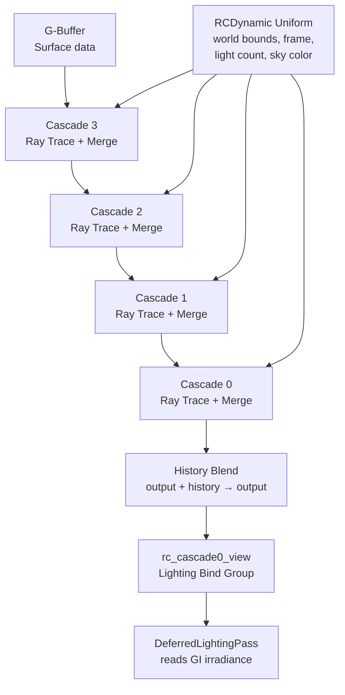
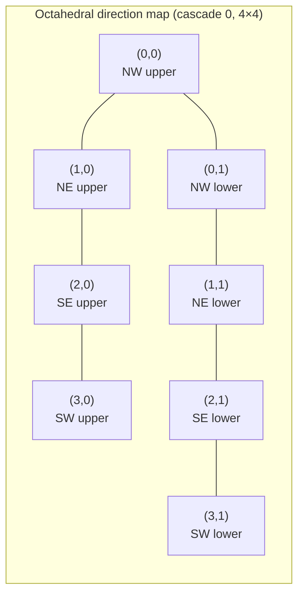
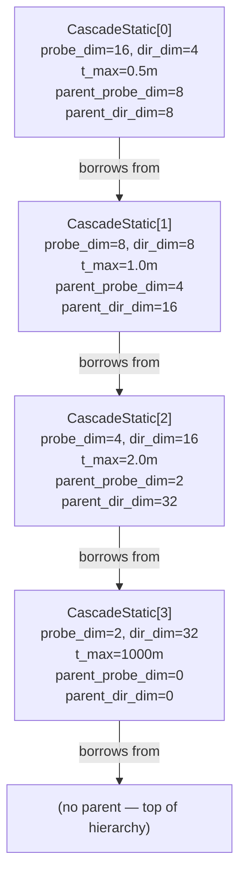
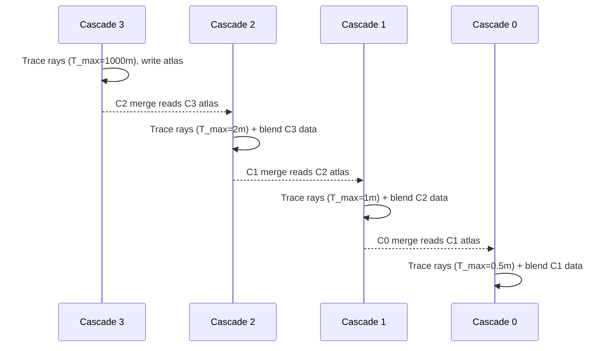
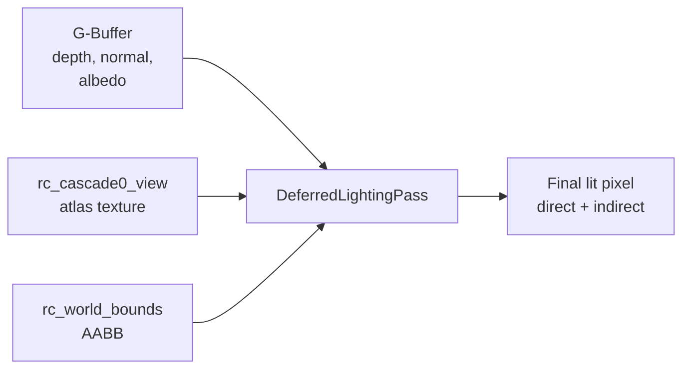
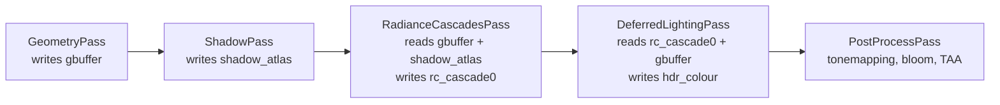
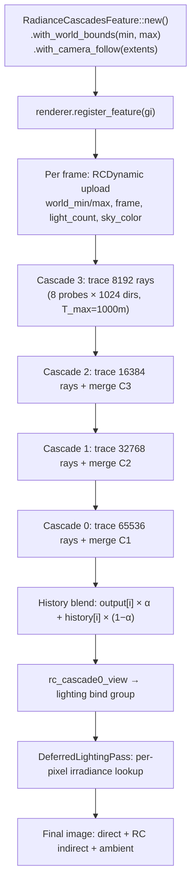

# Radiance Cascades Global Illumination

Global illumination (GI) is the collective name for any rendering technique that models light bouncing between surfaces — the soft fill light under a chair, the colour bleed of a red wall onto a white floor, the sky dome brightening an overcast outdoor scene. Without GI, every surface either receives its direct light contribution or sits in flat, unconvincing shadow. Real-time GI has historically been the hardest problem in games and interactive applications because physically correct light transport is iterative by nature: a photon might bounce dozens of times before reaching the eye, and doing that at 60 frames per second for millions of pixels requires significant approximation.

Helio implements a technique called **Radiance Cascades** (RC): a hierarchical arrangement of irradiance probes that divides the scene into nested levels of detail, traces rays from each probe using hardware ray queries, and blends the results across levels to produce a smooth, stable GI signal. This page explains the algorithm from first principles, walks through every data structure and GPU pass involved, and gives practical guidance on configuring the system for your scene.

<!-- screenshot: a scene with RC disabled on the left (flat ambient only) vs RC enabled on the right, showing coloured bounce light and sky fill -->

---

## Why Screen-Space and Probe-Based GI?

The two dominant families of real-time GI are **screen-space** methods and **world-space probe** methods. Screen-space techniques (SSAO, SSGI, HBAO) are fast and require no additional scene representation, but they can only see what the camera can see: a surface behind the viewer or hidden by geometry receives no indirect light at all, and rotating the camera causes indirect light to pop in and out. World-space probe methods place light-gathering samples throughout the volume of the scene itself, independent of the camera, and therefore avoid most of these artefacts at the cost of maintaining a persistent data structure that must be updated as lights and geometry change.

Radiance Cascades occupies a careful middle ground. Its probe grids are world-space but they are arranged in a hierarchy of cascades that scales ray-tracing work inversely with probe density: the finest cascade (cascade 0) uses many small, cheap, short-range probes; the coarsest cascade (cascade 3) uses very few expensive, long-range probes that reach all the way out to the sky. This means the total ray budget stays roughly constant regardless of scene size, and the algorithm degrades gracefully on hardware without dedicated ray-tracing support.

> [!NOTE]
> Helio's RC implementation is marked **experimental**. The public API (`RadianceCascadesFeature`, `with_world_bounds`, `with_camera_follow`) is stable enough for production use, but the internal GPU pipeline layout — atlas formats, cascade counts — may change in future releases as the algorithm matures.

---

## Algorithm Overview

The full RC pipeline executes every frame in four conceptual phases:



1. **Ray trace**: for every probe in a cascade and every direction bin assigned to that cascade, one ray is fired into the scene up to the cascade's maximum distance (`T_max`). If the ray hits geometry, the shader evaluates the surface's outgoing radiance using the G-buffer data and shadow atlas. If the ray misses all geometry, it receives the sky colour from `RCDynamic.sky_color`.

2. **Cascade merge**: immediately after tracing, each cascade reads its parent cascade (the one above it, with larger `T_max`) and blends the parent's coarser irradiance into its own finer-resolution data. This is the key insight of the algorithm: short-range probes borrow long-range radiance from their parents, so no cascade needs to trace more than its own `T_max`.

3. **History blending**: the freshly traced-and-merged result is blended with the previous frame's output using a temporal accumulation weight. This dramatically reduces noise from the one-ray-per-direction stochastic sampling.

4. **Output binding**: cascade 0's output texture is exposed as `rc_cascade0_view` in the renderer context and bound to the deferred lighting pass, where it contributes indirect irradiance to every lit pixel.

---

## The Four Cascades

Helio uses exactly four cascade levels. The choice of four is a deliberate balance: fewer cascades produce visible seams where one level's `T_max` ends and the next begins; more cascades multiply both memory and per-frame GPU cost without proportionally improving quality, since the outermost cascade dominates bounce-light accuracy and one level of sky-distance coverage (`T_max = 1000 m`) is sufficient for essentially all scenes.

The cascade constants are defined in `features/radiance_cascades.rs`:

```rust
pub const CASCADE_COUNT: usize = 4;

/// Probe grid dimension per cascade (cubed = total probes per cascade)
pub const PROBE_DIMS: [u32; CASCADE_COUNT] = [16, 8, 4, 2];

/// Direction bins per atlas axis per cascade
pub const DIR_DIMS: [u32; CASCADE_COUNT] = [4, 8, 16, 32];

/// Maximum ray distances per cascade (metres)
pub const T_MAXS: [f32; CASCADE_COUNT] = [0.5, 1.0, 2.0, 1000.0];
```

Reading these side-by-side:

| Cascade | Probe grid | Probe count | Dir bins per axis | Total dirs/probe | T_max |
|---------|-----------|-------------|-------------------|-----------------|-------|
| 0 | 16×16×16 | 4 096 | 4×4 | 16 | 0.5 m |
| 1 | 8×8×8 | 512 | 8×8 | 64 | 1.0 m |
| 2 | 4×4×4 | 64 | 16×16 | 256 | 2.0 m |
| 3 | 2×2×2 | 8 | 32×32 | 1 024 | 1 000 m |

Cascade 0 has the finest spatial resolution: 4 096 probes packed into whatever AABB the feature is configured with. Each probe only looks 0.5 metres away, but with 16 uniformly distributed hemisphere bins it can capture sharp, local bounce light — the kind that darkens corners and softens contact shadows. Cascade 3 has only 8 probes in total, but each probe samples the entire scene out to 1 000 metres using 1 024 direction bins, providing wide-angle sky illumination that cascades down through levels 2, 1, and 0.

The doubling of `DIR_DIM` at each level and halving of `PROBE_DIM` is not arbitrary. As probes become coarser spatially (fewer probes cover the same volume), they need finer directional resolution to avoid blurring the sky signal across a wide solid angle. Conversely, cascade 0 needs dense spatial coverage more than it needs directional precision, so 16 direction bins are enough — the cascade-3 data provides the missing long-range directional detail via the merge step.

> [!IMPORTANT]
> The probe spacing in cascade 0 is `(world_max - world_min) / 16` per axis. If your AABB is 32 m wide, probes are spaced every 2 m, which is appropriate for typical architectural or gameplay-scale scenes. For very large outdoor areas (>100 m) consider increasing `T_MAXS[0]` and using `with_camera_follow` so the AABB stays centred on the player.

---

## Direction Encoding: Y-Up Octahedral Bins

Each probe does not sample a full sphere of directions; instead it samples a **hemisphere** aligned with the world up axis (Y-up), encoded using octahedral mapping. An octahedral map unfolds the hemisphere onto a square grid, which allows direction bins to be stored as a 2D atlas without any singularities or discontinuities near the poles.

The comment in the source explains the starting value:

```rust
/// dir_dim starts at 4 so cascade 0 has upper+lower hemisphere bins (Y-up oct encoding)
pub const DIR_DIMS: [u32; CASCADE_COUNT] = [4, 8, 16, 32];
```

Cascade 0 has a 4×4 grid of direction bins — 16 bins covering the full sphere (upper and lower hemisphere combined, split by the equator). This means each direction bin subtends roughly 1/16th of the sphere, or about 25° of solid angle. That is coarse, but for the short-range (0.5 m) probes of cascade 0 this resolution is sufficient: contact-shadow and colour-bleed features are spatially high-frequency but directionally low-frequency.

At cascade 3, 32×32 = 1 024 bins give approximately 0.4° of solid angle per bin, which is fine enough to resolve distinct directional light contributions from multiple sky features even at the coarsest spatial resolution.



> [!TIP]
> The octahedral encoding means direction (0,0) through (dir_dim-1, dir_dim-1) maps to a continuous sphere without any wasted texels. This is important for the atlas layout described below — there are no padding rows or special-case poles in the shader.

---

## Atlas Texture Layout

Rather than allocating one texture per probe per cascade — which would be thousands of textures — all probes in a cascade are packed into a single 2D **atlas texture**. The atlas has a fixed width of 64 texels and a height that varies by cascade:

```rust
/// Atlas width = PROBE_DIM * DIR_DIM = 64 for every cascade
pub const ATLAS_W: u32 = 64;

/// Atlas heights per cascade: PROBE_DIM² × DIR_DIM
pub const ATLAS_HEIGHTS: [u32; CASCADE_COUNT] = [1024, 512, 256, 128];
```

The invariant `PROBE_DIM × DIR_DIM = 64` holds for every cascade:
- Cascade 0: 16 × 4 = 64 ✓
- Cascade 1: 8 × 8 = 64 ✓
- Cascade 2: 4 × 16 = 64 ✓
- Cascade 3: 2 × 32 = 64 ✓

The height is `PROBE_DIM² × DIR_DIM`. For cascade 0: 16² × 4 = 256 × 4 = 1 024. This encodes all 4 096 probes (16×16×16 = 4 096, packed as a 16² = 256 row-of-probes × 4 direction-row-slices).

<!-- screenshot: atlas texture visualisation for cascade 0 with probe grid cells visible at 16px width -->

All atlases use the `Rgba16Float` format (16-bit per channel, 8 bytes per texel). This gives enough precision for HDR irradiance values while keeping memory tight. The total GPU memory footprint:

| Cascade | Texels | Bytes | × 2 (output + history) |
|---------|--------|-------|------------------------|
| 0 | 64 × 1024 = 65 536 | 512 KB | 1 MB |
| 1 | 64 × 512 = 32 768 | 256 KB | 512 KB |
| 2 | 64 × 256 = 16 384 | 128 KB | 256 KB |
| 3 | 64 × 128 = 8 192 | 64 KB | 128 KB |
| **Total** | | | **~2 MB** |

Two megabytes total — including history buffers — is exceptionally lean for a real-time GI system. Most lightmap-based or volumetric GI solutions require tens to hundreds of megabytes.

> [!NOTE]
> The `output_textures` and `history_textures` vectors in `RadianceCascadesFeature` each hold `CASCADE_COUNT` textures. The double-buffer pattern (write to output this frame, blend output+history next frame) is what enables temporal accumulation without a read-write hazard on the same texture.

---

## GPU Data Structures

### CascadeStatic — Constant After Register

Each cascade has a small uniform buffer that is written once during `register()` and never changed:

```rust
// GPU-side static per-cascade uniforms (constant after register):
pub struct CascadeStatic {
    pub cascade_index:    u32,
    pub probe_dim:        u32,
    pub dir_dim:          u32,
    pub t_max_bits:       u32,  // f32::to_bits(T_MAX)
    pub parent_probe_dim: u32,
    pub parent_dir_dim:   u32,
    pub _pad0: u32,
    pub _pad1: u32,
}
```

`t_max_bits` stores the `T_max` float as its raw bit pattern rather than a float field — this avoids potential NaN/Inf handling differences between host and shader and guarantees bitwise identical representation.

`parent_probe_dim` and `parent_dir_dim` link each cascade to its parent (the next coarser level). The merge shader uses these to compute the UV address in the parent atlas from which to read borrowed long-range radiance. For cascade 3 (the coarsest level), `parent_probe_dim` and `parent_dir_dim` are both zero, signalling to the shader that no merge step is needed — cascade 3 only traces rays, never reads from a parent.



> [!NOTE]
> The `_static_bufs` field in `RadianceCascadesFeature` holds one `wgpu::Buffer` per cascade. These buffers are bound as `uniform` in the cascade compute pipelines and never re-uploaded, which avoids one `write_buffer` call per cascade per frame and reduces CPU overhead.

### RCDynamic — Uploaded Every Frame

The dynamic uniform block carries everything that changes frame to frame:

```rust
pub struct RCDynamic {
    pub world_min:   [f32; 4],
    pub world_max:   [f32; 4],
    pub frame:       u32,
    pub light_count: u32,
    pub _pad0: u32,
    pub _pad1: u32,
    pub sky_color:   [f32; 4],  // sky radiance for miss rays (rgb = linear, w unused)
}
```

`world_min` and `world_max` define the AABB within which all probes are distributed. Changing these values moves the entire probe grid — this is how `with_camera_follow` works: each frame the AABB is recentred on the camera position before uploading.

`frame` is a monotonically increasing counter. The ray-trace shader uses this to jitter sample positions and direction offsets each frame, creating a blue-noise-like temporal distribution that the history blend can converge.

`light_count` tells the cascade shader how many lights exist in the scene's light buffer. Rather than hard-coding a maximum, the shader loops from 0 to `light_count - 1`, evaluating each light's contribution to ray hits inside cascade geometry. The count is pulled from a shared `Arc<AtomicU32>` that the renderer updates after its own light-list update each frame.

`sky_color` is the linear-space RGB radiance used for ray misses. Rays that escape the scene geometry entirely — pointing up toward an open sky or through an exterior window — receive this colour as their radiance contribution. It is derived from the scene ambient colour or skylight, keeping indirect sky fill consistent with the rest of the lighting model.

---

## The Ray Trace Phase

For each cascade, a compute shader dispatches one thread per (probe, direction bin) pair. Each thread:

1. Reconstructs the 3D world-space probe position from its atlas UV and the `world_min`/`world_max` bounds.
2. Converts its direction-bin index to a world-space unit vector via the octahedral decode.
3. Calls `rayQueryInitializeEXT` (or the equivalent `wgpu` ray query API) with the decoded origin and direction, clipped to `[0, T_max]`.
4. Evaluates the closest hit: samples the G-buffer for surface normal, albedo, and roughness; evaluates each punctual light in `[0, light_count)` with shadow-atlas visibility; sums the outgoing radiance.
5. On miss: returns `sky_color.rgb`.
6. Writes the `vec4<f32>(radiance, 1.0)` result into the output atlas at the correct texel.

> [!WARNING]
> The ray-trace phase requires the `EXPERIMENTAL_RAY_QUERY` wgpu feature. On hardware or drivers that do not expose this feature, Helio falls back to a screen-space approximation that uses only G-buffer reprojection data. The fallback is lower quality — it cannot see geometry outside the camera frustum — but it is fully functional for prototyping and testing on integrated GPUs.

Checking for hardware ray query support:

```rust
let has_ray_query = device
    .features()
    .contains(wgpu::Features::EXPERIMENTAL_RAY_QUERY);

if !has_ray_query {
    log::warn!(
        "EXPERIMENTAL_RAY_QUERY unavailable; \
         RadianceCascades falling back to screen-space GI"
    );
}
```

The pass declaration in `passes/radiance_cascades.rs` illustrates which resources the ray-trace and merge steps depend on:

```rust
impl RenderPass for RadianceCascadesPass {
    fn name(&self) -> &str { "radiance_cascades" }

    fn declare_resources(&self, builder: &mut PassResourceBuilder) {
        builder.read(ResourceHandle::named("gbuffer"));       // surface normals, albedo, depth
        builder.read(ResourceHandle::named("shadow_atlas"));  // pre-built shadow maps for GI shadowing
        builder.write(ResourceHandle::named("rc_cascade0")); // final GI output consumed by deferred
    }
}
```

Reading the shadow atlas means RC probes respect the same shadow maps used by direct lighting, so GI bounce light from shadowed regions is correctly attenuated. This is not universal in probe-based GI systems — many skip shadow evaluation for indirect rays entirely, accepting light leaking through walls as a known limitation.

---

## The Cascade Merge Phase

After all four cascades have been ray-traced in coarse-to-fine order (cascade 3 first, cascade 0 last), each cascade from 3 down to 0 merges its parent's data into itself. The merge is a bilinear lookup in the parent atlas:



The merge is a weighted addition: the parent's radiance is sampled at the same world-space probe position and direction, then added to the child's traced result. The weighting reflects the solid-angle overlap between child and parent direction bins. Because the parent has a larger `T_max`, its contribution accounts for distant radiance the child cannot reach directly.

This hierarchical merging is what makes the algorithm efficient: cascade 0 does not need to fire rays 1 000 metres away — it simply inherits that contribution from cascade 3 via the cascade 2 and cascade 1 intermediaries.

---

## History Blending and Temporal Accumulation

Stochastic ray tracing with one ray per direction bin produces significant per-frame noise. Without accumulation, the GI output would flicker visibly. Helio solves this with a **double-buffer temporal blend**: the feature maintains both `output_textures` (the current frame's traced result) and `history_textures` (the previous frame's blended result), and after each frame blends them together before the output is consumed by the lighting pass.

```rust
pub struct RadianceCascadesFeature {
    // ...
    output_textures:  Vec<Arc<wgpu::Texture>>,  // CASCADE_COUNT textures
    output_views:     Vec<Arc<wgpu::TextureView>>,
    history_textures: Vec<Arc<wgpu::Texture>>,
    history_views:    Vec<Arc<wgpu::TextureView>>,
    // ...
}
```

The blend weight is typically in the range 0.05–0.1 per frame, meaning the history texture contributes 90–95% of the final signal. This creates a running exponential moving average over roughly 10–20 frames, which is enough to fully converge a static scene to a noise-free result in under half a second.

> [!TIP]
> In scenes where the probe grid is static (fixed AABB, no moving lights), the GI converges in about 10–20 frames and then costs almost nothing in terms of perceived noise. The GPU still executes the full trace-merge-blend pipeline every frame, but the output is visually stable. Consider disabling or cheapening RC in cut-scenes where the camera moves continuously and convergence never completes.

The tradeoff is a **one-frame temporal lag**: when a light switches on or off suddenly, the indirect illumination takes 10–20 frames to fully update. For most gameplay scenarios this is imperceptible, but for abrupt transitions (a door opening to a bright exterior) a history reset or increased blend weight may be desirable. Future versions of the API may expose a `force_reset_history()` method for this purpose.

> [!WARNING]
> Moving lights cause slow GI updates proportional to the blend weight. A spinning point light with a period shorter than ~10 frames will appear as a blurred smear in the indirect illumination. For such cases, consider increasing the per-frame blend weight at the cost of increased noise.

---

## Configuring the Feature

### Builder API

`RadianceCascadesFeature` uses a builder pattern to configure the probe volume before it is registered with the renderer:

```rust
use helio::features::RadianceCascadesFeature;

// Option A: fixed AABB for a known scene extent
let gi = RadianceCascadesFeature::new()
    .with_world_bounds(
        [-16.0, -4.0, -16.0],  // world_min (x, y, z)
        [ 16.0, 12.0,  16.0],  // world_max
    );

// Option B: follow the camera with a fixed half-extent box
let gi = RadianceCascadesFeature::new()
    .with_camera_follow([16.0, 8.0, 16.0]);  // half_extents in metres
```

**`with_world_bounds`** is the right choice when your playable area is known and bounded — a single room, a fixed arena, an architectural walkthrough. The probes are distributed uniformly within the AABB and do not move. Objects outside the AABB receive no GI contribution from RC and fall back to the scene ambient colour.

**`with_camera_follow`** is the right choice for open-world or large-scale scenes where the player can wander arbitrarily far. The AABB re-centres on the camera every frame (uploaded via `RCDynamic.world_min/world_max`), so the probe grid always surrounds the viewer. The tradeoff is that moving the AABB invalidates the history buffer — the convergence restarts every time the player moves faster than the probe spacing, so temporal accumulation is less effective during fast movement.

> [!NOTE]
> When using `with_camera_follow`, choose `half_extents` to be at least as large as the longest `T_max` of cascade 0 (0.5 m) multiplied by the probe density. A good starting value is `[16.0, 8.0, 16.0]` for a typical first-person scene, giving 2 m probe spacing in the horizontal plane.

### Updating Bounds at Runtime

If you need to change the world bounds after the feature is already registered (for example, when the player enters a different level section), use `get_feature_mut` on the renderer:

```rust
if let Some(rc) = renderer.get_feature_mut::<RadianceCascadesFeature>() {
    rc.with_world_bounds_in_place(
        [-32.0, -2.0, -32.0],
        [ 32.0, 16.0,  32.0],
    );
}
```

The new bounds take effect on the next frame's `RCDynamic` upload. Because the AABB has moved, the probe positions change discontinuously and history accumulation will show a brief flash of noise — this is expected and clears within 10–20 frames.

---

## Sky Colour Integration

When a traced ray escapes the scene without hitting any geometry (a miss), the cascade shader assigns `RCDynamic.sky_color.rgb` as the ray's radiance contribution. This colour is set by the renderer each frame from the scene's ambient and skylight configuration:

```rust
// Inside Renderer::prepare_rc_dynamic():
let sky_radiance = self.scene_ambient_color();  // linear HDR RGB
rc_feature.sky_color = sky_radiance;
```

The effect is that probes near the top of the AABB — or any probe whose rays point through open gaps — pick up sky illumination proportional to the scene's ambient light level. This creates natural sky fill: open outdoor areas are brighter than enclosed rooms, and the transition between indoor and outdoor is smooth rather than a hard ambient constant.

<!-- screenshot: indoor scene near a large window — sky fill visible on floor and ceiling from RC miss rays -->

> [!TIP]
> For a scene with a dynamic time-of-day sky, update `scene_ambient_color` each frame based on the sun angle and sky model. RC will propagate the changing sky colour into the probe data automatically via the `sky_color` miss radiance, giving you dynamic sky-lit GI without any additional configuration.

---

## Light Count Forwarding

The cascade ray-trace shader evaluates punctual lights (point lights, spot lights) at each ray hit location. To avoid scanning an arbitrary-length light buffer on the GPU, the renderer shares an `Arc<AtomicU32>` with the feature:

```rust
pub struct RadianceCascadesFeature {
    // ...
    light_count_arc: Option<Arc<AtomicU32>>,
}
```

Every frame, the renderer atomically updates this counter after it has finished culling and sorting its light list. The value is then read in `prepare()` and placed into `RCDynamic.light_count` before the buffer is uploaded. The cascade shader's light loop becomes:

```wgsl
// WGSL pseudocode in cascade compute shader
for (var i: u32 = 0u; i < uniforms.light_count; i++) {
    let light = lights[i];
    radiance += evaluate_punctual_light(hit_pos, hit_normal, light, shadow_atlas);
}
```

Using an `AtomicU32` rather than a plain shared reference avoids the need for a mutex or frame-boundary synchronisation barrier, since the renderer and the RC feature both run on the same thread during `prepare()`.

> [!NOTE]
> If `light_count_arc` is `None` (the feature was constructed before the renderer had a light list), the feature defaults to evaluating all lights in the buffer up to a compile-time maximum. This is safe but slightly wasteful. The arc is injected automatically when the feature is registered via `renderer.register_feature(gi)`.

---

## Output Binding and DeferredLightingPass Integration

After all cascades have been traced, merged, and blended, cascade 0's output view is exposed through the renderer context:

```rust
// Set by RadianceCascadesFeature during register():
pub rc_cascade0_view: Option<Arc<wgpu::TextureView>>,
pub rc_world_bounds: Option<([f32; 3], [f32; 3])>,
```

`DeferredLightingPass` binds this view as a texture in its lighting bind group (binding slot `rc_cascade0_view`). For each lit pixel in the G-buffer, the lighting shader:

1. Reconstructs the world-space position from the depth buffer.
2. Checks whether the position is within `rc_world_bounds`.
3. If inside: samples `rc_cascade0_view` using the position projected into the cascade 0 atlas UV space, and adds the resulting irradiance to the pixel's diffuse contribution.
4. If outside: uses the scene ambient colour as the indirect contribution.



This means RC does not require any changes to your material or geometry shaders. It is a post-process over the G-buffer, entirely transparent to scene authoring.

<!-- screenshot: deferred lighting pass debug view showing the GI irradiance contribution channel only (cascade 0 read) -->

---

## Pass Resource Declaration

The `RadianceCascadesPass` declares its resource dependencies through the standard Helio pass resource builder:

```rust
impl RenderPass for RadianceCascadesPass {
    fn name(&self) -> &str { "radiance_cascades" }

    fn declare_resources(&self, builder: &mut PassResourceBuilder) {
        builder.read(ResourceHandle::named("gbuffer"));
        builder.read(ResourceHandle::named("shadow_atlas"));
        builder.write(ResourceHandle::named("rc_cascade0"));
    }
}
```

The frame graph scheduler uses these declarations to order the RC pass after the shadow atlas and G-buffer are written but before the deferred lighting pass reads `rc_cascade0`. No manual barrier insertion is required.

The frame-level ordering looks like this in the default Helio pipeline:



This ordering guarantees that by the time any cascade shader fires its first ray, the G-buffer contains fully resolved surface data (including depth, normals, and albedo from all opaque geometry) and the shadow atlas contains valid depth maps for all shadow-casting lights. The RC result is therefore consistent with the direct-lighting result produced by `DeferredLightingPass` in the same frame.

> [!NOTE]
> Translucent geometry is not written to the G-buffer and therefore is invisible to RC ray hits. Rays that pass through a translucent surface continue until they hit an opaque surface or exhaust `T_max`. This means translucent objects do not block indirect light the way opaque ones do. Handling translucency in probe-based GI is an open research problem; the current design errs on the side of slightly brighter GI through glass surfaces rather than incorrect GI shadowing.

---

## Full Integration Example

The following shows a complete setup for a medium-sized interior scene:

```rust
use helio::{
    Renderer,
    features::{RadianceCascadesFeature, SkyAtmosphereFeature},
};

fn build_renderer(device: &wgpu::Device, queue: &wgpu::Queue) -> Renderer {
    let sky = SkyAtmosphereFeature::new();

    // Probe AABB: 32m wide, 16m tall, centred at origin
    let gi = RadianceCascadesFeature::new()
        .with_world_bounds(
            [-16.0, -1.0, -16.0],
            [ 16.0, 15.0,  16.0],
        );

    Renderer::builder()
        .register_feature(sky)
        .register_feature(gi)
        .build(device, queue)
}

fn update(renderer: &mut Renderer, dt: f32) {
    // Update sky — RC picks up sky_color from ambient automatically
    renderer.set_scene_time(current_time_of_day());

    // Optionally adjust GI bounds as player moves between areas
    let player_pos = get_player_position();
    if !rc_bounds_contain(player_pos) {
        if let Some(rc) = renderer.get_feature_mut::<RadianceCascadesFeature>() {
            let half = [16.0f32, 8.0, 16.0];
            rc.set_camera_follow(half);
        }
    }
}
```

---

## Performance Expectations

RC is a GPU-compute-heavy feature. On a mid-range discrete GPU (e.g., NVIDIA RTX 3060 or AMD RX 6700 XT) with `EXPERIMENTAL_RAY_QUERY` available:

| Phase | Approximate GPU cost |
|-------|---------------------|
| Cascade 3 ray trace (8 probes × 1024 dirs) | ~0.1 ms |
| Cascade 2 ray trace (64 probes × 256 dirs) | ~0.2 ms |
| Cascade 1 ray trace (512 probes × 64 dirs) | ~0.3 ms |
| Cascade 0 ray trace (4096 probes × 16 dirs) | ~0.5 ms |
| Merge passes (all cascades) | ~0.1 ms |
| History blend (all cascades) | ~0.05 ms |
| **Total** | **~1.2 ms** |

These figures assume a moderately complex scene with 100–500 triangles in the BLAS. Scenes with many thin or highly tessellated meshes may push ray-traversal cost higher.

On hardware without `EXPERIMENTAL_RAY_QUERY`, the screen-space fallback costs approximately 0.3–0.5 ms regardless of scene complexity, since it only operates on G-buffer data and does not traverse the acceleration structure.

Memory footprint is fixed at ~2 MB regardless of scene complexity or AABB size, since it depends only on the atlas dimensions, which are constants.

The GPU work distribution across cascades is worth examining closely. Cascade 0 has the highest ray count (65 536 rays) but the shortest `T_max` (0.5 m), so each ray typically terminates quickly — often in one or two BVH traversal steps. Cascade 3 has the fewest rays (8 192 rays) but each ray travels up to 1 000 m, which means many rays miss all geometry and terminate cheaply as sky samples. In practice, cascade 1 and cascade 2 are the most expensive because they have moderate ray counts *and* moderate distances — long enough that rays traverse several BVH nodes but not so long that miss-early-exit saves most of them.

If GPU profiling shows RC is over budget, the most effective single optimisation is to reduce `PROBE_DIMS[0]` from 16 to 8 (512 cascade-0 probes instead of 4 096), which cuts the cascade-0 ray count by 8× at the cost of coarser spatial GI resolution. For many scenes the visual difference is negligible.

> [!TIP]
> In a static scene (no moving lights, camera-follow disabled), the GI converges within ~20 frames and the visual output is effectively noise-free for the rest of the frame budget. The GPU cost does not decrease — the pipeline still runs every frame — but there are no perceptible quality differences between frame 20 and frame 1000. If your target platform is GPU-limited, you could skip RC updates on alternate frames; the one-frame-older irradiance data is invisible to the player.

Profiling RC on your specific hardware is straightforward using the wgpu timestamp query API. Wrap the `RadianceCascadesPass::execute` call in a timestamp query pair and read the results back asynchronously. In the Helio profiler overlay (`--debug-perf`), RC timing is broken down per cascade so you can identify which level dominates your budget.

---

## Known Limitations

### Objects Outside the AABB Receive No GI

Geometry that falls outside the probe volume's AABB is completely invisible to the RC system. Probes distributed within the AABB cannot see beyond `T_max` at cascade 3, and cascade 3's `T_max` is 1 000 m — but that only covers rays launched *from* probes *inside* the AABB. A large rocky outcrop 200 m away will not cast bounced light into the AABB unless you enlarge the AABB to encompass it, which will reduce probe density for the area you actually care about.

For large outdoor scenes, `with_camera_follow` and a modest half-extent (e.g., 32 m) is a more practical choice than trying to encompass the entire world in a single fixed AABB.

### One-Frame Temporal Lag

History blending introduces a lag of one frame for any change in lighting. For direct light switch events (a light turning on instantly), the indirect component will catch up over the next 10–20 frames. This is acceptable for most scenarios but may be jarring in cutscenes with dramatic lighting transitions.

### Hardware Ray Query Requirement for Full Quality

Without `EXPERIMENTAL_RAY_QUERY`, the screen-space fallback cannot see geometry outside the camera frustum, cannot follow behind surfaces, and will show the characteristic GI artefacts of screen-space methods: GI disappearing as the camera rotates, halos around foreground objects, and missing bounce light from off-screen emitters. The fallback is suitable for development and lower-end hardware but should not be shipped as the primary GI solution.

### Fixed Cascade Count and Dimensions

`CASCADE_COUNT`, `PROBE_DIMS`, `DIR_DIMS`, and `T_MAXS` are compile-time constants. You cannot configure them at runtime. If your scene requires finer probe spacing (e.g., a very small-scale scene) or a higher cascade count, the constants must be modified and the crate recompiled. A configurable-at-build-time system is planned for a future release.

If you do modify the constants, keep in mind that the invariant `PROBE_DIMS[i] * DIR_DIMS[i] == ATLAS_W` must hold for every cascade index `i`. Violating this invariant will produce incorrect atlas addressing in the GPU shaders, and the resulting corruption may not be obviously wrong at a glance — it may look like random coloured patches rather than a hard crash or validation error.

```rust
// Example of a modified cascade setup for a small-scale tabletop scene
// (NOT the defaults — requires shader constant updates too)
pub const PROBE_DIMS: [u32; CASCADE_COUNT] = [32, 16, 8, 4];
pub const DIR_DIMS:   [u32; CASCADE_COUNT] = [2,  4,  8, 16];
// invariant: 32*2=64, 16*4=64, 8*8=64, 4*16=64 ✓
pub const T_MAXS: [f32; CASCADE_COUNT] = [0.1, 0.25, 0.5, 10.0];
// Tighter T_max values for a scene measured in centimetres
```

> [!WARNING]
> Do not change `ATLAS_W = 64`. The invariant `PROBE_DIM × DIR_DIM = 64` is assumed by the atlas addressing code in the GPU shaders. Changing only the constant on the CPU side without updating the WGSL shaders will produce corrupted output without any validation error at startup.

### No Glossy/Specular Indirect

RC computes **diffuse irradiance** only. The direction-bin granularity of cascade 0 (16 bins per probe) is insufficient to reconstruct a specular lobe at any roughness below ~0.8. Specular indirect illumination (reflections) should be handled by a separate system — screen-space reflections, planar reflections, or a reflection probe — and combined with the RC diffuse result in the lighting pass.

### Probe Aliasing at AABB Boundaries

Probes are distributed uniformly within the AABB with spacing `(world_max - world_min) / PROBE_DIM`. Near the edges of the AABB the nearest probe may be half a probe-spacing away, so geometry right at the boundary receives less accurate indirect illumination than geometry at the centre. If your scene has important surfaces near the AABB boundary (e.g., a floor that reaches the edge of the configured volume), extend the AABB by at least one probe spacing in each direction to push those surfaces safely inside the grid.

### Static Scene Assumption for Geometry

RC uses the scene's BLAS (Bottom-Level Acceleration Structure) for ray queries. The BLAS is built from opaque geometry at scene load time and is not automatically rebuilt when meshes move. Dynamic objects (characters, vehicles, physics-driven props) do not contribute to ray-hit evaluations unless you also update the BLAS each frame, which is expensive. The practical consequence is that a large character moving through the scene will not block indirect light in the probe data; the probes will fire rays through the character as if it were not there. For most gameplay scenes this is acceptable — characters rarely make up a large fraction of the scene's indirect-light contribution — but it is a known limitation to be aware of when placing large dynamic occluders near probe-dense areas.

## Comparison with Other GI Approaches

To contextualise where RC sits in the landscape of real-time GI techniques, consider this rough comparison:

| Technique | Scene independence | Memory | GPU cost | Hardware req. | Specular |
|-----------|-------------------|--------|----------|--------------|---------|
| SSAO/SSGI | Screen-space only | < 1 MB | 0.2–0.5 ms | None | Partial |
| Lightmaps | Baked, static only | 10–100 MB | ~0 ms | None | Baked |
| Lumen (UE5) | Full, dynamic | 50–200 MB | 2–8 ms | Prefer HW RT | Yes |
| DDGI | World-space probes | 5–20 MB | 1–4 ms | Prefer HW RT | No |
| **RC (Helio)** | **World-space** | **~2 MB** | **~1.2 ms** | **Prefer HW RT** | **No** |

RC's primary advantage over Lumen-style full dynamic GI is its extremely low memory footprint and predictable cost ceiling. Its primary disadvantage compared to Lumen is that it provides only diffuse irradiance and requires the probe AABB to be configured by the application rather than auto-adapting to the scene. For small-to-medium-scale scenes — which make up the majority of Helio use cases — RC is the best quality-per-megabyte GI option available.

> [!NOTE]
> DDGI (Dynamic Diffuse Global Illumination, the technique used in many Vulkan ray tracing demos) is the closest conceptual relative to Helio's RC implementation. The key difference is that RC uses direction bins organised by cascade rather than per-probe spherical harmonics, and the cascade hierarchy replaces DDGI's single probe grid with multiple grids at different resolution scales. Both techniques use temporal accumulation and hardware ray queries.

Helio exposes a debug overlay for RC that visualises the cascade 0 atlas directly in the viewport. To enable it, pass the `--debug-rc` flag on the command line or call:

```rust
renderer.set_debug_overlay(helio::DebugOverlay::RadianceCascades { cascade: 0 });
```

The overlay renders the raw `Rgba16Float` atlas content mapped to display range `[0, 1]` with an exposure multiplier. Probes that received no ray hits (outside the AABB, or cascade 0 probes whose traced rays all missed) appear black. Probes that are fully converged show smooth, noise-free irradiance gradients. Probes that are still accumulating from history show faint noise patterns — typically only visible in the first 5 frames after a scene load.

<!-- screenshot: debug overlay showing cascade 0 atlas with probe columns visible at left, direction bins expanding rightward -->

A secondary debug mode visualises the world-space probe positions as small spheres coloured by their integrated irradiance:

```rust
renderer.set_debug_overlay(helio::DebugOverlay::RadianceCascadesProbes {
    cascade: 0,
    scale: 0.1,  // sphere radius in metres
});
```

This is useful for diagnosing cases where the AABB is misaligned or probes are clustering in the wrong part of the scene.

> [!TIP]
> If the debug overlay shows all-black output for cascade 0 but non-black output for cascade 3, the most common cause is `world_min == world_max` — the AABB was constructed with default values and never configured. Check that `with_world_bounds` or `with_camera_follow` was called before `register_feature`.

---

Radiance Cascades in Helio provides real-time global illumination through a hierarchy of four probe grids, each trading spatial resolution for directional resolution as cascade index increases. Hardware ray queries enable physically grounded ray-surface intersection; a temporal history blend stabilises the stochastic one-ray-per-direction sampling. The entire system costs approximately 2 MB of GPU memory and 1–2 ms of GPU time per frame, with output delivered as a single atlas texture consumed by the deferred lighting pass. For most interior and mid-scale exterior scenes, enabling RC with a well-chosen AABB is a one-line change that delivers high-quality, view-independent indirect illumination at a predictable performance cost.


