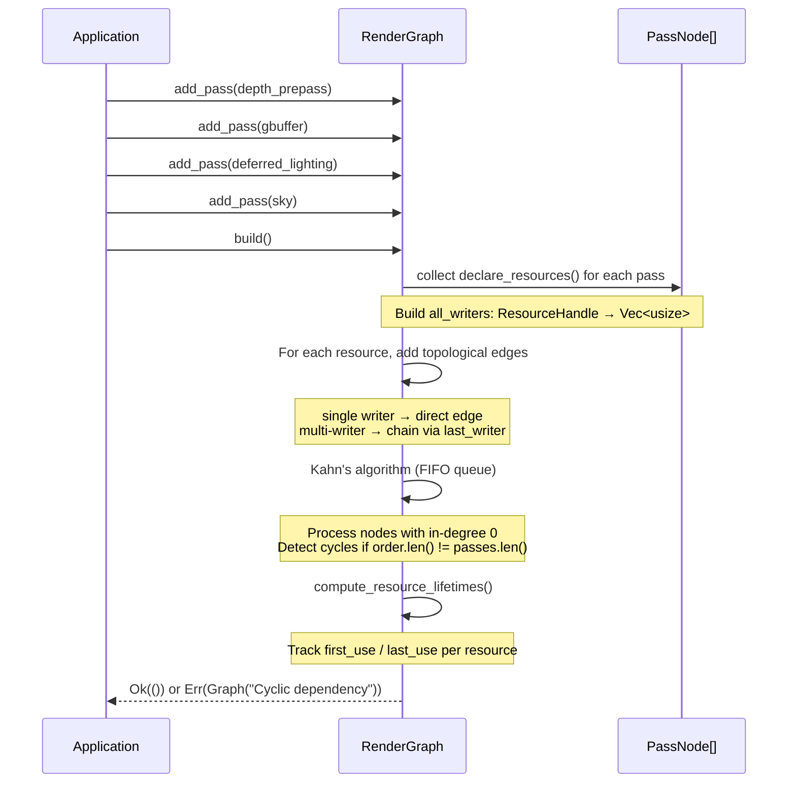
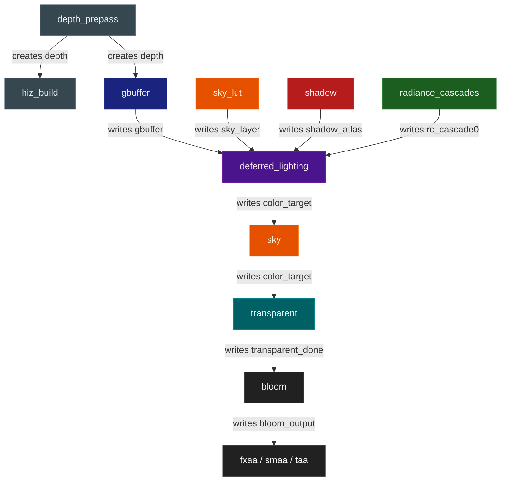

Modern real-time renderers are not a single monolithic shader pass — they are pipelines composed of many discrete stages that each consume outputs from earlier stages and produce outputs consumed by later ones. A depth prepass writes a depth buffer that occlusion culling reads. A GBuffer pass writes geometry data that the deferred lighting pass reads. A shadow atlas written early is sampled throughout the frame. The challenge is ensuring that all of these dependencies are respected — that passes run in the correct order, that every resource a pass needs has already been produced by the time that pass executes, and that the developer does not need to manually enumerate and maintain that ordering by hand.

Helio solves this with a **render graph**: a system where each pass declaratively announces which resources it reads, which it writes, and which it creates from nothing. The graph then builds a directed acyclic graph (DAG) from those declarations and sorts it topologically before the first frame ever runs. From that point forward, the execution order is deterministic and automatically correct, regardless of the order in which passes were registered.

Render graphs have become standard infrastructure in production engines. Unreal Engine's RDG, the Frostbite frame graph, and the BGFX render graph all follow the same fundamental pattern: passes declare resources, a compile step builds a DAG and sorts it, and an execute step runs the sorted passes. Helio's implementation follows this established model while keeping the API minimal — three trait methods, three builder methods, and a handful of graph-level functions cover the entire public surface.

<!-- screenshot: Helio rendering a scene with all passes visible in the profiler overlay, showing depth_prepass through bloom in sequence -->

## The Problem With Manual Ordering

Before render graphs became standard practice, renderers maintained pass order manually — either a hardcoded sequence of function calls in the render loop, or an array of passes filled in registration order. Both approaches break down quickly. When two features both write to the same resource (for example, two post-process effects that each read and write the color target in sequence), the developer must know which should run first. When a new feature inserts itself into the pipeline and its required input is produced three passes later, bugs are subtle and silent: the pass reads stale data from the previous frame or an uninitialized resource, producing visual corruption that is easy to misattribute.

More insidiously, manual ordering makes it nearly impossible to enable or disable features safely at runtime. Disabling bloom in a hardcoded sequence is straightforward — skip the bloom call. But if bloom feeds TAA which feeds FXAA which feeds SMAA, and only some of those are enabled at once, the developer must maintain a combinatorial matrix of valid orderings. The render graph eliminates all of this. Passes declare their data needs; the graph works out the rest.

A render graph also provides a natural place to perform cross-pass analysis. Because the graph knows about every resource read and every resource write before a single GPU command is recorded, it can compute resource lifetimes, identify aliasing opportunities, build barrier placement (on APIs that require explicit resource transitions), and generate profiling scaffolding — all without cooperation from individual pass authors. Helio uses this for lifetime tracking and GPU timestamp insertion today, and the same infrastructure will eventually support automatic Vulkan pipeline barrier insertion as wgpu's barrier model matures.

## add_pass and PassId

Passes are registered with the graph through `add_pass()`, which takes any value implementing `RenderPass + 'static` and returns a `PassId`:

```rust
pub fn add_pass(&mut self, pass: impl RenderPass + 'static) -> PassId;
```

`PassId` is a newtype wrapping the index of the pass in the `passes` vector:

```rust
pub struct PassId(usize);
```

The `PassId` is returned for completeness but is rarely needed directly. Pass identification at runtime — for toggling, profiling queries, and error messages — always goes through the pass name returned by `RenderPass::name()`. The `PassId` is mainly useful if you need to later assert the registration index of a pass during testing or debugging. Passes are always appended to the end of the `passes` vector; there is no way to insert a pass at a specific index, and there is no need to — the topological sort determines the real execution order regardless of registration order.

The `'static` bound on `impl RenderPass + 'static` means that passes cannot hold non-owning references to data with a shorter lifetime than `'static`. In practice, this means passes must own their GPU resources (pipelines, bind groups, bind group layouts) rather than borrowing them from a parent struct. This is the natural pattern anyway — passes are designed to be self-contained — and the `'static` requirement is enforced by Rust's borrow checker rather than by any runtime mechanism.

Pass names must be unique within a graph. If two passes return the same string from `name()`, only one will respond to `set_pass_enabled()` calls — the HashSet lookup matches on the string, so both passes will be simultaneously toggled by a single `set_pass_enabled()` call with that name. Helio uses lowercase snake_case names for all built-in passes (`"depth_prepass"`, `"deferred_lighting"`, etc.). Custom passes should follow the same convention and choose names unlikely to conflict with built-in passes.

> [!NOTE]
> In Helio, `add_pass()` is called during feature registration, which happens inside `Renderer::new()`. Features call it on the graph reference they receive during their `register()` hook. Application code never calls `add_pass()` directly unless it is implementing a custom feature.

## Feature Registration and the Graph

The render graph does not stand alone — it is populated by Helio's feature system. Each feature (shadow mapping, bloom, radiance cascades, anti-aliasing) implements a `register()` hook that receives a mutable reference to the graph and calls `add_pass()` and `declare_transient()` to contribute its passes and resources. This is the only time passes are added; there is no way to add a pass after `build()` has been called without rebuilding the graph from scratch.

The feature system controls not only which passes exist in the graph but also the relative registration order of independent passes. If the shadow feature registers its `shadow` pass after the sky feature registers `sky_lut`, and both are independent (no shared resources), they will appear in that order in the execution output — `sky_lut` before `shadow`. Feature authors should register passes in the order that best reflects the logical pipeline, both for clarity and to produce a predictable execution order when the graph is inspected via `execution_pass_names()`.

Features can also introspect the graph during registration to conditionally add passes. For example, if a feature needs to know whether the `depth_prepass` pass exists before registering a pass that reads `depth`, it can check `graph.is_pass_enabled("depth_prepass")` during its `register()` hook. This enables feature-level conditionality without modifying the core graph logic.

When two features both contribute passes that share a resource — for example, if a custom GI feature adds a pass that writes `rc_cascade0` alongside the built-in `radiance_cascades` pass — the multi-writer chain in `build()` will serialize them in registration order. The feature registered first will run first. This makes feature registration order semantically significant when features have overlapping resource writes, and it is the developer's responsibility to document and maintain that ordering.

<!-- screenshot: Side-by-side of the feature registry list and the resulting execution_pass_names() output, showing how feature registration order maps to pass execution order for independent passes -->

## Core Data Structures

The `RenderGraph` struct owns everything needed to manage the pass lifecycle:

```rust
pub struct RenderGraph {
    passes: Vec<PassNode>,
    execution_order: Vec<usize>,
    transient_resources: HashMap<ResourceHandle, TransientResource>,
    disabled_passes: HashSet<String>,
}
```

`passes` is the flat list of all registered passes in insertion order. `execution_order` is the topologically sorted sequence of indices into `passes`, computed once by `build()` and reused every frame. `transient_resources` tracks GPU resources that the graph itself manages — buffers and textures that exist only for inter-pass communication — alongside their computed lifetimes. `disabled_passes` is a set of pass names that will be skipped during execution without requiring a graph rebuild.

The choice of `Vec<usize>` for `execution_order` rather than `Vec<&PassNode>` or `Vec<Box<dyn RenderPass>>` is deliberate. Storing indices avoids a secondary allocation and keeps the hot path of `execute()` cache-friendly: the index array is small and contiguous, and the pass objects in `passes` are accessed sequentially in sorted order. The `HashMap` and `HashSet` for transient resources and disabled passes use the default `HashMap<K, V>` hasher, which in Rust is a randomized hasher that prevents hash-based denial-of-service but has slightly higher overhead than FNV-1a. For a map that is accessed at most twenty times per frame, this is negligible.

Each pass is stored as a `PassNode` that bundles the pass implementation with its declared resource edges:

```rust
struct PassNode {
    pass: Box<dyn RenderPass>,
    reads: Vec<ResourceHandle>,
    writes: Vec<ResourceHandle>,
    creates: Vec<ResourceHandle>,
}
```

The distinction between `writes` and `creates` is meaningful. A pass that *writes* a resource is adding to or overwriting content that another pass produced — it depends on that resource existing. A pass that *creates* a resource is responsible for its initial allocation and does not depend on any prior content. This distinction is what allows the graph to correctly order a GBuffer pass (which creates the GBuffer texture) before a deferred lighting pass (which reads it), without any explicit `depends_on` annotation.

To make this concrete: if `GBufferPass` declares `builder.create(ResourceHandle::named("gbuffer"))` and `DeferredLightingPass` declares `builder.read(ResourceHandle::named("gbuffer"))`, the edge built by `build()` ensures `GBufferPass` runs before `DeferredLightingPass`. If `GBufferPass` instead declared `builder.write(ResourceHandle::named("gbuffer"))`, the edge semantics would be the same — the writer still precedes the reader — but the `write` declaration implies that some earlier pass must have created or otherwise established the resource. In practice, most "first writer" passes use `create` and subsequent modification passes use `write`, making the data flow self-documenting.

The `pass` field is a `Box<dyn RenderPass>`, which means the graph owns the pass and is responsible for dropping it. Because the `RenderPass` trait requires `Send + Sync`, the entire `PassNode` vector is safe to move between threads or store in an `Arc<Mutex<RenderGraph>>`. The `Box<dyn RenderPass>` has an extra level of indirection compared to a statically-dispatched enum, but for render passes — where each `execute()` call records thousands of GPU commands — the virtual dispatch overhead is completely negligible.

Transient resources are tracked with lifetime information:

```rust
struct TransientResource {
    desc: ResourceDesc,
    first_use: usize,
    last_use: usize,
}
```

The `first_use` and `last_use` fields are pass indices into `execution_order`. Once `build()` runs the topological sort and computes the execution order, it makes a second pass over every pass's resource declarations to find the earliest and latest position in the sorted order where each resource is referenced. These lifetimes are currently informational but lay the groundwork for future resource aliasing — reusing the same underlying GPU allocation for two transient resources whose lifetimes do not overlap, reducing peak GPU memory.

Resources themselves are described by a discriminated union:

```rust
pub enum ResourceDesc {
    Texture {
        width: u32,
        height: u32,
        format: wgpu::TextureFormat,
        usage: wgpu::TextureUsages,
    },
    Buffer {
        size: u64,
        usage: wgpu::BufferUsages,
    },
}
```

The `ResourceDesc` is the only place where actual GPU resource parameters appear at the graph level. Everything else — render pipelines, bind groups, samplers — is managed by individual passes and the `ResourceManager`, not by the graph itself. This separation keeps the graph lightweight and independent of any specific rendering API: `ResourceDesc` uses wgpu types, but the graph itself has no wgpu-specific logic beyond storing these descriptors and associating them with handles.

## ResourceHandle and Named Resources

Every resource in the graph is identified by a `ResourceHandle`, which is simply a `u64` identifier:

```rust
pub struct ResourceHandle(u64);

impl ResourceHandle {
    pub fn named(name: &str) -> Self {
        // FNV-1a hash of the name string
    }
}
```

Passes declare their resources using string names like `"gbuffer"`, `"shadow_atlas"`, or `"color_target"`, and `ResourceHandle::named()` hashes those strings with FNV-1a to produce a stable, compact identifier. The FNV-1a hash is deterministic across runs — there are no random seeds — so the same name always maps to the same handle regardless of registration order or program state.

Resource handles are computed as 64-bit FNV-1a hashes of the resource name string:

$$\text{handle}(\text{name}) = \text{FNV-1a}_{64}(\text{name as UTF-8 bytes})$$

$$h_0 = 14\,695\,981\,039\,346\,656\,037, \quad h_{i+1} = (h_i \oplus b_i) \times 1\,099\,511\,628\,211$$

This gives a stable, collision-resistant identifier without a global registry. Two passes that both reference `ResourceHandle::named("shadow_atlas")` produce the same handle value and are correctly linked as producer/consumer.

This means two passes in completely different modules can independently declare `ResourceHandle::named("gbuffer")` and the graph will correctly recognize that they refer to the same resource and build a dependency edge between them.

The tradeoff is that hash collisions are theoretically possible. In practice, the set of resource names in any given renderer is small (Helio uses fewer than twenty), so collisions are not a practical concern. If a collision occurred, the symptom would be an incorrect dependency edge — a pass incorrectly believing it depends on a resource it does not — which would likely be caught immediately during development.

> [!NOTE]
> Named handles are a convenience for the common case. Raw `ResourceHandle(u64)` values can also be constructed directly when a pass needs an anonymous resource not shared with any other pass, though in practice all of Helio's inter-pass resources use named handles.

The full set of named resource handles used by Helio's built-in passes is:

| Handle Name | Produced By | Consumed By |
|---|---|---|
| `depth` | `depth_prepass` | `hiz_build`, `gbuffer`, `ssao`, `sky`, `transparent` |
| `hi_z` | `hiz_build` | `occlusion_cull` |
| `gbuffer` | `gbuffer` | `deferred_lighting`, `ssao`, `taa` |
| `shadow_atlas` | `shadow` | `deferred_lighting` |
| `rc_cascade0` | `radiance_cascades` | `deferred_lighting` |
| `sky_layer` | `sky_lut` | `deferred_lighting`, `sky` |
| `color_target` | `deferred_lighting` | `sky`, `transparent`, `bloom`, `fxaa`, `smaa`, `taa` |
| `transparent_done` | `transparent` | `bloom`, `billboard` |
| `bloom_output` | `bloom` | `fxaa`, `smaa`, `taa` |

This table reflects the resource graph embedded in the pass declarations. Adding a new pass that reads `color_target` automatically places it after every pass in the "Consumed By" column of that row.

Looking at the table, several patterns emerge. The `depth` resource has by far the widest consumer set — it is read by `hiz_build` (for Hi-Z construction), used as a depth attachment by `gbuffer` (to avoid overdraw), consumed by `ssao` (for horizon-based occlusion), and used by `sky` and `transparent` (for depth testing against opaque geometry). Any pass that needs to know "is this pixel occluded?" reads `depth`. The `color_target` resource is similarly wide on the consumer side — every post-process pass reads it and writes it back. The multi-writer chain in `build()` naturally serializes all of these, ensuring each reads the most recently written version.

## The RenderPass Trait

Every pass in the render graph implements the `RenderPass` trait:

```rust
pub trait RenderPass: Send + Sync {
    fn name(&self) -> &str;
    fn declare_resources(&self, builder: &mut PassResourceBuilder);
    fn execute(&mut self, ctx: &mut PassContext) -> Result<()>;
}
```

The trait has exactly three methods, and the separation between them is deliberate. `name()` returns a stable string identifier used for pass toggling, profiling labels, and error messages. It is called once during registration. `declare_resources()` is called once during `build()` to populate the pass's `reads`, `writes`, and `creates` vectors — it must be a pure description of data flow with no side effects. `execute()` is called every frame and is where actual GPU work happens.

The `Send + Sync` bounds are required because Helio is designed for use in multi-threaded environments where the renderer may be moved between threads. Individual pass implementations may own GPU resources (pipelines, bind groups, buffers) that must be `Send`.

A pass's `execute()` method has full flexibility in what it records. It may open multiple render passes against different attachments, record compute dispatches, or issue buffer copy commands — all in a single `execute()` call. The graph makes no assumptions about how many wgpu commands a pass records, only that all commands are recorded into the shared encoder and that any resources the pass declared in `declare_resources()` are coherently used. Passes that need to run multiple compute dispatches internally (for example, a multi-step Hi-Z downsample) simply call `encoder.begin_compute_pass()` multiple times within a single `execute()` call.

> [!IMPORTANT]
> `declare_resources()` is called with a shared reference to `self` — it cannot mutate the pass. This ensures that resource declarations are static with respect to the pass's construction and cannot change between frames, which is what makes the cached topological sort valid.

### PassResourceBuilder

Resource declarations inside `declare_resources()` go through a `PassResourceBuilder`, which accumulates the sets of read, write, and create handles:

```rust
pub struct PassResourceBuilder {
    reads: Vec<ResourceHandle>,
    writes: Vec<ResourceHandle>,
    creates: Vec<ResourceHandle>,
}

impl PassResourceBuilder {
    pub fn read(&mut self, resource: ResourceHandle) -> &mut Self;
    pub fn write(&mut self, resource: ResourceHandle) -> &mut Self;
    pub fn create(&mut self, resource: ResourceHandle) -> &mut Self;
}
```

All three methods return `&mut Self`, enabling a fluent chaining style. Here is how `DeferredLightingPass` uses the builder to declare that it reads from the GBuffer, shadow atlas, radiance cascade cascade zero, and sky layer, then writes the color target:

```rust
fn declare_resources(&self, builder: &mut PassResourceBuilder) {
    builder.read(ResourceHandle::named("gbuffer"));
    builder.read(ResourceHandle::named("shadow_atlas"));
    builder.read(ResourceHandle::named("rc_cascade0"));
    builder.read(ResourceHandle::named("sky_layer"));
    builder.write(ResourceHandle::named("color_target"));
}
```

The fluent interface allows chaining if preferred — `builder.read(a).read(b).write(c)` — but the non-chained form is more readable when there are many declarations. Both styles produce identical results since all three methods mutate the same `PassResourceBuilder` in place.

And here is `SkyPass`, which is simpler — it only writes the sky layer texture:

```rust
fn declare_resources(&self, builder: &mut PassResourceBuilder) {
    builder.write(ResourceHandle::named("sky_layer"));
}
```

From these two declarations alone, the graph knows that `SkyPass` must execute before `DeferredLightingPass`. The developer never states this explicitly.

A pass with no resource declarations at all — neither reads, writes, nor creates — will be treated as having no dependencies and no dependents. It will be placed in the execution order among the first nodes processed by Kahn's algorithm, in registration order relative to other dependency-free passes. While legal, a pass with no declarations is unusual; most rendering work either consumes or produces some shared resource.

## How build() Works

`build()` is called once after all passes have been registered. It performs three sequential operations: writer collection, edge construction and topological sorting, and resource lifetime computation. The result is two populated data structures: `execution_order`, which will drive every subsequent frame's pass execution, and the `first_use`/`last_use` fields in `transient_resources`, which represent the computed lifespan of each managed resource.



**Writer collection.** The first step iterates over every `PassNode` and builds a `HashMap<ResourceHandle, Vec<usize>>` called `all_writers`. For each pass, any resource in its `writes` vector and any resource in its `creates` vector is added as an entry in `all_writers`, with the pass's index in `passes` appended to the vector.

**Edge construction.** With `all_writers` in hand, the algorithm builds a dependency graph. For each pass that reads a resource, it looks up that resource's writers. If there is exactly one writer, a direct dependency edge is added from the writer to the reader — the writer must execute before the reader. If there are multiple writers (for example, two post-process effects that each write the color target in sequence), the algorithm uses a "last writer" strategy: each writer is chained to the next in registration order, and only the final writer in the chain has an edge to the reader. This preserves the insertion order among passes that share a resource while still ensuring the reader receives the most recently written content.

Note that `creates` declarations contribute to `all_writers` just like `writes` declarations — the difference between them is semantic (one creates the resource, one modifies it), but both establish a "this pass must run before any pass that reads this resource" relationship in the dependency graph. The separate tracking in `PassNode` is for documentation and future tooling purposes.

**Topological sort.** The sort uses Kahn's algorithm with a FIFO queue (a `VecDeque`). Given the directed acyclic graph $$$1$$ where $$$1$$ means "pass $$$1$$ must run before pass $$$1$$", Kahn's algorithm proceeds as follows:

1. Compute in-degree for each node: $$$1$$
2. Initialise queue $$$1$$
3. While $$$1$$: dequeue $$$1$$ → append to execution order; for each $$$1$$: decrement $$$1$$; if $$$1$$, enqueue $$$1$$
4. If $$$1$$: cycle detected → error

$$\text{Time complexity: } O(|V| + |E|)$$

FIFO ordering (not priority-based) gives deterministic results. The cycle detection is a correctness check — if a cycle exists, some passes would never reach in-degree 0 and stay stuck in the counter table.

Kahn's algorithm starts by computing the in-degree of every node — how many dependency edges point at it. All nodes with in-degree zero (no dependencies) are enqueued. The algorithm then processes nodes one at a time: it dequeues a node, appends it to the execution order, and decrements the in-degree of every node that depends on it. Any node whose in-degree reaches zero is enqueued. Because the queue is FIFO, nodes of equal priority (same number of remaining dependencies) are processed in the order they were registered, which gives predictable and stable pass ordering.

```rust
fn topological_sort(passes: &[Pass], edges: &[(usize, usize)]) -> Result<Vec<usize>> {
    let n = passes.len();
    let mut in_degree = vec![0usize; n];
    let mut adj: Vec<Vec<usize>> = vec![vec![]; n];
    for &(u, v) in edges {
        adj[u].push(v);
        in_degree[v] += 1;
    }
    let mut queue: VecDeque<usize> = in_degree.iter().enumerate()
        .filter(|(_, &d)| d == 0).map(|(i, _)| i).collect();
    let mut order = Vec::with_capacity(n);
    while let Some(u) = queue.pop_front() {
        order.push(u);
        for &v in &adj[u] {
            in_degree[v] -= 1;
            if in_degree[v] == 0 { queue.push_back(v); }
        }
    }
    if order.len() == n { Ok(order) } else { Err("cycle detected") }
}
```

After the sort, cycle detection is trivial: if the length of the resulting `execution_order` vector is not equal to the number of passes, the graph contains a cycle and `build()` returns `Err(Graph("Cyclic dependency"))`.

**Resource lifetime computation.** The final step iterates over `execution_order` and for each pass at position `i`, walks its reads, writes, and creates to update the `first_use` and `last_use` fields in `transient_resources`. `first_use` is set to `min(current, i)` and `last_use` to `max(current, i)`, giving the tightest possible lifetime bounds for each resource.

**Why FIFO and not priority queue?** A priority queue variant of Kahn's algorithm would allow assigning explicit numeric priorities to passes, overriding the dependency-derived order among unrelated passes. This would let the developer say "always run `shadow` before `sky_lut` even though they have no shared resources." Helio uses a plain FIFO queue instead, because the insertion order of feature registration already provides this control. Features that should run earlier are registered earlier. This avoids a second ordering mechanism and keeps the mental model simple: register in the order you want independent passes to execute.

> [!WARNING]
> `build()` must be called before `execute()`. Calling `execute()` on a graph that has not been built will either panic or produce incorrect results. In Helio, `Renderer::new()` always calls `build()` before returning, so application code never needs to call it directly.

## The Per-Frame Execute Loop

Once `build()` has produced the sorted `execution_order`, every call to `RenderGraph::execute()` follows the same deterministic sequence. Understanding this sequence helps when implementing passes or debugging frame-timing issues.

The graph iterates `execution_order` as a slice of `usize` indices. For each index `i`:

1. The pass name is looked up via `passes[i].pass.name()` and checked against `disabled_passes`. If the name is present, the index is skipped and execution continues to `i+1`.
2. If a `GpuProfiler` was provided to `execute()`, a timestamp query scope is opened with the pass name as the label. The GPU timestamp is recorded immediately before the pass runs.
3. A `PassContext` is constructed by copying references from `GraphContext` onto the stack. This is a no-allocation operation — the context is a struct of borrowed references.
4. `passes[i].pass.execute(&mut pass_ctx)` is called. The pass may record any number of wgpu render passes, compute passes, or copy commands into the shared encoder.
5. If profiling is active, the end timestamp is recorded and `cpu_ms` is set on the profiler scope.

Because all passes share the single `wgpu::CommandEncoder`, the commands they record are appended to a single command stream. The encoder is not submitted between passes — only the `Renderer` submits it, after `execute()` returns, as part of the frame present sequence. This means all inter-pass resource transitions must be describable by wgpu's render pass load/store ops and resource usage flags, which is true for all of Helio's current passes.

If `pass.execute()` returns an `Err`, the error propagates immediately from `RenderGraph::execute()` and the remaining passes in the frame are not executed. The caller (the `Renderer`) receives the error and can log it or propagate it to the application. Depending on the error, the command encoder may be in a partially recorded state; the renderer discards it and starts fresh on the next frame.

> [!IMPORTANT]
> Errors from `pass.execute()` are not recoverable within a single frame — they abort the rest of the frame. Passes should only return errors for genuinely unrecoverable conditions (missing resources, pipeline compilation failures). For expected conditional situations like "the draw list is empty this frame," pass `execute()` should return `Ok(())` after recording no commands rather than returning an error.

## The Resource Dependency DAG

To make the dependency structure concrete, here is the DAG for the core deferred rendering passes using the resource declarations in the source:



Each arrow represents a resource dependency edge added by `build()`. The passes along the left column (`sky_lut`, `shadow`, `radiance_cascades`) are independent of each other — they have no shared resource dependencies — and the Kahn FIFO sort will schedule them in registration order. `deferred_lighting` cannot begin until all four of its inputs are written, so it always appears after all of them in the execution order.

Notice that `depth_prepass` is at the root of the entire graph. It creates the `depth` resource that `hiz_build` reads to produce the Hi-Z mip chain, and which `gbuffer` uses as its depth attachment to avoid re-rendering geometry that would be occluded. This single structural choice — depth first, geometry second, lighting third — propagates naturally through the dependency declarations without any explicit "must come before" annotations anywhere in the codebase.

It is worth emphasizing what the graph does *not* do: it does not automatically parallelize independent passes across multiple command buffers or multiple queues. All passes share the single command encoder provided by `GraphContext` and execute serially in sorted order. The graph's value is in *ordering* GPU work correctly, not in scheduling it across parallel queues. Cross-queue parallelism is a natural next step and would not require any changes to the `RenderPass` trait or the declaration system — it would only affect how `execute()` allocates command encoders and submits work.

## PassContext — What Passes See at Execute Time

When `execute()` is called on a pass, it receives a `PassContext` that provides access to everything needed to record GPU commands:

```rust
pub struct PassContext<'a> {
    pub encoder: &'a mut wgpu::CommandEncoder,
    pub resources: &'a ResourceManager,
    pub target: &'a wgpu::TextureView,
    pub depth_view: &'a wgpu::TextureView,
    pub global_bind_group: &'a wgpu::BindGroup,
    pub lighting_bind_group: &'a wgpu::BindGroup,
    pub sky_color: [f32; 3],
    pub has_sky: bool,
    pub sky_state_changed: bool,
    pub sky_bind_group: Option<&'a wgpu::BindGroup>,
    pub profiler: *mut GpuProfiler,
    pub camera_position: glam::Vec3,
    pub camera_forward: glam::Vec3,
    pub draw_list_generation: u64,
    pub transparent_start: usize,
}
```

The `encoder` is a mutable reference to the frame's `wgpu::CommandEncoder`. All passes share the same encoder, so recorded commands from all passes end up in a single command buffer submitted to the GPU at the end of the frame. This is more efficient than submitting multiple command buffers and avoids unnecessary pipeline flushes between passes.

`resources` is a reference to the `ResourceManager`, which holds the actual `wgpu::Texture`, `wgpu::Buffer`, `wgpu::TextureView`, and `wgpu::BindGroup` objects. Passes look up their specific resources by handle through this manager. It is a shared reference — passes cannot mutate the resource registry during execution. The `ResourceManager` is the bridge between the graph's abstract `ResourceHandle` identifiers and the concrete GPU objects that wgpu commands operate on. A pass that declared `builder.read(ResourceHandle::named("shadow_atlas"))` during `declare_resources()` will call something like `ctx.resources.texture_view(ResourceHandle::named("shadow_atlas"))` inside `execute()` to obtain the `wgpu::TextureView` it needs to bind as a shader input.

`target` is the texture view for the final surface texture — the swapchain image that will be presented to the screen after the frame completes. Most passes do not write to this directly; they write to intermediate `color_target` resources. Only the final post-process pass (whichever of `fxaa`, `smaa`, `taa`, or a plain blit is last in the chain) writes directly to `target`. It is provided on the context for convenience so that the final pass does not need to look it up through the `ResourceManager`.

`depth_view` is the texture view for the primary depth buffer, also provided as a direct reference for passes that need the depth attachment without going through the resource manager. It corresponds to the resource written by `depth_prepass`.

`global_bind_group` and `lighting_bind_group` contain per-frame uniform data shared across all passes: camera matrices, viewport dimensions, time, and scene lighting data. Every pass that needs to read these uniforms binds them at a well-known bind group index without any additional setup.

`sky_color`, `has_sky`, `sky_state_changed`, and `sky_bind_group` provide sky atmosphere state. The `sky_state_changed` flag tells sky-dependent passes (such as radiance cascades) whether they need to perform a full re-computation this frame or can reuse cached results from the previous frame. This is a meaningful optimization — radiance cascade updates are expensive, and if the sky has not changed, the cascade can be skipped entirely.

`profiler` is a raw pointer to the `GpuProfiler`. It is a pointer rather than a reference because multiple passes need to write profiling data concurrently without borrow checker conflicts. Passes use this pointer to bracket their GPU work with timestamp queries. The pointer is valid for the duration of `execute()` — it points to memory owned by the `Renderer` and is never null when profiling is enabled.

### draw_list_generation and transparent_start

Two fields on `PassContext` deserve special attention because they are not obvious from the type alone.

`draw_list_generation` is a monotonically increasing counter that the `GpuScene` increments whenever the set of visible draw calls changes — when objects are added or removed, or when occlusion culling produces a new cull result. Passes that consume indirect draw buffers check this counter against a locally cached value to decide whether they need to re-record command buffers or can reuse the previous frame's indirect arguments. This avoids redundant GPU uploads on frames where the scene is static.

`transparent_start` is an index into the flattened draw list. The draw list is sorted so that all opaque draw calls come first, followed by transparent draw calls sorted back-to-front. `transparent_start` is the index of the first transparent draw call. The `gbuffer` and `depth_prepass` passes iterate `0..transparent_start`, submitting only opaque geometry. The `transparent` pass iterates `transparent_start..draw_list.len()`, submitting only the transparent geometry after the opaque scene has been fully lit and composited.

The back-to-front sort for transparent objects is computed by the `GpuScene` on the CPU each frame using the `camera_position` field — objects further from the camera are sorted earlier in the transparent range. This sort is O(n log n) in the number of transparent objects and runs on the CPU before the graph executes. The render graph itself plays no role in the transparent sort; it only provides `transparent_start` so that each pass knows where in the draw list its geometry range begins.

> [!TIP]
> If your custom pass only needs to render opaque geometry, iterate from `0` to `ctx.transparent_start`. If it only needs transparent geometry, start from `ctx.transparent_start`. If it needs everything, iterate the full range. Never hardcode a range — the split index changes as objects enter and leave the scene.

## GraphContext — What the Renderer Provides

`GraphContext` is the input the `Renderer` constructs and passes to `RenderGraph::execute()` each frame:

```rust
pub struct GraphContext<'a> {
    pub encoder: &'a mut wgpu::CommandEncoder,
    pub resources: &'a ResourceManager,
    pub target: &'a wgpu::TextureView,
    pub depth_view: &'a wgpu::TextureView,
    pub frame: u64,
    pub global_bind_group: &'a wgpu::BindGroup,
    pub lighting_bind_group: &'a wgpu::BindGroup,
    pub sky_color: [f32; 3],
    pub has_sky: bool,
    pub sky_state_changed: bool,
    pub sky_bind_group: Option<&'a wgpu::BindGroup>,
    pub camera_position: glam::Vec3,
    pub camera_forward: glam::Vec3,
    pub draw_list_generation: u64,
    pub transparent_start: usize,
}
```

`GraphContext` is almost identical to `PassContext` — `execute()` unpacks the graph context and distributes its fields to each pass's `PassContext` as it iterates the execution order. The main difference is `frame: u64`, a global frame counter that the graph uses internally for timestamp queries and that passes can use for per-frame effects like animated noise offsets or jitter patterns. This field does not appear on `PassContext` because it is consumed at the graph level before dispatch.

`camera_position` and `camera_forward` are both carried through `GraphContext` into `PassContext` as raw `glam::Vec3` values rather than a full camera struct. This is intentional — passes should not depend on the full camera type, which contains view-projection matrices and per-frame uniform data already available through `global_bind_group`. The position and forward vectors are provided as a convenience for passes that need to make CPU-side spatial decisions — for example, a volumetric fog pass that needs to know whether the camera is inside a fog volume, or a radiance cascade pass that needs to determine which cascade region the camera occupies.

## Runtime Pass Toggling

One of the most useful properties of the render graph is that individual passes can be enabled or disabled at runtime without rebuilding the graph or modifying any other pass. This is implemented through the `disabled_passes` `HashSet<String>` on `RenderGraph`:

```rust
// Returns the new enabled state (true = enabled, false = disabled)
pub fn toggle_pass(&mut self, name: &str) -> bool;

pub fn set_pass_enabled(&mut self, name: &str, enabled: bool);

pub fn is_pass_enabled(&mut self, name: &str) -> bool;
```

`toggle_pass()` inserts the name into `disabled_passes` if it is not present (disabling the pass) or removes it if it is (re-enabling it), returning the new state. `set_pass_enabled()` is the explicit form for when you know the desired state. `is_pass_enabled()` returns `true` if the pass is *not* in `disabled_passes`.

During `execute()`, before calling `pass.execute()`, the graph checks `disabled_passes` and skips the pass if its name is in the set. This check is a HashSet lookup — O(1) — and has no measurable impact on frame timing. The execution order is not recomputed; the disabled pass's slot is simply skipped. Resources that the disabled pass would have produced are not written, so any downstream passes that depend on those resources may render incorrectly or use stale data from the previous frame. It is the caller's responsibility to toggle related passes together when doing so is semantically required — for example, disabling `radiance_cascades` and `deferred_lighting` together if the lighting model cannot function without cascade data.

A common pattern for feature-level toggles is to group pass names behind a feature method that disables all related passes atomically:

```rust
// Disable the entire global illumination pipeline together
renderer.set_pass_enabled("radiance_cascades", false);
renderer.set_pass_enabled("rc_cascade0", false); // if there is an update pass

// Disable all anti-aliasing and enable only TAA
renderer.set_pass_enabled("fxaa", false);
renderer.set_pass_enabled("smaa", false);
renderer.set_pass_enabled("taa", true);
```

> [!WARNING]
> Disabling a pass that produces a resource that other enabled passes read will not crash, but it will cause those downstream passes to read stale or uninitialized data. Always consider the resource graph when toggling passes. Use `execution_pass_names()` to inspect the current sorted pass list and understand what depends on what.

`execution_pass_names()` returns a `Vec<String>` of pass names in topological execution order, which is useful for debugging, building UI overlays, and writing tests that assert a specific execution sequence. A typical use in an integration test looks like:

```rust
let names = renderer.graph().execution_pass_names();
let gbuffer_idx = names.iter().position(|n| n == "gbuffer").unwrap();
let lighting_idx = names.iter().position(|n| n == "deferred_lighting").unwrap();
assert!(gbuffer_idx < lighting_idx, "gbuffer must precede deferred_lighting");
```

This kind of assertion is useful when adding new passes to ensure that resource dependencies produce the expected ordering, and that refactoring a pass's resource declarations does not accidentally move it to the wrong place in the pipeline.

## Transient Resource Declaration

Passes that need inter-pass textures or buffers that should not be owned by any single feature can declare *transient resources* through the graph:

```rust
pub fn declare_transient(&mut self, handle: ResourceHandle, desc: ResourceDesc);
```

A transient resource is one whose lifetime is entirely contained within a single frame — it is allocated (or reused from a pool) at the start of the frame and released (or returned to the pool) at the end. The caller provides the handle that other passes will use to refer to the resource and a `ResourceDesc` describing its GPU parameters.

```rust
// Declaring a transient half-resolution texture for SSAO
let handle = ResourceHandle::named("ssao_blur_intermediate");
graph.declare_transient(
    handle,
    ResourceDesc::Texture {
        width: viewport_width / 2,
        height: viewport_height / 2,
        format: wgpu::TextureFormat::R8Unorm,
        usage: wgpu::TextureUsages::TEXTURE_BINDING | wgpu::TextureUsages::RENDER_ATTACHMENT,
    },
);
```

After `build()` computes the execution order, the graph calls `compute_resource_lifetimes()` to assign `first_use` and `last_use` indices to every declared transient resource. These lifetimes represent the range of passes in the sorted execution order that actually touch the resource. Two transient resources whose lifetime ranges do not overlap are candidates for **memory aliasing** — sharing a single GPU allocation to reduce peak memory usage. This optimization is not yet implemented but the data structures are fully in place.

To understand the value of aliasing, consider a frame with twenty transient textures. On a 1440p display with half-resolution intermediate buffers, a single `R8Unorm` transient texture costs about 1 MB. Twenty such textures would cost 20 MB — but if ten pairs have non-overlapping lifetimes, they could share ten allocations, halving the transient memory budget. The lifetime data computed by `compute_resource_lifetimes()` makes this analysis automatic once the allocator is implemented.

`declare_transient()` is called during feature registration, before `build()`. The typical pattern is that a feature declares the transient resources it needs at the same time it calls `add_pass()` for the passes that use those resources. The `ResourceDesc` must be complete and final at declaration time — transient resources cannot be resized or reformatted without rebuilding the graph.

> [!NOTE]
> Not all inter-pass resources need to be transient. Textures that must persist across frames (shadow atlas, radiance cascade data, temporal history buffers for TAA) are owned and managed by their respective feature implementations, not declared as transient resources. Transient resources are specifically for data that is produced and consumed entirely within one frame.

## Integration with GpuProfiler

Every pass in the render graph is automatically profiled with GPU timestamp queries when a `GpuProfiler` is provided to `execute()`. The profiler integration is handled at the graph level — individual passes do not need to manage timestamp allocation themselves.

For each pass in the execution order, `execute()` allocates a GPU timestamp query from the profiler before calling `pass.execute()` and records the end timestamp after it returns. The raw GPU timestamps are then used to compute the pass's GPU execution time in milliseconds. The `profiler` field on `PassContext` (a raw `*mut GpuProfiler` pointer) allows passes that contain multiple internal stages to insert additional sub-pass timing markers within their execution without any changes to the graph.

The `cpu_ms` field on the profiler scope is set after `pass.execute()` returns, capturing wall-clock time for the CPU portion of the pass's work — bind group creation, draw call recording, and any CPU-side computation. Together, `gpu_ms` and `cpu_ms` give a complete picture of each pass's contribution to frame time.

GPU timestamp queries are inherently asynchronous — the GPU timestamps are not available until the command buffer that recorded them has completed execution on the GPU. The `GpuProfiler` handles this by maintaining a ring buffer of query sets and resolving timestamps from completed frames in a deferred manner. When a frame's command buffer is submitted, the profiler maps the result buffer from the previous frame, reads the resolved timestamps, and makes them available to the application as `f64` millisecond values. This means profiler data is always one frame behind the current frame — but for performance analysis, this latency is acceptable and is the standard approach on all GPU profiling APIs.

<!-- screenshot: GpuProfiler overlay showing per-pass GPU and CPU timing bars for a full frame -->

> [!TIP]
> When profiling is disabled (profiler is `None`), the timestamp allocation code path is entirely skipped. There is no overhead from the profiler integration when it is not in use. This makes it safe to always build with profiling support and enable it conditionally via a runtime flag rather than a compile-time feature gate.

## Debugging the Graph

When a rendering artifact is hard to attribute to a specific pass, there are several graph-level tools available for diagnosis.

`execution_pass_names()` returns the topologically sorted pass names as a `Vec<String>`. Logging this list at startup gives you a ground truth reference for the actual execution order, which may differ from the registration order if dependencies shifted the sort. If a pass you expected to run early appears late in the list, it means the dependency edges are pulling it later than expected — inspect the resource declarations of passes that write the resources it reads.

Pass toggling can be used as a binary search strategy. If an artifact appears in the final frame output and you suspect a particular pipeline stage, disable the passes in that stage with `set_pass_enabled()` and observe whether the artifact disappears. Because disabled passes leave their written resources with stale data, you will often see a different artifact rather than a clean frame — but that different artifact can narrow down which pass is responsible.

For cycle errors, `build()` returns `Err(Graph("Cyclic dependency"))` but does not currently identify *which* passes form the cycle. When tracking down a cycle, the most effective approach is to log the `all_writers` map just before the topological sort — the cycle will be visible as a set of passes each of which is in the writer list of a resource that another pass in the set reads. Cycles most commonly occur when two passes each read a resource the other writes, or when a pass declares both a read and a create on the same resource handle (which would make it both a writer and a dependent on itself).

> [!WARNING]
> Passes that declare `create` on a resource that another pass also declares `create` on will both appear as writers of that resource. The multi-writer chain will place them in registration order, but the second pass will overwrite whatever the first pass wrote. If both passes genuinely need to initialize the resource, they should use separate resource handles and the consuming pass should read both, or they should be merged into a single pass.

The `is_pass_enabled()` query is useful in feature `prepare()` hooks to guard expensive CPU-side work. A feature that prepares data for a pass that might be disabled can check `renderer.is_pass_enabled("my_pass")` at the start of its prepare hook and skip the work if the pass will not run this frame.

Another useful debugging approach is to add a single temporary pass with no resource declarations and a `name()` of `"debug_checkpoint"` that simply prints the current frame number when it executes. Because it has no declared resources, it will be placed in the execution order in registration position — insert it after the pass you want to observe, and it will confirm that the preceding pass executed before it. This is a low-tech but reliable way to verify the execution order when the dependency graph is unclear.

## The Default Pass Execution Order

The following table lists every pass registered in Helio's default configuration and their role in the pipeline. The execution order shown here is the topological sort output for a fully enabled renderer; individual passes may shift or be absent depending on which features are enabled.

| Pass Name | Role |
|---|---|
| `shadow_matrix` | Computes shadow camera matrices for all active shadow-casting lights into a GPU uniform buffer |
| `sdf_clip_update` | Updates SDF clipmap volumes for constructive solid geometry that has moved or changed |
| `indirect_dispatch` | Builds indirect dispatch arguments for GPU-driven culling passes |
| `depth_prepass` | Renders the full opaque scene depth-only, writing the depth buffer for later Hi-Z and SSAO |
| `hiz_build` | Builds the hierarchical Z (Hi-Z) mip chain from the depth prepass for use in occlusion culling |
| `occlusion_cull` | GPU occlusion culling using Hi-Z; generates the visible draw list for subsequent passes |
| `sky_lut` | Computes or updates the atmospheric scattering lookup table for the sky model |
| `gbuffer` | Renders all opaque visible geometry into G-buffer textures (albedo, normals, material, motion) |
| `ssao` | Screen-space ambient occlusion using the depth and normal G-buffer channels |
| `shadow` | Renders shadow caster geometry into the shadow atlas for all active shadow lights |
| `sdf_ray_march` | Ray-marches the SDF clipmap to produce soft shadows and AO for SDF geometry |
| `radiance_cascades` | Updates the radiance cascade global illumination probes using sky and shadow data |
| `deferred_lighting` | Evaluates PBR lighting for every G-buffer texel, combining shadows, GI, and sky irradiance |
| `sky` | Composites the sky into the color target in areas not covered by opaque geometry |
| `transparent` | Renders transparent and alpha-blended geometry back-to-front onto the lit color target |
| `billboard` | Renders screen-facing billboard sprites (particles, UI markers) |
| `debug_draw` | Renders debug lines, wireframes, and overlay geometry if debug drawing is enabled |
| `bloom` | Extracts bright regions, downsamples, and blurs them to produce the bloom contribution |
| `fxaa` | Fast approximate anti-aliasing post-process pass |
| `smaa` | Subpixel morphological anti-aliasing (multi-pass; replaces FXAA when enabled) |
| `taa` | Temporal anti-aliasing using the motion vector G-buffer channel and a history buffer |

Not all of these passes run on every frame. `sky_lut` is skipped when the sky atmosphere parameters have not changed. `sdf_clip_update` and `sdf_ray_march` are skipped when no SDF objects are present. `occlusion_cull` requires the Hi-Z pass to have completed and is skipped on the first frame before any Hi-Z data exists. The `disabled_passes` mechanism handles all of these cases uniformly.

The pipeline has a natural three-phase structure. The first phase — `shadow_matrix` through `occlusion_cull` — is concerned with *preparing* data: shadow transforms, clipmap state, and the visible draw list. This phase runs entirely on the GPU via compute shaders and produces no pixel output. The second phase — `sky_lut` through `deferred_lighting` — is the core deferred rendering path: geometry is rasterized into the G-buffer, all lighting (direct, shadowed, GI, sky) is resolved in a single deferred pass, and the sky is composited. The third phase — `transparent` through `taa` — handles effects and post-processing that must operate on a fully lit scene: transparent geometry (which cannot be deferred), bloom, and anti-aliasing.

This three-phase structure is not enforced by the graph — it emerges naturally from the resource dependencies. The graph does not know about "phases." It only knows that `deferred_lighting` cannot run until `gbuffer`, `shadow_atlas`, `rc_cascade0`, and `sky_layer` are all written. The three-phase pattern is a consequence of those dependencies propagating through the topological sort.

## Writing a Custom RenderPass

The following is a complete worked example of implementing a `RenderPass` that reads the color target, applies a full-screen desaturation effect, and writes the result back to the color target. This is the simplest meaningful pass — a single render attachment write with one texture input.

First, define the pass struct. It should own whatever GPU resources it needs that persist across frames: the render pipeline, any bind group layouts, and any persistent bind groups.

```rust
use helio_render_v2::graph::{
    RenderPass, PassContext, PassResourceBuilder, ResourceHandle,
};

pub struct DesaturatePass {
    pipeline: wgpu::RenderPipeline,
    bind_group_layout: wgpu::BindGroupLayout,
}

impl DesaturatePass {
    pub fn new(device: &wgpu::Device, format: wgpu::TextureFormat) -> Self {
        // Create bind group layout, pipeline, etc.
        // (elided for brevity)
        Self { pipeline, bind_group_layout }
    }
}
```

Next, implement the trait. The `name()` must return a unique, stable string — it is used for pass toggling and profiler labels. `declare_resources()` announces the data flow. `execute()` records the GPU commands.

```rust
impl RenderPass for DesaturatePass {
    fn name(&self) -> &str {
        "desaturate"
    }

    fn declare_resources(&self, builder: &mut PassResourceBuilder) {
        // We read the color target as a texture input and write it as a render attachment.
        // Reading and writing the same resource is valid — the graph will not attempt
        // to reorder us relative to ourselves.
        builder.read(ResourceHandle::named("color_target"));
        builder.write(ResourceHandle::named("color_target"));
    }

    fn execute(&mut self, ctx: &mut PassContext) -> Result<()> {
        // Build a per-frame bind group that samples the current color target.
        // (In a real pass, cache this or use the ResourceManager.)
        let color_view = ctx.resources.texture_view(ResourceHandle::named("color_target"));

        let bind_group = ctx.resources.device().create_bind_group(&wgpu::BindGroupDescriptor {
            layout: &self.bind_group_layout,
            entries: &[wgpu::BindGroupEntry {
                binding: 0,
                resource: wgpu::BindingResource::TextureView(color_view),
            }],
            label: Some("desaturate_bind_group"),
        });

        let mut rpass = ctx.encoder.begin_render_pass(&wgpu::RenderPassDescriptor {
            label: Some("desaturate"),
            color_attachments: &[Some(wgpu::RenderPassColorAttachment {
                view: ctx.target,
                resolve_target: None,
                ops: wgpu::Operations {
                    load: wgpu::LoadOp::Load,
                    store: wgpu::StoreOp::Store,
                },
            })],
            depth_stencil_attachment: None,
            ..Default::default()
        });

        rpass.set_pipeline(&self.pipeline);
        rpass.set_bind_group(0, &bind_group, &[]);
        rpass.draw(0..3, 0..1); // Full-screen triangle

        Ok(())
    }
}
```

Finally, register the pass with the graph before calling `build()`. If the pass should run after bloom (so it desaturates the final composited result), register it after bloom is registered:

```rust
let desaturate = DesaturatePass::new(&device, surface_format);
graph.add_pass(desaturate);
// build() will place it after any pass that writes color_target
// and before any pass that reads color_target after it.
graph.build()?;
```

Because `DesaturatePass` both reads and writes `color_target`, the graph treats it as a self-loop on that resource and uses insertion order to place it relative to other passes that write `color_target`. If bloom writes `color_target` just before this pass is registered, the multi-writer chain will ensure bloom runs first.

The bind group creation inside `execute()` in the example above is created fresh every frame, which is fine for illustration but not ideal for production. A real pass would cache the bind group as a field on the struct, rebuilding it only when the underlying texture changes (for example, after a swapchain resize). Since `execute()` receives `ctx.resources` as a shared reference, passes that cache bind groups need to check whether the resource handle still maps to the same underlying texture view on each frame — the `ResourceManager` may reallocate textures on resize.

> [!TIP]
> For post-process passes that read and write the same resource, the simplest integration strategy is to declare both the read and the write and rely on insertion order to determine position in the pipeline. If you need a more precise position guarantee, use a separate intermediate resource (e.g., `"desaturate_input"`) that the previous pass writes and your pass reads, then write back to `"color_target"`.

## Performance Characteristics

The render graph's overhead per frame is intentionally minimal. After `build()` computes and caches the topological sort, the per-frame cost of the graph machinery is a linear scan of `execution_order` (a `Vec<usize>`) with one HashSet lookup per entry for the disabled-pass check. On a renderer with twenty passes, this is twenty integer reads and twenty hash lookups — nanoseconds on any modern CPU.

The more meaningful cost is the `PassContext` construction that happens before each call to `pass.execute()`. The context is built by copying field references from `GraphContext` into a new struct on the stack. This is a handful of pointer copies and is also negligible. The total graph overhead across a full frame is well under one microsecond of CPU time, which is why Helio does not attempt to amortize or cache it further.

GPU-side, the single shared command encoder means there are no inter-command-buffer synchronization costs. wgpu's abstraction layer inserts any required pipeline barriers or memory barriers between render passes automatically based on resource usage flags declared in `ResourceDesc` and pass descriptors. Helio does not manually insert barriers between passes — wgpu handles this transparently on Vulkan, Metal, and DirectX 12.

On platforms that require explicit barriers (Vulkan, DirectX 12), wgpu inserts them based on the declared texture and buffer usages in the render pass descriptors. The `usage` fields in `ResourceDesc::Texture` and `ResourceDesc::Buffer` must therefore accurately reflect all intended uses of the resource — a texture declared with only `TEXTURE_BINDING` but then used as a `RENDER_ATTACHMENT` will cause a validation error or undefined behavior on those backends.

> [!WARNING]
> When declaring a transient texture that will be used as both a render attachment (written by one pass) and a texture binding (read by another), always include both `wgpu::TextureUsages::RENDER_ATTACHMENT` and `wgpu::TextureUsages::TEXTURE_BINDING` in the `usage` field of the `ResourceDesc`. Omitting either will produce hard-to-diagnose validation errors that only appear on specific backends.

The most impactful performance consideration is the pass enable/disable system. Several of Helio's passes are expensive — `radiance_cascades` touches every probe in the scene, `ssao` runs a per-pixel compute shader, `bloom` does multiple downsampling and upsampling passes. All of these can be disabled at zero ongoing cost (a HashSet lookup) when not needed. For scenes that do not require global illumination, disabling `radiance_cascades` alone can recover several milliseconds of GPU time per frame on complex scenes.

> [!NOTE]
> Pass toggling is the primary mechanism for platform-specific rendering quality tiers. A mobile build might disable `radiance_cascades`, `ssao`, and `smaa` while keeping `depth_prepass`, `gbuffer`, `deferred_lighting`, `sky`, and `fxaa`. The graph produces a valid and correct execution order for any combination of enabled passes — no platform-specific ordering code is required.

## Summary

The render graph solves the pass ordering and resource dependency problem once, at build time, so that the rest of the renderer can be composed of independent, self-describing passes without any global ordering knowledge. Each pass declares its data needs through `PassResourceBuilder`, and `build()` uses Kahn's topological sort to produce a deterministic, dependency-correct execution order that is reused every frame. Passes can be toggled at runtime through `set_pass_enabled()` without rebuilding the graph. Transient resources carry lifetime metadata for future aliasing. Every pass is automatically profiled with GPU timestamps. The `PassContext` provides a rich, uniform interface to per-frame state so that each pass has everything it needs without coupling to the renderer's internals.

The design philosophy is that the graph should be invisible during normal development. When writing a new pass, a developer thinks only about three questions: what does this pass read, what does it write, and what GPU commands does it need to record. The graph handles everything else — where in the pipeline this pass belongs, how to profile it, and when it is safe to skip. The only time the graph becomes visible is when something goes wrong: a cycle error from `build()`, a visual artifact from a missing dependency, or a profiler trace showing an unexpectedly slow pass. The tools described in the debugging section above address all three of these cases.

Looking forward, the existing `first_use`/`last_use` lifetime data and the `ResourceDesc` enum lay the groundwork for two significant future improvements. First, **transient resource aliasing** — the ability to share a single GPU buffer or texture allocation between two resources whose lifetimes do not overlap, reducing peak VRAM usage on memory-constrained platforms. Second, **async compute scheduling** — splitting independent render passes across the graphics and compute queues using the dependency edges the graph already tracks, overlapping GPU work that would otherwise execute serially. Neither of these requires any changes to the `RenderPass` trait or the resource declaration system; they are purely implementation improvements to the `build()` and `execute()` functions.

## Public API Quick Reference

The following table summarizes every public method on `RenderGraph` for quick reference:

| Method | When Called | What It Does |
|---|---|---|
| `add_pass(pass)` | During feature registration | Appends a pass to the graph; returns its `PassId` |
| `declare_transient(handle, desc)` | During feature registration | Registers a graph-managed resource with its `ResourceDesc` |
| `build()` | Once, after all passes are registered | Runs Kahn's topological sort; computes resource lifetimes |
| `execute(ctx, profiler)` | Every frame | Runs enabled passes in topological order; inserts GPU timestamps |
| `toggle_pass(name)` | Any time after `build()` | Flips a pass's enabled state; returns new state |
| `set_pass_enabled(name, bool)` | Any time after `build()` | Sets a pass's enabled state explicitly |
| `is_pass_enabled(name)` | Any time | Returns `true` if the pass is not in `disabled_passes` |
| `execution_pass_names()` | Any time after `build()` | Returns sorted pass name list for debugging and tests |

All of the pass-enabling methods are O(1) HashSet operations. `add_pass()` and `declare_transient()` are O(1) amortized Vec and HashMap inserts. `build()` is O(P² + R) where P is the number of passes and R is the total number of resource declarations across all passes — fast enough that it is imperceptible at startup even on a full renderer with twenty-plus passes.

<!-- screenshot: Split-view showing the render graph DAG visualizer (if available) next to the profiler timeline, with pass names aligned between the two views -->
