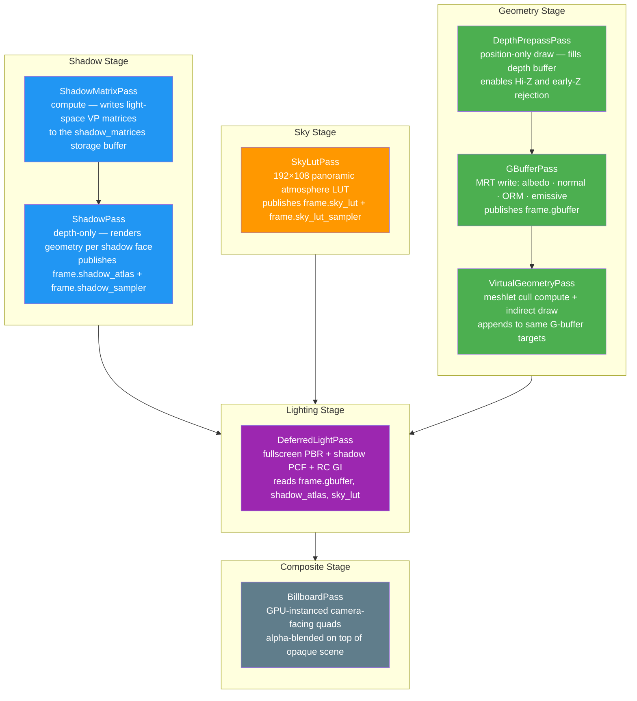

# The Render Graph

## 1. What a Render Graph Solves

The canonical rendering loop without a graph is a flat sequence of function calls hard-wired into a monolithic renderer. A shadow pass writes its atlas into a global variable. The G-buffer pass reads a viewport size stored somewhere in application state. The deferred lighting pass depends on both, but that relationship is implicit — it simply crashes or produces black output if one of them hasn't run yet. Adding a new effect requires finding the right place in the call sequence, threading new parameters through call sites that know nothing about them, and manually managing the lifetime of whatever intermediate textures the effect produces. The renderer accumulates coupling at every revision.

The fundamental insight behind render graphs is that pass execution order and resource lifetimes should be derived from data, not from procedural code. If the deferred light pass declares that it consumes the G-buffer and shadow atlas, the graph already knows that the G-buffer and shadow passes must run first. If a post-process pass declares that it writes a half-resolution intermediate texture, the graph can own and manage that texture, create it at the right size when the window resizes, and drop it when the pass is removed — without any of that logic leaking into individual pass implementations.

Helio's `RenderGraph` in `helio-v3` is a deliberate, pragmatic point on the design spectrum. It does not perform full topological sort from declared dependencies — that would require every pass to declare reads and writes for every resource slot, which imposes a significant annotation burden and is difficult to retrofit onto passes that share resources through typed Rust structs rather than string names. Instead, Helio uses explicit insertion order combined with a typed publish/consume protocol. Passes run in the order they were added, and they communicate through a shared `FrameResources` struct that is populated as the frame progresses. This approach sacrifices automatic reordering but preserves the benefits that matter most in practice: resource ownership lives in one place, inter-pass dependencies are expressed in Rust's type system rather than in global variables, and adding a new pass requires only implementing a trait and calling `add_pass` — not modifying the renderer core.

---

## 2. Helio's RenderGraph Architecture

`RenderGraph` is a struct that owns a `Vec<Box<dyn RenderPass>>` and a `Profiler`. Every call to `add_pass` appends a pass to that vector. The execution order is therefore completely explicit: the first pass added is the first pass executed. This is intentional. The alternative — automatic dependency-sorted execution — requires every pass to enumerate every resource it reads and writes under a unified naming scheme, which is practical for resource graph systems that own all resources themselves, but awkward when some resources (the G-buffer textures, for example) are owned by the pass that produces them and borrowed by name through a typed struct.

The key entry point for rendering is `execute_with_frame_resources`. The high-level `Renderer` calls this every frame, passing the target swapchain texture view, the scene's depth buffer view, and a partially-populated `FrameResources` containing anything the renderer itself has prepared before the graph runs (mesh buffer pointers, material texture arrays, billboard instances, virtual geometry data, sky state, and RC world bounds). The graph then executes three sub-phases for each pass in sequence:

The **publish phase** comes first, and its subtlety is important. Before pass `N` receives its `PassContext`, the graph iterates passes `0` through `N-1` and calls `publish` on each. Each pass that has run can fill in its output slot in a `FrameResources` copy that is visible only to pass `N`. This means that `GBufferPass`, when building the `FrameResources` visible to `DeferredLightPass`, will have `frame.gbuffer` populated with valid `GBufferViews`. The `FrameResources` is a `Copy` struct, so this accumulation is zero-allocation: the graph starts from the external `frame_resources` it was given, overlays the transient texture views it manages itself, then iterates published passes to fill the remaining slots.

The **prepare phase** follows. The graph creates a `PrepareContext` carrying the device, queue, frame counter, scene reference, and the fully-accumulated `FrameResources`, then calls `pass.prepare(&ctx)`. This is the pass's opportunity to upload per-frame uniform data to its GPU buffers before any command encoding begins. The `prepare` call happens synchronously on the CPU; the queue writes it issues are batched by wgpu and will be visible to GPU commands recorded in the next phase.

The **execute phase** records GPU commands. The graph creates a `PassContext` and calls `pass.execute(&mut ctx)`. The encoder is shared across all passes — Helio records the entire frame into a single `wgpu::CommandEncoder` and submits it once after the last pass completes. This is more efficient than one submission per pass because the GPU driver can optimise the complete command stream as a unit.

```text
graph.execute_with_frame_resources(scene, target, depth, &frame_resources)
│
├── For pass[0] ("ShadowMatrixPass"):
│   ├── Publish:  accumulate frame_resources from passes[] (none yet)
│   ├── Prepare:  pass.prepare(&PrepareContext)
│   └── Execute:  pass.execute(&mut PassContext { frame: &visible_frame })
│
├── For pass[1] ("ShadowPass"):
│   ├── Publish:  ShadowMatrixPass.publish() → (nothing for shadow matrices)
│   ├── Prepare:  pass.prepare(&PrepareContext)
│   └── Execute:  pass.execute(&mut PassContext)
│       └── pass.publish() fills frame.shadow_atlas, frame.shadow_sampler later
│
├── For pass[N] ("DeferredLightPass"):
│   ├── Publish:  ShadowPass.publish()  → frame.shadow_atlas, frame.shadow_sampler
│   │             GBufferPass.publish() → frame.gbuffer
│   │             SkyLutPass.publish()  → frame.sky_lut, frame.sky_lut_sampler
│   ├── Prepare:  pass.prepare(&PrepareContext)
│   └── Execute:  pass.execute(&mut PassContext { frame: &visible_frame })
│
└── scene.queue.submit([encoder.finish()])
```

The implication for pass authors is straightforward: a pass can assume that anything published by any earlier pass is available in `ctx.frame` when its `execute` method runs. A pass cannot assume anything about passes added after it in the graph.

---

## 3. The FrameResources Pattern

`FrameResources` is the backbone of inter-pass communication. It is defined in `libhelio` as a flat `Copy` struct of `Option<...>` fields, each corresponding to one logical resource slot in the pipeline. Its fields are typed — `frame.gbuffer` is `Option<GBufferViews>`, not `Option<*const ()>` — so the compiler enforces correct usage everywhere. When a slot is `None`, the downstream pass that would read it must either handle the absence gracefully or, more commonly, simply not be added to the graph in configurations where its dependency is absent.

```rust
pub struct FrameResources<'a> {
    /// GBuffer textures (populated after GBufferPass)
    pub gbuffer:        Option<GBufferViews<'a>>,

    /// Shadow atlas (2D array texture view) — populated after ShadowPass
    pub shadow_atlas:   Option<&'a wgpu::TextureView>,
    /// Shadow atlas sampler (comparison sampler)
    pub shadow_sampler: Option<&'a wgpu::Sampler>,

    /// Hi-Z pyramid (mip chain of depth, for occlusion culling)
    pub hiz:            Option<&'a wgpu::TextureView>,
    pub hiz_sampler:    Option<&'a wgpu::Sampler>,

    /// Atmospheric sky LUT (transmittance + aerial perspective)
    pub sky_lut:        Option<&'a wgpu::TextureView>,
    pub sky_lut_sampler:Option<&'a wgpu::Sampler>,

    /// SSAO result texture
    pub ssao:           Option<&'a wgpu::TextureView>,

    /// Pre-AA HDR colour buffer (input to TAA/FXAA/SMAA)
    pub pre_aa:         Option<&'a wgpu::TextureView>,

    /// High-level scene resources (mesh buffers, material textures, clear colour, ambient)
    pub main_scene:     Option<MainSceneResources<'a>>,

    /// Sky state (has_sky, state_changed, sky_color)
    pub sky:            SkyContext,

    /// Billboard instances for this frame
    pub billboards:     Option<BillboardFrameData<'a>>,

    /// Tiled light culling results (populated after LightCullPass)
    pub tile_light_lists:  Option<&'a wgpu::Buffer>,
    pub tile_light_counts: Option<&'a wgpu::Buffer>,

    /// Virtual geometry meshlet and instance data
    pub vg:             Option<VgFrameData<'a>>,
}
```

`GBufferViews` is itself a compact struct of four `&'a wgpu::TextureView` — albedo, normal, ORM, and emissive. A pass consuming the G-buffer unpacks `ctx.frame.gbuffer.expect("GBufferPass must precede this pass")` and binds the individual views to its shader's bind group.

The lifetime `'a` on `FrameResources<'a>` ties all borrowed views to the lifetime of the textures that own them, which in turn are owned either by the pass that produced them (for pass-owned textures such as the G-buffer targets) or by the `RenderGraph` itself (for transient textures declared via `declare_resources`). Because the graph holds both simultaneously — `&mut self` for execution and `&TransientTexture` for texture views — the internal bookkeeping uses a split-borrow pattern to satisfy the borrow checker without unsafe code.

The ordering guarantee is simple: `FrameResources` slots fill from top to bottom in the pass list. The high-level `Renderer::render` pre-populates `main_scene`, `sky`, `billboards`, and `vg` before calling the graph. `ShadowPass` fills `shadow_atlas` and `shadow_sampler` in its `publish`. `SkyLutPass` fills `sky_lut` and `sky_lut_sampler`. `OcclusionCullPass` reads `hiz` from the previous frame and writes updated indirect draw data. `DepthPrepassPass` refills the depth buffer. `HiZBuildPass` rebuilds `hiz` and `hiz_sampler` from the fresh depth. `LightCullPass` fills `tile_light_lists` and `tile_light_counts` from the depth ranges. `GBufferPass` fills `gbuffer`. By the time `DeferredLightPass` runs, all of those slots are populated and available in `ctx.frame`.

---

## 4. The RenderPass Trait

> The `RenderPass` contract, `PassContext` fields, and `PassResourceBuilder` are covered in detail on the [Render Passes index page](./passes/index.md). This section focuses on aspects relevant to the graph execution lifecycle.

The trait has four methods. Three participate in the frame execution cycle; one is a graph-construction hook:

`name() -> &'static str` returns a unique human-readable identifier for the pass. The graph uses this string as the CPU profiling scope label and as the label for GPU timestamp queries. It must be a `'static` string — a string literal suffices in all practical cases. Pass names appear verbatim in the live portal dashboard, so they should be concise and descriptive (`"GBufferPass"`, `"DeferredLightPass"`, `"MyPostProcess"` rather than `"pass"` or `"render"`).

`prepare(&mut self, ctx: &PrepareContext) -> Result<()>` runs synchronously on the CPU before any GPU command encoding begins for the current pass. Its purpose is narrow: upload data from the CPU to GPU buffers that the pass will bind during `execute`. A shadow pass uploads the shadow configuration uniform. A deferred light pass uploads the camera matrices and global settings. Critically, `prepare` must never begin a render or compute pass — `ctx` provides a `wgpu::Queue` for write operations, not a `wgpu::CommandEncoder` for recording. Attempting to record GPU commands here would require creating a separate encoder and submitting it before the frame encoder, which defeats the single-submission model and introduces unnecessary synchronisation. The default implementation is a no-op.

`execute(&mut self, ctx: &mut PassContext) -> Result<()>` records GPU commands into the shared frame encoder. The pass receives `ctx.encoder` as `&mut wgpu::CommandEncoder` and must call `ctx.begin_render_pass(...)` or `ctx.begin_compute_pass(...)` rather than calling `ctx.encoder.begin_render_pass(...)` directly. The `ctx.begin_*` wrappers inject the GPU timestamp queries that feed the profiling system; bypassing them produces passes that are invisible in the live portal dashboard. The pass must not submit the encoder — submission happens once, after all passes have returned.

`publish<'a>(&'a self, frame: &mut FrameResources<'a>)` populates the pass's output slots in `FrameResources`. It is called by the graph on a completed pass before building the `FrameResources` visible to any later pass. Because `publish` takes `&'a self`, the views it writes carry the same lifetime as the pass itself, which is owned by the graph for the duration of the frame — so there are no dangling references. The default implementation does nothing, which is correct for passes that produce no resources consumed by later passes (billboard rendering, FXAA final output, etc.).

`declare_resources(&self, builder: &mut ResourceBuilder)` is a graph-construction hook rather than a per-frame callback. It is called once during `set_render_size`, and passes use it to declare the transient textures they want the graph to own and manage. A pass that declares a `write_color("pre_aa", Rgba16Float, MatchSurface)` causes the graph to allocate and own a `Rgba16Float` texture matching the render target size. The graph recreates that texture automatically whenever `set_render_size` is called again. Passes that own their own screen-sized textures and handle resizing themselves — such as the G-buffer pass, which pre-allocates four MRT targets on construction — do not need to use `declare_resources`. The default implementation does nothing.

---

## 5. PassContext Fields

`PassContext` is passed to every `execute` call and is the primary window through which a pass observes the frame state. Its fields are all borrowed references — no owned types, no `Arc`, no locks.

`encoder: &'a mut wgpu::CommandEncoder` is the exclusive handle to the frame's command buffer. Every GPU command issued during `execute` is recorded here. The `&mut` ensures that no two passes can record into the encoder simultaneously, enforcing the sequential execution model at the type level.

`device: &'a wgpu::Device` provides access to the GPU device for operations that cannot be done through the encoder — creating bind groups from newly-published resources, for example. Passes that require bind groups whose contents change every frame (because they bind textures from `ctx.frame` that may not be allocated until runtime) create them here. Bind groups whose inputs are stable across frames should be created once in `new()` and stored in the pass struct.

`queue: &'a wgpu::Queue` is available in `PassContext` for the rare case where a pass needs to issue a queue write during command recording. In practice, per-frame uploads belong in `prepare`; the `queue` field in `PassContext` exists primarily for passes that conditionally upload based on data read from the G-buffer or other frame resources.

`target: &'a wgpu::TextureView` is the current HDR render target — the texture that opaque geometry, lighting, and transparent geometry all write into. Most passes load from and store to this target. Post-process passes may read it as a sampled texture and write to an intermediate or final texture instead.

`depth: &'a wgpu::TextureView` is the scene depth buffer in `Depth32Float` format, shared across all passes in the frame. The depth prepass writes to it; the G-buffer pass writes to it again (with the depth prepass populating the Hi-Z cache if available); the deferred lighting pass reads it for depth reconstruction; transparent passes use it as a read-only depth attachment to avoid drawing behind opaque geometry.

`scene: SceneResources<'a>` provides zero-copy borrowed references to every GPU buffer the scene owns — the camera uniform, per-instance transforms, vertex and index pools, material storage, light storage, shadow matrix buffer, and indirect draw buffer. Passes that draw scene geometry bind these buffers rather than managing their own copies.

`frame: &'a FrameResources<'a>` carries the accumulated outputs of all passes that ran before this one, as described in [Section 3](#3-the-frameresources-pattern).

`width: u32` and `height: u32` are the current render target dimensions in pixels. Passes that dispatch compute shaders over screen-sized grids use these to calculate workgroup counts.

`frame_num: u64` is a monotonically increasing counter, starting from zero, that increments once per call to `Renderer::render`. It is useful for temporal effects — jitter patterns in TAA, ping-pong buffer selection in multi-frame techniques, and time-based animation in procedural shaders.

---

## 6. The Default Pass Order

`build_default_graph` in `helio/src/renderer.rs` constructs the full deferred pipeline by calling `add_pass` eight times in a fixed sequence. The ordering is not arbitrary; each pass either produces data that a later pass consumes, or must see the depth buffer in a specific state.



**ShadowMatrixPass** is a compute pass that reads the lights storage buffer and the camera uniform and writes correct light-space view-projection matrices into the `shadow_matrices` storage buffer. It runs first because `ShadowPass` depends on those matrices to position the depth render for each shadow face. The matrices are computed on the GPU because computing six faces for up to 256 lights in a single dispatch is faster than doing it on the CPU and uploading the result.

**ShadowPass** iterates the shadow matrix buffer and renders the scene's indexed indirect draw buffer into the shadow atlas — a 2D texture array where each layer corresponds to one shadow face. It publishes `frame.shadow_atlas` and `frame.shadow_sampler`. The shadow sampler is a comparison sampler configured for PCF filtering; `DeferredLightPass` binds it alongside the atlas to perform hardware-accelerated percentage-closer filtering in the fragment shader.

**SkyLutPass** bakes the atmospheric transmittance and aerial perspective data into a compact 192×108 `Rgba16Float` texture. The pass guards execution with a dirty flag and skips re-baking when sky state has not changed since the previous frame, making it effectively free at steady state. It publishes `frame.sky_lut` and `frame.sky_lut_sampler` for both the sky rendering pass and the deferred lighting pass (which uses the LUT for directional light sky colour contribution).

**DepthPrepassPass** renders the scene using a minimal position-only vertex shader with no fragment output. Its sole purpose is to fill the depth buffer before the G-buffer pass runs. A depth prepass almost eliminates G-buffer overdraw — when the G-buffer pass runs with depth test set to `Equal` (or `LessEqual` with the same geometry), only the frontmost fragment per pixel writes its full surface data. At high triangle counts and with complex materials, the bandwidth savings from avoided G-buffer writes can be substantial.

**GBufferPass** renders opaque scene geometry into four simultaneous render targets: albedo+alpha (`Rgba8Unorm`), world normal + F0.r (`Rgba16Float`), AO+roughness+metallic+F0.g (`Rgba8Unorm`), and emissive+F0.b (`Rgba16Float`). These four textures collectively hold all the surface information that the deferred lighting pass needs to evaluate the full Cook-Torrance BRDF for every visible pixel. The pass publishes `frame.gbuffer` as a `GBufferViews` struct containing borrowed views of all four textures.

**VirtualGeometryPass** runs two sub-dispatches back to back: a compute cull pass that tests each meshlet against the view frustum and depth pyramid, writing surviving meshlet indices into an indirect dispatch buffer, followed by an indirect draw call that renders only the surviving meshlets. The pass writes into the same four G-buffer targets as `GBufferPass`, using `LoadOp::Load` to preserve geometry drawn by the regular pass. This means the deferred lighting pass sees a unified G-buffer regardless of whether geometry was drawn by the traditional indexed path or the meshlet path.

**DeferredLightPass** is a fullscreen triangle draw. It reads the G-buffer textures, reconstructs world-space positions from the depth buffer, and evaluates the Cook-Torrance BRDF with GGX distribution for every visible pixel. Shadow contribution uses PCF sampling into `frame.shadow_atlas`. Radiance Cascades indirect illumination is sampled from the cascade texture published by `RadianceCascadesPass` when that pass is active. Sky and directional lighting uses `frame.sky_lut`. For a complete technical breakdown of this pass, see the [Deferred Light Pass](./passes/deferred-light.md) reference.

**BillboardPass** is the final pass in the default graph. It renders camera-facing GPU-instanced quads — primarily used for editor light icons — as alpha-blended geometry on top of the completed lit scene. It reads `ctx.frame.billboards` for the instance list uploaded by the high-level renderer before the graph ran.

---

## 7. Custom Passes

Extending the default pipeline requires implementing the `RenderPass` trait and registering the pass with the renderer. The simplest integration point is `renderer.add_pass(Box::new(my_pass))`, which appends the pass to the end of the existing graph. A pass added this way runs after `BillboardPass`, meaning it sees the full lit, composited scene in `ctx.target` and can read everything published by all preceding passes in `ctx.frame`.

```rust
let mut renderer = Renderer::new(device.clone(), queue.clone(), config);

// MyPostProcessPass implements RenderPass
renderer.add_pass(Box::new(MyPostProcessPass::new(&device, &queue)));
```

If the default ordering is insufficient — for example, if a pass needs to run between the G-buffer and lighting stages — the entire graph must be replaced using `renderer.set_graph(graph)`. The `build_default_graph` function is public and can be called directly to obtain a pre-populated `RenderGraph`, after which custom passes can be inserted at arbitrary positions by constructing the graph manually:

```rust
use helio::renderer::build_default_graph;

let mut graph = RenderGraph::new(&device, &queue);

// Add pre-lighting passes
graph.add_pass(Box::new(ShadowMatrixPass::new(...)));
graph.add_pass(Box::new(ShadowPass::new(&device)));
graph.add_pass(Box::new(SkyLutPass::new(&device, camera_buf)));
graph.add_pass(Box::new(DepthPrepassPass::new(...)));
graph.add_pass(Box::new(GBufferPass::new(&device, width, height)));
graph.add_pass(Box::new(VirtualGeometryPass::new(&device, camera_buf)));

// Insert a custom screen-space pass before deferred lighting
graph.add_pass(Box::new(MyAmbientOcclusionPass::new(&device)));

// Resume default passes
graph.add_pass(Box::new(DeferredLightPass::new(...)));
graph.add_pass(Box::new(BillboardPass::new(...)));

// Custom post-process at the end
graph.add_pass(Box::new(MyColorGradingPass::new(&device)));

graph.set_render_size(width, height);
renderer.set_graph(graph);
```

When `renderer.set_graph` is called with a custom graph, the renderer marks the graph as `GraphKind::Custom` and will not replace it on subsequent `set_render_size` calls. The caller is responsible for handling resize by maintaining a reference to the custom graph and rebuilding it when the window size changes, or by ensuring all passes in the graph handle resize through the `PrepareContext.resize` flag in their `prepare` methods.

---

## 8. Pass Enable and Disable

The `RenderGraph` does not currently expose a `set_pass_enabled` API. Enabling and disabling individual passes at runtime is supported through two complementary patterns that cover the majority of practical use cases.

The first pattern is conditional execution inside `execute`. A pass can gate its entire GPU workload behind an internal flag:

```rust
pub struct SsaoPass {
    enabled: bool,
    // ... pipeline, buffers, etc.
}

impl RenderPass for SsaoPass {
    fn name(&self) -> &'static str { "SsaoPass" }

    fn execute(&mut self, ctx: &mut PassContext) -> Result<()> {
        if !self.enabled {
            return Ok(());
        }
        // ... record compute dispatch
        Ok(())
    }

    fn publish<'a>(&'a self, frame: &mut FrameResources<'a>) {
        if self.enabled {
            frame.ssao = Some(&self.ssao_view);
        }
        // If disabled, frame.ssao stays None.
        // DeferredLightPass handles None ssao by falling back to full ambient.
    }
}
```

This pattern is zero-overhead when disabled (a branch and a return) and requires no changes to the graph structure. `publish` must also participate in the guard — if the pass is disabled and writes nothing to its `FrameResources` slot, any downstream pass that reads that slot must handle `None` gracefully.

The second pattern is graph replacement via `renderer.set_graph`. For large-scale configuration changes — disabling shadow rendering entirely for a top-down 2D view, switching between a full deferred pipeline and a simplified forward pipeline — rebuilding the graph with the desired pass set is cleaner than sprinkling conditional flags across many passes. The cost of graph construction is paid once at mode-switch time, not every frame.

A `set_pass_enabled` API on `RenderGraph` is a planned addition that will wrap both patterns: it will maintain a `disabled: HashSet<&'static str>` and skip `prepare`, `execute`, and `publish` for any pass whose name appears in that set. Until that API lands, the patterns above are idiomatic.

---

## 9. Resize Handling

When the window is resized, `Renderer::set_render_size(w, h)` rebuilds the default graph from scratch by calling `build_default_graph` again. This recreates all pass-owned textures at the new dimensions and reinitialises all bind groups that reference them. For the default pipeline, this is the correct and complete response to a resize event.

Custom graphs must handle resize themselves. The `RenderGraph::set_render_size(w, h)` method iterates all pass resource declarations and recreates every transient texture whose size is `ResourceSize::MatchSurface` or `ResourceSize::Scaled`. This covers textures declared via `declare_resources` — the G-buffer targets, the SSAO texture, the pre-AA buffer, and so on — but it does not reach into pass structs to recreate textures the pass itself owns.

Passes that own screen-sized textures must recreate them in response to resize. The `PrepareContext` carries a `resize: bool` field that is `true` on the first `prepare` call after a resize event. A pass that owns an SSAO output texture, for example, would check this flag and reallocate:

```rust
fn prepare(&mut self, ctx: &PrepareContext) -> Result<()> {
    if ctx.resize {
        self.output_texture = ctx.device.create_texture(&wgpu::TextureDescriptor {
            size: wgpu::Extent3d {
                width: ctx.width,
                height: ctx.height,
                depth_or_array_layers: 1,
            },
            format: wgpu::TextureFormat::R8Unorm,
            // ...
        });
        self.output_view = self.output_texture.create_view(&Default::default());
        self.bind_group = rebuild_bind_group(ctx.device, &self.output_view);
    }
    // Upload per-frame uniforms...
    Ok(())
}
```

Note that `resize` is only `true` once per resize event, not on every frame. The pattern above — check flag, recreate texture and bind group, then fall through to normal uniform upload — is the idiomatic approach for pass-owned screen-sized resources.

---

## 10. Profiling Integration

Every pass in the graph receives automatic CPU and GPU profiling without any instrumentation code in the pass itself. The `RenderGraph` creates a CPU profiling scope using `pass.name()` before calling `prepare` and `execute`, and drops the scope guard after `execute` returns. The elapsed CPU wall time for the prepare+execute pair is attributed to the pass name.

GPU timing is injected by the `PassContext::begin_render_pass` and `PassContext::begin_compute_pass` wrappers. When the `profiling` feature flag is enabled (the default), these methods call `profiler.begin_gpu_pass(encoder, label)` before delegating to the encoder. The profiler writes GPU timestamp query entries into a pre-allocated query set. After the frame is submitted, the results are read back asynchronously and exported to the live portal dashboard, which displays a per-pass GPU timeline updated in real time.

The practical implication is that a pass author never needs to write profiling code. The sequence `ctx.begin_render_pass(desc)` is sufficient; the timestamp bookkeeping happens in the wrapper. A pass that calls `ctx.encoder.begin_render_pass(desc)` directly — bypassing the wrapper — will produce correct rendering but will appear as a gap in the GPU timeline. This is the primary reason `ctx.begin_render_pass` is preferred over the raw encoder method.

When the `profiling` feature flag is disabled (for shipping builds), the wrapper compiles to a direct delegation with zero overhead. The `Profiler` type contains `#[cfg(feature = "profiling")]` guards on every timing operation, so the profiling path is completely eliminated at compile time in release mode.

---

## 11. Writing a Complete Custom Pass

The following is a complete implementation of a screen-space colour inversion pass — a minimal but fully functional post-process effect that demonstrates every aspect of the `RenderPass` contract. It is intentionally simple in effect but complete in structure, suitable as a starting template for any fullscreen post-process.

### Shader (WGSL)

```wgsl
// invert.wgsl

struct VSOut {
    @builtin(position) clip_pos: vec4<f32>,
    @location(0) uv: vec2<f32>,
}

@vertex
fn vs_main(@builtin(vertex_index) vi: u32) -> VSOut {
    // Fullscreen triangle — no vertex buffer required.
    var positions = array<vec2<f32>, 3>(
        vec2<f32>(-1.0, -1.0),
        vec2<f32>( 3.0, -1.0),
        vec2<f32>(-1.0,  3.0),
    );
    var uvs = array<vec2<f32>, 3>(
        vec2<f32>(0.0, 1.0),
        vec2<f32>(2.0, 1.0),
        vec2<f32>(0.0, -1.0),
    );
    var out: VSOut;
    out.clip_pos = vec4<f32>(positions[vi], 0.0, 1.0);
    out.uv = uvs[vi];
    return out;
}

struct Uniforms {
    strength: f32,   // 0.0 = no inversion, 1.0 = full inversion
    _pad0: f32,
    _pad1: f32,
    _pad2: f32,
}

@group(0) @binding(0) var hdr_sampler: sampler;
@group(0) @binding(1) var hdr_texture: texture_2d<f32>;
@group(1) @binding(0) var<uniform> u: Uniforms;

@fragment
fn fs_main(in: VSOut) -> @location(0) vec4<f32> {
    let colour = textureSample(hdr_texture, hdr_sampler, in.uv);
    let inverted = vec4<f32>(1.0 - colour.rgb, colour.a);
    return mix(colour, inverted, u.strength);
}
```

### Rust Implementation

```rust
use helio_v3::{RenderPass, PassContext, PrepareContext, Result};
use libhelio::FrameResources;

#[repr(C)]
#[derive(Copy, Clone, bytemuck::Pod, bytemuck::Zeroable)]
struct InvertUniforms {
    strength: f32,
    _pad: [f32; 3],
}

pub struct InvertPass {
    pipeline:       wgpu::RenderPipeline,
    sampler:        wgpu::Sampler,
    uniform_buf:    wgpu::Buffer,
    bind_group_0:   Option<wgpu::BindGroup>, // texture bind group — rebuilt on resize
    bind_group_1:   wgpu::BindGroup,         // uniform bind group — stable
    bg0_layout:     wgpu::BindGroupLayout,
    strength:       f32,
    /// Intermediate texture we own — the lit scene written by DeferredLightPass
    /// is copied here so we can sample it while writing to ctx.target.
    /// On construction this is a 1×1 placeholder; resize recreates it.
    read_texture:   wgpu::Texture,
    read_view:      wgpu::TextureView,
}

impl InvertPass {
    pub fn new(
        device: &wgpu::Device,
        surface_format: wgpu::TextureFormat,
        strength: f32,
    ) -> Self {
        let shader = device.create_shader_module(wgpu::ShaderModuleDescriptor {
            label: Some("InvertPass Shader"),
            source: wgpu::ShaderSource::Wgsl(include_str!("invert.wgsl").into()),
        });

        // Bind group 0: sampler + source texture (rebuilt when texture changes)
        let bg0_layout = device.create_bind_group_layout(&wgpu::BindGroupLayoutDescriptor {
            label: Some("InvertPass BG0 Layout"),
            entries: &[
                wgpu::BindGroupLayoutEntry {
                    binding: 0,
                    visibility: wgpu::ShaderStages::FRAGMENT,
                    ty: wgpu::BindingType::Sampler(wgpu::SamplerBindingType::Filtering),
                    count: None,
                },
                wgpu::BindGroupLayoutEntry {
                    binding: 1,
                    visibility: wgpu::ShaderStages::FRAGMENT,
                    ty: wgpu::BindingType::Texture {
                        sample_type: wgpu::TextureSampleType::Float { filterable: true },
                        view_dimension: wgpu::TextureViewDimension::D2,
                        multisampled: false,
                    },
                    count: None,
                },
            ],
        });

        // Bind group 1: uniform buffer (stable across resize)
        let bg1_layout = device.create_bind_group_layout(&wgpu::BindGroupLayoutDescriptor {
            label: Some("InvertPass BG1 Layout"),
            entries: &[wgpu::BindGroupLayoutEntry {
                binding: 0,
                visibility: wgpu::ShaderStages::FRAGMENT,
                ty: wgpu::BindingType::Buffer {
                    ty: wgpu::BufferBindingType::Uniform,
                    has_dynamic_offset: false,
                    min_binding_size: None,
                },
                count: None,
            }],
        });

        let uniform_buf = device.create_buffer(&wgpu::BufferDescriptor {
            label: Some("InvertPass Uniforms"),
            size: std::mem::size_of::<InvertUniforms>() as u64,
            usage: wgpu::BufferUsages::UNIFORM | wgpu::BufferUsages::COPY_DST,
            mapped_at_creation: false,
        });

        let sampler = device.create_sampler(&wgpu::SamplerDescriptor {
            label: Some("InvertPass Sampler"),
            address_mode_u: wgpu::AddressMode::ClampToEdge,
            address_mode_v: wgpu::AddressMode::ClampToEdge,
            mag_filter: wgpu::FilterMode::Linear,
            min_filter: wgpu::FilterMode::Linear,
            ..Default::default()
        });

        let bind_group_1 = device.create_bind_group(&wgpu::BindGroupDescriptor {
            label: Some("InvertPass BG1"),
            layout: &bg1_layout,
            entries: &[wgpu::BindGroupEntry {
                binding: 0,
                resource: uniform_buf.as_entire_binding(),
            }],
        });

        let pipeline_layout = device.create_pipeline_layout(&wgpu::PipelineLayoutDescriptor {
            label: Some("InvertPass Pipeline Layout"),
            bind_group_layouts: &[&bg0_layout, &bg1_layout],
            push_constant_ranges: &[],
        });

        let pipeline = device.create_render_pipeline(&wgpu::RenderPipelineDescriptor {
            label: Some("InvertPass Pipeline"),
            layout: Some(&pipeline_layout),
            vertex: wgpu::VertexState {
                module: &shader,
                entry_point: Some("vs_main"),
                buffers: &[],  // No vertex buffer — positions generated in shader
                compilation_options: Default::default(),
            },
            fragment: Some(wgpu::FragmentState {
                module: &shader,
                entry_point: Some("fs_main"),
                compilation_options: Default::default(),
                targets: &[Some(wgpu::ColorTargetState {
                    format: surface_format,
                    blend: None, // Opaque — replace whatever is in ctx.target
                    write_mask: wgpu::ColorWrites::ALL,
                })],
            }),
            primitive: wgpu::PrimitiveState {
                topology: wgpu::PrimitiveTopology::TriangleList,
                ..Default::default()
            },
            depth_stencil: None, // Post-process — no depth needed
            multisample: wgpu::MultisampleState::default(),
            multiview: None,
            cache: None,
        });

        // 1×1 placeholder texture — recreated on first prepare() with resize=true
        let (read_texture, read_view) = create_read_texture(device, 1, 1, surface_format);

        Self {
            pipeline,
            sampler,
            uniform_buf,
            bind_group_0: None,
            bind_group_1,
            bg0_layout,
            strength,
            read_texture,
            read_view,
        }
    }

    pub fn set_strength(&mut self, strength: f32) {
        self.strength = strength.clamp(0.0, 1.0);
    }
}

impl RenderPass for InvertPass {
    fn name(&self) -> &'static str {
        "InvertPass"
    }

    fn prepare(&mut self, ctx: &PrepareContext) -> Result<()> {
        // Upload the inversion strength to the uniform buffer.
        let uniforms = InvertUniforms {
            strength: self.strength,
            _pad: [0.0; 3],
        };
        ctx.write_buffer(&self.uniform_buf, 0, bytemuck::bytes_of(&uniforms));

        // On resize, recreate the read texture at the new dimensions and rebuild BG0.
        if ctx.resize || self.bind_group_0.is_none() {
            let format = self.read_texture.format();
            let (texture, view) = create_read_texture(ctx.device, ctx.width, ctx.height, format);
            self.read_texture = texture;
            self.read_view = view;
            self.bind_group_0 = Some(ctx.device.create_bind_group(&wgpu::BindGroupDescriptor {
                label: Some("InvertPass BG0"),
                layout: &self.bg0_layout,
                entries: &[
                    wgpu::BindGroupEntry {
                        binding: 0,
                        resource: wgpu::BindingResource::Sampler(&self.sampler),
                    },
                    wgpu::BindGroupEntry {
                        binding: 1,
                        resource: wgpu::BindingResource::TextureView(&self.read_view),
                    },
                ],
            }));
        }

        Ok(())
    }

    fn execute(&mut self, ctx: &mut PassContext) -> Result<()> {
        let bg0 = self.bind_group_0.as_ref().expect("prepare() must be called before execute()");

        // Copy the current render target into our read texture so we can
        // sample it while simultaneously writing the result back to ctx.target.
        // (WebGPU forbids reading from and writing to the same texture in one pass.)
        ctx.encoder.copy_texture_to_texture(
            // source: ctx.target is a TextureView — we need the underlying texture.
            // In a real pass you would store a reference to the texture alongside the view.
            // Shown here conceptually; the actual API requires wgpu::ImageCopyTexture.
            todo!("store source texture reference alongside ctx.target"),
            wgpu::ImageCopyTexture {
                texture: &self.read_texture,
                mip_level: 0,
                origin: wgpu::Origin3d::ZERO,
                aspect: wgpu::TextureAspect::All,
            },
            wgpu::Extent3d {
                width: ctx.width,
                height: ctx.height,
                depth_or_array_layers: 1,
            },
        );

        let mut pass = ctx.begin_render_pass(&wgpu::RenderPassDescriptor {
            label: Some("InvertPass"),
            color_attachments: &[Some(wgpu::RenderPassColorAttachment {
                view: ctx.target,
                resolve_target: None,
                ops: wgpu::Operations {
                    load: wgpu::LoadOp::Load, // Preserve anything outside our triangle
                    store: wgpu::StoreOp::Store,
                },
            })],
            depth_stencil_attachment: None,
            timestamp_writes: None,
            occlusion_query_set: None,
        });

        pass.set_pipeline(&self.pipeline);
        pass.set_bind_group(0, bg0, &[]);
        pass.set_bind_group(1, &self.bind_group_1, &[]);
        pass.draw(0..3, 0..1); // Fullscreen triangle — vertex positions in shader

        Ok(())
    }

    // InvertPass produces no resources for downstream passes;
    // the default publish() (no-op) is correct.
}

fn create_read_texture(
    device: &wgpu::Device,
    width: u32,
    height: u32,
    format: wgpu::TextureFormat,
) -> (wgpu::Texture, wgpu::TextureView) {
    let texture = device.create_texture(&wgpu::TextureDescriptor {
        label: Some("InvertPass Read Texture"),
        size: wgpu::Extent3d {
            width: width.max(1),
            height: height.max(1),
            depth_or_array_layers: 1,
        },
        mip_level_count: 1,
        sample_count: 1,
        dimension: wgpu::TextureDimension::D2,
        format,
        usage: wgpu::TextureUsages::COPY_DST | wgpu::TextureUsages::TEXTURE_BINDING,
        view_formats: &[],
    });
    let view = texture.create_view(&wgpu::TextureViewDescriptor::default());
    (texture, view)
}
```

### Registering the Pass

```rust
// After constructing the renderer:
let invert = InvertPass::new(&device, surface_format, 1.0);
renderer.add_pass(Box::new(invert));

// The pass will execute after BillboardPass, reading the completed lit scene.
```

Several aspects of this example deserve comment. The `prepare` method unconditionally uploads uniforms and conditionally rebuilds textures and bind groups; the uniform upload is cheap (16 bytes via `write_buffer`) and it is simpler and safer to always upload than to track a dirty flag for `strength`. The texture and bind group rebuild is guarded by `ctx.resize || self.bind_group_0.is_none()` — the `is_none()` check handles first-frame initialisation, because `prepare` is called before `execute` but the texture dimensions are not known until `ctx.width` and `ctx.height` are available.

The `copy_texture_to_texture` pattern for reading back the render target is a standard approach in WebGPU, where a render pass cannot simultaneously read from and write to the same texture view. An alternative for effects that are purely additive or subtractive — fog, lens flare, bloom add — is to skip the copy entirely, bind a previously-computed intermediate texture, and blend the result into `ctx.target` using the render pass blend state. The inversion effect, which must read the colour it is replacing, cannot avoid the copy.

The `todo!()` in the copy source is a documentation simplification. In production, the high-level `Renderer` or a custom executor would pass the underlying `wgpu::Texture` alongside the view, or the pass would maintain its own intermediate HDR target and sample `ctx.frame.pre_aa` if available.

For passes that consume rather than write to `ctx.target` — for example, a post-process that reads the completed HDR scene from `ctx.frame.pre_aa` and writes the tone-mapped result to `ctx.target` (the swap-chain surface) — the copy step is unnecessary. `SkyLutPass` and `FxaaPass` follow exactly this pattern: a prior pass writes to the pre-AA texture, and the final pass reads it as a sampled texture.

This example demonstrates the full pass lifecycle: a struct that holds stable GPU resources created in `new()`, a `prepare()` that handles both resize and per-frame uploads, an `execute()` that records a fullscreen draw using `ctx.begin_render_pass` for automatic profiling, and a `publish()` that is correctly absent because the pass produces no downstream-consumable resources.
