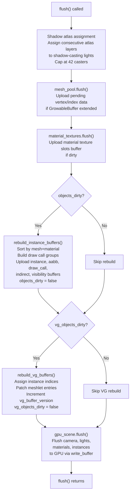

# Flush & Dirty Tracking

The `flush()` method is the synchronisation boundary between CPU scene mutations and the GPU's rendering data. Every `insert_*`, `update_*`, and `remove_*` call you make to the scene modifies CPU-side records. None of those changes reach the GPU until `flush()` runs. This design has a critical consequence: you can make thousands of mutations in a single frame without touching the GPU at all, then perform a single synchronised upload. The flip side is that `flush()` must be called before the render graph executes, or the GPU will draw stale data.

In normal usage the `Renderer::render()` method calls `flush()` automatically, so you rarely think about it. But understanding what `flush()` does internally is essential for diagnosing unexpected frame time spikes, reasoning about the steady-state performance guarantees, and writing custom render graph integrations.

---

## 1. Why Explicit Flushing

GPU command encoders in WebGPU and wgpu do not support arbitrary CPU–GPU synchronisation mid-frame. The CPU submits a batch of commands and the GPU executes them; once a command is recorded, its inputs must remain valid until the GPU finishes consuming them. This means you cannot modify a GPU buffer while the GPU is reading it.

Helio resolves this by staging all CPU mutations into CPU-side records and deferring the GPU writes to a well-defined synchronisation point at the start of each frame, before any render commands are recorded. At that point the GPU is idle (or finishing the previous frame via implicit double-buffering), making it safe to write to the instance buffer, the light buffer, the material buffer, and any other shared resource.

The dirty flag system is the mechanism that makes this efficient. Rather than uploading all data every frame, each resource category maintains a dirty flag that is set when any mutation occurs and cleared after the upload. If no mutations occurred between frames, the flag is false and the upload is skipped. A perfectly static scene — no objects added or removed, no transforms changed, no materials updated — costs essentially nothing in `flush()`.

---

## 2. The flush() Pipeline



The shadow atlas assignment step runs unconditionally on every flush, but it is inexpensive — it is a single pass over the GPU light array (which lives in CPU-accessible memory) assigning consecutive atlas layer indices.

`gpu_scene.flush()` is where the actual GPU uploads happen for camera uniforms, the light buffer, the material buffer, and the instance buffer. Each of these sub-systems maintains its own dirty tracking and only writes to the GPU when their data has changed.

---

## 3. rebuild_instance_buffers() Deep Dive

When `objects_dirty` is true, `rebuild_instance_buffers()` performs the most significant CPU work in the frame. Its purpose is to produce an optimally instanced draw call list from the flat set of registered objects.

### 3.1 The Sort

The function builds a sort order over the dense object array using `(mesh_id, material_id)` as the key:

```rust
let mut order: Vec<usize> = (0..n).collect();
order.sort_by_key(|&i| {
    let r = objects.get_dense(i).unwrap();
    (r.instance.mesh_id, r.instance.material_id)
});
```

This sort is the reason the `(mesh_id, material_id)` pair is the instancing key. After sorting, all objects that share a mesh and material are contiguous in `order`. The sort uses Rust's `sort_by_key` which is a merge sort variant — O(N log N) comparisons.

### 3.2 Building Draw Groups

The sorted order is consumed in a single linear pass. Consecutive entries with the same key form a group; each group produces one `GpuDrawCall` and one `DrawIndexedIndirectArgs`:

```rust
let mut i = 0;
while i < order.len() {
    let key = (mesh_id, material_id); // from first object in group
    let group_start = instances.len() as u32;

    // Consume all objects in this group
    while i < order.len() && (instances[order[i]].mesh_id, ..) == key {
        gpu_slots[order[i]] = instances.len() as u32;
        instances.push(record.instance);
        aabbs.push(record.aabb);
        i += 1;
    }

    let instance_count = instances.len() as u32 - group_start;
    draw_calls.push(GpuDrawCall {
        index_count,
        first_index,
        vertex_offset,
        first_instance: group_start,
        instance_count,
    });
}
```

The `gpu_slots` array maps each dense array position back to its assigned GPU buffer slot. After the rebuild, this mapping is written back into each `ObjectRecord::draw.first_instance`, enabling in-place transform updates on subsequent frames.

### 3.3 The Visibility Buffer

After the main loop, a separate pass builds the visibility buffer — a `u32` per GPU instance slot, where `1 = visible` and `0 = hidden`:

```rust
let visibility: Vec<u32> = order.iter().map(|&di| {
    let r = objects.get_dense(di).unwrap();
    if object_is_visible(r.groups, group_hidden) { 1u32 } else { 0u32 }
}).collect();
```

The visibility buffer is read by the GPU culling compute shader. Rather than removing hidden objects from the indirect draw list (which would require another sort), their visibility slots are zeroed and the culling pass skips them. This means hidden objects still occupy GPU instance buffer slots but produce zero fragments.

---

## 4. GrowableBuffer Reallocation

The underlying GPU buffers for instances, draw calls, and indirect commands are `GrowableBuffer` instances — dynamic arrays that expand on demand. When a new upload would exceed the current buffer capacity, a larger buffer is allocated and all data is copied into it.

This reallocation has an important side effect: the old buffer pointer is invalidated. Render passes that built bind groups referencing the old buffer must detect the change and recreate their bind groups. Helio passes do this via pointer-address keys:

```rust
let current_instances_ptr = scene.gpu_scene().instances.buffer() as *const _ as usize;
if self.instances_key != Some(current_instances_ptr) {
    self.bind_group = recreate_bind_group(scene);
    self.instances_key = Some(current_instances_ptr);
}
```

Reallocation happens at most once per power-of-two growth step — a buffer starting at capacity 256 reallocates at 257, 512, 513, 1024, etc. For a stable scene, reallocation never occurs. For scenes that add objects dynamically at startup, a few reallocations are expected during loading but cease as the scene stabilises.

> [!TIP]
> If your scene has a known maximum object count, you can pre-size the buffers by inserting and then removing placeholder objects during initialisation. This forces the buffers to grow to their working size before any render passes have created bind groups, avoiding mid-session reallocations.

---

## 5. Steady-State Performance

The defining performance property of Helio's dirty-tracking design is the **O(0) steady-state**: when nothing changes, `flush()` performs no GPU writes and no CPU buffer construction.

In a scene where all objects, lights, materials, and camera data are stable from one frame to the next:

- `objects_dirty` is `false` → `rebuild_instance_buffers()` is skipped
- `vg_objects_dirty` is `false` → `rebuild_vg_buffers()` is skipped
- The camera uniform has already been uploaded → its dirty flag is cleared
- The light buffer has not changed → no light upload
- The material buffer has not changed → no material upload

The `flush()` call returns after the shadow atlas assignment loop (which reads and writes a few hundred bytes of CPU memory) and a handful of flag checks. The total CPU time is measured in microseconds regardless of scene size.

---

## 6. Transform Update Frequency Patterns

The following patterns illustrate how different update frequencies translate to CPU and GPU cost:

**Static objects** — Insert once, never call `update_object_transform`. After the initial flush, `objects_dirty` is cleared and these objects contribute zero CPU or GPU work per frame. Their GPU buffer slots are written once and remain valid indefinitely.

**Animated objects** — Call `update_object_transform(id, mat)` once per frame per animated object. Each call writes 128 bytes to the GPU instance buffer via a targeted `write_buffer`. On modern hardware, writing 128 bytes at a specific offset costs approximately 0–5 microseconds including the wgpu overhead. A scene with 500 animated characters therefore spends approximately 0.5–2.5 milliseconds on transform writes per frame — predictable and scaling linearly with animated object count.

**Dynamic topology** — Inserting or removing objects triggers a full `rebuild_instance_buffers()` on the next flush. This is O(N_objects) in time. For a scene with 50,000 objects, a single topology change causes a sort of all 50,000 objects. If topology changes happen every frame (e.g. streaming in and out hundreds of objects each frame), the rebuild dominates CPU time. The solution is to batch topology changes — insert all new objects for a given batch at once so only one rebuild is triggered.

The performance table below summarises typical costs at representative scene scales:

| Scenario | CPU cost per flush() | GPU uploads per flush() |
|---|---|---|
| Static scene, no updates | ~1 µs (flag checks only) | 0 bytes |
| 100 animated objects | ~50 µs (100 × 128-byte writes) | 12.8 KB |
| 1000 animated objects | ~500 µs | 128 KB |
| Single topology change (10K objects) | ~2 ms (sort + rebuild) | ~1.3 MB (all instances) |
| 100 topology changes per frame (10K objects) | ~2 ms (one rebuild regardless) | ~1.3 MB |

The last two rows illustrate an important property: multiple topology changes within the same frame cost no more than a single change, because `objects_dirty` is a boolean — it accumulates all changes and the single rebuild at flush time handles all of them.

---

## 7. The Full Frame Loop

The correct ordering of operations in a frame loop that manually manages flush:

```rust
loop {
    // 1. Apply mutations for this frame
    for (id, transform) in animated_objects.iter() {
        scene.update_object_transform(*id, *transform)?;
    }
    scene.update_camera(camera_for_this_frame);

    // 2. Synchronise GPU state (dirty-tracked, O(0) if nothing changed)
    scene.flush();
    scene.advance_frame(); // increments the frame counter used by TAA jitter

    // 3. Record and submit render commands
    let encoder = device.create_command_encoder(&Default::default());
    graph.execute(&scene, &mut encoder, &surface_view)?;
    queue.submit([encoder.finish()]);
}
```

When using `Renderer`, steps 2 and 3 are handled internally by `renderer.render()`. The call order is always: mutations → flush → render.

---

## 8. Diagnosing Unexpected Rebuilds

If frame times spike unexpectedly, the most common cause is `objects_dirty` being set on frames where you don't expect topology changes. The following conditions all set `objects_dirty = true`:

- `insert_object()` called
- `remove_object()` called
- `update_object_material()` called (changes the sort key)
- Any object's mesh or material handle changed

A common accidental pattern is calling `update_object_material()` every frame to "update" a material that has not actually changed. The function always sets `objects_dirty = true` regardless of whether the new material is the same as the old one, because it must update ref counts. The solution is to track material changes in your application logic and only call `update_object_material()` when the material actually changes.

Another pattern is inserting temporary debug objects every frame and removing them the next frame. Each insert/remove pair triggers two full rebuilds (one when inserted, one when removed). For debug visualisation, prefer the billboard system or the debug pass, which are designed for per-frame geometry without triggering instance buffer rebuilds.

> [!NOTE]
> You can inspect `objects_dirty` before calling `flush()` to check whether a rebuild is about to happen. In a debug build, add a log statement that fires when `objects_dirty` is true to identify which frames are triggering rebuilds and trace the cause.
