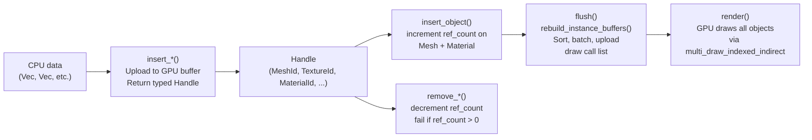

# Scene API

The `Scene` is the central data model of Helio. Every mesh, texture, material, light, and renderable object in a Helio application lives inside a `Scene`, and every frame that the renderer draws is ultimately a projection of the scene's current state onto the GPU. Understanding the scene's ownership model, resource lifecycle, and the synchronisation boundary between CPU mutations and GPU execution is a prerequisite for using any other part of the API.

This document provides a conceptual map of the Scene API. Each of the seven major categories is described here at a high level and links to a dedicated sub-page with full reference material.

---

## 1. The Ownership Model

Helio's resource ownership is deliberately asymmetric. The CPU owns exactly one copy of each resource — after you call `scene.insert_mesh(upload)` the raw vertex data is uploaded to a GPU buffer and the original `Vec` is dropped. What you receive back is a typed, generation-counted handle: a value like `MeshId { slot: 3, generation: 1 }` that is the only thing you ever carry around on the CPU side. The slot number is an index into a GPU-resident array; the generation counter is a monotonically increasing integer that detects use-after-free bugs at zero runtime cost in release builds.

This design choice has several important consequences. First, there is no per-frame serialisation of scene data — the GPU buffers are populated once at upload time and never re-serialised from CPU structs unless explicitly requested through the update API. A scene with ten thousand objects costs essentially nothing to render from the CPU's perspective once its initial flush is complete. Second, the handles are `Copy` types, so you can freely clone them, store them in components, pass them by value, or throw them away — the resource will not be freed until you explicitly call `remove_mesh()`, `remove_texture()`, or the corresponding remove function for the resource type. Third, freeing a resource that is still referenced by any object will return a `SceneError::ResourceInUse` error rather than silently dangling a GPU pointer. The reference count maintained by the scene is the enforcement mechanism for this guarantee.

All handles implement `PartialEq` and `Hash`, making them usable as keys in `HashMap` and `HashSet`. The generation field means that a handle to a slot that has been freed and reallocated to a new resource will compare as unequal to any earlier handle at the same slot — generation mismatch is tested on every lookup.

---

## 2. Resource Lifecycle

Resources flow through four well-defined stages:



The sequence is: upload a resource with `insert_*()` to get a handle, create objects with `insert_object()` binding mesh and material handles together, call `flush()` to synchronise all pending changes to the GPU, and then call `render()` to execute the draw. The `Renderer` struct calls `flush()` automatically at the start of `render()`, so you rarely invoke it directly. Removal goes in the opposite direction: remove all objects referencing a resource before attempting to remove the resource itself.

---

## 3. The Seven API Categories

### 3.1 Resources

Meshes, textures, and materials are the building blocks of all renderable content. The [Resources](./resources) page covers the `PackedVertex` layout and its bandwidth rationale, the global `MeshPool` that enables `multi_draw_indexed_indirect`, the bindless texture array design, the `GpuMaterial` struct, and the full `MaterialAsset` workflow for PBR assets with multiple texture maps.

### 3.2 Objects

A renderable object is the combination of a mesh handle, a material handle, a world transform, and a bounding sphere. The [Objects](./objects) page covers the `ObjectDescriptor` struct, how automatic GPU instancing emerges from `flush()`'s sort-by-(mesh, material) strategy, in-place O(1) transform updates, and the `GpuInstanceData` GPU layout.

### 3.3 Lights

Point lights, spot lights, and directional lights all reduce to a single `GpuLight` struct uploaded to a GPU storage buffer. The [Lights](./lights) page covers the `GpuLight` layout, light type constructors, dynamic per-frame updates, and the relationship between scene lights and the shadow atlas.

### 3.4 Groups

Groups are 64-bit bitmask labels that attach to objects, enabling O(1) visibility toggles for entire categories of content. The [Groups & Mass Operations](./groups) page covers `GroupId`, `GroupMask`, the eight built-in group constants, and the mass transform and visibility operations that operate on all objects sharing a group.

### 3.5 Virtual Geometry

For high-polygon assets where per-triangle detail matters, Helio provides a virtual geometry system that decomposes meshes into meshlet clusters of up to 64 triangles each. The [Virtual Geometry](./virtual-geometry) page covers `VirtualMeshUpload`, the automatic LOD generation pipeline, `VirtualObjectDescriptor`, and the `VgFrameData` struct that transfers CPU-built meshlet lists to the GPU each frame.

### 3.6 Camera

The camera determines how the scene is projected to the screen. The [Camera](./camera) page covers the `Camera` struct, the `perspective_look_at` constructor, the `GpuCameraUniforms` layout, TAA jitter, and aspect ratio handling on window resize.

### 3.7 Flush & Dirty Tracking

The `flush()` method is the synchronisation point between CPU scene mutations and the GPU buffers. The [Flush & Dirty Tracking](./flush-and-dirty-tracking) page covers the complete pipeline inside `flush()`, the `rebuild_instance_buffers()` sort strategy, `GrowableBuffer` reallocation semantics, and the O(0) steady-state guarantee.

---

## 4. Error Handling

Every operation that can fail returns a `Result<T, SceneError>`. The `SceneError` enum has three variants:

```rust
#[derive(Debug, Error)]
pub enum SceneError {
    #[error("invalid {resource} handle")]
    InvalidHandle { resource: &'static str },

    #[error("{resource} is still in use")]
    ResourceInUse { resource: &'static str },

    #[error("scene texture capacity exceeded")]
    TextureCapacityExceeded,
}
```

`InvalidHandle` is returned when the slot or generation of a handle does not match any live record — typically this means a stale handle to a resource that was already removed, or a handle that was never inserted. `ResourceInUse` is returned when you attempt to remove a resource that still has a non-zero reference count — one or more objects, materials, or virtual meshes still hold a reference to it. `TextureCapacityExceeded` is returned when you attempt to insert a texture and the bindless array is already at `MAX_TEXTURES = 256` slots.

> [!NOTE]
> The `ResourceInUse` error is a safety guarantee rather than a nuisance. GPU-driven rendering requires that all buffer indices stored in the GPU instance data remain valid for the entire lifetime of the draw call. If a mesh were freed while objects still referenced its index, the next frame would submit draw calls with corrupt geometry offsets. The ref-count check prevents this class of bug entirely.

The `Renderer`'s wrapping methods (`insert_mesh`, `insert_object`, etc.) forward these errors directly. The recommended pattern is to use `?` propagation in your loading code and handle `SceneError` at the application boundary where you can log the context and decide how to recover.

---

## 5. Hello World — Full Frame Flow

The following example shows the minimal code needed to go from an empty scene to a rendered frame with a single triangle mesh and a directional light. It assumes you already have a `wgpu::Device`, `wgpu::Queue`, and a surface configured for rendering.

```rust
use helio::{Renderer, RendererConfig, GpuLight, LightType};
use helio::scene::{Camera, ObjectDescriptor};
use helio::mesh::{MeshUpload, PackedVertex};
use helio::material::GpuMaterial;
use helio::groups::GroupMask;
use glam::{Mat4, Vec3};

// 1. Create the renderer (owns Scene internally)
let config = RendererConfig::new(1280, 720, surface_format);
let mut renderer = Renderer::new(device.clone(), queue.clone(), config);

// 2. Upload a triangle mesh
let vertices = vec![
    PackedVertex::from_components(
        [-0.5, -0.5, 0.0], [0.0, 0.0, 1.0], [0.0, 0.0], [1.0, 0.0, 0.0], 1.0,
    ),
    PackedVertex::from_components(
        [ 0.5, -0.5, 0.0], [0.0, 0.0, 1.0], [1.0, 0.0], [1.0, 0.0, 0.0], 1.0,
    ),
    PackedVertex::from_components(
        [ 0.0,  0.5, 0.0], [0.0, 0.0, 1.0], [0.5, 1.0], [1.0, 0.0, 0.0], 1.0,
    ),
];
let indices = vec![0u32, 1, 2];
let mesh_id = renderer.scene_mut().insert_mesh(MeshUpload { vertices, indices });

// 3. Create a simple grey material
let material = GpuMaterial {
    base_color: [0.7, 0.7, 0.7, 1.0],
    emissive:   [0.0; 4],
    roughness_metallic: [0.5, 0.0, 1.5, 0.04],
    tex_base_color: GpuMaterial::NO_TEXTURE,
    tex_normal:     GpuMaterial::NO_TEXTURE,
    tex_roughness:  GpuMaterial::NO_TEXTURE,
    tex_emissive:   GpuMaterial::NO_TEXTURE,
    tex_occlusion:  GpuMaterial::NO_TEXTURE,
    workflow: 0, // metallic-roughness
    flags: 0,
    _pad: 0,
};
let material_id = renderer.scene_mut().insert_material(material);

// 4. Place the triangle at the origin
let object_id = renderer.scene_mut().insert_object(ObjectDescriptor {
    mesh: mesh_id,
    material: material_id,
    transform: Mat4::IDENTITY,
    bounds: [0.0, 0.0, 0.0, 1.0], // centre + radius in world space
    flags: 0,
    groups: GroupMask::NONE,
}).expect("mesh and material handles are valid");

// 5. Add a directional sun light
let sun = GpuLight {
    position_range: [0.0, 0.0, 0.0, f32::MAX],
    direction_outer: [-0.3, -1.0, -0.5, 0.0_f32.cos()],
    color_intensity: [1.0, 0.95, 0.85, 5.0],
    shadow_index: u32::MAX, // no shadow for this minimal example
    light_type: 0, // directional
    inner_angle: 0.0,
    _pad: 0,
};
let _sun_id = renderer.scene_mut().insert_light(sun);

// 6. Frame loop
loop {
    let camera = Camera::perspective_look_at(
        Vec3::new(0.0, 0.5, 3.0),  // position
        Vec3::ZERO,                  // target
        Vec3::Y,                     // up
        std::f32::consts::FRAC_PI_4, // 45° vertical FOV
        1280.0 / 720.0,              // aspect ratio
        0.1,                         // near
        1000.0,                      // far
    );
    renderer.scene_mut().update_camera(camera);

    // scene.flush() + render graph execution happen inside render()
    renderer.render(&surface_texture_view, &queue, &device)?;
}
```

> [!TIP]
> The `Renderer` wrapper exposes all `Scene` methods through `renderer.scene_mut()`. If you are building a custom render graph without using `Renderer`, access the `Scene` directly and call `scene.flush()` before submitting command buffers.
