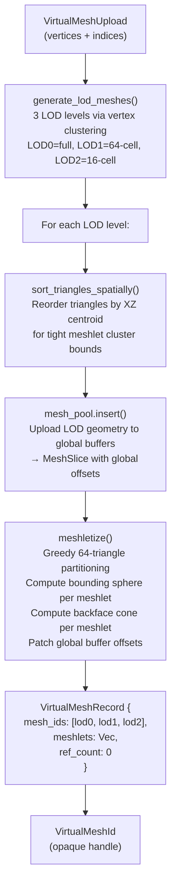

# Virtual Geometry

Standard GPU instancing — the indirect drawing model described in the [Objects](./objects) page — operates at the granularity of whole meshes. The culling pass tests each object's bounding sphere; if the sphere intersects the view frustum, the full mesh is submitted for rasterisation. For a high-polygon character with 400,000 triangles, the GPU processes all 400,000 triangles regardless of how many of them are actually visible. Virtual geometry solves this by decomposing a mesh into small clusters called **meshlets** and performing culling at the meshlet level. Only the meshlets that survive frustum and backface culling contribute triangles to the rasteriser.

This document covers Helio's virtual geometry API — how to upload a high-polygon mesh as a virtual mesh, how to place instances, and how the automatic LOD system reduces the meshlet count for distant objects without any CPU decision-making.

---

## 1. What Virtual Geometry Adds

The key difference between regular objects and virtual objects is the granularity of GPU culling. Regular objects are tested as single bounding spheres — pass or fail, all triangles are drawn. Virtual geometry decomposes each mesh into meshlets of at most `MESHLET_MAX_TRIANGLES = 64` triangles each. The GPU culling compute shader tests every meshlet's bounding sphere independently and emits a `DrawIndexedIndirect` only for meshlets that pass. For a typical high-polygon environment asset, 60–80% of meshlets are culled away at any given viewpoint — most are backfacing, occluded, or outside the frustum.

The second benefit is the backface cone cull. Each meshlet records a conservative backface cone — an apex point, an average normal axis, and a cutoff cosine. If the dot product of the view direction with the cone axis is above the cutoff, every triangle in the meshlet is guaranteed to be backfacing and the meshlet can be discarded without any per-triangle evaluation. For closed convex surfaces this eliminates approximately half the meshlets on average.

Combined, these two culling stages mean that a mesh with 200 meshlets (approximately 12,800 triangles) might produce only 40–80 visible meshlets per frame under typical viewing conditions. The GPU vertex shaders process dramatically fewer triangles, and the rasteriser encounters less overdraw from off-screen geometry.

---

## 2. Upload Pipeline

### 2.1 VirtualMeshUpload

To use virtual geometry, replace `insert_mesh()` with `insert_virtual_mesh()`. The upload struct is structurally similar to `MeshUpload`:

```rust
pub struct VirtualMeshUpload {
    pub vertices: Vec<PackedVertex>,
    pub indices:  Vec<u32>,
}
```

The same `PackedVertex` format is used — the vertices are uploaded to the same global `MeshPool` as regular meshes. Virtual meshes are not stored in a separate buffer pool; they share the unified vertex and index buffers. The difference is entirely in what happens on the CPU side of the insertion call.

### 2.2 What insert_virtual_mesh() Does

`insert_virtual_mesh()` is the only place in the Helio API where a significant O(N_triangles) CPU computation occurs outside your own code:



The most expensive step is `generate_lod_meshes()`, which runs a vertex clustering simplification algorithm on the full-detail geometry to produce medium and coarse LOD variants. For a 100,000-triangle mesh, this computation takes on the order of tens of milliseconds on a modern CPU. It should be performed at asset load time, not in the main loop.

After LOD generation, each LOD is independently spatially sorted and meshletised. The spatial sort is critical for cluster quality — triangles near each other in 3-D space become adjacent in the index buffer, which means the greedy 64-triangle partitioning produces clusters with tight bounding spheres. Without spatial sorting, the clusters inherit the arbitrary triangle order of the original exporter, producing large bounding spheres that defeat the spatial culling.

### 2.3 GpuMeshletEntry Layout

Each meshlet is described by a `GpuMeshletEntry`:

```rust
pub struct GpuMeshletEntry {
    pub center:         [f32; 3],   // bounding sphere centre (mesh-local)
    pub radius:         f32,         // bounding sphere radius
    pub cone_apex:      [f32; 3],   // backface cone apex (centroid of cluster)
    pub cone_cutoff:    f32,         // cos(max_half_angle); > 1.0 disables cone culling
    pub cone_axis:      [f32; 3],   // average surface normal direction
    pub lod_error:      f32,         // 0.0=LOD0, 1.0=LOD1, 2.0=LOD2 (LOD discriminant)
    pub first_index:    u32,         // absolute start in the global index buffer
    pub index_count:    u32,         // number of indices (≤ 64 × 3 = 192)
    pub vertex_offset:  i32,         // absolute vertex base in the global vertex buffer
    pub instance_index: u32,         // patched by rebuild_vg_buffers()
}
```

The `lod_error` field doubles as a LOD level tag. The GPU culling shader computes a screen-space error estimate for each meshlet and selects the coarsest LOD whose `lod_error` is below the threshold. Because LOD selection happens entirely on the GPU, it requires zero CPU work per frame — no LOD state, no per-object LOD transitions, no popping artefacts from delayed CPU decisions.

---

## 3. Placing Virtual Object Instances

### 3.1 VirtualObjectDescriptor

```rust
#[derive(Debug, Clone, Copy)]
pub struct VirtualObjectDescriptor {
    pub virtual_mesh: VirtualMeshId,    // handle from insert_virtual_mesh()
    pub material_id:  u32,              // raw slot index (not a MaterialId handle)
    pub transform:    Mat4,             // column-major world transform
    pub bounds:       [f32; 4],         // world-space bounding sphere [cx, cy, cz, radius]
    pub flags:        u32,              // bit 0 = casts_shadow
    pub groups:       GroupMask,        // group membership
}
```

Note that `material_id` is a raw `u32` slot index rather than a typed `MaterialId` handle. This is because virtual objects are currently designed to use a single material for the entire mesh. The slot index should be obtained from `material_id.slot()` on a `MaterialId` you have already inserted.

### 3.2 Inserting Virtual Objects

```rust
let vobj_id: VirtualObjectId = scene.insert_virtual_object(VirtualObjectDescriptor {
    virtual_mesh: vmesh_id,
    material_id:  mat_id.slot(),
    transform:    Mat4::from_translation(Vec3::new(0.0, 0.0, 0.0)),
    bounds:       [0.0, 5.0, 0.0, 8.0], // world-space sphere
    flags:        1, // casts shadow
    groups:       GroupMask::from(GroupId::STATIC),
})?;
```

`insert_virtual_object()` increments the `VirtualMeshRecord::ref_count` and sets `vg_objects_dirty = true`. On the next `flush()`, `rebuild_vg_buffers()` runs and assigns a contiguous `instance_index` to every virtual object in the scene.

### 3.3 How Instance Indices are Assigned

The `rebuild_vg_buffers()` function iterates all virtual objects in dense array order, assigns each a sequential `instance_index`, then copies the meshlet list of the object's virtual mesh into the flat `vg_cpu_meshlets` buffer with the `instance_index` field patched:

```rust
for i in 0..instance_count {
    let obj = vg_objects.get_dense(i);
    let instance_index = vg_cpu_instances.len() as u32;
    vg_cpu_instances.push(obj.instance);

    for mut meshlet in mesh_record.meshlets.iter().copied() {
        meshlet.instance_index = instance_index;
        vg_cpu_meshlets.push(meshlet);
    }
}
```

After the rebuild, `vg_cpu_meshlets` is a flat array where every meshlet entry knows which instance it belongs to. The VirtualGeometryPass uploads this array to the GPU at the start of each frame when `vg_buffer_version` advances.

---

## 4. Transform Updates and the Buffer Version

```rust
scene.update_virtual_object_transform(vobj_id, new_transform)?;
```

Unlike regular objects, virtual object transform updates always set `vg_objects_dirty = true`. This is because the flat `vg_cpu_meshlets` buffer carries the `instance_index` binding, not a world-space transform — the world transform lives in `vg_cpu_instances`. When the VirtualGeometryPass executes, it reads the instance transform to cull each meshlet's world-space bounding sphere. A stale instance transform would cause incorrect meshlet culling.

The `vg_buffer_version` counter increments each time `rebuild_vg_buffers()` completes. The `VgFrameData` struct passed to the VirtualGeometryPass each frame carries this version number:

```rust
pub struct VgFrameData<'a> {
    pub meshlets:      &'a [u8],     // cast_slice of &[GpuMeshletEntry]
    pub instances:     &'a [u8],     // cast_slice of &[GpuInstanceData]
    pub meshlet_count: u32,
    pub instance_count: u32,
    pub buffer_version: u64,         // increments on each rebuild
}
```

The VirtualGeometryPass compares `buffer_version` against its cached version. If they differ, it re-uploads the CPU meshlet and instance slices to its GPU buffers. If they match, the GPU already has current data and no upload is needed. For a scene with static virtual objects, this check is free — `buffer_version` never advances and the GPU buffer is uploaded exactly once.

---

## 5. Removing Virtual Objects and Meshes

```rust
// Remove instances first
scene.remove_virtual_object(vobj_id)?;

// Then the mesh (fails if any virtual objects still reference it)
scene.remove_virtual_mesh(vmesh_id)?;
```

`remove_virtual_mesh()` also removes all three LOD meshes from the `MeshPool`. Removing a virtual mesh that is still referenced by one or more virtual objects returns `SceneError::ResourceInUse`.

---

## 6. Retrieving VgFrameData

The VirtualGeometryPass obtains its per-frame data via:

```rust
if let Some(vg_data) = scene.vg_frame_data() {
    vg_pass.set_frame_data(vg_data);
}
```

`vg_frame_data()` returns `None` if there are no virtual objects in the scene, which allows the VirtualGeometryPass to skip its GPU uploads and dispatch entirely. This makes the virtual geometry system zero-cost for scenes that do not use it.

---

## 7. When to Use Virtual Geometry vs Regular Objects

The choice between regular `insert_object()` and `insert_virtual_mesh()` depends primarily on mesh complexity and the expected GPU culling benefit.

Use virtual geometry when the mesh has a triangle count that is large relative to its projected screen area at typical viewing distances. A detailed character model with 200,000 triangles and 3,000 meshlets will see major GPU savings from per-meshlet culling because most of its surface area is either backfacing or outside the frustum at any moment. Architectural interiors with complex curved geometry, hero environmental props, and vehicle models are all strong candidates.

Use regular objects for low-polygon assets where the overhead of the virtual geometry system outweighs the culling savings. A simple prop with 500 triangles and 8 meshlets would produce 8 GPU culling tests and up to 8 draw calls instead of 1. For foliage, particles, UI elements, and simple static props, regular instanced objects are more efficient because the instancing path consolidates many objects into one draw call.

The inflection point is approximately 10,000–20,000 triangles. Meshes above this threshold generally benefit from virtual geometry. Meshes below it generally do not. This threshold varies with GPU architecture — newer GPUs have faster culling compute shaders that shift the benefit threshold lower.

---

## 8. Complete Example — High-Resolution Rock Formation

```rust
use helio::scene::Scene;
use helio::vg::{VirtualMeshUpload, VirtualObjectDescriptor};
use helio::groups::{GroupId, GroupMask};
use glam::{Mat4, Vec3};

fn load_rock_formation(
    scene: &mut Scene,
    mesh_data: (Vec<helio::mesh::PackedVertex>, Vec<u32>),
    material_id: helio::handles::MaterialId,
) -> anyhow::Result<Vec<helio::vg::VirtualObjectId>> {
    let (vertices, indices) = mesh_data;

    // Upload the high-polygon rock mesh.
    // generate_lod_meshes() and meshletize() run here — takes ~50ms for a 500k-tri mesh.
    // Do this at load time, not in the render loop.
    let vmesh_id = scene.insert_virtual_mesh(VirtualMeshUpload { vertices, indices });

    let mut instance_ids = Vec::new();

    // Place 10 instances at different positions and orientations
    for i in 0..10 {
        let angle = (i as f32 / 10.0) * std::f32::consts::TAU;
        let radius = 15.0_f32;
        let x = radius * angle.cos();
        let z = radius * angle.sin();
        let scale = 0.8 + (i as f32 * 0.1); // vary size slightly
        let yaw = angle + std::f32::consts::FRAC_PI_4;

        let transform = Mat4::from_scale_rotation_translation(
            Vec3::splat(scale),
            glam::Quat::from_rotation_y(yaw),
            Vec3::new(x, 0.0, z),
        );

        // Bounding sphere: rock formation is ~4m tall, ~3m wide at scale=1
        let bounds_radius = scale * 3.5;
        let bounds_cy = scale * 2.0;

        let vobj_id = scene.insert_virtual_object(VirtualObjectDescriptor {
            virtual_mesh: vmesh_id,
            material_id:  material_id.slot(),
            transform,
            bounds:       [x, bounds_cy, z, bounds_radius],
            flags:        1, // casts shadow
            groups:       GroupMask::from(GroupId::STATIC),
        })?;
        instance_ids.push(vobj_id);
    }

    Ok(instance_ids)
}
```

> [!NOTE]
> After this function returns, `vg_objects_dirty` is true. The next `flush()` will call `rebuild_vg_buffers()` which assigns instance indices to all 10 virtual objects and builds the flat meshlet array. For a 500,000-triangle mesh decomposed into approximately 2,600 meshlets per LOD level, the flat meshlet array for 10 instances would contain approximately `2600 + 650 + 160 ≈ 3410` total meshlet entries across three LODs. The GPU culling pass tests all 3,410 meshlets and selects which LOD to draw based on screen-space error.
