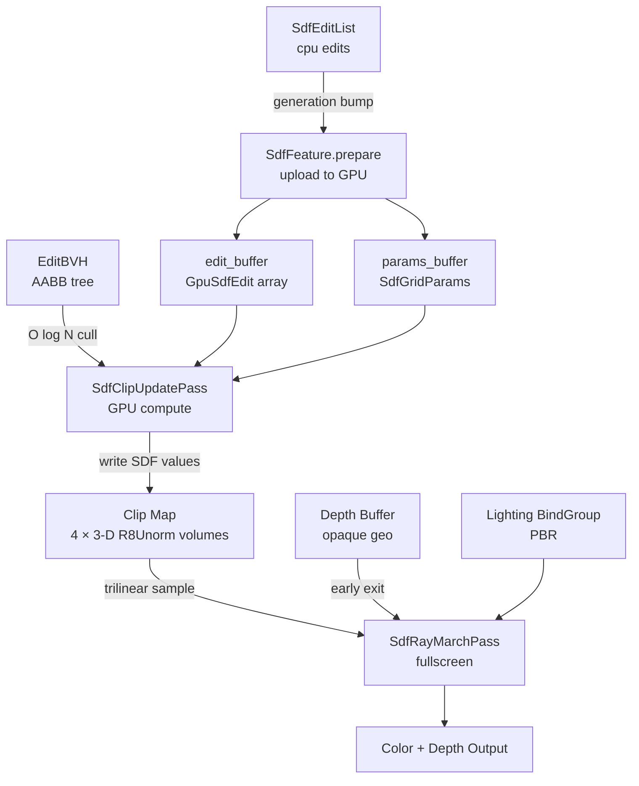
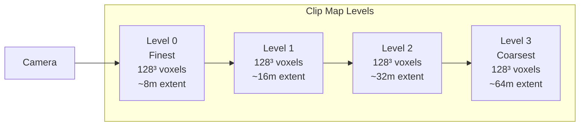
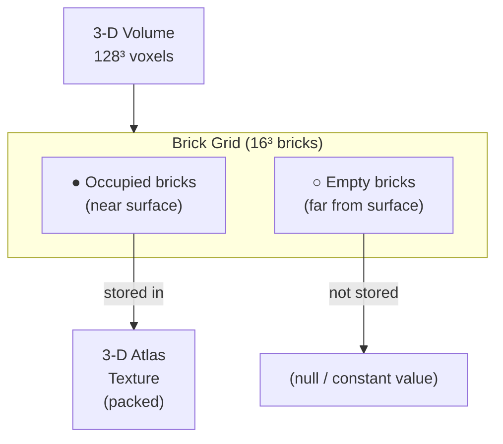
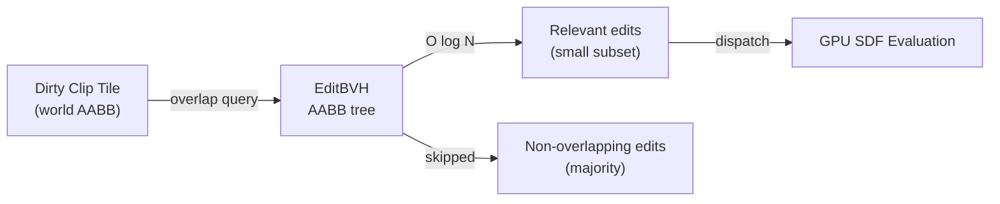
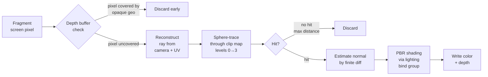
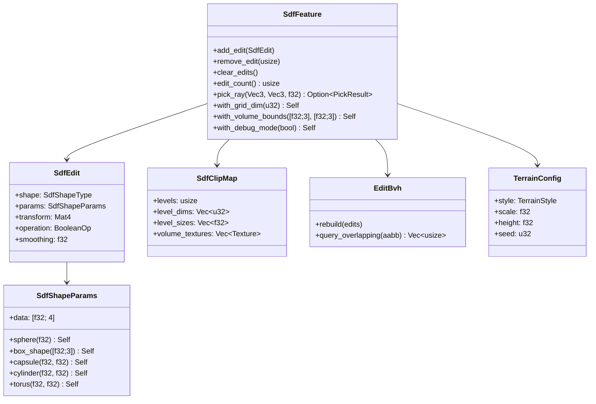

# SDF Constructive Solid Geometry

Helio's SDF system gives you fully dynamic, analytically defined solid geometry without a single triangle mesh. You describe the world as a composition of primitive shapes combined through boolean operations — unions, subtractions, intersections, and their smooth blended variants — and the renderer evaluates that composition on the GPU every frame by ray marching through a multi-resolution volume. The result looks and shades exactly like opaque mesh geometry: it receives the same PBR lighting, writes to the same depth buffer, and participates in the same deferred pipeline. The only difference is how the geometry is stored and evaluated.

This page is a complete reference for every concept in the `sdf` module: primitives, the edit list, clip maps, brick storage, the BVH acceleration structure, GPU passes, terrain generation, and runtime interaction.

<!-- screenshot: SDF cave carved out of terrain with smooth union blend visible between spheres -->

---

## What Is a Signed Distance Field?

A **signed distance field** (SDF) is a scalar field defined over 3-D space. At every point **p** in that space, the field stores a single number: the signed shortest distance from **p** to the nearest surface of some shape. Negative values mean **p** is *inside* the shape; positive values mean it is *outside*; zero means **p** is exactly on the surface. The set of all points where the SDF equals zero forms an *implicit surface* — a perfectly smooth surface defined by a mathematical condition rather than by a polygon mesh.

Formally, for a surface $$$1$$, the signed distance field at point $$$1$$ is:

$$f(\mathbf{p}) = \begin{cases} -d(\mathbf{p}, \mathcal{S}) & \text{if } \mathbf{p} \text{ is inside } \mathcal{S} \\ 0 & \text{if } \mathbf{p} \in \mathcal{S} \\ +d(\mathbf{p}, \mathcal{S}) & \text{if } \mathbf{p} \text{ is outside } \mathcal{S} \end{cases}$$

where $$$1$$ is the shortest Euclidean distance from $$$1$$ to any point on the surface. The **sign** encodes inside/outside. The **magnitude** is the distance to the nearest surface. The **zero level set** — all points where $$$1$$ — is the surface itself.

The power of SDFs in real-time rendering comes from two properties:

- **Boolean operations are cheap.** Combining two SDFs into a union, subtraction, or intersection is a single scalar operation per sample point. There are no mesh boolean artifacts, no T-junctions, no degenerate triangles, no topology problems.
- **Ray marching is efficient.** Because the SDF tells you the safe step distance (you can always advance a ray by at least `|sdf(p)|` without crossing the surface), a ray marcher can traverse empty space in large steps and converge on surfaces precisely, all in a compute shader.

> [!NOTE]
> SDFs represent *implicit* geometry. The surface is never explicitly enumerated as vertices or faces. This means you can add, remove, and animate primitives at runtime with no mesh rebuild step — the GPU simply re-evaluates the field on the next frame.

Helio evaluates SDFs by baking the composed field into a **3-D volume texture** on the GPU (the clip map), then ray marching through that volume in a fullscreen pass. Baking lets the ray marcher sample the composed field with a single trilinear texture fetch per step instead of re-evaluating every edit's analytical formula on every march step. This decouples edit count from march cost.

---

## Architecture Overview

The following diagram shows how data flows from the CPU-side edit list through to the final rendered pixels.



The `SdfFeature` is a standard Helio [feature](./feature-system). It owns all GPU resources, registers the two render passes, and acts as the bridge between the application's runtime edit calls and the GPU pipelines.

---

## Primitive Shapes

Every piece of SDF geometry begins with a **primitive** — a simple, analytically defined solid. Helio provides the following primitive types through `SdfShapeType`:

| Variant | Description | Parameters |
|---------|-------------|------------|
| `Sphere` | Perfect sphere | `data[0]` = radius (metres) |
| `Box` | Axis-aligned box (before transform) | `data[0..2]` = half-extents xyz |
| `Capsule` | Cylinder capped with hemispheres | `data[0]` = radius, `data[1]` = half-height |
| `Cylinder` | Flat-capped cylinder | `data[0]` = radius, `data[1]` = half-height |
| `Torus` | Donut / ring shape | `data[0]` = major radius, `data[1]` = minor radius |

Shape parameters are packed into the four-element `SdfShapeParams::data` array. Unused slots are ignored. Convenience constructors handle the packing for you:

```rust
use helio::sdf::{SdfShapeType, SdfShapeParams};

// A sphere of radius 3 metres
let sphere_params = SdfShapeParams::sphere(3.0);

// A box with half-extents 1×2×1 (so 2m wide, 4m tall, 2m deep)
let box_params = SdfShapeParams::box_shape([1.0, 2.0, 1.0]);

// A capsule: 0.5m radius, 2m half-height (total height 5m including caps)
let capsule_params = SdfShapeParams::capsule(0.5, 2.0);

// A torus: 4m ring radius, 0.4m tube radius
let torus_params = SdfShapeParams::torus(4.0, 0.4);
```

> [!TIP]
> All primitive SDFs are evaluated *in local space*. Scaling, rotating, and translating the primitive is done through the `SdfEdit::transform` field, which is a full `glam::Mat4`. This means you can create an ellipsoid by applying a non-uniform scale to a sphere, or a slanted cylinder by rotating a cylinder primitive — without adding any new primitive types.

The `SdfShapeParams::data` array is sent verbatim to the GPU inside `GpuSdfEdit`. The GPU-side WGSL shader unpacks the values and evaluates the appropriate analytical SDF formula. Adding a new primitive type requires only a new WGSL branch and a corresponding Rust constructor — no pipeline rebuild or buffer layout change is needed.

### Primitive SDF Formulas

The analytical SDF for each primitive, evaluated in the primitive's local space (before the `SdfEdit::transform` is applied).

**Sphere** — centre at origin, radius $$$1$$:

$$f_{\text{sphere}}(\mathbf{p}) = \|\mathbf{p}\| - r$$

The distance from any point to a sphere is simply the distance to its centre minus the radius. Negative inside, positive outside.

```wgsl
fn sdf_sphere(p: vec3<f32>, radius: f32) -> f32 {
    return length(p) - radius;
}
```

**Box** — centred at origin, half-extents $$$1$$:

$$f_{\text{box}}(\mathbf{p}, \mathbf{b}) = \left\|\max\!\left(\lvert\mathbf{p}\rvert - \mathbf{b},\; \mathbf{0}\right)\right\| + \min\!\left(\max(|p_x|-b_x,\; |p_y|-b_y,\; |p_z|-b_z),\; 0\right)$$

The $$$1$$ term computes the per-axis overshoot outside the box faces and takes its length for the exterior distance. The $$$1$$ term handles the interior, returning the negative distance to the nearest face when $$$1$$ is inside. Together they give exact Euclidean distance both inside and outside.

```wgsl
fn sdf_box(p: vec3<f32>, b: vec3<f32>) -> f32 {
    let q = abs(p) - b;
    return length(max(q, vec3(0.0))) + min(max(q.x, max(q.y, q.z)), 0.0);
}
```

**Capsule** — endpoints $$$1$$, $$$1$$, radius $$$1$$:

$$t = \operatorname{clamp}\!\left(\frac{(\mathbf{p}-\mathbf{a})\cdot(\mathbf{b}-\mathbf{a})}{\|\mathbf{b}-\mathbf{a}\|^2},\; 0,\; 1\right)$$

$$f_{\text{capsule}}(\mathbf{p}) = \|\mathbf{p} - \bigl(\mathbf{a} + t(\mathbf{b}-\mathbf{a})\bigr)\| - r$$

$$$1$$ is the scalar projection of $$$1$$ onto the line segment $$$1$$, clamped to $$$1$$. The SDF is the distance from $$$1$$ to the nearest point on the segment, minus the tube radius.

```wgsl
fn sdf_capsule(p: vec3<f32>, a: vec3<f32>, b: vec3<f32>, r: f32) -> f32 {
    let pa = p - a;  let ba = b - a;
    let t = clamp(dot(pa, ba) / dot(ba, ba), 0.0, 1.0);
    return length(pa - ba * t) - r;
}
```

**Torus** — major radius $$$1$$ (ring), minor radius $$$1$$ (tube), centred at origin in the XZ plane:

$$f_{\text{torus}}(\mathbf{p}, R, r) = \sqrt{\!\left(\sqrt{p_x^2 + p_z^2} - R\right)^{\!2} + p_y^2} - r$$

The inner $$$1$$ is the signed distance from $$$1$$'s XZ projection to the ring circle of radius $$$1$$. Treating that value and $$$1$$ as a 2-D point gives the distance to the ring centreline, and subtracting $$$1$$ produces the tube surface.

```wgsl
fn sdf_torus(p: vec3<f32>, R: f32, r: f32) -> f32 {
    let q = vec2(length(p.xz) - R, p.y);
    return length(q) - r;
}
```

**Cylinder** — half-height $$$1$$, radius $$$1$$, centred at origin, Y-axis aligned:

$$f_{\text{cylinder}}(\mathbf{p}, h, r) = \max\!\left(\sqrt{p_x^2 + p_z^2} - r,\; |p_y| - h\right)$$

The first term is the radial distance outside the infinite cylinder; the second is the axial distance outside the two caps. Taking the max gives the correct exterior distance and a negative interior value.

```wgsl
fn sdf_cylinder(p: vec3<f32>, h: f32, r: f32) -> f32 {
    let d = vec2(length(p.xz) - r, abs(p.y) - h);
    return min(max(d.x, d.y), 0.0) + length(max(d, vec2(0.0)));
}
```

---

## The Edit

An `SdfEdit` is the fundamental unit of the SDF CSG system. It encodes one primitive shape, its placement in the world, and how it combines with everything that came before it in the edit list.

```rust
pub struct SdfEdit {
    /// Which primitive geometry this edit uses.
    pub shape: SdfShapeType,

    /// Packed shape-specific parameters (radius, extents, etc.).
    pub params: SdfShapeParams,

    /// World-space transform: position, rotation, and scale of the primitive.
    /// The GPU inverts this to evaluate the SDF in local space.
    pub transform: glam::Mat4,

    /// How this edit combines with the accumulated SDF so far.
    pub operation: BooleanOp,

    /// Blend radius in metres for smooth operations. Zero means sharp boolean.
    pub smoothing: f32,
}
```

Every field matters:

- **`shape` + `params`** define the geometry in the primitive's own local coordinate space.
- **`transform`** is the full 4×4 affine transform that moves, rotates, and scales the primitive into world space. Internally, the GPU stores the *inverse* transform so that world-space sample points can be efficiently mapped back to local space for SDF evaluation.
- **`operation`** controls how this edit modifies the accumulated field. See [Boolean Operations](#boolean-operations) below.
- **`smoothing`** is the smooth blend radius. At zero, boolean operations produce sharp edges exactly at the SDF zero crossing. Positive values blend the two fields together over that radius, producing organic rounded joints between shapes.

<!-- screenshot: Side-by-side comparison of sharp Union vs SmoothUnion with smoothing=0.8 between two spheres -->

---

## Boolean Operations

`BooleanOp` defines the six ways a new SDF primitive can modify the accumulated field:

```rust
pub enum BooleanOp {
    Union,
    Subtraction,
    Intersection,
    SmoothUnion,
    SmoothSubtraction,
    SmoothIntersection,
}
```

At each sample point, the GPU holds the accumulated SDF value `a` (the field so far) and evaluates the new primitive's value `b`. The boolean operation then combines them:

| Operation | Formula | Result |
|-----------|---------|--------|
| `Union` | `min(a, b)` | The solid is the region inside *either* shape |
| `Subtraction` | `max(a, -b)` | Subtracts the primitive from the accumulated solid |
| `Intersection` | `max(a, b)` | Keeps only the region inside *both* shapes |
| `SmoothUnion` | polynomial blend of `min(a, b)` | Union with rounded edge at the join |
| `SmoothSubtraction` | polynomial blend of `max(a, -b)` | Subtraction with rounded concave edge |
| `SmoothIntersection` | polynomial blend of `max(a, b)` | Intersection with rounded convex edge |

The sharp boolean operations have exact set-theoretic interpretations. Given accumulated field $$$1$$ and new primitive $$$1$$:

$$f_{A \cup B}(\mathbf{p}) = \min(f_A(\mathbf{p}),\; f_B(\mathbf{p}))$$

$$f_{A \setminus B}(\mathbf{p}) = \max(f_A(\mathbf{p}),\; -f_B(\mathbf{p}))$$

Negating $$$1$$ flips its inside/outside sense; taking the max then selects points that are inside $$$1$$ but outside $$$1$$.

$$f_{A \cap B}(\mathbf{p}) = \max(f_A(\mathbf{p}),\; f_B(\mathbf{p}))$$

```wgsl
fn op_union    (d1: f32, d2: f32) -> f32 { return min(d1, d2); }
fn op_subtract (d1: f32, d2: f32) -> f32 { return max(d1, -d2); }
fn op_intersect(d1: f32, d2: f32) -> f32 { return max(d1, d2); }
```

The smooth variants use Inigo Quilez's polynomial smooth-min / smooth-max functions, parameterised by `SdfEdit::smoothing`. A smoothing value of `0.0` degrades to the sharp boolean. A value of `1.0` blends the two shapes together over a one-metre radius, producing a seamless organic junction.

The polynomial smooth-min $$$1$$ is defined as:

$$h = \max\!\left(\frac{k - |a-b|}{k},\; 0\right)$$

$$\text{smin}_{\text{poly}}(a,\, b,\, k) = \min(a, b) - \frac{h^2\, k}{4}$$

When $$$1$$ (the two primitives are further apart than the blend radius), $$$1$$ and this reduces to the sharp $$$1$$. When $$$1$$ (within the blend zone), the $$$1$$ term subtracts a smooth correction that rounds the junction. The parameter $$$1$$ is `SdfEdit::smoothing` — the blend radius in metres.

```wgsl
fn smooth_union(d1: f32, d2: f32, k: f32) -> f32 {
    let h = max(k - abs(d1 - d2), 0.0) / k;
    return min(d1, d2) - h * h * k * 0.25;
}
fn smooth_subtract(d1: f32, d2: f32, k: f32) -> f32 {
    let h = max(k - abs(d1 + d2), 0.0) / k;
    return max(d1, -d2) + h * h * k * 0.25;
}
fn smooth_intersect(d1: f32, d2: f32, k: f32) -> f32 {
    let h = max(k - abs(d1 - d2), 0.0) / k;
    return max(d1, d2) + h * h * k * 0.25;
}
```

```rust
// Sharp union — hard edge between sphere and box
sdf.add_edit(SdfEdit {
    shape: SdfShapeType::Sphere,
    params: SdfShapeParams::sphere(2.0),
    transform: Mat4::from_translation(vec3(0.0, 0.0, 0.0)),
    operation: BooleanOp::Union,
    smoothing: 0.0,
});

// Smooth union — organic blob merging with the sphere
sdf.add_edit(SdfEdit {
    shape: SdfShapeType::Box,
    params: SdfShapeParams::box_shape([1.5, 1.5, 1.5]),
    transform: Mat4::from_translation(vec3(2.5, 0.0, 0.0)),
    operation: BooleanOp::SmoothUnion,
    smoothing: 0.8,   // blend over 0.8 metres
});

// Carve a tunnel through everything so far
sdf.add_edit(SdfEdit {
    shape: SdfShapeType::Cylinder,
    params: SdfShapeParams::cylinder(0.6, 5.0),
    transform: Mat4::from_rotation_translation(
        Quat::from_rotation_x(std::f32::consts::FRAC_PI_2),
        vec3(0.0, 0.0, 0.0),
    ),
    operation: BooleanOp::Subtraction,
    smoothing: 0.0,
});
```

> [!IMPORTANT]
> Boolean operations are **order-dependent**. The edit list is evaluated in the order edits were pushed. A `Subtraction` edit that appears before a `Union` edit subtracts from only the portion of the solid that existed before that point — not from anything added afterward. Think of it as a sequential sculpting workflow: each edit modifies the result of all preceding edits.

---

## The Edit List

`SdfEditList` is a `Vec<SdfEdit>` plus a monotonically increasing generation counter:

```rust
pub struct SdfEditList {
    edits: Vec<SdfEdit>,
    generation: u64,
}
```

Every mutation — `push`, `remove`, or `clear` — increments `generation`. `SdfFeature.prepare` compares `edit_list.generation` against `last_uploaded_gen`. If they differ, the entire edit list is serialised into `GpuSdfEdit` structs and uploaded to the GPU `edit_buffer`. This lazy upload pattern means that frames where nothing changes incur zero buffer-write overhead.

> [!NOTE]
> The generation counter does not track *which* edits changed, only *whether* they changed. Any mutation triggers a full re-upload of all edits. For typical edit counts (tens to low hundreds) this is fast; the buffer is compact and a single `write_buffer` call suffices.

The `SdfFeature` delegates the edit list API through thin forwarding methods:

```rust
impl SdfFeature {
    pub fn add_edit(&mut self, edit: SdfEdit)    // push + bump generation
    pub fn remove_edit(&mut self, index: usize)  // swap-remove + bump generation
    pub fn clear_edits(&mut self)                // clear + bump generation
    pub fn edit_count(&self) -> usize            // current length
}
```

There is no explicit index stability guarantee after `remove_edit` — the implementation may swap the removed edit with the last element. If you need stable handles to specific edits (for later removal or modification), track them by content rather than by index, or maintain your own side table.

---

## Clip Map: Multi-Level LOD

Baking the SDF into a volume texture at a single resolution would either waste VRAM on coarse far-field detail or provide insufficient resolution near the camera. Helio solves this with a **geometry clip map** — a set of concentric 3-D volume textures centered on the camera, each covering double the world-space extent of the previous level at the same grid resolution.



The key parameters are defined as:

```rust
pub const DEFAULT_CLIP_LEVELS: usize = 4;
// All levels use the same grid_dim (default: 128³)
// Level 0: finest voxels, smallest world-space coverage
// Each subsequent level: 2× world extent, 2× voxel size
```

Because all levels share the same `grid_dim`, the voxel size at level `L` is `voxel_size_L0 × 2^L`. Level 0 gives you the sharpest SDF detail right around the camera. Level 3 gives you coarser but longer-range SDF coverage for distant geometry and shadow marching.

At runtime, `SdfFeature.prepare` moves all clip map levels to follow the camera's world-space position. Levels that shift by more than one voxel width are marked dirty and re-evaluated by `SdfClipUpdatePass` on the next compute dispatch.

> [!NOTE]
> The clip map is camera-centered — it is not tied to a fixed world volume. This means SDF geometry far from the camera is simply not represented in the clip map and will not be ray marched. Plan your scene so that important interactive SDF elements are within the finest few levels.

### Volume Texture Format

Each level is stored as a `wgpu::Texture` with format `R8Unorm` — a single 8-bit unsigned channel. SDF values are linearly quantised:

| u8 value | Interpreted SDF |
|----------|----------------|
| 0 | Maximum negative (deep inside solid) |
| 128 | Zero crossing (surface) |
| 255 | Maximum positive (far outside solid) |

The mapping from a raw SDF value $$$1$$ to a stored byte is:

$$f_{\text{clamped}} = \operatorname{clamp}\!\left(f(\mathbf{p}),\; -d_{\max},\; +d_{\max}\right)$$

$$\text{stored} = \left\lfloor\frac{f_{\text{clamped}} - (-d_{\max})}{2\,d_{\max}} \times 255 + 0.5\right\rfloor$$

where $$$1$$ is the maximum representable distance for that clip level (typically half the level's world-space extent). Byte 0 maps to $$$1$$ (deepest interior), byte 128 maps to the zero crossing (surface), and byte 255 maps to $$$1$$ (furthest exterior).

The quantisation range is set by the level's `level_size` so that the ±1.0 normalised range spans the entire world-space extent of that level. This gives adequate precision near the surface for ray marching convergence.

---

## Brick Maps: Sparse SDF Storage

Near a complex sculpted surface, every voxel in the clip map is potentially occupied by surface detail. But in large open regions — sky, solid rock deep underground — the SDF values are either uniformly very positive or very negative. Storing those regions at full grid resolution wastes VRAM.

The `BrickMap` solves this with **sparse brick storage**:

```rust
pub const DEFAULT_BRICK_SIZE: u32 = 8;  // Each brick: 8×8×8 voxels
```

The clip map volume is subdivided into `8³`-voxel bricks. Bricks whose SDF values are entirely above or below a threshold (homogeneous regions far from any surface) are *unoccupied* and not stored in the atlas. Only bricks that contain or are near the zero-crossing surface are allocated in the GPU atlas texture.



> [!TIP]
> For terrain-heavy scenes where most of the volume is solid ground or open air, sparse bricks can reduce VRAM for the SDF clip map by 60–80% compared to a dense grid. The savings are most pronounced at coarser clip map levels, which cover large homogeneous regions.

The `BrickMap` handles allocation and deallocation of atlas tiles automatically as the camera moves and clip levels shift. From the application's perspective, the storage strategy is entirely transparent — you work with edits, not bricks.

---

## Edit BVH: O(log N) Culling

As the edit list grows, naively re-evaluating every edit against every dirty clip map tile becomes expensive. With 200 edits and 1000 dirty tiles, that is 200 000 GPU thread groups just for the dispatch setup — before any actual SDF evaluation.

The `EditBVH` eliminates this with an **axis-aligned bounding box tree** over the edit list:

```rust
pub struct EditBvh {
    // Standard BVH: one AABB per edit, sorted into a binary tree
}
```

Each `SdfEdit` has a world-space AABB derived from its shape parameters and transform. The BVH is rebuilt whenever `edit_list.generation` changes. At dispatch time, `SdfClipUpdatePass` uses the BVH to find, for each dirty tile, only the edits whose AABB overlaps that tile's world-space region. Edits that cannot possibly affect the tile are never processed.



> [!IMPORTANT]
> The BVH provides **O(log N)** query time per tile, reducing total work from O(N_edits × N_tiles) to approximately O(N_tiles × log N_edits + N_overlapping_edits × N_affected_tiles). In scenes with hundreds of edits spread across the world, this is the difference between real-time and completely impractical update times.

The AABB for an edit is conservatively padded by the `smoothing` radius. A smooth union with a 2-metre blend radius inflates the AABB by 2 metres in every direction. This ensures tiles near the blend zone are never incorrectly skipped.

---

## GPU Uniform Parameters

`SdfGridParams` is the uniform struct that parameterises the SDF evaluation on the GPU. It is uploaded to `params_buffer` by `SdfFeature.prepare`:

```rust
pub struct SdfGridParams {
    /// Voxel grid dimension along each axis (default: 128).
    pub grid_dim: u32,

    /// World-space minimum corner of the current clip level (w = unused).
    pub volume_min: [f32; 4],

    /// World-space maximum corner of the current clip level (w = unused).
    pub volume_max: [f32; 4],

    /// World-space size of one voxel: (volume_max - volume_min) / grid_dim.
    pub voxel_size: f32,

    /// Number of valid entries in edit_buffer.
    pub edit_count: u32,
}
```

Both the compute pass (`SdfClipUpdatePass`) and the ray march pass (`SdfRayMarchPass`) bind `params_buffer` at their respective bind group slot 0. The `volume_min` and `volume_max` fields define the axis-aligned bounding box of the current clip level in world space; together with `voxel_size`, they let the shader convert between texel coordinates and world positions.

The `[f32; 4]` padding on `volume_min` and `volume_max` exists to satisfy WGSL's `vec4<f32>` alignment requirements. The fourth component is always zero and should be ignored.

---

## SdfClipUpdatePass: GPU Compute

The update pass is a WGSL compute shader dispatched by `SdfFeature` during the render graph's compute phase. One thread group covers one dirty clip map tile:

```
dispatch dimensions: (dirty_tile_count_x, dirty_tile_count_y, dirty_tile_count_z)
thread group size:   (BRICK_SIZE, BRICK_SIZE, BRICK_SIZE) = (8, 8, 8)
```

Each thread:
1. Computes its world-space position from the tile index, thread index, `volume_min`, and `voxel_size`.
2. Queries the `EditBVH` to obtain the subset of edits whose AABB overlaps this tile.
3. Evaluates each relevant `GpuSdfEdit` analytically (inverse-transform the world point to local space, evaluate the primitive SDF, apply the boolean operation against the accumulator).
4. Quantises the final SDF value to `u8` and writes it to the 3-D `R8Unorm` volume texture.

> [!NOTE]
> The `SdfClipUpdatePass` writes to the volume texture for the specific clip level that contains the dirty tile. The ray march pass then reads from all clip levels during marching, selecting the finest available level at each sample point.

Tiles are marked dirty when:
- The camera moves far enough to shift a clip level by more than one voxel (the newly revealed edge needs to be filled).
- `edit_list.generation` changes (any edit mutation marks all tiles overlapping affected edits as dirty via the BVH).

---

## SdfRayMarchPass: Fullscreen Rendering

The ray march pass runs after all opaque geometry has been rendered. It is a fullscreen pass — either a screen-covering triangle or quad — that executes a fragment shader for every pixel on screen.



### Sphere Tracing Algorithm

Given a ray $$$1$$ (origin $$$1$$, unit direction $$$1$$), sphere tracing advances the ray by the SDF value at each step:

$$t_{i+1} = t_i + f\!\left(\mathbf{r}(t_i)\right)$$

This is always safe: because $$$1$$ is a **lower bound** on the true distance to the surface, stepping by $$$1$$ can never overshoot it. The march terminates with:

$$\text{hit if } f\!\left(\mathbf{r}(t_i)\right) < \varepsilon_{\text{surface}}$$

$$\text{miss if } t_i > t_{\max}$$

The efficiency gain over uniform ray-casting comes from the fact that far from any surface $$$1$$ is large, enabling large steps through empty space. Only near surfaces (where $$$1$$) does the step size shrink, concentrating samples precisely where needed.

```wgsl
const MAX_STEPS: i32 = 128;
const SURFACE_EPSILON: f32 = 0.001;

fn ray_march(ray_origin: vec3<f32>, ray_dir: vec3<f32>, t_max: f32) -> f32 {
    var t = 0.0;
    for (var i = 0; i < MAX_STEPS; i++) {
        let p = ray_origin + t * ray_dir;
        let d = scene_sdf(p);
        if d < SURFACE_EPSILON { return t; } // hit
        t += d;
        if t > t_max { break; }              // miss
    }
    return -1.0; // no hit
}
```

**Depth early-out** is the most important optimisation. The pass reads the depth value from the opaque geometry depth buffer at the current pixel. If opaque geometry is already closer than the ray march start, the pixel is discarded without stepping through the volume at all. In scenes where SDF geometry is mostly hidden behind walls or terrain, this can eliminate march work for 70–90% of pixels.

**Trilinear interpolation** is used when sampling SDF values from the 3-D volume textures. Because the GPU's texture sampler hardware handles trilinear filtering natively, each sample is a single `textureSample` call — no manual interpolation in the shader. The result is a smooth SDF that doesn't show voxel-grid artifacts during marching.

**Level selection** during marching works coarse-to-fine: the marcher advances through clip level 3 in large steps until the sample value drops below a threshold, then switches to finer levels for the precise surface crossing. This prevents wasting fine-level samples in empty space far from surfaces.

**Normal estimation** is done by computing the gradient of the SDF. Because the gradient of any SDF has unit length at the surface ($$$1$$ — the *eikonal equation*), normalising the finite-difference approximation gives the surface normal directly:

$$\mathbf{N}(\mathbf{p}) = \nabla f(\mathbf{p}) \approx \operatorname{normalize}\!\left(\frac{\partial f}{\partial x}, \frac{\partial f}{\partial y}, \frac{\partial f}{\partial z}\right)$$

The standard 6-sample central-difference implementation:

```wgsl
fn estimate_normal(p: vec3<f32>) -> vec3<f32> {
    let e = vec2<f32>(0.001, 0.0);
    return normalize(vec3<f32>(
        sample_sdf(p + e.xyy) - sample_sdf(p - e.xyy),
        sample_sdf(p + e.yxy) - sample_sdf(p - e.yxy),
        sample_sdf(p + e.yyx) - sample_sdf(p - e.yyx),
    ));
}
```

An alternative is the **tetrahedron technique** (Inigo Quilez), which achieves the same quality with only 4 SDF evaluations instead of 6 by using four tetrahedral sample offsets $$$1$$:

$$\mathbf{N}(\mathbf{p}) \approx \operatorname{normalize}\!\left(\sum_{i=1}^{4} k_i \cdot f(\mathbf{p} + k_i\,\varepsilon)\right)$$

where $$$1$$, $$$1$$, $$$1$$, $$$1$$.

```wgsl
const EPS: f32 = 0.001;
fn sdf_normal_tet(p: vec3<f32>) -> vec3<f32> {
    let k1 = vec3( 1.0, -1.0, -1.0);
    let k2 = vec3(-1.0, -1.0,  1.0);
    let k3 = vec3(-1.0,  1.0, -1.0);
    let k4 = vec3( 1.0,  1.0,  1.0);
    return normalize(
        k1 * scene_sdf(p + k1 * EPS) +
        k2 * scene_sdf(p + k2 * EPS) +
        k3 * scene_sdf(p + k3 * EPS) +
        k4 * scene_sdf(p + k4 * EPS)
    );
}
```

**PBR shading** reuses the same lighting bind group as the opaque deferred pass. SDF surfaces are shaded with the same directional lights, ambient occlusion, and environment map as mesh geometry. There is currently a single shared material for all SDF surfaces (see [Limitations](#limitations)).

---

## Terrain Generation

SDF terrain provides a procedurally generated base layer that is sculpted into the clip map volumes before any manual edits are evaluated. This means manual edits (caves, tunnels, structures) are always applied *on top of* the terrain, which acts as the starting solid.

```rust
pub enum TerrainStyle {
    Flat,       // Infinite flat plane at y=0
    Layered,    // Horizontal rock strata with noise-modulated thickness
    Canyon,     // Eroded canyon shapes with near-vertical walls
    Volcanic,   // Lava fields with craters and cone features
}

pub struct TerrainConfig {
    pub style: TerrainStyle,
    pub scale: f32,    // World-space scale of terrain features (metres)
    pub height: f32,   // Maximum terrain height above the base plane (metres)
    pub seed: u32,     // Random seed for reproducibility
}
```

Terrain is generated by the `noise` submodule, which provides GPU-side noise functions (simplex, fractal Brownian motion, domain-warped fBm) evaluated directly in the `SdfClipUpdatePass` shader. The terrain SDF is computed per-voxel alongside the edit list evaluation — there is no separate terrain pass.

```rust
// Setting up a canyon terrain with manual cave edits layered on top
let sdf = renderer.get_feature_mut::<SdfFeature>("sdf").unwrap();

// Configure terrain as the base layer (done during feature setup)
sdf.set_terrain(TerrainConfig {
    style: TerrainStyle::Canyon,
    scale: 80.0,
    height: 40.0,
    seed: 0xDEAD_BEEF,
});

// Now add manual edits — these subtract from / add to the terrain
sdf.add_edit(SdfEdit {
    shape: SdfShapeType::Sphere,
    params: SdfShapeParams::sphere(8.0),
    transform: Mat4::from_translation(vec3(0.0, 5.0, 0.0)),
    operation: BooleanOp::Subtraction,  // carve a spherical chamber
    smoothing: 1.5,
});
```

> [!TIP]
> The `Layered` style produces convincing geological strata that look great when intersected with a subtraction edit representing a mineshaft or cave entrance — the cross-section reveals the layered rock texture automatically.

---

## CPU-Side Ray Marching: `pick_ray`

`SdfFeature` includes a CPU-side ray marcher for interaction, selection, and gameplay queries. It marches through the *CPU copy* of the SDF volume (or re-evaluates the edit list analytically) to find where a ray hits the SDF surface:

```rust
pub fn pick_ray(
    &self,
    ray_origin: Vec3,
    ray_dir: Vec3,
    max_distance: f32,
) -> Option<PickResult>

pub struct PickResult {
    /// World-space position of the ray-surface intersection.
    pub position: Vec3,

    /// Estimated surface normal at the hit point (finite differences).
    pub normal: Vec3,

    /// Distance from ray_origin along ray_dir to the hit point.
    pub distance: f32,
}
```

Typical use cases:

- **Object placement**: cast a ray from the cursor into the scene; place a new primitive at `hit.position + hit.normal * offset`.
- **Surface selection**: determine which SDF region the player is pointing at.
- **Gameplay probes**: check whether a point in space is inside the SDF solid (fire-spread, flood-fill, footstep placement).

```rust
// Place a sphere where the player is pointing
if let Some(hit) = sdf.pick_ray(camera_pos, camera_forward, 50.0) {
    sdf.add_edit(SdfEdit {
        shape: SdfShapeType::Sphere,
        params: SdfShapeParams::sphere(1.0),
        transform: Mat4::from_translation(hit.position),
        operation: BooleanOp::Union,
        smoothing: 0.3,
    });
}
```

> [!WARNING]
> `pick_ray` runs on the CPU and analytically evaluates every edit in the list per march step. For large edit lists (> 100 edits) or high `max_distance` values, this can be slow enough to cause frame hitches if called every frame. Consider rate-limiting to once per interaction event, or caching the last result until the edit list changes.

---

## Configuring SdfFeature

`SdfFeature` uses a builder pattern for initial configuration. All settings must be applied before the feature is registered with the renderer — they cannot be changed at runtime.

```rust
let sdf_feature = SdfFeature::new()
    // Grid dimension: higher = more detail, more VRAM, more compute.
    // Must be a power of two. Minimum: 32. Default: 128.
    .with_grid_dim(256)

    // World-space bounding volume for SDF evaluation.
    // Geometry outside this box is not evaluated.
    .with_volume_bounds(
        [-100.0, -50.0, -100.0],
        [ 100.0,  50.0,  100.0],
    )

    // Enable debug visualisation: shows clip map level boundaries,
    // SDF value colour-coding, and BVH node outlines.
    .with_debug_mode(false);

renderer.register_feature(sdf_feature)?;
```

**`with_grid_dim`** is the most impactful configuration choice. The VRAM cost per clip level scales as `grid_dim³`. With `DEFAULT_CLIP_LEVELS = 4`:

| `grid_dim` | VRAM per level (dense) | Total (4 levels, R8Unorm) |
|------------|----------------------|--------------------------|
| 64 | 256 KB | ~1 MB |
| 128 | 2 MB | ~8 MB |
| 256 | 16 MB | ~64 MB |
| 512 | 128 MB | ~512 MB |

Sparse brick storage (see [Brick Maps](#brick-maps-sparse-sdf-storage)) reduces these figures significantly in practice, but plan for the worst case when budgeting VRAM.

**`with_volume_bounds`** sets the world-space box that the clip map may cover. The finest clip level is centered on the camera and never exceeds these bounds; the coarser levels clamp similarly. If your world is larger than the bounds, SDF geometry outside the bounds simply won't be rendered.

> [!NOTE]
> `with_debug_mode(true)` overlays a colour-coded SDF visualisation on the rendered output: blue = negative (inside solid), red = positive (outside), bright green = surface crossing. Clip level boundaries are shown as translucent planes. This is invaluable for debugging unexpected holes or surfaces.

---

## Runtime Workflow

Here is the recommended end-to-end workflow for integrating the SDF CSG system into a Helio application:

```mermaid
flowchart TD
    A["Create SdfFeature<br/>with_grid_dim · with_volume_bounds"] --> B["Configure terrain<br/>set_terrain with TerrainConfig"]
    B --> C["Register with renderer<br/>renderer.register_feature"]
    C --> D["Feature.register called<br/>GPU resources allocated<br/>passes registered"]
    D --> E["Game loop starts]
    E --> F{Edit list<br/>changed?}
    F -->|yes| G["Feature.prepare<br/>upload edits to GPU<br/>rebuild BVH"]
    F -->|no| H["Feature.prepare<br/>skip upload no-op"]
    G --> I["SdfClipUpdatePass<br/>recompute dirty tiles"]
    H --> I
    I --> J["SdfRayMarchPass<br/>fullscreen render"]
    J --> K[Player interaction?]
    K -->|pick / place| L["pick_ray<br/>add_edit / remove_edit"]
    L --> F
    K -->|no| F
```

A minimal working example:

```rust
use helio::{Renderer, feature::Feature};
use helio::sdf::{SdfFeature, SdfEdit, SdfShapeType, SdfShapeParams, BooleanOp};
use glam::{Mat4, vec3, Quat};

fn setup(renderer: &mut Renderer) -> anyhow::Result<()> {
    let sdf = SdfFeature::new()
        .with_grid_dim(128)
        .with_volume_bounds([-64.0, -32.0, -64.0], [64.0, 32.0, 64.0]);

    renderer.register_feature(sdf)?;

    let sdf = renderer.get_feature_mut::<SdfFeature>("sdf").unwrap();

    // Base sphere
    sdf.add_edit(SdfEdit {
        shape: SdfShapeType::Sphere,
        params: SdfShapeParams::sphere(5.0),
        transform: Mat4::IDENTITY,
        operation: BooleanOp::Union,
        smoothing: 0.0,
    });

    // Smooth blob attached to it
    sdf.add_edit(SdfEdit {
        shape: SdfShapeType::Box,
        params: SdfShapeParams::box_shape([2.0, 2.0, 2.0]),
        transform: Mat4::from_translation(vec3(5.5, 0.0, 0.0)),
        operation: BooleanOp::SmoothUnion,
        smoothing: 1.2,
    });

    // Cylindrical bore through both
    sdf.add_edit(SdfEdit {
        shape: SdfShapeType::Cylinder,
        params: SdfShapeParams::cylinder(1.0, 10.0),
        transform: Mat4::from_rotation_translation(
            Quat::from_rotation_z(std::f32::consts::FRAC_PI_2),
            vec3(0.0, 0.0, 0.0),
        ),
        operation: BooleanOp::Subtraction,
        smoothing: 0.2,
    });

    Ok(())
}
```

---

## Integration with PBR Shading

SDF surfaces participate fully in Helio's PBR deferred shading pipeline. During `SdfRayMarchPass`, the fragment shader binds the same **lighting bind group** used by the opaque geometry passes. This bind group contains:

- The directional light cascade shadow maps
- The screen-space ambient occlusion texture
- The specular and diffuse environment maps (IBL)
- The light parameter uniform buffer

The SDF surface normal (estimated by finite differences on the volume texture) is fed into the same BRDF evaluation function as mesh normals. The result is physically consistent lighting: SDF spheres and mesh spheres lit by the same directional light look identical in terms of shading response.

> [!NOTE]
> Because the SDF ray march writes to the depth buffer with the correct hardware depth value, SDF surfaces correctly occlude and are occluded by mesh geometry. A mesh object placed inside an SDF solid will be correctly hidden; an SDF surface visible through a transparent mesh will appear at the correct depth. The two systems compose naturally.

<!-- screenshot: SDF torus with PBR shading matching an adjacent mesh sphere under the same directional light -->

---

## Performance Considerations

### Grid Dimension vs. Quality

`grid_dim` is the single most impactful performance knob. Halving `grid_dim` reduces:
- **VRAM** by 8× per clip level
- **Compute dispatch size** (SdfClipUpdatePass) by 8×
- **Ray march convergence quality** — fewer texels means coarser SDF values, which can cause the marcher to overshoot surfaces or produce aliasing on fine details

For most interactive applications, `128` is a good default. Use `64` for mobile or low-end targets. Use `256` only if you have the VRAM budget and need sub-centimetre SDF precision at close range.

### Clip Level Count

`DEFAULT_CLIP_LEVELS = 4` is a soft constant. Reducing to 3 levels saves 25% of clip map VRAM and 25% of compute dispatch slots, at the cost of shorter SDF render range. Increasing to 5 levels extends range but costs proportionally more. The level count should match the furthest distance at which SDF geometry appears in your scene.

### Edit Count and BVH

The BVH makes large edit lists viable, but there are still per-edit costs:
- **BVH rebuild**: O(N log N) on the CPU, triggered on every generation change. For fewer than 500 edits this is imperceptible. Beyond 1000 edits, consider batching mutations.
- **GPU evaluation**: even with BVH culling, edits that overlap many tiles still execute per-thread. Tightly scoped edits (small AABBs) are cheaper than large globally overlapping ones.

> [!TIP]
> Terrain noise is evaluated analytically per-voxel and does not count against the edit list. For large procedural worlds, prefer noise-driven terrain over hundreds of terrain-shaping edits.

### Ray March Step Count

The ray marcher adapts its step size to the SDF value at each sample: large positive values → large steps, small values → small steps. Surfaces with high curvature relative to voxel size (very small features in a coarse grid) may require more steps to converge. If you see shimmer or missed surfaces on fine features, increase `grid_dim` for the relevant clip level rather than increasing the march step limit.

---

## Limitations

Understanding the current limitations of the SDF CSG system helps you design your application to work with the system rather than against it.

**Single shared material.** All SDF surfaces currently use one shared PBR material (albedo, roughness, metallic). There is no mechanism to assign different materials to different edits. If you need coloured spheres and grey terrain in the same SDF volume, this is not currently supported.

**No skeletal or blend-shape deformation.** The transform on an `SdfEdit` is a static `Mat4`. Animating a primitive requires updating its edit (which bumps the generation and triggers a tile re-bake on the affected region). Smooth skeletal deformation of SDF geometry — as in SDF-based character rendering — is not supported.

**No direct shadow casting from SDF to mesh geometry.** SDF surfaces can receive shadows from the directional shadow cascade, but they do not cast shadows onto mesh surfaces. The shadow map pipeline only rasterises mesh geometry.

**Volume bounds are fixed at registration.** `with_volume_bounds` is a setup-time parameter. The world-space bounding box cannot be changed after the feature is registered. Design your volume bounds to cover the full playable area of your scene.

**Quantisation precision at coarse levels.** u8 quantisation over a large world extent (level 3 in a 64-metre clip level covers ±64 metres) gives approximately 0.5-metre precision per quantisation step. This is usually invisible in rendering, but `pick_ray` at long distances against a coarse clip level may have sub-metre inaccuracy. For precise interaction at range, consider limiting `pick_ray`'s `max_distance` to the extent of clip level 1 or 2.

> [!WARNING]
> Do not set `grid_dim` above 256 without profiling first. At 512, the four R8Unorm clip level textures alone consume 512 MB of VRAM before any brick atlas overhead. On most desktop GPUs this will cause the driver to fall back to system memory, causing catastrophic performance degradation.

---

## Quick Reference



| Concept | Default | Config |
|---------|---------|--------|
| Grid dimension | 128³ | `with_grid_dim` |
| Clip levels | 4 | `DEFAULT_CLIP_LEVELS` |
| Brick size | 8³ | `DEFAULT_BRICK_SIZE` |
| SDF quantisation | u8 R8Unorm | fixed |
| Boolean ops | 6 variants | `BooleanOp` enum |
| Terrain base layer | none | `set_terrain` |
| CPU picking | analytical | `pick_ray` |
| PBR shading | shared bind group | fixed |
