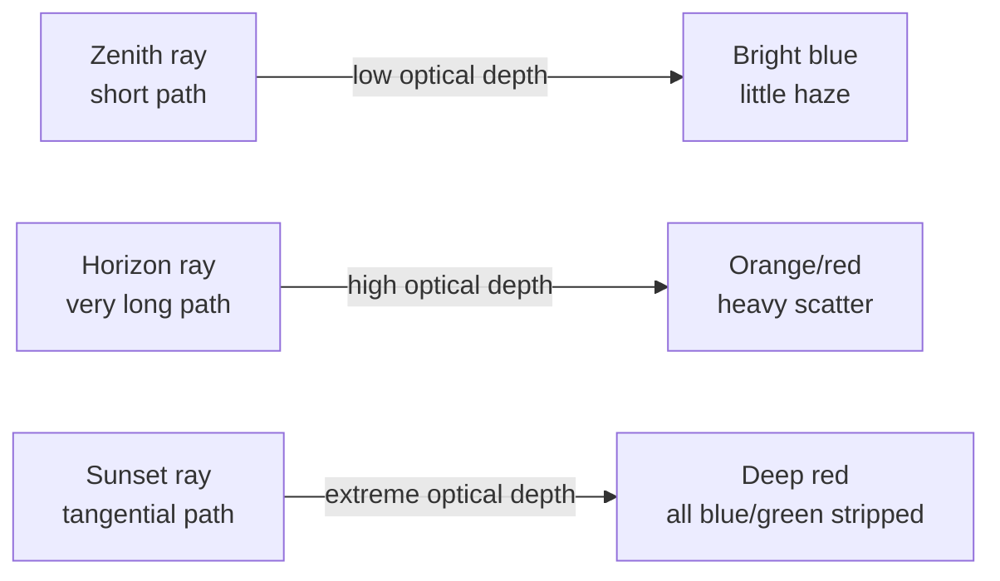
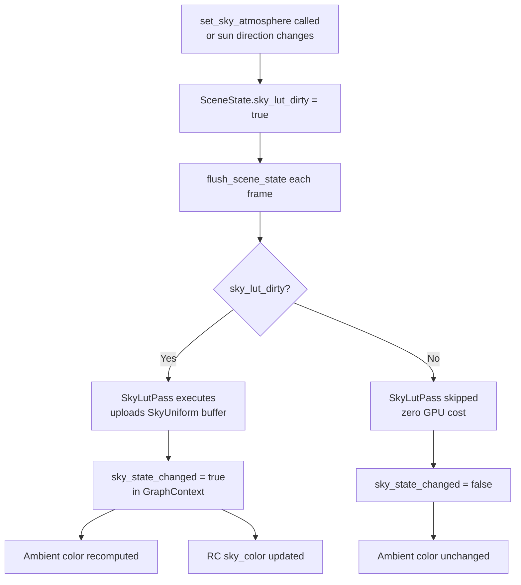
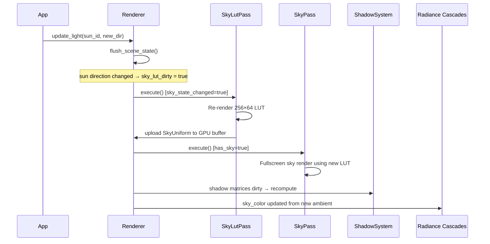
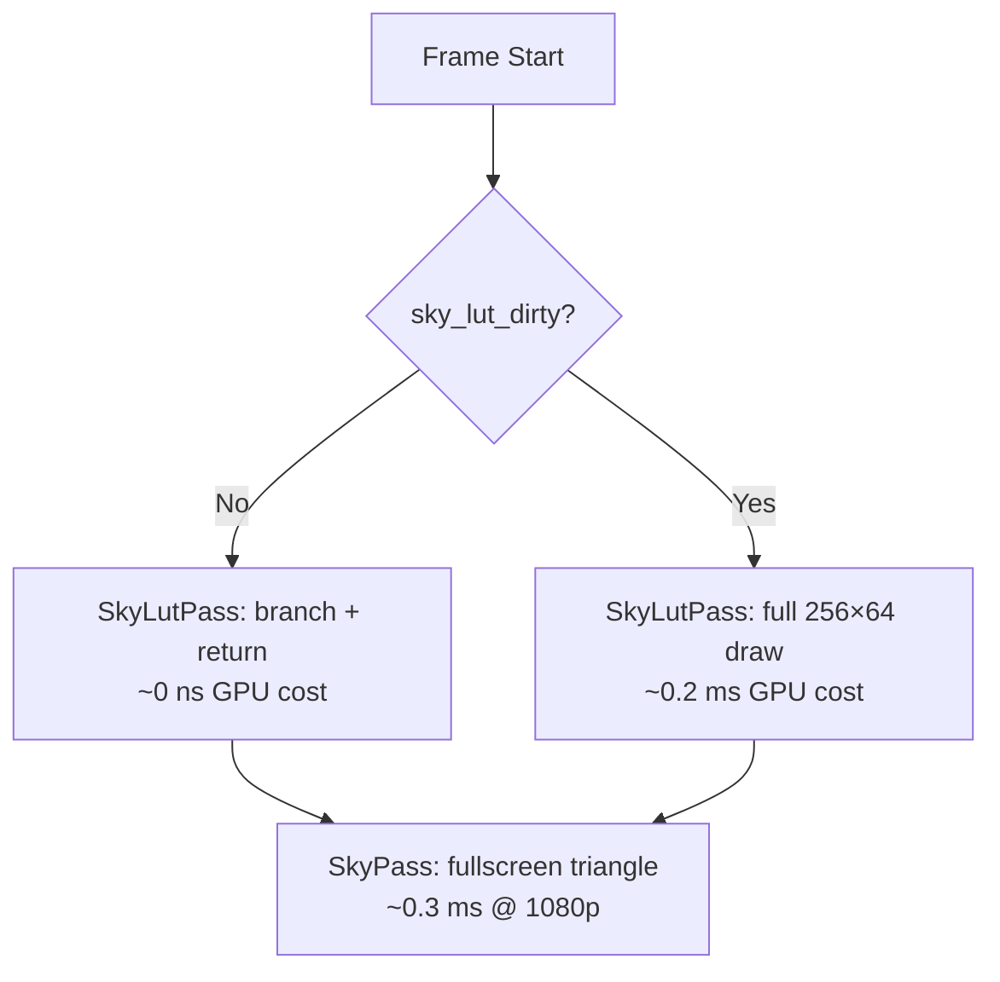

# Sky and Atmosphere

Helio's sky system is built around real atmospheric physics rather than artist-painted cubemaps or gradient hacks. Every pixel of the sky is computed from the same equations that govern how actual sunlight scatters through Earth's atmosphere — Rayleigh scattering from air molecules and Mie scattering from aerosol particles. The result is a sky that naturally transitions from deep blue at noon to rich orange and red at sunset, produces a physically correct sun disc, and drives scene lighting through a skylight system that extracts ambient color straight from the atmosphere simulation.

This page covers every layer of the system: the physics principles, all configurable parameters, the LUT-based rendering architecture, volumetric clouds, dynamic time-of-day, and how the sky feeds into Radiance Cascades.

<!-- screenshot: full daytime sky with scattered blue overhead and warm horizon, sun disc visible -->

---

## Physical Atmospheric Scattering

When sunlight travels through Earth's atmosphere it collides with two distinct populations of particles. Understanding the difference between them explains almost everything you see in the sky.

### Rayleigh Scattering — Why the Sky is Blue

Rayleigh scattering occurs when light interacts with particles much smaller than its wavelength — primarily nitrogen and oxygen molecules. The scattering cross-section follows an inverse-fourth-power relationship with wavelength: short (blue) wavelengths scatter roughly ten times more strongly than long (red) wavelengths. When you look anywhere except directly at the sun, you are seeing sunlight that has been redirected toward you by these molecules. Because blue dominates the redirected light, the sky appears blue.

The same physics explains sunsets. When the sun is near the horizon, sunlight must travel through a far greater thickness of atmosphere before reaching your eyes. The additional path length scatters away most of the blue and green light, leaving only the red and orange wavelengths to complete the journey.

Rayleigh scattering has an angular distribution described by the **Rayleigh phase function**:

$$P_R(\theta) = \frac{3}{16\pi}\left(1 + \cos^2\theta\right)$$

Here $\theta$ is the angle between the incoming and outgoing light directions. The $(1+\cos^2\theta)$ factor means Rayleigh scattering is stronger forward (towards viewer) and backward (away from viewer), and weakest at 90°. This is why the sky appears bright near the sun and also behind you. The $3/16\pi$ normalises the function so it integrates to 1 over the sphere.

The wavelength-dependent scattering coefficient $\beta_R(\lambda)$ scales this phase function according to an exponential density profile:

$$\beta_R(\lambda, h) = \beta_R(\lambda, 0) \cdot e^{-h/H_R}$$

where $h$ is altitude, $H_R \approx 8$ km is the Rayleigh scale height, and $\beta_R(\lambda,0) = [5.8\times10^{-3},\; 13.5\times10^{-3},\; 33.1\times10^{-3}]$ km$^{-1}$ for R/G/B. The $\lambda^{-4}$ dependence of Rayleigh scattering is baked into these RGB coefficients — blue ($\approx450$ nm) is scattered $\approx5.7\times$ more than red ($\approx700$ nm).

This produces a mostly isotropic distribution with a slight forward and backward preference — there is no strong "glow" around the sun from Rayleigh alone.

### Mie Scattering — Haze, Fog, and Sun Glow

Mie scattering involves particles comparable to or larger than the wavelength of light: dust, smoke, pollen, water droplets, and aerosols. Unlike Rayleigh, Mie scattering is nearly wavelength-independent (which is why clouds and fog look white) but extremely anisotropic — it is concentrated strongly in the forward direction. This anisotropy is the source of the bright glow around the sun.

The angular distribution is described by the **Henyey-Greenstein phase function**:

$$P_{HG}(\theta, g) = \frac{1 - g^2}{4\pi\left(1 + g^2 - 2g\cos\theta\right)^{3/2}}$$

The asymmetry parameter $g \in (-1, 1)$ controls the forward/backward balance:
- $g = 0$: isotropic (equal in all directions)
- $g > 0$: forward-scattering (aerosols, fog — bright halo around sun)
- $g < 0$: backward-scattering (rare)
- $g \approx 0.76$: typical hazy atmosphere (Helio default `mie_g`)
- $g \approx 0.85$–$0.95$: strong forward-scattering (dense fog)

The `g` parameter (the asymmetry factor) ranges from -1 (full back-scatter) through 0 (isotropic) to +1 (full forward-scatter). In a clear Earth atmosphere, aerosols typically produce `g ≈ 0.76`, which concentrates most of the scattered energy within a roughly 30° cone around the sun direction.

Mie scattering from large particles (dust, water droplets) is much stronger than Rayleigh but roughly wavelength-independent — that is why clouds and fog look white.

```rust
// Helio SkyAtmosphere defaults:
// mie_g = 0.76   — moderate forward scattering
// Mie coefficient: βM ≈ 2.1e-3 km⁻¹ (grey, wavelength-independent)
pub struct SkyAtmosphere {
    pub mie_g: f32,       // asymmetry factor, typically 0.76
    pub mie_scatter: f32, // Mie scattering coefficient (wavelength-independent)
    // ...
}
```

### How These Combine

Helio evaluates both scattering types along rays cast through the atmosphere using the Nishita single-scatter model. The total in-scattered luminance toward the camera is the integral of contributions from every point along the ray, weighted by extinction (how much light has been absorbed or scattered out along both the inbound solar path and the outbound camera path).

$$L(\mathbf{d}) = \int_0^{t_{\max}} T(\text{cam} \to s) \cdot \left[ \beta_R(h_s)\, P_R(\theta) + \beta_M(h_s)\, P_{HG}(\theta, g) \right] \cdot T(\text{sun} \to s) \cdot E_{\text{sun}} \; ds$$

- $T(\text{cam} \to s)$: transmittance from camera to sample point $s$ — how much scatter along the view ray attenuates the contribution
- $\beta_R P_R + \beta_M P_{HG}$: combined in-scatter at the sample point (Rayleigh + Mie)
- $T(\text{sun} \to s)$: transmittance from the sun to $s$ — how much sunlight is attenuated before reaching $s$
- $E_{\text{sun}}$: solar irradiance at top of atmosphere

Where `T_sun(x)` is the transmittance from the sun to point `x`, `T_cam(x)` is the transmittance from `x` to the camera, `β_R` and `β_M` are the Rayleigh and Mie scattering coefficients, and `s` is distance along the ray. Computing this integral for every sky pixel every frame would be prohibitively expensive; Helio uses a look-up table to amortize the cost.

### Transmittance and Optical Depth

A subtle but important quantity in the integration is **optical depth** — the accumulated extinction along a path. The optical depth $\tau$ and transmittance $T$ from point A to B are:

$$\tau(A \to B) = \int_A^B \left(\beta_R(h(s)) + \beta_M(h(s))\right) ds$$

$$T(A \to B) = e^{-\tau(A \to B)}$$

$\tau$ is the total amount of scattering/absorption along the ray — the atmosphere is transparent when $\tau = 0$ and optically thick when $\tau \gg 1$ (heavy fog at sunrise). $T$ is the fraction of light that survives the journey without being scattered away.

Both Rayleigh and Mie coefficients decay exponentially with altitude:

$$\beta(h) = \beta_0 \cdot e^{-h/H}$$

where $H$ is the scale height ($H_R \approx 8$ km for Rayleigh, $H_M \approx 1.2$ km for Mie).

Where `β_R(h)` and `β_M(h)` are the scattering coefficients at altitude `h`, following exponential density profiles controlled by `rayleigh_h_scale` and `mie_h_scale` respectively. A ray traveling nearly horizontally near the horizon accumulates far more optical depth than a vertical ray, which is why both Rayleigh (blue sky) and Mie (sun glow) are most intense near the horizon and at sunset.

The extinction produces the distinctly darker zenith in hazy conditions: even with a high `mie_scatter`, the shorter vertical optical path to the zenith means less haze is visible overhead than at the horizon.



---

## The `SkyAtmosphere` Struct

All atmosphere parameters live in a single `SkyAtmosphere` value. The renderer accepts it through `set_sky_atmosphere` and stores it in `SceneState`. Here is the full struct with every field annotated:

```rust
pub struct SkyAtmosphere {
    // Rayleigh (air molecules → blue sky)
    pub rayleigh_scatter: [f32; 3],  // per-wavelength coefficients (R/G/B) km⁻¹
                                     // default = Earth: [5.8e-3, 13.5e-3, 33.1e-3]
    pub rayleigh_h_scale: f32,       // scale height (normalized to atm thickness); default 0.08

    // Mie (aerosols/haze → sun glow)
    pub mie_scatter: f32,            // default 2.1e-3
    pub mie_h_scale: f32,            // scale height; default 0.012
    pub mie_g: f32,                  // Henyey-Greenstein asymmetry -1..1; default 0.76 (forward)

    // Sun disc
    pub sun_intensity: f32,          // default 22.0
    pub sun_disk_angle: f32,         // angular size radians; default 0.0045 ≈ real Sun

    // Planetary geometry
    pub earth_radius: f32,           // km; default 6360.0
    pub atm_radius: f32,             // km; default 6420.0

    // Post-processing
    pub exposure: f32,               // sky tone mapping; default 4.0

    // Clouds
    pub clouds: Option<VolumetricClouds>,
}
```

### Rayleigh Scattering Coefficients

`rayleigh_scatter` is a three-component vector giving the per-wavelength scattering coefficient in units of km⁻¹, one entry for each of the red, green, and blue channels. The Earth defaults — `[5.8e-3, 13.5e-3, 33.1e-3]` — encode the wavelength-to-the-minus-fourth relationship: the blue coefficient is approximately 5.7× the red coefficient, which is why the sky strongly favors blue. Increasing all three components uniformly makes the atmosphere denser and produces a deeper blue at the same sun angle. Deliberately biasing toward red/green (for example, `[33.1e-3, 13.5e-3, 5.8e-3]`) flips the scattering, yielding an orange-heavy alien sky.

The $\lambda^{-4}$ law is baked directly into the Earth default coefficients:

$$\beta_R(\lambda) \propto \frac{1}{\lambda^4}$$

| Channel | $\lambda$ (nm) | $\beta$ (km⁻¹) | Relative |
|---------|---------------|----------------|----------|
| R | ~700 | $5.8\times10^{-3}$ | 1.0× |
| G | ~550 | $13.5\times10^{-3}$ | 2.3× |
| B | ~450 | $33.1\times10^{-3}$ | 5.7× |

The ratio $33.1 / 5.8 \approx 5.7$ matches $(700/450)^4 \approx 5.8$ — confirming the $\lambda^{-4}$ law.

`rayleigh_h_scale` is the normalized scale height for the Rayleigh density profile — the altitude (expressed as a fraction of the atmosphere thickness) at which the density has fallen to 1/e of its sea-level value. The default of 0.08 corresponds to Earth's approximately 8 km scale height over a 60 km thick atmosphere. Increasing this value distributes molecules higher into the atmosphere and reduces the saturation of the blue sky.

### Mie Scattering Parameters

`mie_scatter` controls how strongly aerosols scatter light. The default of `2.1e-3` km⁻¹ models a moderately hazy day. Doubling this produces a thick haze; reducing it toward zero clears the sun glow and makes the sky feel sterile and high-altitude.

`mie_h_scale` is the Mie density scale height. Aerosols are concentrated in the lower atmosphere (default 0.012, roughly 1.2 km equivalent) far more tightly than air molecules. Raising this value spreads the haze higher, which can simulate industrial smog or volcanic aerosols.

`mie_g` is the Henyey-Greenstein asymmetry parameter. This is one of the most visually sensitive controls in the entire system. The default of 0.76 produces a realistic, prominent sun glow. Here is a summary of the visual effect across its range:

| `mie_g` value | Visual result |
|---------------|---------------|
| `0.0` | Isotropic — haze glows equally in all directions, no sun focus |
| `0.5` | Mild forward scatter — soft warm halo around sun |
| `0.76` (default) | Clear-day Earth — visible glow within ~30° of sun |
| `0.90` | Very clean air or high altitude — tight, bright sun corona |
| `0.95+` | Artistic/alien — almost spotlight-like sun glow |
| `-0.5` | Back-scatter dominated — glow behind the camera, eerie |

> [!TIP]
> For underwater or glass-dome scenes, try `mie_g` values around `0.5` combined with elevated `mie_scatter`. For a sterile space-station exterior atmosphere, set `mie_scatter` near zero and rely purely on Rayleigh.

### Sun Disc Parameters

`sun_intensity` controls the raw luminance of the sun disc itself (separate from the scattered sky brightness). The default of 22.0 is calibrated to look physically plausible against the default `exposure` of 4.0. Reducing it makes the sun appear less blinding; useful for stylized scenes or overcast conditions where the sun disc should be visible but not dominating.

`sun_disk_angle` is the sun's angular diameter in radians. The real Sun subtends approximately 0.009 radians (half-degree radius), and the default of 0.0045 is the radius component. The sun disc is rendered when the dot product of the view direction and sun direction exceeds the cosine threshold:

$$\text{sun\_half\_angle} = 0.265° = 4.6\times10^{-3} \text{ rad}$$

$$\cos\theta_{\text{threshold}} = \cos(0.265°) \approx 0.9999894$$

Increasing this produces a larger, more fantastical sun. Setting it to 0 disables the disc entirely while preserving all scattering.

### Planetary Geometry

`earth_radius` and `atm_radius` define the two spheres of the planetary model. The camera is assumed to sit on the surface of the planet of radius `earth_radius`, and rays are traced until they exit (or fail to intersect) the atmosphere sphere of radius `atm_radius`. The difference — 60 km by default — is the total atmospheric thickness.

Changing `earth_radius` alone does not produce dramatic visual changes unless you also adjust the scale heights. The interesting use case is building non-Earth planets. A planet with half the atmospheric thickness (`atm_radius = earth_radius + 30.0`) and inverted Rayleigh coefficients produces a convincing alien world.

> [!NOTE]
> All distances in `SkyAtmosphere` are in kilometres. They do not directly correspond to world-space units — they define the geometry of the atmosphere simulation only. Your actual scene can be in any unit system.

### Exposure

`exposure` is a multiplier applied to the final sky color before output. It functions as the tone-mapping scale for the sky layer specifically. At `4.0` (default) the pre-multiplied HDR sky values compress into a pleasingly bright but not blown-out LDR result. Scenes with a very bright `sun_intensity` may need a lower exposure to avoid a washed-out sky.

---

## Building Atmosphere Values

The builder methods let you compose an atmosphere incrementally without needing to know all fields:

```rust
use helio::scene::{SkyAtmosphere, VolumetricClouds};

// Earth-like daytime sky
let sky = SkyAtmosphere::new()
    .with_sun_intensity(22.0)
    .with_exposure(4.0)
    .with_mie_g(0.76);

renderer.set_sky_atmosphere(Some(sky));
```

For an alien planet with a reddish atmosphere and a smaller, hotter-looking sun:

```rust
let alien_sky = SkyAtmosphere {
    rayleigh_scatter: [33.1e-3, 13.5e-3, 5.8e-3],  // reversed — red/orange sky
    rayleigh_h_scale: 0.12,                           // taller atmosphere
    mie_scatter: 4.0e-3,                              // heavier haze
    mie_h_scale: 0.02,
    mie_g: 0.60,
    sun_intensity: 18.0,
    sun_disk_angle: 0.003,                            // smaller sun
    earth_radius: 5200.0,
    atm_radius: 5270.0,
    exposure: 3.5,
    clouds: None,
};

renderer.set_sky_atmosphere(Some(alien_sky));
```

> [!WARNING]
> Setting `atm_radius <= earth_radius` will cause undefined behavior in the ray-sphere intersection math. Always ensure `atm_radius > earth_radius` by at least a few km.

---

## Default Earth Values and What Changing Them Produces

The Earth defaults embedded in `SkyAtmosphere::new()` are carefully calibrated to match measured atmospheric properties. Understanding the effect of each parameter on visual output makes it straightforward to design non-Earth atmospheres.

### Rayleigh Coefficient Experiments

The ratio between the three `rayleigh_scatter` channels determines the dominant sky color. The Earth values encode a roughly `1 : 2.3 : 5.7` red-to-green-to-blue ratio. Some useful variations:

| Configuration | `rayleigh_scatter` | Visual Result |
|---|---|---|
| Earth default | `[5.8e-3, 13.5e-3, 33.1e-3]` | Deep blue zenith, yellow/orange horizon |
| Mars-like (thin CO₂) | `[2.0e-3, 2.2e-3, 2.5e-3]` | Salmon pink, very little scattering |
| Dense violet world | `[5.8e-3, 33.1e-3, 33.1e-3]` | Green-blue teal sky, unusual sunsets |
| Reverse (red sky) | `[33.1e-3, 13.5e-3, 5.8e-3]` | Rust-orange sky, blue sunsets |
| Very dense atm. | `[17.4e-3, 40.5e-3, 99.3e-3]` | Extremely deep blue, white horizon |

### Scale Height Experiments

`rayleigh_h_scale` controls how quickly Rayleigh density falls off with altitude. With the default of `0.08`, molecules are heavily concentrated near the ground. At `0.20`, they are distributed much higher — the sky becomes paler and less saturated at the zenith, and the horizon gradient is softer. At `0.03`, the atmosphere is extremely bottom-heavy, producing a vivid saturated zenith but a sharp and abrupt horizon band.

`mie_h_scale` similarly controls the aerosol altitude distribution. The default of `0.012` places most haze at low altitude. Raising it to `0.05` simulates a volcanic or heavily polluted atmosphere where particulates have been lofted high, extending the sun glow across a much wider angle.

### Alien Planet Construction Pattern

A methodical approach for non-Earth atmospheres:

```rust
// Step 1: decide atmosphere thickness (atm_radius - earth_radius)
// A thin atmosphere (20 km) produces sharp horizon, weak scattering
// A thick atmosphere (120 km) produces soft gradients, heavy scattering

// Step 2: pick your sky color via rayleigh ratios
// Red sky: invert R and B channels
// White sky: equal coefficients, high density

// Step 3: adjust haze character via mie_g
// Forward-scattering aerosols (mie_g > 0.7): bright sun glow
// Neutral aerosols (mie_g ~ 0): foggy, uniform brightness

// Step 4: set exposure to keep output in displayable range
// Higher rayleigh density often needs lower exposure (e.g., 2.0 instead of 4.0)

let titan_like = SkyAtmosphere {
    rayleigh_scatter: [8.0e-3, 6.5e-3, 4.0e-3], // orange haze
    rayleigh_h_scale: 0.18,                        // tall atmosphere
    mie_scatter: 8.0e-3,                           // thick organic haze
    mie_h_scale: 0.08,
    mie_g: 0.45,                                   // diffuse scatter
    sun_intensity: 12.0,                           // dimmer sun (farther star)
    sun_disk_angle: 0.002,                         // smaller apparent sun
    earth_radius: 2576.0,                          // Titan radius
    atm_radius: 2776.0,                            // 200km thick atmosphere
    exposure: 2.5,
    clouds: None,
};
```

> [!TIP]
> When exploring exotic atmosphere parameters, start by adjusting one variable at a time and re-rendering at a fixed noon sun direction. This isolates the effect of each parameter before combining them.

---

## The LUT Approach

### Why a Look-Up Table?

Evaluating the full Nishita scattering integral naively — raymarching through the atmosphere with multiple scattering steps per sample — can cost several milliseconds per frame on a full-resolution sky. Helio avoids this by pre-integrating the scattering into a 2D look-up texture, reusing this texture every frame, and only regenerating it when the atmosphere parameters or sun direction actually change.

The LUT encodes sky luminance as a function of two parameters:

- **U axis (256 texels):** the cosine of the sun's angle from the zenith, $\cos\theta_{\text{sun}} \in [-1, 1]$, remapped to $[0, 1]$
- **V axis (64 texels):** the sine of the view ray's elevation above the horizon, $\sin\theta_{\text{view}} \in [0, 1]$

Because the atmosphere is rotationally symmetric around the sun direction, these two parameters fully describe any sky pixel. At render time, the sky shader simply reconstructs the view ray from the inverse view-projection matrix, computes its angle relative to the sun, and looks up the pre-integrated luminance. The entire sky renders as a single full-screen pass with no raymarching — just a texture sample and a few phase-function evaluations.

```wgsl
fn sky_lut_uv(sun_dir: vec3<f32>, view_dir: vec3<f32>) -> vec2<f32> {
    let cos_sun_zenith = dot(sun_dir, vec3<f32>(0.0, 1.0, 0.0));
    let sin_view_elev  = view_dir.y; // 0 = horizon, 1 = straight up
    return vec2<f32>(
        cos_sun_zenith * 0.5 + 0.5, // remap [-1,1] → [0,1]
        sin_view_elev,               // already [0,1] for sky hemisphere
    );
}
```

```
LUT dimensions:  256 × 64
LUT format:      Rgba16Float   (HDR; R/G/B = luminance, A = transmittance)
```

The 16-bit float format preserves the HDR range needed for the sun disc without banding in the dark zenith regions.

### `SkyLutPass`

`SkyLutPass` is responsible for computing and updating the LUT texture:

```rust
pub struct SkyLutPass {
    pipeline: Arc<wgpu::RenderPipeline>,
    bind_group: Arc<wgpu::BindGroup>,
}

impl RenderPass for SkyLutPass {
    fn name(&self) -> &str { "sky_lut" }

    fn declare_resources(&self, builder: &mut PassResourceBuilder) {
        builder.write(ResourceHandle::named("sky_lut_output"));
    }

    fn execute(&mut self, ctx: &mut PassContext) -> Result<()> {
        if !ctx.sky_state_changed { return Ok(()); }
        // Full-screen draw into LUT texture
        // Uses SkyUniform buffer: atmosphere params + sun direction/intensity/color
    }
}
```

The critical line is `if !ctx.sky_state_changed { return Ok(()); }`. On any frame where neither the atmosphere parameters nor the sun direction have changed, the entire LUT pass is skipped — zero GPU work. This means that for static scenes, the LUT is generated exactly once at startup and never touched again. For animated time-of-day, it regenerates on every frame that actually changes the sun direction, but a single 256×64 fullscreen pass is cheap enough that it is invisible in frame time.

The `sky_lut_dirty` flag on `SceneState` drives `sky_state_changed`:

- It is set to `true` on the very first frame (initial LUT generation)
- It is set to `true` whenever `set_sky_atmosphere` is called with new parameters
- It is set to `true` when the sun direction changes (detected in `flush_scene_state` by comparing against `cached_sun_direction`)
- It is cleared after the LUT has been rendered

---

## The `SkyPass`

`SkyPass` is the full-screen pass that renders the sky into the color buffer using the pre-computed LUT:

```rust
pub struct SkyPass {
    pipeline: Arc<wgpu::RenderPipeline>,
    sky_bind_group: Arc<wgpu::BindGroup>,  // carries SkyUniform
}

impl RenderPass for SkyPass {
    fn name(&self) -> &str { "sky" }

    fn declare_resources(&self, builder: &mut PassResourceBuilder) {
        builder.write(ResourceHandle::named("sky_layer"));
    }

    fn execute(&mut self, ctx: &mut PassContext) -> Result<()> {
        if !ctx.has_sky { return Ok(()); }
        // LoadOp::Clear(BLACK) on color attachment
        // No depth_stencil_attachment
        // Full-screen triangle; reconstructs world ray dirs from view_proj_inv
    }
}
```

### Full-Screen Triangle Technique

The sky shader uses a single full-screen triangle (not a quad). The vertex shader generates clip-space positions directly from the vertex index using a simple formula:

```glsl
// Vertex positions for a single triangle covering clip space
// VertexIndex 0: (-1, -1), 1: (3, -1), 2: (-1, 3)
let uv = vec2(f32((vertex_index << 1u) & 2u), f32(vertex_index & 2u));
let pos = vec4(uv * 2.0 - 1.0, 0.0, 1.0);
```

This avoids allocating a vertex buffer entirely. The fragment shader receives the clip-space coordinate, transforms it through `view_proj_inv` to recover the world-space ray direction, and uses that direction to index into the LUT.

### No Depth Attachment

`SkyPass` has no `depth_stencil_attachment`. This is intentional — the sky should sit behind all scene geometry, but attaching a depth buffer would require either a separate clear or careful coordination with the geometry passes. Instead, the sky renders at infinite depth conceptually: geometry passes use `LoadOp::Load` on color and write their own depth, so they naturally overwrite whatever the sky painted.

### Sky as the Clear Color

Because `SkyPass` uses `LoadOp::Clear(BLACK)` on its color attachment and subsequent passes use `LoadOp::Load`, the sky pixels that are never overwritten by geometry remain exactly as the sky shader painted them. The sky literally serves as the background clear operation. This means there is no separate `wgpu::Color` clear step needed — the sky IS the clear, which avoids a redundant pass over the frame buffer.

> [!IMPORTANT]
> If you configure no `SkyAtmosphere` and no `sky_color`, the background will be pure black. Always call either `set_sky_atmosphere(Some(...))` or `set_sky_color([r, g, b])` to set an intentional background.

---

## `ctx.has_sky` and `ctx.sky_state_changed`

Two flags on `GraphContext` control the sky system's behavior:

**`has_sky`** is `true` when a `SkyAtmosphere` has been set via `set_sky_atmosphere(Some(...))`. When it is `false`, `SkyPass::execute` returns immediately without doing any GPU work, and the background color will be whatever `sky_color` was last set to via `set_sky_color`.

**`sky_state_changed`** is `true` on the first frame and on any frame where the LUT was regenerated. Both `SkyLutPass` (to decide whether to re-render) and downstream systems (e.g., ambient color composition) read this flag.

The flow of dirty-flag propagation looks like this:



---

## The Sun Disc

The sun disc is rendered directly in the sky shader rather than as a separate mesh or billboard. The shader computes the angle between the view ray and the sun direction; when this angle is less than `sun_disk_angle`, it contributes the disc luminance. The disc is additionally tinted by the Mie transmittance along the view ray, which automatically produces the warm reddish-orange sun color near the horizon without any additional configuration.

```
// Pseudocode in sky shader (WGSL)
let cos_angle = dot(ray_dir, sun_dir);
let disc_mask = step(cos(sun_disk_angle), cos_angle);
let disc_color = sun_color * sun_intensity * disc_mask;
let sky_color = rayleigh_mie_scatter + disc_color;
```

`sun_disk_angle` defaults to 0.0045 radians — the angular radius of the real Sun as seen from Earth (approximately 0.53° diameter, 0.0093 rad, so radius 0.0045). This produces a disc that is physically small but distinctly visible.

> [!NOTE]
> The sun disc is not a light source in the traditional sense — it does not cast shadows directly. Sun lighting comes from the `SceneLight` directional light. The disc is purely visual; its direction is synchronized with the directional light direction through the `update_light` call in the time-of-day pattern.

---

## Dynamic Time-of-Day

Time-of-day animation works by rotating the sun direction each frame and updating the directional light to match. The sky system responds automatically to the new direction through the `sky_lut_dirty` mechanism.

The canonical pattern from the sky example:

```rust
// Each frame (driven by Q/E key input in the example):
sun_angle += delta; // radians, increases over the day

let dir = Vec3::new(
    sun_angle.cos() * 0.4,
    -(sun_angle.sin().abs()) - 0.1,
    0.4,
).normalize();

renderer.update_light(
    sun_id,
    SceneLight::directional(dir.into(), [1.0, 0.95, 0.8], 3.0),
);
```

The Y component uses `sin().abs()` with a negative sign, ensuring the sun always stays below the horizon plane so the vertical arc feels like a day cycle rather than a vertical oscillation. The `-0.1` offset nudges the sun below the true horizon at dawn/dusk to extend the twilight period.

When `update_light` is called with a new direction, the renderer detects the change in `flush_scene_state` by comparing the new sun direction against `cached_sun_direction`. A change triggers all of:



The critical point is that the application only needs to call `update_light`. All downstream updates — the sky LUT, shadows, and ambient — propagate automatically through the dirty-flag system.

> [!TIP]
> For smooth time-of-day transitions, keep your sun angle delta below about 0.02 radians per second (roughly one full day in 5 minutes of real time). Very fast transitions are fine visually, but each frame with a changed sun direction costs a full LUT regeneration.

---

## Volumetric Clouds

Helio's cloud system is designed to be visually rich while maintaining near-zero additional GPU cost. All cloud rendering happens inside the sky fullscreen pass — there is no separate volume render pass, no ray-marching through a 3D texture, and no compute dispatch.

### `VolumetricClouds` Fields

```rust
pub struct VolumetricClouds {
    pub coverage:       f32,       // 0=clear, 1=overcast; default 0.30
    pub density:        f32,       // opacity multiplier; default 0.7
    pub base_height:    f32,       // cloud layer bottom (world units); default 800.0
    pub top_height:     f32,       // cloud layer top (world units);  default 1800.0
    pub wind_speed:     f32,       // animation speed; default 0.08
    pub wind_direction: [f32; 2],  // XZ direction; default [1.0, 0.0]
}
```

**`coverage`** scales how much of the sky is covered by clouds. At `0.0` the sky is clear. At `1.0` it is fully overcast, leaving only indirect ambient light from above. Values around `0.3–0.5` produce a natural partly-cloudy look.

**`density`** is a multiplier on the computed cloud opacity. Even a fully opaque cloud (`coverage = 1.0`) can appear translucent if `density` is low. This lets you create wispy, thin cirrus-style clouds (`density ≈ 0.2`) versus thick cumulonimbus (`density ≈ 1.0`).

**`base_height` and `top_height`** define the vertical band occupied by the cloud layer. These are in world-space units (the same coordinate system as your scene geometry). The sky shader uses ray-plane intersection to find where the view ray enters and exits this height band.

**`wind_speed` and `wind_direction`** control the cloud animation. The wind direction is a 2D XZ vector (Y is up, so wind is always horizontal). The noise offset is advanced by `wind_speed × time × wind_direction` each frame.

### Building Clouds

```rust
let clouds = VolumetricClouds::new()
    .with_coverage(0.45)
    .with_density(0.65)
    .with_layer(600.0, 1600.0)
    .with_wind([0.7, 0.7], 0.12);

let sky = SkyAtmosphere::new()
    .with_sun_intensity(20.0)
    .with_exposure(4.0)
    .with_clouds(clouds);

renderer.set_sky_atmosphere(Some(sky));
```

<!-- screenshot: partly cloudy sky with cumulus clouds catching warm sunset light -->

### The FBM Technique

Clouds shapes are generated using **Fractional Brownian Motion (FBM)** — a procedural noise technique that layers multiple octaves of smooth noise at increasingly fine frequencies, each contributing a fraction of the total amplitude:

```
fbm(p) = Σ(i=0..N) amplitude_i × noise(p × frequency_i)
       where amplitude_i = 0.5^i  and  frequency_i = 2^i
```

Each octave adds progressively finer detail on top of the coarser structure from lower octaves. The first few octaves define the large-scale billowing shape; higher octaves add whispy tendrils and turbulent edges. The FBM value is then remapped through a smoothstep function and multiplied by `coverage` to produce the final cloud density at each sky pixel.

The evaluation point `p` is the intersection of the view ray with the midplane of the cloud layer, offset by the wind-animated offset. This means the clouds exist on a flat plane in world space — they do not have volumetric thickness in the traditional sense. However, because the sky shader analytically integrates the cloud density across the ray's path through the height band, the resulting image has convincing depth variation.

### Analytical Sun Lighting

Rather than tracing shadow rays through the cloud volume, Helio uses an analytical approximation: the cloud's self-shadowing is estimated based on the cloud density at the current point and the sun's elevation angle. Clouds that are below the sun receive full illumination; clouds that are very dense effectively shadow their own base. The sun's current color (which includes the Mie/Rayleigh tint from the atmosphere) is applied to the illuminated cloud faces, and a soft ambient term fills the shadowed underside.

At sunset and sunrise, the `sun_elevation` drives a warm tint interpolation that turns cloud undersides deep orange and pink — the same atmospheric color that produces the sky's sunset colors is automatically used to light the clouds. This means you do not need to manually tweak cloud colors as the time of day changes; the coupling is automatic through the shared `SkyUniform.sun_color` value.

The lighting model for a cloud fragment at density `d` and sun-elevation `θ_sun`:

```
illuminated_face = sun_color * saturate(dot(cloud_normal, sun_dir)) * (1 - d * shadow_factor)
ambient_face     = sky_ambient * 0.4   // indirect from sky above
cloud_color      = mix(ambient_face, illuminated_face, d)
```

Where `shadow_factor` is derived from the FBM density integral along the sun direction within the cloud height band — a cheap single-sample approximation that gives plausible self-shadowing without raymarching.

### Near-Zero Cost

Because cloud rendering is entirely contained in the sky fragment shader and uses analytical noise rather than texture lookups into a 3D cloud texture, the marginal cost of enabling clouds is just the additional arithmetic per sky fragment. On modern GPUs, a typical 1080p frame runs `1920 × 1080 = ~2M fragments` through the sky shader, but many of these are immediately overdrawn by geometry. The effective cloud cost is proportional to how much visible sky remains after opaque geometry — for a scene with significant indoor or architectural coverage, this can be well under 1M fragments.

The FBM evaluation itself involves approximately 6 octaves of gradient noise, each requiring a handful of multiply-add operations. On a modern discrete GPU, the entire cloud FBM evaluation per fragment costs less than 0.05 ms at 1080p for a typical outdoor scene. Disabling clouds (`clouds: None`) reduces this to zero, but in practice the cost is low enough that it rarely warrants removal.

Compared to alternative cloud approaches:

| Technique | Memory | Extra Passes | Cost at 1080p |
|---|---|---|---|
| Helio FBM in sky pass | ~0 | 0 | ~0.05–0.15 ms |
| 3D noise texture + raymarching | 16–64 MB | 1–2 | 2–8 ms |
| Volumetric shadow + multiple scatter | 64+ MB | 3+ | 5–15 ms |
| Cubemap baked clouds | 6–24 MB | 0 (static only) | ~0 ms |

Helio's approach occupies an excellent point in this space for real-time scenes where fully volumetric clouds are not a hard requirement.

> [!NOTE]
> Clouds do not cast shadows on scene geometry in the current implementation. They are purely a sky-layer effect. Shadow map generation reads only from the `SceneLight` direction and scene meshes. If you need cloud shadows on terrain, you would need to project the FBM cloud density into the shadow map externally.

---

## Skylight — Atmosphere-Driven Ambient

The `Skylight` component connects the atmosphere simulation to the scene's ambient lighting. Rather than requiring you to manually tune an ambient color to match whatever the sky currently looks like, `Skylight` samples the atmosphere and derives the ambient contribution automatically.

```rust
pub struct Skylight {
    pub intensity: f32,          // multiplier on sky ambient; default 1.0
    pub color_tint: [f32; 3],    // tint over computed sky color; default [1,1,1]
}
```

**`intensity`** scales how strongly the sky contributes to ambient light. At `1.0`, the ambient contribution matches what you would expect from an open-sky environment. Setting it to `0.5` makes the sky contribute half as much — appropriate for partially enclosed or cave-adjacent scenes. Setting it to `0.0` disables sky ambient entirely while still rendering the sky visually.

**`color_tint`** applies a final tint over the sampled sky color. The default of `[1, 1, 1]` passes the sky color through unchanged. You can use this to stylistically shift the ambient without changing the sky itself — for example, a `[0.8, 0.9, 1.1]` tint pushes the ambient slightly cooler and more blue.

### Building a Skylight

```rust
let skylight = Skylight::new()
    .with_intensity(1.2)
    .with_tint([0.95, 0.97, 1.0]);

renderer.set_skylight(Some(skylight));
```

---

## Ambient Composition

The final scene ambient color is computed each frame in `flush_scene_state` as a combination of the base ambient and the skylight contribution:

```
scene_ambient_color = ambient_color * ambient_intensity + skylight_contribution
```

Where `skylight_contribution` is computed as:

```
sky_zenith_color = sample_sky_color_at_zenith(atmosphere, sun_dir)
skylight_contribution = sky_zenith_color * skylight.intensity * skylight.color_tint
```

The zenith sample is not a real-time ray evaluation — it uses the pre-computed LUT to look up the color at the zenith angle for the current sun direction. This is a single texture sample and a few multiplications, so it costs nothing meaningful per frame.

The resulting `scene_ambient_color` is uploaded into `GlobalsUniform.ambient_color` alongside `GlobalsUniform.ambient_intensity`. All shaders that compute ambient receive these values automatically through the globals binding.

```mermaid
flowchart LR
    A[Base ambient<br/>set_ambient&#40;color, intensity&#41;] --> E[+]
    B[SkyAtmosphere<br/>LUT zenith sample] --> C[×]
    D[Skylight.intensity<br/>× color_tint] --> C
    C --> E
    E --> F[GlobalsUniform<br/>.ambient_color]
    F --> G[All Shaders]
```



> [!TIP]
> For outdoor scenes, a `base ambient` near black with a `Skylight` at full intensity produces the most physically realistic result — the sky is the only ambient source, so shadowed areas receive sky-colored light. For indoor or mixed scenes, add a small non-zero base ambient to represent light bouncing from walls and floor.

---

## The `SkyUniform` Buffer

The bridge between the Rust `SkyAtmosphere` struct and the GPU shader is the `SkyUniform` buffer — a single `wgpu::Buffer` on `SceneState` that is written whenever `sky_lut_dirty` is true and read by both `SkyLutPass` and `SkyPass`.

The uniform contains the full set of atmosphere parameters plus the current sun direction and color resolved from the directional light:

```
SkyUniform {
    // Atmosphere
    rayleigh_scatter:  vec3<f32>   // R/G/B scattering coefficients
    rayleigh_h_scale:  f32
    mie_scatter:       f32
    mie_h_scale:       f32
    mie_g:             f32
    sun_intensity:     f32
    sun_disk_angle:    f32
    earth_radius:      f32
    atm_radius:        f32
    exposure:          f32

    // Resolved from SceneLight directional
    sun_direction:     vec3<f32>   // world-space, normalized, pointing toward sun
    sun_color:         vec3<f32>   // directional light color (tints both disc + scatter)

    // Cloud params (present even when clouds = None, just zero/inactive)
    cloud_coverage:    f32
    cloud_density:     f32
    cloud_base_height: f32
    cloud_top_height:  f32
    cloud_wind_offset: vec2<f32>   // pre-computed: wind_dir * wind_speed * time
}
```

Both `SkyLutPass` and `SkyPass` bind this buffer at the same slot. `SkyLutPass` uses it to compute the wavelength-integrated scattering for each UV cell. `SkyPass` uses it for the cloud parameters, sun disc threshold, exposure, and LUT sampling setup.

The `sun_color` field in the uniform comes from the `SceneLight::directional` call — it is the same color used to shade scene geometry. This coupling means the sun disc, sky scatter tint at sunrise/sunset, and the geometry directional light all derive from the same color source, keeping them consistent automatically.

---

## Interaction with Radiance Cascades

Helio's Radiance Cascades (RC) global illumination system uses a miss-ray color to shade rays that escape the scene without hitting any geometry. For a scene with a sky, this miss color should be the sky luminance — otherwise GI rays that exit through windows or open areas will contribute black light, darkening the indirect illumination unrealistically.

The sky feeds into RC through the `sky_color` value forwarded from `SceneState`:

```rust
// In renderer/mod.rs — per frame
// scene_sky_color: [f32;3] — forwarded to GraphContext each frame
// RC reads GraphContext.sky_color as the miss ray contribution
```

When `SkyAtmosphere` is configured, `scene_sky_color` is set to the atmosphere's current zenith/ambient color (updated whenever `sky_state_changed` is true). When no atmosphere is configured, `scene_sky_color` uses whatever was set through `set_sky_color`. This means that even a purely flat sky color will correctly drive RC ambient.

> [!IMPORTANT]
> If you are using Radiance Cascades for GI and have an outdoor scene, always configure either `SkyAtmosphere` or a reasonable `sky_color`. Without it, rays that exit through open areas contribute zero luminance to GI, producing unnaturally dark indirect lighting on surfaces facing outward.

---

## Scene Without Atmosphere

Not every scene needs physical atmospheric scattering. Helio provides a simpler fallback for cases where a plain background color is sufficient — interior scenes, space scenes, or stylized environments:

```rust
// Disable atmosphere entirely
renderer.set_sky_atmosphere(None);

// Set a flat background color instead
renderer.set_sky_color([0.05, 0.05, 0.12]); // dark navy background
```

When `set_sky_atmosphere(None)` is called, `ctx.has_sky` becomes `false` and `SkyPass::execute` returns without any GPU work. The background is instead handled by the regular color attachment clear with the value from `set_sky_color`. You can still set a `Skylight` — it will derive ambient from the flat `sky_color` rather than from atmosphere simulation.

For a pure black void (like a space scene):

```rust
renderer.set_sky_atmosphere(None);
renderer.set_sky_color([0.0, 0.0, 0.0]);
renderer.set_skylight(None);
renderer.set_ambient([0.02, 0.02, 0.03], 1.0); // tiny fill light
```

For a stylized flat-color sky (cartoon or low-poly aesthetic):

```rust
// A simple hand-tuned gradient isn't supported natively, but a flat color works well:
renderer.set_sky_atmosphere(None);
renderer.set_sky_color([0.4, 0.65, 0.9]);  // hand-picked sky blue
renderer.set_skylight(Some(Skylight::new().with_intensity(0.8)));
renderer.set_ambient([0.2, 0.25, 0.3], 1.0);
```

---

## Full API Reference

The four public setters on the renderer that drive the sky system:

```rust
// Set or remove the atmosphere simulation.
// Passing Some(...) enables SkyPass and starts LUT generation.
// Passing None disables SkyPass; sky_color is used as background.
pub fn set_sky_atmosphere(&mut self, atm: Option<SkyAtmosphere>)

// Set a Skylight to drive ambient from the sky.
// Passing None disables sky-driven ambient; base ambient still applies.
pub fn set_skylight(&mut self, skylight: Option<Skylight>)

// Set the flat background color used when no SkyAtmosphere is configured.
// Also used as the RC miss-ray color in no-atmosphere mode.
pub fn set_sky_color(&mut self, color: [f32; 3])

// Set the base ambient light (separate from skylight contribution).
// Final ambient = ambient_color * intensity + skylight_contribution.
pub fn set_ambient(&mut self, color: [f32; 3], intensity: f32)
```

These can be called at any time, including mid-frame between update and render. Changes take effect at the next `flush_scene_state` call, which runs at the start of the render pass sequence each frame.

All four setters are independent — you can change `set_skylight` without affecting the atmosphere, and vice versa. The ambient composition always uses whatever the most recently set values are at the time `flush_scene_state` runs.

> [!NOTE]
> Calling `set_sky_atmosphere(None)` does not reset `sky_color`. If you previously set a sky color via `set_sky_color`, that color persists as the flat background after removing the atmosphere. This is useful for transitions: fade the atmosphere parameters to a muted state, then switch to `set_sky_atmosphere(None)` with a matching flat color for a seamless visual cut.

---

## Performance Considerations

### LUT Caching

The dominant cost in the sky system is the `SkyLutPass` — generating the 256×64 HDR texture. On a modern discrete GPU this takes roughly 0.1–0.3 ms. On integrated graphics it may be closer to 0.5 ms. Since it only runs when `sky_lut_dirty` is true, a static scene pays this cost exactly once.

For dynamic time-of-day, the LUT regenerates every frame that moves the sun. If your day cycle moves the sun by a non-zero amount each frame, expect approximately 0.2 ms overhead per frame for LUT generation. This is typically acceptable for outdoor scenes where sky quality is a priority.

If you want to reduce LUT regeneration frequency for performance while still animating the sky, you can batch sun direction updates to every 2–3 frames. The human eye is not sensitive to sub-degree changes in sun position between consecutive frames, so skipping LUT regeneration on alternating frames is visually transparent on high-framerate displays.

### `sky_lut_dirty` Cost When Nothing Changes

When the sky is static, `SkyLutPass::execute` performs a single boolean check (`if !ctx.sky_state_changed`) and returns. The pipeline, bind group, and render pass are not touched. The cost is a single branch — effectively zero.



### Sky Pass Cost

`SkyPass` runs every frame when `has_sky` is true (regardless of whether the LUT changed). A full-screen triangle at 1080p with the sky shader — LUT sample, phase function evaluation, cloud FBM, tone mapping — runs approximately 0.3–0.6 ms depending on cloud settings and GPU. Disabling clouds saves roughly 0.1–0.2 ms by removing the FBM octave evaluation.

### Memory

The sky LUT texture uses `256 × 64 × 4 channels × 2 bytes (f16)` = 128 KB. The `SkyUniform` buffer is a few hundred bytes. Total sky system memory overhead is under 200 KB — negligible even on tightly memory-constrained platforms.

The `SkyPass` pipeline itself (shader + bind group layout) is compiled once at renderer initialization and kept alive for the lifetime of the renderer. There are no dynamic allocations during sky rendering.

> [!TIP]
> If you are targeting platforms with very limited GPU performance and your sky is static (no time-of-day), you can reduce `SKY_LUT_W` and `SKY_LUT_H` in the source to 128×32. The visual difference is nearly imperceptible for static suns, and the LUT generation cost halves. At 64×16, banding becomes visible in wide angle shots.

---

## Complete Example

The following is a minimal complete example of configuring an outdoor scene with physical atmosphere, clouds, skylight-driven ambient, and time-of-day animation:

```rust
use helio::{
    Renderer,
    scene::{SkyAtmosphere, VolumetricClouds, Skylight, SceneLight},
};

fn setup(renderer: &mut Renderer) {
    // Physical atmosphere (Earth-like defaults)
    let clouds = VolumetricClouds::new()
        .with_coverage(0.35)
        .with_density(0.7)
        .with_layer(800.0, 1800.0)
        .with_wind([0.8, 0.6], 0.08);

    let sky = SkyAtmosphere::new()
        .with_sun_intensity(22.0)
        .with_exposure(4.0)
        .with_mie_g(0.76)
        .with_clouds(clouds);

    renderer.set_sky_atmosphere(Some(sky));

    // Sky-driven ambient light
    let skylight = Skylight::new()
        .with_intensity(1.0)
        .with_tint([1.0, 1.0, 1.0]);

    renderer.set_skylight(Some(skylight));

    // Small fill ambient for shadowed areas
    renderer.set_ambient([0.03, 0.03, 0.04], 1.0);
}

fn update(renderer: &mut Renderer, sun_id: LightId, sun_angle: f32) {
    // Build sun direction from angle
    let dir = [
        sun_angle.cos() * 0.4,
        -(sun_angle.sin().abs()) - 0.1,
        0.4,
    ];
    let len = (dir[0]*dir[0] + dir[1]*dir[1] + dir[2]*dir[2]).sqrt();
    let dir_norm = [dir[0]/len, dir[1]/len, dir[2]/len];

    // Warm sun color that cools slightly at high elevations
    let warmth = 1.0 - (dir_norm[1] + 0.1).clamp(0.0, 1.0) * 0.3;
    let sun_color = [1.0, 0.95 * warmth + 0.05, 0.8 * warmth + 0.2];

    renderer.update_light(
        sun_id,
        SceneLight::directional(dir_norm, sun_color, 3.0),
    );
    // Sky LUT, shadows, and ambient all update automatically.
}
```

<!-- screenshot: example scene at golden hour with visible cloud layer, orange horizon, long shadows -->

---

## Common Patterns and Recipes

### Clear Midday

```rust
let sky = SkyAtmosphere::new(); // all defaults — Earth noon
renderer.set_sky_atmosphere(Some(sky));
renderer.set_skylight(Some(Skylight::new()));
renderer.set_ambient([0.02, 0.02, 0.03], 1.0);
```

### Overcast / Flat Light

Overcast conditions mean the sun is completely obscured. The sky should appear uniformly bright, and the directional light intensity should drop significantly:

```rust
let overcast_sky = SkyAtmosphere::new()
    .with_sun_intensity(5.0)     // sun barely visible through clouds
    .with_exposure(2.5)
    .with_clouds(
        VolumetricClouds::new()
            .with_coverage(0.95)
            .with_density(0.9)
    );

renderer.set_sky_atmosphere(Some(overcast_sky));

// Much softer directional — more like a fill light than a sun
renderer.update_light(sun_id, SceneLight::directional(dir, [0.9, 0.92, 1.0], 0.8));

// Higher ambient to compensate for diffuse cloud light
renderer.set_skylight(Some(Skylight::new().with_intensity(2.0)));
```

### Sunset

Sunset is achieved purely by lowering the sun direction (reducing its Y component toward the horizon). The atmosphere simulation automatically computes the correct color. You may want to slightly warm the directional light color manually to emphasize the golden hour feel:

```rust
// Sun just above horizon
let sunset_dir = [-0.6, -0.05, 0.8f32];
let len = (sunset_dir[0].powi(2) + sunset_dir[1].powi(2) + sunset_dir[2].powi(2)).sqrt();
let dir_norm = [sunset_dir[0]/len, sunset_dir[1]/len, sunset_dir[2]/len];

renderer.update_light(
    sun_id,
    SceneLight::directional(dir_norm, [1.0, 0.75, 0.45], 2.5),
);
// Sky LUT, ambient, and RC sky_color all update automatically
```

<!-- screenshot: sunset with orange and pink sky, clouds lit from below -->

### Stormy / Hazy Industrial

Heavy haze and muted colors suggest pollution or volcanic activity:

```rust
let hazy_sky = SkyAtmosphere {
    rayleigh_scatter: [5.8e-3, 13.5e-3, 33.1e-3],
    rayleigh_h_scale: 0.08,
    mie_scatter: 12.0e-3,          // 6× more aerosols than default
    mie_h_scale: 0.04,             // haze spread higher
    mie_g: 0.55,                   // broader sun glow
    sun_intensity: 14.0,
    sun_disk_angle: 0.006,         // sun appears larger through haze
    earth_radius: 6360.0,
    atm_radius: 6420.0,
    exposure: 3.0,
    clouds: Some(
        VolumetricClouds::new()
            .with_coverage(0.6)
            .with_density(0.5)
    ),
};
renderer.set_sky_atmosphere(Some(hazy_sky));
```

### Night Sky Fallback

Physical night rendering is not currently modeled — the atmosphere simulation assumes the sun is always the light source. For night scenes, disable the atmosphere and set a dark sky color:

```rust
renderer.set_sky_atmosphere(None);
renderer.set_sky_color([0.005, 0.005, 0.015]); // near-black deep blue
renderer.set_skylight(None);
renderer.set_ambient([0.01, 0.01, 0.025], 1.0); // moonlight fill
```

> [!NOTE]
> Future versions of Helio may add a moon disc and night-sky LUT. For now, night scenes rely on manually configured ambient and point/spot lights to simulate moonlight and artificial sources.

---

## Troubleshooting

### Sky Appears Black

The most common cause is that `set_sky_atmosphere` was not called, `has_sky` is `false`, and `set_sky_color` was never called either (defaulting to black). Verify:

```rust
// Check: is atmosphere set?
renderer.set_sky_atmosphere(Some(SkyAtmosphere::new()));
// Or set a flat color fallback:
renderer.set_sky_color([0.1, 0.15, 0.3]);
```

A second possibility is extreme `exposure` — if `exposure` is near zero, all sky colors tone-map to black. The default of `4.0` is safe.

### Sun Glow Too Dominant

If the sun glow bleeds across too much of the sky, `mie_scatter` is too high or `mie_g` is too close to 1.0. Try:

```rust
let sky = SkyAtmosphere::new()
    .with_mie_g(0.6)   // broader, less focused glow
    // and/or reduce mie_scatter in the struct directly
```

### Ambient Looks Wrong for Time of Day

If ambient lighting does not change when the sun moves, check that a `Skylight` is configured. Without one, sky ambient is not computed. Also verify that `set_skylight` is called _before_ the first render frame.

### Clouds Not Appearing

Verify that `VolumetricClouds` is attached to the `SkyAtmosphere` via `.with_clouds(...)`. Check that `coverage > 0.0` and `density > 0.0`. Ensure `base_height < top_height` — an inverted layer produces no intersections and no clouds.

---

## Summary

Helio's sky and atmosphere system provides a physically grounded rendering pipeline that handles everything from clear noon to dramatic sunsets without manual art direction. The key design decisions are:

- **Nishita single-scatter Rayleigh+Mie** provides physical correctness with a recognizable Earth default and full alien-planet customizability through `rayleigh_scatter`, `mie_scatter`, `mie_g`, and scale heights
- **256×64 HDR LUT** amortizes integration cost — frames with a static sun pay nothing for sky computation
- **Dirty-flag propagation** (`sky_lut_dirty → sky_state_changed`) ensures every downstream system (shadows, ambient, RC) updates exactly when needed and only when needed
- **Fullscreen triangle with no depth attachment** keeps the sky pass outside the depth pipeline, avoiding clear ordering problems and letting the sky serve as the implicit color buffer clear
- **FBM volumetric clouds in the sky pass** adds believable cloud coverage with no additional render passes, no 3D texture memory, and analytical sun lighting that responds to time-of-day automatically
- **`Skylight` + ambient composition** connects the atmosphere directly to GI, ensuring ambient colors match the sky automatically across the full day cycle without manual color tuning
- **RC miss-ray integration** via `sky_color` means GI rays exiting the scene contribute the correct sky luminance to indirect lighting, preventing the dark-border artefact common in naive GI implementations
