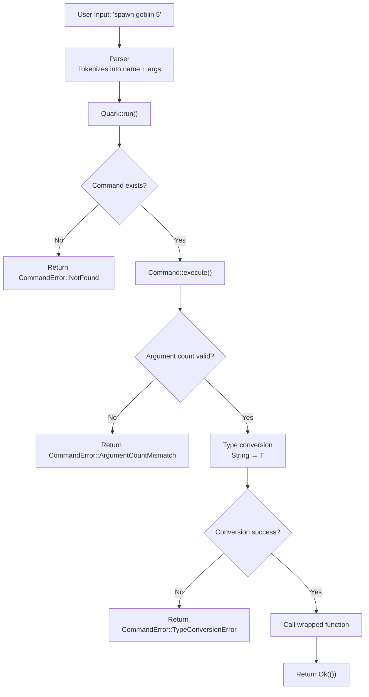

Quark is a **high-performance, type-safe command system** for the Pulsar game engine. It provides a zero-boilerplate way to register and execute commands with **compile-time argument type checking**, rich documentation metadata, and **full async/sync support** — all powered by ergonomic Rust macros.

The system is designed around three core principles:

1. **Type Safety at Compile Time** — Command arguments are strongly typed and validated by the compiler, not at runtime.
2. **Zero-Boilerplate Registration** — The `#[command]` macro generates all trait implementations automatically.
3. **Async-First Design** — Both synchronous and asynchronous commands work seamlessly through a unified interface.

Quark is used throughout Pulsar for console commands, debug tools, scripting interfaces, and developer utilities. It eliminates the error-prone pattern of manually parsing command strings and provides automatic help generation and argument validation.

---

## Architecture at a Glance

- **`Command` trait** — Core abstraction representing an executable command with metadata
  - `name()`, `syntax()`, `short()`, `docs()` — documentation accessors
  - `execute()` — synchronous execution path
  - `execute_async()` — asynchronous execution path (returns `Pin<Box<dyn Future>>`)
  - `is_async()` — runtime flag distinguishing sync vs async commands

- **`Quark` registry** — Central storage for all registered commands
  - `register_command()` — adds a command to the registry by name
  - `run()` — parses and executes synchronous commands
  - `run_async()` — parses and executes asynchronous commands
  - `list()` — returns all registered commands
  - `get_docs()` — retrieves documentation for a specific command

- **`#[command]` macro** — Procedural macro that generates `Command` trait implementations
  - Infers argument types from function signature
  - Generates parsing and type conversion logic
  - Wraps sync/async functions with proper execution paths
  - Captures documentation attributes as trait method implementations

- **Parser** — Tokenizes command strings and extracts arguments
  - Handles quoted strings with escape sequences
  - Splits on whitespace while preserving quoted regions
  - Returns `(command_name, Vec<String>)` tuple

---

## Execution Flow



The critical insight: **all type checking and conversion happens at the Command trait boundary**, not in user code. The macro-generated wrapper handles the string-to-type conversion using `FromStr`, producing compile-time guarantees that the function receives exactly the types it expects.

---

## Key Features

### 1. Compile-Time Type Safety

Traditional command systems use runtime string parsing with error-prone `split()` and `parse()` chains scattered throughout command handlers. Quark moves all type conversion into macro-generated code that's validated at compile time:

```rust
// Without Quark (error-prone, no compile-time checks)
fn handle_spawn(args: &str) {
    let parts: Vec<&str> = args.split_whitespace().collect();
    let entity = parts[0];  // Panics if args is empty
    let count: usize = parts[1].parse().expect("invalid number");  // Runtime error
    // ...
}

// With Quark (type-safe, validated by compiler)
#[command(
    name = "spawn",
    syntax = "spawn <entity> <count>",
    short = "Spawn entities into the world"
)]
fn spawn(entity: String, count: usize) {
    // Compiler guarantees entity is String, count is usize
    // No parsing, no panics, no runtime checks needed
}
```

If the user provides invalid input (e.g., `spawn goblin abc`), the registry returns a structured `CommandError::TypeConversionError` with the offending value and expected type — never a panic, never undefined behavior.

### 2. Macro-Powered Registration

The `#[command]` macro generates a zero-sized struct that implements the `Command` trait. This struct wraps the original function and handles all parsing, conversion, and execution:

```rust
#[command(
    name = "teleport",
    syntax = "teleport <x> <y> <z>",
    short = "Teleport the player",
    docs = "Example: teleport 10.5 20.0 5.3"
)]
fn teleport(x: f32, y: f32, z: f32) {
    println!("Teleporting to ({}, {}, {})", x, y, z);
}

// Macro generates:
// - struct TeleportCommand;
// - impl Command for TeleportCommand { ... }
// - Conversion from Vec<String> to (f32, f32, f32)
// - Error handling for wrong argument counts or invalid types
```

Registration is a single line:

```rust
let mut registry = Quark::new();
registry.register_command(TeleportCommand);
```

The original function remains callable directly — the macro doesn't replace it, just wraps it.

### 3. Async/Sync Unified Interface

Quark detects `async fn` commands at compile time and generates appropriate async wrappers:

```rust
#[command(
    name = "save",
    syntax = "save <filename>",
    short = "Save the current state"
)]
async fn save(filename: String) -> Result<(), std::io::Error> {
    tokio::fs::write(filename, "data").await?;
    Ok(())
}
```

The generated `Command` implementation sets `is_async() = true` and implements `execute_async()` to return a pinned future. The registry's `run_async()` method awaits the future:

```rust
registry.run_async("save world.dat").await?;
```

Synchronous commands implement `execute()` and can be called with `run()`. The `execute_async()` method has a default implementation that wraps the sync result in a ready future, so async callers can uniformly use `run_async()` for both sync and async commands.

### 4. Rich Documentation Metadata

Every command carries its documentation inline:

```rust
#[command(
    name = "help",
    syntax = "help [command]",
    short = "Display help information",
    docs = "With no arguments, lists all commands. \
            With a command name, shows detailed usage."
)]
fn help(registry: &Quark, command: Option<String>) {
    // ...
}
```

The registry exposes this metadata through `list()` and `get_docs()`:

```rust
for cmd in registry.list() {
    println!("{}: {}", cmd.name(), cmd.short());
}

if let Some(docs) = registry.get_docs("help") {
    println!("{}", docs);
}
```

This enables automatic generation of help menus, autocomplete suggestions, and interactive documentation without any manual string building.

---

## Performance Characteristics

### Registry Lookup

The `Quark` struct uses a `HashMap<String, Box<dyn Command>>` for O(1) average-case command lookup. The hash function is the default `std` hasher (SipHash-1-3), which provides cryptographic collision resistance at the cost of slightly higher hashing overhead than non-cryptographic alternatives like FxHash.

For command sets with < 1000 commands (typical for game consoles), the absolute difference is negligible — sub-microsecond. If profiling shows `HashMap::get()` as a bottleneck, the internal map can be swapped to `FxHashMap` with zero API changes.

### Argument Parsing Cost

The parser uses `String::split_whitespace()` with manual quote handling. For a command with N arguments, the cost is O(N) in both time and allocations (one `String` per argument). The parser eagerly allocates the argument vector before command execution, so there are no hidden allocations inside the command handler.

**Memory layout per command invocation:**

```
Input: "spawn goblin 5"
Parser allocates:
  - 1 × String for "spawn" (command name, discarded after lookup)
  - 1 × Vec<String> with capacity = 2
  - 2 × String for "goblin" and "5"
Total: ~48 bytes + string contents
```

For 60-commands-per-second invocation rate (e.g., a fast typist in a debug console), this is ~2.88 KB/sec — trivial compared to frame allocations.

### Macro Overhead

The `#[command]` macro generates **zero runtime overhead**. All generated code is monomorphized at compile time and optimized identically to hand-written trait implementations. The only cost is compile time: each `#[command]` invocation performs one proc-macro expansion (~1–5ms depending on complexity).

For a crate with 100 commands, expect ~100–500ms additional compile time. This is a one-time cost paid at build time, never at runtime.

---

## Use Cases in Pulsar

### 1. Debug Console

The Pulsar editor and runtime expose a developer console (accessible via `~` key) that accepts Quark commands:

```rust
registry.register_command(SpawnCommand);
registry.register_command(TeleportCommand);
registry.register_command(SetGravityCommand);
registry.register_command(ToggleDebugDrawCommand);

// In console input handler:
match registry.run(user_input) {
    Ok(()) => println!("Command executed successfully"),
    Err(e) => eprintln!("Error: {}", e),
}
```

### 2. Script Bindings

Quark commands can be exposed to scripting languages (Lua, Rhai, etc.) by mapping script function calls to `registry.run()`:

```rust
lua.context(|ctx| {
    let quark_fn = ctx.create_function(|_, input: String| {
        registry.run(&input).map_err(|e| mlua::Error::RuntimeError(e.to_string()))
    })?;
    ctx.globals().set("quark", quark_fn)?;
});
```

This allows scripts to invoke engine commands with the same type safety as Rust code.

### 3. Network Command Protocol

For multiplayer games, server-side Quark commands can be invoked by clients sending command strings over the network:

```rust
// Server receives: "kick_player 12345 'spamming chat'"
match registry.run_async(&network_msg.command).await {
    Ok(()) => send_ack_to_client(),
    Err(e) => send_error_to_client(e),
}
```

The structured error types (`CommandError::NotFound`, `TypeConversionError`, etc.) can be serialized and sent back to the client for display.

### 4. Testing and Automation

Quark commands provide a programmatic interface for automated tests:

```rust
#[tokio::test]
async fn test_spawn_command() {
    let mut registry = Quark::new();
    registry.register_command(SpawnCommand);

    // Simulate user typing "spawn goblin 5"
    registry.run("spawn goblin 5").unwrap();

    // Assert that 5 goblins were spawned
    assert_eq!(world.count_entities("goblin"), 5);
}
```

This is especially useful for integration tests that need to simulate player actions without building full UI input pipelines.

---

## Example: Building a Complete Command Set

```rust
use quark::{Quark, command};

#[command(
    name = "spawn",
    syntax = "spawn <entity> <count>",
    short = "Spawn entities",
    docs = "Spawns the specified number of entities at the player's location."
)]
fn spawn(entity: String, count: usize) {
    for _ in 0..count {
        println!("Spawning {}", entity);
    }
}

#[command(
    name = "teleport",
    syntax = "teleport <x> <y> <z>",
    short = "Teleport player",
    docs = "Teleports the player to the specified coordinates."
)]
async fn teleport(x: f32, y: f32, z: f32) {
    println!("Teleporting to ({}, {}, {})", x, y, z);
    // Async operations like network sync can happen here
}

#[command(
    name = "list",
    syntax = "list",
    short = "List all commands",
    docs = "Displays all registered commands with their descriptions."
)]
fn list_commands(registry: &Quark) {
    for cmd in registry.list() {
        println!("  {} — {}", cmd.name(), cmd.short());
    }
}

fn main() {
    let mut registry = Quark::new();
    registry.register_command(SpawnCommand);
    registry.register_command(TeleportCommand);
    registry.register_command(ListCommandsCommand);

    // Synchronous execution
    registry.run("spawn goblin 3").unwrap();

    // Asynchronous execution
    tokio::runtime::Runtime::new()
        .unwrap()
        .block_on(registry.run_async("teleport 10.0 20.0 5.0"))
        .unwrap();
}
```

---

## Error Handling

All command operations return `Result<(), CommandError>` where `CommandError` is an enum covering all failure modes:

| Variant | Description |
|---------|-------------|
| `NotFound(String)` | Command name not found in registry |
| `ArgumentCountMismatch { expected, got }` | Wrong number of arguments provided |
| `TypeConversionError { arg, target_type }` | Argument could not be parsed as expected type |
| `RequiresAsyncRuntime` | Async command called with `run()` instead of `run_async()` |
| `ExecutionError(String)` | Command execution failed (custom error message) |

All errors implement `Display` with human-readable messages suitable for showing to end users.

---

## Navigation (Co-Documents)

- [Command Trait](./command-trait)
  - Trait definition and manual implementation
  - `execute()` vs `execute_async()` semantics
  - The `Send + Sync` requirement

- [Registry Architecture](./registry)
  - `HashMap` internals and lookup performance
  - Bind group caching and invalidation
  - Thread safety and concurrent access

- [Macro System](./macro-system)
  - Procedural macro implementation details
  - Generated code walkthrough
  - Argument parsing and type conversion logic

- [Parser](./parser)
  - Tokenization algorithm
  - Quote handling and escape sequences
  - Error recovery strategies

---

## Platform Support

Quark is a pure Rust library with no platform-specific dependencies. It compiles and runs on any target supported by the Rust standard library:

| Platform | Status | Notes |
|----------|--------|-------|
| Windows | ✅ Fully supported | Tested on Windows 10+ |
| Linux | ✅ Fully supported | Tested on Ubuntu 22.04+, Arch |
| macOS | ✅ Fully supported | Tested on macOS 13+ (Intel and Apple Silicon) |
| WebAssembly | ✅ Fully supported | `wasm32-unknown-unknown`, works in browser consoles |
| Android | ✅ Fully supported | `aarch64-linux-android` |
| iOS | ✅ Fully supported | `aarch64-apple-ios` |

The only external dependency is the Rust standard library. The `quark-macros` crate additionally depends on `syn`, `quote`, and `proc-macro2` — these are compile-time-only dependencies and do not affect the runtime binary.

---

## Design Philosophy

### Why Not Strings Everywhere?

Many command systems represent arguments as `Vec<String>` or `&[&str]` and leave parsing to the command implementer. This has three critical flaws:

1. **No compile-time validation** — If the function expects a `usize` but receives `"abc"`, it panics or returns a runtime error.
2. **Parsing code duplication** — Every command that takes an integer must have `args[0].parse::<usize>()` boilerplate.
3. **Inconsistent error messages** — Each command handles parse errors differently, leading to confusing UX.

Quark solves this by moving parsing into macro-generated code that's type-checked at compile time. The function signature `fn(usize, f32, String)` **is** the type specification — the macro reads it and generates the parsing logic automatically.

### Why Not Reflection?

Rust does not have runtime reflection, so inspecting function signatures at runtime is impossible without nightly compiler features or massive proc-macro hacks. Quark uses proc-macros to **simulate** reflection at compile time: the macro reads the function signature's AST and generates trait implementations based on it.

This gives the ergonomic benefits of reflection (automatic parsing, type inference) without any runtime overhead — all code generation happens at compile time.

### Why `Box<dyn Command>`?

The registry stores commands as `Box<dyn Command>` (heap-allocated trait objects) rather than as generics. This is a deliberate design choice:

- **Homogeneous storage** — `HashMap<String, Box<dyn Command>>` allows commands with different concrete types to coexist in the same map.
- **No monomorphization explosion** — If the registry were `struct Quark<C: Command>`, every unique command set would generate a new copy of the registry code.
- **Dynamic registration** — Trait objects allow commands to be registered at runtime without knowing their types at compile time (useful for plugin systems).

The `Box` allocation happens once per command at registration time (O(1) cost). There is no per-invocation allocation — the same `Box<dyn Command>` is reused for every call.

---

## Future Work

Planned features for upcoming releases:

- **Optional arguments** — Support `Option<T>` parameters that can be omitted
- **Default values** — `#[command]` attribute to specify defaults (e.g., `#[default = "10"]`)
- **Named/keyword arguments** — `spawn entity=goblin count=5` syntax
- **Middleware hooks** — Before/after execution callbacks for logging, permissions, analytics
- **Autocomplete API** — Type-driven completion suggestions for interactive shells
- **Command aliases** — Register multiple names for the same command
- **Subcommands** — Hierarchical command structure (e.g., `player set health 100`)

---

## Quick Start

Add Quark to your `Cargo.toml`:

```toml
[dependencies]
quark = { path = "../quark" }  # Replace with crates.io version when published
```

Define and register commands:

```rust
use quark::{Quark, command};

#[command(
    name = "hello",
    syntax = "hello <name>",
    short = "Greet someone"
)]
fn hello(name: String) {
    println!("Hello, {}!", name);
}

fn main() {
    let mut registry = Quark::new();
    registry.register_command(HelloCommand);
    registry.run("hello World").unwrap();
}
```

See the [examples directory](https://github.com/pulsar-engine/quark/tree/main/quark/examples) for complete runnable examples.
