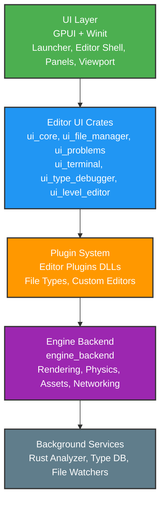
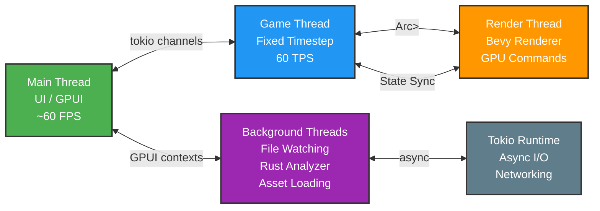
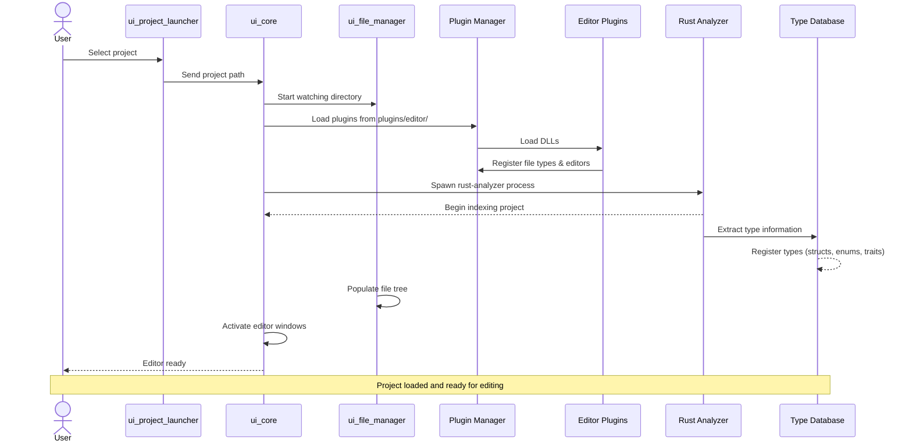

# Pulsar Architecture

Pulsar is a **game editor and engine** built in Rust with a focus on modularity, editor stability, and modern development workflows. This document explains how the major systems fit together.

## What Is Pulsar?

> [!NOTE]
> Pulsar resembles a **game editor** in this early stage, it has less runtime that most engines as we are primarily focused on UX. Think Unity Editor or Unreal Editor, built from scratch in Rust. This is in the process of changine so you will see us refer to it as an engine too.

- A launcher for managing and creating projects
- File management and asset browsers
- Code editing with Rust Analyzer integration
- A 3D scene viewport with real-time rendering
- Plugin system for custom editors and tools
- Integrated terminal and problem diagnostics
- Type inspection and debugging tools

## Design Philosophy

**Editor stability is paramount** - The editor should never crash, even when your game code does. Pulsar runs the editor UI separately from game logic to achieve this.

**Rust all the way down** - Projects are Rust workspaces. The editor is Rust. Plugins are compiled Rust DLLs. This gives you native performance and compile-time safety everywhere.

**Git-first collaboration** - Pulsar integrates deeply with Git, treating it as a first-class feature for team workflows and version control.

**Modular by default** - Systems have clear boundaries. The renderer, physics, UI, and plugins all operate independently.

**No magic** - If something happens, there's explicit code making it happen. No hidden conventions.

## Core Technologies

### GPUI - The UI Framework

The entire Pulsar editor interface is built with **GPUI**, a GPU-accelerated UI framework originally from the Zed editor. GPUI provides:

- GPU-rendered UI for smooth performance
- Declarative view syntax (similar to SwiftUI/Flutter)
- Strong typing for UI components
- Efficient re-rendering

All editor windows, panels, and controls use GPUI.

### Winit - Window Management

**Winit** handles OS window creation and event management. Pulsar coordinates between Winit (for system events) and GPUI (for rendering).

### Bevy Renderer - 3D Graphics

For 3D scene rendering, Pulsar uses **Bevy's rendering modules** (`bevy_render`, `bevy_pbr`), not the full Bevy engine. This provides:

- PBR (Physically Based Rendering) materials
- Modern graphics pipeline via wgpu
- Entity rendering in the viewport
- Cross-platform graphics support

### Rapier3D - Physics

Physics simulation uses **Rapier3D**, a Rust physics engine providing:

- Rigid body dynamics
- Collision detection
- Constraints and joints

### Rust Analyzer - Code Intelligence

Pulsar integrates **Rust Analyzer** (the Rust language server) to provide:

- Code completion
- Error diagnostics
- Type information on hover
- Go-to-definition
- Real-time compilation feedback

## System Architecture



## Major Components

### The Launcher (`ui_entry`, `ui_project_launcher`)

When you start Pulsar, you see the launcher. This provides:

- Project selection (recent projects list)
- Project creation from templates
- Settings access
- Direct project opening

### The Editor Shell (`ui_core`)

Once a project opens, the editor shell provides:

- Window management
- Tab system for editors
- Panel layout and docking
- Menu bar and toolbar
- Status bar

### File Manager (`ui_file_manager`)

Displays your project's file structure and provides:

- Directory tree navigation
- File type detection
- Asset previews
- Context menus for file operations
- Real-time file system watching

### Problems Panel (`ui_problems`)

Shows diagnostics from:

- Rust Analyzer (compiler errors, warnings, lints)
- Build output
- Custom validators

### Terminal (`ui_terminal`)

Integrated terminal for:

- Running Cargo commands
- Git operations
- Shell access without leaving the editor

### Type Debugger (`ui_type_debugger`)

Unique to Pulsar - inspect Rust types in your project:

- Browse all structs, enums, traits
- View type definitions
- See type relationships
- Explore module structure

### 3D Viewport (`ui_level_editor`)

Real-time 3D scene view showing:

- Game objects with transforms
- Materials and meshes
- Camera controls (pan, zoom, rotate)
- Gizmos for object manipulation

## Game Object System

> [!IMPORTANT]
> Pulsar does NOT use an Entity-Component-System (ECS). It uses simple GameObject structs.

Pulsar uses a **simple GameObject struct**, not an Entity-Component-System (ECS) like Bevy. GameObjects have:

```rust
pub struct GameObject {
    pub id: u64,
    pub position: [f32; 3],
    pub velocity: [f32; 3],
    pub rotation: [f32; 3],
    pub scale: [f32; 3],
    pub active: bool,
}
```

> [!TIP]
> GameObjects are managed by a GameThread that runs at a fixed tick rate (60 TPS by default), updating positions, velocities, and other properties.

## Plugin System

Editor plugins are compiled Rust **dynamic libraries (DLLs)** that extend the editor. Plugins can:

- Register custom file types
- Provide custom editors for those file types
- Add status bar buttons
- Hook into lifecycle events (load, unload)

See [Plugin System](./plugin-system) for details.

## Engine Backend (`engine_backend`)

The `engine_backend` crate provides game runtime services:

### Subsystems

**Rendering** (`subsystems/render`) - Uses Bevy's renderer for 3D graphics

**Physics** (`subsystems/physics`) - Rapier3D integration for collision and dynamics

**Assets** (`subsystems/assets`) - Asset loading and management

**Audio** (`subsystems/audio`) - Sound playback

**Networking** (`subsystems/networking`) - Multiplayer via Horizon game server

**Scripting** (`subsystems/scripting`) - (In development) Script execution

**World** (`subsystems/world`) - Scene and world state management

### Services

**GpuRenderer** - Manages render thread and GPU resources

**RustAnalyzerManager** - Spawns and communicates with rust-analyzer

**CompletionProvider** - Code completion from Rust Analyzer

## Engine State (`engine_state`)

Shared state between the editor and backend:

- Current project path
- Window management requests
- Metadata storage
- Discord Rich Presence integration

## Threading Model

> [!NOTE]
> Understanding the threading model is crucial for working with Pulsar. Each thread has specific responsibilities and communication patterns.

Pulsar uses multiple threads for responsiveness:



**Main Thread (UI)** - All GPUI rendering and user input (must never block, <16ms for 60fps)

**Game Thread** - Fixed timestep game loop (60 TPS), updates GameObjects

**Render Thread** - Bevy renderer execution, submits GPU commands

**Background Threads** - File watching, Rust Analyzer communication, asset loading

**Tokio Runtime** - Async operations for networking, I/O, long-running tasks

Communication uses:
- `tokio` channels for async messaging
- `Arc<Mutex<T>>` for shared state
- GPUI contexts for UI updates from background threads

## Project Structure

> [!IMPORTANT]
> Pulsar projects are standard Rust workspaces. You can use all normal Cargo commands.

A Pulsar project is a **Rust workspace**:

```
my-game/
├── Cargo.toml          # Workspace manifest
├── project.toml        # Pulsar project config
├── .pulsar/            # Editor metadata (don't commit)
├── assets/             # Game assets
├── scenes/             # Scene files
├── scripts/            # Game logic
└── game/               # Main game crate
    ├── Cargo.toml
    └── src/
        └── main.rs
```

Projects use standard Cargo tooling - you can build, run, and test with `cargo` commands.

## Data Flow Example: Opening a Project



**Step-by-step:**

1. User selects project in launcher (`ui_project_launcher`)
2. `ui_core` receives the project path
3. File manager starts watching the project directory
4. Plugin manager loads editor plugins from `plugins/editor/`
5. Plugins register their file types and editors
6. Rust Analyzer spawns and begins indexing
7. Type database starts loading project types
8. File manager populates the file tree
9. Editor windows become active
10. User can now edit files, browse assets, etc.

## Configuration

### Engine Configuration

Global settings in `%AppData%/Pulsar/` (Windows) or `~/.config/pulsar/` (Linux):

- `config.json` - Editor preferences
- `themes/` - UI themes
- `plugins/` - User-installed plugins
- `recent-projects.json` - Recent project list

### Project Configuration

Per-project settings:

- `Cargo.toml` - Rust workspace manifest
- `project.toml` - Pulsar-specific settings (version, build target, plugins)
- `.pulsar/` - Editor metadata (window layout, recent files)

## Future Directions

> [!NOTE]
> Pulsar is under active development. These features are planned but not yet implemented.

Planned features:

- **Collaborative editing** - Multiple users editing simultaneously
- **Visual scripting** - Node-based logic editor
- **Asset streaming** - Large world loading on-demand
- **Platform restoration** - Bringing back Linux and macOS support
- **Integrated profiler** - Performance analysis in the editor

## Wrapping Up

Pulsar's architecture separates the editor (GPUI-based UI) from the game runtime (backend subsystems). This provides:

- Stable editor even when game code crashes
- Native Rust performance throughout
- Modular systems that can be developed independently
- Standard Rust tooling (Cargo, rust-analyzer)

The architecture prioritizes clarity: each system has a specific job and communicates through well-defined interfaces.

For deeper dives:
- [Plugin Development](./plugin-system) - Build custom editor plugins
- [First Project](../getting-started/first-project) - Create and run a project
- [Quick Start](../getting-started/quick-start) - Editor tour
