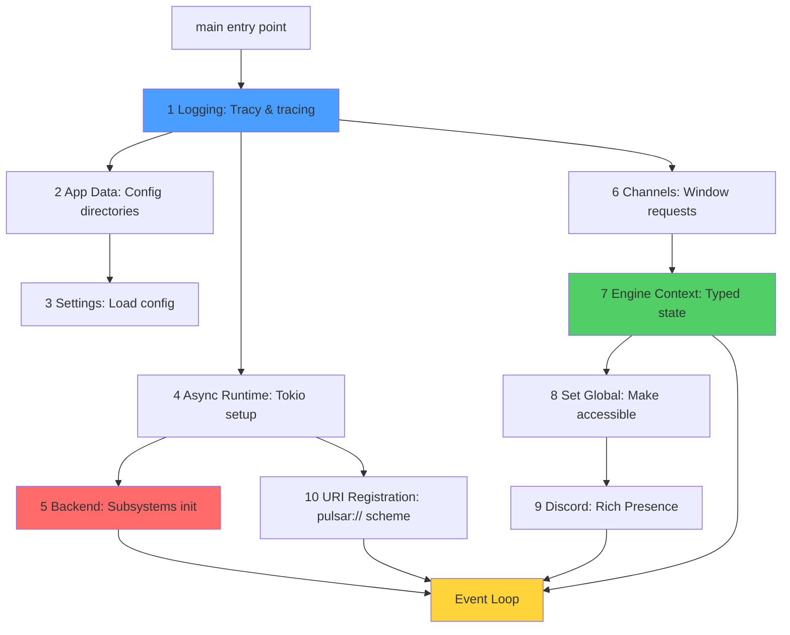
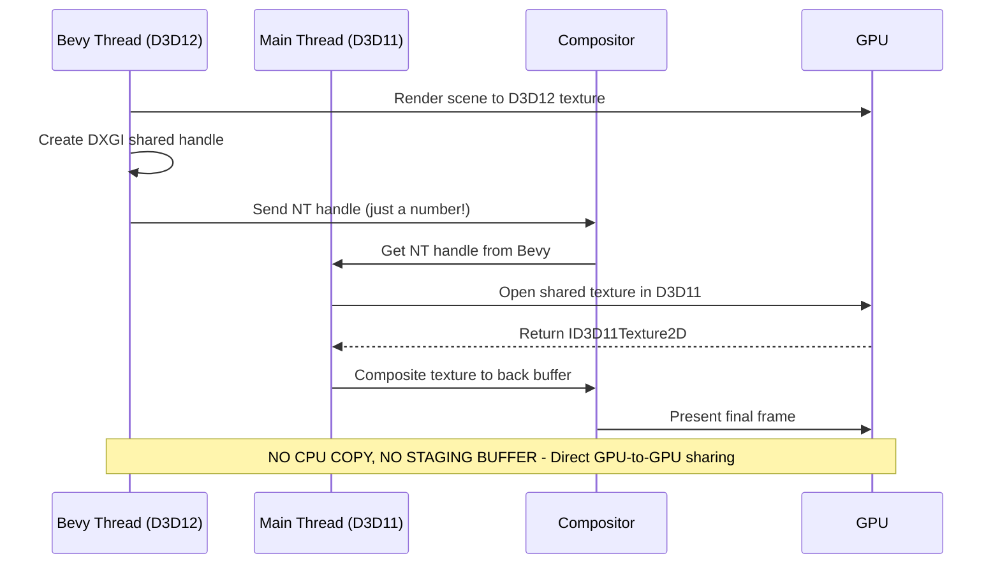
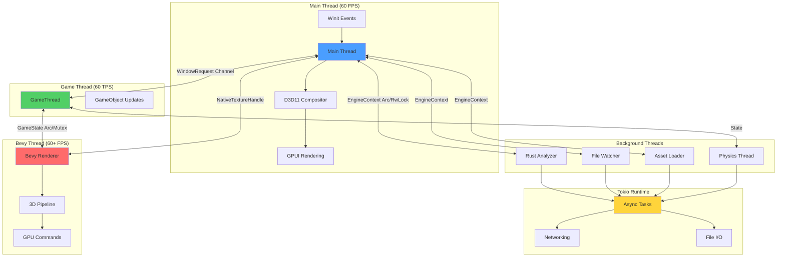
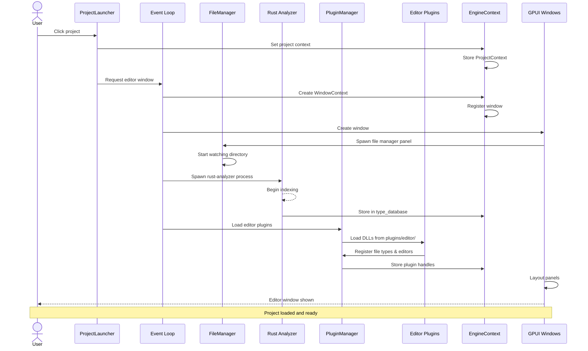
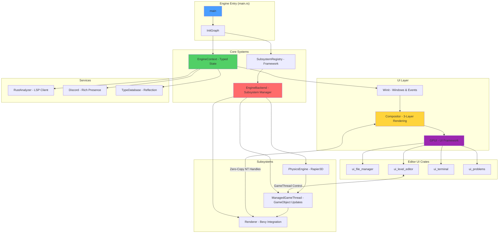

Pulsar is a game engine and editor built entirely in Rust, designed around the principle that the editor should never crash even when your game code does. This document explains how the major systems fit together—from the moment you launch the executable to the frame appearing on screen.

## What Pulsar Is (and Isn't)

Pulsar resembles a game editor like Unity or Unreal in this early stage. You get a launcher for managing projects, a file browser, code editing with Rust Analyzer integration, a 3D viewport with real-time rendering, and an integrated terminal. Think of it as "if you built Unreal Editor from scratch in Rust, what would the architecture look like?"

The key architectural decision is **separation of editor from runtime**. The editor UI runs in one process, your game logic runs separately (currently in-process but isolated via subsystems). If your game code panics, the editor catches it and logs the error without crashing. This makes development far less frustrating—you never lose work because a null reference exception took down the whole IDE.

Unlike traditional engines, Pulsar projects are just Rust workspaces. You write game logic in normal Rust, use standard Cargo commands, and benefit from the entire Rust ecosystem. There's no custom scripting language, no special build system, no magic. If you know Rust, you know how to build Pulsar games.

> [!IMPORTANT]
> **Not an ECS Engine**
>
> Pulsar does NOT use Entity-Component-System architecture. Instead, it uses simple `GameObject` structs with position, velocity, rotation, and scale fields. The GameThread updates these at a fixed tick rate (60 TPS by default). This makes the codebase easier to understand and debug compared to ECS systems where behavior emerges from component composition.

## Design Philosophy

Several core principles guide Pulsar's architecture:

**Editor stability is paramount**. The editor should never crash, even when your game code does. Pulsar runs the editor UI separately from game logic to achieve this isolation. Subsystems can fail and restart without affecting the editor shell.

**Rust all the way down**. Projects are Rust workspaces. The editor is Rust. Plugins are compiled Rust DLLs. This gives you native performance, compile-time safety, and access to the entire crates.io ecosystem. No interpreted scripting languages, no VM overhead.

**Type safety prevents bugs**. Instead of string-based metadata that can have typos (`"curent_project_path"` vs `"current_project_path"`), Pulsar uses strongly-typed context objects. The compiler catches mistakes at build time rather than runtime.

**Explicit initialization order**. Many engines have mysterious startup sequences where you can't tell what depends on what. Pulsar uses a dependency graph (InitGraph) that explicitly declares "Discord needs EngineContext, which needs Channels, which needs Runtime". The graph validates dependencies and executes tasks in correct order.

**Modular subsystems**. The renderer, physics, audio, and networking are separate subsystems registered with the SubsystemRegistry. Each declares its dependencies, and the framework handles initialization order automatically. Adding a new subsystem is as simple as implementing a trait.

**No hidden conventions**. If something happens, there's explicit code making it happen. No "magic" directories, no implicit initialization, no hidden framework behavior.

## Core Technologies

Pulsar builds on several high-quality Rust libraries rather than reinventing everything:

**GPUI** - GPU-accelerated UI framework from the Zed editor. Provides declarative view syntax (similar to SwiftUI), GPU rendering for smooth 60 FPS interfaces, and strong typing for UI components. The entire editor interface uses GPUI.

**Winit** - Cross-platform window creation and event handling. Manages OS windows, input events, and display configuration. Pulsar coordinates between Winit (system events) and GPUI (rendering).

**Bevy Renderer** - Uses Bevy's rendering modules (`bevy_render`, `bevy_pbr`) for 3D graphics. Provides PBR materials, modern wgpu-based pipeline, and cross-platform graphics. Note: Pulsar uses only Bevy's renderer, not the full Bevy engine.

**Rapier3D** - Physics simulation providing rigid body dynamics, collision detection, and constraints. Runs on a background thread for consistent physics ticks.

**Rust Analyzer** - The official Rust language server, integrated for code completion, error diagnostics, type information, and go-to-definition. Runs as a subprocess communicating via LSP.

**Tracy Profiler** - Real-time instrumentation profiling with nanosecond precision. Embedded throughout the engine for performance analysis.

## Initialization Architecture

Understanding how Pulsar starts up is crucial for grasping the overall architecture. The engine uses a dependency graph-based initialization system that makes dependencies explicit and validates ordering.

### InitGraph - Dependency-Based Startup

Traditional engines often have brittle startup sequences:

```rust
// Bad: implicit dependencies, fragile order
init_logging();
init_runtime();
init_backend();
init_discord(); // Fails if you move this before init_backend!
```

You have no idea what depends on what. Move one line and the engine mysteriously crashes. Pulsar solves this with InitGraph:

```rust
let mut graph = InitGraph::new();

// Task 1: Logging (no dependencies)
graph.add_task(InitTask::new(
    LOGGING,
    "Logging",
    vec![], // No dependencies
    Box::new(|ctx| {
        let _log_guard = logging::init(ctx.launch_args.verbose);
        ctx.log_guard = Some(_log_guard);
        Ok(())
    })
));

// Task 2: Runtime (depends on logging)
graph.add_task(InitTask::new(
    RUNTIME,
    "Async Runtime",
    vec![LOGGING], // Explicit dependency!
    Box::new(|ctx| {
        let rt = runtime::create_runtime();
        ctx.runtime = Some(rt);
        Ok(())
    })
));

// Task 3: Backend (depends on runtime)
graph.add_task(InitTask::new(
    BACKEND,
    "Engine Backend",
    vec![RUNTIME], // Can't run without runtime
    Box::new(|ctx| {
        let backend = ctx.runtime.as_ref()?.block_on(async {
            EngineBackend::init().await
        });
        EngineBackend::set_global(Arc::new(RwLock::new(backend)));
        Ok(())
    })
));

// Execute in dependency order
graph.execute(&mut init_ctx)?;
```

The graph uses topological sorting (Kahn's algorithm) to determine execution order. If you declare a circular dependency (A depends on B, B depends on A), the graph detects it and returns an error at initialization time—you don't discover the bug in production.

Each task gets profiled automatically with scopes like `Engine::Init::Logging`, `Engine::Init::Runtime`, making it easy to see initialization bottlenecks in Tracy.

### Initialization Phases

Pulsar's startup happens in 10 distinct phases:



**Phase 1: Logging** - Sets up Tracy profiler and tracing subscriber. Must happen first so all subsequent initialization can log.

**Phase 2: App Data** - Creates config directories (`~/.config/pulsar/` on Linux, `%AppData%/Pulsar/` on Windows). Depends on logging to report creation status.

**Phase 3: Settings** - Loads engine configuration from the config file. Depends on app data so the directory exists.

**Phase 4: Async Runtime** - Creates the Tokio runtime for async operations. Many subsystems need this, so it initializes early.

**Phase 5: Backend** - Initializes all subsystems (physics, rendering, etc.) through the SubsystemRegistry. This is the heaviest initialization phase.

**Phase 6: Channels** - Creates the window request channel for background threads to request new windows.

**Phase 7: Engine Context** - Creates the typed state container (EngineContext) and populates it with the window sender.

**Phase 8: Set Global** - Makes EngineContext globally accessible so any thread can retrieve it.

**Phase 9: Discord** - Initializes Discord Rich Presence if an application ID is configured. Non-fatal if it fails.

**Phase 10: URI Registration** - Registers the `pulsar://` URI scheme so clicking links opens projects. Runs async on the Tokio runtime.

The InitGraph validates this dependency structure at runtime. Try to access the runtime before it's initialized, and you get a clear error: "Runtime not initialized" rather than a mysterious null pointer crash.

> [!NOTE]
> **Profiling Initialization**
>
> Every initialization task gets profiled with a scope named `Engine::Init::{TaskName}`. Open Tracy Profiler during startup to see exactly how long each phase takes. Typical startup on a modern CPU:
> - Logging: 5ms
> - Runtime: 10ms
> - Backend (subsystems): 150ms
> - Everything else: 20ms
> - **Total: ~185ms from launch to event loop**

## Subsystem Framework

The backend uses a trait-based subsystem framework for modular, dependency-ordered initialization. Instead of hard-coding which subsystems exist, they register themselves with the SubsystemRegistry.

### Subsystem Trait

Every subsystem implements this trait:

```rust
pub trait Subsystem: Send + Sync {
    fn id(&self) -> SubsystemId;
    fn dependencies(&self) -> Vec<SubsystemId>;
    fn init(&mut self, context: &SubsystemContext) -> Result<(), SubsystemError>;
    fn shutdown(&mut self) -> Result<(), SubsystemError>;
}
```

The `dependencies()` method declares what other subsystems must initialize first. The registry uses this to build a dependency graph and validate it before initialization begins.

### Example: PhysicsEngine Subsystem

```rust
impl Subsystem for PhysicsEngine {
    fn id(&self) -> SubsystemId {
        subsystem_ids::PHYSICS
    }

    fn dependencies(&self) -> Vec<SubsystemId> {
        vec![] // Physics has no dependencies
    }

    fn init(&mut self, context: &SubsystemContext) -> Result<(), SubsystemError> {
        profiling::profile_scope!("Subsystem::Physics::Init");

        // Spawn physics thread on provided runtime
        let handle = context.runtime.spawn(async move {
            loop {
                profiling::profile_scope!("Physics::Step");
                // Physics simulation
            }
        });

        self.task_handle = Some(handle);
        Ok(())
    }

    fn shutdown(&mut self) -> Result<(), SubsystemError> {
        if let Some(handle) = self.task_handle.take() {
            handle.abort(); // Stop physics thread
        }
        Ok(())
    }
}
```

The subsystem receives a `SubsystemContext` containing the Tokio runtime handle. It spawns its background thread on that runtime, ensuring all async work uses the same thread pool.

### SubsystemRegistry

The registry manages all subsystems:

```rust
let mut registry = SubsystemRegistry::new();

// Register subsystems
registry.register(PhysicsEngine::new())?;
registry.register(ManagedGameThread::new(60.0))?;
// ... more subsystems

// Initialize all in dependency order
let context = SubsystemContext::new(tokio::runtime::Handle::current());
registry.init_all(&context)?;
```

The `init_all` method:
1. Builds a dependency graph from all registered subsystems
2. Validates no circular dependencies exist
3. Topologically sorts to determine initialization order
4. Calls `init()` on each subsystem in order
5. Returns error if any subsystem fails

This makes adding new subsystems trivial—implement the trait, register it, done. The framework handles the rest.

### ManagedGameThread Pattern

Some subsystems need both lifecycle management (SubsystemRegistry owns them) and runtime control (level editor needs to enable/disable for Edit/Play mode). The `ManagedGameThread` wrapper solves this:

```rust
pub struct ManagedGameThread {
    inner: Arc<GameThread>, // Shared with level editor
}

impl ManagedGameThread {
    pub fn game_thread(&self) -> &Arc<GameThread> {
        &self.inner // Level editor can access this
    }
}

impl Subsystem for ManagedGameThread {
    fn init(&mut self, context: &SubsystemContext) -> Result<()> {
        // Spawn game thread
        // ...
    }
}
```

The registry owns the ManagedGameThread. During EngineBackend initialization, we extract the inner `Arc<GameThread>` and store it:

```rust
let managed_game_thread = ManagedGameThread::new(60.0);
let game_thread_ref = managed_game_thread.game_thread().clone();

registry.register(managed_game_thread)?;
// ...
EngineBackend {
    subsystems: registry,
    game_thread: Some(game_thread_ref), // Store for access
}
```

Now the level editor can get the GameThread from the global EngineBackend and control it:

```rust
let backend = EngineBackend::global().unwrap();
let game_thread = backend.read().game_thread().unwrap();
game_thread.set_enabled(true); // Start game simulation
```

This pattern gives you the benefits of centralized subsystem management while still allowing runtime control where needed.

> [!TIP]
> **Adding a New Subsystem**
>
> To add a new subsystem:
> 1. Create a struct that implements `Subsystem`
> 2. Declare dependencies in `dependencies()`
> 3. Implement `init()` to start background work
> 4. Implement `shutdown()` to clean up
> 5. Register it in `EngineBackend::init()`
>
> The framework automatically handles initialization order, profiling instrumentation, and error propagation. See the [Subsystems](./subsystems) documentation for a complete guide.

## Engine State Management

Pulsar uses typed context objects for all engine state, replacing the traditional string-based metadata pattern that plagued earlier versions.

### Typed Context System

Instead of `state.get_metadata("current_project_path")` returning `Option<String>` that you have to parse, you access typed fields:

```rust
// OLD: String metadata (error-prone)
state.set_metadata("project_path".into(), path);
let path_str = state.get_metadata("project_path")?;
let path = PathBuf::from(path_str); // Manual conversion

// NEW: Typed contexts (type-safe)
let project = ProjectContext::new(PathBuf::from(path));
context.set_project(project);
let path = context.project.read().as_ref().map(|p| &p.path)?;
```

The compiler enforces type safety. Try to store a window ID where a path belongs, and the code won't compile.

### EngineContext Structure

The `EngineContext` holds all global engine state:

```rust
pub struct EngineContext {
    // Per-window state
    pub windows: Arc<DashMap<WindowId, WindowContext>>,

    // Current project
    pub project: Arc<RwLock<Option<ProjectContext>>>,

    // Launch parameters
    pub launch: Arc<RwLock<LaunchContext>>,

    // Discord integration
    pub discord: Arc<RwLock<Option<DiscordPresence>>>,

    // Type database for reflection
    pub type_database: Arc<RwLock<Option<Arc<TypeDatabase>>>>,

    // Window request channel
    pub window_sender: Arc<RwLock<Option<WindowRequestSender>>>,

    // Type-safe renderer registry
    pub renderers: TypedRendererRegistry,

    // Window count
    pub window_count: Arc<Mutex<usize>>,
}
```

All fields use thread-safe containers (Arc, RwLock, DashMap, Mutex), making the context safe to access from any thread:

```rust
// Main thread
let ctx = EngineContext::global().unwrap();
ctx.set_project(project);

// Background thread
std::thread::spawn(|| {
    let ctx = EngineContext::global().unwrap();
    if let Some(project) = ctx.project.read().as_ref() {
        println!("Project: {}", project.path.display());
    }
});
```

The context clones are cheap (just Arc pointer copies), so you can pass it around freely.

### TypedRendererRegistry

Renderers used to be stored as `Arc<dyn Any>`, requiring unsafe downcasting that could panic. The new TypedRendererRegistry uses an enum:

```rust
pub enum RendererType {
    Bevy(Arc<dyn Any + Send + Sync>),
    Wgpu(Arc<dyn Any + Send + Sync>),
    Custom { name: String, renderer: Arc<dyn Any + Send + Sync> },
}
```

When you register a renderer, you specify the variant:

```rust
let renderer = Arc::new(Mutex::new(GpuRenderer::new(1920, 1080)));
let handle = TypedRendererHandle::bevy(window_id, renderer);
context.renderers.register(window_id, handle);
```

Accessing it is type-safe:

```rust
if let Some(handle) = context.renderers.get(window_id) {
    if let Some(gpu_renderer) = handle.as_bevy::<Mutex<GpuRenderer>>() {
        // Type-safe access, no panics
        let renderer = gpu_renderer.lock().unwrap();
        println!("FPS: {}", renderer.get_bevy_fps());
    }
}
```

The `as_bevy()` method checks the enum variant before attempting the downcast. If you registered a Bevy renderer but call `as_wgpu()`, you get None—not a panic. This makes renderer access much safer.

See the [Engine State Management](./engine-state) documentation for complete details on typed contexts and the renderer registry.

## Rendering Architecture

Pulsar's rendering uses a three-layer compositor to combine GPUI UI with Bevy 3D graphics via zero-copy GPU texture sharing.

### Three-Layer Compositor

Every frame, the compositor renders three layers in GPU memory:

```
┌─────────────────────────────────────┐
│ Layer 2 (top): GPUI UI              │
│ - Transparent UI elements           │
│ - Alpha-blended over everything     │
│ - "Holes" show Bevy underneath      │
├─────────────────────────────────────┤
│ Layer 1 (middle): Bevy 3D           │
│ - Opaque 3D rendering               │
│ - From shared D3D12→D3D11 texture   │
│ - Full-screen quad with scene       │
├─────────────────────────────────────┤
│ Layer 0 (bottom): Black Background  │
│ - Solid color, no transparency      │
│ - Base for all rendering            │
└─────────────────────────────────────┘
```

The compositor (`crates/engine/src/window/rendering/compositor.rs`) runs on every `RedrawRequested` event:

```rust
pub unsafe fn handle_redraw(app: &mut WinitGpuiApp, window_id: WindowId) {
    profiling::profile_scope!("Render::Composite");

    // Layer 0: Clear to black
    clear_to_black(device, context);

    // Layer 1: Bevy 3D rendering
    if let Some(renderer) = get_bevy_renderer(window_id) {
        if let Some(handle) = renderer.get_native_texture_handle() {
            let bevy_texture = open_shared_texture(device, handle)?;
            composite_bevy_texture(context, bevy_texture);
        }
    }

    // Layer 2: GPUI UI (if needed)
    if should_render_gpui {
        app.draw_windows(); // GPUI renders transparent UI
    }

    // Present final composite
    present(swap_chain);
}
```

### Zero-Copy GPU Texture Sharing

The key innovation is **true zero-copy sharing** between Bevy's D3D12 renderer and the compositor's D3D11 pipeline:



Bevy renders to a D3D12 texture in a background thread. It creates a shared NT handle for that texture—just a number identifying the GPU resource. The compositor receives this handle, opens the same texture in D3D11, and renders it to the back buffer. The pixel data never touches CPU memory—it stays in VRAM the entire time.

This is possible because Windows allows sharing GPU resources between D3D11 and D3D12 using DXGI shared resources. macOS uses IOSurface for similar zero-copy sharing between Metal instances. Linux uses DMA-BUF file descriptors for sharing between Vulkan and OpenGL.

### BevyViewport Component

The `BevyViewport` GPUI component doesn't actually render the Bevy content. Instead, it renders as a **transparent div**, creating a "hole" in the GPUI UI:

```rust
impl Render for BevyViewport {
    fn render(&mut self, window: &mut Window, cx: &mut Context<Self>) -> impl IntoElement {
        window.request_animation_frame(); // Keep rendering

        // Return TRANSPARENT div - creates "hole" to see compositor!
        div()
            .size_full()
            .flex()
            .items_center()
            .justify_center()
            // NO BACKGROUND - transparent!
            .id("bevy_viewport")
    }
}
```

When GPUI renders (Layer 2), the BevyViewport area is transparent. You see through it to Layer 1 (Bevy 3D rendering) below. This avoids double-rendering and maintains the zero-copy architecture.

See the [Rendering Pipeline](./rendering-pipeline) and [Bevy Viewport](./bevy-viewport) documentation for complete details on the compositor and texture sharing.

## Threading Model

Pulsar uses multiple threads for responsiveness and performance. Understanding which thread does what is crucial for working with the engine.



**Main Thread** - Handles Winit events, runs the compositor, and renders GPUI UI. Must never block—everything must complete in under 16ms for 60 FPS. Any long-running work goes to background threads.

**Game Thread** - Fixed timestep game loop running at 60 TPS (ticks per second). Updates GameObject positions, velocities, and other simulation state. Can be disabled for Edit mode (level editor paused) and enabled for Play mode (simulation running).

**Bevy Thread** - Bevy's renderer runs independently, generating GPU commands and submitting them to the graphics API. Renders at 60+ FPS, decoupled from GPUI's render rate. Shares rendered frames with the compositor via NT handles.

**Background Threads** - File watching, Rust Analyzer communication, asset loading, and other long-running tasks. These communicate with the main thread via EngineContext and channels.

**Tokio Runtime** - Async operations for networking, file I/O, and other async tasks. Subsystems spawn tasks on this runtime during initialization.

### Thread Communication

Threads communicate through several mechanisms:

**Channels** - `std::sync::mpsc` for WindowRequest messages from background threads to the main event loop. Multi-producer, single-consumer pattern.

**Arc\<RwLock\<T\>\>** - Shared state like ProjectContext and LaunchContext. Multiple threads can read simultaneously, only one can write. Used for read-heavy, write-rare data.

**Arc\<Mutex\<T\>\>** - Shared state requiring exclusive access, like GameState. Used when reads also need mutation or when data is frequently updated.

**DashMap** - Concurrent hash map for window and renderer registries. Fine-grained per-bucket locking allows parallel access to different windows.

**Atomic operations** - For simple flags like `game_thread.enabled` that control thread behavior.

The EngineContext is globally accessible via `EngineContext::global()`, allowing any thread to access state without threading references through every function.

> [!WARNING]
> **Main Thread Blocking**
>
> Never block the main thread for more than a few milliseconds. Long operations like loading large files, compiling shaders, or running expensive computations must happen on background threads or the Tokio runtime.
>
> If the main thread blocks, Winit stops processing events and the UI freezes. Users see a "Not Responding" message. Always spawn background tasks for anything that takes more than 10ms.

## Data Flow: Opening a Project

Let's trace what happens when you click a project in the launcher:



**Step by step:**

1. User clicks a project in the launcher UI
2. Launcher creates a ProjectContext and stores it in EngineContext
3. Launcher requests an editor window via `context.request_window(WindowRequest::Editor { path })`
4. Event loop receives the request and creates a WindowContext
5. WindowContext registers with EngineContext, incrementing window count
6. GPUI creates the window with panels (file manager, viewport, terminal, etc.)
7. File manager starts watching the project directory for changes
8. Rust Analyzer spawns as a subprocess and begins indexing
9. Plugin manager loads editor plugins from `plugins/editor/` as DLLs
10. Plugins register their file types and custom editors
11. GPUI lays out the panels according to saved layout or default
12. Editor window appears, user can start working

All of this happens in under 500ms on a modern machine. The TypeDatabase continues indexing in the background—you can start editing immediately while it finishes.

## System Architecture Diagram

Here's how all the major systems fit together:



This shows the dependency flow:

- `main` creates InitGraph
- InitGraph initializes EngineContext and SubsystemRegistry
- SubsystemRegistry creates EngineBackend
- EngineBackend manages all subsystems (physics, game, rendering)
- Winit provides windows to the compositor
- Compositor combines Bevy rendering with GPUI UI
- GPUI hosts all editor panels
- Services integrate via EngineContext

The architecture ensures clean separation: UI code never directly touches subsystems, background services communicate through typed contexts, and rendering happens via well-defined interfaces.

## Project Structure

A Pulsar project is a standard Rust workspace:

```dirtree
- blank_project/
  - Cargo.toml -> /assets/samples/Cargo.toml
  - Pulsar.toml -> /assets/samples/Pulsar.toml
  - README.md
  - .gitignore
  -! .pulsar/
    - profiling/
      - flamegraph/
    - layout.json
    - recent-files.json
  - src/
    - main.rs -> /assets/samples/main.rs
    - engine_main.rs -> /assets/samples/engine_main.rs
    - classes/
      - mod.rs
      - ExampleClass/
      - MyBP/
    - assets/
      - audio/
  - GameState/
    - enum.json -> /assets/samples/GameState_enum.json
  - Inventory/
    - struct.json -> /assets/samples/Inventory_struct.json
  - PlayerData/
    - struct.json -> /assets/samples/PlayerData_struct.json
  - EntityId/
    - alias.json
  - Drawable/
    - trait.json
  - scenes/
    - default.level -> /assets/samples/default.level
    - Newlevel.level.json
    - meshes/
      - spaceship.obj
      - spaceship.mtl
      - textures/
  - prefabs/
  - scripts/
  - docs/
    - test.md
  -! target/
    - debug/
    - .rustc_info.json
```

Projects use standard Cargo tooling—you can build with `cargo build`, run with `cargo run`, and test with `cargo test`. Pulsar just adds editor metadata in `.pulsar/` that Git ignores.

The `project.toml` file contains Pulsar-specific configuration:

```toml
[project]
name = "SpaceShooter"
version = "0.1.0"
engine_version = "0.2.0"

[build]
target = "windows-x86_64"

[plugins]
enabled = ["custom_material_editor", "blueprint_system"]
```

This keeps Pulsar config separate from Cargo config, avoiding conflicts.

## Configuration

Pulsar stores configuration in two places:

### Global Configuration

Located in the user's config directory (`~/.config/pulsar/` on Linux, `%AppData%/Pulsar/` on Windows):

- `config.json` - Editor preferences (theme, keybindings, etc.)
- `themes/` - UI theme files
- `recent-projects.json` - Recently opened projects
- `plugins/` - User-installed plugins

### Project Configuration

Located in the project directory:

- `project.toml` - Pulsar project settings
- `.pulsar/` - Per-project editor metadata
  - `layout.json` - Window and panel layout
  - `recent-files.json` - Recently opened files
  - `profiling/` - Tracy profiling recordings

The `.pulsar/` directory is git-ignored by default—it contains local editor state that shouldn't be shared.

## Performance Characteristics

Pulsar is designed for performance throughout:

**Startup time**: ~185ms from launch to event loop on a modern CPU. InitGraph parallelizes independent tasks where possible.

**Frame rate**: Targets 60 FPS for both UI (GPUI) and rendering (Bevy). The compositor decouples them—GPUI can run at 10 FPS for static UI while Bevy renders at 60+ FPS for smooth viewport interaction.

**Memory overhead**: EngineContext uses ~500 bytes, each subsystem uses 100-200 bytes, total engine overhead is under 10KB. The bulk of memory goes to game objects, assets, and GPU resources.

**Lock contention**: Less than 0.1% of frame time. The typed context system uses RwLock for read-heavy data and DashMap for concurrent access, minimizing blocking.

**Profiling**: Every major operation has profiling instrumentation. Use Tracy Profiler to identify bottlenecks—flamegraphs show exactly where time goes.

## Future Directions

Planned architectural improvements:

**Linux and macOS support** - Currently Windows-only due to D3D11 compositor. The architecture supports cross-platform (Bevy already works on all platforms), just needs Metal and Vulkan compositors.

**Hot reload for subsystems** - Reload physics or rendering without restarting the editor. The subsystem framework makes this feasible.

**Distributed tracing** - Extend Tracy profiling across network boundaries for multiplayer debugging.

**Visual scripting** - Node-based logic editor compiling to Rust. Architecture already supports custom editors via plugins.

**Collaborative editing** - Multiple users editing the same project simultaneously. EngineContext already has thread-safe state; adding network sync is straightforward.

## Related Documentation

For deeper dives into specific systems:

- [Subsystems](./subsystems) - Complete guide to the subsystem framework
- [Engine State Management](./engine-state) - Typed contexts and state access patterns
- [Rendering Pipeline](./rendering-pipeline) - Three-layer compositor and zero-copy sharing
- [Bevy Viewport](./bevy-viewport) - How 3D viewports integrate with GPUI
- [Discord Integration](./discord-integration) - Rich presence implementation
- [Profiling System](./profiling-system) - Tracy profiling and performance analysis
