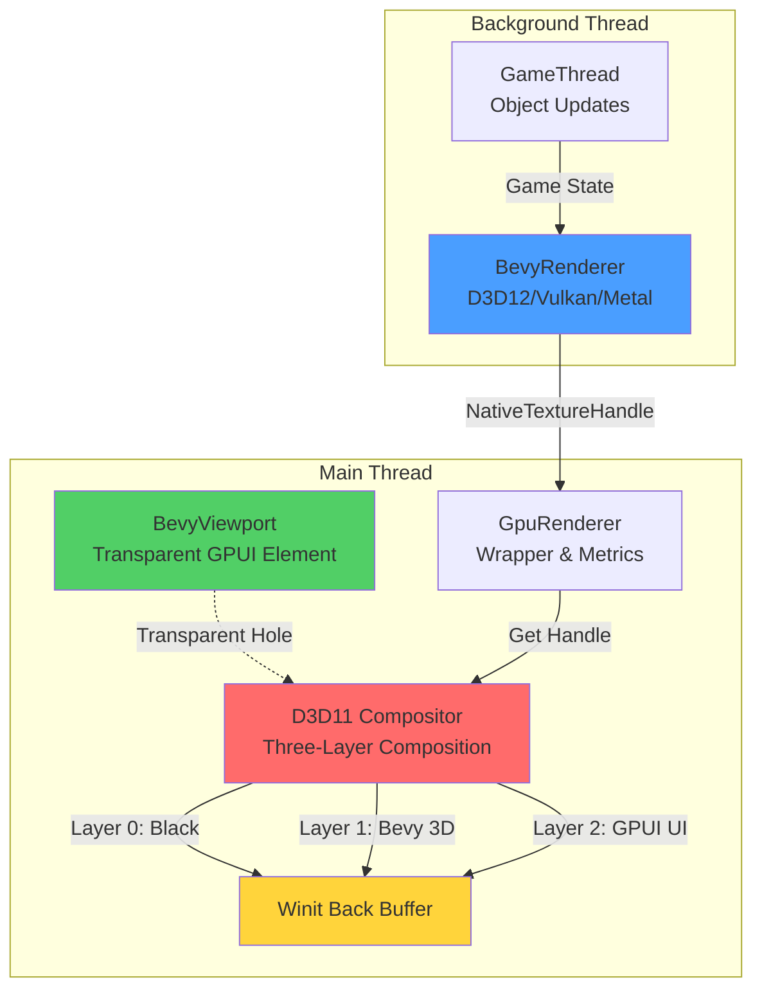
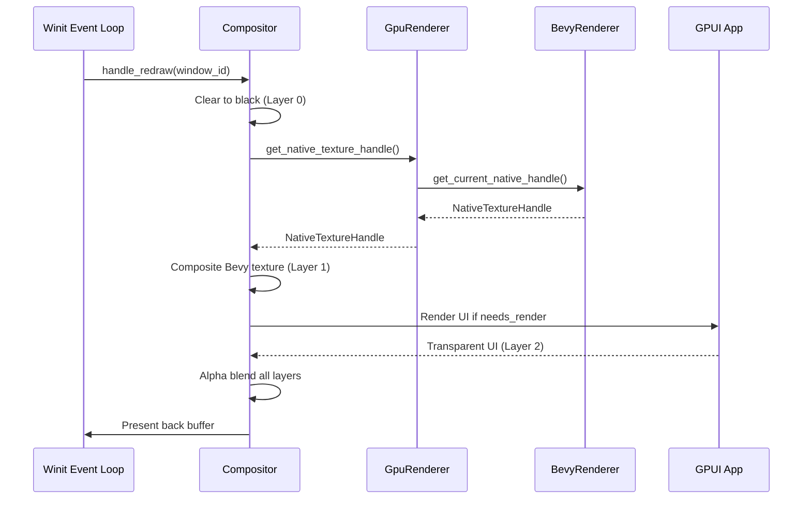
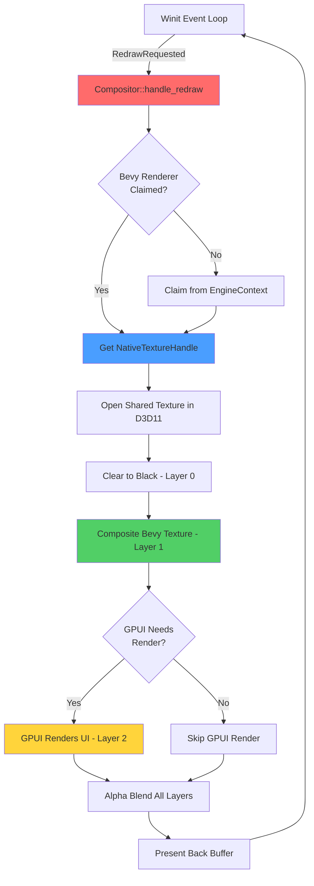

> [!WARNING]
> The rendering system is currently tied heavily to Bevy's renderer and ECS. While we may be remaining tied to `bevy_ecs`, the rendering engine will be made modular in the future. At such time this page will be moved to a new "Render Engines" section.

# Bevy Viewport Integration

Pulsar integrates Bevy (a Rust game engine) for 3D rendering using a **compositor-based zero-copy GPU texture sharing architecture**. Unlike traditional approaches that render to intermediate buffers, Pulsar's viewport creates a transparent "hole" in the GPUI UI while the compositor directly composites Bevy's GPU textures into the window's back buffer.

## Architecture Overview

The viewport system uses a **three-layer compositor architecture** rather than embedding rendered content directly in GPUI elements:



### Component Layers

The system consists of these key components:

- **BevyViewport** (`crates/ui/src/bevy_viewport.rs`) - GPUI component that renders as a transparent div, creating a "hole" to see the compositor's work
- **BevyViewportState** - Shared state for viewport dimensions and configuration
- **GpuRenderer** (`crates/engine_backend/src/services/gpu_renderer.rs`) - Wrapper around BevyRenderer providing metrics and handle access
- **BevyRenderer** (`crates/engine_backend/src/subsystems/render/bevy_renderer/`) - Actual Bevy ECS and rendering pipeline
- **D3D11 Compositor** (`crates/engine/src/window/rendering/compositor.rs`) - Three-layer GPU composition system
- **NativeTextureHandle** (`crates/engine_backend/src/subsystems/render/native_texture.rs`) - Cross-platform GPU texture handle abstraction

## Zero-Copy GPU Texture Sharing

The key innovation is **true zero-copy GPU texture sharing** between Bevy's renderer and the compositor:

```
┌─────────────────────────────────────────────────────────────┐
│ Bevy Thread (D3D12)          Compositor (D3D11)             │
│                                                              │
│ Render Scene                 Claim Handle                   │
│      ↓                            ↓                          │
│ D3D12 Texture  ──DXGI Share──> Open in D3D11                │
│                                  ↓                           │
│                            Composite 3 Layers                │
│                                  ↓                           │
│                            Present to Screen                 │
│                                                              │
│ ✅ NO CPU COPY  ✅ NO STAGING BUFFER  ✅ DIRECT GPU-TO-GPU  │
└─────────────────────────────────────────────────────────────┘
```

> [!NOTE]
> **Platform-Specific Sharing Mechanisms**
> - **Windows**: DXGI shared resources with NT handles (D3D12 ↔ D3D11)
> - **macOS**: IOSurface shared memory (Metal ↔ Metal)
> - **Linux**: DMA-BUF file descriptors (Vulkan ↔ OpenGL/Vulkan)

## Three-Layer Compositor

The compositor (`compositor.rs`) renders three distinct layers in GPU memory:

```rust
// Layer 0 (bottom): Black background
// - Solid color, no transparency
// - Provides base for all rendering

// Layer 1 (middle): Bevy 3D rendering
// - Opaque 3D content from shared D3D12→D3D11 texture
// - Full-screen quad with Bevy's rendered scene
// - BGRA8UnormSrgb format for color accuracy

// Layer 2 (top): GPUI UI
// - Transparent UI elements alpha-blended over Bevy
// - GPUI's transparent areas reveal Bevy rendering below
// - Creates "holes" where BevyViewport components exist
```

### Composition Flow

The compositor runs on every frame:



## BevyViewport Component

The `BevyViewport` is a standard GPUI component that **does not actually render Bevy content**. Instead, it renders as a transparent div, creating a "hole" in the GPUI UI:

```rust
pub struct BevyViewport {
    state: Arc<parking_lot::RwLock<BevyViewportState>>,
    object_fit: ObjectFit,
    focus_handle: FocusHandle,
}
```

### Creating a Viewport

```rust
use ui::bevy_viewport::BevyViewport;

// Create a viewport (renders as transparent div)
let viewport = cx.new(|cx| BevyViewport::new(1600, 900, cx));

// Get shared state for configuration
let viewport_state = viewport.read(cx).shared_state();
```

### How It Renders

The viewport's `render()` method returns a **completely transparent div**:

```rust
impl Render for BevyViewport {
    fn render(&mut self, window: &mut Window, cx: &mut Context<Self>) -> impl IntoElement {
        // Request continuous frames for live rendering
        window.request_animation_frame();

        // Return TRANSPARENT div - creates a "hole" to see compositor's work!
        div()
            .size_full()
            .flex()
            .items_center()
            .justify_center()
            // NO BACKGROUND - transparent!
            .track_focus(&self.focus_handle)
            .id("bevy_viewport")
            .child(
                div()
                    .size_full()
                    .into_any_element()
            )
    }
}
```

> [!IMPORTANT]
> **Why Transparent?**
>
> The BevyViewport doesn't need to render the Bevy content itself because:
> 1. The compositor renders Bevy as Layer 1 (full-screen)
> 2. GPUI renders as Layer 2 with transparency
> 3. Where BevyViewport exists, GPUI is transparent → Bevy shows through
> 4. This avoids double-rendering and maintains zero-copy architecture

## BevyViewportState

Shared state accessible from both UI and render threads:

```rust
pub struct BevyViewportState {
    canvas_source: Option<GpuCanvasSource>, // Reserved for future gpu_canvas usage
    width: u32,
    height: u32,
}

impl BevyViewportState {
    pub fn new(width: u32, height: u32) -> Self {
        Self {
            canvas_source: None,
            width,
            height,
        }
    }

    pub fn resize(&mut self, width: u32, height: u32) {
        self.width = width;
        self.height = height;
    }

    pub fn dimensions(&self) -> (u32, u32) {
        (self.width, self.height)
    }
}
```

## GpuRenderer Wrapper

The `GpuRenderer` wraps `BevyRenderer` and provides metrics, handle access, and convenience methods:

```rust
pub struct GpuRenderer {
    pub bevy_renderer: Option<BevyRenderer>,
    render_width: u32,
    render_height: u32,
    display_width: u32,
    display_height: u32,
    frame_count: u64,
    start_time: Instant,
}
```

### Key Methods

#### Get Native Texture Handle (Zero-Copy)

```rust
/// TRUE ZERO-COPY: Get native GPU texture handle for compositor
/// NO buffers, NO copies - just a raw pointer!
pub fn get_native_texture_handle(&self) -> Option<NativeTextureHandle> {
    self.bevy_renderer.as_ref()?.get_current_native_handle()
}
```

This is the **critical method** that enables zero-copy rendering. The compositor calls this every frame to get the GPU texture handle.

#### Performance Metrics

```rust
// Get Bevy renderer FPS
let bevy_fps = renderer.get_bevy_fps();

// Get comprehensive metrics
let metrics = renderer.get_render_metrics()?;
tracing::debug!("Bevy FPS: {:.1}", metrics.bevy_fps);
tracing::debug!("Pipeline time: {}μs", metrics.pipeline_time_us);
tracing::debug!("GPU time: {}μs", metrics.gpu_time_us);

// Get detailed GPU profiler data (like Unreal's "stat gpu")
let profiler_data = renderer.get_gpu_profiler_data()?;
```

#### Camera Control

```rust
use engine_backend::subsystems::render::CameraInput;

// Update camera for Unreal-style controls
renderer.update_camera_input(CameraInput {
    mouse_delta: (dx, dy),
    forward: w_pressed,
    backward: s_pressed,
    left: a_pressed,
    right: d_pressed,
    up: e_pressed,
    down: q_pressed,
    speed_multiplier: shift_held,
});
```

#### Resizing

```rust
// Resize the viewport and recreate Bevy render targets
renderer.resize(1920, 1080);
```

## NativeTextureHandle

Cross-platform abstraction for GPU texture handles:

```rust
#[derive(Clone, Copy, Debug)]
pub enum NativeTextureHandle {
    #[cfg(target_os = "windows")]
    D3D11(usize), // NT handle for DXGI shared resource

    #[cfg(target_os = "macos")]
    Metal(usize), // MTLTexture* as usize

    #[cfg(target_os = "linux")]
    Vulkan(u64), // VkImageView as u64
}
```

### Extraction from wgpu

The handle is extracted using **unsafe pointer casting** from Bevy's wgpu textures:

```rust
impl NativeTextureHandle {
    /// Extract native handle from Bevy's wgpu texture
    /// UNSAFE but required for zero-copy integration
    pub unsafe fn from_wgpu_texture(
        texture: &Texture,
        device: &RenderDevice,
    ) -> Option<Self> {
        #[cfg(target_os = "windows")]
        {
            // Use pre-created DXGI shared handles
            if let Some(handles) = get_shared_handles() {
                return Some(NativeTextureHandle::D3D11(handles[0]));
            }
        }

        // Fallback: Extract handle from wgpu using HAL
        // ... platform-specific unsafe code
    }
}
```

> [!CAUTION]
> **Unsafe Operations**
>
> Extracting native GPU handles requires `unsafe` code because:
> - Bypasses wgpu's safety abstractions
> - Directly accesses platform-specific GPU APIs
> - Requires careful lifetime management
> - Must ensure texture validity when handle is used

## Compositor Integration

The compositor (`compositor.rs`) is where zero-copy rendering actually happens:

```rust
#[cfg(target_os = "windows")]
pub unsafe fn handle_redraw(app: &mut WinitGpuiApp, window_id: WindowId) {
    profiling::profile_scope!("Render::Composite");

    // Step 1: Claim Bevy renderer
    claim_bevy_renderer(app, &window_id);

    // Step 2: Clear to black (Layer 0)
    clear_to_black(device, context);

    // Step 3: Get Bevy's GPU texture handle
    if let Some(renderer) = get_bevy_renderer(window_id) {
        if let Some(native_handle) = renderer.get_native_texture_handle() {
            let NativeTextureHandle::D3D11(handle_ptr) = native_handle else { return };

            // Step 4: Open shared texture in D3D11
            let bevy_texture = open_shared_texture(device, handle_ptr)?;

            // Step 5: Composite Bevy texture (Layer 1)
            composite_bevy_texture(context, bevy_texture);
        }
    }

    // Step 6: Render GPUI UI if needed (Layer 2)
    if should_render_gpui {
        app.refresh_windows();
        app.draw_windows(); // GPUI renders transparent UI
    }

    // Step 7: Alpha blend all layers and present
    present(swap_chain);
}
```

### Claiming Bevy Renderer

The compositor must "claim" the Bevy renderer for a window:

```rust
fn claim_bevy_renderer(app: &mut WinitGpuiApp, window_id: &WindowId) {
    let window_state = app.windows.get_mut(window_id)?;

    // Check if renderer already claimed
    if window_state.bevy_renderer.is_some() {
        return;
    }

    // Get renderer from global EngineContext
    if let Some(context) = EngineContext::global() {
        if let Some(handle) = context.renderers.get(window_id) {
            if let Some(gpu_renderer) = handle.as_bevy() {
                window_state.bevy_renderer = Some(gpu_renderer.clone());
            }
        }
    }
}
```

## Complete Integration Example

Here's how the entire system integrates in the level editor:

```rust
use ui::bevy_viewport::{BevyViewport, BevyViewportState};
use engine_backend::services::GpuRenderer;
use engine_backend::GameThread;
use engine_backend::EngineBackend;
use std::sync::{Arc, Mutex};

pub struct LevelEditorPanel {
    // Zero-copy Bevy viewport (renders as transparent div)
    viewport: Entity<BevyViewport>,
    viewport_state: Arc<parking_lot::RwLock<BevyViewportState>>,

    // GPU renderer (registered globally for compositor access)
    gpu_engine: Arc<Mutex<GpuRenderer>>,

    // Game thread for object updates
    game_thread: Arc<GameThread>,
}

impl LevelEditorPanel {
    pub fn new(window_id: Option<u64>, window: &mut Window, cx: &mut Context<Self>) -> Self {
        // Create Bevy viewport (transparent GPUI element)
        let viewport = cx.new(|cx| BevyViewport::new(1600, 900, cx));
        let viewport_state = viewport.read(cx).shared_state();

        // Get central GameThread from global EngineBackend
        let game_thread = if let Some(backend) = EngineBackend::global() {
            let backend_guard = backend.read();
            backend_guard.game_thread()
                .expect("GameThread not initialized")
                .clone()
        } else {
            panic!("EngineBackend not initialized!");
        };

        // Start in Edit mode (game thread disabled)
        game_thread.set_enabled(false);

        // Create GPU renderer (wraps BevyRenderer)
        let gpu_engine = Arc::new(Mutex::new(GpuRenderer::new(1600, 900)));

        // Register renderer globally for compositor access
        if let Some(engine_context) = EngineContext::global() {
            if let Some(wid) = window_id {
                let handle = TypedRendererHandle::bevy(wid, gpu_engine.clone());
                engine_context.renderers.register(wid, handle);
            }
        }

        tracing::debug!("[LEVEL-EDITOR] Viewport configured as transparent");
        tracing::debug!("[LEVEL-EDITOR] Compositor will composite Bevy render");

        Self {
            viewport,
            viewport_state,
            gpu_engine,
            game_thread,
        }
    }
}
```

## Render Loop Flow

The complete render loop operates as follows:



### Performance Characteristics

The compositor-based architecture provides:

- **Decoupled Render Rates**: Bevy can render at 60 FPS while GPUI updates at 10 FPS
- **Lazy GPUI Rendering**: UI only renders when `needs_render` flag is true
- **Continuous Bevy Rendering**: 3D viewports update every frame for smooth interaction
- **Zero-Copy Texture Sharing**: No CPU memory copies or staging buffers
- **Device Error Recovery**: Automatic recovery from GPU device loss

## BGRA8UnormSrgb Pixel Format

All layers use the **BGRA8UnormSrgb** format for consistency and performance:

```rust
// Bevy renders to BGRA8UnormSrgb
// Compositor composites in BGRA8UnormSrgb
// GPUI renders to BGRA8UnormSrgb
// ✅ NO FORMAT CONVERSIONS NEEDED!
```

This is the native format for DirectX and Metal, avoiding expensive pixel format conversions.

> [!NOTE]
> **Why BGRA instead of RGBA?**
>
> DirectX and Metal use BGRA as their native format. Using RGBA would require per-pixel swizzling, significantly impacting performance. BGRA8UnormSrgb provides:
> - Zero-cost format matching with GPU
> - Proper sRGB color space handling
> - Consistent alpha blending across all layers

## Profiling Integration

The rendering pipeline includes comprehensive profiling instrumentation:

```rust
// Compositor profiling
profiling::profile_scope!("Render::Composite");
profiling::profile_scope!("Render::ClaimBevy");
profiling::profile_scope!("GPU::GPUI::Render");

// Frame time tracking
profiling::record_frame_time(frame_time_ms);

// GPU profiler data
let gpu_data = renderer.get_gpu_profiler_data()?;
tracing::debug!("Shadow Pass: {}μs", gpu_data.shadow_pass_us);
tracing::debug!("Main Pass: {}μs", gpu_data.main_pass_us);
tracing::debug!("Post-Process: {}μs", gpu_data.post_process_us);
```

See the [Profiling System](./profiling-system) documentation for more details on Tracy integration.

## Object Fit

Control how the 3D content fits within the viewport bounds:

```rust
impl BevyViewport {
    /// Set how rendered content should fit within viewport bounds
    pub fn object_fit(mut self, fit: ObjectFit) -> Self {
        self.object_fit = fit;
        self
    }
}

// Usage
viewport.object_fit(ObjectFit::Contain)  // Fit inside, maintain aspect
viewport.object_fit(ObjectFit::Cover)    // Fill, crop edges
viewport.object_fit(ObjectFit::Fill)     // Stretch to fill
```

> [!NOTE]
> ObjectFit is stored but **not currently implemented** in the compositor. The Bevy render currently fills the entire window. This is a future enhancement.

## Focus and Input Handling

The viewport can be focused for keyboard input:

```rust
impl Focusable for BevyViewport {
    fn focus_handle(&self, _cx: &App) -> FocusHandle {
        self.focus_handle.clone()
    }
}

// Track focus and handle input
viewport
    .track_focus(&self.focus_handle)
    .on_key_down(|event, cx| {
        // Handle keyboard input for camera controls
        match event.key {
            Key::W => camera_forward = true,
            Key::S => camera_backward = true,
            // ... etc
        }
    })
```

Input handling typically updates `CameraInput` and passes it to the GpuRenderer:

```rust
renderer.update_camera_input(CameraInput {
    mouse_delta: (dx, dy),
    forward: w_pressed,
    backward: s_pressed,
    // ...
});
```

## Resizing Viewports

When the window or viewport resizes:

```rust
// Option 1: Resize viewport state
viewport.resize(new_width, new_height);

// Option 2: Resize GPU renderer (recreates Bevy render targets)
gpu_renderer.lock().unwrap().resize(new_width, new_height);
```

Resizing triggers:
1. BevyRenderer recreates render targets at new resolution
2. New shared texture handles are generated
3. Compositor uses updated handles on next frame

## Fallback Rendering

If Bevy fails to initialize, GpuRenderer provides a CPU fallback:

```rust
fn render_fallback(&self, framebuffer: &mut ViewportFramebuffer) {
    // Render animated gradient pattern
    let time = self.frame_count as f32 * 0.016;

    for y in 0..height {
        for x in 0..width {
            let u = x as f32 / width as f32;
            let v = y as f32 / height as f32;

            let r = ((u + time.sin() * 0.5).sin() * 128.0 + 127.0) as u8;
            let g = ((v + time.cos() * 0.5).cos() * 128.0 + 127.0) as u8;
            let b = (((u + v) * 2.0 + time).sin() * 128.0 + 127.0) as u8;

            framebuffer[i] = [b, g, r, 255]; // BGRA
        }
    }
}
```

This ensures something displays even without GPU acceleration.

## Platform-Specific Details

### Windows (DirectX)

**Texture Sharing**: DXGI shared resources with NT handles

```rust
// Bevy (D3D12) creates shared texture
device.create_shared_handle(texture) → NT HANDLE

// Compositor (D3D11) opens it
device.open_shared_resource(nt_handle) → ID3D11Texture2D
```

**Format**: DXGI_FORMAT_B8G8R8A8_UNORM_SRGB

### macOS (Metal)

**Texture Sharing**: IOSurface-backed textures

```rust
// Bevy creates IOSurface-backed texture
metal_texture.iosurface() → IOSurfaceRef

// Compositor creates texture from IOSurface
device.new_texture_from_iosurface(surface)
```

**Format**: MTLPixelFormatBGRA8Unorm_sRGB

### Linux (Vulkan)

**Texture Sharing**: DMA-BUF file descriptors

```rust
// Bevy exports dma-buf FD
vkGetMemoryFdKHR(image_memory) → FD

// Compositor imports it
glImportMemoryFdEXT(fd)
```

**Format**: VK_FORMAT_B8G8R8A8_SRGB

## Best Practices

### ✅ Do

- **Use the compositor architecture** - Don't try to render Bevy content directly in GPUI
- **Keep BevyViewport transparent** - Let the compositor handle composition
- **Register renderers globally** - Use EngineContext for compositor access
- **Profile rendering performance** - Use Tracy and GPU profiler data
- **Handle device errors** - Implement recovery for GPU device loss
- **Use BGRA8UnormSrgb format** - Avoid format conversions

### ❌ Don't

- **Don't render in BevyViewport::render()** - It's just a transparent placeholder
- **Don't copy GPU textures to CPU** - Use NativeTextureHandle for zero-copy
- **Don't create multiple renderers per window** - Use the central subsystem
- **Don't ignore resize events** - Always update renderer resolution
- **Don't block the compositor** - Keep render operations async

## Debugging Rendering Issues

### Viewport Not Showing

```rust
// Check 1: Is renderer registered?
if let Some(context) = EngineContext::global() {
    let has_renderer = context.renderers.get(window_id).is_some();
    tracing::debug!("Renderer registered: {}", has_renderer);
}

// Check 2: Is compositor claiming renderer?
// Enable debug logging in compositor.rs
tracing::debug!("[COMPOSITOR] Claimed renderer for window {}", window_id);

// Check 3: Is NativeTextureHandle valid?
if let Some(handle) = renderer.get_native_texture_handle() {
    tracing::debug!("Got handle: {:?}", handle);
}
```

### Black Screen

- **Bevy initialization failed** - Check logs for Bevy errors
- **Texture handle invalid** - Verify shared handle creation
- **Compositor not running** - Ensure handle_redraw is called
- **Wrong pixel format** - Verify BGRA8UnormSrgb usage

### Performance Issues

```rust
// Check Bevy FPS
let bevy_fps = renderer.get_bevy_fps();
if bevy_fps < 30.0 {
    tracing::warn!("Bevy FPS low: {:.1}", bevy_fps);
}

// Check GPU profiler data
if let Some(data) = renderer.get_gpu_profiler_data() {
    tracing::debug!("Pipeline: {}μs", data.pipeline_time_us);
    tracing::debug!("GPU: {}μs", data.gpu_time_us);
}

// Check compositor frame rate
// Enable profiling and check Tracy timeline
```

## Limitations and Future Work

### Current Limitations

- **Single viewport per window** - No multiple 3D views yet
- **No ObjectFit implementation** - Stored but not used by compositor
- **Platform-specific code** - Separate implementations for Windows/macOS/Linux
- **No GPU picking** - Selection must be implemented separately
- **Requires GPU** - Fallback is CPU-based gradient (not full 3D)

### Planned Improvements

- **Multiple viewports** - Split-screen and picture-in-picture support
- **GPU picking system** - Click-to-select 3D objects
- **ObjectFit implementation** - Proper aspect ratio handling in compositor
- **Unified texture sharing** - Cross-platform abstraction layer
- **Software rendering fallback** - Full CPU-based 3D rendering
- **gpu_canvas integration** - Use GPUI's native GPU canvas element (currently reserved)

## Related Documentation

- [Rendering Pipeline](./rendering-pipeline) - Overall rendering architecture
- [Profiling System](./profiling-system) - Tracy profiling integration
- [Subsystems](./subsystems) - Subsystem framework and central loading

## API Reference

### BevyViewport

```rust
pub struct BevyViewport {
    state: Arc<parking_lot::RwLock<BevyViewportState>>,
    object_fit: ObjectFit,
    focus_handle: FocusHandle,
}

impl BevyViewport {
    pub fn new<V: 'static>(width: u32, height: u32, cx: &mut Context<V>) -> Self;
    pub fn shared_state(&self) -> Arc<parking_lot::RwLock<BevyViewportState>>;
    pub fn object_fit(mut self, fit: ObjectFit) -> Self;
    pub fn resize(&mut self, width: u32, height: u32);
    pub fn dimensions(&self) -> (u32, u32);
}
```

### GpuRenderer

```rust
pub struct GpuRenderer {
    pub bevy_renderer: Option<BevyRenderer>,
    // ...
}

impl GpuRenderer {
    pub fn new(display_width: u32, display_height: u32) -> Self;
    pub fn get_native_texture_handle(&self) -> Option<NativeTextureHandle>;
    pub fn get_bevy_fps(&self) -> f32;
    pub fn get_render_metrics(&self) -> Option<RenderMetrics>;
    pub fn get_gpu_profiler_data(&self) -> Option<GpuProfilerData>;
    pub fn update_camera_input(&mut self, input: CameraInput);
    pub fn resize(&mut self, display_width: u32, display_height: u32);
}
```

### NativeTextureHandle

```rust
pub enum NativeTextureHandle {
    D3D11(usize),  // Windows
    Metal(usize),  // macOS
    Vulkan(u64),   // Linux
}

impl NativeTextureHandle {
    pub unsafe fn from_wgpu_texture(
        texture: &Texture,
        device: &RenderDevice,
    ) -> Option<Self>;
}
```
