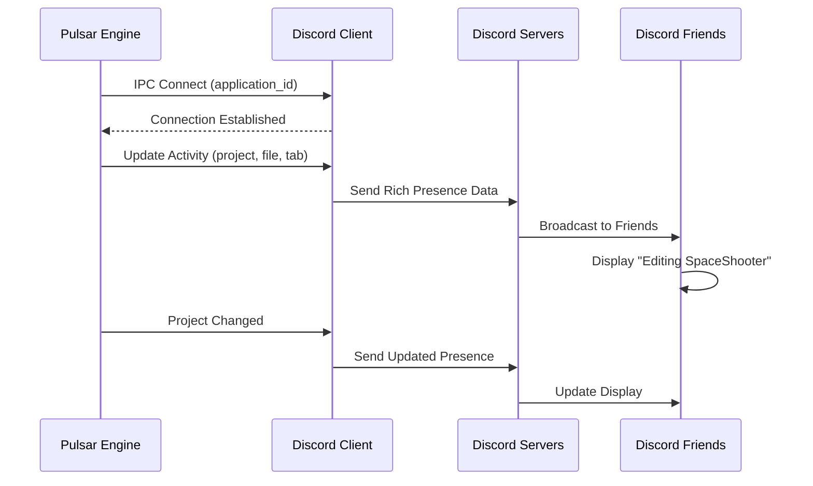

Pulsar integrates Discord Rich Presence to show your current activity in Discord's user profile. When you're working on a project, your Discord friends see exactly what you're doing—which project you have open, what file you're editing, and how long you've been working. It's a small feature that creates a sense of community and makes it easy for team members to see who's actively developing.

## What is Discord Rich Presence?

Discord Rich Presence is Discord's API for displaying detailed game activity in user profiles. Originally designed for games to show "Playing Fortnite - Battle Royale - 12 players alive", it works perfectly for development tools. Instead of just showing "Pulsar Engine", your status might display "Project: SpaceShooter | PlayerController.rs - Editing in Blueprint Editor - 2 hours 34 minutes elapsed".

The presence updates automatically as you switch between files and editor tabs. Open a different project, and your Discord status changes immediately. Close Pulsar, and the rich presence disappears. It requires no manual interaction once configured—the engine handles everything.

## How It Works

Discord Rich Presence operates through a local IPC connection between your application and the Discord client. When Pulsar starts, it attempts to connect to Discord running on the same machine. If Discord is running, the connection succeeds and Pulsar can send activity updates. If Discord isn't installed or isn't running, the connection fails silently and the engine continues normally.



The connection uses a lightweight IPC protocol specific to Discord. Your application sends JSON payloads describing the current activity, and Discord broadcasts that to your friends list. There's no polling—you send updates when state changes, and Discord handles the rest.

> [!NOTE]
> **Privacy and Control**
>
> Discord Rich Presence respects Discord's privacy settings. If you've set your status to invisible or disabled game activity in Discord settings, the presence won't display even though Pulsar is sending updates. You have full control over who sees your activity through Discord's standard privacy controls.

## Setting Up Your Discord Application

Before Pulsar can show rich presence, you need to create a Discord application and get an application ID. This is a one-time setup process.

### Creating the Application

1. Visit the [Discord Developer Portal](https://discord.com/developers/applications)
2. Click "New Application" in the top right
3. Name it "Pulsar Engine" (or whatever you prefer)
4. Click "Create"

Discord generates an application ID—a long number like `1234567890123456789`. This identifies your application to Discord's servers. Copy this ID; you'll need it for configuration.

### Uploading Rich Presence Assets

The rich presence can display custom images alongside your activity. Pulsar uses two images:

- **Large image**: The main Pulsar logo (or your custom engine logo)
- **Small image**: An icon representing the current editor panel (blueprint editor, material editor, etc.)

To upload these assets:

1. In your Discord application settings, navigate to "Rich Presence" → "Art Assets"
2. Click "Add Image(s)"
3. Upload your main logo with the key `pulsar_logo`
4. Upload editor-specific icons with keys like `blueprint_editor`, `material_editor`, `level_editor`

The key is what you reference in code—it's an identifier, not a filename. The image should be at least 512x512 pixels and in PNG or JPG format.

> [!TIP]
> **Asset Key Naming Convention**
>
> Use snake_case for asset keys: `level_editor`, `blueprint_editor`, `material_editor`. This matches Rust naming conventions and makes it easy to generate keys programmatically from panel names.
>
> Each editor panel can specify its own icon key via the `discord_icon_key()` method. When you switch panels, the small image updates automatically to show the current tool.

### Configuring Pulsar

Once you have your application ID, configure Pulsar to use it. In `crates/engine/src/main.rs`, you'll see:

```rust
const DISCORD_APP_ID: &str = "YOUR_DISCORD_APPLICATION_ID_HERE";
```

Replace the placeholder with your actual application ID:

```rust
const DISCORD_APP_ID: &str = "1234567890123456789";
```

That's it. Rebuild the engine, and Discord integration will activate automatically on startup.

## Using the Discord Integration

The Discord integration works through the `EngineContext`, making it accessible from anywhere in the engine. There are three main operations: initialization, updating presence, and querying state.

### Initialization

Discord initializes during engine startup as part of the initialization graph. The initialization happens in `main.rs`:

```rust
// Initialize Discord Rich Presence (optional, non-fatal if it fails)
if let Err(e) = context.init_discord(DISCORD_APP_ID) {
    tracing::warn!("Failed to initialize Discord: {}", e);
}
```

If Discord isn't running, `init_discord` returns an error, but the engine continues normally. The warning logs to help debug connection issues, but doesn't halt startup. This graceful degradation ensures Pulsar works even on machines without Discord installed.

### Updating Presence

Update the presence whenever significant state changes—opening a project, switching files, changing editor tabs:

```rust
use engine_state::EngineContext;

// Get the global engine context
let ctx = EngineContext::global().unwrap();

// Update all presence fields at once
ctx.update_discord_presence(
    Some("SpaceShooter".to_string()),           // Project name
    Some("Blueprint Editor".to_string()),        // Active editor tab
    Some("Scripts/PlayerController.rs".to_string()), // Current file
);
```

The presence updates immediately in Discord. If Discord isn't connected, the call silently no-ops. You can also update individual fields:

```rust
// Just update the project name
if let Some(discord) = ctx.discord() {
    discord.set_project(Some("NewProject".to_string()));
}

// Just update the active file
if let Some(discord) = ctx.discord() {
    discord.set_active_file(Some("main.rs".to_string()));
}
```

Each update triggers a full presence refresh, so avoid calling these methods in tight loops. Update when state actually changes, not on every frame.

### Custom Panel Icons

Editor panels can specify custom Discord icons that display when that panel is active. This requires implementing the `discord_icon_key()` method on your panel:

```rust
impl LevelEditorPanel {
    pub fn discord_icon_key(&self) -> Option<&'static str> {
        Some("level_editor") // Key from Discord Art Assets
    }
}
```

When the user switches to this panel, update the presence with the icon:

```rust
let icon_key = panel.discord_icon_key();

ctx.update_discord_presence_with_icon(
    Some("MyGame".into()),
    Some("Level Editor".into()),
    Some("Maps/MainLevel.map".into()),
    icon_key, // Uses "level_editor" icon
);
```

The small image in the rich presence changes to show the level editor icon, making it clear at a glance what tool the user is working in.

## Implementation Details

Understanding how the integration works internally helps debug issues and extend functionality.

### Connection Management

The `DiscordPresence` struct manages the connection to Discord:

```rust
pub struct DiscordPresence {
    inner: Arc<RwLock<DiscordPresenceInner>>,
}

struct DiscordPresenceInner {
    client: Option<DiscordClient>,
    application_id: String,
    project_name: Option<String>,
    active_tab: Option<String>,
    active_file: Option<String>,
    discord_icon_key: Option<String>,
    start_time: u128,
    enabled: bool,
}
```

The `client` field holds the actual Discord IPC connection. It's wrapped in Option because the connection might fail (Discord not running) or disconnect (user quits Discord while engine is running). The `enabled` flag tracks whether we should attempt to send updates.

Connection happens in `connect()`:

```rust
pub fn connect(&self) -> anyhow::Result<()> {
    let mut inner = self.inner.write();

    if inner.client.is_some() {
        return Ok(()); // Already connected
    }

    let mut client = DiscordClient::new(&inner.application_id);
    client.connect()?;

    inner.client = Some(client);
    inner.enabled = true;

    Ok(())
}
```

If the connection fails, the error propagates to `init_discord`, which logs it and continues. The `client` remains None, and all subsequent updates check for this before attempting to send.

### Activity Payload Format

When you update presence, Pulsar constructs a Discord Activity payload:

```rust
let state = "Editing in Blueprint Editor";
let details = "Project: SpaceShooter | PlayerController.rs";

let mut activity = Activity::new();
activity
    .set_state(Some(state.clone()))
    .set_details(Some(details.clone()))
    .set_timestamps(Some(timestamp))
    .set_activity_type(Some(ActivityType::GAME));
```

The **state** field shows in the first line of the presence (what you're doing). The **details** field shows in the second line (more context). The **timestamp** tracks elapsed time—Discord automatically displays "2 hours 34 minutes" based on this value.

The activity type is GAME, which makes sense for a game engine. Discord also supports STREAMING, LISTENING, and WATCHING, but GAME fits best for development tools.

### Icon Asset Configuration

Icons are configured through the Asset struct:

```rust
let asset = Asset::new(
    Some("pulsar_logo".into()),        // Large image key
    Some("Pulsar Engine".into()),      // Large image hover text
    Some("level_editor".into()),       // Small image key
    Some("Level Editor".into()),       // Small image hover text
);

activity.set_assets(Some(asset));
```

The large image displays as the main icon in the presence. The small image appears as a badge in the corner. Both support hover text that appears when you mouse over them in Discord.

> [!IMPORTANT]
> **Asset Keys Must Match Discord Developer Portal**
>
> The asset keys in your code ("pulsar_logo", "level_editor") must exactly match the keys you used when uploading images to the Discord Developer Portal. If there's a mismatch, Discord won't display the image.
>
> Asset keys are case-sensitive and cannot contain spaces. Use snake_case: `my_custom_icon`, not `My Custom Icon`.

### Thread Safety

The entire Discord integration is thread-safe. The `DiscordPresence` struct uses `Arc<RwLock<>>` internally, allowing multiple threads to access it concurrently:

```rust
// Thread 1: Update project
std::thread::spawn(|| {
    let ctx = EngineContext::global().unwrap();
    ctx.update_discord_presence(
        Some("Project1".into()), None, None
    );
});

// Thread 2: Update file
std::thread::spawn(|| {
    let ctx = EngineContext::global().unwrap();
    if let Some(discord) = ctx.discord() {
        discord.set_active_file(Some("file.rs".into()));
    }
});
```

Both threads can update presence simultaneously without coordination. The RwLock ensures only one write happens at a time, preventing data corruption. Reads can happen in parallel, so checking `is_enabled()` or `get_project()` doesn't block updates.

### Presence Update Batching

Each call to `set_project()`, `set_active_tab()`, or `set_active_file()` triggers a full presence update. To avoid sending multiple updates in rapid succession, use `update_all()`:

```rust
// BAD - sends 3 separate updates
discord.set_project(Some("MyProject".into()));
discord.set_active_tab(Some("Level Editor".into()));
discord.set_active_file(Some("map.level".into()));

// GOOD - sends 1 combined update
discord.update_all(
    Some("MyProject".into()),
    Some("Level Editor".into()),
    Some("map.level".into())
);
```

This reduces IPC traffic and ensures Discord sees a consistent state—all three fields update atomically rather than in three separate steps.

## Practical Integration Example

Here's how the Discord integration fits into a complete editor workflow:

```rust
use engine_state::{EngineContext, ProjectContext};
use std::path::PathBuf;

pub struct ProjectEditor {
    project_path: PathBuf,
    current_file: Option<PathBuf>,
    active_panel: Option<String>,
}

impl ProjectEditor {
    pub fn open_project(&mut self, path: PathBuf) {
        self.project_path = path.clone();

        // Update engine context
        let ctx = EngineContext::global().unwrap();
        let project = ProjectContext::new(path.clone());
        ctx.set_project(project);

        // Update Discord presence
        let project_name = path.file_name()
            .and_then(|n| n.to_str())
            .unwrap_or("Unknown");

        ctx.update_discord_presence(
            Some(project_name.to_string()),
            None, // No tab yet
            None, // No file yet
        );
    }

    pub fn open_file(&mut self, file_path: PathBuf) {
        self.current_file = Some(file_path.clone());

        // Update Discord with new file
        let ctx = EngineContext::global().unwrap();
        if let Some(discord) = ctx.discord() {
            let file_name = file_path.to_string_lossy().to_string();
            discord.set_active_file(Some(file_name));
        }
    }

    pub fn switch_panel(&mut self, panel_name: String, icon_key: Option<&'static str>) {
        self.active_panel = Some(panel_name.clone());

        // Update Discord with new panel
        let ctx = EngineContext::global().unwrap();

        let project_name = self.project_path.file_name()
            .and_then(|n| n.to_str())
            .map(|s| s.to_string());

        let file_name = self.current_file.as_ref()
            .map(|p| p.to_string_lossy().to_string());

        if let Some(discord) = ctx.discord() {
            discord.update_all_with_icon(
                project_name,
                Some(panel_name),
                file_name,
                icon_key,
            );
        }
    }

    pub fn close_project(&mut self) {
        // Clear Discord presence
        let ctx = EngineContext::global().unwrap();
        if let Some(discord) = ctx.discord() {
            discord.update_all(None, None, None);
        }

        // Clear project context
        ctx.clear_project();

        self.project_path = PathBuf::new();
        self.current_file = None;
        self.active_panel = None;
    }
}
```

This shows the typical integration pattern: update Discord whenever significant editor state changes. The presence stays synchronized with what the user is actually doing, giving Discord friends an accurate view of current work.

## Troubleshooting

### Discord Presence Not Showing

If the rich presence doesn't appear in Discord, check these common issues:

**Discord Not Running**
```rust
// Check if Discord connected
let ctx = EngineContext::global().unwrap();
if let Some(discord) = ctx.discord() {
    if discord.is_enabled() {
        println!("Discord connected");
    } else {
        println!("Discord not connected - is Discord running?");
    }
} else {
    println!("Discord integration not initialized");
}
```

The engine can't connect if Discord isn't running. Start Discord before launching Pulsar, or restart Pulsar after starting Discord.

**Wrong Application ID**

If you see errors like "Invalid application ID" in logs, verify your `DISCORD_APP_ID` constant matches the ID from the Discord Developer Portal. The ID should be a long number, not a name or URL.

**Privacy Settings**

Discord's privacy settings can hide rich presence even when it's working correctly. Check:
- Discord Settings → Activity Privacy → "Display current activity as a status message" is enabled
- You're not in invisible mode
- Game activity isn't disabled for Pulsar specifically

### Missing Icons

If the presence shows but icons don't appear:

```rust
// Check if icon key matches uploaded assets
let icon_key = "level_editor";

// Verify this exact key exists in Discord Developer Portal
// under Rich Presence → Art Assets
```

Asset keys must exactly match—case-sensitive, no typos. If you uploaded an icon with key `LevelEditor` but reference it as `level_editor`, it won't display.

### Presence Not Updating

If the presence shows initially but doesn't update when you change files:

```rust
// Verify updates are being called
tracing::debug!("Updating Discord presence...");
ctx.update_discord_presence(project, tab, file);
tracing::debug!("Update complete");
```

Check the logs. If you see "Discord presence update skipped: enabled=false", the connection dropped. This can happen if Discord quits while the engine is running. There's currently no automatic reconnection—restart the engine to reconnect.

> [!TIP]
> **Enable Debug Logging**
>
> Launch Pulsar with `--verbose` to see detailed Discord integration logs:
> ```
> pulsar.exe --verbose
> ```
>
> You'll see messages like:
> - `✅ Discord Rich Presence initialized`
> - `📤 Sending Discord presence: state='...', details='...'`
> - `✅ Discord presence updated successfully!`
> - `❌ Failed to update Discord presence: [error]`
>
> This helps identify exactly where the integration fails.

## Best Practices

### Update Strategically

Don't update Discord presence every frame or in tight loops. Update when state actually changes:

```rust
// ✅ GOOD - update when file changes
pub fn set_active_file(&mut self, file: PathBuf) {
    if self.current_file.as_ref() != Some(&file) {
        self.current_file = Some(file.clone());
        self.update_discord_file(file);
    }
}

// ❌ BAD - updates every frame
pub fn render(&mut self) {
    // This runs 60 times per second!
    self.update_discord_file(self.current_file.clone());
    // ...
}
```

Each Discord update involves IPC communication and JSON serialization. While fast, it's wasteful to do this when nothing changed.

### Handle None Gracefully

Always handle the case where Discord isn't initialized:

```rust
// ✅ GOOD - checks if discord exists
if let Some(discord) = ctx.discord() {
    discord.update_all(project, tab, file);
}

// ❌ BAD - panics if Discord not initialized
ctx.discord().unwrap().update_all(project, tab, file);
```

Discord integration is optional—the engine works fine without it. Unwrapping causes crashes on systems without Discord installed.

### Use Descriptive States

Make the state and details fields informative:

```rust
// ✅ GOOD - clear and specific
state: "Editing Blueprint"
details: "Project: SpaceShooter | PlayerController.bp"

// ❌ BAD - vague or redundant
state: "Working"
details: "Using Pulsar Engine"
```

The presence is most useful when it gives specific context. "Editing Blueprint" tells your team members you're actively working, while "Using Pulsar Engine" is obvious from the app icon.

### Clear Presence on Exit

When the user closes a project or quits the editor, clear the presence:

```rust
impl Drop for ProjectEditor {
    fn drop(&mut self) {
        // Clear Discord presence on cleanup
        let ctx = EngineContext::global().unwrap();
        if let Some(discord) = ctx.discord() {
            discord.update_all(None, None, None);
        }
    }
}
```

This ensures your Discord status doesn't show "Editing SpaceShooter" hours after you've closed the project. The presence should accurately reflect current activity.

## Performance Considerations

The Discord integration has minimal performance impact:

**Connection Setup**: Happens once at startup, takes 10-20 milliseconds. This includes IPC handshake and initial presence send.

**Presence Updates**: Each update takes 1-5 milliseconds—mostly JSON serialization and IPC write. The Discord client handles the network communication asynchronously, so there's no waiting for servers.

**Memory Overhead**: The DiscordPresence struct uses about 200 bytes plus the size of the current strings (project name, file path, etc.). For typical projects, total memory usage is under 1KB.

**No Polling**: Pulsar never polls Discord for status. All communication is push-based—send updates when state changes, nothing else. There are no background threads or timers consuming CPU.

The integration is designed to be completely unobtrusive. Enable it, forget about it, and let it work in the background.

## Related Documentation

- [Engine State Management](./engine-state) - How EngineContext stores and provides Discord integration
- [Subsystems](./subsystems) - Central subsystem loading where Discord initializes
- [Architecture](./architecture) - Overall engine architecture and IPC communication patterns
