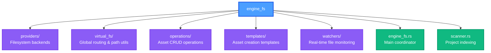
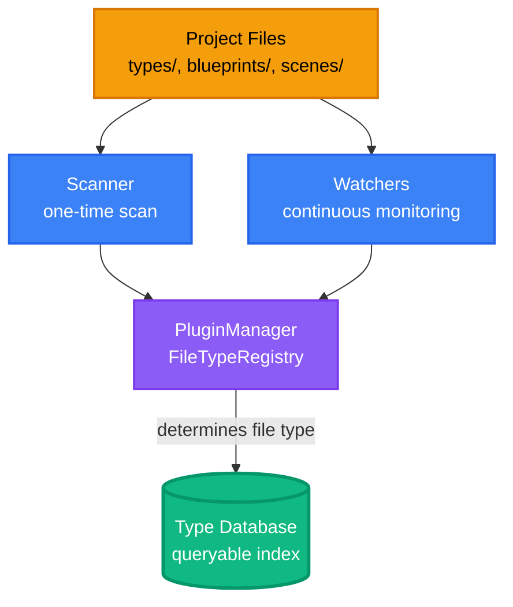
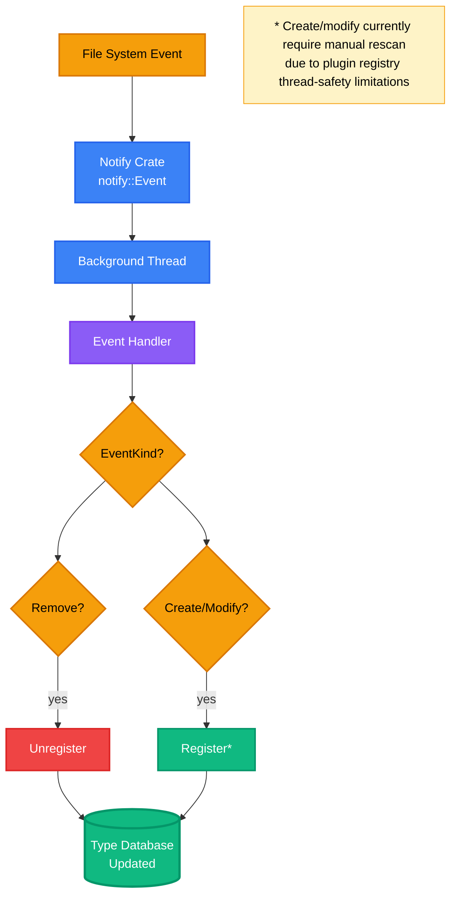

# Engine Filesystem

The engine filesystem (`engine_fs`) is Pulsar's centralized asset management layer. It provides a unified interface for file operations, automatic asset indexing, and seamless switching between local disk and remote cloud storage. The crate lives in `crates/engine_fs/` and serves as the bridge between raw file I/O and Pulsar's type system.

## Architecture Overview

The `engine_fs` crate is organized into focused modules that each handle a specific aspect of filesystem management:



### Module Responsibilities

| Module | Purpose | Key Types |
|--------|---------|-----------|
| **providers** | Abstract filesystem backends to support both local disk and remote servers | `FsProvider`, `LocalFsProvider`, `RemoteFsProvider` |
| **virtual_fs** | Route all file I/O through a global provider that can be swapped at runtime | `set_provider()`, `read_file()`, `write_file()` |
| **operations** | Coordinate asset operations while maintaining type database consistency | `AssetOperations`, `TypeOperations`, `GeneralOperations` |
| **templates** | Define asset types and generate initial content for new files | `AssetKind`, `AssetCategory`, `TemplateGenerator` |
| **watchers** | Monitor filesystem changes and update the type database in real-time | `start_watcher()` |
| **engine_fs** | Main entry point that orchestrates scanning, indexing, and watching | `EngineFs` |
| **scanner** | Walk project directories to build the initial asset index | `ProjectScanner` |

## How It Works

When you open a Pulsar project, the engine filesystem performs three key tasks:

**1. Scanning** — The `ProjectScanner` walks the project directory tree, identifies asset files by their extensions and paths, and registers them in the type database.

**2. Indexing** — Each discovered asset is registered with the `TypeDatabase`, making it instantly queryable by name, type, or path. This powers features like type autocompletion and asset search.

**3. Watching** — A background thread monitors filesystem events (create, modify, delete) and incrementally updates the index as files change, keeping everything synchronized without manual rescanning.

### Data Flow Diagram



## The EngineFs Coordinator

The `EngineFs` struct is your main entry point. It coordinates scanning, indexing, and provides access to operations:

```rust
use engine_fs::EngineFs;

// Create and scan a project
let mut engine_fs = EngineFs::new(project_root)?;

// Access the indexed types
let type_db = engine_fs.type_database();
let all_structs = type_db.get_by_kind(TypeKind::Struct);

// Perform asset operations
let ops = engine_fs.operations();
ops.create_asset(AssetKind::Scene, "MainMenu", None)?;

// Start real-time monitoring
engine_fs.start_watching()?;
```

The initial `new()` call triggers a full project scan, so all existing assets are immediately indexed and ready for queries.

## Provider Abstraction

At the heart of `engine_fs` is the `FsProvider` trait, which abstracts all filesystem operations. This allows Pulsar to work with both local files and remote cloud storage using identical code.

### Provider Trait

```rust
pub trait FsProvider: Send + Sync + 'static {
    fn read_file(&self, path: &Path) -> Result<Vec<u8>>;
    fn write_file(&self, path: &Path, content: &[u8]) -> Result<()>;
    fn create_file(&self, path: &Path, content: &[u8]) -> Result<()>;
    fn delete_path(&self, path: &Path) -> Result<()>;
    fn rename(&self, from: &Path, to: &Path) -> Result<()>;
    fn list_dir(&self, path: &Path) -> Result<Vec<FsEntry>>;
    fn create_dir_all(&self, path: &Path) -> Result<()>;
    fn exists(&self, path: &Path) -> Result<bool>;
    fn metadata(&self, path: &Path) -> Result<FsMetadata>;
    fn manifest(&self, path: &Path) -> Result<Vec<ManifestEntry>>;
}
```

### Available Providers

| Provider | Use Case | Network | Latency |
|----------|----------|---------|---------|
| `LocalFsProvider` | Local disk projects | None | ~µs |
| `RemoteFsProvider` | Cloud-hosted projects on `pulsar-host` | HTTP/HTTPS | ~10-100ms |

The `RemoteFsProvider` communicates with a `pulsar-host` server over HTTP, translating file operations into REST API calls. This enables collaborative cloud-based workflows without changing any editor code.

## Cloud Projects

When opening a cloud project, paths use a special URI scheme:

```
cloud+pulsar://studio.example.com:7700/project-uuid/path/to/file.json
```

The `virtual_fs` module detects these paths and routes all operations through the remote provider. From the editor's perspective, cloud files look and behave exactly like local files.

### Switching Providers

```rust
use engine_fs::virtual_fs;
use engine_fs::{RemoteFsProvider, RemoteConfig};

// Parse cloud path and extract connection info
let config = RemoteConfig::from_cloud_path(path)
    .expect("Invalid cloud path")
    .with_token(Some(auth_token));

// Switch to remote provider
let remote = Arc::new(RemoteFsProvider::new(config));
virtual_fs::set_provider(remote);

// All subsequent virtual_fs calls now target the remote server
virtual_fs::write_file(path, b"content")?;
virtual_fs::list_dir(dir)?;

// Switch back to local when disconnecting
virtual_fs::reset_to_local();
```

Once the provider is swapped, all code using `virtual_fs` functions automatically works with the new backend. No conditional logic needed.

## Asset Operations

The `AssetOperations` coordinator provides high-level APIs for managing assets while ensuring the type database stays synchronized. Operations are split into type-specific and general handlers.

### Type Alias Operations

Type aliases receive special treatment because they're heavily used in the type system:

```rust
let ops = engine_fs.operations();

// Create a new type alias
let path = ops.create_type_alias("Vector3", r#"{
    "name": "Vector3",
    "display_name": "3D Vector",
    "description": "Three-component float vector",
    "ast": {
        "nodeKind": "Tuple",
        "elements": [
            {"nodeKind": "Primitive", "name": "f32"},
            {"nodeKind": "Primitive", "name": "f32"},
            {"nodeKind": "Primitive", "name": "f32"}
        ]
    }
}"#)?;
// → Creates types/aliases/Vector3.alias.json
// → Registers in type database as "Vector3" (Alias)

// Update the alias
ops.update_type_alias(&path, updated_json)?;
// → Validates JSON, checks name uniqueness
// → Writes file, updates type database

// Move/rename the alias
ops.move_type_alias(&path, &new_path)?;
// → Unregisters old path, renames file
// → Registers new path with updated name

// Delete the alias
ops.delete_type_alias(&path)?;
// → Unregisters from type database
// → Deletes file
```

Every operation maintains consistency: the file and index are always updated together.

### General Asset Operations

For other asset types, use the general operations:

```rust
// Create a scene
let scene_path = ops.create_asset(
    AssetKind::Scene,
    "MainMenu",
    None  // Use default directory (scenes/)
)?;
// → Creates scenes/MainMenu.scene.json with template content

// Create a shader in a custom location
let shader_path = ops.create_asset(
    AssetKind::Shader,
    "Hologram",
    Some("shaders/experimental")
)?;
// → Creates shaders/experimental/Hologram.shader.wgsl

// Move any asset
ops.move_asset(&old_path, &new_path)?;

// Delete any asset
ops.delete_asset(&path)?;
```

The `create_asset()` method automatically generates appropriate template content based on the asset kind.

## Asset Templates

Every asset type has a predefined template and default location. The `AssetKind` enum defines all supported types:

```rust
pub enum AssetKind {
    // Type System
    TypeAlias, Struct, Enum, Trait,

    // Blueprint System
    Blueprint, BlueprintClass, BlueprintFunction,

    // Scripts
    RustScript, LuaScript,

    // Scenes
    Scene, Prefab,

    // Materials & Shaders
    Material, Shader,

    // Audio
    AudioSource, AudioMixer,

    // UI
    UILayout, UITheme,

    // Data
    DataTable, JsonData,

    // Config
    ProjectConfig, EditorConfig,
}
```

### Asset Metadata Table

| Asset Kind | Extension | Default Directory | Description |
|------------|-----------|-------------------|-------------|
| `TypeAlias` | `.alias.json` | `types/aliases` | Reusable type definition |
| `Struct` | `.struct.json` | `types/structs` | Data structure |
| `Enum` | `.enum.json` | `types/enums` | Enumeration type |
| `Blueprint` | `.blueprint.json` | `blueprints` | Visual script |
| `RustScript` | `.rs` | `scripts/rust` | Rust code file |
| `LuaScript` | `.lua` | `scripts/lua` | Lua script |
| `Scene` | `.scene.json` | `scenes` | Game scene |
| `Material` | `.mat.json` | `materials` | Material definition |
| `Shader` | `.shader.wgsl` | `shaders` | WGSL shader |
| `DataTable` | `.table.db` | `data/tables` | SQLite database |

### Accessing Metadata

```rust
let kind = AssetKind::Shader;

println!("Extension: {}", kind.extension());       // "shader.wgsl"
println!("Directory: {}", kind.default_directory()); // "shaders"
println!("Display: {}", kind.display_name());       // "Shader"
println!("Icon: {}", kind.icon());                  // "✨"

// Generate template content
let content = kind.generate_template("MyShader");
```

### Organizing by Category

Assets are grouped into categories for UI organization:

```rust
pub enum AssetCategory {
    TypeSystem,    // Types, structs, enums, traits
    Blueprints,    // Visual scripting
    Scripts,       // Code files
    Scenes,        // Scenes and prefabs
    Rendering,     // Materials and shaders
    Audio,         // Audio sources and mixers
    UI,            // Layouts and themes
    Data,          // Tables and JSON
    Config,        // Configuration files
}

// Get all asset kinds in a category
let rendering_assets = AssetKind::by_category(AssetCategory::Rendering);
// → [AssetKind::Material, AssetKind::Shader]
```

## Real-Time File Watching

The `watchers` module monitors filesystem events and keeps the type database synchronized as files change:

```rust
use engine_fs::watchers;

watchers::start_watcher(
    project_root.clone(),
    type_database.clone()
)?;
```

This spawns a background thread that listens for:

**Create Events** — New files are identified by the plugin manager's file type registry and registered in the type database.

**Modify Events** — Currently logged but not acted upon (requires manual rescan). Future versions will re-index changed files.

**Remove Events** — Deleted files are immediately unregistered from the type database.

The watcher runs continuously until the project closes, providing near-instant index updates as you work.

### Event Handling Flow



## Project Structure Convention

Pulsar projects follow a standard directory layout that the filesystem expects:

```mermaid
graph TD
    root[MyProject/]

    root --> types[types/]
    root --> blueprints[blueprints/]
    root --> scripts[scripts/]
    root --> scenes[scenes/]
    root --> materials[materials/]
    root --> shaders[shaders/]
    root --> data[data/]
    root --> config[config/]

    types --> aliases[aliases/]
    types --> structs[structs/]
    types --> enums[enums/]

    aliases --> vec3[Vector3.alias.json]

    structs --> player[Player/]
    player --> pstruct[struct.json]

    enums --> gamestate[GameState/]
    gamestate --> genum[enum.json]

    blueprints --> classes[classes/]
    blueprints --> functions[functions/]

    scripts --> rust[rust/]
    scripts --> lua[lua/]
    rust --> pcontroller[player_controller.rs]
    lua --> gamelogic[game_logic.lua]

    scenes --> menu[MainMenu.scene.json]
    materials --> holo[Hologram.mat.json]
    shaders --> holoshader[Hologram.shader.wgsl]

    data --> tables[tables/]
    tables --> weapons[weapons.table.db]

    config --> project[project.toml]

    style root fill:#4a9eff,stroke:#2563eb,stroke-width:3px,color:#fff
    style types fill:#8b5cf6,stroke:#7c3aed,stroke-width:2px,color:#fff
    style blueprints fill:#8b5cf6,stroke:#7c3aed,stroke-width:2px,color:#fff
    style scripts fill:#8b5cf6,stroke:#7c3aed,stroke-width:2px,color:#fff
    style scenes fill:#8b5cf6,stroke:#7c3aed,stroke-width:2px,color:#fff
    style materials fill:#8b5cf6,stroke:#7c3aed,stroke-width:2px,color:#fff
    style shaders fill:#8b5cf6,stroke:#7c3aed,stroke-width:2px,color:#fff
    style data fill:#8b5cf6,stroke:#7c3aed,stroke-width:2px,color:#fff
    style config fill:#8b5cf6,stroke:#7c3aed,stroke-width:2px,color:#fff

    style vec3 fill:#10b981,stroke:#059669,stroke-width:1px,color:#fff
    style pstruct fill:#10b981,stroke:#059669,stroke-width:1px,color:#fff
    style genum fill:#10b981,stroke:#059669,stroke-width:1px,color:#fff
    style pcontroller fill:#10b981,stroke:#059669,stroke-width:1px,color:#fff
    style gamelogic fill:#10b981,stroke:#059669,stroke-width:1px,color:#fff
    style menu fill:#10b981,stroke:#059669,stroke-width:1px,color:#fff
    style holo fill:#10b981,stroke:#059669,stroke-width:1px,color:#fff
    style holoshader fill:#10b981,stroke:#059669,stroke-width:1px,color:#fff
    style weapons fill:#10b981,stroke:#059669,stroke-width:1px,color:#fff
    style project fill:#10b981,stroke:#059669,stroke-width:1px,color:#fff
```



The scanner identifies assets by matching file extensions and paths against the plugin manager's file type registry. This convention-based approach means moving files between directories doesn't break references as long as the file type is recognizable.

## Type Registration

When the scanner or watcher encounters a file, it uses the plugin manager to determine the file type:

```rust
// From scanner.rs
fn register_asset(&self, path: PathBuf) -> Result<()> {
    if let Some(plugin_manager) = plugin_manager::global() {
        if let Ok(pm) = plugin_manager.read() {
            // Ask plugin manager what file type this is
            if let Some(file_type_id) = pm.file_type_registry()
                .get_file_type_for_path(&path)
            {
                if let Some(file_type_def) = pm.file_type_registry()
                    .get_file_type(&file_type_id)
                {
                    // Extract type name from path
                    let type_name = path.parent()
                        .and_then(|p| p.file_name())
                        .and_then(|n| n.to_str())
                        .or_else(|| path.file_stem().and_then(|n| n.to_str()))
                        .unwrap_or("unknown")
                        .to_string();

                    // Register in type database
                    self.type_database.register_with_path(
                        type_name,
                        path,
                        file_type_id,
                        None,
                        Some(format!("{}: {}",
                            file_type_def.display_name,
                            type_name
                        )),
                        None,
                    )?;
                }
            }
        }
    }
    Ok(())
}
```

This plugin-based approach means new asset types can be added without modifying `engine_fs` — just register a new file type in the plugin manager.

## Path Utilities

The `virtual_fs::path_utils` module provides helpers for working with cloud paths:

```rust
use engine_fs::virtual_fs::path_utils;

// Check if a path is a cloud path
if path_utils::is_cloud_path(&path) {
    println!("This is a remote file");
}

// Normalize paths (backslashes → forward slashes)
let normalized = path_utils::normalize_path(&path);

// Join cloud paths correctly (always uses forward slashes)
let full_path = path_utils::cloud_join(
    "cloud+pulsar://host/project",
    "scenes/MainMenu.scene.json"
);
// → "cloud+pulsar://host/project/scenes/MainMenu.scene.json"
```

These utilities handle the cross-platform complexity of Windows backslashes vs. Unix forward slashes, ensuring cloud paths are always valid URIs.

## Complete Usage Example

Putting it all together — here's how you'd set up filesystem management for a project:

```rust
use engine_fs::{EngineFs, AssetKind, virtual_fs};
use std::path::PathBuf;

fn setup_project(project_root: PathBuf) -> anyhow::Result<()> {
    // Initialize filesystem and scan project
    let mut engine_fs = EngineFs::new(project_root.clone())?;

    // Start real-time monitoring
    engine_fs.start_watching()?;

    // Create some assets
    let ops = engine_fs.operations();

    ops.create_asset(
        AssetKind::Scene,
        "GameLevel1",
        None
    )?;

    ops.create_type_alias("Health", r#"{
        "name": "Health",
        "ast": {"nodeKind": "Primitive", "name": "f32"}
    }"#)?;

    // Query the indexed types
    let type_db = engine_fs.type_database();
    let all_scenes = type_db.get_by_file_type("scene");
    let health_type = type_db.get_by_name("Health");

    println!("Found {} scenes", all_scenes.len());
    println!("Health type: {:?}", health_type);

    // Files created above are now automatically indexed
    // and the watcher will track any future changes

    Ok(())
}
```

## Cloud Project Example

Opening a cloud-hosted project:

```rust
use engine_fs::{EngineFs, RemoteFsProvider, RemoteConfig, virtual_fs};
use std::path::PathBuf;

fn open_cloud_project(
    cloud_path: PathBuf,
    auth_token: String
) -> anyhow::Result<()> {
    // Parse cloud path to extract server and project ID
    let config = RemoteConfig::from_cloud_path(&cloud_path)
        .expect("Invalid cloud path")
        .with_token(Some(auth_token));

    // Switch global provider to remote
    let remote = std::sync::Arc::new(RemoteFsProvider::new(config));
    virtual_fs::set_provider(remote);

    // Now initialize EngineFs — it will use the remote provider
    let mut engine_fs = EngineFs::new(cloud_path)?;

    // All operations now happen over HTTP to the remote server
    engine_fs.start_watching()?;

    let ops = engine_fs.operations();
    ops.create_asset(AssetKind::Scene, "CloudScene", None)?;

    // When done, switch back to local
    virtual_fs::reset_to_local();

    Ok(())
}
```

The beauty of the provider abstraction is that `EngineFs` and all operations work identically whether the files are local or remote.

## Performance Characteristics

Understanding the performance trade-offs of different operations:

| Operation | Local Provider | Remote Provider | Notes |
|-----------|----------------|-----------------|-------|
| Initial scan | ~50-500ms | ~2-10s | Depends on project size; remote does full manifest fetch |
| Single file read | <1ms | ~50-200ms | Network latency dominates for remote |
| Single file write | ~1-5ms | ~50-300ms | Remote includes serialization + HTTP round-trip |
| Directory listing | <1ms | ~50-200ms | Remote caches aggressively when possible |
| Watcher event | <1ms | N/A | Watchers only work for local projects (For now) |

For cloud projects, operations are batched when possible to minimize round-trips. The `manifest()` call, for example, fetches the entire project tree in a single HTTP request instead of recursively calling `list_dir()`.

## Future Enhancements

The engine filesystem is actively evolving. Planned improvements include:

**Full Watcher Support** — Once the plugin manager becomes `Send`-safe, watchers will be able to re-index modified files automatically instead of requiring manual rescans.

**Optimistic Local Caching** — For remote projects, maintain a local cache of frequently accessed files to reduce latency and enable offline work.

**Batch Operations API** — Allow creating/updating multiple assets in a single transaction to improve performance for bulk operations.

**Change Detection** — Track file modification times and content hashes to avoid unnecessary re-indexing of unchanged files.

**Parallel Scanning** — Use multiple threads during initial project scan to speed up indexing for large projects.
