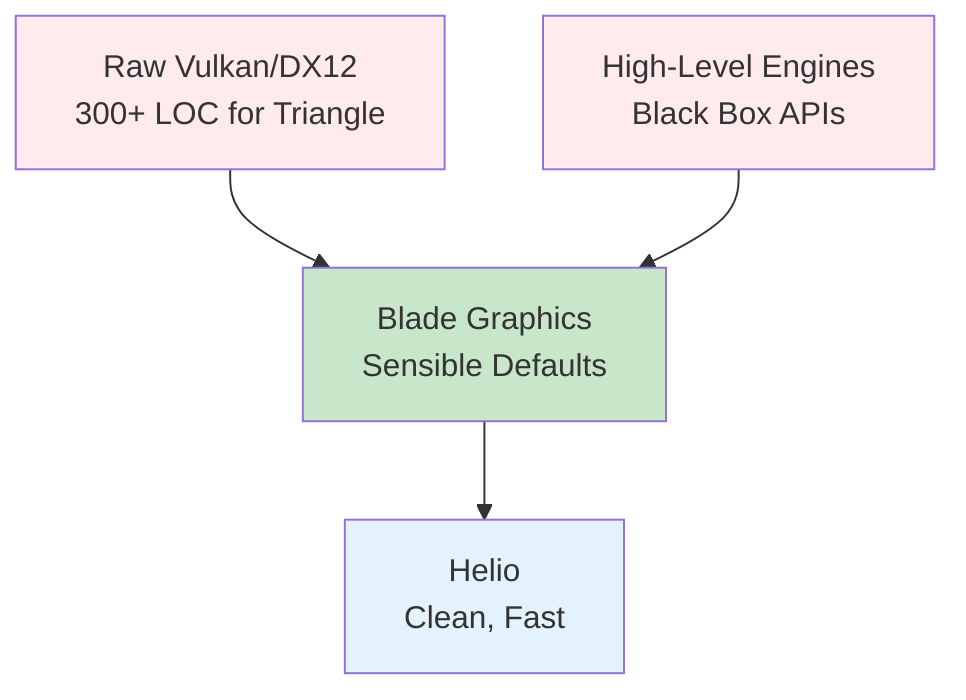

Helio builds on blade-graphics, a modern GPU abstraction layer providing unified access to DirectX 12, Vulkan, and Metal through a single Rust API. Unlike heavyweight engines (Unity, Unreal) that dictate architecture, or bare-metal APIs (raw Vulkan, DX12) that require hundreds of lines of boilerplate for basic operations, blade occupies a middle ground—minimal overhead while handling platform differences. Helio uses blade for all GPU operations: resource creation, command encoding, pipeline management, and frame presentation. This document explains blade's design philosophy, how Helio leverages it, and when to bypass abstractions for platform-specific optimizations.

## Why Blade Graphics



Modern graphics APIs provide immense control but with complexity. Vulkan requires explicitly managing memory allocations, synchronization primitives (fences, semaphores), descriptor sets, command buffer pools, and pipeline state objects. A simple triangle requires 300+ lines of carefully ordered initialization. DirectX 12 is similar. Metal is slightly higher-level but still verbose. For production engines, this control is valuable—fine-tuning memory allocations or synchronization can save milliseconds per frame. For research projects, prototypes, or small teams, the complexity slows iteration.

> [!TIP]
> Blade-graphics occupies the sweet spot between raw APIs (too verbose) and heavyweight engines (too opaque). It provides 90% convenience with 10% escape hatches for performance tuning.

Blade-graphics solves this by providing sensible defaults and automating common patterns. Memory allocation is automatic—create a buffer, blade allocates memory, binds it, and maps it if needed. Synchronization is implicit—submit commands, blade inserts appropriate barriers and fences. Descriptor management is simplified—bind resources directly rather than managing descriptor sets and pools. The result feels like using a higher-level API (WebGPU, wgpu) but with lower overhead and tighter control when needed.

> [!TIP]
> Blade handles the "hard but boring" parts of GPU programming—memory management, synchronization, descriptor sets—so you can focus on the "interesting but hard" parts—rendering algorithms, performance tuning, visual quality.

The key insight is that most applications don't need fine-grained control most of the time. Blade handles the 90% case well, and exposes lower-level controls for the 10% where performance tuning matters. Helio operates entirely in the 90% case—the feature system, shader composition, and rendering infrastructure require no platform-specific code. Blade abstracts platform differences completely, enabling Helio to run on Windows, Linux, and macOS without modification.

## Blade Context Architecture

The `gpu::Context` is the central interface to GPU operations:

```rust
use blade_graphics as gpu;

let context = Arc::new(unsafe {
    gpu::Context::init(gpu::ContextDesc {
        validation: cfg!(debug_assertions),
        capture: false,
        overlay: false,
    }).expect("Failed to initialize GPU context")
});
```

Context initialization is unsafe because it accesses global driver state and initializes graphics APIs. The `ContextDesc` specifies configuration. **validation** enables API validation layers (debug checks for incorrect usage). Enabled in debug builds (`cfg!(debug_assertions)`), disabled in release for performance. **capture** enables GPU capture tools (RenderDoc, Xcode Metal Debugger). **overlay** enables debug overlays showing GPU stats. Both are disabled by default.

Initialization chooses the appropriate backend for the platform. On Windows, blade defaults to DirectX 12 (with Vulkan fallback if DX12 unavailable). On Linux, Vulkan. On macOS, Metal. The choice is automatic and transparent—Helio code is identical across platforms.

The context is reference-counted (`Arc`) for sharing across threads. Helio stores it in renderers, features, and other components. Multiple components can access the GPU simultaneously without ownership conflicts.

### Platform Selection

Blade selects platforms via feature flags in Cargo.toml:

```toml
[dependencies]
blade-graphics = { version = "0.4", features = ["vulkan"] }
```

Specifying `features = ["vulkan"]` forces Vulkan on all platforms. Omitting features uses platform defaults. Specifying multiple features (e.g., `["vulkan", "dx12"]`) enables runtime selection—blade checks available APIs and chooses the best one.

For maximum compatibility, use default features. For maximum control, specify explicit backends. Helio uses defaults, trusting blade's heuristics to choose appropriately.

## Resource Management

Blade simplifies resource creation while providing low-level access when needed.

### Buffer Creation

Buffers store vertex data, index data, uniforms, and other CPU-to-GPU data:

```rust
let vertex_data: Vec<PackedVertex> = generate_cube();
let vertex_buffer = context.create_buffer(gpu::BufferDesc {
    name: "vertex_buffer",
    size: (vertex_data.len() * std::mem::size_of::<PackedVertex>()) as u64,
    memory: gpu::Memory::Shared,
});

// Upload data
let mut staging = context.map_buffer(vertex_buffer);
staging.data.copy_from_slice(bytemuck::cast_slice(&vertex_data));
context.unmap_buffer(staging);
```

The `BufferDesc` specifies name (for debugging), size in bytes, and memory type. **Memory::Shared** means CPU and GPU both access the buffer—the CPU writes data, the GPU reads it. This is implemented as upload heap on DX12, host-visible memory on Vulkan, and shared memory on Metal. Blade handles platform differences automatically.

Mapping (`map_buffer`) locks the buffer and returns a slice. Copying data via `copy_from_slice` fills the buffer. Unmapping (`unmap_buffer`) unlocks and makes the data visible to the GPU. Blade inserts necessary barriers and cache flushes automatically—no explicit synchronization needed.

> [!NOTE]
> Blade's automatic buffer mapping is perfect for small uniform data. For large buffers or frequent updates, consider persistent mapped buffers that stay mapped across frames—avoiding map/unmap overhead.

Alternative memory types: **Memory::Device** for GPU-only memory (higher performance, not CPU-accessible), and **Memory::Upload** for streaming data (frequently updated CPU-to-GPU). Blade chooses appropriate underlying allocations for each type.

### Texture Creation

Textures store image data—color textures, depth buffers, shadow maps, light maps:

```rust
let texture = context.create_texture(gpu::TextureDesc {
    name: "albedo",
    format: gpu::TextureFormat::Rgba8UnormSrgb,
    size: gpu::Extent { width: 1024, height: 1024, depth: 1 },
    dimension: gpu::TextureDimension::D2,
    array_layer_count: 1,
    mip_level_count: 1,
    usage: gpu::TextureUsage::COPY | gpu::TextureUsage::RESOURCE,
    sample_count: 1,
    external: None,
});
```

The descriptor specifies format (color format, depth format, compressed formats), size (width/height/depth), dimension (1D, 2D, 3D, or Cube), array layers (for texture arrays), mip levels (for mipmapping), usage flags (how the texture will be used), and sample count (for MSAA).

**Format Selection**: `Rgba8UnormSrgb` is standard for color textures—8 bits per channel, gamma-corrected. `Depth32Float` is standard for depth buffers. `Bc1RgbUnormSrgb` (DXT1) and similar are compressed formats saving memory. Blade validates format support and falls back to compatible formats if needed.

**Usage Flags**: `COPY` enables uploading data to the texture. `RESOURCE` enables sampling in shaders. `TARGET` enables rendering into the texture (render target or depth target). Combine flags with bitwise OR: `COPY | RESOURCE` for a texture that's uploaded once then sampled repeatedly.

**External Textures**: Setting `external: Some(...)` wraps an existing platform texture (e.g., a swapchain image from winit). Helio uses this for rendering to the window surface—winit creates the surface, blade wraps it, Helio renders to it.

### Resource Destruction

Blade uses explicit destruction rather than automatic reference counting:

```rust
context.destroy_texture(texture);
context.destroy_buffer(buffer);
```

This provides control over resource lifetimes. Dropping a resource immediately queues it for destruction. Blade defers actual destruction until the GPU finishes using the resource—internally maintaining a list of pending deletions synchronized with GPU completion fences.

This avoids use-after-free bugs (destroying a resource the GPU is still reading) without requiring manual fence management. Applications destroy resources when done, and blade handles timing automatically.

> [!IMPORTANT]
> Blade's deferred destruction means you can safely destroy resources immediately after use—blade tracks GPU completion and only frees memory once the GPU finishes. No manual fence management required.

Helio's features implement cleanup methods that destroy GPU resources:

```rust
impl Feature for MyFeature {
    fn cleanup(&mut self, context: &FeatureContext) {
        if let Some(texture) = self.texture.take() {
            context.gpu.destroy_texture(texture);
        }
    }
}
```

The `Option::take()` pattern moves the resource out of the option, leaving `None` behind. This ensures idempotent cleanup—calling cleanup multiple times is safe, as subsequent calls find `None` and do nothing.

## Command Encoding

GPU work is encoded into command buffers then submitted for execution.

### Command Encoder

The encoder records GPU commands:

```rust
let mut encoder = context.create_command_encoder(gpu::CommandEncoderDesc {
    name: "frame",
    buffer_count: 1,
});

// Record commands...

context.submit(&mut encoder);
```

Creating an encoder is cheap—allocating from a pool rather than system allocation. The `buffer_count` specifies how many command buffers to allocate in the encoder. Most applications use 1, but parallel command recording might use more.

Commands are recorded in CPU-side buffers, not executed immediately. Recording is fast (nanoseconds per command). Execution happens when the encoder is submitted. This split allows building complex command sequences and optimizing them before execution.

### Render Passes

Render passes define rendering into textures:

```rust
let mut pass = encoder.render(
    "main_pass",
    gpu::RenderTargetSet {
        colors: &[gpu::RenderTarget {
            view: surface_view,
            init_op: gpu::InitOp::Clear(gpu::TextureColor::OpaqueBlack),
            finish_op: gpu::FinishOp::Store,
        }],
        depth_stencil: Some(gpu::RenderTarget {
            view: depth_view,
            init_op: gpu::InitOp::Clear(gpu::TextureColor::White),
            finish_op: gpu::FinishOp::Discard,
        }),
    },
);
```

The `RenderTargetSet` specifies where to render. **colors** is an array of color targets—multiple targets enable MRT (multiple render targets) for deferred rendering. **depth_stencil** is an optional depth/stencil target.

Each target specifies a view (which texture to render into), an init operation (how to initialize the target before rendering), and a finish operation (what to do with results after rendering).

**InitOp::Clear** fills the target with a color. `OpaqueBlack` is `(0, 0, 0, 1)` for color targets. `White` is `(1, 1, 1, 1)`, appropriate for depth (1.0 is maximum depth, farthest from camera). **InitOp::Load** preserves existing contents—useful for rendering multiple passes into the same target.

**FinishOp::Store** saves results to memory—necessary when the target will be read later (post-processing, next frame). **FinishOp::Discard** discards results—useful for depth buffers that only matter during the current frame. Discard is a performance hint allowing tiled GPUs (mobile, Apple Silicon) to avoid writing tile data to main memory.

### Render Commands

Within a render pass, bind pipelines and resources, then draw:

```rust
let mut rc = pass.with(&pipeline);
rc.bind(0, &scene_data);

for mesh in meshes {
    rc.bind(1, &mesh.object_data);
    rc.bind_vertex(0, mesh.vertex_buffer);
    rc.draw_indexed(mesh.index_buffer, gpu::IndexType::U32, mesh.index_count, 0, 0, 1);
}
```

The `pass.with(&pipeline)` call binds a render pipeline, configuring all GPU state (shaders, vertex layout, depth testing, blending). The returned `rc` (render commands) object provides methods for binding resources and drawing.

**rc.bind(group, data)** binds uniform data at the specified bind group. Blade automatically allocates a temporary buffer, uploads the data, and binds it. This is convenient for small, per-frame data (camera uniforms, object transforms). For large or persistent data, create an explicit buffer and bind via `rc.bind_buffer`.

**rc.bind_vertex(slot, buffer)** binds a vertex buffer at the specified slot. Multiple vertex buffers can be bound at different slots (interleaved vertex data, instancing data). Most applications use a single vertex buffer at slot 0.

**rc.draw_indexed** executes an indexed draw call. Parameters specify the index buffer (which triangles to draw), index type (U16 or U32), index count (how many indices to process), base vertex offset (added to each index), first index offset (starting position in index buffer), and instance count (for instancing—draw multiple copies in one call).

### Compute Dispatches

Compute shaders are dispatched similarly:

```rust
let mut pass = encoder.compute("compute_pass");
let mut cc = pass.with(&compute_pipeline);
cc.bind(0, &compute_data);
cc.dispatch(workgroups_x, workgroups_y, workgroups_z);
```

Compute passes don't render to textures—they perform arbitrary GPU computation. The dispatch specifies workgroup counts in three dimensions. The compute shader defines workgroup size (e.g., 16×16 threads). Dispatching (64, 64, 1) workgroups with (16, 16, 1) threads each executes 1024×1024 threads total—useful for processing 1024×1024 images.

Helio doesn't currently use compute extensively, but features could add compute passes for procedural generation, physics simulation, or post-processing effects.

## Pipeline Management

Pipelines encapsulate all GPU rendering state.

### Render Pipeline Creation

Render pipelines define shaders and rendering configuration:

```rust
let pipeline = context.create_render_pipeline(gpu::RenderPipelineDesc {
    name: "main",
    data_layouts: &[&scene_layout, &object_layout],
    vertex: shader.at("vs_main"),
    vertex_fetches: &[gpu::VertexFetchState {
        layout: &<PackedVertex as gpu::Vertex>::layout(),
        instanced: false,
    }],
    primitive: gpu::PrimitiveState {
        topology: gpu::PrimitiveTopology::TriangleList,
        front_face: gpu::FrontFace::Ccw,
        cull_mode: Some(gpu::Face::Back),
        ..Default::default()
    },
    depth_stencil: Some(gpu::DepthStencilState {
        format: gpu::TextureFormat::Depth32Float,
        depth_write_enabled: true,
        depth_compare: gpu::CompareFunction::Less,
        stencil: Default::default(),
        bias: Default::default(),
    }),
    fragment: Some(shader.at("fs_main")),
    color_targets: &[gpu::ColorTargetState {
        format: surface_format,
        blend: None,
        write_mask: gpu::ColorWrites::default(),
    }],
    multisample_state: gpu::MultisampleState::default(),
});
```

The descriptor is comprehensive but composable. **data_layouts** specifies bind groups—bind group 0 uses scene_layout, group 1 uses object_layout. Layouts describe uniform buffer structures, texture bindings, and sampler bindings.

**vertex** and **fragment** specify shader entry points. The `shader.at("vs_main")` syntax creates a shader stage referencing the specified function. Blade validates that functions exist and have compatible signatures.

**vertex_fetches** describes vertex buffer layouts. The `PackedVertex::layout()` derives layout from the struct definition—field offsets, types, and formats. Multiple vertex bufches enable interleaved or separate vertex streams.

**primitive** configures rasterization. `TriangleList` topology means every three vertices form a triangle (vs. `TriangleStrip` where vertices are shared). `Ccw` (counter-clockwise) front face means triangles wound counter-clockwise face the camera. `Some(Face::Back)` enables backface culling.

**depth_stencil** configures depth testing. Format specifies the depth texture format (must match the depth target). `depth_write_enabled` enables writing depth values. `depth_compare: Less` means new fragments closer than existing ones replace them.

**color_targets** specifies output formats and blending. Format must match the render target. `blend: None` disables blending (opaque rendering). Non-None blend enables alpha blending for transparency.

### Shader Compilation

Blade compiles WGSL shaders to platform-specific bytecode:

```rust
let shader = context.create_shader(gpu::ShaderDesc {
    source: &shader_code,
});
```

Blade parses WGSL, validates it, and translates to SPIR-V (for Vulkan), DXIL (for DirectX 12), or Metal Shading Language (for Metal). This happens automatically—applications provide WGSL, blade handles the rest.

**Compile Errors**: If shader compilation fails, `create_shader` panics with an error message. Production code should handle errors gracefully:

```rust
let shader = match context.try_create_shader(gpu::ShaderDesc { source: &code }) {
    Ok(s) => s,
    Err(e) => {
        log::error!("Shader compilation failed: {}", e);
        return fallback_shader;
    }
};
```

Blade provides detailed error messages with line numbers and descriptions. Helio's feature system uses this to validate composed shaders—if composition produces invalid WGSL, compilation failure provides immediate feedback.

## Synchronization and Barriers

Blade handles synchronization automatically but exposes controls for advanced scenarios.

### Implicit Barriers

Blade inserts barriers automatically between dependent operations:

```rust
// Render to texture
encoder.render("first_pass", RenderTargetSet { colors: &[texture_view], ... });

// Sample texture in next pass
encoder.render("second_pass", ...);
// Blade inserts barrier: wait for first_pass writes before second_pass reads
```

The barrier ensures first_pass completes before second_pass reads the texture. Without the barrier, second_pass might read stale data or cause a GPU crash. Blade tracks resource usage and inserts barriers automatically.

> [!TIP]
> Blade's automatic barriers handle 99% of synchronization correctly. Only complex scenarios (multi-queue rendering, custom synchronization patterns) need manual barrier control via `encoder.barrier()`.

This works well for straightforward rendering. Advanced scenarios (custom synchronization, multi-queue rendering) might need explicit barriers. Blade provides `encoder.barrier()` for manual control.

### Frame Pacing

Blade manages frame synchronization via submit:

```rust
context.submit(&mut encoder);
```

Submit sends commands to the GPU and returns immediately—it's asynchronous. The GPU executes commands in the background while the CPU prepares the next frame. When the next submit occurs, blade waits for previous submits to finish if necessary—preventing the CPU from getting too far ahead.

This automatic throttling maintains framerate without explicit fences. Applications submit commands and move to the next frame. Blade handles timing, ensuring the GPU doesn't overflow with work and the CPU doesn't stall waiting for results.

## Cross-Platform Abstractions

Blade hides platform differences, but understanding underlying implementations helps optimize performance.

### Memory Types

`Memory::Shared` maps to different platform-specific memory:

- **DirectX 12**: Upload heap (CPU-write, GPU-read). Writes are slow, reads are fast. Ideal for uniform buffers and small frequently-updated data.
- **Vulkan**: Host-visible device memory. Requires explicit flushing on some GPUs but generally performant.
- **Metal**: Shared storage mode. Unified memory on Apple Silicon enables zero-copy access. Efficient for all use cases.

Applications should use `Memory::Device` for static data (mesh geometry loaded once) and `Memory::Shared` for dynamic data (per-frame uniforms). Blade optimizes each case for the platform.

### Texture Formats

Some formats are universally supported (`Rgba8Unorm`, `Depth32Float`). Others are platform-specific:

- **Bc1-7 (DXT) compressed textures**: Supported on Windows and Vulkan, not on Metal. Blade falls back to uncompressed on Metal.
- **Depth formats**: `Depth32Float` is universal. `Depth24Plus` (24-bit depth + 8-bit stencil) is recommended by blade—it's universally supported and efficient on all platforms.

Helio uses universally supported formats for simplicity. Production applications might use compressed textures on supported platforms and uncompressed on others, detected at runtime.

### Shader Differences

WGSL abstracts shader languages, but some features differ:

- **Ray tracing**: Supported on DX12 (DXR), Vulkan (VK_KHR_ray_query), and Metal (Metal 3). Blade checks support via `context.supports_ray_tracing()`.
- **Compute**: Universally supported but with different workgroup size limits. Blade validates against platform limits.

Helio checks capabilities and disables features unsupported on the current platform. For example, GI defaults to `GIMode::None` if ray tracing is unavailable.

## When to Use Low-Level Control

Blade's abstractions are appropriate for most tasks, but some scenarios benefit from lower-level access.

### Custom Memory Management

Blade allocates memory automatically. For fine-grained control (pooling, sub-allocation, compaction), applications can manage memory manually via blade's allocation APIs. Helio doesn't need this—feature resources are long-lived and not performance-critical.

### Multi-Queue Rendering

Modern GPUs have multiple queues—graphics, compute, transfer. Submitting to different queues enables parallelism (compute running while graphics renders). Blade supports multi-queue via `QueueType` parameters. Helio uses a single graphics queue—sufficient for current features.

### Platform-Specific Optimizations

Blade provides platform query APIs—`context.platform()` returns `Platform::Vulkan`, `Platform::Dx12`, or `Platform::Metal`. Applications can optimize for platform specifics:

```rust
match context.platform() {
    Platform::Dx12 => { /* Use DX12-specific optimizations */ }
    Platform::Vulkan => { /* Use Vulkan-specific optimizations */ }
    Platform::Metal => { /* Leverage unified memory */ }
}
```

Helio avoids platform-specific code for portability. Production engines might specialize—using mesh shaders on DX12, using argument buffers on Metal.

## Best Practices

Effective blade usage follows several principles.

**Resource Reuse**: Creating and destroying resources every frame is expensive. Create resources during initialization, reuse them across frames. Helio's features follow this—resources are created in `init`, reused during rendering, destroyed in `cleanup`.

**Batch Draws**: Each draw call has CPU overhead (command encoding) and GPU overhead (pipeline setup). Batch similar draws to reduce overhead. Helio could improve by sorting meshes by material and drawing all meshes with the same material together, reducing pipeline switches.

**Profile First**: Don't optimize blindly. Use GPU profilers (RenderDoc, Xcode, NSight) to identify bottlenecks. Blade's automatic barriers are fast—manual barriers rarely improve performance unless profiling shows synchronization is a bottleneck.

**Handle Errors Gracefully**: Shader compilation, resource creation, and initialization can fail. Use `Result` types and handle errors—log them, fall back to simpler rendering, or exit gracefully. Panicking on errors causes poor user experience.

**Leverage Validation**: Enable validation in debug builds (`validation: cfg!(debug_assertions)`). Validation catches errors early—incorrect resource usage, missing barriers, format mismatches. Disable in release for performance.

Blade-graphics provides the foundation Helio builds on—handling complexity while staying out of the way. The feature system, shader composition, and rendering infrastructure leverage blade's abstractions to achieve cross-platform rendering with minimal platform-specific code. For projects prioritizing iteration speed and portability over maximum performance, blade's model is ideal.
