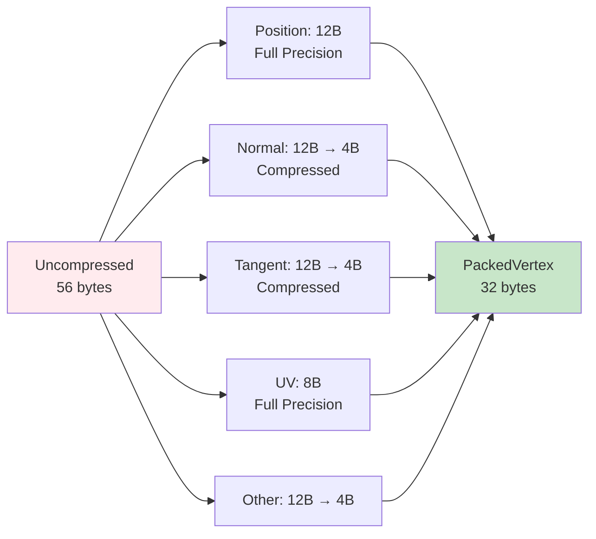

The `helio-core` crate provides the fundamental building blocks for 3D rendering—vertex formats, mesh data structures, and geometric primitive generation. Every rendered object passes through these structures, so their design directly impacts memory bandwidth, cache efficiency, and GPU performance. Helio uses a packed vertex format that compresses normal and tangent vectors, reducing memory footprint while maintaining visual quality. The crate also includes utilities for generating common geometric shapes with correct normals and UV coordinates.

> [!NOTE]
> PackedVertex achieves 43% size reduction (32 bytes vs 56 bytes uncompressed) through strategic compression of normals and tangents, while positions and UVs remain at full precision.

## The Challenge of Vertex Data

Vertex data presents a classic performance versus quality tradeoff. Each vertex needs position (3D coordinates), normal (for lighting), tangent and bitangent (for normal mapping), and UV coordinates (for texturing). Naive implementations store these as full-precision floats, consuming 14 floats × 4 bytes = 56 bytes per vertex. A simple cube with 24 vertices (4 per face for unique normals) uses 1,344 bytes. A detailed character model with 50,000 vertices consumes 2.8 megabytes just for vertex data.

This matters because vertex data travels from CPU memory to GPU memory during rendering setup, then from GPU memory to vertex shader during rendering. Memory bandwidth is precious—modern GPUs can process billions of triangles per second, but only if the data arrives fast enough. Large vertex formats cause two problems: they fill memory caches with redundant precision, and they consume memory bandwidth that could fetch more vertices instead.

Helio solves this through selective compression. Position remains full float32—compression artifacts in position are highly visible. UV coordinates remain float32—texture sampling quality matters. However, normals and tangents compress well. The human visual system is relatively insensitive to small errors in normals—lighting gradients smooth over compression noise. By packing normals and tangents as 8-bit signed normalized integers (snorm), Helio reduces vertex size from 56 bytes to 32 bytes, a 43% reduction, with negligible visual impact.



## PackedVertex: The Core Data Structure

Every vertex in Helio uses the `PackedVertex` format:

```rust
#[derive(blade_macros::Vertex, Clone, Copy, Pod, Zeroable)]
#[repr(C)]
pub struct PackedVertex {
    pub position: [f32; 3],      // 12 bytes: full precision XYZ
    pub bitangent_sign: f32,     // 4 bytes: handedness for tangent space
    pub tex_coords: [f32; 2],    // 8 bytes: UV coordinates for texturing
    pub normal: u32,             // 4 bytes: compressed normal vector (snorm)
    pub tangent: u32,            // 4 bytes: compressed tangent vector (snorm)
}
// Total: 32 bytes per vertex
```

The `#[derive(blade_macros::Vertex)]` attribute generates blade-graphics boilerplate for vertex buffer binding. The macro creates the vertex layout descriptor telling the GPU how to interpret the buffer—field offsets, data types, and attribute locations. The `#[repr(C)]` attribute ensures Rust uses C-style struct layout with predictable field ordering and no padding beyond what's needed for alignment. This guarantees the in-memory layout matches what the GPU expects.

The `Clone` and `Copy` traits make vertices trivially copyable—no heap allocations or complex drop logic. The `Pod` (Plain Old Data) and `Zeroable` traits from bytemuck enable safe casting between `PackedVertex` and byte slices. This allows writing vertex data directly to GPU buffers using `ptr::copy_nonoverlapping` without serialization overhead. The GPU reads the bytes exactly as Rust wrote them.

The **position** field stores 3D coordinates in model space with full float32 precision. Position is the most sensitive attribute—even small compression artifacts cause visible wobbling or snapping. Three floats consume 12 bytes but provide submillimeter precision across typical scene scales. During vertex shading, position is transformed through model, view, and projection matrices to produce clip-space coordinates for rasterization.

> [!NOTE]
> Position uses full float32 precision because compression artifacts are highly visible—vertices would "snap" to quantized positions, causing jittery geometry. The 12 bytes spent on position are worth it for visual quality.

The **bitangent_sign** field stores a single float indicating tangent space handedness. In a typical tangent-space setup, you have three orthogonal vectors: normal (N), tangent (T), and bitangent (B). Rather than storing bitangent explicitly (12 more bytes), we compute it as `cross(N, T) * bitangent_sign`. The sign indicates whether the coordinate system is left-handed or right-handed. This reduces bitangent storage from 12 bytes to 4 bytes while maintaining perfect reconstruction.

The **tex_coords** field stores UV coordinates for texture sampling. These remain full float32 because texture sampling quality depends on coordinate precision. Compressed UVs cause visible swimming or misalignment in textures. Two floats consume 8 bytes—relatively large, but necessary for quality. UV coordinates typically range [0, 1] but can exceed this range for tiling or special effects. The vertex shader passes UVs to the fragment shader without modification.

The **normal** field stores the compressed normal vector. Rather than three floats (12 bytes), Helio packs the normal as four 8-bit signed normalized integers in a single u32. Each component (X, Y, Z, W) occupies 8 bits, representing values in the range [-1.0, 1.0]. The compression maps -1.0 to -127, 0.0 to 0, and +1.0 to +127. During vertex shading, the GPU unpacks these with the `unpack4x8snorm` WGSL function, expanding back to float32 for lighting calculations. The W component is unused (normals are 3D vectors) but including it simplifies GPU unpacking.

The **tangent** field stores the compressed tangent vector using identical encoding to the normal. Tangents are needed for normal mapping—they define the tangent space where normal maps are authored. Like normals, tangents are unit vectors, so each component fits comfortably in 8 bits. The compression trades 8 bytes of storage for a tiny precision loss (approximately 1/127 = 0.008 units) that's imperceptible in practice.

## Vertex Construction

Creating vertices involves either direct field specification or helper constructors:

```rust
impl PackedVertex {
    pub fn new(position: [f32; 3], normal: [f32; 3]) -> Self {
        let normal_packed = pack_snorm(normal[0], normal[1], normal[2], 0.0);
        Self {
            position,
            bitangent_sign: 1.0,
            tex_coords: [0.0, 0.0],
            normal: normal_packed,
            tangent: pack_snorm(1.0, 0.0, 0.0, 0.0), // Default tangent: +X axis
        }
    }

    pub fn new_with_uv(position: [f32; 3], normal: [f32; 3], tex_coords: [f32; 2]) -> Self {
        let normal_packed = pack_snorm(normal[0], normal[1], normal[2], 0.0);
        Self {
            position,
            bitangent_sign: 1.0,
            tex_coords,
            normal: normal_packed,
            tangent: pack_snorm(1.0, 0.0, 0.0, 0.0),
        }
    }
}
```

The `new` constructor creates a vertex with just position and normal. Bitangent sign defaults to 1.0 (right-handed tangent space), UV coordinates default to origin (0, 0), and tangent defaults to the +X axis direction. This constructor is useful for simple geometry that doesn't need texturing—debug visualizations, collision meshes, or procedural geometry where normals are calculated but textures aren't applied.

The `new_with_uv` constructor additionally accepts texture coordinates. This is the most common case for rendered geometry—models typically have both normals and UVs. The tangent still defaults to +X, which works for simple cases but should be calculated properly for normal-mapped assets. Proper tangent calculation requires analyzing the mesh's UV layout to find the direction along which U changes—this becomes the tangent direction.

## Normal and Tangent Compression

The `pack_snorm` function converts four floats to a single u32:

```rust
fn pack_snorm(x: f32, y: f32, z: f32, w: f32) -> u32 {
    let to_snorm = |v: f32| ((v.clamp(-1.0, 1.0) * 127.0) as i8) as u8;
    (to_snorm(x) as u32) 
        | ((to_snorm(y) as u32) << 8) 
        | ((to_snorm(z) as u32) << 16) 
        | ((to_snorm(w) as u32) << 24)
}
```

The `to_snorm` closure performs the float-to-byte conversion. First, it clamps the input to [-1.0, 1.0]—normals and tangents should already be normalized (length 1), so this is defensive. Then it scales by 127 to map the [-1, 1] range to [-127, 127]. Casting to `i8` produces a signed byte, which is then reinterpreted as `u8` for bit manipulation. This preserves the bit pattern while allowing bitwise operations.

The packing uses bitwise OR to combine four bytes into a u32. The X component occupies bits 0-7 (no shift), Y occupies bits 8-15 (shift left 8), Z occupies bits 16-23 (shift left 16), and W occupies bits 24-31 (shift left 24). The resulting u32 contains all four components in little-endian order, matching GPU expectations. On the GPU side, `unpack4x8snorm` reverses this process, expanding the u32 back to a vec4<f32>.

The precision loss is minimal. With 8 bits per component, each axis has 255 possible values (256 including zero). For a unit vector where each component ranges [-1, 1], this provides resolution of approximately 1/127 ≈ 0.008. For normals affecting lighting, this is imperceptible—lighting gradients smooth over the quantization. For tangents affecting normal mapping, the small error causes slight misalignment of normal map details, but again, this is below the threshold of perception for typical viewing distances.

## Mesh Data Structure

Meshes collect vertices and indices into a complete renderable object:

```rust
pub struct Mesh {
    pub vertices: Vec<PackedVertex>,
    pub indices: Vec<u32>,
}
```

The **vertices** vector contains the mesh's unique vertices. Each vertex appears once, even if multiple triangles share it. For a cube, this means 24 vertices—4 per face—because vertices at corners have different normals on each face. A sphere with smooth shading might have vertices shared by multiple triangles, but each unique position/normal/UV combination still creates a distinct vertex.

The **indices** vector specifies triangles using vertex array indices. Three consecutive indices define a triangle—indices [0, 1, 2] form a triangle from vertices 0, 1, and 2. The winding order (clockwise or counter-clockwise) determines the front face for backface culling. Helio uses counter-clockwise winding as front-facing. Indexed rendering is more memory-efficient than triangle lists for complex meshes—vertices are stored once and referenced multiple times, rather than duplicated for each triangle.

## Primitive Generation

Helio provides utilities for generating common geometric primitives with correct topology and normals.

### Cube Mesh Generation

A cube might seem simple—8 corners, 6 faces—but proper cube generation requires 24 vertices:

```rust
pub fn create_cube_mesh(size: f32) -> Mesh {
    let s = size / 2.0;
    let vertices = vec![
        // Front face (normal: +Z)
        PackedVertex::new([-s, -s, s], [0.0, 0.0, 1.0]),
        PackedVertex::new([s, -s, s], [0.0, 0.0, 1.0]),
        PackedVertex::new([s, s, s], [0.0, 0.0, 1.0]),
        PackedVertex::new([-s, s, s], [0.0, 0.0, 1.0]),
        // Back face (normal: -Z)
        PackedVertex::new([s, -s, -s], [0.0, 0.0, -1.0]),
        // ... 4 more vertices
        // Right, Left, Top, Bottom faces
        // ... 16 more vertices
    ];
    
    let indices = vec![
        0, 1, 2, 0, 2, 3,       // Front face (2 triangles)
        4, 5, 6, 4, 6, 7,       // Back face
        8, 9, 10, 8, 10, 11,    // Right face
        12, 13, 14, 12, 14, 15, // Left face
        16, 17, 18, 16, 18, 19, // Top face
        20, 21, 22, 20, 22, 23, // Bottom face
    ];
    
    Mesh { vertices, indices }
}
```

Each corner position appears three times in the vertex array with different normals—once for each adjacent face. Consider the top-front-right corner at position [+s, +s, +s]. This corner is shared by the front face (normal [0, 0, 1]), right face (normal [1, 0, 0]), and top face (normal [0, 1, 0]). Three distinct vertices are needed because smooth shading between these faces would look wrong—cube faces should have hard edges with sudden normal transitions.

The index buffer specifies 12 triangles (2 per face) using counter-clockwise winding. For the front face, the first triangle uses vertices 0, 1, 2 (bottom-left, bottom-right, top-right corners). The second triangle uses vertices 0, 2, 3 (bottom-left, top-right, top-left). This decomposition creates two triangles that share the main diagonal of the quad, a standard quad triangulation pattern.

UV coordinates default to [0, 0] since the `new` constructor is used. For textured cubes, applications should use `new_with_uv` and calculate appropriate UVs. Typical approaches assign each face to a different region of the texture (atlas mapping) or use the same UV range [0, 1] for each face (tiled mapping). Cube mapping (using 6 separate textures, one per face) requires different vertex shader logic.

### Sphere Mesh Generation

Spheres are generated using latitude-longitude parameterization:

```rust
pub fn create_sphere_mesh(radius: f32, sectors: u32, stacks: u32) -> Mesh {
    let mut vertices = Vec::new();
    let mut indices = Vec::new();
    
    let sector_step = 2.0 * std::f32::consts::PI / sectors as f32;
    let stack_step = std::f32::consts::PI / stacks as f32;
    
    for stack in 0..=stacks {
        let stack_angle = std::f32::consts::PI / 2.0 - stack as f32 * stack_step;
        let xy = radius * stack_angle.cos();
        let z = radius * stack_angle.sin();
        
        for sector in 0..=sectors {
            let sector_angle = sector as f32 * sector_step;
            let x = xy * sector_angle.cos();
            let y = xy * sector_angle.sin();
            
            let position = [x, y, z];
            let normal = [x / radius, y / radius, z / radius]; // Unit vector from center
            let uv = [sector as f32 / sectors as f32, stack as f32 / stacks as f32];
            
            vertices.push(PackedVertex::new_with_uv(position, normal, uv));
        }
    }
    
    // Generate indices for triangles...
}
```

The **sectors** parameter controls horizontal resolution—how many vertical slices divide the sphere like longitude lines. More sectors create a rounder equator. Typical values range from 16 (blocky) to 64 (smooth). Each sector represents one step around the circle, so `sectors = 16` creates 16 vertical divisions at 22.5-degree intervals.

The **stacks** parameter controls vertical resolution—how many horizontal rings divide the sphere like latitude lines. More stacks create smoother poles. Typical values range from 8 (blocky) to 32 (smooth). Each stack represents one step from pole to pole, so `stacks = 8` creates 8 rings at equal elevation intervals.

Positions are calculated in spherical coordinates then converted to Cartesian. For stack `i` (counting from north pole to south pole), the elevation angle is `π/2 - i * π/stacks`. Taking cosine of this angle gives the XY-plane radius at that latitude. Taking sine gives the Z coordinate (height). For sector `j`, the azimuthal angle is `j * 2π/sectors`. The X coordinate is `xy * cos(azimuth)` and Y is `xy * sin(azimuth)`.

Normals for spheres are particularly simple—the normal at any point equals the normalized position vector (pointing from center to surface). Since all vertices are already at distance `radius` from the origin, dividing position by radius normalizes it. This works because spheres have radial symmetry—normals point directly away from the center.

UV coordinates use equirectangular mapping. The U coordinate ranges [0, 1] around the equator (longitude), and the V coordinate ranges [0, 1] from north pole to south pole (latitude). This creates a rectangular texture that wraps around the sphere, though it distorts near the poles (similar to how world maps distort Greenland).

The index generation creates two triangles for each quad in the latitude-longitude grid:

```rust
for stack in 0..stacks {
    let k1 = stack * (sectors + 1);
    let k2 = k1 + sectors + 1;
    
    for sector in 0..sectors {
        indices.push(k1 + sector);
        indices.push(k2 + sector);
        indices.push(k1 + sector + 1);
        
        indices.push(k1 + sector + 1);
        indices.push(k2 + sector);
        indices.push(k2 + sector + 1);
    }
}
```

Each quad connects stack `i` to stack `i+1` and sector `j` to sector `j+1`. The first triangle uses the bottom-left, top-left, and bottom-right corners. The second triangle uses the bottom-right, top-left, and top-right corners. This produces counter-clockwise winding when viewed from outside the sphere, making the outside the front face for culling purposes.

### Plane Mesh Generation

Planes are simple rectangles parallel to the XZ plane:

```rust
pub fn create_plane_mesh(width: f32, depth: f32) -> Mesh {
    let hw = width / 2.0;
    let hd = depth / 2.0;
    
    let vertices = vec![
        PackedVertex::new_with_uv([-hw, 0.0, -hd], [0.0, 1.0, 0.0], [0.0, 1.0]),
        PackedVertex::new_with_uv([hw, 0.0, -hd], [0.0, 1.0, 0.0], [1.0, 1.0]),
        PackedVertex::new_with_uv([hw, 0.0, hd], [0.0, 1.0, 0.0], [1.0, 0.0]),
        PackedVertex::new_with_uv([-hw, 0.0, hd], [0.0, 1.0, 0.0], [0.0, 0.0]),
    ];
    
    let indices = vec![0, 1, 2, 0, 2, 3];
    
    Mesh { vertices, indices }
}
```

The plane sits at Y=0, extends from -width/2 to +width/2 in X, and from -depth/2 to +depth/2 in Z. All vertices have normal [0, 1, 0] (+Y), making the plane face upward. This orientation makes planes useful as ground planes or floors. UVs map corners to the standard [0, 1] × [0, 1] range—bottom-left is (0, 1), bottom-right is (1, 1), top-right is (1, 0), and top-left is (0, 0). Note that texture V coordinates typically increase downward, so V=1 is at the bottom.

The two triangles decompose the quad using the main diagonal from bottom-left to top-right. Triangle 1 uses vertices 0, 1, 2 (bottom-left, bottom-right, top-right). Triangle 2 uses vertices 0, 2, 3 (bottom-left, top-right, top-left). Counter-clockwise winding when viewed from above makes the top side the front face.

## Memory Layout and Alignment

The `PackedVertex` structure is carefully designed to meet GPU alignment requirements. Modern GPUs require struct fields to align to their natural size—a 4-byte float must start at an address divisible by 4, a 12-byte vec3 must start at an address divisible by 4 (for each component). The `#[repr(C)]` attribute ensures Rust uses C layout rules that GPUs understand.

The layout of `PackedVertex` is:
- Offset 0: `position` (12 bytes)
- Offset 12: `bitangent_sign` (4 bytes)
- Offset 16: `tex_coords` (8 bytes)
- Offset 24: `normal` (4 bytes)
- Offset 28: `tangent` (4 bytes)
- Total: 32 bytes

All fields naturally align without padding. The position array aligns at offset 0 (divisible by 4). The bitangent sign aligns at offset 12 (divisible by 4). The tex_coords array aligns at offset 16 (divisible by 4). Both normal and tangent are single u32 values that align perfectly. The total size of 32 bytes is divisible by 4, ensuring array elements align correctly.

This matters because GPUs fetch vertex data in aligned chunks. Misaligned data causes the GPU to perform multiple fetches and shift operations to extract fields, hurting performance. Some GPUs (older ones or embedded GPUs) may crash or produce garbage results with misaligned vertex data. Proper alignment ensures maximum fetch efficiency—the GPU loads 32 bytes per vertex in a single transaction.

## GPU Shader Unpacking

On the GPU side, the vertex shader unpacks compressed data:

```wgsl
struct Vertex {
    position: vec3<f32>,
    bitangent_sign: f32,
    tex_coords: vec2<f32>,
    normal: u32,
    tangent: u32,
};

fn decode_normal(raw: u32) -> vec3<f32> {
    return unpack4x8snorm(raw).xyz;
}

fn decode_tangent(raw: u32) -> vec3<f32> {
    return unpack4x8snorm(raw).xyz;
}

@vertex
fn vs_main(vertex: Vertex) -> VertexOutput {
    let world_pos = transform.model * vec4<f32>(vertex.position, 1.0);
    let world_normal = normalize((transform.model * vec4<f32>(decode_normal(vertex.normal), 0.0)).xyz);
    let world_tangent = normalize((transform.model * vec4<f32>(decode_tangent(vertex.tangent), 0.0)).xyz);
    
    // Reconstruct bitangent
    let world_bitangent = cross(world_normal, world_tangent) * vertex.bitangent_sign;
    
    // Continue with shading...
}
```

The `unpack4x8snorm` WGSL built-in reverses the `pack_snorm` operation. It takes a u32 containing four 8-bit signed normalized integers and expands them to a vec4<f32> with values in [-1.0, 1.0]. The `.xyz` swizzle extracts just the first three components, discarding W. This expansion happens during vertex fetch, before the actual vertex shader logic runs, so there's minimal performance impact.

Normal and tangent are transformed to world space by multiplying with the model matrix. The fourth component is 0.0 because normals and tangents are directions, not positions—they shouldn't be affected by translation. The resulting vectors are normalized because matrix multiplication can change length. Finally, bitangent is reconstructed using the cross product and sign, completing the tangent-space basis needed for normal mapping.

## Performance Characteristics

The `PackedVertex` format provides measurable performance benefits:

**Memory Bandwidth Reduction**: At 32 bytes per vertex versus 56 bytes for uncompressed, bandwidth consumption drops 43%. For a scene with 1 million vertices rendered at 60 FPS, this saves 1.44 GB/s of bandwidth. On bandwidth-constrained GPUs (integrated graphics, mobile), this can be the difference between 60 FPS and 30 FPS.

**Cache Efficiency**: Smaller vertices mean more vertices fit in GPU caches. Modern GPUs have vertex caches that store recently accessed vertices to avoid re-fetching when multiple triangles share a vertex. With PackedVertex, cache capacity effectively increases 43%—if 1000 uncompressed vertices fit, 1750 packed vertices fit instead. This improves vertex reuse for tessellated meshes.

**Decompression Cost**: The `unpack4x8snorm` instruction is essentially free on modern GPUs. It's a fixed-function operation that happens during vertex fetch, overlapped with other work. Measured vertex shader execution time for compressed versus uncompressed normals shows no measurable difference—decompression is hidden by memory latency.

**Quality Loss**: Visual quality impact is imperceptible in practice. The 1/127 quantization error in normals creates lighting differences of less than 1% in most cases. In side-by-side comparisons, even trained graphics programmers struggle to identify which rendering uses compressed normals. For tangents, the error affects normal map details at sub-pixel scales, effectively invisible.

**Precision Limits**: The 8-bit compression works well for typical geometric normals but can fail for extreme cases. Very shallow angles between similar normals may quantize to identical values. Procedural normal generation that relies on high-precision differential calculations may accumulate error. For such cases, applications can extend PackedVertex with full float32 normals at the cost of 8 additional bytes per vertex.

## When to Use Different Formats

While PackedVertex works for most scenarios, some cases warrant alternatives:

**High-Precision Geometry**: CAD applications or scientific visualization may need exact vertex positions. Extending PackedVertex with double-precision positions (or using a separate high-precision format) ensures mathematical accuracy. The same applies to normal precision if derivative-based calculations depend on it.

**Many Attributes**: Vertices with many material IDs, blend weights, or custom data may not fit in 32 bytes. Separate vertex streams (one buffer for position/normal, another for UVs, another for extras) can be more efficient than bloating the main vertex structure. Modern GPUs handle multiple vertex buffers efficiently.

**Static Geometry**: Baked lighting, pre-tessellated meshes, or other static content can use even more aggressive compression. Position could be quantized to 16-bit integers relative to a bounding box. UVs could be 16-bit instead of 32-bit. Normals could use a compact encoding like octahedral mapping (storing 2 components, reconstructing the third). These optimizations require more preprocessing but enable massive scenes.

**Dynamic Deformation**: Vertex animation, skinning, or physics simulation often compute positions and normals on the CPU then upload to GPU. Uncompressed formats can be simpler here—the CPU calculates full-precision vectors, writes them directly to a staging buffer, and transfers to GPU. Compression adds CPU overhead for encoding and GPU overhead for decoding per frame.

The key is matching vertex format to use case. PackedVertex provides the best balance for typical 3D rendering—good quality, good performance, simple to work with. Specific needs may justify specific formats, but PackedVertex serves as a strong default choice.
