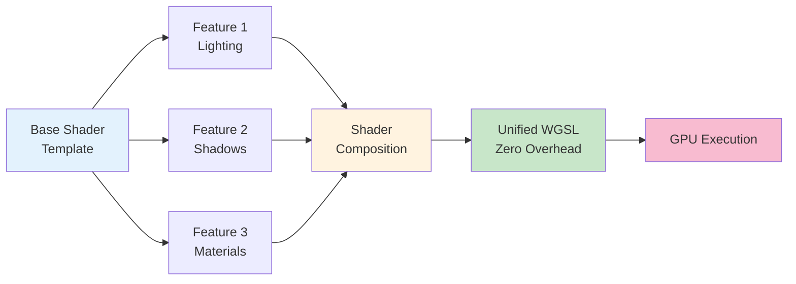
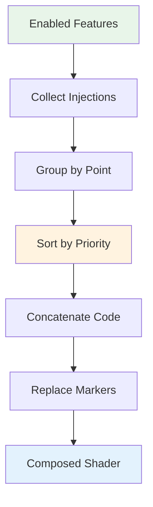

The feature system is Helio's architectural foundation for modular rendering capabilities. Rather than embedding all rendering features into a monolithic engine, features are independent components that can be enabled, disabled, or replaced without touching core infrastructure. Each feature contributes shader code, manages GPU resources, and participates in the rendering pipeline through well-defined lifecycle hooks. The system composes features at runtime by injecting their shader fragments into strategic points in a base shader template, producing a unified shader that runs with zero overhead compared to hand-written code.

## The Composition Problem

Traditional rendering engines face a modularity dilemma. On one hand, developers want distinct features—shadows, ambient occlusion, physically-based materials, post-processing effects—that can be independently enabled or disabled based on hardware capabilities and quality settings. On the other hand, GPUs demand monolithic shaders—complete, self-contained programs that handle all enabled features without runtime branching or dynamic code.

The naive solution is shader permutations: write separate shaders for each combination of features. With 5 binary features, you need 32 shader variants (2^5). With 10 features, 1024 variants. This explodes compilation time and shader storage. Moreover, adding a new feature requires updating every permutation, making the system brittle and difficult to maintain.

Runtime branching using uniforms is cleaner from a code perspective—one shader with if statements checking which features are enabled. However, this introduces overhead. GPUs execute in lockstep groups (warps/wavefronts) of 32 or 64 threads. If threads diverge (some taking the if branch, others taking the else), the GPU serializes execution, running both paths and masking results. Tight loops with many branches can reduce performance by orders of magnitude.

Helio's solution is compile-time composition with runtime enabling. Features inject shader fragments into a base template. During initialization, enabled features contribute their code, producing a unified shader with no branching overhead. At runtime, toggling a feature triggers recomposition and pipeline rebuild (100-500 microseconds), but execution speed remains optimal—the GPU runs lean, purpose-built code for exactly the enabled features.



## Feature Trait Architecture

The `Feature` trait defines the contract all features must implement:

```rust
pub trait Feature: Send + Sync {
    fn name(&self) -> &str;
    fn init(&mut self, context: &FeatureContext);
    fn cleanup(&mut self, context: &FeatureContext);
    fn shader_injections(&self) -> Vec<ShaderInjection>;
    
    fn prepare_frame(&mut self, context: &FeatureContext) {}
    fn pre_render_pass(&mut self, pass: &mut gpu::RenderPass, context: &FeatureContext) {}
    fn post_render_pass(&mut self, pass: &mut gpu::RenderPass, context: &FeatureContext) {}
    fn shadow_pass(&mut self, encoder: &mut gpu::CommandEncoder, context: &FeatureContext, 
                   meshes: &[MeshData], light_view_proj: [[f32; 4]; 4]) {}
    fn get_bind_group(&self, group: u32) -> Option<gpu::BindGroup> { None }
    fn get_uniform_buffer(&self) -> Option<gpu::BufferPiece> { None }
}
```

The **name** method returns a unique identifier for the feature. Feature names must be unique within a registry—attempting to register two features with the same name fails with `FeatureError::DuplicateFeature`. Names are used for runtime toggling (`registry.toggle_feature("lighting")`) and debug output. Convention is lowercase with hyphens: `"ambient-occlusion"`, `"procedural-shadows"`, `"bloom-filter"`.

The **init** method is called once during registry initialization. Features create GPU resources here—uniform buffers, textures, bind groups, compute pipelines. The method receives a `FeatureContext` providing GPU context and surface information. Initialization happens in registration order—features registered first initialize first. If initialization order matters (feature B depends on feature A's resources), register A before B.

The **cleanup** method is the destructor counterpart to init. Features destroy GPU resources here—textures, buffers, pipelines. Cleanup is called automatically when the FeatureRenderer drops, ensuring no resource leaks. Cleanup happens in reverse registration order—features registered last clean up first. This mirrors construction/destruction conventions: last created, first destroyed.

> [!IMPORTANT]
> Cleanup happens automatically via the Drop trait on FeatureRenderer. You never need to manually call cleanup—Rust's ownership system ensures resources are freed when the renderer goes out of scope.

The **shader_injections** method returns the feature's shader contributions. Each injection specifies an injection point (where to insert code) and the code itself. Multiple features can inject at the same point—injections are sorted by priority and concatenated. This method is called during shader composition, which happens at initialization and whenever features are toggled.

> [!NOTE]
> Shader composition only happens during initialization and when features are toggled—not every frame. The composed shader runs with zero overhead at runtime.

The **prepare_frame** method is called before rendering each frame. Features update per-frame uniforms here—time, camera position, or animation state. This method receives delta_time and frame_index through the context, enabling time-based effects. Preparation happens after shadow passes—shadow features already rendered, so lighting features can use shadow maps here.

The **pre_render_pass** and **post_render_pass** methods allow features to execute GPU commands before and after the main render pass. Pre-pass is used for compute dispatches that generate data for the main pass—procedurally generating textures or performing culling. Post-pass is used for post-processing effects that read the completed frame and write to a different target.

The **shadow_pass** method allows features to implement shadow rendering. The method receives a command encoder, context, mesh data, and light view-projection matrix. Features encode shadow map rendering here—creating render passes, binding pipelines, drawing meshes from the light's perspective. Not all features need shadow passes—only lighting features that generate or consume shadow maps.

The **get_bind_group** and **get_uniform_buffer** methods allow features to expose GPU resources to other features. Bind groups can be bound during rendering if multiple features need to share textures or samplers. Uniform buffers can be read by other features for inter-feature communication. Most features return None—these methods are for advanced scenarios where features coordinate.

The trait is marked `Send + Sync`, meaning features can be safely shared across threads. Feature objects themselves are typically not accessed from multiple threads simultaneously (the registry owns them), but the trait bounds allow the registry to be shared. This is important for applications that update the registry from a loading thread while the render thread executes.

## Shader Injection Architecture

Shader injection is the mechanism by which features contribute code to the composed shader. The system defines strategic injection points throughout a base shader template, and features provide code fragments to insert at these points.

### Injection Points

There are seven primary injection points covering the full shader lifecycle:

```rust
pub enum ShaderInjectionPoint {
    VertexPreamble,
    VertexMain,
    VertexOutput,
    FragmentPreamble,
    FragmentMain,
    FragmentOutput,
    GlobalPreamble,
}
```

The **GlobalPreamble** point injects code before any shader entry points. This is for global declarations—constants, structures, utility functions. For example, a lighting feature might define `struct Light { position: vec3<f32>, color: vec3<f32> }` and utility functions for lighting calculations. Global preamble code is visible to both vertex and fragment shaders.

The **VertexPreamble** point injects code at the start of the vertex shader, before the main entry point. This is for vertex-specific structures, constants, or helper functions. For instance, a skinning feature might define bone matrices and skinning functions here. Vertex preamble is only visible to the vertex shader.

The **VertexMain** point injects code within the vertex shader's main function, after input processing but before output construction. This is where features perform vertex transformations—skinning, morphing, or vertex animations. Code here can read the input vertex attributes and write to local variables that will later be output.

The **VertexOutput** point injects additional fields into the vertex shader output structure. These fields are interpolated across triangles and passed to the fragment shader. For example, a bump mapping feature adds tangent space vectors to vertex output, ensuring fragments receive interpolated tangent/bitangent for normal mapping.

> [!TIP]
> Use VertexOutput injections to pass per-vertex data to fragment shaders. The GPU automatically interpolates these values across triangle surfaces, giving fragments smooth gradients of color, normals, or any other data.

The **FragmentPreamble** point injects code at the start of the fragment shader. Like vertex preamble, this is for fragment-specific structures, constants, and functions. A shadow mapping feature might define shadow sampling functions and PCF (percentage closer filtering) kernels here.

The **FragmentMain** point injects code within the fragment shader's main function, where lighting and shading calculations occur. This is the heart of most features—lighting models, shadow sampling, ambient occlusion, reflections. Code here computes the final fragment color.

The **FragmentOutput** point injects additional fields into the fragment shader output structure. Standard rendering outputs one color, but advanced features might output multiple targets—deferred rendering writes position/normal/albedo to separate textures, or HDR rendering writes both LDR and HDR outputs.

### ShaderInjection Structure

Each injection is described by a `ShaderInjection` structure:

```rust
pub struct ShaderInjection {
    pub point: ShaderInjectionPoint,
    pub code: Cow<'static, str>,
    pub priority: i32,
}
```

The **point** field specifies where to inject. The **code** field contains the WGSL source to insert. Using `Cow<'static, str>` (copy-on-write string) enables zero-cost injections when using string literals or `include_str!`. Features can inject static shader code without allocation:

```rust
ShaderInjection::new(
    ShaderInjectionPoint::FragmentPreamble,
    include_str!("shadow.wgsl")
)
```

The `include_str!` macro embeds file contents as a `&'static str` at compile time. No runtime file I/O, no allocations—the shader code lives in the binary. This is ideal for production builds where all shaders are known at compile time.

The **priority** field controls injection order when multiple features inject at the same point. Lower priority injects earlier. For example, a base material feature uses priority 0 to inject material structures. A lighting feature uses priority 10 to inject lighting code that references materials. A shadow feature uses priority 5 to inject shadow structures between materials and lighting.

> [!TIP]
> Priority is purely for ordering dependencies. If feature B's shader code references structures from feature A, give A a lower priority (like 0) and B a higher priority (like 10). The actual numbers don't matter—only their relative ordering.

Priority is relative—absolute values don't matter, only ordering. Conventions: base features (materials, geometry) use 0-10, lighting uses 10-20, post-process uses 20-30. However, priority is entirely up to feature authors—choose values that order dependencies correctly.

### Composition Process



Shader composition happens in the FeatureRegistry:

```rust
impl FeatureRegistry {
    pub fn compose_shader(&self, base_template: &str) -> String {
        let mut composed = base_template.to_string();
        let mut injections_by_point: HashMap<ShaderInjectionPoint, Vec<ShaderInjection>> = 
            HashMap::new();

        // Collect injections from all enabled features
        for feature in &self.features {
            if feature.enabled {
                for injection in feature.instance.shader_injections() {
                    injections_by_point
                        .entry(injection.point)
                        .or_insert_with(Vec::new)
                        .push(injection);
                }
            }
        }

        // Sort each injection point by priority
        for injections in injections_by_point.values_mut() {
            injections.sort_by_key(|inj| inj.priority);
        }

        // Replace markers with composed code
        for (point, injections) in injections_by_point {
            let marker = format!("// INJECT_{:?}", point).to_uppercase();
            let code = injections.iter()
                .map(|inj| inj.code.as_ref())
                .collect::<Vec<_>>()
                .join("\n");
            composed = composed.replace(&marker, &code);
        }

        composed
    }
}
```

The process begins by collecting shader injections from all enabled features. Features that are registered but disabled don't contribute code—their shader_injections method is never called. Injections are grouped by point using a HashMap—all VertexMain injections in one bucket, all FragmentMain in another.

Within each bucket, injections are sorted by priority. This ensures dependent code appears in the correct order. If feature A defines structures and feature B uses those structures, A must have lower priority than B to appear first in the composed shader.

Marker replacement performs the actual composition. For each injection point, construct the marker string—`"// INJECT_VERTEXMAIN"`, `"// INJECT_FRAGMENTMAIN"`, etc. Concatenate all injections for that point into a single string with newlines between fragments. Replace the marker in the base template with the composed code.

The result is a complete WGSL shader with all feature code inlined. No markers remain (they're replaced with actual code). No branching exists (each feature's code is unconditionally executed). The shader is ready for compilation.

### Base Shader Template

The base template defines the shader structure with injection markers:

```wgsl
// INJECT_GLOBALPREAMBLE

struct VertexInput {
    @location(0) position: vec3<f32>,
    @location(1) tex_coord: vec2<f32>,
    @location(2) normal: vec3<f32>,
    @location(3) tangent: vec3<f32>,
}

struct VertexOutput {
    @builtin(position) clip_position: vec4<f32>,
    @location(0) world_position: vec3<f32>,
    @location(1) tex_coord: vec2<f32>,
    @location(2) world_normal: vec3<f32>,
    // INJECT_VERTEXOUTPUT
}

// INJECT_VERTEXPREAMBLE

@vertex
fn vs_main(in: VertexInput) -> VertexOutput {
    var out: VertexOutput;
    
    // INJECT_VERTEXMAIN
    
    out.clip_position = camera.view_proj * vec4(world_pos, 1.0);
    out.world_position = world_pos;
    out.tex_coord = in.tex_coord;
    out.world_normal = normalize((model * vec4(in.normal, 0.0)).xyz);
    
    return out;
}

// INJECT_FRAGMENTPREAMBLE

@fragment
fn fs_main(in: VertexOutput) -> @location(0) vec4<f32> {
    var color = vec3<f32>(0.8, 0.8, 0.8);
    
    // INJECT_FRAGMENTMAIN
    
    return vec4(color, 1.0);
    // INJECT_FRAGMENTOUTPUT
}
```

Markers are placed strategically. `// INJECT_GLOBALPREAMBLE` is at the very top, allowing features to define structures and functions before they're referenced. `// INJECT_VERTEXOUTPUT` is inside the VertexOutput structure, allowing features to add interpolated fields. `// INJECT_VERTEXMAIN` is in the vertex function body where transformations occur.

`// INJECT_FRAGMENTMAIN` is in the fragment function where color is computed. Features typically modify the `color` variable here, accumulating lighting contributions. `// INJECT_FRAGMENTOUTPUT` is after the return statement—features replacing the return statement can output multiple values for MRT (multiple render targets).

The base template provides default behavior—basic vertex transformation and gray shading. Features enhance this by injecting normal mapping, lighting, shadows, or other effects. If no features are enabled, the composed shader is nearly identical to the template (markers are replaced with empty strings).

## Building Custom Features

Creating a custom feature involves implementing the Feature trait and providing shader code. Let's build a simple Ambient Occlusion feature step by step.

### Feature Structure

Define the feature struct with necessary state:

```rust
pub struct AmbientOcclusionFeature {
    ao_texture: Option<gpu::Texture>,
    ao_view: Option<gpu::TextureView>,
    ao_sampler: Option<gpu::Sampler>,
    bind_group: Option<gpu::BindGroup>,
    intensity: f32,
}
```

The feature stores a texture (precomputed or generated AO), a view for sampling, a sampler, a bind group for binding during rendering, and an intensity parameter. All GPU resources are Option-wrapped because they're created during init, not construction.

### Initialization

Implement the init method to create GPU resources:

```rust
impl AmbientOcclusionFeature {
    pub fn new(intensity: f32) -> Self {
        Self {
            ao_texture: None,
            ao_view: None,
            ao_sampler: None,
            bind_group: None,
            intensity,
        }
    }
}

impl Feature for AmbientOcclusionFeature {
    fn name(&self) -> &str { "ambient-occlusion" }

    fn init(&mut self, context: &FeatureContext) {
        // Create a simple checkerboard AO texture for demonstration
        let size = 256;
        let mut pixels = vec![0u8; size * size];
        for y in 0..size {
            for x in 0..size {
                let checker = ((x / 32) + (y / 32)) % 2;
                pixels[y * size + x] = if checker == 0 { 255 } else { 128 };
            }
        }

        self.ao_texture = Some(context.gpu.create_texture(gpu::TextureDesc {
            name: "ao_texture",
            format: gpu::TextureFormat::R8Unorm,
            size: gpu::Extent { width: size as u32, height: size as u32, depth: 1 },
            dimension: gpu::TextureDimension::D2,
            array_layer_count: 1,
            mip_level_count: 1,
            usage: gpu::TextureUsage::COPY | gpu::TextureUsage::RESOURCE,
            sample_count: 1,
            external: None,
        }));

        // Upload pixel data...
        // Create texture view...
        // Create sampler with linear filtering...
        // Create bind group...
    }

    fn cleanup(&mut self, context: &FeatureContext) {
        if let Some(bg) = self.bind_group.take() {
            context.gpu.destroy_bind_group(bg);
        }
        if let Some(sampler) = self.ao_sampler.take() {
            context.gpu.destroy_sampler(sampler);
        }
        if let Some(view) = self.ao_view.take() {
            context.gpu.destroy_texture_view(view);
        }
        if let Some(texture) = self.ao_texture.take() {
            context.gpu.destroy_texture(texture);
        }
    }
}
```

Initialization creates a simple checkerboard texture demonstrating AO. Production implementations would load precomputed AO from disk or generate it using screen-space ambient occlusion (SSAO) compute shaders. Cleanup destroys resources in reverse creation order.

### Shader Contributions

Implement shader_injections to provide shader code:

```rust
impl Feature for AmbientOcclusionFeature {
    fn shader_injections(&self) -> Vec<ShaderInjection> {
        vec![
            ShaderInjection::new(
                ShaderInjectionPoint::FragmentPreamble,
                include_str!("ao_preamble.wgsl")
            ).with_priority(5),
            
            ShaderInjection::new(
                ShaderInjectionPoint::FragmentMain,
                format!("color *= sample_ao(in.tex_coord, {});", self.intensity).into()
            ).with_priority(15),
        ]
    }
}
```

The preamble injection defines the AO sampling function and bind group:

```wgsl
// ao_preamble.wgsl
@group(2) @binding(0) var ao_texture: texture_2d<f32>;
@group(2) @binding(1) var ao_sampler: sampler;

fn sample_ao(uv: vec2<f32>, intensity: f32) -> f32 {
    let ao = textureSample(ao_texture, ao_sampler, uv).r;
    return mix(1.0, ao, intensity);
}
```

The main injection applies AO to the fragment color. The sampling function returns a value from 1.0 (fully lit) to the sampled AO value based on intensity. Multiplying color by this value darkens occluded areas.

Priority 5 for preamble ensures the function is defined before materials and lighting. Priority 15 for main application ensures AO is applied after base material (priority 0) but before complex lighting (priority 20+).

### Runtime Behavior

The feature now integrates with the feature system:

```rust
let mut registry = FeatureRegistry::builder()
    .with_feature(AmbientOcclusionFeature::new(0.8))
    .build();

// Later, toggle at runtime
registry.toggle_feature("ambient-occlusion")?;
renderer.rebuild_pipeline();
```

Toggling the feature triggers shader recomposition. If enabled, AO code is included in the composed shader. If disabled, AO code is absent—the shader runs without AO overhead. This runtime flexibility allows performance scaling (disable AO on low-end hardware) and debugging (isolate rendering issues by disabling features).

## Feature Registry Architecture

The FeatureRegistry is the container and orchestrator for all features:

```rust
pub struct FeatureRegistry {
    features: Vec<RegisteredFeature>,
    debug_output: bool,
    initialized: bool,
}

struct RegisteredFeature {
    name: String,
    instance: Box<dyn Feature>,
    enabled: bool,
}
```

The registry stores features as trait objects (`Box<dyn Feature>`), allowing heterogeneous feature types. Each feature has a name for identification and an enabled flag for runtime toggling. The debug_output flag controls whether composition writes shaders to disk. The initialized flag prevents double-initialization.

### Builder Pattern

The registry uses a builder for ergonomic construction:

```rust
impl FeatureRegistry {
    pub fn builder() -> FeatureRegistryBuilder {
        FeatureRegistryBuilder::default()
    }
}

pub struct FeatureRegistryBuilder {
    features: Vec<Box<dyn Feature>>,
    debug_output: bool,
}

impl FeatureRegistryBuilder {
    pub fn with_feature(mut self, feature: impl Feature + 'static) -> Self {
        self.features.push(Box::new(feature));
        self
    }

    pub fn debug_output(mut self, enabled: bool) -> Self {
        self.debug_output = enabled;
        self
    }

    pub fn build(self) -> FeatureRegistry {
        let mut features = Vec::new();
        for feature in self.features {
            features.push(RegisteredFeature {
                name: feature.name().to_string(),
                instance: feature,
                enabled: true,
            });
        }

        FeatureRegistry {
            features,
            debug_output: self.debug_output,
            initialized: false,
        }
    }
}
```

The builder accumulates features and configuration, then constructs the registry. Features are enabled by default. The fluent API chains method calls for concise registration:

```rust
let registry = FeatureRegistry::builder()
    .with_feature(LightingFeature::new())
    .with_feature(ShadowFeature::new(2048))
    .with_feature(MaterialFeature::new())
    .debug_output(true)
    .build();
```

This pattern avoids mutable registry construction (no repeated `registry.add()`), provides clear initialization points, and enables compile-time validation—the type system ensures features are added before building.

### Runtime Toggling

Features can be enabled or disabled after initialization:

```rust
impl FeatureRegistry {
    pub fn toggle_feature(&mut self, name: &str) -> Result<bool, FeatureError> {
        let feature = self.features.iter_mut()
            .find(|f| f.name == name)
            .ok_or_else(|| FeatureError::FeatureNotFound(name.to_string()))?;

        feature.enabled = !feature.enabled;
        Ok(feature.enabled)
    }

    pub fn enable_feature(&mut self, name: &str) -> Result<(), FeatureError> {
        let feature = self.features.iter_mut()
            .find(|f| f.name == name)
            .ok_or_else(|| FeatureError::FeatureNotFound(name.to_string()))?;

        feature.enabled = true;
        Ok(())
    }

    pub fn disable_feature(&mut self, name: &str) -> Result<(), FeatureError> {
        let feature = self.features.iter_mut()
            .find(|f| f.name == name)
            .ok_or_else(|| FeatureError::FeatureNotFound(name.to_string()))?;

        feature.enabled = false;
        Ok(())
    }
}
```

Toggle flips the enabled state and returns the new state. Enable and disable set the state explicitly. All methods return Result types—attempting to toggle a nonexistent feature returns `FeatureError::FeatureNotFound` rather than panicking. Applications must handle errors appropriately:

```rust
match registry.toggle_feature("ambient-occlusion") {
    Ok(enabled) => {
        println!("AO is now {}", if enabled { "enabled" } else { "disabled" });
        renderer.rebuild_pipeline();
    }
    Err(e) => eprintln!("Error toggling AO: {}", e),
}
```

After toggling, call `renderer.rebuild_pipeline()` to recompose shaders and recreate the pipeline. Forgetting to rebuild means the toggle has no effect—the old pipeline continues executing.

### Lifecycle Coordination

The registry coordinates feature lifecycle methods:

```rust
impl FeatureRegistry {
    pub fn init_all(&mut self, context: &FeatureContext) {
        if self.initialized {
            log::warn!("Registry already initialized, skipping");
            return;
        }

        for feature in &mut self.features {
            feature.instance.init(context);
        }

        self.initialized = true;
    }

    pub fn cleanup_all(&mut self, context: &FeatureContext) {
        for feature in self.features.iter_mut().rev() {
            feature.instance.cleanup(context);
        }
    }

    pub fn prepare_frame(&mut self, context: &FeatureContext) {
        for feature in &mut self.features {
            if feature.enabled {
                feature.instance.prepare_frame(context);
            }
        }
    }
}
```

Initialization calls init on all features in registration order. The initialized flag prevents double-initialization. Cleanup iterates in reverse order (`.rev()`), calling cleanup on all features. Frame preparation calls prepare_frame only on enabled features—disabled features are skipped.

This design ensures correct resource lifecycles. Init creates resources, cleanup destroys them. Features can rely on init being called exactly once before any other methods. Cleanup is guaranteed to run even if errors occur, thanks to Drop implementation on FeatureRenderer.

## Validation and Debugging

The feature system includes validation and debugging capabilities to catch errors early.

### Shader Validation

During composition, the registry validates injection points:

```rust
impl FeatureRegistry {
    pub fn compose_shader(&self, base_template: &str) -> String {
        // ... composition logic ...

        // Validate: warn if markers exist but no injections
        for point in [VertexPreamble, FragmentPreamble, /* ... */] {
            let marker = format!("// INJECT_{:?}", point).to_uppercase();
            if composed.contains(&marker) && !injections_by_point.contains_key(&point) {
                log::warn!("Shader marker {} exists but no features inject here", marker);
            }
        }

        // Validate: warn if injections exist but marker is missing
        for (point, injections) in &injections_by_point {
            if !injections.is_empty() {
                let marker = format!("// INJECT_{:?}", point).to_uppercase();
                if !base_template.contains(&marker) {
                    log::warn!(
                        "{} features inject at {:?} but base shader has no marker",
                        injections.len(),
                        point
                    );
                }
            }
        }

        composed
    }
}
```

The first validation detects unused markers—places in the template where features could inject but none do. This might indicate missing features or unnecessary markers. The second validation detects missing markers—features trying to inject code but the template lacks the injection point. This usually means the base shader is outdated or features are misconfigured.

Both are warnings, not errors. The shader still compiles—unused markers become empty strings, missing markers mean injections are silently dropped. However, warnings alert developers to potential issues during development.

### Debug Output

Enabling debug output writes composed shaders to disk:

```rust
impl FeatureRegistry {
    pub fn set_debug_output(&mut self, enabled: bool) {
        self.debug_output = enabled;
    }

    pub fn compose_shader(&self, base_template: &str) -> String {
        let composed = /* ... composition ... */;

        if self.debug_output {
            if let Err(e) = std::fs::write("composed_shader_debug.wgsl", &composed) {
                log::warn!("Failed to write debug shader: {}", e);
            } else {
                log::debug!("Wrote composed shader to composed_shader_debug.wgsl");
            }
        }

        composed
    }
}
```

Applications enable debug output during development:

```rust
let mut registry = FeatureRegistry::builder()
    .with_feature(LightingFeature::new())
    .debug_output(cfg!(debug_assertions))  // Enable in debug builds
    .build();
```

The composed shader is written to `composed_shader_debug.wgsl` in the working directory. Developers can inspect this file to verify composition correctness—check that injections appear in the expected order, ensure no syntax errors from malformed injections, and confirm that enabled features contribute code while disabled features don't.

Production builds should disable debug output to avoid file I/O overhead and security concerns (writing files to arbitrary directories). Using `cfg!(debug_assertions)` enables debug output in debug builds and disables it in release builds automatically.

> [!WARNING]
> Never enable debug output in production releases. Writing shaders to disk on every composition is a security risk and performance issue. Use `cfg!(debug_assertions)` to automatically disable in release builds.

## Performance Characteristics

The feature system is designed for zero runtime overhead with composition cost paid during initialization.

### Composition Cost

Shader composition is string processing—collecting injections, sorting, and replacing markers. For a typical feature set (5-10 features, 20-40 injections, 2KB base shader), composition takes 50-200 microseconds. This is negligible during initialization, which already includes shader compilation (tens of milliseconds) and pipeline creation (hundreds of microseconds).

Pipeline rebuilding after toggling features involves recomposition plus pipeline creation. Total time is 100-500 microseconds depending on shader complexity. At 60 FPS (16.6ms frame budget), rebuilding uses 0.6-3% of a frame. Rebuilding every few frames causes noticeable stuttering. Rebuilding in response to user input (once per second at most) is imperceptible.

> [!WARNING]
> Never rebuild the pipeline every frame or in tight loops. Pipeline rebuilding takes 100-500μs—acceptable for user-triggered toggles, but frame-killing if done continuously.

Applications should batch toggles when enabling multiple features simultaneously. Toggling 5 features individually triggers 5 rebuilds (500-2500 microseconds). Toggling all 5 then rebuilding once triggers 1 rebuild (100-500 microseconds), 5× faster. The registry supports batch toggling:

```rust
registry.disable_feature("shadows")?;
registry.disable_feature("ambient-occlusion")?;
registry.enable_feature("low-quality-lighting")?;
renderer.rebuild_pipeline();  // Single rebuild
```

### Runtime Overhead

Once composed, the feature system has zero runtime overhead. The composed shader is monolithic GPU code with no branching for enabled features. The GPU executes exactly the code needed for the current feature set. Toggling a feature changes which shader runs, but while running, there's no overhead.

> [!IMPORTANT]
> Zero runtime overhead means the GPU executes the composed shader at full speed—identical to hand-written code. The feature system's cost is paid once during initialization, not every frame.

Compare to runtime branching:

```wgsl
// Runtime branching (bad)
var color = base_color;
if (uniforms.ao_enabled != 0) {
    color *= sample_ao(uv);
}
if (uniforms.shadows_enabled != 0) {
    color *= sample_shadow(pos);
}
// Result: Branching overhead, warp divergence
```

Versus composed shader:

```wgsl
// Composed shader (good)
var color = base_color;
color *= sample_ao(uv);
color *= sample_shadow(pos);
// Result: No branching, optimal execution
```

When AO is disabled, the composed shader omits `sample_ao` entirely. The GPU never evaluates it. Runtime branching would evaluate both branches (GPU lockstep execution), wasting cycles on the disabled path. The feature system eliminates this waste by generating purpose-built shaders.

### Memory Usage

Each feature stores its state—GPU resources, parameters, cached data. A typical feature uses 100-500 bytes of CPU memory. Ten features use 1-5 KB—negligible. GPU resources (textures, buffers) dominate memory usage. A 1024×1024 shadow map uses 4 MB. An AO texture might be 256×256 (256 KB). Feature overhead is insignificant compared to GPU resource usage.

The registry stores one copy of each feature. Features are not duplicated per pipeline or per renderer. Sharing is safe because features don't store pipeline-specific state—they store global resources (textures, buffers) usable across any pipeline. This means memory usage is independent of pipeline count.

## Best Practices

Effective feature development follows several principles.

**Single Responsibility**: Each feature should implement one rendering concept. A "lighting" feature handles light evaluation. A separate "shadow" feature handles shadow maps. A "material" feature defines material properties. Don't create a "lighting-with-shadows-and-reflections" mega-feature—split it into composable pieces. Smaller features are easier to debug, test, and reuse.

**Minimal Dependencies**: Features should depend on as few other features as possible. Shader injections should reference standard structures (VertexOutput, FragmentInput) rather than feature-specific data. If feature B requires data from feature A, document this dependency clearly and handle missing data gracefully. Ideally, features are order-independent—enabling any subset produces correct results.

**Static Shader Code**: Use `include_str!` for shader code to avoid allocation overhead. Store shader fragments in separate `.wgsl` files for syntax highlighting and easier editing. Dynamic shader generation (format! for injection code) should be reserved for parameterization—inserting constants or feature-specific values. Don't construct entire functions with format!—write them in WGSL files and inject statically.

> [!TIP]
> Store shader code in `.wgsl` files and use `include_str!("shader.wgsl")` to inject them. This gives you syntax highlighting in your editor, no runtime allocations, and cleaner code organization.

**Error Handling**: Init and cleanup should handle errors gracefully. If texture loading fails, log an error and use a fallback (pink checkerboard, solid white, or skip the feature). Don't panic in feature code—return errors or degrade gracefully. Applications should handle FeatureError types from registry operations rather than unwrapping.

**Documentation**: Document what shader code your feature injects and what it expects from the base shader. Specify injection points and priorities. Explain dependencies on other features. Provide example usage. Well-documented features are easier to integrate and debug.

**Performance Awareness**: Profile your feature's GPU cost. Use GPU timers to measure pass duration. Optimize hot paths—fragment shaders run millions of times per frame, so even small savings multiply. Precompute on the CPU what doesn't need per-pixel evaluation. Use lower precision (f16) where quality loss is acceptable. Balance quality and performance based on feature's purpose.
