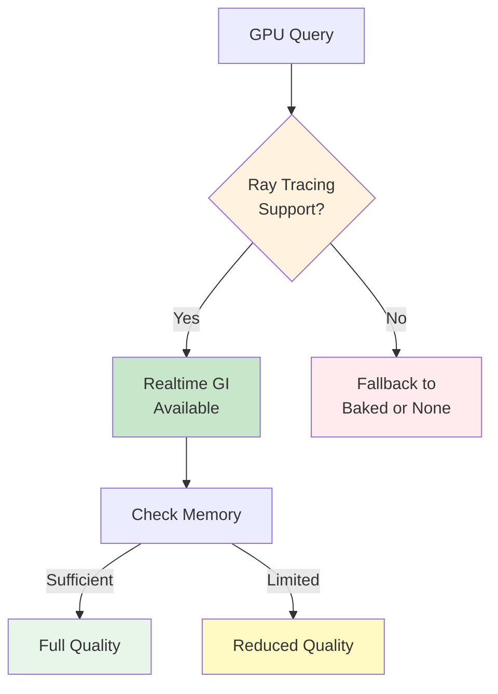

The `helio-lighting` feature implements global illumination using hardware-accelerated ray tracing through blade-graphics. Unlike traditional rasterization-based lighting (shadow maps, light probes, screen-space techniques), ray tracing directly simulates light transport by casting rays from surfaces through the scene. This produces physically accurate shadows with correct soft penumbras, proper occlusion in corners and crevices, and indirect lighting where light bounces off surfaces to illuminate neighboring geometry. Helio's lighting system supports three modes: no GI (direct lighting only), realtime ray-traced GI computed every frame, and baked GI precomputed offline and sampled at runtime.

## The Global Illumination Problem

Realistic lighting simulation must account for all light transport paths in a scene. Direct lighting captures light traveling directly from light sources to surfaces—the sun illuminating a wall, a lamp lighting a desk. This is straightforward to compute: for each surface point, cast a ray toward each light. If the ray reaches the light unobstructed, the surface receives direct illumination. If blocked by geometry, the surface is in shadow.

However, direct lighting alone produces harsh, unrealistic results. Real-world environments exhibit indirect lighting—light bouncing off surfaces before reaching the camera. A white ceiling reflects sunlight onto a floor. Red walls tint nearby objects with reddish light. Sunlight entering through a window illuminates not just the directly lit patches but also the room interior through multiple bounces. This indirect illumination is global illumination—light contribution from the entire scene, not just direct paths to lights.

Traditional techniques approximate global illumination. Shadow maps compute direct occlusion but miss indirect light. Light probes capture environment lighting at fixed points, interpolating between probes for dynamic objects. Screen-space ambient occlusion (SSAO) darkens corners but only considers visible geometry—occluders outside the screen don't contribute. These techniques work but accumulate artifacts: light leaking through walls, incorrect occlusion, missing contact shadows, lack of color bleeding.

Ray tracing solves global illumination correctly by simulating light transport physically. Cast rays from camera to surfaces (primary rays). From surface hit points, cast rays toward lights (shadow rays) to evaluate direct lighting. Cast additional rays in random directions (diffuse rays) to sample indirect lighting from neighboring surfaces. Recursively evaluate lighting at ray hit points, accumulating contributions. The result is physically accurate lighting with correct occlusion, soft shadows, indirect bounces, and color bleeding.

## Lighting Feature Architecture

The `LightingFeature` struct encapsulates global illumination state:

```rust
pub struct LightingFeature {
    gi_mode: GIMode,
    gi_intensity: f32,
    shadow_map: Option<gpu::Texture>,
    shadow_view: Option<gpu::TextureView>,
    shadow_sampler: Option<gpu::Sampler>,
    acceleration_structure: Option<gpu::AccelerationStructure>,
    bind_group: Option<gpu::BindGroup>,
}

pub enum GIMode {
    None,
    Realtime,
    Baked,
}
```

The **gi_mode** determines lighting quality and performance. `None` disables global illumination, using only direct lighting (fast but unrealistic). `Realtime` enables per-frame ray tracing for fully dynamic GI (expensive but accurate). `Baked` uses precomputed GI stored in light maps (fast with near-realtime quality). Applications choose the mode based on hardware capabilities and quality requirements.

The **gi_intensity** parameter controls indirect lighting contribution. A value of 0.0 means no indirect light (equivalent to GIMode::None but cheaper to toggle). A value of 1.0 means full indirect lighting. Intermediate values blend direct and indirect for artistic control—reducing GI intensity prevents indirect lighting from overpowering direct lighting in bright scenes.

The **shadow_map** stores depth values from the light's perspective for traditional shadow mapping. Even with ray-traced GI, shadow maps provide fast primary shadow testing. Ray tracing handles secondary bounces and soft shadows while shadow maps handle direct occlusion. This hybrid approach balances quality and performance.

The **acceleration_structure** is a blade-graphics acceleration structure (BVH—bounding volume hierarchy) enabling efficient ray-scene intersection queries. Building the AS processes scene geometry and constructs a tree structure where each node bounds a subset of triangles. Ray tracing traverses this tree, quickly eliminating large portions of geometry that don't intersect the ray. Without AS, ray tracing would test every triangle (millions of intersections per frame), which is prohibitively expensive.

The **bind_group** bundles GPU resources (textures, samplers, acceleration structures) for binding during rendering. Creating a bind group is expensive (validation, driver overhead). Binding an existing group is cheap (pointer update). The feature creates the bind group during init and reuses it every frame.

### Lighting Feature Construction

Features are constructed with parameters before registration:

```rust
impl LightingFeature {
    pub fn new() -> Self {
        Self {
            gi_mode: GIMode::None,
            gi_intensity: 1.0,
            shadow_map: None,
            shadow_view: None,
            shadow_sampler: None,
            acceleration_structure: None,
            bind_group: None,
        }
    }

    pub fn with_gi_mode(mut self, mode: GIMode) -> Self {
        self.gi_mode = mode;
        self
    }

    pub fn with_gi_intensity(mut self, intensity: f32) -> Self {
        self.gi_intensity = intensity.clamp(0.0, 2.0);
        self
    }
}
```

Builder-style methods enable fluent configuration:

```rust
let lighting = LightingFeature::new()
    .with_gi_mode(GIMode::Realtime)
    .with_gi_intensity(0.8);

let registry = FeatureRegistry::builder()
    .with_feature(lighting)
    .build();
```

The gi_intensity is clamped to [0.0, 2.0]. Values below 0 would subtract indirect lighting (nonsensical). Values above 2.0 would over-brighten the scene, though some applications might intentionally use high values for artistic effects. The clamp provides sensible defaults while allowing override if needed.

### Initialization

During init, the feature creates GPU resources:

```rust
impl Feature for LightingFeature {
    fn name(&self) -> &str { "lighting" }

    fn init(&mut self, context: &FeatureContext) {
        // Create shadow map for traditional shadow mapping
        let shadow_res = 2048;
        self.shadow_map = Some(context.gpu.create_texture(gpu::TextureDesc {
            name: "shadow_map",
            format: gpu::TextureFormat::Depth32Float,
            size: gpu::Extent { width: shadow_res, height: shadow_res, depth: 1 },
            dimension: gpu::TextureDimension::D2,
            array_layer_count: 1,
            mip_level_count: 1,
            usage: gpu::TextureUsage::TARGET | gpu::TextureUsage::RESOURCE,
            sample_count: 1,
            external: None,
        }));

        self.shadow_view = Some(context.gpu.create_texture_view(
            self.shadow_map.unwrap(),
            gpu::TextureViewDesc {
                name: "shadow_view",
                format: gpu::TextureFormat::Depth32Float,
                dimension: gpu::ViewDimension::D2,
                subresources: &Default::default(),
            },
        ));

        self.shadow_sampler = Some(context.gpu.create_sampler(gpu::SamplerDesc {
            name: "shadow_sampler",
            address_modes: [gpu::AddressMode::ClampToEdge; 3],
            mag_filter: gpu::FilterMode::Linear,
            min_filter: gpu::FilterMode::Linear,
            mipmap_filter: gpu::FilterMode::Nearest,
            compare: Some(gpu::CompareFunction::Less),
            ..Default::default()
        }));

        // Build acceleration structure for ray tracing
        if self.gi_mode != GIMode::None {
            // Build AS from scene geometry (simplified)
            // Production: Rebuild AS when geometry changes
        }

        // Create bind group bundling all resources
        // self.bind_group = Some(...);
    }

    fn cleanup(&mut self, context: &FeatureContext) {
        if let Some(bg) = self.bind_group.take() {
            context.gpu.destroy_bind_group(bg);
        }
        if let Some(as_) = self.acceleration_structure.take() {
            context.gpu.destroy_acceleration_structure(as_);
        }
        if let Some(sampler) = self.shadow_sampler.take() {
            context.gpu.destroy_sampler(sampler);
        }
        if let Some(view) = self.shadow_view.take() {
            context.gpu.destroy_texture_view(view);
        }
        if let Some(texture) = self.shadow_map.take() {
            context.gpu.destroy_texture(texture);
        }
    }
}
```

Shadow map creation uses `Depth32Float` format for high precision. The resolution (2048×2048) balances quality and memory. Larger shadow maps reduce aliasing (jagged shadow edges) but consume more memory and bandwidth. Modern games use 1024-4096 resolution depending on quality settings.

The sampler uses `ClampToEdge` addressing—samples outside [0, 1] return edge values rather than wrapping. This prevents shadows from repeating at tile boundaries. Linear filtering softens shadow edges by interpolating depth samples. The `compare: Some(CompareFunction::Less)` enables hardware percentage-closer filtering (PCF)—the sampler automatically performs depth comparison, returning 0.0 (shadowed) or 1.0 (lit) rather than raw depth values.

Acceleration structure creation depends on the GI mode. If GI is disabled, skip AS creation to save memory. If enabled, build an AS from scene geometry. Production engines rebuild the AS when geometry moves or deforms—static geometry uses AS built once at load time, dynamic geometry rebuilds AS every frame (expensive) or every few frames (acceptable for slow-moving objects).

Cleanup destroys resources in reverse creation order, ensuring no dangling references. The feature guarantees resource cleanup even if initialization failed partway—Option types default to None, and the `if let Some` pattern skips destruction for resources that were never created.

## Shader Injection for Lighting

The feature injects shader code at multiple points to integrate lighting calculations:

```rust
impl Feature for LightingFeature {
    fn shader_injections(&self) -> Vec<ShaderInjection> {
        let mut injections = vec![
            ShaderInjection::new(
                ShaderInjectionPoint::GlobalPreamble,
                Self::global_declarations()
            ),
            ShaderInjection::new(
                ShaderInjectionPoint::FragmentPreamble,
                Self::lighting_functions()
            ).with_priority(10),
        ];

        if self.gi_mode != GIMode::None {
            injections.push(ShaderInjection::new(
                ShaderInjectionPoint::FragmentMain,
                self.generate_gi_code()
            ).with_priority(15));
        } else {
            injections.push(ShaderInjection::new(
                ShaderInjectionPoint::FragmentMain,
                Self::direct_lighting_code()
            ).with_priority(15));
        }

        injections
    }
}
```

The feature injects conditionally based on GI mode. If GI is enabled, inject ray tracing code. If disabled, inject simpler direct lighting. Both injection points use priority 15, ensuring lighting runs after material evaluation (priority 0-10) but before post-processing (priority 20+).

### Global Declarations

Global preamble defines structures and bindings:

```wgsl
// Lighting global declarations
struct DirectionalLight {
    direction: vec3<f32>,
    color: vec3<f32>,
    intensity: f32,
}

@group(2) @binding(0) var shadow_map: texture_depth_2d;
@group(2) @binding(1) var shadow_sampler: sampler_comparison;
@group(2) @binding(2) var<uniform> light: DirectionalLight;
@group(2) @binding(3) var acceleration_structure: acceleration_structure;
```

The `DirectionalLight` structure encapsulates light properties. Direction is a unit vector pointing toward the light (e.g., `vec3(0, -1, 0)` for downward light). Color is RGB in linear space (e.g., `vec3(1, 0.95, 0.9)` for warm sunlight). Intensity scales light contribution—1.0 is physically plausible, higher values create stylized bright lighting.

Bind group 2 is used for lighting resources. Groups 0 and 1 are reserved for scene and object data. Using a dedicated group allows binding lighting once and reusing it for all draws. The `texture_depth_2d` type indicates a 2D depth texture. `sampler_comparison` is a specialized sampler performing depth comparison, used for hardware PCF shadow filtering.

The `acceleration_structure` binding provides access to the BVH for ray queries. This is a blade-graphics-specific binding type—WGSL doesn't natively support acceleration structures, but blade extends it with ray tracing capabilities. Under the hood, this translates to platform-specific ray tracing APIs: DirectX Raytracing (DXR) on Windows, Vulkan Ray Tracing on Linux, Metal ray tracing on macOS.

### Lighting Functions

Fragment preamble defines utility functions:

```wgsl
// Shadow mapping with PCF
fn sample_shadow(world_pos: vec3<f32>) -> f32 {
    let light_space_pos = light.view_proj * vec4(world_pos, 1.0);
    let ndc = light_space_pos.xyz / light_space_pos.w;
    let uv = ndc.xy * 0.5 + 0.5;  // Convert NDC [-1, 1] to UV [0, 1]
    let depth = ndc.z;

    // Hardware PCF: sampler performs 4-tap comparison and returns average
    return textureSampleCompare(shadow_map, shadow_sampler, uv, depth);
}

// Direct lighting calculation
fn evaluate_direct_light(world_pos: vec3<f32>, normal: vec3<f32>, albedo: vec3<f32>) -> vec3<f32> {
    let light_dir = normalize(-light.direction);
    let n_dot_l = max(dot(normal, light_dir), 0.0);
    
    if (n_dot_l < 0.001) {
        return vec3(0.0);
    }

    let shadow = sample_shadow(world_pos);
    return albedo * light.color * light.intensity * n_dot_l * shadow;
}
```

The `sample_shadow` function performs shadow map lookup. First, transform the world position into light space using the light's view-projection matrix. This produces clip space coordinates where X and Y represent position in the shadow map, and Z represents depth from the light. Divide by W to get normalized device coordinates (NDC) in [-1, 1]. Convert X and Y to UV coordinates [0, 1] by scaling and offsetting.

The `textureSampleCompare` function performs hardware PCF. It samples a 2×2 neighborhood around the UV coordinate, compares each sample's depth against the provided depth, and returns the average. If all 4 samples are closer than the depth (unshadowed), it returns 1.0. If all are farther (fully shadowed), 0.0. Partial coverage returns intermediate values, producing soft shadow edges.

> [!NOTE]
> Hardware PCF (Percentage Closer Filtering) is essentially "free" on modern GPUs—the texture sampler hardware performs the 4-tap comparison and averaging in a single operation. This is much faster than sampling 4 times in shader code.

The `evaluate_direct_light` function implements Lambertian diffuse shading. Negate the light direction (stored as direction _from_ light, needed as direction _to_ light). Compute the dot product of surface normal and light direction—this is the cosine of the angle between them, representing how directly the surface faces the light. Clamp to [0, 1] to avoid negative contributions from back-facing surfaces.

If the surface faces away from the light (n_dot_l near zero), skip shadow sampling—it's expensive and contributes nothing. Otherwise, multiply albedo (surface color) by light color, intensity, angle term, and shadow value. The result is the final lit color for this light.

### Ray Traced GI Code

When GI is enabled, inject ray tracing code:

```rust
fn generate_gi_code(&self) -> Cow<'static, str> {
    format!(r#"
    // Ray-traced global illumination
    var ray_origin = world_pos + normal * 0.001;  // Offset to avoid self-intersection
    var total_indirect = vec3(0.0);
    
    let samples = 8;  // Number of GI rays per fragment
    for (var i = 0u; i < samples; i++) {{
        // Generate random direction in hemisphere around normal
        let random_dir = sample_hemisphere(normal, i);
        
        // Cast ray
        var ray_query: ray_query;
        rayQueryInitialize(&ray_query, acceleration_structure, 
                          RayDesc(ray_origin, random_dir, 0.001, 100.0));
        
        // Traverse BVH
        rayQueryProceed(&ray_query);
        
        if (rayQueryGetCommittedIntersection(&ray_query) == RAY_QUERY_INTERSECTION_TRIANGLE) {{
            let hit_t = rayQueryGetCommittedIntersectionT(&ray_query);
            let hit_pos = ray_origin + random_dir * hit_t;
            
            // Sample lighting at hit point (simplified: assume diffuse white)
            let hit_normal = rayQueryGetCommittedIntersectionNormal(&ray_query);
            let hit_color = evaluate_direct_light(hit_pos, hit_normal, vec3(0.8));
            
            total_indirect += hit_color;
        }} else {{
            // Ray missed geometry, sample skybox
            total_indirect += sample_sky(random_dir);
        }}
    }}
    
    let indirect_lighting = total_indirect / f32(samples) * {intensity};
    color = color * (evaluate_direct_light(world_pos, normal, vec3(1.0)) + indirect_lighting);
    "#, intensity = self.gi_intensity).into()
}
```

Ray-traced GI starts by offsetting the ray origin along the normal. Without offset, rays would intersect the surface they originated from (self-intersection), causing artifacts—surfaces shadowing themselves incorrectly. A small offset (0.001 units) moves the origin just above the surface, preventing this.

> [!WARNING]
> Self-intersection is a common ray tracing bug. Always offset ray origins slightly along the surface normal to avoid rays hitting the surface they started from. Too small an offset causes artifacts; too large causes light leaking.

The algorithm casts multiple rays per fragment to sample indirect lighting. More rays produce smoother results but increase cost. Eight rays strike a balance—enough to reduce noise, few enough to run at reasonable frame rates. Production path tracers use hundreds or thousands of rays per pixel, accumulated over many frames. Real-time ray tracing uses few rays per frame, relying on temporal accumulation and denoising to reduce noise.

> [!TIP]
> Real-time ray tracing uses 1-8 rays per pixel per frame, then accumulates results over multiple frames and applies denoising. This achieves path-traced quality at interactive frame rates by spreading the work across time.

For each ray, generate a random direction in the hemisphere around the surface normal. Rays pointing into the surface (below the horizon) contribute nothing, so we constrain directions to the upper hemisphere. The `sample_hemisphere` function (not shown) uses low-discrepancy sequences (Halton, Sobol) or blue noise to generate well-distributed directions. Uniform random directions cause clumping—some areas over-sampled, others under-sampled. Low-discrepancy sequences spread samples evenly, reducing variance.

Initialize a ray query with the acceleration structure, ray origin, direction, and range [0.001, 100.0]. The minimum distance avoids false intersections near the origin. The maximum distance limits traversal—hits beyond 100 units are ignored, effectively clamping indirect lighting distance. This prevents rays from traversing the entire scene, reducing traversal cost.

Call `rayQueryProceed` to traverse the BVH and find the closest intersection. This is a blocking call—the GPU pauses this thread while traversing the tree. Efficient BVH construction is critical—poorly balanced trees cause excessive traversal time. Blade-graphics uses high-quality BVH builders (radix sort, LBVH) optimized for GPU ray tracing.

If the ray hits a triangle, retrieve the hit distance (t value), compute the world position of the hit, and evaluate lighting at that point. The simplified code assumes all surfaces are diffuse white (albedo 0.8). Production implementations would fetch material properties (albedo, roughness, metalness) from the hit triangle's material. Evaluate direct lighting at the hit point—this is the light bouncing off that surface, which becomes indirect lighting for the original fragment.

If the ray misses all geometry, sample the sky/environment map. Missed rays still contribute light—open sky or environment lighting. `sample_sky` reads a skybox texture or computes procedural sky color based on ray direction. Without this, missed rays contribute black, darkening outdoor scenes unrealistically.

After all rays are processed, average their contributions and scale by GI intensity. Add this indirect lighting to the direct lighting computed earlier. The result is physically-based lighting with both direct illumination and one-bounce indirect illumination. Multi-bounce GI would recursively trace secondary rays from hit points, accumulating contributions from all bounces. Single-bounce GI is a practical compromise—captures most visible indirect lighting while keeping cost reasonable.

### Direct Lighting Fallback

When GI is disabled, inject simple direct lighting:

```rust
fn direct_lighting_code() -> Cow<'static, str> {
    include_str!("shaders/direct_light.wgsl").into()
}
```

This injects a pre-written shader fragment handling only direct lighting and shadow mapping. The fragment is simpler than GI code—no ray tracing, no BVH traversal, just shadow map lookup and Lambertian shading. Composition enables swapping implementations based on feature configuration without runtime branching.

## GI Modes and Trade-offs

Each GI mode has distinct characteristics balancing quality, performance, and dynamism.

### GI Mode: None

Direct lighting only. Surfaces receive light from direct paths to light sources. Shadows are computed via shadow maps. No indirect lighting, no color bleeding, no secondary bounces. Produces harsh, contrasty images with deep black shadows—unrealistic but fast.

**Performance**: Shadow map rendering takes 1-3ms depending on scene complexity and shadow resolution. Main pass performs shadow lookups (trivial cost, ~0.1ms for 100k fragments). Total overhead is primarily shadow map rendering. On integrated GPUs or low-end hardware, this is the only viable mode.

**Use Cases**: Performance-critical applications (VR, mobile), games with stylized art (cell shading, low-poly), or scenarios where indirect lighting is artistically undesirable. Also useful as a performance fallback—detect weak GPUs and disable GI automatically.

### GI Mode: Realtime

Per-frame ray tracing computes indirect lighting dynamically. Lights, geometry, and materials can change every frame—GI responds correctly without precomputation. Produces physically accurate lighting with soft shadows, contact shadows, color bleeding, and ambient occlusion.

**Performance**: Casting 8 rays per fragment at 1080p (2M fragments) means 16M rays per frame. Modern GPUs (RTX 3060+, RX 6600+) achieve 50-200M rays/second in complex scenes. Thus, GI takes 80-320ms per frame—far too expensive for real-time. Practical solutions involve reconstruction techniques: render GI at quarter resolution (540p = 500k fragments, 4M rays), taking 20-80ms. Upscale and denoise the GI buffer to full resolution using temporal accumulation and spatial filtering. This achieves acceptable quality at 12-30 FPS depending on GPU.

> [!WARNING]
> Realtime ray-traced GI at full resolution is prohibitively expensive. Production implementations render at quarter resolution (25% of pixels) and reconstruct with denoising.

**Use Cases**: Architectural visualization (walkthrough of building interiors), product rendering (car configurators), or offline rendering with real-time preview. Not suitable for gameplay at 60+ FPS without aggressive optimization (quarter resolution, heavy denoising, sparse updates).

### GI Mode: Baked

Precompute GI offline, store in light maps, sample at runtime. During a baking pass, trace hundreds of rays per texel across all surfaces, accumulating indirect lighting. Store the results in textures (light maps) that are sampled during rendering. Runtime cost is a single texture lookup per fragment—trivial overhead comparable to sampling an albedo texture.

**Performance**: Baking takes seconds to minutes depending on scene size and ray count. Runtime cost is negligible (texture sampling). No ray tracing at runtime, so no hardware requirements. Works on any GPU supporting texture sampling (i.e., all GPUs).

**Trade-offs**: GI is static—moving lights, moving geometry, or material changes don't affect baked GI. The baked lighting becomes outdated. This limits baked GI to static scenes—architecture, levels with fixed lighting. Dynamic objects (characters, vehicles) don't cast or receive baked shadows. They need separate techniques (light probes, real-time shadows) for plausible integration.

> [!NOTE]
> Baked GI is perfect for static environments (buildings, levels) but can't handle dynamic elements. The standard solution is baking for static geometry + light probes for dynamic objects, giving you 90% baked quality with some dynamism.

**Hybrid Approach**: Many games use baked GI for static geometry and real-time techniques for dynamic objects. Static walls/floors have baked indirect lighting (high quality, zero cost). Dynamic characters use light probes (interpolated baked GI from nearby probe points). The result is mostly baked quality with limited dynamism.

## Hardware Requirements and Platform Support



Ray tracing requires specialized GPU hardware and API support.

> [!NOTE]
> Hardware ray tracing requires NVIDIA RTX (Turing+), AMD RDNA 2+ (RX 6000+), Intel Arc, or Apple M3+. Older GPUs must fall back to GIMode::None or GIMode::Baked.

**GPU Requirements**: Hardware ray tracing acceleration is available on NVIDIA RTX (Turing+), AMD RDNA 2+ (RX 6000+), Intel Arc, and Apple M3+. Older GPUs lack ray tracing hardware and fall back to software emulation (prohibitively slow) or disable GI entirely. The feature should detect hardware capabilities and choose an appropriate mode:

```rust
impl LightingFeature {
    pub fn auto_detect_gi_mode(context: &FeatureContext) -> GIMode {
        if context.gpu.supports_ray_tracing() {
            GIMode::Realtime
        } else {
            GIMode::None
        }
    }
}
```

**API Support**: Blade-graphics abstracts platform differences, but under the hood uses DirectX Raytracing (DXR) on Windows, Vulkan Ray Tracing (VK_KHR_ray_query) on Linux, and Metal ray tracing on macOS. Not all platforms support ray tracing on all GPUs—some older drivers or operating systems lack API support even if hardware supports it. The application should handle missing support gracefully, falling back to non-GI modes.

**Memory Constraints**: Acceleration structures consume GPU memory proportional to scene complexity. A scene with 1M triangles might produce a 50MB AS. Combined with shadow maps (4MB), light maps (tens of MB), and other resources, memory usage adds up. Low-memory GPUs (4-6 GB) may struggle with large scenes. Implementations should monitor memory usage and scale quality accordingly—reduce shadow resolution, simplify geometry, or compress light maps.

**Performance Scaling**: Ray tracing performance varies wildly across hardware. RTX 4090 is ~10× faster than RTX 2060. Mobile GPUs are slower still. Applications must profile on target hardware and adjust ray counts, resolutions, and quality settings accordingly. Providing user-facing quality presets (Low/Medium/High/Ultra) is essential—players choose presets matching their hardware rather than tuning obscure parameters.

## Future Enhancements

The lighting system is functional but has room for improvement.

**Multi-bounce GI**: Current implementation traces one indirect bounce. Real-world light bounces many times. Adding secondary bounces (trace rays from the first hit point) improves quality in enclosed spaces—rooms lit through doorways, light propagating around corners. Cost scales linearly with bounce count, so two bounces doubles cost. Practical limit is 2-3 bounces for real-time.

**Importance Sampling**: Random ray directions are unbiased but inefficient. Most indirect light comes from bright areas (lights, windows, light-colored surfaces). Importance sampling biases rays toward important directions, reducing variance. Requires additional data structures (light lists, luminance pyramids) but significantly improves quality for the same ray count.

**Denoising**: Ray tracing with few samples produces noisy images. Temporal denoising (blend current frame with previous frames) and spatial denoising (blur based on depth/normal) smooth noise while preserving detail. High-quality denoisers (Intel OIDN, NVIDIA Real-Time Denoisers) achieve near-converged quality from very noisy inputs. Integration requires rendering motion vectors and maintaining temporal history.

**Probe-based GI**: Divide the scene into a grid of probes. Trace rays from probe positions, storing results in spherical harmonics or octahedral maps. At runtime, interpolate between nearby probes to approximate indirect lighting. This amortizes ray tracing cost—update probes incrementally (few per frame) rather than every fragment every frame. Provides dynamic GI at fractional cost of per-frame ray tracing.

These enhancements transform the lighting system from functional to production-ready, achieving quality and performance suitable for shipping games and applications. The current implementation provides a solid foundation, demonstrating the core concepts while leaving room for optimization and extension.
