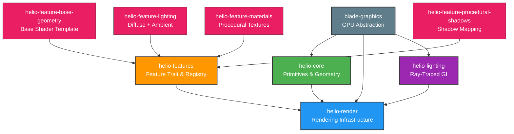

Helio is a modular, high-performance rendering engine built on blade-graphics that provides both traditional rasterization and modern ray-traced global illumination. The engine is designed around composable features that inject shader code and manage GPU resources independently, enabling developers to build custom rendering pipelines by combining features without modifying engine code. Helio abstracts away GPU API complexity while maintaining zero-cost abstractions and direct hardware access when needed.

## The Problem: Rendering Engines Are Either Flexible or Fast

Traditional rendering engines force a choice between flexibility and performance. Monolithic engines achieve excellent performance through tight integration—every system knows about every other system, shaders are hand-tuned for specific combinations, and control flow is optimized. However, adding new rendering techniques requires deep modifications across the codebase. Want to add screen-space reflections? You need to modify the main shader, update uniform bindings, coordinate with existing post-processing, and ensure it doesn't break shadows or ambient occlusion.

Plugin-based engines offer flexibility through abstraction boundaries. Plugins can add features without modifying engine code. However, this flexibility comes at a cost—dynamic dispatch for rendering operations, constrained extension points that limit what plugins can do, and coordination overhead between plugins. The abstraction layers add measurable frame time, and certain optimizations become impossible when the engine can't see across plugin boundaries.

Helio solves this through **compile-time feature composition**. Features are independent Rust crates that provide shader fragments and GPU resource management. During renderer initialization, features inject their WGSL code into well-defined extension points in the base shader template. The feature registry composes all enabled features into a single monolithic shader—the same structure a hand-written engine would use. At runtime, the GPU executes this composed shader with zero overhead from the feature system. The flexibility is paid for at initialization time (composition takes microseconds), not per-frame.

The result is an engine that's both flexible and fast. Adding shadow mapping means writing a feature crate that injects shadow sampling code and manages the shadow map texture. The feature doesn't modify existing code or couple to other features. When enabled, its shader code is woven into the final program. When disabled, it's completely absent from the GPU execution—no branches, no dead code, no overhead.

## Architecture Overview

Helio consists of several independent crates, each with a focused responsibility:

The **helio-core** crate provides fundamental data structures for 3D rendering. It defines `PackedVertex`, a GPU-optimized vertex format that packs position, normal, tangent, and UV coordinates into 32 bytes. The crate includes mesh generation utilities for common primitives—cubes, spheres, planes—using this packed format. Normal and tangent vectors are compressed using signed normalized integers (snorm) to reduce memory bandwidth. The vertex layout is designed to match what GPU hardware expects, minimizing transformation cost during vertex fetch.

The **helio-render** crate implements the core rendering infrastructure. It provides two renderer types: the legacy `Renderer` for simple forward rendering with hand-written shaders, and the modern `FeatureRenderer` that supports feature composition. Both manage render pipelines, depth buffers, and command encoding. The crate defines uniform buffer structures for camera and object transforms, following blade-graphics layout requirements. Frame coordination happens here—executing shadow passes, main rendering, and post-processing in the correct sequence.

The **helio-features** crate defines the feature system architecture. The `Feature` trait specifies the interface every rendering feature must implement—providing shader injection code, managing GPU resources through lifecycle methods, and optionally executing custom render passes. The `FeatureRegistry` collects features, composes their shader code into final WGSL, and coordinates their lifecycle (initialization, per-frame updates, cleanup). The `ShaderInjection` struct describes what code to insert where, with priority controlling ordering when multiple features inject at the same point.

The **helio-lighting** crate implements ray-traced global illumination as a standalone system. It can operate in three modes: none (no GI), realtime (GPU ray tracing per frame), and baked (pre-computed light maps). The realtime mode uses blade-graphics ray query functionality to trace rays through the scene, accumulating indirect lighting. Light data structures represent different light types (directional, point, spot) with position, direction, color, and intensity parameters. The GI system is independent of the feature architecture—applications can use it with or without feature composition.

The **helio-feature-*** crates are concrete feature implementations demonstrating the system. `base-geometry` provides the shader template that other features inject into. `lighting` adds basic diffuse and ambient lighting calculations. `materials` implements procedural texture generation with checkerboard patterns. `procedural-shadows` performs shadow mapping with configurable resolution. Each feature is completely self-contained—its shader code, GPU resources, and behavior are encapsulated in a single crate that can be used or omitted independently.

The **blade-graphics** foundation provides the GPU abstraction layer. Blade is a modern Rust graphics API that wraps native GPU APIs (Vulkan, Metal, D3D12) with a safe, ergonomic interface. It handles resource creation (buffers, textures, pipelines), command recording (render passes, compute dispatches), and synchronization. Helio builds on blade's abstractions rather than directly calling GPU APIs, gaining cross-platform support and memory safety while maintaining low-level control when needed.

## Design Philosophy

Helio's architecture embodies several core principles that guide all design decisions.

**Modular But Not Hierarchical**: Rendering features are independent crates, not subclasses of a base class. Features combine through composition (shader injection) rather than inheritance. A lighting feature doesn't inherit from a base feature class—it implements the `Feature` trait and injects shader code. This means any combination of features works without n-squared configuration methods or complex dependency chains.

**Explicit Over Implicit**: Feature dependencies and ordering are declared explicitly through shader injection priorities. There's no hidden global state, no automatic feature discovery, no convention-based initialization. You register features in order, they initialize in that order, shader code appears in priority order. The composition process is fully visible—enable debug output and inspect the exact shader the GPU will execute.

**Zero-Cost Abstractions**: The feature system is a compile-time and initialization-time abstraction. At runtime, you're executing a monolithic GPU shader composed from feature fragments. There's no virtualization, no feature lookup tables in hot code paths, no polymorphic dispatch for rendering operations. The abstraction cost is paid during initialization (shader composition takes microseconds) and amortized across thousands of frames.

**Performance Through Composition**: Traditional engines achieve performance through tight integration—everything knows about everything else. Helio achieves the same performance through different means: by composing independent features into a monolithic artifact at initialization time. The final shader has identical structure to a hand-written monolithic shader, so GPU execution is identical. The modularity exists in the source code organization, not the runtime architecture.

**Extensibility Without Engine Modification**: Adding new rendering techniques doesn't require modifying Helio's core. Create a feature crate implementing the `Feature` trait, provide shader injection code, register it with the feature registry. The new capability integrates without touching existing features or engine code. This makes experimentation cheap—try a new rendering technique by adding a feature, not by forking the engine.

## Core Capabilities

Helio provides several major rendering capabilities out of the box.

**Forward Rasterization**: The base rendering path uses traditional forward rendering. Geometry is transformed to clip space, rasterized to fragments, and shaded in a single pass. The vertex shader transforms positions and normals, passes data to the fragment shader via interpolation, and outputs clip-space position. The fragment shader computes final color from geometry, materials, and lighting. Depth testing ensures correct occlusion. This path is simple, well-understood, and performs excellently for scenes with moderate geometry complexity and light counts.

**Feature Composition**: The defining characteristic of Helio's architecture. Rendering features inject shader code at seven well-defined extension points—vertex preamble, vertex main, vertex post-process, fragment preamble, fragment main, fragment color calculation, and fragment post-process. The feature registry collects injections from all enabled features, sorts by priority, and replaces markers in the base shader template with the composed code. Multiple features can inject at the same point—materials run before lighting, lighting runs before shadows. Features manage their own GPU resources (textures, buffers, pipelines) and can execute custom render passes before or after main rendering.

**Shadow Mapping**: Implemented as a feature in `helio-feature-procedural-shadows`. The feature creates a depth-only shadow map texture and render pipeline. During the pre-render pass, it renders scene geometry from the light's perspective into this shadow map. During main rendering, it injects shader code to sample the shadow map and attenuate colors in shadow. The shadow map resolution is configurable (1024, 2048, 4096) to balance quality and performance. The feature is completely independent—enable it to get shadows, disable it to remove them without touching other code.

**Ray-Traced Global Illumination**: The `helio-lighting` crate provides compute-based ray tracing for indirect lighting. In realtime mode, it traces rays from each pixel into the scene, gathering indirect light contributions from multiple bounces. Parameters control ray count, bounce depth, and intensity. The system requires hardware ray tracing support via blade-graphics ray query functionality. On supported GPUs (modern NVIDIA, AMD, Intel), this provides physically-based global illumination. On unsupported hardware, GI gracefully degrades to none mode. The GI system runs as a compute pass before main rendering, writing results to a texture that shaders sample during color calculation.

**Material System**: Basic material support exists via the `helio-feature-materials` crate. This feature demonstrates procedural texture generation—a checkerboard pattern computed from UV coordinates in the fragment shader. The pattern alternates between light and dark tiles based on floor operations on the UV values. This serves as a template for real material systems that would sample actual textures, perform PBR calculations with roughness and metallic parameters, and handle normal mapping. The material feature injects early in the fragment pipeline (low priority) so lighting features can use its output.

**Post-Processing Pipeline**: Features can inject into the `FragmentPostProcess` injection point to perform final color adjustments after all lighting and material computations. This enables tone mapping (HDR to LDR conversion), color grading (artistic color adjustments), fog application, bloom, and other screen-space effects. The post-process injection point runs at the very end of the fragment shader, just before the final color return. Effects here see the completely lit and shaded pixel—perfect for operations that should affect the entire pipeline uniformly.

## Use Cases

Helio's architecture makes it suitable for several rendering scenarios.

**Research and Experimentation**: The low friction for adding features makes Helio excellent for graphics research. Want to test a new lighting model? Write a feature that injects your lighting calculation. Compare it against existing models by toggling features and measuring performance. The feature system eliminates the "modify engine code" barrier that makes experimentation expensive in traditional engines. Multiple researchers can work on different features simultaneously without conflicts.

**Custom Game Engines**: Game teams building custom engines benefit from Helio's modularity. Start with base geometry and lighting. Add features as needed—shadows when outdoor environments arrive, procedural generation when creating terrain, screen-space reflections for water. Each feature is isolated, testable, and can be developed independently. The team maintains only the features they actually use, not a kitchen-sink engine with every possible feature enabled.

**Educational Projects**: Helio's clear separation of concerns makes it valuable for teaching graphics programming. Students learn rendering techniques by implementing features—one student adds normal mapping, another implements deferred shading, a third adds SSAO. Each feature is a manageable scope. The feature system teaches architectural principles (modularity, composition, explicit dependencies) alongside rendering techniques. The blade-graphics foundation provides a safe, modern GPU API without the complexity of raw Vulkan or D3D12.

**Visualization and Tools**: Applications that need 3D rendering but aren't games—CAD viewers, scientific visualization, level editors—benefit from Helio's flexibility. Enable features based on what the user is viewing. Show shadows and GI for architectural walkthrough. Disable expensive effects for rapid model inspection. Toggle features to debug rendering issues. The performance of composed shaders is crucial when viewport responsiveness matters.

## What's Next

The following sections provide deep dives into each aspect of Helio's architecture:

**[Core Primitives](./Helio/core-primitives.md)** explores the `helio-core` crate in detail. Learn about `PackedVertex` format, how normal and tangent compression works, UV coordinate handling, and mesh generation algorithms. This section covers the fundamental data structures that all rendering builds upon.

**[Rendering Infrastructure](./Helio/rendering-infrastructure.md)** examines the `helio-render` crate. Understand how render pipelines are created and configured, how depth buffers are managed, how camera and transform uniforms work, and how frame coordination sequences pre-passes, main rendering, and post-processing.

**[Feature System](./Helio/feature-system.md)** dives deep into feature composition. See how the `Feature` trait works, how shader injection is implemented, how the registry composes shaders, and how to build your own features. This is the heart of Helio's modularity.

**[Global Illumination](./Helio/global-illumination.md)** details the ray-traced GI implementation. Learn how ray queries work with blade-graphics, how GI modes differ, what light data structures represent, and performance characteristics of realtime ray tracing versus baked solutions.

**[Blade-Graphics Integration](./Helio/blade-integration.md)** explains how Helio uses blade-graphics effectively. Discover resource management patterns, command encoding best practices, cross-platform considerations, and when to use blade abstractions versus lower-level control.

**[Real-World Usage](./Helio/real-world-usage.md)** walks through building complete applications. See window and surface setup with winit, frame loop structure, resource lifecycle management, and performance optimization strategies. Learn from complete working examples.
