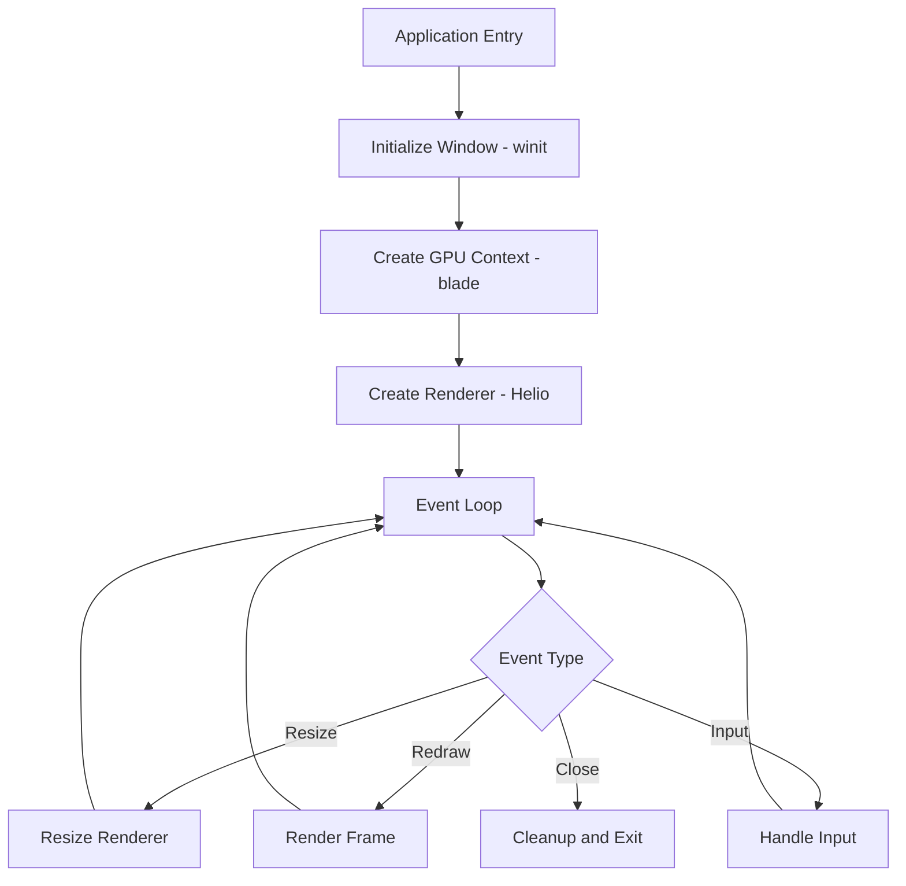

Integrating Helio into an application requires coordinating several systems—window creation, surface management, input handling, frame timing, and renderer lifecycle. This document walks through a complete application setup from scratch, demonstrates practical examples from Helio's codebase, and covers common patterns for resource management, performance optimization, and error handling. The goal is to provide a reference implementation that developers can adapt for their own projects.

## Application Architecture

A minimal Helio application has several components working together. The window system (winit) creates a native window and surfaces OS events. The GPU context (blade-graphics) manages GPU resources and command submission. The renderer (Helio's FeatureRenderer) handles frame rendering. The event loop ties everything together, responding to window events and redrawing as needed.

The typical structure looks like this:



The initialization phase creates the window, GPU context, and renderer in sequence—each depends on the previous step. The event loop runs indefinitely, dispatching events to appropriate handlers. Redraw events trigger frame rendering. Resize events update renderer dimensions. Input events update application state (camera movement, feature toggling). Close events trigger cleanup and shutdown.

## Complete Application Setup

Let's build a complete application step by step, explaining each component's role.

### Dependencies

First, add required dependencies to `Cargo.toml`:

```toml
[dependencies]
helio-core = { path = "../helio-core" }
helio-render = { path = "../helio-render" }
helio-features = { path = "../helio-features" }
helio-feature-lighting = { path = "../helio-feature-lighting" }
helio-feature-materials = { path = "../helio-feature-materials" }

blade-graphics = "0.4"
winit = "0.29"
env_logger = "0.11"
log = "0.4"
bytemuck = { version = "1.14", features = ["derive"] }
```

**helio-*** crates provide rendering functionality. **blade-graphics** is the GPU abstraction. **winit** handles windowing and events. **env_logger** and **log** provide logging. **bytemuck** enables safe type casting for GPU data.

### Main Function and Initialization

The main function initializes logging and starts the event loop:

```rust
use winit::{
    event::{Event, WindowEvent},
    event_loop::{ControlFlow, EventLoop},
    window::WindowBuilder,
};
use blade_graphics as gpu;
use std::sync::Arc;

fn main() {
    env_logger::Builder::from_default_env()
        .filter_level(log::LevelFilter::Info)
        .init();

    let event_loop = EventLoop::new().expect("Failed to create event loop");
    let window = WindowBuilder::new()
        .with_title("Helio Application")
        .with_inner_size(winit::dpi::PhysicalSize::new(1280, 720))
        .build(&event_loop)
        .expect("Failed to create window");

    let mut app = Application::new(&window);

    event_loop.run(move |event, elwt| {
        app.handle_event(event, elwt);
    }).expect("Event loop failed");
}
```

**Logging Setup**: `env_logger` configures log levels. The filter defaults to `Info`, showing important messages while hiding verbose debug output. Users can override via environment variables: `RUST_LOG=debug cargo run` enables debug logging.

**Event Loop Creation**: `EventLoop::new()` creates the platform's native event loop—Win32 message loop on Windows, X11/Wayland event handling on Linux, Cocoa run loop on macOS. The event loop is platform-specific but abstracted by winit.

**Window Creation**: `WindowBuilder` configures window properties—title, initial size, and other options (fullscreen, decorations, transparency). The size uses physical pixels (device pixels, not logical points). On high-DPI displays, physical size differs from logical size—a 1280×720 window might be 2560×1440 physical pixels on a Retina display.

**Event Loop Execution**: `event_loop.run()` takes ownership of the event loop and runs indefinitely, invoking the closure for each event. The closure receives the event and an event loop window target (`elwt`) for creating additional windows or exiting the loop.

### Application State

Define an `Application` struct holding all application state:

```rust
struct Application {
    context: Arc<gpu::Context>,
    surface: gpu::Surface,
    surface_config: gpu::SurfaceConfig,
    renderer: helio_render::FeatureRenderer,
    camera: helio_render::CameraUniforms,
    meshes: Vec<MeshData>,
    last_frame_time: std::time::Instant,
    frame_count: u64,
}

struct MeshData {
    transform: helio_render::TransformUniforms,
    vertex_buffer: gpu::BufferPiece,
    index_buffer: gpu::BufferPiece,
    index_count: u32,
}
```

The **context** is the GPU interface. **surface** represents the window's drawing surface. **surface_config** stores surface properties (format, size). **renderer** is Helio's FeatureRenderer. **camera** stores view-projection matrices. **meshes** stores scene geometry. **last_frame_time** tracks frame timing. **frame_count** tracks total frames rendered.

`MeshData` bundles everything needed to render a mesh—transform, vertex buffer, index buffer, and index count. This simplifies mesh management—instead of parallel arrays, mesh data is stored in cohesive structures.

### Initialization Implementation

Implement the `new` method to initialize the application:

```rust
impl Application {
    fn new(window: &winit::window::Window) -> Self {
        let context = Arc::new(unsafe {
            gpu::Context::init(gpu::ContextDesc {
                validation: cfg!(debug_assertions),
                capture: false,
                overlay: false,
            }).expect("Failed to initialize GPU context")
        });

        let surface = unsafe {
            context.create_surface(gpu::SurfaceDesc {
                window_handle: window.window_handle().expect("Failed to get window handle").as_raw(),
                display_handle: window.display_handle().expect("Failed to get display handle").as_raw(),
            })
        };

        let size = window.inner_size();
        let surface_format = gpu::TextureFormat::Bgra8UnormSrgb;
        let surface_config = gpu::SurfaceConfig {
            size: gpu::Extent { width: size.width, height: size.height, depth: 1 },
            usage: gpu::TextureUsage::TARGET,
            display_sync: gpu::DisplaySync::Block,
            color_space: gpu::ColorSpace::Srgb,
            transparent: false,
            frame_count: 3,
        };

        context.configure_surface(&surface, &surface_config);

        // Build feature registry
        let registry = helio_features::FeatureRegistry::builder()
            .with_feature(helio_feature_lighting::LightingFeature::new()
                .with_gi_mode(helio_feature_lighting::GIMode::None))
            .with_feature(helio_feature_materials::MaterialFeature::new())
            .debug_output(cfg!(debug_assertions))
            .build();

        // Read base shader
        let base_shader = std::fs::read_to_string("shaders/base.wgsl")
            .expect("Failed to read base shader");

        // Create renderer
        let renderer = helio_render::FeatureRenderer::new(
            context.clone(),
            surface_format,
            size.width,
            size.height,
            registry,
            &base_shader,
        );

        // Create camera
        let aspect = size.width as f32 / size.height as f32;
        let camera = create_camera(aspect);

        // Create test geometry
        let meshes = create_test_scene(&context);

        Self {
            context,
            surface,
            surface_config,
            renderer,
            camera,
            meshes,
            last_frame_time: std::time::Instant::now(),
            frame_count: 0,
        }
    }
}
```

**GPU Context Creation**: Initialization is unsafe because it accesses driver state. Validation is enabled in debug builds for error checking. Context creation can fail (no compatible GPU, driver issues)—the application should handle failure gracefully, perhaps displaying an error dialog.

**Surface Creation**: The surface wraps the window's native surface (HWND on Windows, X11 Window on Linux, NSView on macOS). Window handle and display handle are obtained from winit and passed to blade. Surface creation is unsafe because it involves FFI (foreign function interface) with platform APIs.

**Surface Configuration**: The config specifies surface properties. `size` is the drawable area in physical pixels. `usage: TARGET` means the surface can be rendered into. `display_sync: Block` enables vsync—frames are synchronized to display refresh, preventing tearing. `color_space: Srgb` matches standard monitor color space. `transparent` enables window transparency (useful for borderless windows or overlays). `frame_count: 3` allocates 3 swapchain images for triple buffering—one displaying, one rendering, one waiting. This maximizes GPU utilization.

**Feature Registry Creation**: The registry is built with desired features. `LightingFeature` provides lighting, `MaterialFeature` handles materials. GI mode is set to `None` for this example (direct lighting only). Debug output is enabled in debug builds—composed shaders are written to disk for inspection.

**Renderer Creation**: `FeatureRenderer::new` initializes the renderer with GPU context, surface format, dimensions, feature registry, and base shader template. The renderer composes the shader from features, creates the pipeline, and initializes all features. This can take hundreds of milliseconds—splash screens or loading indicators are advisable for complex features.

**Camera Setup**: Create a perspective camera with appropriate aspect ratio. The `create_camera` function (not shown) builds a view-projection matrix looking at the scene.

**Scene Creation**: `create_test_scene` (not shown) generates test geometry—cubes, spheres, planes—and uploads to GPU buffers. The result is a vector of `MeshData` ready for rendering.

### Event Handling

Implement event handling to respond to window events:

```rust
impl Application {
    fn handle_event(&mut self, event: Event<()>, elwt: &winit::event_loop::EventLoopWindowTarget<()>) {
        match event {
            Event::WindowEvent { event, .. } => match event {
                WindowEvent::CloseRequested => {
                    log::info!("Close requested, exiting...");
                    elwt.exit();
                }
                WindowEvent::Resized(size) => {
                    log::info!("Resized to {}x{}", size.width, size.height);
                    self.resize(size.width, size.height);
                }
                WindowEvent::RedrawRequested => {
                    self.render_frame();
                }
                WindowEvent::KeyboardInput { event, .. } => {
                    self.handle_keyboard(event);
                }
                _ => {}
            },
            Event::AboutToWait => {
                // Request redraw every frame for continuous rendering
                // For on-demand rendering, only request when needed
                elwt.set_control_flow(ControlFlow::Poll);
            }
            _ => {}
        }
    }

    fn resize(&mut self, width: u32, height: u32) {
        self.surface_config.size = gpu::Extent { width, height, depth: 1 };
        self.context.configure_surface(&self.surface, &self.surface_config);
        self.renderer.resize(width, height);

        let aspect = width as f32 / height as f32;
        self.camera = create_camera(aspect);
    }

    fn handle_keyboard(&mut self, event: winit::event::KeyEvent) {
        use winit::keyboard::{KeyCode, PhysicalKey};
        
        if event.state.is_pressed() {
            match event.physical_key {
                PhysicalKey::Code(KeyCode::Escape) => {
                    log::info!("Escape pressed, exiting...");
                    std::process::exit(0);
                }
                PhysicalKey::Code(KeyCode::F1) => {
                    log::info!("Toggling lighting feature");
                    if let Err(e) = self.renderer.registry_mut().toggle_feature("lighting") {
                        log::error!("Failed to toggle lighting: {}", e);
                    } else {
                        self.renderer.rebuild_pipeline();
                    }
                }
                _ => {}
            }
        }
    }
}
```

**CloseRequested**: Triggered when the user clicks the window's close button. Calling `elwt.exit()` stops the event loop, allowing the application to clean up and exit gracefully.

**Resized**: Triggered when the window changes size (user dragging, maximize, fullscreen). The handler reconfigures the surface, resizes the renderer (recreating depth buffers), and updates the camera's aspect ratio. Failing to resize causes validation errors (surface size mismatch with depth buffer) or stretched/squashed rendering.

**RedrawRequested**: Triggered when the window needs redrawing (exposed, animated). The handler calls `render_frame` to render the next frame. The application requests redraws continuously in `AboutToWait` for smooth animation.

**KeyboardInput**: Triggered when the user presses or releases a key. The handler checks for specific keys—Escape exits, F1 toggles lighting. Key handling is stateful (check `is_pressed` to avoid repeating on key hold). Toggling features returns a Result—handle errors rather than unwrapping.

**AboutToWait**: Triggered after all events are processed. Setting `ControlFlow::Poll` requests the event loop to continue polling for events without waiting—enabling continuous rendering. For on-demand rendering (redraw only when needed), use `ControlFlow::Wait` to sleep until the next event.

### Frame Rendering

Implement the core rendering logic:

```rust
impl Application {
    fn render_frame(&mut self) {
        let now = std::time::Instant::now();
        let delta_time = (now - self.last_frame_time).as_secs_f32();
        self.last_frame_time = now;

        // Acquire next swapchain image
        let frame = match self.context.acquire_frame(&self.surface) {
            Ok(f) => f,
            Err(e) => {
                log::error!("Failed to acquire frame: {:?}", e);
                return;
            }
        };

        // Create command encoder
        let mut encoder = self.context.create_command_encoder(gpu::CommandEncoderDesc {
            name: "frame",
            buffer_count: 1,
        });

        // Render using the feature renderer
        self.renderer.render(
            &mut encoder,
            frame.texture_view(),
            self.camera,
            &self.meshes.iter()
                .map(|m| (m.transform, m.vertex_buffer, m.index_buffer, m.index_count))
                .collect::<Vec<_>>(),
            delta_time,
        );

        // Submit commands
        self.context.submit(&mut encoder);

        // Present frame
        if let Err(e) = self.context.present(&self.surface) {
            log::error!("Failed to present frame: {:?}", e);
        }

        self.frame_count += 1;
        if self.frame_count % 60 == 0 {
            let fps = 1.0 / delta_time;
            log::info!("Frame {}: {:.2} FPS ({:.2} ms)", self.frame_count, fps, delta_time * 1000.0);
        }
    }
}
```

**Frame Timing**: Calculate delta_time from the previous frame. This measures frame duration (16.6ms at 60 FPS, 8.3ms at 120 FPS). Delta time is used for time-based animations, physics updates, and performance monitoring.

**Frame Acquisition**: `acquire_frame` retrieves the next swapchain image for rendering. This can fail if the surface is invalid (window minimized, resized during acquisition). The application should handle failure gracefully—skip rendering, or trigger resize.

**Command Encoding**: Create a command encoder for recording GPU commands. The encoder's name appears in GPU profilers, helping identify workloads.

**Rendering**: Call `renderer.render` with the encoder, target view (swapchain image), camera, meshes, and delta time. The renderer coordinates feature lifecycle, encodes rendering commands, and executes all render passes.

**Command Submission**: `submit` sends commands to the GPU for execution. Submission is asynchronous—the function returns immediately while the GPU works. Blade manages synchronization internally.

**Frame Presentation**: `present` displays the rendered frame. On vsync-enabled surfaces, this blocks until the next vblank, enforcing frame rate caps (60 FPS on 60Hz displays). Without vsync (`DisplaySync::Immediate`), present returns immediately, allowing uncapped frame rates.

**Performance Logging**: Every 60 frames, log FPS and frame time. Continuous logging spams the console; periodic logging provides useful feedback without clutter. Applications can display FPS on-screen for real-time monitoring.

## Practical Examples

Helio's codebase includes several examples demonstrating different features and patterns.

### Minimal Example

The `feature_geometry` example renders basic geometry with no features:

```rust
// From crates/examples/feature_geometry.rs (simplified)

let registry = FeatureRegistry::builder()
    .with_feature(BaseGeometryFeature::new())
    .build();

let renderer = FeatureRenderer::new(
    context,
    surface_format,
    width,
    height,
    registry,
    &base_shader,
);

// Render loop
let cube = generate_cube(&context, 1.0);
renderer.render(&mut encoder, frame_view, camera, &[cube], delta_time);
```

This demonstrates the minimal setup—one feature, one mesh, basic rendering. Useful for testing core functionality and diagnosing issues.

### Lighting Example

The `feature_with_lighting` example adds dynamic lighting:

```rust
// From crates/examples/feature_with_lighting.rs (simplified)

let registry = FeatureRegistry::builder()
    .with_feature(BaseGeometryFeature::new())
    .with_feature(LightingFeature::new()
        .with_gi_mode(GIMode::None)
        .with_gi_intensity(0.8))
    .build();

// Runtime feature toggling
if keyboard.pressed(KeyCode::L) {
    registry.toggle_feature("lighting")?;
    renderer.rebuild_pipeline();
}
```

This demonstrates feature registration and runtime toggling. Pressing L enables/disables lighting, showcasing the feature system's flexibility.

### Complete Example

The `feature_complete` example uses all features:

```rust
// From crates/examples/feature_complete.rs (simplified)

let registry = FeatureRegistry::builder()
    .with_feature(BaseGeometryFeature::new())
    .with_feature(MaterialFeature::new())
    .with_feature(LightingFeature::new()
        .with_gi_mode(GIMode::Realtime)
        .with_gi_intensity(1.0))
    .with_feature(ProceduralShadowsFeature::new(2048))
    .debug_output(true)
    .build();

// Complex scene with multiple materials and lights
let scene = create_complex_scene(&context);
renderer.render(&mut encoder, frame_view, camera, &scene.meshes, delta_time);
```

This demonstrates a production-like setup with multiple features, complex scenes, and debug output enabled. Useful for stress testing and profiling.

## Performance Optimization

Real-world applications require optimization for smooth frame rates and low latency.

### Frame Pacing

Consistent frame times prevent stuttering:

```rust
// Track frame time variance
let mut frame_times: Vec<f32> = Vec::new();
frame_times.push(delta_time);
if frame_times.len() > 60 {
    frame_times.remove(0);
}

let avg_frame_time = frame_times.iter().sum::<f32>() / frame_times.len() as f32;
let variance = frame_times.iter()
    .map(|&t| (t - avg_frame_time).powi(2))
    .sum::<f32>() / frame_times.len() as f32;

if variance > 0.001 {
    log::warn!("Frame time variance high: {:.4} ms", variance * 1000.0);
}
```

High variance indicates inconsistent frame times (stuttering). Causes include GPU stalls (waiting for resources), CPU bottlenecks (slow logic), or memory allocation spikes. Profiling reveals bottlenecks.

### Resource Pooling

Reuse resources instead of recreating:

```rust
struct BufferPool {
    buffers: Vec<gpu::Buffer>,
    free_list: Vec<usize>,
}

impl BufferPool {
    fn allocate(&mut self, context: &gpu::Context, size: u64) -> gpu::Buffer {
        if let Some(idx) = self.free_list.pop() {
            self.buffers[idx]  // Reuse existing buffer
        } else {
            let buffer = context.create_buffer(gpu::BufferDesc { size, ... });
            self.buffers.push(buffer);
            buffer
        }
    }

    fn free(&mut self, buffer: gpu::Buffer) {
        if let Some(idx) = self.buffers.iter().position(|&b| b == buffer) {
            self.free_list.push(idx);
        }
    }
}
```

Pooling reduces allocation overhead. Creating a buffer takes microseconds; reusing an existing one is nanoseconds. For frequently created/destroyed resources (temporary buffers, staging textures), pooling improves performance.

### Batching

Reduce draw calls by batching similar geometry:

```rust
// Sort meshes by material to batch draws
meshes.sort_by_key(|m| m.material_id);

let mut current_material = meshes[0].material_id;
for mesh in &meshes {
    if mesh.material_id != current_material {
        // Material changed, rebind and continue
        bind_material(mesh.material_id);
        current_material = mesh.material_id;
    }
    draw_mesh(mesh);
}
```

Batching reduces pipeline switches and uniform updates. Drawing 100 meshes with 10 materials requires 10 material binds instead of 100. The savings multiply with scene complexity.

### Asynchronous Loading

Load resources asynchronously to avoid frame hitches:

```rust
use std::thread;

let (tx, rx) = std::sync::mpsc::channel();

thread::spawn(move || {
    let mesh_data = load_mesh_from_disk("model.obj");
    tx.send(mesh_data).unwrap();
});

// In frame loop
if let Ok(mesh_data) = rx.try_recv() {
    let mesh = upload_mesh_to_gpu(&context, mesh_data);
    scene.add_mesh(mesh);
}
```

Loading on a background thread prevents blocking the render thread. The main thread polls for completed loads and uploads results to GPU. This keeps frame times consistent during loading.

## Error Handling

Robust applications handle errors gracefully rather than panicking.

### Shader Compilation Errors

Handle shader failures:

```rust
let shader = match context.try_create_shader(gpu::ShaderDesc { source: &code }) {
    Ok(s) => s,
    Err(e) => {
        log::error!("Shader compilation failed:\n{}", e);
        // Fall back to default shader or disable feature
        default_shader
    }
};
```

Shader errors provide line numbers and descriptions. Display them to users (developers) or log them for debugging. Crashing on shader errors is unacceptable—fallback shaders maintain functionality.

### Frame Acquisition Errors

Handle swapchain failures:

```rust
let frame = match context.acquire_frame(&surface) {
    Ok(f) => f,
    Err(gpu::SurfaceError::Timeout) => {
        log::warn!("Frame acquisition timeout, skipping frame");
        return;
    }
    Err(gpu::SurfaceError::Outdated) => {
        log::info!("Swapchain outdated, reconfiguring...");
        context.configure_surface(&surface, &surface_config);
        return;
    }
    Err(e) => {
        log::error!("Frame acquisition failed: {:?}", e);
        return;
    }
};
```

Different errors require different responses. Timeouts are transient—skip the frame and retry. Outdated swapchains (after resize) require reconfiguration. Other errors might indicate driver issues or resource exhaustion—log and skip rendering.

### Feature Errors

Handle feature system errors:

```rust
match registry.toggle_feature("lighting") {
    Ok(enabled) => {
        log::info!("Lighting is now {}", if enabled { "enabled" } else { "disabled" });
        renderer.rebuild_pipeline();
    }
    Err(FeatureError::FeatureNotFound(name)) => {
        log::error!("Feature '{}' not found in registry", name);
    }
    Err(FeatureError::ShaderCompositionFailed(msg)) => {
        log::error!("Shader composition failed: {}", msg);
    }
    Err(e) => {
        log::error!("Unexpected error: {}", e);
    }
}
```

Typed errors enable targeted handling. Missing features indicate configuration issues. Composition failures indicate shader bugs or incompatible features. Logging specific errors helps debugging.

## Platform-Specific Considerations

Different platforms have quirks that applications should handle.

### High-DPI Displays

Handle DPI scaling on Windows and macOS:

```rust
let scale_factor = window.scale_factor();
let physical_size = window.inner_size();
let logical_size = physical_size.to_logical::<f32>(scale_factor);

log::info!("Physical: {}x{}, Logical: {}x{}, Scale: {}",
    physical_size.width, physical_size.height,
    logical_size.width, logical_size.height,
    scale_factor);
```

Render at physical resolution (native pixels), but UI layout uses logical sizes (DPI-independent). Mixing physical and logical sizes causes blurry or incorrectly sized UI.

### Window Focus

Handle focus changes to save power:

```rust
WindowEvent::Focused(focused) => {
    if focused {
        elwt.set_control_flow(ControlFlow::Poll);  // Render continuously
    } else {
        elwt.set_control_flow(ControlFlow::Wait);  // Render on-demand
    }
}
```

When unfocused, rendering continuously wastes power. Switching to on-demand rendering reduces CPU/GPU usage. This is critical for battery-powered devices (laptops, tablets).

### Fullscreen

Toggle fullscreen mode:

```rust
WindowEvent::KeyboardInput { event, .. } => {
    if event.physical_key == PhysicalKey::Code(KeyCode::F11) && event.state.is_pressed() {
        let fullscreen = window.fullscreen();
        window.set_fullscreen(if fullscreen.is_some() {
            None  // Exit fullscreen
        } else {
            Some(winit::window::Fullscreen::Borderless(None))  // Borderless fullscreen
        });
    }
}
```

Borderless fullscreen is preferred over exclusive fullscreen—it's faster to toggle and doesn't disrupt other windows. Exclusive fullscreen (`Fullscreen::Exclusive`) changes display mode, potentially causing black screens on toggle.

## Best Practices Summary

Effective Helio applications follow several principles:

**Separate Concerns**: Keep rendering, input, and game logic separate. Rendering in `render_frame`, input in `handle_keyboard`, logic in `update`. This enables easier testing and refactoring.

**Handle Errors**: Use Result types and match on errors. Don't unwrap unless failure is truly unrecoverable. Log errors with context (what failed, why it matters).

**Profile Before Optimizing**: Use GPU profilers (RenderDoc, NSight) and CPU profilers (cargo-flamegraph, Instruments). Optimize bottlenecks, not assumptions.

**Manage Resources Explicitly**: Create resources during initialization, destroy during cleanup. Don't allocate in hot paths (frame loop, event handlers). Use pools for frequently created/destroyed resources.

**Scale Quality**: Provide quality settings (Low/Medium/High) rather than expecting users to tune parameters. Detect hardware capabilities and choose appropriate defaults.

**Test on Target Hardware**: Performance varies wildly. Integrated GPUs are 10× slower than discrete GPUs. Mobile GPUs are 100× slower. Test on representative hardware, not just development machines.

**Iterate Quickly**: Helio's feature system enables rapid iteration. Add features, test, toggle, refine. Debug shaders by disabling features to isolate issues. Use debug output to inspect composed shaders.

These practices ensure Helio applications are robust, performant, and maintainable. The engine provides the foundation—features, rendering, resource management—and applications customize it for their specific needs.
