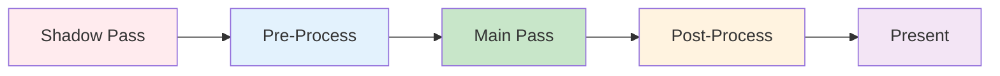

The `helio-render` crate implements the core rendering infrastructure that coordinates GPU resources, manages render pipelines, and executes frame rendering. This is where the abstract concepts of vertices and features become concrete GPU operations—creating pipelines, binding resources, encoding commands, and submitting work to the GPU. The crate provides two renderer types: the legacy `Renderer` for simple forward rendering, and the modern `FeatureRenderer` that supports feature composition and modular shader injection.

## The Rendering Pipeline Problem

Modern GPU rendering involves dozens of configuration decisions that must be made consistently. What vertex layout should the pipeline use? Which shader entry points? What depth testing configuration? How should color blending work? What's the primitive topology—triangles, lines, points? These decisions are interdependent—the vertex layout must match what the shader expects, the depth format must match the depth texture, the color format must match the surface.

Traditional rendering engines handle this through monolithic configuration objects with hundreds of fields. Creating a pipeline requires filling in all fields correctly, and any mismatch causes validation errors or incorrect rendering. Worse, these configurations are duplicated across the codebase—the forward renderer creates one pipeline, the shadow pass creates another, post-processing creates a third. Each duplication is an opportunity for configuration drift and bugs.

Helio's approach centralizes pipeline configuration in renderer constructors. The `Renderer` and `FeatureRenderer` types encapsulate all pipeline state—vertex layout, shader bindings, depth/stencil configuration, and color targets. Creating a renderer automatically creates a correctly configured pipeline. Applications don't directly manipulate pipeline descriptors—they provide high-level inputs (surface format, dimensions, shaders) and the renderer translates these into correct low-level configuration.

## Uniform Buffer Structures

Rendering requires passing data from CPU to GPU—camera matrices, object transforms, material properties, and lighting parameters. Helio defines standard uniform buffer structures that shaders can depend on.

### Camera Uniforms

The `CameraUniforms` structure provides view and projection information:

```rust
#[repr(C)]
#[derive(Clone, Copy, Pod, Zeroable)]
pub struct CameraUniforms {
    pub view_proj: [[f32; 4]; 4],  // Combined view-projection matrix (64 bytes)
    pub position: [f32; 3],         // Camera world position (12 bytes)
    pub _pad: f32,                  // Padding for 16-byte alignment (4 bytes)
}
// Total: 80 bytes
```

> [!NOTE]
> GPU uniform buffers require struct sizes to be multiples of 16 bytes. The `_pad` field ensures proper alignment without any runtime cost.

The **view_proj** field stores the combined view-projection matrix as a 4×4 array of floats. This matrix transforms vertices from world space directly to clip space in a single multiplication. Pre-combining view and projection on the CPU avoids per-vertex matrix multiplication in the vertex shader. The matrix is stored in column-major order (columns are contiguous in memory) matching WGSL's mat4x4 layout. Each column is 16 bytes, and the entire matrix occupies 64 bytes.

> [!TIP]
> Pre-multiplying view and projection matrices on the CPU (once per frame) is faster than multiplying them per-vertex in the shader (potentially millions of times per frame). Always combine matrices on the CPU when possible.

The **position** field stores the camera's world-space position as a 3D vector. Fragment shaders use this for view-dependent effects—specular highlights, reflections, and Fresnel calculations all need the view direction, computed as `normalize(camera_position - fragment_position)`. The position is separate from the view-projection matrix because extracting position from an inverted VP matrix is expensive.

The **_pad** field provides padding to align the structure to 16 bytes. GPU uniform buffers require struct sizes to be multiples of 16 bytes for efficient access. Without padding, the structure would be 76 bytes (64 + 12), which doesn't meet this requirement. Adding 4 bytes of padding brings the total to 80 bytes (5 × 16), satisfying alignment requirements. The padding has no semantic meaning—it's purely for GPU memory layout.

The structure derives `Pod` and `Zeroable` from bytemuck, enabling safe casting to byte slices for GPU buffer writes. It derives `Clone` and `Copy` for easy duplication—cameras are small value types that should be trivially copyable. The `#[repr(C)]` attribute ensures Rust uses C-style layout matching GPU expectations.

### Transform Uniforms

The `TransformUniforms` structure provides per-object transformation:

```rust
#[repr(C)]
#[derive(Clone, Copy, Pod, Zeroable)]
pub struct TransformUniforms {
    pub model: [[f32; 4]; 4],  // Model transformation matrix (64 bytes)
}
// Total: 64 bytes
```

The **model** matrix transforms vertices from model space (the coordinate system the mesh was authored in) to world space (the global scene coordinate system). This matrix encodes position (translation), orientation (rotation), and size (scale) of the object. In the vertex shader, `world_position = model * model_position` converts local coordinates to global coordinates. Normals are transformed similarly but with the fourth component set to 0 to exclude translation: `world_normal = model * vec4(model_normal, 0.0)`.

> [!NOTE]
> Normals are directions, not positions, so they transform with w=0 to exclude translation. Only rotation and scale affect normals—translating the object doesn't change which way its surfaces face.

The structure is exactly 64 bytes, which is a multiple of 16, so no padding is needed. The matrix is column-major like the view-projection matrix. For efficiency, applications should pre-compute model matrices on the CPU rather than building them from position/rotation/scale in the vertex shader—the vertex shader runs once per vertex, so consolidating matrix operations on the CPU (which runs once per object) saves considerable work.

### Shader Data Layouts

Blade-graphics uses the `ShaderData` trait to describe uniform buffer layouts:

```rust
#[derive(blade_macros::ShaderData)]
struct SceneData {
    camera: CameraUniforms,
}

#[derive(blade_macros::ShaderData)]
struct ObjectData {
    transform: TransformUniforms,
}
```

The `#[derive(blade_macros::ShaderData)]` attribute generates the implementation of blade's `ShaderData` trait. This trait provides a `layout()` method that returns a descriptor describing the buffer's structure—field offsets, sizes, and binding points. Blade uses this descriptor to create pipeline layouts that tell the GPU where to find uniform data.

The **SceneData** structure wraps camera uniforms. This represents per-frame data that changes once per frame—the camera moves, but all objects in that frame share the same camera. Binding SceneData at group 0 makes it available to all draw calls within a frame without rebinding.

The **ObjectData** structure wraps transform uniforms. This represents per-object data that changes for each draw call—every object has its own model matrix. Binding ObjectData at group 1 means rebinding it before each draw call, but group 0 (SceneData) remains bound, avoiding redundant camera rebinding.

This two-tier binding strategy is common in forward renderers. Global frame data (camera, global lighting, environment maps) binds once at group 0. Per-object data (transform, material properties) binds per draw call at group 1. Some renderers add group 2 for per-material data (textures, parameters) that changes less frequently than per-object data.

## Legacy Renderer Architecture

The `Renderer` struct provides traditional forward rendering without feature composition:

```rust
pub struct Renderer {
    pipeline: gpu::RenderPipeline,
    depth_texture: gpu::Texture,
    depth_view: gpu::TextureView,
    context: Arc<gpu::Context>,
}
```

The **pipeline** is a blade-graphics render pipeline encapsulating all GPU state—shaders, vertex layout, rasterization configuration, depth testing, color blending. Creating the pipeline compiles shaders to GPU native code and validates all state combinations. Pipelines are relatively expensive to create (hundreds of microseconds) but cheap to use (single GPU register write to switch pipelines).

The **depth_texture** stores per-pixel depth values during rendering. When a fragment is rasterized, its depth (distance from camera) is written to this texture. Before writing the color, the GPU compares the new depth against the existing depth. If the new fragment is closer, it replaces the old depth and color values. If farther, it's discarded. This provides correct occlusion—near objects hide far objects.

> [!IMPORTANT]
> Depth testing is what prevents far objects from drawing over near objects. Without it, rendering order would determine visibility—a recipe for flickering and incorrect occlusion.

The **depth_view** is a GPU handle to the depth texture used during rendering. Textures are created separately from their usage contexts. The view specifies which mip level, array layer, and format to use when the texture is bound as a render target. For simple depth buffers, the view just wraps the base texture with default parameters.

The **context** is a reference-counted blade-graphics GPU context providing access to all GPU operations—creating resources, encoding commands, submitting work queues. The Arc (atomic reference count) allows sharing the context across threads and storing it in multiple structs without ownership conflicts.

### Renderer Construction

Creating a renderer initializes all GPU resources:

```rust
impl Renderer {
    pub fn new(
        context: Arc<gpu::Context>,
        surface_format: gpu::TextureFormat,
        width: u32,
        height: u32,
    ) -> Self {
        let scene_layout = <SceneData as gpu::ShaderData>::layout();
        let object_layout = <ObjectData as gpu::ShaderData>::layout();
        
        let shader_source = std::fs::read_to_string("shaders/main.wgsl")
            .expect("Failed to read shader");
        let shader = context.create_shader(gpu::ShaderDesc {
            source: &shader_source,
        });
        
        let depth_texture = context.create_texture(gpu::TextureDesc {
            name: "depth",
            format: gpu::TextureFormat::Depth32Float,
            size: gpu::Extent { width, height, depth: 1 },
            dimension: gpu::TextureDimension::D2,
            array_layer_count: 1,
            mip_level_count: 1,
            usage: gpu::TextureUsage::TARGET,
            sample_count: 1,
            external: None,
        });
        
        let depth_view = context.create_texture_view(
            depth_texture,
            gpu::TextureViewDesc {
                name: "depth_view",
                format: gpu::TextureFormat::Depth32Float,
                dimension: gpu::ViewDimension::D2,
                subresources: &Default::default(),
            },
        );
        
        let pipeline = context.create_render_pipeline(gpu::RenderPipelineDesc {
            name: "main",
            data_layouts: &[&scene_layout, &object_layout],
            vertex: shader.at("vs_main"),
            vertex_fetches: &[gpu::VertexFetchState {
                layout: &<helio_core::PackedVertex as gpu::Vertex>::layout(),
                instanced: false,
            }],
            primitive: gpu::PrimitiveState {
                topology: gpu::PrimitiveTopology::TriangleList,
                front_face: gpu::FrontFace::Ccw,
                cull_mode: Some(gpu::Face::Back),
                ..Default::default()
            },
            depth_stencil: Some(gpu::DepthStencilState {
                format: gpu::TextureFormat::Depth32Float,
                depth_write_enabled: true,
                depth_compare: gpu::CompareFunction::Less,
                stencil: Default::default(),
                bias: Default::default(),
            }),
            fragment: Some(shader.at("fs_main")),
            color_targets: &[gpu::ColorTargetState {
                format: surface_format,
                blend: None,
                write_mask: gpu::ColorWrites::default(),
            }],
            multisample_state: gpu::MultisampleState::default(),
        });
        
        Self { pipeline, depth_texture, depth_view, context }
    }
}
```

The constructor first retrieves shader data layouts for SceneData and ObjectData. These layouts describe uniform buffer structure to the GPU. The pipeline will bind buffers at group 0 (scene) and group 1 (object), and the layouts tell it how to interpret the buffer contents.

Shader loading reads the WGSL source from disk. In production, this should have error handling beyond `expect`—log the error, fall back to a default shader, or propagate the error upward. The shader is then compiled via `create_shader`, which validates WGSL syntax and compiles to GPU-specific bytecode (SPIR-V, Metal IL, or DXIL depending on platform).

Depth texture creation specifies `Depth32Float` format—32-bit floating point depth values. This provides excellent precision across the entire depth range, preventing Z-fighting (flickering when surfaces overlap) even with large far planes. The texture size matches the render target dimensions. Usage is `TARGET`, meaning it can be rendered into. The texture is 2D with a single layer and mip level—no arrays or mipmaps needed for depth buffers.

The depth view wraps the texture for use as a render target. The view specifies `ViewDimension::D2` (2D texture, not array or cube) and default subresources (layer 0, mip 0). Views are lightweight—they don't copy texture data, just describe how to access it.

Pipeline creation brings everything together. The `data_layouts` parameter specifies uniform binding at groups 0 and 1. The `vertex` parameter points to the shader's vertex entry point (`vs_main` function in WGSL). The `vertex_fetches` parameter describes vertex buffer layout—using `PackedVertex`'s derived layout, not instanced (one vertex per invocation, not per instance).

Primitive state configures rasterization. `TriangleList` topology means every three vertices form a triangle. `FrontFace::Ccw` means counter-clockwise triangles face the camera. `Some(gpu::Face::Back)` enables backface culling—triangles facing away from the camera are discarded early, saving fragment shading. This doubles performance for closed meshes (cubes, spheres) where the back halves are always hidden by front halves.

Depth-stencil state enables depth testing. `depth_write_enabled: true` means fragments write their depth values. `depth_compare: Less` means new fragments pass if their depth is less than (closer than) the existing depth. This creates the standard occlusion behavior—near objects hide far objects. Stencil operations are disabled (default).

Fragment state points to the shader's fragment entry point (`fs_main`). Color targets specify the output format (matching the surface) with no blending (opaque rendering). Multisampling is disabled (1 sample per pixel). The pipeline is now ready for rendering.

### Rendering a Frame

The `render` method executes frame rendering:

```rust
impl Renderer {
    pub fn render(
        &self,
        command_encoder: &mut gpu::CommandEncoder,
        target_view: gpu::TextureView,
        camera: CameraUniforms,
        meshes: &[(TransformUniforms, gpu::BufferPiece, gpu::BufferPiece, u32)],
    ) {
        let mut pass = command_encoder.render(
            "main",
            gpu::RenderTargetSet {
                colors: &[gpu::RenderTarget {
                    view: target_view,
                    init_op: gpu::InitOp::Clear(gpu::TextureColor::OpaqueBlack),
                    finish_op: gpu::FinishOp::Store,
                }],
                depth_stencil: Some(gpu::RenderTarget {
                    view: self.depth_view,
                    init_op: gpu::InitOp::Clear(gpu::TextureColor::White),
                    finish_op: gpu::FinishOp::Store,
                }),
            },
        );
        
        let scene_data = SceneData { camera };
        let mut rc = pass.with(&self.pipeline);
        rc.bind(0, &scene_data);

        for (transform, vertex_buf, index_buf, index_count) in meshes {
            let object_data = ObjectData { transform: *transform };
            rc.bind(1, &object_data);
            rc.bind_vertex(0, *vertex_buf);
            rc.draw_indexed(*index_buf, gpu::IndexType::U32, *index_count, 0, 0, 1);
        }
    }
}
```

The method begins by creating a render pass via `command_encoder.render`. The command encoder is the primary interface for recording GPU commands—render passes, compute dispatches, buffer copies. The render pass specifies render targets—where to draw. The color target is the provided surface view (the window's backbuffer). `init_op: Clear` means fill the target with black before rendering. `finish_op: Store` means save the results to memory after rendering.

The depth target is the renderer's depth view. `init_op: Clear(White)` fills depth with 1.0 (maximum depth, farthest from camera). This ensures the first fragment at each pixel passes depth testing. `finish_op: Store` saves final depth values, though they're often discarded since depth is only needed during the current frame.

The scene data is constructed with camera uniforms. The `pass.with(&self.pipeline)` call binds the render pipeline, configuring all GPU state. The resulting `rc` (render commands) object provides methods for binding resources and drawing geometry. `rc.bind(0, &scene_data)` binds scene data at group 0 using blade's automatic buffer upload—blade allocates a temporary GPU buffer, copies scene_data into it, and binds it.

The loop iterates over meshes, drawing each one. Object data is constructed with the mesh's transform. `rc.bind(1, &object_data)` binds per-object data at group 1, rebinding before each draw call. `rc.bind_vertex(0, ...)` binds the vertex buffer at slot 0. `rc.draw_indexed` issues the draw call—fetching vertices via the index buffer, transforming through the vertex shader, rasterizing, shading fragments, and writing results to the render target.

The parameters to `draw_indexed` specify index buffer piece, index type (u32), index count (how many to draw), base vertex offset (0), first index offset (0), and instance count (1—no instancing). The GPU processes `index_count` indices, looks up corresponding vertices, and renders the resulting triangles.

### Resizing

When the window resizes, depth buffers must be recreated:

```rust
impl Renderer {
    pub fn resize(&mut self, width: u32, height: u32) {
        self.context.destroy_texture_view(self.depth_view);
        self.context.destroy_texture(self.depth_texture);

        self.depth_texture = self.context.create_texture(gpu::TextureDesc {
            name: "depth",
            format: gpu::TextureFormat::Depth32Float,
            size: gpu::Extent { width, height, depth: 1 },
            dimension: gpu::TextureDimension::D2,
            array_layer_count: 1,
            mip_level_count: 1,
            usage: gpu::TextureUsage::TARGET,
            sample_count: 1,
            external: None,
        });

        self.depth_view = self.context.create_texture_view(
            self.depth_texture,
            gpu::TextureViewDesc {
                name: "depth_view",
                format: gpu::TextureFormat::Depth32Float,
                dimension: gpu::ViewDimension::D2,
                subresources: &Default::default(),
            },
        );
    }
}
```

Resizing first destroys the old view and texture. Destroying resources in reverse creation order (view before texture) ensures no dangling references. The view references the texture, so destroying the view first allows the texture to be safely destroyed.

New depth texture and view are created with updated dimensions. The format, usage, and other parameters remain identical—only the size changes. After resize, the render pipeline continues working with the new depth buffer. The pipeline itself doesn't need rebuilding—it references depth format (Depth32Float) not specific dimensions, so dimension changes don't invalidate it.

Applications should call resize when handling window resize events. Failing to resize depth buffers causes validation errors (depth buffer size mismatch with color targets) or incorrect rendering (depth testing uses wrong resolution).

## Feature Renderer Architecture

The `FeatureRenderer` extends the basic renderer with feature composition support:

```rust
pub struct FeatureRenderer {
    pipeline: gpu::RenderPipeline,
    depth_texture: gpu::Texture,
    depth_view: gpu::TextureView,
    context: Arc<gpu::Context>,
    registry: FeatureRegistry,
    frame_index: u64,
    base_shader: String,
    surface_format: gpu::TextureFormat,
}
```

The structure includes everything from `Renderer` plus three additional fields. The **registry** holds all registered features and coordinates their lifecycle. The **frame_index** tracks frame count for time-based effects and debugging. The **base_shader** stores the shader template for recomposition when features are toggled. The **surface_format** is saved for pipeline rebuilding.

### Feature Renderer Construction

Construction initializes features and composes shaders:

```rust
impl FeatureRenderer {
    pub fn new(
        context: Arc<gpu::Context>,
        surface_format: gpu::TextureFormat,
        width: u32,
        height: u32,
        mut registry: FeatureRegistry,
        base_shader: &str,
    ) -> Self {
        let depth_format = gpu::TextureFormat::Depth32Float;

        let feature_context = FeatureContext::new(
            context.clone(),
            (width, height),
            depth_format,
            surface_format,
        );

        registry.init_all(&feature_context);
        let composed_shader = registry.compose_shader(base_shader);
        log::debug!("Composed shader from {} features", registry.enabled_count());

        let shader = context.create_shader(gpu::ShaderDesc {
            source: &composed_shader,
        });

        // Create depth texture and view (same as Renderer)...
        // Create pipeline (same as Renderer but with composed shader)...
        
        Self {
            pipeline,
            depth_texture,
            depth_view,
            context,
            registry,
            frame_index: 0,
            base_shader: base_shader.to_string(),
            surface_format,
        }
    }
}
```

The constructor creates a `FeatureContext` providing features with GPU access, surface info, and formats. Calling `registry.init_all` invokes each feature's `init` method, allowing them to create GPU resources. Shader composition via `registry.compose_shader` collects shader injections from all enabled features, sorts by priority, and replaces markers in the base template with feature code.

The composed shader is logged for debugging. In development, enable `registry.set_debug_output(true)` before composition to write the shader to `composed_shader_debug.wgsl` for inspection. The composed shader is then compiled and used to create the pipeline exactly like the basic renderer.

This design means feature composition overhead is paid once during construction. At runtime, the GPU executes the composed shader with no feature system overhead—no dynamic dispatch, no virtual calls, no runtime composition. The cost is purely during initialization.

### Feature Renderer Frame Execution

Rendering coordinates feature lifecycle alongside actual rendering:

```rust
impl FeatureRenderer {
    pub fn render(
        &mut self,
        command_encoder: &mut gpu::CommandEncoder,
        target_view: gpu::TextureView,
        camera: CameraUniforms,
        meshes: &[(TransformUniforms, gpu::BufferPiece, gpu::BufferPiece, u32)],
        delta_time: f32,
    ) {
        let mut context = FeatureContext::new(
            self.context.clone(),
            (0, 0),
            gpu::TextureFormat::Depth32Float,
            self.surface_format,
        );
        context.update_frame(self.frame_index, delta_time);

        self.registry.prepare_frame(&context);

        // Convert meshes to MeshData for shadow passes
        let mesh_data: Vec<MeshData> = meshes.iter().map(|...| MeshData { ... }).collect();

        // Calculate light view-projection (currently hardcoded)
        let light_view_proj = calculate_light_matrix();

        self.registry.execute_shadow_passes(command_encoder, &context, &mesh_data, light_view_proj);
        self.registry.execute_pre_passes(command_encoder, &context);

        // Main render pass (same as basic Renderer)...

        self.registry.execute_post_passes(command_encoder, &context);
        self.frame_index += 1;
    }
}
```

Frame rendering follows a structured sequence. First, create updated feature context with current frame index and delta time. Call `prepare_frame` on all enabled features, allowing them to update uniforms or animation state. Convert mesh data to the format expected by shadow features.

> [!NOTE]
> The frame_index increments every frame, giving features a monotonic counter for time-based effects. At 60 FPS, it takes 9.7 million years to overflow a u64 frame counter—you're safe.

Execute shadow passes via `execute_shadow_passes`. Features that implement shadow rendering (like procedural-shadows) render scene geometry into shadow maps during this phase. Execute pre-render passes via `execute_pre_passes`. Features can use this for any custom rendering before the main pass—compute dispatches, depth-only passes, or setup work.

The main render pass happens next, identical to the basic renderer—clear targets, bind pipeline, bind scene data, iterate meshes binding object data and drawing. Execute post-render passes via `execute_post_passes`. Features use this for post-processing—bloom, tone mapping, or other screen-space effects.

Finally, increment frame index. This provides a monotonically increasing counter features can use for time-based effects. At 60 FPS, the counter reaches 216,000 per hour—well within u64 range (would overflow after 9.7 million years of runtime).

### Pipeline Rebuilding

When features are toggled, the pipeline must be rebuilt:

```rust
impl FeatureRenderer {
    pub fn rebuild_pipeline(&mut self) {
        log::info!("Rebuilding pipeline with {} enabled features", 
                  self.registry.enabled_count());

        let composed_shader = self.registry.compose_shader(&self.base_shader);
        let shader = self.context.create_shader(gpu::ShaderDesc {
            source: &composed_shader,
        });

        // Recreate pipeline with new shader...
    }
}
```

Rebuilding recomposes the shader from currently enabled features, compiles it, and creates a new pipeline. The old pipeline is automatically cleaned up by blade-graphics. Depth buffers and other resources are unaffected—only the pipeline changes.

Rebuilding takes 100-500 microseconds depending on shader complexity. Applications should trigger rebuilds in response to user input (pressing hotkeys to toggle features) or state changes (loading different content), not every frame. Frequent rebuilding hurts frame pacing—a sudden 500μs pause every frame causes stuttering.

## Frame Coordination Patterns



Effective rendering requires coordinating multiple passes and resources in the correct order.

**Shadow-Then-Main Pattern**: Shadow mapping requires two passes. The shadow pass renders geometry from the light's perspective into a shadow map. The main pass renders from the camera's perspective, sampling the shadow map to determine shadowing. The shadow pass must complete before the main pass begins—the shadow map must contain valid depth data before sampling.

**Pre-Process-Main-Post Pattern**: Complex renderers use three stages. Pre-processing generates data for the main pass—shadow maps, light maps, or intermediate buffers. Main rendering draws visible geometry with full lighting. Post-processing applies screen-space effects to the completed image—bloom, tone mapping, motion blur.

**Multi-Target Pattern**: Deferred rendering uses multiple render targets simultaneously. The geometry pass writes position, normal, and material properties to separate textures. The lighting pass reads these textures and computes lighting, writing results to the final color target. This pattern requires careful resource state management—ensuring textures are finished writing before reading begins.

**Frame Pacing**: Consistent frame times require balanced workload distribution. If the shadow pass takes 12ms, main pass 4ms, and post-process 0.5ms, the frame time is 16.5ms (60 FPS). Reducing shadow resolution might drop shadow pass to 8ms, achieving 12.5ms total (79 FPS). The key is identifying bottlenecks and optimizing them, not spending time optimizing passes that aren't the limiting factor.

Helio's feature system supports these patterns through pre-pass, main pass, and post-pass hooks. Features execute in the appropriate phase, and the renderer ensures correct sequencing. Applications don't manually coordinate passes—they register features and let the renderer handle execution order.

## Performance Considerations

The rendering infrastructure has measurable performance characteristics.

**Pipeline Switching Cost**: Binding a different pipeline takes 10-50 nanoseconds on modern GPUs—it's essentially a single register write. However, switching pipelines too frequently can cause bubbles in the GPU pipeline where the GPU waits for the new state to propagate. Batching draws by pipeline (draw all objects using pipeline A, then all using pipeline B) maximizes GPU utilization.

**Uniform Buffer Updates**: Blade's automatic buffer upload creates temporary buffers for small data like CameraUniforms. This is efficient for small, per-frame data. For large or frequently updated buffers, applications should create persistent buffers and update them via mapping rather than using automatic upload. The crossover point is typically 1KB—smaller buffers use automatic upload, larger use persistent buffers.

**Depth Buffer Precision**: Depth32Float provides excellent precision but consumes bandwidth. On bandwidth-constrained GPUs (integrated graphics), Depth24Plus (24-bit depth + 8-bit stencil) saves 25% bandwidth with minimal quality loss. Depth16Unorm (16-bit) saves 50% but causes Z-fighting on large scenes. Measure bandwidth usage before optimizing depth format—modern discrete GPUs handle Depth32Float easily.

**Draw Call Overhead**: Each `draw_indexed` call has CPU overhead (100-200 nanoseconds) and GPU overhead (pipeline front-end processing). Scenes with tens of thousands of small draws can be CPU bottlenecked. Instancing (drawing many copies with one draw call) reduces overhead. GPU-driven rendering (indirect draws from compute shaders) eliminates CPU overhead entirely.

**Resource Destruction**: Destroying resources (textures, buffers, pipelines) rarely stalls the GPU. Blade implements deferred destruction—resources are marked for deletion but only actually freed once the GPU finishes using them. This means resize operations (destroying and recreating depth buffers) don't cause frame hitches.

The key insight is that the rendering infrastructure itself is not a performance bottleneck in typical applications. Bottlenecks occur in shader complexity, draw call count, or bandwidth usage—not in the overhead of pipeline binding or uniform uploads. The infrastructure's job is staying out of the way, providing a clean API without adding measurable overhead.
