# Mission Control - Profiling & System Monitoring

Mission Control is Pulsar Native's built-in developer monitoring panel. It gives you a live view of every hardware resource and every byte your game is touching - CPU cores, GPU engines, RAM pools, network throughput, disk I/O, and your own engine's allocation categories - all refreshed every second without any instrumentation code on your part.

You open it from the editor menu bar under **Window → Mission Control**. The panel is designed to stay open in a second monitor or a floating window while you play your game in the editor, so you can watch numbers move in real time rather than exporting a trace and analysing it after the fact.

---

## How Mission Control is Organised

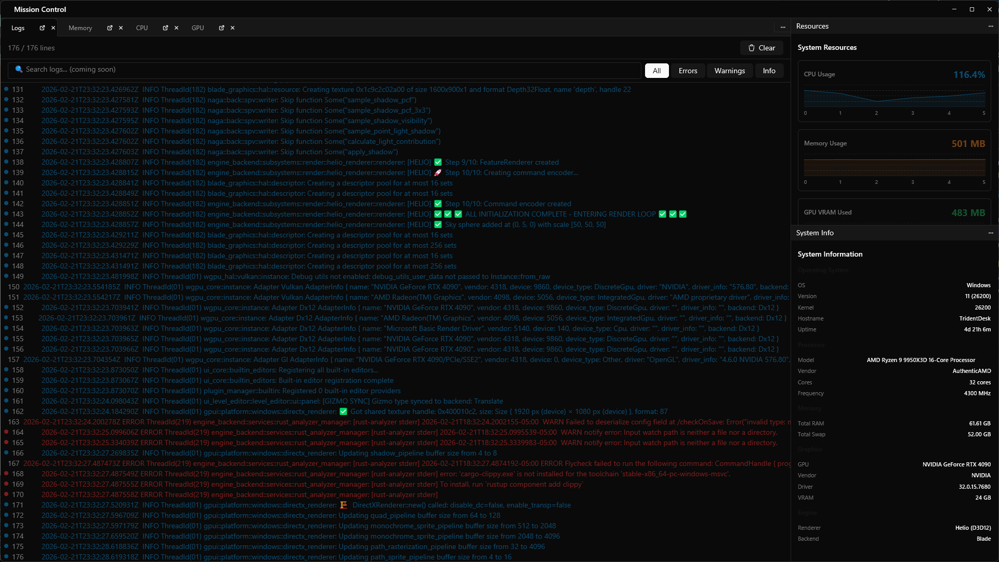

The window is split into two docks that live side by side.

The **center dock** holds four tabbed panels. The **Logs** tab streams engine output as it happens. The **Memory** tab is a deep dive into every layer of memory - from kernel pools all the way down to individual engine allocation categories. The **CPU** tab shows a live chart for each logical processor core plus any available temperature sensors. The **GPU** tab exposes per-engine utilisation, dedicated and shared VRAM, and static adapter information.

The **right dock** is split vertically. The top half is the **Resources** panel - eight compact area-charts covering CPU, memory, GPU VRAM, frame rate, network RX/TX, and disk read/write, all visible at a glance without switching tabs. The bottom half is the **System Info** panel, which displays static hardware specifications detected at startup and never changes during a session.

---

## The Logs Tab

The Logs panel is a live tail of every event emitted through Pulsar's `tracing` integration. Every `trace!`, `debug!`, `info!`, `warn!`, and `error!` call in engine code - and in any crate that subscribes to the tracing subscriber - appears here within milliseconds of being emitted, colour-coded by severity.

`TRACE` and `DEBUG` lines appear in subdued grey; they are usually very high frequency and most useful when you are chasing a specific bug in a tight loop. `INFO` lines are white and represent normal engine lifecycle events - things like "asset loaded", "scene activated", or "server connected". `WARN` lines are yellow and deserve attention: the engine uses them for conditions that are recoverable but suboptimal, such as a frame taking longer than its target budget, an asset being streamed mid-frame, or a scripting sandbox hitting a resource limit. `ERROR` lines are red and always represent something the engine could not handle gracefully.

When you open Mission Control during a play session, one of the first things worth doing is letting the game run for thirty seconds and watching the Logs tab for yellow warnings. A game that runs at 60 FPS can still be silently degrading - dropping texture mips, rebuilding acceleration structures on the fly, or hitting scripting memory limits - and the warnings tell you that story before the frame rate does.

---

## The Memory Tab

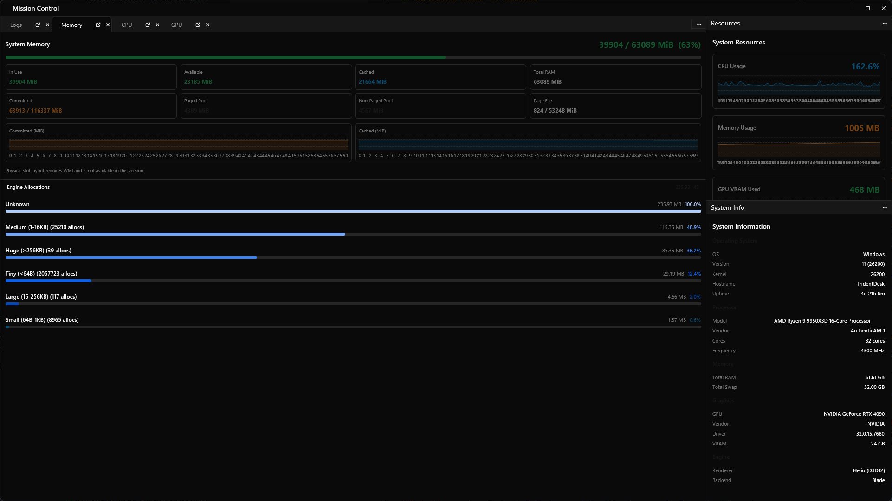

The Memory tab is laid out in two major sections. At the top is a live snapshot of the system's entire RAM state, drawn from the operating system's own performance counters. Below that is a scrollable list of every named allocation category tracked by Pulsar's custom allocator.

### System Memory at a Glance

The top section opens with a large heading that reads **In Use / Total MiB** with a percentage, backed by a horizontal bar that turns yellow at 65 % utilisation and red at 85 %. Below that are eight stat cards arranged in a 4×2 grid.

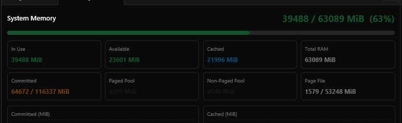

**In Use** is the RAM actively mapped by all running processes at this moment. It is the number Windows shows in the big graph on its own Task Manager performance tab. When this number is high - especially above 80 % of total - the operating system has very little headroom before it must start evicting pages to disk, which causes the stuttering that players notice as hitching even when the frame rate counter looks fine.

**Available** is the memory the OS can hand out immediately. This includes not just genuinely free pages but also the "standby" pages in the file cache that can be reclaimed the instant something else needs RAM. A healthy system always has some available memory; if available drops to near zero the system is under severe pressure.

**Cached** comes from Windows' `GetPerformanceInfo` API and represents the system file cache - pages of disk content that the OS has loaded into RAM speculatively to speed up future reads. A high Cached number is a good sign; the OS is making use of free RAM productively. If you watch this number drop sharply during a loading screen it usually means the OS is reclaiming cache pages to hand to your game, which is normal and expected.

**Total RAM** is the physical memory installed, as reported by the OS. This is your absolute ceiling.

**Committed** shows virtual memory that all processes have reserved and backed - either by physical RAM or by a page file. The format is `used / limit`, where the limit is the sum of physical RAM plus the total capacity of all page files. Committed memory approaching its limit is a serious warning: at that point, new allocations will fail even if physical RAM still shows free pages, because the commit charge has been exhausted. If you are developing a large open-world game with extensive streaming, watch Committed over a long session and make sure it is not climbing indefinitely.

**Paged Pool** and **Non-Paged Pool** are kernel-managed memory regions used by Windows device drivers, the file system, and the kernel itself. The Paged Pool can be swapped to disk under memory pressure; the Non-Paged Pool must always remain in physical RAM because interrupt handlers and DMA operations depend on it. Both come from `GetPerformanceInfo`. Under normal conditions these are steady and modest. If you see the Paged Pool climbing steadily you may have a handle leak in a native plugin or a driver that is not cleaning up after itself.

**Page File** shows how much of your configured virtual memory swap space is in use. A game that spills heavily into the page file - especially a spinning-disk page file - will have unpredictable frame times because disk access latency is orders of magnitude higher than RAM latency.

> ℹ️ On Linux and macOS, the Windows-specific counters (Cached, Committed, Paged Pool, Non-Paged Pool) will show **N/A**. The remaining cards (In Use, Available, Total RAM, Page File) are populated by `sysinfo` on all platforms.

### Committed and Cached History Charts

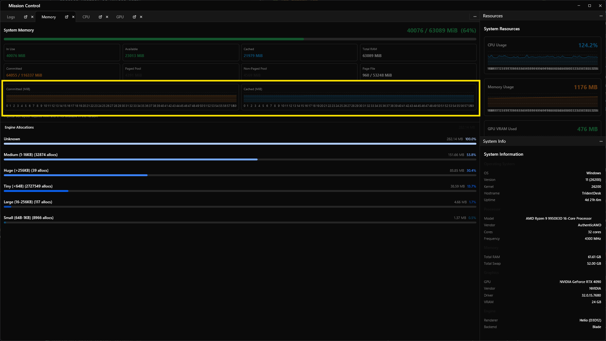

Directly below the stat grid are two area charts that plot Committed and Cached memory over the last 60 seconds. These charts tell a story that the instant numbers cannot.

A Committed chart that rises steadily throughout a play session - even if In Use looks stable - is almost always a virtual memory leak. The process is allocating virtual address space and not releasing it, even if those pages are not all resident in RAM. Rust's ownership model prevents many heap leaks, but native plugin interop, Vulkan/D3D resource descriptors, and file mappings can all accumulate without being freed.

The Cached chart normally moves inversely with In Use - as your game demands more RAM, the OS reclaims cache pages and Cached drops. If you see Cached crash suddenly while In Use stays flat, it usually means another application on the system took a large allocation, which is useful to know when you are trying to reproduce a frame-rate complaint.

### Engine Allocation Breakdown

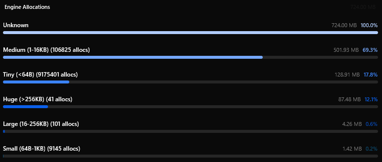

Below the system stats is a virtual scrolling list driven by Pulsar's `TrackingAllocator`. Every time engine code requests memory through a named `MemoryCategoryGuard`, the allocator records how many bytes are held by that category. The list shows each category's name, its current size in megabytes, and a progress bar that shows its share of all tracked allocations.

This is the section you turn to when Total RAM looks fine but your game is using more memory than expected. The system stat cards tell you how much memory the OS thinks you are using; this list tells you which parts of the engine own that memory. If texture allocations are 70 % of everything you have headroom to reduce texture resolution or streaming distances. If mesh allocations are large you might have LOD generation holding redundant copies of geometry. If the audio category is growing throughout a session you might have a sound asset that is being loaded but never unloaded.

The categories are whatever the engine's own source code defines. If you add a new subsystem and tag its allocations with a `MemoryCategoryGuard`, it will appear in this list automatically the next time you open Mission Control.

> [!NOTE]
> **Physical memory slot layout** - manufacturer, speed, generation (DDR4 / DDR5), and which motherboard slots are occupied - requires Windows Management Instrumentation (WMI) and is not currently available.

---

## The CPU Tab

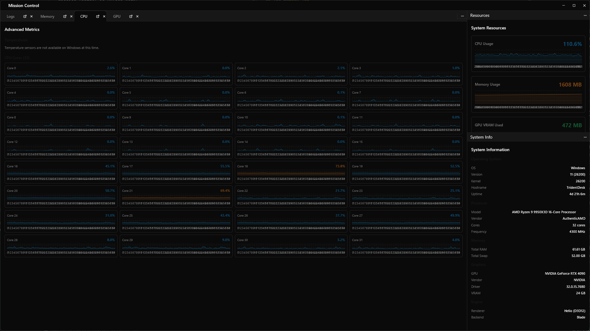

The CPU tab shows a 60-second history for every logical processor core on the machine, laid out in a uniform 4-column grid so that even a 32-core machine fits on screen without scrolling too far. Each card carries the core's current usage percentage in the top-right corner, and the chart area fills with an area chart coloured to reflect load: blue for normal, yellow for elevated (above 60 %), and red for near-saturation (above 80 %).

Understanding the pattern of core usage is more useful than just watching the total CPU percentage. A single core pinned at 100 % while the other fifteen are at 5 % is a fundamentally different problem from all sixteen cores sitting at 65 %. The former is a single-threaded bottleneck - almost always the main thread or a synchronous physics or script tick. The latter is a resource contention problem where the thread pool has enough work but is constrained by memory bandwidth, cache pressure, or synchronisation primitives.

If you see one core consistently red, the first step is to open the Logs tab at the same time and watch for `WARN` lines that mention timing. The engine emits warnings when a system exceeds its tick budget, and those warnings will identify the subsystem to profile in more detail. From there, the Flamegraph profiler (accessible from the status bar) can show you the exact call tree causing the bottleneck.

When all cores are high and frame rate is acceptable, you are in a good position - the engine is efficiently distributing work. If all cores are high and frame rate is poor, you have genuinely hit the ceiling of the CPU and need to reduce simulation complexity, lower the physics tick rate, or move work to compute shaders on the GPU.

### Temperature Sensors

When temperature data is available, each thermal zone detected by the system gets its own mini area-chart in the same 4-column grid style as the core charts. Green means the sensor is reading below 70 °C, which is comfortable for sustained load on most desktop hardware. Yellow means 70–85 °C, which is within spec for most modern CPUs but indicates the cooling solution is working hard - watch this during long play sessions and stress tests. Red means above 85 °C, at which point most CPUs begin thermal throttling, artificially reducing their clock speed to protect themselves. Throttling looks like a sudden unexplained drop in frame rate or physics tick consistency; if you see that and the temperature chart is red, the fix is cooling, not code.

**A note on Windows.** Temperature sensors are not available on Windows at this time. Pulsar's temperature collection uses the `sysinfo` crate, which queries the `MSAcpi_ThermalZoneTemperature` WMI class. On the vast majority of modern Windows hardware, motherboard and CPU thermal sensors are exposed by vendor-specific drivers rather than through the standard ACPI thermal zone interface, so the WMI query returns no data. If you need temperatures on Windows during development, your motherboard's monitoring software (Armory Crate, Precision X1, HWiNFO64, or similar) is the reliable path. A future version of Mission Control may integrate a native Windows thermal reading path.

---

## The GPU Tab

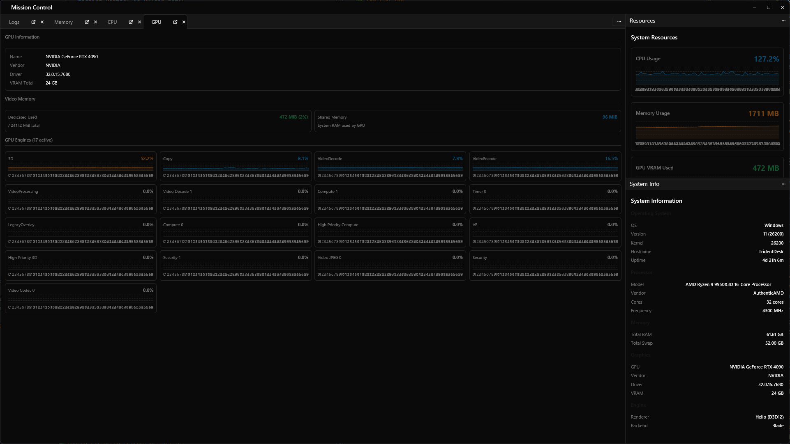

The GPU tab is the section most relevant to rendering engineers and technical artists. It combines static adapter identification, live video memory tracking, and per-engine utilisation charts into a single view.

### GPU Information

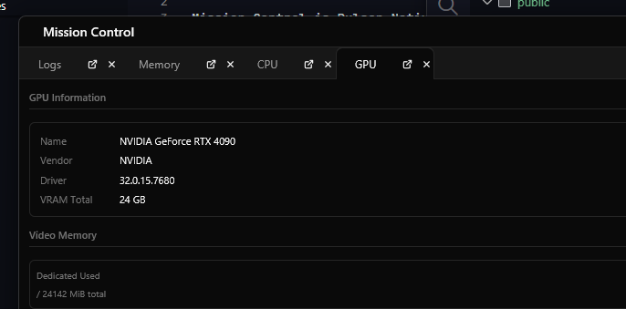

At the top of the GPU tab is a simple information card. The GPU name and vendor come from the `wgpu` adapter enumeration path, which works on all platforms and backends. On Vulkan the driver version string comes directly from the adapter info; on Direct3D 12 the wgpu path often returns an empty string, so Pulsar falls back to reading the driver version from the Windows registry at `HKLM\SYSTEM\CurrentControlSet\Control\Class\{4d36e968-e325-11ce-bfc1-08002be10318}`, the Display class key. The total VRAM figure comes from DXGI's `IDXGIAdapter1::GetDesc1()` on Windows, from `/sys/class/drm/` sysfs entries on Linux, and from `system_profiler SPDisplaysDataType` on macOS.

Knowing your driver version at a glance matters when users report GPU-specific bugs. A driver version card in a bug report tells you immediately whether the problem is a known driver issue or something in your code.

### Video Memory

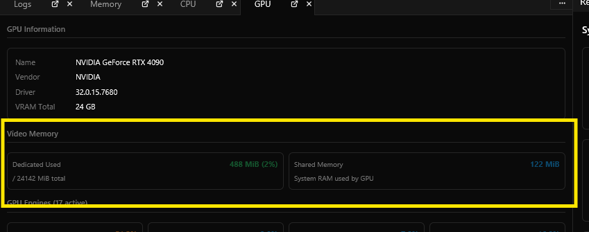

The Video Memory section has two cards. The left card shows **Dedicated Used** - the GPU's local, on-board VRAM that is actively mapped, expressed both in MiB and as a percentage of total dedicated VRAM. The right card shows **Shared Memory** - system RAM that the GPU has mapped into its address space.

Dedicated VRAM is fast. Shared memory is not. When your game's GPU working set overflows dedicated VRAM, the driver begins mapping system RAM into the GPU's page table and accessing it over PCIe. PCIe bandwidth is typically 16–32 GB/s depending on generation - dramatically lower than the 400–900+ GB/s of on-board GDDR6/GDDR6X memory. The symptom is not just lower frame rate but inconsistent frame time, because page evictions happen at unpredictable moments.

The Dedicated Used card turns yellow at 65 % and red at 85 %. If you are working on a scene and the card is red, the first things to examine are render target sizes (shadow maps, reflection captures, and screen-space buffers scale quadratically with resolution), texture streaming distances, and whether any systems are holding multiple versions of large assets simultaneously.

The Shared Memory card is informational. Some amount of shared memory usage is normal - constant buffers, small dynamic uploads, and per-frame staging data often live in system RAM by design. A large and growing Shared Memory value (several hundred MiB or more) is a signal that asset data is overflowing dedicated VRAM and the engine is degrading gracefully rather than crashing. Watch this value during a long flight through an open-world scene.

### GPU Engines

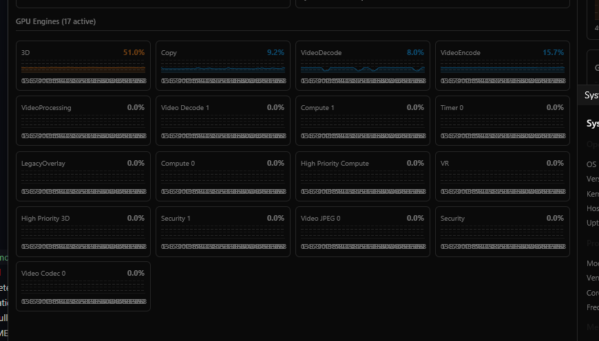

The GPU Engine section is populated on Windows by querying the Windows Performance Data Helper (PDH) counter `\GPU Engine(*)\Utilization Percentage`. This is the exact data source that Windows Task Manager uses for its own GPU engine breakdown. Each distinct engine type detected on the adapter gets its own mini chart card in the 4-column grid, updated every second.

Understanding what each engine type means for a game engine takes a little context.

The **3D engine** handles every draw call, render pass, and graphics pipeline compute shader. When you are rendering a complex scene with many shadow cascades, a high-resolution reflection capture, and dozens of particle systems, this engine will be the most active one. A 3D engine consistently above 80 % means you are GPU-bound on rasterisation and compute work that runs through the graphics queue. To reduce 3D engine load you might reduce shadow resolution, consolidate draw calls through instancing, simplify materials, or reduce overdraw in transparent layers.

The **Copy engine** handles buffer and texture transfers - uploading assets from CPU-accessible staging buffers into GPU-local memory, copying between render targets, and resolving multisampled surfaces. During loading screens the Copy engine will spike as streaming geometry and textures are uploaded. In a well-optimised game the Copy engine should be relatively quiet during gameplay, with small spikes when new assets stream in. A Copy engine that is consistently high during gameplay indicates that your streaming system is uploading too much per frame; consider spreading uploads over more frames or pre-warming assets before they become visible.

The **VideoDecode engine** handles hardware-accelerated video decoding. If your game uses compressed video for cutscenes, in-game video textures, or FMV sequences, this engine will activate during playback. A spike here is entirely normal and expected; it just tells you the video subsystem is active.

The **VideoEncode engine** handles hardware-accelerated video encoding. In the context of Pulsar, it becomes active when the engine is capturing screen recordings or encoding replay data. High VideoEncode utilisation during normal gameplay is unexpected and worth investigating.

The **Compute engines** (shown as Compute_0, Compute_1, etc., depending on how many async compute queues the GPU exposes) handle GPU compute work that runs on a separate hardware queue from the 3D engine. Physics simulation, particle systems, GPU-driven culling, and neural network inference for upscaling (DLSS, XeSS, FSR) all appear here. Having both the 3D engine and the Compute engine active simultaneously is a sign that the engine is successfully overlapping graphics and compute work, which is a good thing. If Compute is high and 3D is idle, you have a compute-bound bottleneck - perhaps an overly complex particle simulation or a physics solver that needs its work budget reduced.

> ℹ️ On Linux and macOS, PDH is a Windows-only API and the engine grid will show "No engine data - PDH counters unavailable on this system." Linux alternatives (like reading from `/sys/class/drm/` or `amdgpu` sysfs) are planned for a future version.

---

## The Resources Panel

The Resources panel lives in the top half of the right dock and is always visible regardless of which center tab you have selected. Its purpose is to give you a peripheral view of the eight most important health metrics so you can notice when something starts moving without actively looking for it.

All eight charts share a 60-second scrolling history window with one sample per second. The charts are not labelled with axis values - they are designed for relative trend reading, not precise measurement. When you need a precise number, glance at the bold value text in the top-right of each card. When you want to know whether something has been climbing for the last minute, look at the chart shape.

The **CPU Usage** chart shows the engine process's own CPU consumption as a fraction of a single core. If the process uses four threads each at 25 %, this reports 100 %. It is process-level, not system-wide, so it directly reflects the engine's own workload rather than being polluted by background applications.

The **Memory Usage** chart shows the engine process's resident set size (RSS) - how many megabytes of physical RAM are actually mapped to the process's pages right now. This is not the same as the In Use figure on the Memory tab (which is system-wide); this is specifically the game's footprint. A rising RSS during a play session while In Use stays flat means your game is consuming more RAM than is being freed, which will eventually pressure the system.

The **GPU VRAM Used** chart shows the same dedicated VRAM figure as the Dedicated Used card on the GPU tab. Having it here lets you watch GPU memory and frame rate simultaneously without switching tabs.

The **Frame Rate** chart shows the engine's reported FPS. When both Frame Rate and CPU Usage are high, you are likely CPU-bound. When Frame Rate is low but CPU Usage is also low, the GPU is the bottleneck - which you can confirm by switching to the GPU tab and checking engine utilisation.

The **Network In** and **Network Out** charts are system-wide and measured in KB/s, automatically switching to MB/s when the value exceeds 1024 KB/s. During solo development these are usually near zero. During multiplayer testing they tell you your bandwidth cost and help you size your packet budgets.

The **Disk Read** and **Disk Write** charts are process-level and show how much data the engine process is reading from and writing to disk per second. Disk Read spikes are normal during loading screens; persistent Disk Read activity during gameplay means your streaming system is loading assets that were not pre-cached. Disk Write spikes during gameplay are less common and usually indicate logging, telemetry, or autosave activity.

---

## The System Info Panel

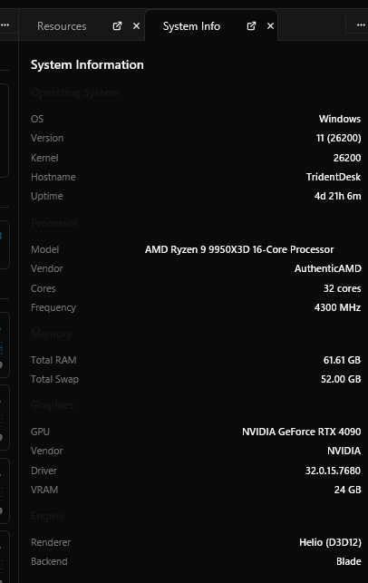

The System Info panel occupies the bottom half of the right dock. Unlike everything else in Mission Control, it shows static information collected at startup and does not update during the session. Its purpose is to give you the context you need to interpret the live numbers above it and to capture system specifications for bug reports.

The **Operating System** section shows the OS name, version string, kernel version, machine hostname, and uptime. The uptime counter is live - it ticks every second - and is occasionally useful when trying to determine whether a bug you are chasing only appears after the machine has been running for many hours (a symptom of driver memory fragmentation or a kernel resource leak).

The **Processor** section shows the CPU model name, vendor string, logical core count, and base frequency in MHz. Note that this is the base frequency, not the current boost clock. Modern CPUs boost far above their base frequency under load, but the base frequency tells you the chip family and gives you a lower bound.

The **Memory** section shows total installed RAM and total configured swap/page-file space, expressed in gigabytes. These figures come from `sysinfo` and match what the OS reports. If you are running on a machine with a very small page file (or none at all), the Committed limit on the Memory tab will be close to physical RAM, and you may see Committed approaching 100 % more easily.

The **Graphics** section shows the GPU name, vendor, driver version string, and total VRAM - the same figures shown on the GPU tab's information card. Having them here in the persistent right dock means you can read them at any time without switching to the GPU tab.

The **Engine** section shows the renderer name and graphics backend. As Pulsar's rendering infrastructure evolves, this section will expand to include the active feature set, enabled extensions, and selected rendering path.

---

## Practical Profiling Workflows

The individual panels each tell part of the story, but the real value of Mission Control comes from using several of them together. Here are the most common workflows.

**Investigating a frame rate drop.** When your game starts hitching, open Mission Control and look at the Resources panel first. If the CPU chart spikes at the same time as the frame rate drops, switch to the CPU tab and look for individual cores that are red. If one core in particular is consistently above 80 % while others are not, you have a single-threaded bottleneck. Switch to Logs and watch for `WARN` lines - the engine records which system exceeded its budget. From there you have enough context to open the Flamegraph profiler for a detailed call-tree view.

If the CPU chart is fine but frame rate is dropping, switch to the GPU tab. If the 3D engine is near 100 %, you are GPU-bound on draw calls and shader work. If the Copy engine is high, you have a streaming upload bottleneck. If all engines are low and frame rate is still poor, check whether VRAM is near capacity - driver page evictions are invisible in the engine charts but will destroy frame consistency.

**Catching memory leaks.** Load a scene, note the Committed and RSS values, then play for 10–15 minutes doing typical gameplay. Return to Mission Control and check Committed on the Memory tab. If it has climbed steadily without a gameplay reason (loading more areas, spawning many entities), you have a virtual memory leak. Switch to the allocation breakdown list and sort by size mentally - which category has grown the most? That gives you the subsystem to investigate in code.

**Characterising a new machine.** When onboarding a new development machine or reproducing a player's hardware configuration, open System Info and read the CPU, Memory, and Graphics sections. These tell you the chip family, core count, RAM ceiling, and GPU tier instantly. Cross-reference the GPU total VRAM with the Dedicated Used chart from a representative scene to understand how close the asset budget comes to the hardware limit.

**Multiplayer bandwidth budgeting.** Run a hosted server session, open Mission Control, and watch the Network In and Network Out charts in the Resources panel over several minutes of representative gameplay. The shapes of those charts tell you peak and average bandwidth. If the Network Out line for the server frequently spikes above your target budget, you need to reduce packet frequency, compress payloads, or prioritise which state updates are sent each tick.

