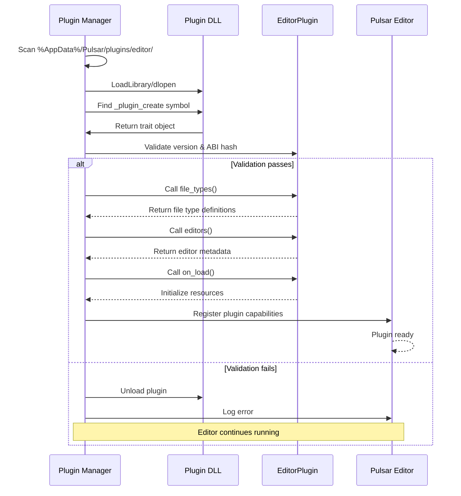

# Plugin System

> [!NOTE]
> Pulsar plugins are compiled Rust DLLs, not scripts. This gives you native performance and full API access.

Pulsar's plugin system is one of its most distinctive features. Unlike engines that use scripting languages or interpreted code for extensions, Pulsar plugins are compiled Rust dynamic libraries loaded at runtime. This gives you native performance, full type safety, and complete access to the editor API—while maintaining the flexibility of a plugin architecture.

## Why Dynamic Libraries?

Let's start with the question you're probably asking: why use DLLs (dynamic link libraries) for plugins instead of something simpler like scripts or configuration files?

### The Performance Argument

Plugins run at native speed. There's no interpreter, no virtual machine, no JIT warmup time. When your plugin needs to process thousands of files or render a complex editor panel, it does so with zero overhead.

This matters when you're building professional tools. A material editor that lags when scrolling through properties isn't usable. A custom file format that takes seconds to load becomes a workflow bottleneck. Native code eliminates these problems.

### The Safety Argument

Rust's compiler checks your plugin code before it ever runs. Memory safety, thread safety, type correctness—all verified at compile time. Most plugin bugs are caught before you even load the DLL.

Compare this to scripting languages where typos can hide until that exact code path runs, or where memory corruption can cause mysterious crashes hours later.

### The Power Argument

Plugins have access to the full editor API. Not a restricted sandbox, not a limited subset—everything. You can:

- Register custom file types with complex folder structures
- Implement sophisticated editors with GPUI's full UI toolkit
- Hook into engine events and react to project changes
- Add statusbar buttons and integrate with existing panels
- Query the type database and rust-analyzer for code intelligence

This is powerful because it means plugins aren't second-class citizens. They can do anything the built-in editor code can do.

## How Plugins Work

Let's demystify the technical details. Understanding how plugins load and execute helps you write better ones.

### The Loading Process

When Pulsar starts, the plugin manager follows this sequence:



**Step-by-step:**

1. **Scans the plugin directory** - Looks in `%AppData%/Pulsar/plugins/editor/` for DLL files
2. **Loads each DLL** - Uses platform-specific APIs (`LoadLibrary` on Windows, `dlopen` on Unix)
3. **Finds the entry point** - Looks for the `_plugin_create` symbol
4. **Calls the entry point** - Gets a trait object implementing `EditorPlugin`
5. **Validates the plugin** - Checks version compatibility and ABI hash
6. **Registers capabilities** - Calls `file_types()`, `editors()`, etc. to learn what the plugin provides
7. **Calls `on_load()`** - Gives the plugin a chance to initialize

If any step fails, the plugin is unloaded and an error is logged. The editor continues running—one broken plugin shouldn't take down the entire application.

### The Plugin Interface

Every plugin implements the `EditorPlugin` trait:

```rust
pub trait EditorPlugin: Send + Sync {
    // Required: Plugin metadata
    fn metadata(&self) -> PluginMetadata;
    
    // Required: What file types does this plugin handle?
    fn file_types(&self) -> Vec<FileTypeDefinition>;
    
    // Required: What editors does this plugin provide?
    fn editors(&self) -> Vec<EditorMetadata>;
    
    // Required: Create an editor instance
    fn create_editor(
        &self,
        editor_id: EditorId,
        file_path: PathBuf,
        window: &mut Window,
        cx: &mut App,
        logger: &EditorLogger,
    ) -> Result<(Arc<dyn PanelView>, Box<dyn EditorInstance>), PluginError>;
    
    // Optional: Lifecycle hooks
    fn on_load(&mut self) {}
    fn on_unload(&mut self) {}
    
    // Optional: Statusbar integration
    fn statusbar_buttons(&self) -> Vec<StatusbarButtonDefinition> { vec![] }
}
```

This interface is a contract. The editor knows how to call these methods, and plugins know what to implement. The trait abstraction gives us polymorphism without inheritance or virtual dispatch overhead (beyond the trait object itself).

### Memory Management Across the FFI Boundary

> [!WARNING]
> Plugins and the editor have separate heaps. Never allocate in one and free in the other - this will crash on Windows.

Here's where things get interesting. Plugins and the main editor run in different memory spaces—the plugin allocates in its DLL heap, the editor in its own heap. You cannot allocate memory in one and free it in the other on Windows (you can on Unix, but for portability we don't).

This means:

**Plugins own their data** - When you return a `Box<dyn EditorInstance>`, that memory lives in the plugin's heap.

**The editor never calls `drop`** - Instead, plugins export `_plugin_destroy` functions:

```rust
#[no_mangle]
pub extern "C" fn _plugin_destroy(plugin: *mut dyn EditorPlugin) {
    unsafe {
        let _ = Box::from_raw(plugin); // Drops in plugin heap
    }
}
```

**Shared data uses Arc** - Reference-counted pointers work across the boundary because the atomic operations are in the shared data itself, not the heap.

**String ownership matters** - Use `String` or `Arc<str>` for owned strings. Avoid raw `*const c_char` unless you understand the lifetime implications.

This sounds complex, but in practice the `plugin_editor_api` crate handles most of it. Follow the patterns in the example plugins and you'll be fine.

## File Type Registration

Plugins tell the editor about new asset types. This enables "New File" menus, file icons, and editor associations.

### Standalone Files

Most assets are single files:

```rust
fn file_types(&self) -> Vec<FileTypeDefinition> {
    vec![
        standalone_file_type(
            "my-config",              // Unique type ID
            "cfg",                    // File extension
            "Configuration File",     // Display name
            ui::IconName::Settings,   // Icon
            gpui::rgb(0x3B82F6),     // Icon color (blue)
            serde_json::json!({       // Default content
                "version": 1,
                "settings": {}
            }),
        )
    ]
}
```

When a user creates a new file of this type, Pulsar generates `filename.cfg` with the default content, then opens your editor.

The type ID must be globally unique. Use a reverse-domain convention like `"com.mycompany.mytype"` if you're distributing plugins publicly.

### Folder-Based Files

Some assets are folders that the engine treats as a single file:

```rust
folder_file_type(
    "my-complex-asset",
    "asset",                     // Folder extension: myfile.asset/
    "Complex Asset",
    ui::IconName::Folder,
    gpui::rgb(0x8B5CF6),        // Purple
    "manifest.json",             // Marker file (identifies this folder type)
    vec![                        // Template structure
        PathTemplate::File {
            path: "manifest.json".into(),
            content: r#"{"name": "New Asset"}"#.into(),
        },
        PathTemplate::Folder {
            path: "data".into(),
        },
        PathTemplate::File {
            path: "data/default.json".into(),
            content: "{}".into(),
        },
    ],
    serde_json::json!({"name": ""}),
)
```

Folder-based files are useful for assets with multiple related pieces—think Unity's `.prefab` folders or Unreal's asset bundles.

### Categories and Organization

File types can be organized into hierarchical categories:

```rust
let mut file_type = standalone_file_type(/* ... */);
file_type.categories = vec!["Scripts".into(), "Behaviors".into()];
```

This makes the file appear in `Create > Scripts > Behaviors > My File Type` in the context menu.

## Editor Implementation

Editors are where your plugin does the real work. This is the UI users interact with.

### The EditorInstance Trait

Every editor implements `EditorInstance`:

```rust
pub trait EditorInstance: Send {
    fn file_path(&self) -> &PathBuf;
    fn save(&mut self, window: &mut Window, cx: &mut App) -> Result<(), PluginError>;
    fn reload(&mut self, window: &mut Window, cx: &mut App) -> Result<(), PluginError>;
    fn is_dirty(&self) -> bool;
    fn as_any(&self) -> &dyn std::any::Any;
}
```

**`file_path`** - Returns the path to the file this editor is editing. Seems obvious, but it's how the editor knows which file to save to.

**`save`** - Called when the user presses Ctrl+S or clicks Save. Write your editor's state back to disk here.

**`reload`** - Called when the file changes on disk. Refresh your editor's state from the file.

**`is_dirty`** - Returns true if there are unsaved changes. This enables the "modified" indicator in the tab.

**`as_any`** - Downcasting support. Lets other code get the concrete type if needed (rarely used).

### Basic Editor Structure

Here's a minimal editor:

```rust
struct MyEditor {
    file_path: PathBuf,
    content: String,
    dirty: bool,
}

impl MyEditor {
    fn new(file_path: PathBuf, _window: &mut Window, _cx: &mut App) 
        -> Result<Self, PluginError> 
    {
        let content = std::fs::read_to_string(&file_path)
            .map_err(|e| PluginError::FileLoadError {
                path: file_path.clone(),
                message: e.to_string(),
            })?;

        Ok(Self {
            file_path,
            content,
            dirty: false,
        })
    }
    
    fn set_content(&mut self, new_content: String, cx: &mut ViewContext<Self>) {
        self.content = new_content;
        self.dirty = true;
        cx.notify(); // Tell GPUI to re-render
    }
}

impl EditorInstance for MyEditor {
    fn file_path(&self) -> &PathBuf {
        &self.file_path
    }

    fn save(&mut self, _window: &mut Window, _cx: &mut App) 
        -> Result<(), PluginError> 
    {
        std::fs::write(&self.file_path, &self.content)
            .map_err(|e| PluginError::FileSaveError {
                path: self.file_path.clone(),
                message: e.to_string(),
            })?;
        self.dirty = false;
        Ok(())
    }

    fn reload(&mut self, _window: &mut Window, _cx: &mut App) 
        -> Result<(), PluginError> 
    {
        self.content = std::fs::read_to_string(&self.file_path)
            .map_err(|e| PluginError::FileLoadError {
                path: self.file_path.clone(),
                message: e.to_string(),
            })?;
        self.dirty = false;
        Ok(())
    }

    fn is_dirty(&self) -> bool {
        self.dirty
    }

    fn as_any(&self) -> &dyn std::any::Any {
        self
    }
}
```

This editor loads a text file, tracks changes, and saves. Not glamorous, but it's the foundation.

### Rendering with GPUI

Editors use GPUI for their UI. Here's how to render that text editor:

```rust
impl Render for MyEditor {
    fn render(&mut self, _window: &mut Window, cx: &mut ViewContext<Self>) 
        -> impl IntoElement 
    {
        v_flex()
            .size_full()
            .bg(cx.theme().background)
            .child(
                div()
                    .p_4()
                    .child(
                        TextArea::new()
                            .text(self.content.clone())
                            .on_change(cx.listener(|editor, new_text, cx| {
                                editor.set_content(new_text, cx);
                            }))
                    )
            )
    }
}
```

GPUI uses a declarative style similar to SwiftUI or Flutter. You describe what the UI should look like, and GPUI figures out how to render it efficiently.

See the [UI Framework](./ui-framework) guide for more on GPUI patterns.

### Panel Integration

To work with Pulsar's tab system, wrap your editor in a panel:

```rust
impl MyEditor {
    fn panel_wrapper(self) -> impl PanelView {
        EditorPanel {
            editor: Arc::new(Mutex::new(self)),
        }
    }
}

struct EditorPanel {
    editor: Arc<Mutex<MyEditor>>,
}

impl PanelView for EditorPanel {
    fn title(&self, _cx: &App) -> String {
        let editor = self.editor.lock().unwrap();
        let filename = editor.file_path()
            .file_name()
            .unwrap()
            .to_string_lossy();
        filename.to_string()
    }
    
    fn icon(&self, _cx: &App) -> Option<ui::IconName> {
        Some(ui::IconName::FileText)
    }
    
    // ... other PanelView methods
}
```

This integration gives you tabs, drag-and-drop, split views, and all the other editor shell features for free.

## Statusbar Buttons

Plugins can add buttons to the editor's statusbar for quick access to common actions.

```rust
fn statusbar_buttons(&self) -> Vec<StatusbarButtonDefinition> {
    vec![
        StatusbarButtonDefinition::new(
            "my-plugin.toggle-panel",
            ui::IconName::Code,
            "Toggle My Panel",
            StatusbarPosition::Left,
            StatusbarAction::ToggleDrawer {
                drawer_id: "my-panel".into(),
            },
        )
        .with_priority(150)
        .with_badge(self.get_notification_count())
    ]
}
```

Users see this as a clickable icon in the statusbar. Clicking it toggles your custom panel (or runs whatever action you specify).

You can add multiple buttons, position them left or right, show badge counts, and more. See the [Plugin Development Guide](../guides/creating-plugins) for full details.

## Lifecycle Hooks

Plugins can react to events:

```rust
fn on_load(&mut self) {
    tracing::info!("My plugin loaded!");
    // Initialize resources, spawn background tasks, etc.
}

fn on_unload(&mut self) {
    tracing::info!("My plugin unloading...");
    // Clean up resources, cancel tasks, save state
}
```

Currently, these are the only lifecycle hooks. More are planned:

- `on_project_open(project_path: PathBuf)`
- `on_project_close()`
- `on_file_created(path: PathBuf)`
- `on_build_complete(success: bool)`

These will enable richer integrations with the editor's workflow.

## Error Handling

Plugin errors are strongly typed:

```rust
pub enum PluginError {
    FileLoadError { path: PathBuf, message: String },
    FileSaveError { path: PathBuf, message: String },
    InvalidFormat { expected: String, message: String },
    Other { message: String },
}
```

Always return specific errors with context. This helps users (and you) debug issues:

```rust
// Good
Err(PluginError::InvalidFormat {
    expected: "JSON".into(),
    message: format!("Line {}: {}", line_num, err),
})

// Bad
Err(PluginError::Other { message: "Error".into() })
```

The editor displays errors in the Problems panel and in notification popups.

## Version Compatibility

> [!IMPORTANT]
> Plugins must be compiled with the exact same Rust version as the engine. Version mismatches will be rejected at load time.

Plugins must match the engine's version. The plugin system checks:

1. **Engine version** - Major and minor must match (patch differences are okay)
2. **Rust version** - Exact compiler version must match (ABI compatibility)
3. **ABI hash** - A hash of the plugin API ensures binary compatibility

If any check fails, the plugin is rejected with a clear error message.

> [!TIP]
> This might seem strict, but it prevents subtle bugs from version mismatches. It's better to refuse to load than to crash mysteriously later.

## Performance Considerations

Plugins run in the same process as the editor, so performance matters:

**Lazy initialization** - Don't load heavy resources in `on_load()`. Wait until they're needed.

**Background threads** - Use `tokio::task::spawn_blocking` for expensive operations. Keep the UI thread responsive.

**Efficient rendering** - GPUI is fast, but you can still hurt performance with inefficient layouts or excessive re-renders. Profile if your UI feels slow.

**Memory usage** - Large editor states stay in memory. If you're editing big files, consider streaming or virtual scrolling.

## Security Considerations

> [!CAUTION]
> Plugins have full system access with no sandboxing. Only load plugins from trusted sources.

Plugins have full system access. They can:
- Read/write any file
- Make network requests
- Execute arbitrary code

Only load plugins from sources you trust. Pulsar doesn't sandbox plugins (yet).

> [!NOTE]
> Future plans include WebAssembly plugins, permission systems, and code signing for verified plugins.

## Example Plugins

The best way to learn is by example. Check out these reference implementations:

**editor_script** - Rust source code editor with syntax highlighting and rust-analyzer integration

**editor_toml** - TOML configuration editor with schema validation

**editor_sqlite** - Database browser for SQLite files

**editor_markdown** - Markdown viewer with live preview

All are in the `Pulsar-Native/crates/` directory and demonstrate different plugin techniques.

## Common Patterns

### Configuration Files

Many plugins need user-configurable settings:

```rust
#[derive(Debug, Clone, Serialize, Deserialize)]
struct PluginConfig {
    theme: String,
    font_size: u32,
}

impl MyPlugin {
    fn load_config() -> PluginConfig {
        let config_path = dirs::config_dir()
            .unwrap()
            .join("Pulsar/plugins/my-plugin.json");
        
        if config_path.exists() {
            let content = std::fs::read_to_string(config_path).unwrap();
            serde_json::from_str(&content).unwrap()
        } else {
            PluginConfig::default()
        }
    }
}
```

### Background Processing

Long operations should not block the UI:

```rust
impl MyEditor {
    fn process_file(&mut self, cx: &mut ViewContext<Self>) {
        let file_path = self.file_path.clone();
        
        cx.spawn(|editor, mut cx| async move {
            // This runs on a background thread
            let result = heavy_computation(&file_path).await;
            
            // Update the editor on the main thread
            editor.update(&mut cx, |editor, cx| {
                editor.apply_result(result);
                cx.notify();
            }).ok();
        }).detach();
    }
}
```

### Shared Resources

Multiple editor instances might share data:

```rust
struct PluginState {
    cache: Arc<Mutex<HashMap<PathBuf, CachedData>>>,
}

lazy_static! {
    static ref STATE: PluginState = PluginState {
        cache: Arc::new(Mutex::new(HashMap::new())),
    };
}
```

Use `Arc<Mutex<T>>` or `Arc<RwLock<T>>` for shared mutable state. Prefer `RwLock` when reads vastly outnumber writes.

## Debugging Plugins

### Logging

Use the `tracing` crate:

```rust
use tracing::{info, warn, error, debug, trace};

info!("Plugin initialized");
debug!("Loading file: {:?}", path);
warn!("Invalid configuration, using defaults");
error!("Failed to save: {}", err);
```

Logs appear in the Pulsar console and can be filtered by level.

### Panics and Crashes

If your plugin panics, the editor will catch it and unload the plugin (usually). But it's better not to panic:

```rust
// Don't panic
let value = map.get(key).unwrap();

// Return an error
let value = map.get(key)
    .ok_or_else(|| PluginError::Other {
        message: format!("Key not found: {}", key)
    })?;
```

### Debugger Attachment

You can attach a debugger (like Visual Studio or `gdb`) to the running Pulsar process and set breakpoints in your plugin code. Build your plugin with debug symbols:

```toml
[profile.release]
debug = true
```

## Publishing Plugins

Currently, there's no official plugin repository. Distribution is manual:

1. Build your plugin in release mode
2. Package the DLL with a README and license
3. Share via GitHub releases or your own site

Users copy the DLL to `%AppData%/Pulsar/plugins/editor/`.

An official plugin repository with automatic updates is planned.

## Limitations and Future Work

Current limitations:

- No hot-reload (must restart to update plugins)
- No sandboxing (plugins have full system access)
- No inter-plugin communication
- No plugin dependency management

All of these are on the roadmap. The architecture supports them; they just need implementation.

## Wrapping Up

Pulsar's plugin system gives you native performance, full API access, and type safety. It's more complex than a scripting system, but the power and reliability are worth it.

Ready to build your first plugin? Check out the [Creating Plugins](../guides/creating-plugins) guide for a step-by-step tutorial.

Want to understand GPUI for building editor UIs? See the [UI Framework](./ui-framework) guide.

Or dive into the source code—the example plugins are well-commented and cover most common patterns.
