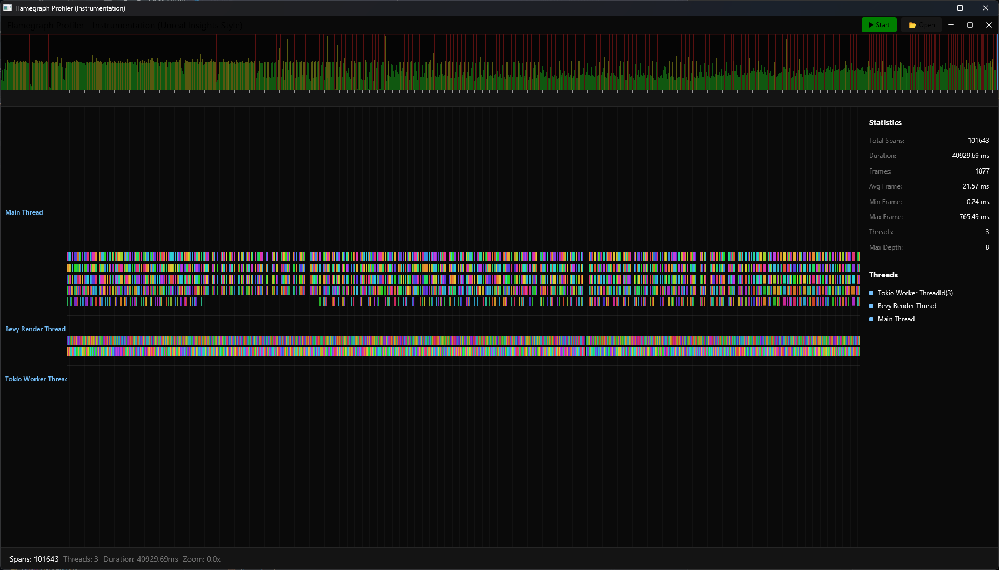
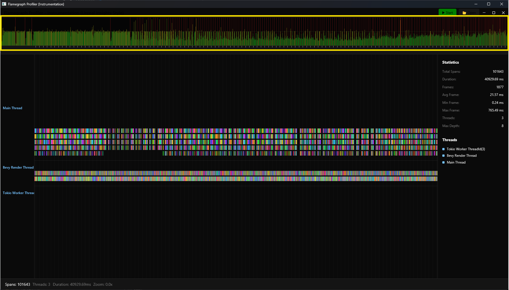
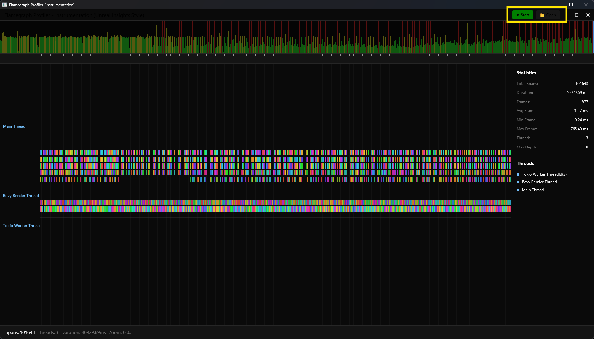
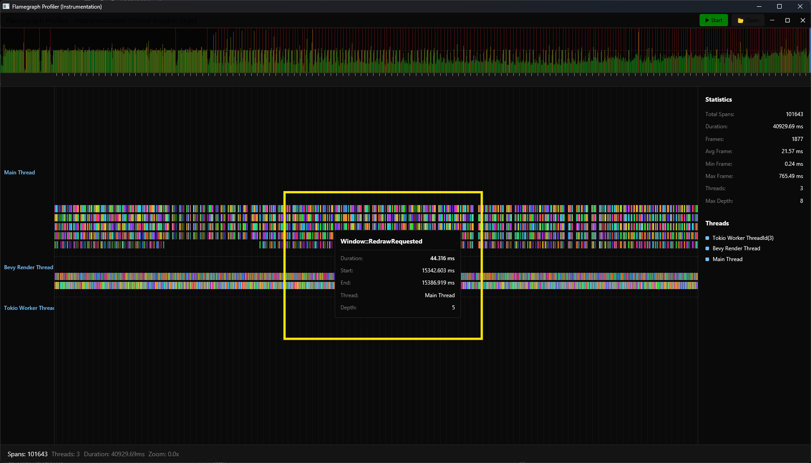

# Profiling & Performance Analysis

Pulsar includes a profiling system inspired by Unreal Insights, providing microsecond-precision instrumentation with minimal runtime overhead. The profiler captures exact timing data from explicit instrumentation points throughout the engine, avoiding the inaccuracy and overhead of traditional sampling profilers.

## The Problem With Traditional Profilers

Most profiling tools work by interrupting your program thousands of times per second to sample the call stack. This approach has fundamental limitations. The profiler cannot see what happens between samples, meaning fast operations may never appear in the results. Interrupting threads adds overhead that skews measurements, and the statistical nature of sampling means results vary between runs. More critically, sampling profilers struggle with highly parallel workloads where threads briefly synchronize—the very patterns that matter most in game engines.

Instrumentation profiling takes a different approach. Rather than interrupting execution, you explicitly mark important functions and scopes with lightweight macros. When a scope begins, the profiler records a timestamp. When it ends, another timestamp captures the duration. This gives you exact, deterministic measurements with overhead measured in nanoseconds rather than microseconds. You see every instrumented event, not just the ones that happened to align with sample points.

## Architecture Overview

The profiling system consists of three main components working together. The instrumentation layer sits at the lowest level, embedded directly in engine code through zero-cost macros. These macros compile down to simple timestamp operations with minimal overhead. When profiling is enabled, events flow through a lock-free channel to avoid contention between threads. The collector service runs in a background thread, periodically draining the event channel and storing results in both memory and a persistent SQLite database. Finally, the flamegraph UI presents this data visually, allowing you to pan, zoom, and inspect individual function calls across all threads.

```mermaid
gantt
    title Engine Thread Activity Timeline
    dateFormat X
    axisFormat %L ms
    
    section Main Thread
    Render Composite                    :0, 16
    GPU GPUI Render                     :2, 10
    RefreshWindows                      :2, 4
    DrawWindows                         :4, 8
    GPU Compositor ComposeFrame         :11, 16
    
    section Bevy Thread
    bevy_render_frame                   :8, 22
    mesh_processing                     :10, 18
    
    section Input Thread
    input_poll                          :0, 2
    input_poll                          :5, 7
    input_poll                          :12, 14
```



The diagram above shows how different threads execute work over time. Each bar represents an instrumented scope, with the horizontal axis showing elapsed milliseconds. The profiler captures all of this automatically as long as the relevant code includes instrumentation macros.


*The flamegraph window showing multiple threads with nested function calls and the frame time graph at the top*

## Instrumentation Macros

The primary tool for profiling is the `profile_scope!` macro. Place it at the beginning of any function or code block you want to measure:

```rust
use profiling::profile_scope;

fn expensive_physics_update() {
    profile_scope!("Physics::Update");
    
    // Your physics code here
    update_rigid_bodies();
    check_collisions();
}
```

When this function executes with profiling enabled, it records the exact start time, end time, thread ID, and call stack depth. The scope automatically ends when the function returns, even if an early return occurs. The macro compiles to nearly nothing when profiling is disabled, typically just a single branch instruction that the CPU predicts perfectly.

For nested operations, simply add more scopes:

```rust
fn update_scene() {
    profile_scope!("Scene::Update");
    
    {
        profile_scope!("Scene::UpdateTransforms");
        update_all_transforms();
    }
    
    {
        profile_scope!("Scene::UpdatePhysics");
        physics_step();
    }
    
    {
        profile_scope!("Scene::UpdateAnimations");
        animate_characters();
    }
}
```

The profiler automatically tracks nesting depth, allowing the flamegraph to show parent-child relationships. Each scope knows its parent, making it easy to understand which high-level operation triggered expensive work deep in the call stack.

## Thread Naming

By default, threads appear in the profiler as "Thread 12345" using their OS thread ID. This makes it difficult to understand what each thread does. Give threads human-readable names using `set_thread_name`:

```rust
use profiling::set_thread_name;

fn spawn_background_worker() {
    std::thread::spawn(|| {
        set_thread_name("Asset Loader");
        
        loop {
            profile_scope!("Asset::ProcessQueue");
            process_asset_load_requests();
        }
    });
}
```

Named threads appear first in the flamegraph, sorted alphabetically, with unnamed threads listed below by ID. This makes it easy to focus on the threads that matter most to your investigation.

## Frame Time Tracking

Beyond individual function timing, the profiler automatically tracks frame times from the main render loop. Every time the compositor completes a frame, it records the time since the last frame:

```rust
// In compositor.rs - happens automatically
profiling::record_frame_time(frame_time_ms);
```

The flamegraph displays this data as a continuous graph at the top of the window, color-coded by performance. Green indicates 60+ FPS (16.67ms or less), yellow shows 30-60 FPS (16.67-33.33ms), and red flags frames slower than 30 FPS (over 33.33ms). Clicking on spikes in the frame time graph lets you jump to that moment in the flamegraph to see exactly what caused the slowdown.


*The frame time graph at the top of the profiling window, with color-coded bars showing performance. Green = 60+ FPS, Yellow = 30-60 FPS, Red = <30 FPS*

## Using the Flamegraph UI

The profiling window provides a real-time view of instrumentation data. When you click "Start Recording", the engine begins collecting events from all instrumented scopes across every thread. The flamegraph updates continuously, showing new data as it arrives. Click "Stop Recording" to freeze the display and analyze the captured session.


*The profiling window toolbar showing the Start/Stop Recording button and Load Recording button for viewing past sessions*

Each horizontal row represents a thread, with the thread name displayed on the left. Within each thread, colored boxes show individual function calls arranged by time. The width of each box corresponds to its duration—wider boxes took longer to execute. Boxes stack vertically to show nesting, with parent functions containing their children.

```
Thread: Main Thread
├─ Render::Composite [═══════════════════] 16.2ms
│  ├─ GPU::GPUI::Render [══════════] 8.5ms
│  │  ├─ RefreshWindows [═══] 2.1ms
│  │  └─ DrawWindows [═════] 4.3ms
│  └─ GPU::Compositor::ComposeFrame [════] 5.1ms
```

The profiler uses time-based zoom rather than content-based scaling. As you zoom in, older events scroll off the left side of the window while recent events remain visible. Pan horizontally by dragging with the middle mouse button or scrolling. This allows you to navigate through long profiling sessions while maintaining accurate time relationships.

To inspect a specific function call, click its box in the flamegraph. A tooltip appears showing the exact function name, duration in milliseconds and microseconds, start time, and thread. This makes it easy to identify outliers—individual calls that took far longer than expected.


*Hovering over a function call in the flamegraph displays detailed timing information including name, duration, thread, and nesting level*

## Persistent Recordings

All profiling data automatically saves to a SQLite database in your project directory at `.pulsar/profiling/flamegraph/`. Each recording session creates a new database file named with the current date and time, such as `profile_2026-01-20_14-32-18.db`. This allows you to review past sessions and compare performance across different builds or configurations.

To load a previous recording, click "Load Recording" in the profiling window and select a database file. The flamegraph will display the historical data exactly as it appeared during the original session. This is invaluable for tracking down intermittent performance issues or verifying that optimizations had the intended effect.

The database schema stores complete information about every instrumented event: function name, thread ID, thread name, start timestamp, duration, nesting depth, and parent scope. This rich data enables future analysis tools, such as statistical aggregation across multiple sessions or automated regression detection.

## Performance Overhead

Instrumentation profiling is extremely lightweight when implemented correctly. Each `profile_scope!` macro adds approximately 20-40 nanoseconds of overhead—the cost of reading a high-precision timestamp twice and writing a small struct to a lock-free queue. For comparison, a single memory allocation typically takes 50-100 nanoseconds, and a syscall can take thousands.

The profiler uses lock-free data structures throughout to avoid contention. Each thread writes to a shared channel using atomic operations, allowing parallel event submission without blocking. The background collector thread drains this channel periodically (every 16ms by default) and performs the more expensive database writes asynchronously, keeping the instrumented code fast.

When profiling is disabled (the default in release builds), the macros compile down to a single branch instruction checking a global atomic boolean. Modern CPUs predict this branch perfectly after the first check, resulting in zero measurable overhead. You can safely leave instrumentation in hot paths without impacting shipping performance.

## Instrumentation Placement Strategy

Effective profiling requires thoughtful placement of instrumentation points. The goal is to capture meaningful operations without drowning in noise. Start by instrumenting at the subsystem level—major engine systems like rendering, physics, audio, and input processing. Each subsystem should have a top-level scope that captures its entire frame contribution:

```rust
pub fn render_frame() {
    profile_scope!("Render::Frame");
    // All rendering work
}

pub fn physics_step() {
    profile_scope!("Physics::Step");
    // All physics work
}
```

Within each subsystem, add scopes for operations that might become bottlenecks. Mesh processing, shader compilation, collision detection, and asset loading are common candidates. The key is to instrument at a granularity where optimization is possible—individual operations that could be parallelized, cached, or eliminated.

Avoid instrumenting trivial functions that execute in microseconds or less. While the profiler can handle millions of events, the resulting flamegraph becomes cluttered and difficult to navigate. Focus on operations that take at least 100 microseconds. If you need finer-grained profiling, use CPU performance counters or hardware profilers for specific investigations.

Pulsar's core engine already includes instrumentation in critical paths:

- Main rendering compositor (`Render::Composite`)
- GPUI UI rendering (`GPU::GPUI::Render`, `GPU::GPUI::DrawWindows`)
- Bevy 3D rendering (`bevy_render_frame`)
- Scene loading and saving
- Input processing on the input thread

This provides immediate visibility into engine performance without any additional work. As you develop game code, add your own instrumentation to gameplay systems, AI logic, and custom rendering passes.

## Interpreting Flamegraphs

Reading a flamegraph effectively requires understanding common patterns. Wide blocks indicate where time is spent—these are your optimization targets. Look for repeated patterns, which suggest opportunities for batching or caching. If many small boxes appear in rapid succession, consider whether those operations could be combined or eliminated entirely.

Gaps between blocks on the same thread typically represent blocking operations—waiting for I/O, sleeping, or synchronization with other threads. These gaps are often more important than the work itself, as they indicate idle time where the CPU could be doing useful work. If you see gaps on critical threads, investigate what they're waiting for.


*Flamegraph showing gaps between operations on the main thread while a background thread is busy—indicating potential synchronization issues*

Thread parallelization appears as overlapping work on different threads. Ideally, all threads should show solid blocks of work with minimal gaps. If one thread is busy while others sit idle, you have an opportunity to distribute work more evenly. The profiler makes these imbalances obvious at a glance.

Compare frame time spikes in the top graph with the corresponding flamegraph section. When you see a red or yellow spike, pan to that time range and look for unusually wide blocks or unexpected nesting. Often, a single expensive operation will dominate the frame, making it easy to identify the culprit.

## Integration With Development Workflow

Profiling works best as a continuous practice rather than a late-stage optimization tool. Keep the flamegraph window open during development and glance at it occasionally. You'll quickly develop intuition for what "normal" looks like for your project, making anomalies immediately obvious.

When adding new features, instrument them from the start. This costs almost nothing in development time—typically just a single line at the beginning of each major function. The payoff comes later when investigating performance issues, as you'll have historical data showing exactly when and why performance changed.

Use profiling recordings as benchmarks when optimizing. Record a session before making changes, implement your optimization, then record another session under identical conditions. Load both recordings and compare them side-by-side (in separate instances of the profiling window) to verify improvements and catch regressions.

## Future Enhancements

The profiling system will continue to evolve. Planned improvements include statistical aggregation showing average, minimum, and maximum durations for each instrumented function across an entire session. This makes it easier to identify inconsistent performance—functions that usually run fast but occasionally spike.

GPU profiling integration will extend instrumentation to graphics work, showing render passes, draw calls, and compute shader execution on the same timeline as CPU operations. This unified view makes it much easier to understand CPU-GPU synchronization issues and identify graphics bottlenecks.

Memory profiling support will track allocations and deallocations, showing memory usage over time alongside function execution. This helps identify memory leaks and excessive allocation patterns that cause cache misses and garbage collection pressure.

## Adding Profiling to Your Code

When contributing to Pulsar or writing game code, you should instrument any code that performs significant work. This section provides detailed guidance on how to properly add profiling instrumentation to ensure the flamegraph provides useful data.

### Basic Function Instrumentation

The simplest case is instrumenting a complete function. Place the `profile_scope!` macro at the very beginning of the function, before any other code executes. The macro creates an RAII guard that captures the start timestamp immediately and records the end timestamp when the function returns:

```rust
use profiling::profile_scope;

fn load_texture_from_disk(path: &Path) -> Result<Texture, Error> {
    profile_scope!("Assets::LoadTexture");
    
    // Read file from disk
    let bytes = std::fs::read(path)?;
    
    // Decode image data
    let image = image::load_from_memory(&bytes)?;
    
    // Upload to GPU
    let texture = gpu.create_texture(&image);
    
    Ok(texture)
}
```

The scope name should follow a hierarchical naming convention using `::` to separate categories. This makes it easier to filter and understand the flamegraph. Common prefixes include `Render::`, `Physics::`, `Audio::`, `Assets::`, `Scene::`, and `Input::`. Choose names that clearly describe what the function does at a glance.

> [!IMPORTANT]
> The scope guard must live for the entire duration of the function. Never move it into a smaller scope or conditionally create it, as this will produce incorrect timing measurements.

### Instrumenting Code Blocks

Sometimes you want to measure a specific section of a function rather than the entire thing. Create an anonymous scope using curly braces to limit the profiling guard's lifetime:

```rust
fn complex_scene_update() {
    profile_scope!("Scene::Update");
    
    // Update transforms
    {
        profile_scope!("Scene::UpdateTransforms");
        for entity in &mut entities {
            entity.update_transform();
        }
    }
    
    // Update physics
    {
        profile_scope!("Scene::UpdatePhysics");
        physics_world.step(delta_time);
    }
    
    // Update animations
    {
        profile_scope!("Scene::UpdateAnimations");
        for animator in &mut animators {
            animator.tick(delta_time);
        }
    }
}
```

This technique creates nested scopes in the flamegraph, showing how the parent function's time is distributed across its major operations. The nesting depth is tracked automatically, so child scopes appear indented under their parents.

### Naming Conventions

Consistent naming across the codebase makes profiling data far more useful. Follow these guidelines when choosing scope names:

**Use double colons for hierarchy** - `System::Subsystem::Operation` creates a clear mental model. For example, `Render::Bevy::DrawMeshes` immediately tells you this is rendering-related, specifically Bevy rendering, and it's drawing meshes.

**Be specific but concise** - `LoadAsset` is too vague. `Assets::LoadTexture` is better. `Assets::LoadTextureFromDiskAndDecodeAndUploadToGPU` is too verbose. The flamegraph shows nesting, so you can add child scopes for detailed steps.

**Match your module structure** - If the code lives in `crates/engine/src/physics/collision.rs`, consider using `Physics::Collision::` as the prefix. This makes it easy to find the relevant code when investigating performance issues.

**Use PascalCase or SCREAMING_CASE for emphasis** - Most scope names use `PascalCase` like `Render::DrawFrame`. Use `SCREAMING_CASE` for critical operations or performance markers like `FRAME_START` or `GPU_SYNC_POINT`.

### Instrumenting Loops

Loops present a special challenge. Instrumenting the entire loop shows how long all iterations took, but doesn't reveal individual iteration performance. Instrumenting inside the loop creates thousands of tiny spans that clutter the flamegraph. The right approach depends on what you're investigating:

```rust
// Option 1: Instrument the entire loop (default)
fn update_all_entities(entities: &mut [Entity]) {
    profile_scope!("Gameplay::UpdateEntities");
    for entity in entities {
        entity.update();
    }
}

// Option 2: Instrument loop internals when investigating slow iterations
fn update_all_entities(entities: &mut [Entity]) {
    profile_scope!("Gameplay::UpdateEntities");
    for (idx, entity) in entities.iter_mut().enumerate() {
        // Only instrument if this is a known problematic entity type
        if entity.needs_detailed_profiling() {
            profile_scope!("Gameplay::UpdateSingleEntity");
            entity.update();
        } else {
            entity.update();
        }
    }
}

// Option 3: Batch instrumentation - measure every N iterations
fn process_particles(particles: &mut [Particle]) {
    profile_scope!("Effects::ProcessParticles");
    
    for (idx, particle) in particles.iter_mut().enumerate() {
        if idx % 1000 == 0 {
            profile_scope!("Effects::ProcessParticleBatch");
        }
        particle.update();
    }
}
```

> [!WARNING]
> Instrumenting inside tight loops with millions of iterations can generate so much profiling data that the overhead becomes significant and the flamegraph becomes unusable. Only instrument loop internals when investigating a specific performance issue, and remove the instrumentation once resolved.

### Async and Thread Boundaries

Rust's async runtime and thread spawning require special consideration. When you spawn a new thread or async task, the profiling context does not automatically transfer. You must explicitly name the thread and instrument the task:

```rust
use profiling::{profile_scope, set_thread_name};

// Spawning a named thread
fn spawn_asset_loader() {
    std::thread::spawn(|| {
        // Set thread name FIRST, before any profiling
        set_thread_name("Asset Loader");
        
        loop {
            profile_scope!("Assets::ProcessLoadQueue");
            // Load assets...
        }
    });
}

// Spawning async tasks on a Tokio runtime
async fn spawn_async_work(runtime: &tokio::runtime::Runtime) {
    runtime.spawn(async {
        // Async tasks inherit thread names from their executor
        profile_scope!("Network::HandleConnection");
        // Handle network connection...
    });
}
```

Thread names persist for the lifetime of the thread. Call `set_thread_name` once at the beginning of the thread's entry point, not repeatedly during execution.

> [!NOTE]
> Named threads appear at the top of the flamegraph, sorted alphabetically. Unnamed threads appear at the bottom, sorted by thread ID. Always name important threads to make them easy to find.

### Conditional Compilation

In some cases, you may want profiling instrumentation in debug builds but not release builds. While the profiler already has minimal overhead, extremely hot code paths (called millions of times per frame) can benefit from conditional compilation:

```rust
#[cfg(feature = "profiling")]
use profiling::profile_scope;

fn extremely_hot_function() {
    #[cfg(feature = "profiling")]
    profile_scope!("Math::MatrixMultiply");
    
    // Hot path code here
}
```

However, this is rarely necessary. The profiler's global enable/disable flag compiles to a single predicted branch instruction with near-zero cost. Only use conditional compilation for the absolute hottest code paths after profiling shows the instrumentation itself is a bottleneck.

### Integration with Engine Systems

When writing new engine systems or major features, instrument the public API surface from the start. This costs nothing during development and provides immediate visibility when performance issues arise later. Consider this example of a new particle system:

```rust
pub struct ParticleSystem {
    emitters: Vec<ParticleEmitter>,
    particles: Vec<Particle>,
}

impl ParticleSystem {
    pub fn update(&mut self, delta_time: f32) {
        profile_scope!("Particles::Update");
        
        {
            profile_scope!("Particles::UpdateEmitters");
            for emitter in &mut self.emitters {
                emitter.spawn_particles(delta_time);
            }
        }
        
        {
            profile_scope!("Particles::UpdateParticles");
            for particle in &mut self.particles {
                particle.update(delta_time);
            }
        }
        
        {
            profile_scope!("Particles::Cull");
            self.particles.retain(|p| p.is_alive());
        }
    }
    
    pub fn render(&self, renderer: &mut Renderer) {
        profile_scope!("Particles::Render");
        
        {
            profile_scope!("Particles::SortByDepth");
            let mut sorted: Vec<_> = self.particles.iter().collect();
            sorted.sort_by_key(|p| p.depth());
        }
        
        {
            profile_scope!("Particles::Submit");
            for particle in &self.particles {
                renderer.draw_particle(particle);
            }
        }
    }
}
```

This instrumentation strategy provides multiple levels of detail. The top-level `Particles::Update` and `Particles::Render` scopes show total particle system cost. The nested scopes break down where that time goes, making it obvious if spawning is slow versus simulation versus culling.

### Error Handling and Early Returns

The RAII scope guard ensures profiling captures accurate timing even when functions return early or panic. However, you should be aware of what gets measured:

```rust
fn load_asset(path: &Path) -> Result<Asset, Error> {
    profile_scope!("Assets::Load");
    
    // If this fails, the scope still records the time spent failing
    let metadata = load_metadata(path)?;
    
    // Early return on validation failure - still recorded
    if !metadata.is_valid() {
        return Err(Error::InvalidMetadata);
    }
    
    // All code paths through this function are profiled
    let data = load_asset_data(path)?;
    Ok(Asset::new(data))
}
```

This is usually what you want—failed operations often reveal performance problems like repeatedly trying to load missing files. If you specifically want to measure only successful operations, use explicit scopes:

```rust
fn load_asset(path: &Path) -> Result<Asset, Error> {
    // No scope here - validation failures not profiled
    let metadata = load_metadata(path)?;
    if !metadata.is_valid() {
        return Err(Error::InvalidMetadata);
    }
    
    // Only profile successful loads
    profile_scope!("Assets::Load");
    let data = load_asset_data(path)?;
    Ok(Asset::new(data))
}
```

### GPU Work and Synchronization Points

CPU profiling naturally measures CPU work, but many performance issues involve CPU-GPU synchronization. Explicitly instrument synchronization points to make these visible:

```rust
fn render_frame(renderer: &mut Renderer) {
    profile_scope!("Render::Frame");
    
    {
        profile_scope!("Render::BuildCommandBuffer");
        renderer.begin_frame();
        renderer.draw_scene();
        renderer.draw_ui();
    }
    
    {
        profile_scope!("Render::SubmitToGPU");
        renderer.submit_commands();
    }
    
    {
        profile_scope!("GPU::SYNC::WaitForPreviousFrame");
        // This blocks until the GPU finishes the previous frame
        renderer.wait_for_fence();
    }
    
    {
        profile_scope!("GPU::SYNC::Present");
        // Present also may block if we're GPU-bound
        renderer.present();
    }
}
```

The `GPU::SYNC::` prefix clearly marks these as synchronization points. If you see these scopes taking significant time, the GPU is the bottleneck, not the CPU.

> [!TIP]
> Future versions of the profiler will integrate GPU timing queries to show actual GPU work alongside CPU timing. For now, use sync point instrumentation to identify CPU-GPU imbalances.

### Testing Your Instrumentation

After adding profiling to your code, verify it appears correctly in the flamegraph. Open the profiling window, click "Start Recording", and exercise the code path you instrumented. You should see your scopes appear with sensible durations and nesting. If scopes don't appear, check that profiling is enabled globally (`profiling::is_profiling_enabled()` should return true). If nesting looks wrong, verify you're not accidentally creating multiple scope guards or dropping them too early.

Common mistakes include placing the scope guard inside a conditional block (so it's not always created), shadowing the scope variable (creating multiple guards), or creating the scope in a temporary expression that immediately drops:

```rust
// WRONG - scope drops immediately, measures nothing
fn bad_example() {
    profile_scope!("Test");  // Dropped at end of this expression!
    
    do_work();
}

// RIGHT - scope lives for entire function
fn good_example() {
    profile_scope!("Test");
    
    do_work();
}

// WRONG - scope only measures the if block
fn bad_conditional() {
    if should_profile {
        profile_scope!("Test");
    }
    do_work();  // Not profiled!
}

// RIGHT - scope measures all work, but only when enabled globally
fn good_conditional() {
    profile_scope!("Test");  // Enabled/disabled via global flag
    
    do_work();  // Always profiled when profiling is active
}
```

The profiler prints debug messages when collecting events, showing how many spans were captured. If you don't see your spans in the flamegraph, check the console output for collection statistics.

## Summary

Instrumentation profiling provides deterministic, low-overhead performance measurement throughout the engine. By placing simple macros at strategic points, you gain complete visibility into where time is spent across all threads. The flamegraph UI makes it easy to navigate this data, identify bottlenecks, and verify optimizations. Unlike sampling profilers, instrumentation gives you exact measurements of every instrumented event, making it possible to track down even brief performance issues that traditional profilers would miss entirely.

When contributing code to Pulsar, remember to instrument public APIs and any operations that might take more than 100 microseconds. Use consistent naming conventions, properly handle thread boundaries, and test your instrumentation to ensure it provides useful data. The profiling system is only as good as the instrumentation you provide—thoughtful placement makes the difference between a useful performance tool and a wall of meaningless data.
