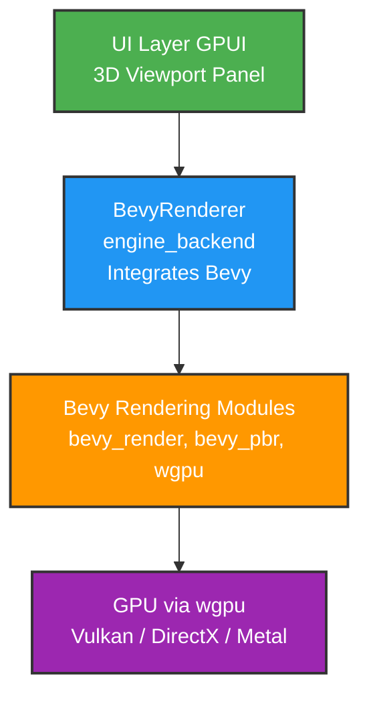
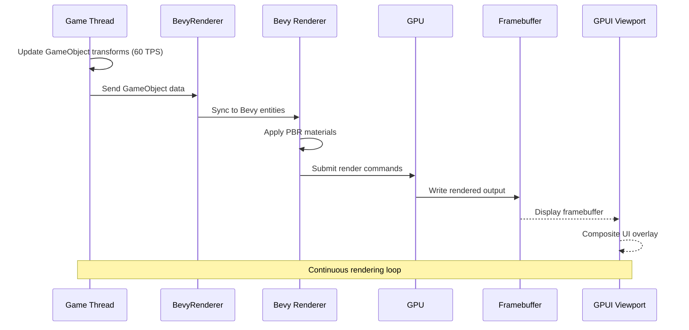
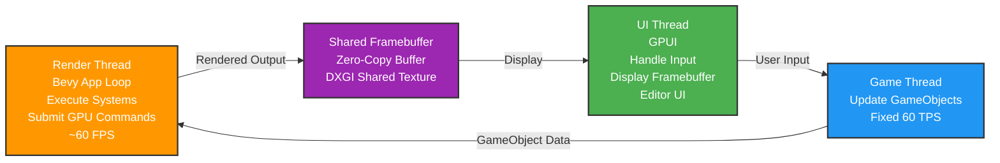

# Rendering System

Pulsar's 3D viewport uses **Bevy's rendering modules** to display game scenes in real-time. This document explains how the rendering system works and how it integrates with the editor.

## Overview

Pulsar doesn't implement its own custom rendering pipeline. Instead, it uses Bevy's proven rendering modules:

- `bevy_render` - Core rendering infrastructure
- `bevy_pbr` - Physically Based Rendering (PBR) materials
- `bevy_core_pipeline` - Rendering pipeline stages
- `bevy_asset` - Asset loading and management

This leverages Bevy's mature, well-tested rendering code while keeping Pulsar focused on the editor experience.

## Why Bevy's Renderer?

**Proven technology** - Bevy's renderer powers many shipped games and has been battle-tested.

**PBR materials** - Modern physically-based rendering with metallic/roughness workflows out of the box.

**Cross-platform** - Works on Windows, Linux (when supported), and macOS (when supported) via wgpu.

**Active development** - Benefits from Bevy community improvements and optimizations.

**No wheel reinvention** - Lets Pulsar developers focus on editor features rather than low-level graphics code.

## Architecture

The rendering system in Pulsar consists of:



### BevyRenderer

The `BevyRenderer` struct in `engine_backend` wraps Bevy's rendering components:

```rust
pub struct BevyRenderer {
    // Bevy App running the renderer
    app: App,

    // Render thread handle
    render_thread: Option<std::thread::JoinHandle<()>>,

    // Framebuffer for displaying in editor
    framebuffer: Arc<Mutex<Framebuffer>>,
}
```

The renderer runs on its own thread, rendering scenes and writing output to a framebuffer that the GPUI viewport displays.

## Rendering GameObjects

Pulsar's simple GameObject system integrates with Bevy's renderer:

```rust
pub struct GameObject {
    pub id: u64,
    pub position: [f32; 3],
    pub velocity: [f32; 3],
    pub rotation: [f32; 3],
    pub scale: [f32; 3],
    pub active: bool,
}
```

GameObjects are converted to Bevy entities for rendering:



**Rendering flow:**

1. GameThread updates GameObject transforms (60 TPS)
2. BevyRenderer syncs GameObject data to Bevy entities
3. Bevy renders the entities with PBR materials
4. Output is written to a shared framebuffer
5. GPUI viewport displays the framebuffer

## Materials

Pulsar uses Bevy's PBR material system:

```rust
// Bevy's PBR material
pub struct StandardMaterial {
    pub base_color: Color,
    pub base_color_texture: Option<Handle<Image>>,
    pub emissive: Color,
    pub emissive_texture: Option<Handle<Image>>,
    pub perceptual_roughness: f32,
    pub metallic: f32,
    pub metallic_roughness_texture: Option<Handle<Image>>,
    pub normal_map_texture: Option<Handle<Image>>,
    pub occlusion_texture: Option<Handle<Image>>,
    // ... more properties
}
```

Materials support:

- **Albedo/Base Color** - Surface color with optional texture
- **Metallic/Roughness** - PBR workflow parameters
- **Normal Maps** - Surface detail without additional geometry
- **Emissive** - Self-illuminating surfaces
- **Ambient Occlusion** - Contact shadow approximation

## Lighting

Bevy provides multiple light types:

**Directional Lights** - Sun-like lights with parallel rays

**Point Lights** - Omni-directional lights with falloff

**Spot Lights** - Cone-shaped lights

All use physically-based attenuation and support shadow mapping.

## Camera System

The viewport uses Bevy's camera:

```rust
pub struct Camera3d {
    // Projection (perspective or orthographic)
    pub projection: Projection,

    // Clear color
    pub clear_color: ClearColorConfig,
}
```

Camera controls in the viewport allow:

- **Orbit** - Rotate around a focal point
- **Pan** - Translate the view horizontally/vertically
- **Zoom** - Move closer/farther from the scene
- **First-person** - WASD fly-through (when enabled)

## Render Thread

The render thread runs independently from the UI thread:



**Render Thread:**
- Runs Bevy's App update loop
- Executes rendering systems
- Submits GPU commands
- Writes output to framebuffer
- Runs at target FPS (60 by default)

**UI Thread (GPUI):**
- Displays the framebuffer
- Handles user input
- Updates GameObjects via GameThread
- Manages editor UI

This separation ensures the editor UI stays responsive even if rendering is slow or stalled.

## Zero-Copy Rendering

Pulsar uses zero-copy techniques to minimize overhead:

**Shared Texture** (Windows) - Uses DXGI shared textures so GPUI and Bevy can access the same GPU memory without copying.

**Memory-Mapped Buffer** (Other platforms) - Uses persistent mapped buffers for efficient CPU↔GPU transfer.

This eliminates framebuffer copies and reduces latency between render and display.

## Performance

The rendering system is optimized for editor workflows:

**Default Scene** - The GameThread creates a default scene with multiple objects so you see something immediately when opening a project.

**Fixed Tick Rate** - GameThread runs at 60 TPS regardless of render FPS.

**Metrics** - The renderer exposes performance metrics:
- Frame time (ms)
- FPS
- GPU time (via profiler)
- Draw call count

These appear in the viewport overlay or problems panel.

## Integration with GPUI

The 3D viewport is a GPUI view that displays the Bevy framebuffer:

```rust
impl Render for LevelEditorView {
    fn render(&mut self, _cx: &mut ViewContext<Self>) -> impl IntoElement {
        div()
            .size_full()
            .child(
                // Display the Bevy-rendered framebuffer
                image()
                    .source(self.framebuffer)
                    .size_full()
            )
    }
}
```

GPUI handles the UI overlay (gizmos, buttons, statusbar) while Bevy handles 3D scene rendering.

## Limitations

**Editor-only rendering** - The current integration is optimized for the editor viewport, not standalone game builds.

**No custom shaders yet** - Uses Bevy's standard PBR pipeline. Custom shaders are planned.

**Platform limitations** - Full support is currently Windows-focused due to zero-copy implementation. Cross-platform support being restored.

## Future Plans

**Custom shader support** - Allow users to write custom shaders for materials.

**Post-processing** - Bloom, tone-mapping, color grading, etc.

**Advanced lighting** - Light probes, reflection probes, volumetric lighting.

**LOD system** - Level-of-detail for performance optimization.

**Scene editor** - Visual manipulation of GameObjects in the viewport.

## Wrapping Up

Pulsar leverages Bevy's rendering system rather than implementing custom graphics code. This provides:

- Proven, battle-tested rendering
- Modern PBR materials
- Cross-platform support (via wgpu)
- Active development and improvements

The integration keeps the renderer separate from the editor UI, ensuring stability and responsiveness.

For more details:
- [Architecture](./architecture) - Overall system design
- [UI Framework](./ui-framework) - How GPUI works
- [First Project](../getting-started/first-project) - See rendering in action
