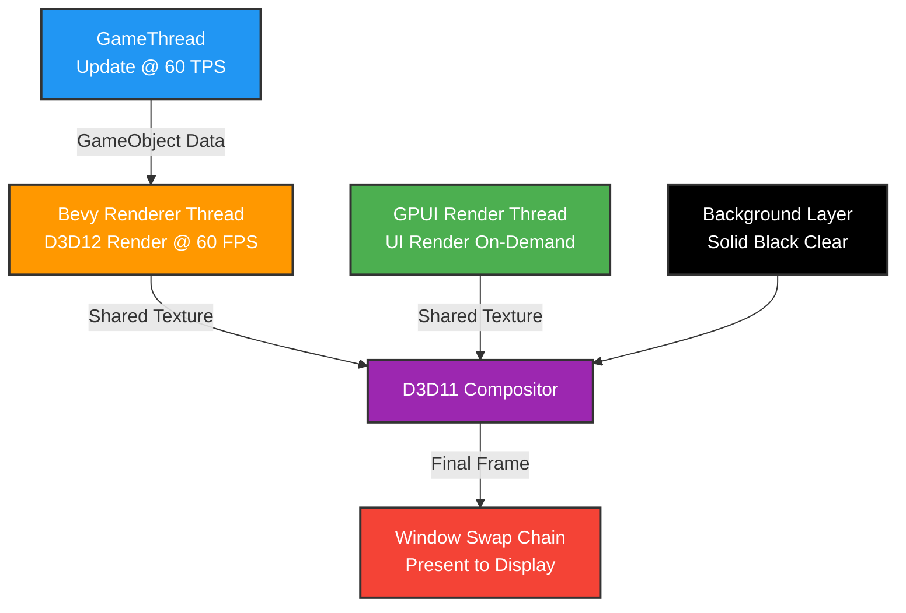
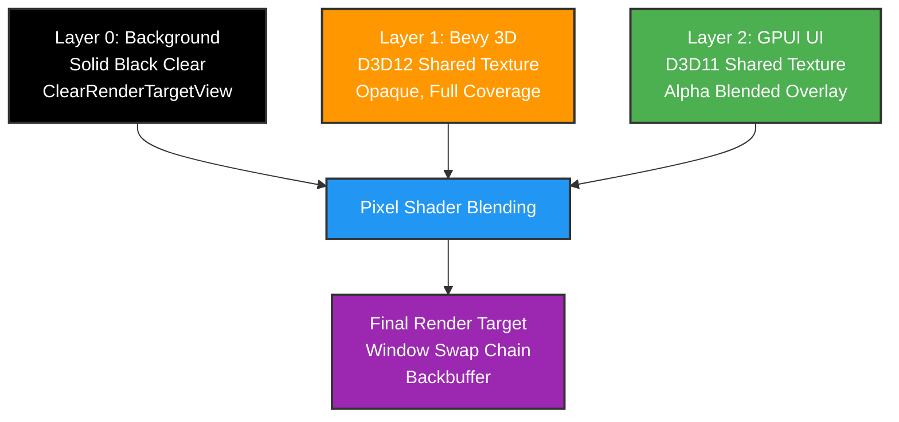
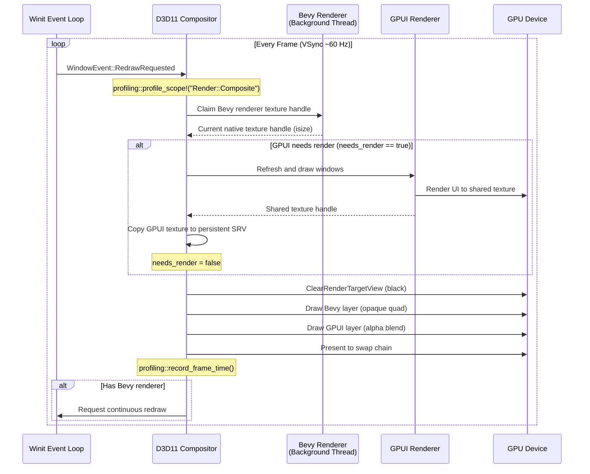

Pulsar renders complex scenes by compositing multiple GPU layers—Bevy's 3D rendering, GPUI's editor UI, and background fills—into a final frame using Direct3D 11. The entire pipeline operates with zero CPU copies, sharing textures directly in GPU memory across different rendering APIs. Bevy renders continuously at 60 FPS on a background thread while GPUI renders the UI on-demand, combined by the compositor into the window you see.

## The Problem With Traditional Game Engine Rendering

Most game engines tightly couple the game's 3D rendering with the editor UI, forcing both to redraw together even when the UI is static. This wastes GPU cycles re-rendering menus and panels that haven't changed, and creates instability—a crash in game rendering code can bring down the entire editor. The naive solution of rendering to separate textures and copying them to a final framebuffer works but introduces latency and memory bandwidth overhead, especially at 4K resolution where each frame transfer moves 32+ megabytes.

Pulsar decouples rendering through **independent render layers** with **zero-copy GPU composition**. Bevy renders the 3D viewport continuously on its own thread, writing to a shared GPU texture. GPUI renders the editor UI only when something changes, writing to a separate shared texture. The compositor reads both textures directly from GPU memory and combines them into the final window—no CPU ever touches the pixel data. This achieves smooth 60 FPS 3D rendering with a static UI that costs almost nothing, while keeping the editor responsive even if game code hangs or crashes.

## Architecture Overview

The rendering system consists of four independent layers communicating through GPU memory:



Each component operates independently with clear responsibilities. The **GameThread** updates GameObject transforms at a fixed 60 ticks per second, providing deterministic simulation regardless of render framerate. The **Bevy Renderer** consumes GameObject state and renders the 3D scene continuously, producing a new frame every ~16ms. The **GPUI Renderer** draws editor UI only when input events or state changes require it, avoiding redundant work. The **D3D11 Compositor** combines all layers every frame using GPU shaders, presenting the final result to the display.

This architecture provides natural isolation. If Bevy crashes while rendering a corrupted mesh, the compositor detects the missing texture and displays the last good frame with a diagnostic overlay. The editor UI remains fully functional, allowing you to save work or inspect the crash. Similarly, blocking I/O in game code doesn't freeze the 60 FPS 3D viewport—you see the simulation pause while the UI stays responsive.

## Zero-Copy GPU Texture Sharing

The compositor achieves zero-copy rendering through platform-specific GPU memory sharing mechanisms. On Windows, Bevy renders to a Direct3D 12 texture and exports an **NT handle**—a Windows kernel object representing the GPU memory allocation. The compositor opens this same handle as a Direct3D 11 texture, gaining read access to the exact same physical GPU memory. No bytes move between RAM and VRAM. No GPU-to-GPU copies occur. Both APIs reference the same texture sitting in video memory.

```rust
// Bevy (D3D12) exports its rendered frame as a shared texture handle
let bevy_handle: NativeTextureHandle = bevy_renderer.get_current_native_handle();

// Compositor (D3D11) opens the shared handle to access the same GPU memory
unsafe {
    let mut bevy_texture: Option<ID3D11Texture2D> = None;
    device.OpenSharedResource(
        HANDLE(bevy_handle as *mut _),
        &mut bevy_texture
    )?;

    // Create shader resource view for reading in pixel shader
    let srv = device.CreateShaderResourceView(&bevy_texture, None)?;
}
```

The same pattern applies to GPUI's UI rendering. GPUI exposes its framebuffer texture as a DXGI shared resource, the compositor opens it, and both reference the same GPU allocation. The compositor's pixel shader samples from both textures in a single draw call, blending them together entirely on the GPU. The CPU's only role is issuing the draw command—it never sees pixel data.

> [!NOTE]
> Zero-copy sharing requires compatible texture formats. Pulsar uses **BGRA8UnormSrgb** across all renderers, matching Bevy's render pipeline requirements and providing sRGB color space consistency.

### Cross-Platform Texture Sharing

While the current implementation targets Windows with Direct3D, the architecture supports cross-platform GPU sharing:

**Windows (Current)** - DXGI shared resource NT handles between D3D12 (Bevy) and D3D11 (Compositor)

**macOS (Planned)** - IOSurface shared memory between Metal (Bevy) and Metal (Compositor)

**Linux (Planned)** - DMA-BUF file descriptors between Vulkan (Bevy) and Vulkan (Compositor)

All three mechanisms provide the same semantic: one API writes to GPU memory, another API reads from the same memory, no copies occur. The `BevyViewport` component abstracts these platform differences, using `GpuTextureHandle` to wrap platform-specific handles in a common interface.

## The Three-Layer Compositor

The compositor renders three distinct layers using Direct3D 11, combined from bottom to top using alpha blending:



### Layer 0: Black Background

The compositor clears the backbuffer to solid black using `ClearRenderTargetView`. This provides a predictable base color visible through any transparent regions in upper layers. When the 3D viewport doesn't cover the entire window (due to aspect ratio differences or letterboxing), black bars appear naturally without special handling.

### Layer 1: Bevy 3D Rendering

The Bevy renderer runs on a background thread, continuously producing new frames at approximately 60 FPS. Each frame renders the game scene with PBR materials, lighting, and shadows to a BGRA8UnormSrgb texture. This texture is exported as a DXGI shared resource that the compositor accesses as a Direct3D 11 shader resource view.

The compositor draws a fullscreen quad textured with Bevy's output. If the texture dimensions don't match the window size, the compositor applies bilinear filtering and letterboxing automatically. This layer writes with alpha = 1.0 (fully opaque), completely replacing the black background in covered areas.

```rust
// Compositor draws Bevy layer with opaque alpha
context.PSSetShaderResources(0, Some(&[bevy_srv.clone()]));
context.Draw(4, 0);  // Fullscreen quad
```

Bevy renders independently of compositor timing. If Bevy produces frames faster than the display refresh rate, the compositor simply reads the most recent frame. If Bevy falls behind (due to complex scene geometry or expensive shaders), the compositor continues compositing the last available frame, resulting in visible stuttering but not a frozen editor.

### Layer 2: GPUI UI Overlay

The GPUI renderer draws the editor UI—menus, panels, buttons, text—to its own texture. Unlike Bevy's continuous rendering, GPUI renders **lazily**, only producing a new frame when input events or state changes require UI updates. A static UI costs almost nothing—the last rendered texture is simply composited repeatedly without re-rendering.

```rust
let should_render_gpui = window_state.needs_render;

if should_render_gpui {
    profiling::profile_scope!("GPU::GPUI::Render");

    window_state.gpui_app.update(|app| {
        app.refresh_windows();
        app.draw_windows();
    });

    window_state.needs_render = false;
}
// Bevy texture is always composited (continuous 3D viewport)
// GPUI texture only updates when UI changes
```

The compositor draws the GPUI texture over the Bevy layer using alpha blending. The pixel shader multiplies source alpha with destination pixels, allowing UI elements to appear transparent or semi-transparent over 3D content. Text, icons, and solid panels render with alpha = 1.0 (opaque), while glassmorphic panels or tooltips use fractional alpha for translucency effects.

> [!TIP]
> This decoupled approach means a static UI doesn't waste GPU cycles re-rendering unchanged pixels, while the 3D viewport maintains smooth 60 FPS animation.

## Rendering Pipeline Execution Flow

Every frame, the compositor executes a precise sequence:



The sequence begins when Winit delivers a `RedrawRequested` event, typically triggered by VSync at the display's refresh rate (60 Hz, 144 Hz, etc.). The compositor immediately profiles this frame with `profiling::profile_scope!("Render::Composite")`, allowing the flamegraph to show per-frame compositor cost.

**Claiming Bevy Renderer Texture** - The compositor calls `claim_bevy_renderer()` to retrieve the current native texture handle from Bevy's background thread. This handle represents the most recently completed Bevy frame. If Bevy is still rendering the next frame, the compositor reuses the previous handle—no blocking occurs.

**Conditional GPUI Rendering** - The compositor checks `window_state.needs_render`, a flag set by input events or state changes. If true, GPUI re-renders the UI, writing to its shared texture. The compositor then opens this texture as a shader resource view. If false, the compositor reuses the previous GPUI texture, skipping the expensive re-render entirely.

**GPU Composition** - With both textures available as shader resources, the compositor issues three GPU commands: clear the backbuffer to black, draw a fullscreen quad sampling the Bevy texture, draw another fullscreen quad sampling the GPUI texture with alpha blending enabled. All three operations execute entirely on the GPU in a single render pass.

**Present and Metrics** - The compositor presents the final backbuffer to the swap chain, making it visible. It records the frame time using `profiling::record_frame_time()`, feeding the flamegraph's frame time graph. If a Bevy renderer exists, it requests another redraw from Winit, creating a continuous rendering loop.

> [!IMPORTANT]
> The compositor runs on the main thread synchronized with Winit events. Bevy and GPUI renderers run on separate threads, writing to shared textures asynchronously. The compositor never blocks waiting for them—it composites whatever textures are currently available.

## BevyViewport Component

The `BevyViewport` GPUI component wraps zero-copy GPU texture sharing in a declarative UI element. You use it like any other GPUI view:

```rust
use ui::BevyViewport;

// Create viewport in a GPUI view
let viewport = cx.new(|cx| BevyViewport::new(1600, 900, cx));

// Get shared state for background thread communication
let viewport_state = viewport.read(cx).shared_state();

// Initialize with Bevy renderer's shared texture handles
viewport_state.write().initialize_shared_textures(
    handle0,  // NT handle for buffer 0
    handle1,  // NT handle for buffer 1
    1600,
    900
);

// Signal buffer swap when Bevy finishes a frame
viewport_state.read().swap_buffers();
```

Internally, `BevyViewport` uses GPUI's `gpu_canvas` element, which renders GPU textures directly without converting to CPU-side pixel buffers. The viewport maintains a `GpuCanvasSource` containing two texture handles—Bevy double-buffers its rendering, alternating between two textures to avoid race conditions. When Bevy finishes rendering to texture 0, it signals the viewport to swap, making texture 1 active for reading while Bevy begins rendering the next frame to texture 0.

```rust
pub struct BevyViewportState {
    canvas_source: Option<GpuCanvasSource>,
    width: u32,
    height: u32,
}

impl BevyViewportState {
    pub fn initialize_shared_textures(
        &mut self,
        handle0: isize,
        handle1: isize,
        width: u32,
        height: u32
    ) {
        let buffer0 = GpuTextureHandle::new(handle0, width, height);
        let buffer1 = GpuTextureHandle::new(handle1, width, height);

        self.canvas_source = Some(GpuCanvasSource::new(buffer0, buffer1));
        self.width = width;
        self.height = height;
    }

    pub fn swap_buffers(&self) {
        if let Some(ref source) = self.canvas_source {
            source.swap_buffers();
        }
    }
}
```

This double-buffering prevents tearing artifacts. Without it, the GPUI thread might read from a texture while Bevy is still writing to it, causing horizontal tearing where half the frame shows the old render and half shows the new. With double-buffering, reads and writes never touch the same texture simultaneously.

### Viewport Lifecycle

When you create a `BevyViewport`, the initial state contains no textures—`canvas_source` is `None`. The viewport displays a blank region until the Bevy renderer initializes and calls `initialize_shared_textures()`. This lazy initialization allows the viewport to appear immediately in the UI while Bevy spins up on a background thread, avoiding blocking the editor on startup.

Once initialized, the viewport continuously displays the active buffer. Bevy renders to the inactive buffer, swaps them when complete, and repeats. The GPUI render loop checks the active buffer and draws its contents—no polling, no frame queues, just a direct reference to whichever texture contains the most recent frame.

If Bevy crashes or stalls, the viewport continues displaying the last frame indefinitely. The compositor doesn't detect or care about Bevy's state—it simply reads whatever texture the viewport provides. This isolation keeps the editor usable even when game rendering fails catastrophically.

## GpuRenderer - The Bevy Wrapper

The `GpuRenderer` struct provides a high-level interface to Bevy's rendering subsystem, hiding complexity behind a simple API:

```rust
pub struct GpuRenderer {
    bevy_renderer: Option<BevyRenderer>,
    render_width: u32,
    render_height: u32,
    display_width: u32,
    display_height: u32,
    frame_count: u64,
}

impl GpuRenderer {
    pub fn new_with_game_thread(
        display_width: u32,
        display_height: u32,
        game_state: Option<Arc<Mutex<GameState>>>
    ) -> Self {
        let runtime = get_runtime();  // Shared Tokio runtime

        let bevy_renderer = runtime.block_on(async move {
            tokio::time::timeout(
                Duration::from_secs(10),
                BevyRenderer::new_with_game_thread(width, height, game_state)
            ).await
        });

        Self {
            bevy_renderer,
            render_width: width,
            render_height: height,
            display_width,
            display_height,
            frame_count: 0,
        }
    }
}
```

The wrapper creates the Bevy renderer asynchronously with a 10-second timeout. Bevy initialization involves loading Rust Analyzer for shader compilation, initializing wgpu, creating the render pipeline—operations that can take several seconds on first launch. If initialization hangs or exceeds the timeout, the wrapper falls back to `None`, allowing the editor to continue without 3D rendering rather than freezing indefinitely.

### BGRA8UnormSrgb Format

Both the wrapper and underlying `BevyRenderer` use **BGRA8UnormSrgb** pixel format universally:

- **BGRA** - Blue, Green, Red, Alpha byte order (Windows native format)
- **8** - 8 bits per channel (32 bits per pixel)
- **Unorm** - Unsigned normalized to [0.0, 1.0] range
- **Srgb** - Standard RGB color space with gamma correction

This format matches Bevy's render pipeline requirements, the compositor's expectations, and GPUI's shared texture interface. Using a consistent format across all layers eliminates costly format conversions and ensures color accuracy.

> [!WARNING]
> Mixing formats (e.g., RGBA vs BGRA) causes incorrect colors—red and blue channels swap. Always verify texture format compatibility when sharing GPU resources between APIs.

## GameObjects and Rendering

Pulsar's `GameObject` system provides a minimal ECS-like structure for entities in the 3D scene:

```rust
pub struct GameObject {
    pub id: u64,
    pub position: [f32; 3],
    pub velocity: [f32; 3],
    pub rotation: [f32; 3],
    pub scale: [f32; 3],
    pub active: bool,
}
```

The `GameThread` manages a `GameState` containing all GameObjects, updating their transforms at a fixed 60 ticks per second. The Bevy renderer reads this state and synchronizes it to Bevy entities:

```rust
// GameThread updates GameObjects (60 TPS)
for object in &mut game_state.objects {
    object.update(delta_time);
}

// BevyRenderer syncs to Bevy entities
for object in game_state.objects.iter() {
    if let Some(mut transform) = bevy_entities.get_component_mut::<Transform>(object.id) {
        transform.translation = Vec3::from(object.position);
        transform.rotation = Quat::from_euler(
            EulerRot::XYZ,
            object.rotation[0],
            object.rotation[1],
            object.rotation[2]
        );
        transform.scale = Vec3::from(object.scale);
    }
}
```

This one-way sync means GameObjects drive Bevy entities, not the reverse. The `GameThread` owns gameplay logic, physics simulation, and entity state. Bevy consumes this state for rendering but never modifies it. If Bevy rendering freezes or crashes, the GameThread continues simulating—you can save the game state or inspect entities via the editor even while rendering is broken.

### Default Scene

To avoid showing an empty viewport on project load, the GameThread creates a default scene with multiple primitive objects:

```rust
// Floor plane
initial_state.add_object({
    let mut obj = GameObject::new(1, 0.0, -0.5, 0.0);
    obj.scale = [20.0, 0.1, 20.0];
    obj
});

// Center cube
initial_state.add_object({
    let mut obj = GameObject::new(2, 0.0, 0.5, 0.0);
    obj.scale = [1.0, 1.0, 1.0];
    obj.rotation = [0.0, 45.0, 0.0];
    obj
});

// Decorative spheres and cylinders
// ...
```

The scene resembles Unreal Engine's starter content, providing a visually interesting environment immediately. Developers see lighting, materials, and camera controls working without manually creating entities first.

## Bevy Rendering Modules

Pulsar uses Bevy's rendering modules directly, not the full Bevy engine:

- **`bevy_render`** - Core rendering infrastructure, render graph, wgpu integration
- **`bevy_pbr`** - Physically Based Rendering materials, lighting, shadows
- **`bevy_core_pipeline`** - Rendering pipeline stages (opaque, transparent, UI)
- **`bevy_asset`** - Asset loading and hot-reloading for textures, meshes, materials

This leverages Bevy's mature, battle-tested rendering code without pulling in ECS, input handling, or other systems Pulsar implements differently. The integration stays lightweight—Bevy handles only graphics, not game logic or editor concerns.

### PBR Materials

Bevy provides modern physically-based rendering through `StandardMaterial`:

```rust
pub struct StandardMaterial {
    pub base_color: Color,
    pub base_color_texture: Option<Handle<Image>>,
    pub emissive: Color,
    pub emissive_texture: Option<Handle<Image>>,
    pub perceptual_roughness: f32,
    pub metallic: f32,
    pub metallic_roughness_texture: Option<Handle<Image>>,
    pub normal_map_texture: Option<Handle<Image>>,
    pub occlusion_texture: Option<Handle<Image>>,
    pub alpha_mode: AlphaMode,
}
```

Materials support the full PBR workflow familiar from Unreal, Unity, and Blender:

**Albedo/Base Color** - Surface color before lighting, with optional RGB texture

**Metallic** - How metallic the surface appears (0.0 = dielectric, 1.0 = metal)

**Roughness** - Surface microsurface detail (0.0 = smooth/reflective, 1.0 = rough/diffuse)

**Normal Maps** - Per-pixel normal perturbation for detail without geometry

**Emissive** - Self-illumination independent of lighting, useful for glowing UI elements or screens

**Ambient Occlusion** - Pre-baked shadowing in crevices and contact points

All textures use the same BGRA8UnormSrgb format as the render target, ensuring consistent color handling throughout the pipeline.

### Lighting System

Bevy provides three light types with physically-based attenuation:

**Directional Lights** - Parallel rays simulating sunlight, infinite distance, no falloff

```rust
DirectionalLight {
    color: Color::rgb(1.0, 1.0, 0.9),
    illuminance: 10000.0,  // Lumens
    shadows_enabled: true,
}
```

**Point Lights** - Omnidirectional emission with inverse-square falloff

```rust
PointLight {
    color: Color::rgb(1.0, 0.8, 0.6),
    intensity: 800.0,  // Lumens
    range: 20.0,  // Falloff distance
    radius: 0.0,  // Physical size for soft shadows
    shadows_enabled: true,
}
```

**Spot Lights** - Cone-shaped emission with inner/outer angles

```rust
SpotLight {
    color: Color::rgb(1.0, 1.0, 1.0),
    intensity: 1000.0,
    range: 30.0,
    radius: 0.0,
    inner_angle: 0.5,  // Radians
    outer_angle: 0.8,
    shadows_enabled: true,
}
```

All lights support shadow mapping with configurable resolution and bias. Shadows use percentage-closer filtering (PCF) for soft edges, avoiding harsh aliasing artifacts.

## Camera System

The viewport uses Bevy's `Camera3d` with perspective projection:

```rust
pub struct Camera3d {
    pub projection: Projection,
    pub clear_color: ClearColorConfig,
    pub depth_load_op: Camera3dDepthLoadOp,
}

pub enum Projection {
    Perspective(PerspectiveProjection),
    Orthographic(OrthographicProjection),
}

pub struct PerspectiveProjection {
    pub fov: f32,  // Field of view in radians
    pub aspect_ratio: f32,
    pub near: f32,
    pub far: f32,
}
```

Camera controls in the viewport allow standard manipulation:

**Orbit** - Right-click drag to rotate around a focal point

**Pan** - Middle-click drag to translate horizontally/vertically

**Zoom** - Scroll wheel to move closer/farther from the scene

**Fly** - WASD movement with right-click for first-person navigation (when enabled)

These controls modify the Bevy camera's transform directly, updating position and rotation. The viewport doesn't implement custom camera controllers—it uses Bevy's standard camera entity, ensuring compatibility with Bevy's rendering pipeline.

## Performance Characteristics

The rendering system is optimized for editor workflows where smooth viewport performance matters more than maximizing offline render quality:

**Decoupled Frame Rates** - GameThread runs at fixed 60 TPS, Bevy renders at variable FPS (typically 60-144), GPUI renders on-demand (1-60 FPS depending on UI activity), compositor runs at display refresh rate (60-240 Hz).

**Zero-Copy Overhead** - Texture sharing adds approximately 50-100 nanoseconds per frame for handle translation and validation. Compare this to a 4K framebuffer copy at 32MB, which takes ~1-2ms on PCIe 3.0.

**Lazy GPUI Rendering** - Static UI costs ~0.1ms per frame to composite, while dynamic UI (dragging a slider, typing text) costs the full GPUI render time (~2-5ms) plus composition.

**Continuous Bevy Rendering** - The 3D viewport maintains smooth animation even with static UI. A complex scene might drop Bevy's framerate to 30 FPS while GPUI continues updating at 60 FPS—mouse cursors and buttons stay responsive.

### Profiling Integration

Every compositor frame is profiled with nested scopes:

```
Render::Composite [══════════════════] 16.2ms
├─ Render::ClaimBevy [═══] 0.1ms
├─ GPU::GPUI::Render [══════════] 8.5ms
│  ├─ GPU::GPUI::RefreshWindows [═══] 2.1ms
│  └─ GPU::GPUI::DrawWindows [═════] 4.3ms
├─ GPU::Compositor::InitSharedTexture [═] 0.2ms
└─ GPU::Compositor::ComposeFrame [════] 5.1ms
```

The profiler shows exactly where frame time goes—GPUI rendering, Bevy texture claiming, GPU composition. When investigating stuttering, load a profiling recording and check for spikes in these scopes. If `GPU::GPUI::Render` dominates, the UI is too complex or inefficiently structured. If `GPU::Compositor::ComposeFrame` takes excessive time, GPU driver overhead or texture resolution might be the bottleneck.

Frame time is also recorded for the flamegraph's continuous timeline:

```rust
profiling::record_frame_time(frame_time_ms);
```

This creates the color-coded frame time graph at the top of the profiling window, showing green bars for 60+ FPS, yellow for 30-60 FPS, red for <30 FPS. Clicking on spikes jumps to that moment in the flamegraph, revealing which subsystem caused the slowdown.

> [!TIP]
> Keep the profiling window open during development. Glancing at the frame time graph immediately shows when a code change regresses performance, long before players notice stuttering.

## Device Error Recovery

The compositor monitors GPU device health and recovers from driver crashes:

```rust
static DEVICE_CHECK_COUNTER: AtomicU32 = AtomicU32::new(0);

// Every 300 frames (~5 seconds at 60 FPS)
if DEVICE_CHECK_COUNTER.fetch_add(1, Ordering::Relaxed) % 300 == 0 {
    let device_reason = device.GetDeviceRemovedReason();

    if device_reason.is_err() {
        tracing::error!("GPU device lost! Reason: {:?}", device_reason);

        // Clear cached textures - will reinitialize next frame
        window_state.bevy_texture = None;
        window_state.bevy_srv = None;
        window_state.shared_texture_initialized = false;
    }
}
```

GPU device loss can occur from:
- **Driver crashes** - Buggy or unstable graphics drivers
- **TDR (Timeout Detection and Recovery)** - Windows forcibly resets the GPU after detecting a hang
- **Hardware errors** - Overheating, power delivery issues, failing VRAM

When detected, the compositor releases all D3D11 resources. On the next frame, it attempts to recreate the device and reinitialize shared textures. Bevy continues rendering on its own device—the compositor simply reconnects to its shared textures. This recovery happens transparently, causing a few black frames but avoiding a complete crash.

> [!WARNING]
> Device errors indicate serious GPU or driver instability. If you see frequent device loss messages, update your graphics drivers or investigate hardware problems.

## Platform Support

The current implementation is **Windows-only** due to Direct3D 11 compositor and DXGI shared texture handles:

### Windows (Current Implementation)

✅ **Full Support**
- D3D11 compositor with zero-copy shared textures
- D3D12 (Bevy via wgpu) → D3D11 (Compositor) interop
- DXGI NT handles for cross-API GPU memory sharing
- GPUI D3D11 backend with shared texture export

### Linux (Planned)

🚧 **In Development**
- Vulkan compositor with VK_KHR_external_memory
- DMA-BUF file descriptors for cross-process GPU sharing
- GPUI Vulkan backend (in progress)

### macOS (Planned)

🚧 **Planned**
- Metal compositor
- IOSurface shared memory objects
- GPUI Metal backend (in progress)

The `BevyViewport` component abstracts platform differences. The same Rust code works on all platforms—only the underlying `GpuTextureHandle` implementation changes. Linux uses DMA-BUF file descriptors, macOS uses IOSurface IDs, Windows uses NT handles, but the high-level API remains identical.

## Integration With GPUI

The 3D viewport is a standard GPUI element, not a special case. You compose it like any other UI component:

```rust
impl Render for LevelEditorView {
    fn render(&mut self, cx: &mut ViewContext<Self>) -> impl IntoElement {
        div()
            .size_full()
            .flex()
            .child(
                div()
                    .flex_1()
                    .child(self.viewport.clone())  // BevyViewport
            )
            .child(
                div()
                    .w_64()
                    .bg(gpui::red())
                    .child("Properties Panel")
            )
    }
}
```

GPUI handles layout, input routing, and event delivery. The viewport receives mouse events for camera controls, keyboard events for movement, and resize events when the window changes size. All standard GPUI features work—focus handling, tooltips, drag-and-drop over the viewport, context menus, etc.

The compositor doesn't know about GPUI's scene graph or element hierarchy. It simply receives two textures—one from Bevy, one from GPUI's complete rendered UI—and blends them together. This clean separation means changes to GPUI's rendering implementation don't affect the compositor, and vice versa.

## Limitations and Future Work

**Editor-Only Rendering** - The current compositor is optimized for editor viewports, not standalone game builds. Shipping a game would require a different compositor or direct Bevy rendering without GPUI overlay.

**No Custom Shaders** - Uses Bevy's standard PBR pipeline exclusively. Custom shader support requires extending Bevy's material system and exposing it through Pulsar's API.

**Platform Limitations** - Zero-copy rendering currently works only on Windows. Linux and macOS will require platform-specific implementations of the texture sharing layer.

**Single Viewport** - The architecture supports multiple viewports (each with its own `BevyRenderer` and shared textures), but the editor currently shows only one. Multi-viewport support is planned for scene-vs-game comparisons.

**No Post-Processing** - Bloom, tone mapping, color grading, depth-of-field, etc., are missing. Bevy supports these through `Camera3d` configuration, but Pulsar doesn't expose them in the editor UI yet.

### Planned Enhancements

**Custom Material Shaders** - Visual shader editor or WGSL shader code editing, hot-reloading, compile error display in the problems panel.

**Post-Processing Stack** - Editor controls for bloom intensity, tone mapping curve, color grading LUTs, ambient occlusion, screen-space reflections.

**Advanced Lighting** - Light probes for indirect lighting, reflection probes for accurate environment reflections, volumetric fog and lighting for atmospheric effects.

**LOD System** - Automatic level-of-detail for meshes, reducing triangle count based on distance from camera.

**Multi-Viewport Rendering** - Split-screen viewports showing different cameras or render modes (wireframe, normals, UV coordinates, lighting only).

**GPU Profiling** - Integrate GPU timing queries to show actual GPU work alongside CPU timing in the flamegraph. This reveals whether performance bottlenecks are CPU-bound or GPU-bound.

## Debugging Rendering Issues

### Black Viewport

If the viewport shows only black:

1. **Check Bevy initialization** - Look for `[GPU-RENDERER] ✅ Optimized renderer created successfully!` in logs
2. **Verify texture sharing** - Check for `[BEVY-VIEWPORT] ✅ Initialized with DirectX shared textures` message
3. **Inspect profiler** - Look for `Render::ClaimBevy` in the flamegraph—if missing, Bevy hasn't produced any frames
4. **Check device errors** - Search logs for `GPU device lost` messages indicating driver crashes

### Tearing or Artifacts

Horizontal tearing indicates double-buffering isn't working:

1. **Verify swap_buffers calls** - Bevy should call `viewport_state.swap_buffers()` after each render
2. **Check active buffer** - The viewport's active buffer should alternate between 0 and 1 every frame
3. **Inspect texture handles** - Both handle0 and handle1 should be non-zero valid handles

### UI Not Updating

If the UI appears frozen while the 3D viewport animates:

1. **Check needs_render flag** - GPUI only renders when `window_state.needs_render == true`
2. **Verify input events** - Mouse and keyboard events should set `needs_render` appropriately
3. **Look for GPUI errors** - Check logs for panics or errors in GPUI rendering

### Low Frame Rate

If rendering is slower than expected:

1. **Profile GPU composition** - Check `GPU::Compositor::ComposeFrame` time in flamegraph
2. **Profile Bevy rendering** - Check `bevy_render_frame` on the Bevy thread
3. **Profile GPUI rendering** - Check `GPU::GPUI::Render` when UI updates
4. **Check resolution** - 4K viewports (3840×2160) are 4x more expensive than 1080p

Use the profiler's frame time graph to identify exactly which frames drop below 60 FPS, then inspect those frames' flamegraph sections to see the bottleneck.

## Summary

Pulsar's rendering system achieves smooth 60 FPS 3D viewports with responsive UI through zero-copy GPU composition. Bevy renders game scenes continuously on a background thread, GPUI renders editor UI on-demand, and the D3D11 compositor blends them together using shared GPU textures—no CPU copies, no memory transfers, just pure GPU-to-GPU composition.

The architecture provides natural isolation between rendering layers. Bevy crashes don't affect the editor UI. Complex 3D scenes don't slow down menu responsiveness. Static UI costs almost nothing to composite, while dynamic 3D animation maintains target framerate. The compositor transparently handles device errors, recovering from GPU driver crashes without losing editor state.

When extending Pulsar, remember the rendering pipeline's design principles:
- **Decouple frame rates** - Different systems render at different rates based on their needs
- **Share in GPU memory** - Never copy textures through CPU memory if GPU sharing is possible
- **Render lazily** - Only produce new frames when state actually changes
- **Profile everything** - Instrument rendering code with profiling scopes to identify bottlenecks

The system leverages Bevy's mature rendering infrastructure while maintaining editor stability and performance. As Bevy's rendering capabilities grow, Pulsar automatically benefits from improved materials, lighting, and effects without reimplementing low-level graphics code.
