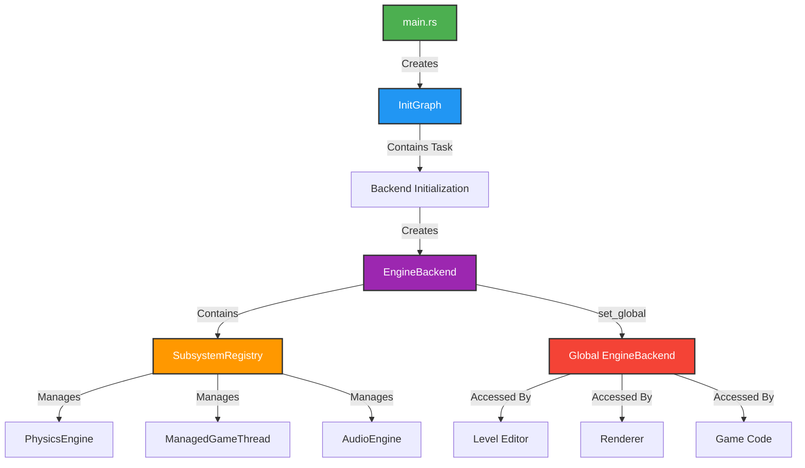
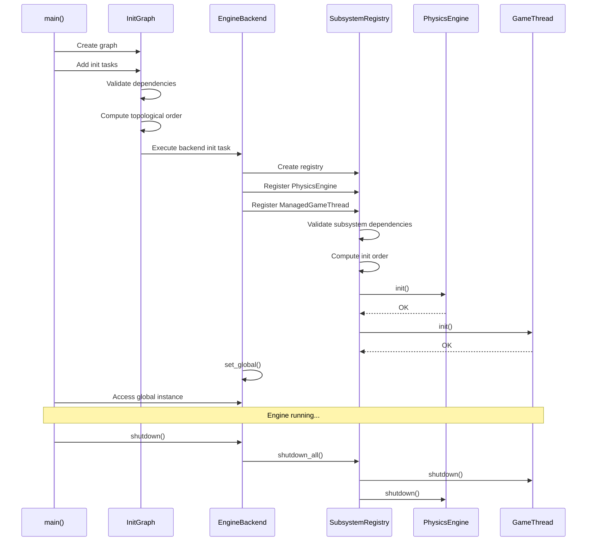

Pulsar's subsystem framework provides declarative, type-safe initialization and lifecycle management for major engine components. Instead of manually ordering initialization steps in a fragile procedural sequence, you declare dependencies explicitly. The engine validates the dependency graph, detects cycles, and executes subsystems in correct topological order automatically.

## The Problem With Procedural Initialization

Most game engines initialize subsystems through a long procedural sequence in `main()` or an equivalent entry point. This creates several fundamental problems. When you write fifteen sequential initialization calls, the dependencies between them are implicit—you must remember that Discord integration depends on the global context being set first, or that URI registration requires the async runtime to exist. As the codebase grows, these implicit contracts become documentation rot. New developers add initialization steps in the wrong place, causing subtle bugs that only manifest at startup.

The procedural approach makes testing nearly impossible. You cannot initialize just the physics subsystem for unit tests without also initializing rendering, audio, networking, and every other system that happens to come before it in the sequence. Extracting a subsystem for isolated testing requires manually recreating its initialization environment, duplicating logic that already exists in `main()`.

When a subsystem needs access to another subsystem at runtime, the procedural model offers no clean solution. Code ends up littered with global statics, thread-local storage, or complex dependency injection frameworks that add cognitive overhead. The engine becomes a maze of implicit coupling where changing one subsystem's initialization order breaks three others in non-obvious ways.

Pulsar solves these problems with a **subsystem framework** inspired by modern dependency injection and declarative initialization patterns. Each subsystem explicitly declares its dependencies. The framework validates that all dependencies exist, detects circular dependencies, and computes the correct initialization order automatically using topological sorting. Subsystems can be loaded centrally and accessed from anywhere in the codebase through type-safe APIs, eliminating global statics and manual coupling.

## Architecture Overview

The subsystem framework consists of four cooperating components. The **`Subsystem` trait** defines the interface every subsystem must implement, including dependency declarations and lifecycle hooks. **`SubsystemRegistry`** collects all subsystems and manages their initialization in dependency order. **`InitGraph`** handles overall engine initialization as a separate directed acyclic graph (DAG) that can include subsystem initialization as one task among many. Finally, **`EngineBackend`** serves as the global container for centrally loaded subsystems, providing type-safe access throughout the engine.



This architecture separates two concerns. **Engine initialization** (the `InitGraph`) handles the one-time setup required before the engine can run—creating the async runtime, loading settings, connecting to Discord. **Subsystem management** (the `SubsystemRegistry`) handles ongoing engine components that provide services throughout the program's lifetime—physics simulation, game logic threads, audio playback.

The distinction matters because engine initialization happens once and never repeats, while subsystems may need to be queried, paused, resumed, or shutdown independently. The `InitGraph` executes tasks in a specific order once, then discards itself. The `SubsystemRegistry` persists for the entire program lifetime, allowing runtime access to individual subsystems.



When the engine starts, `main()` creates an `InitGraph` and adds initialization tasks—logging, settings, runtime creation. One of these tasks initializes the `EngineBackend`, which creates a `SubsystemRegistry` and registers all subsystems. The registry validates dependencies, computes initialization order, and calls each subsystem's `init()` method. Once initialized, the backend registers itself globally so other parts of the engine can access subsystems without passing references through every function call.

## The Subsystem Trait

Every subsystem implements the `Subsystem` trait, which defines the complete lifecycle contract:

```rust
pub trait Subsystem: Send + Sync {
    /// Unique identifier for this subsystem
    fn id(&self) -> SubsystemId;

    /// Subsystems that must initialize before this one
    fn dependencies(&self) -> Vec<SubsystemId>;

    /// Initialize the subsystem (spawn threads, allocate resources, etc.)
    fn init(&mut self, context: &SubsystemContext) -> Result<(), SubsystemError>;

    /// Shutdown the subsystem (join threads, free resources, etc.)
    fn shutdown(&mut self) -> Result<(), SubsystemError>;

    /// Optional per-frame update (default: no-op)
    fn on_frame(&mut self, _delta_time: f32) {}
}
```

The trait enforces several critical guarantees. **`Send + Sync` bounds** ensure subsystems can be safely accessed from multiple threads, allowing the registry to be stored in a global static and shared across the engine. The **`id()` method** provides a stable identifier used for dependency resolution and lookups—IDs are typically string constants like `"physics"` or `"audio"`.

**Dependencies** must be declared explicitly in `dependencies()`. The registry validates that every dependency exists before initialization begins. If you declare a dependency that isn't registered, initialization fails immediately with a clear error message, preventing cryptic runtime failures.

The **`init()` method** receives a `SubsystemContext` containing shared resources like the Tokio runtime handle. Subsystems spawn threads, allocate GPU buffers, open network sockets—whatever initialization they need. The context ensures subsystems don't create redundant resources (like multiple Tokio runtimes) and provides a consistent environment across all subsystems.

The **`shutdown()` method** reverses initialization. Signal threads to stop, join thread handles, free large allocations, close network connections. The registry calls shutdown in reverse initialization order, ensuring dependencies remain valid throughout shutdown. If a subsystem fails to shutdown cleanly, the error is logged but shutdown continues for other subsystems.

The optional **`on_frame()` hook** allows subsystems to perform per-frame work. The main loop calls this method every frame, passing the time since the last frame. Most subsystems don't need this—they run independently on background threads. Use `on_frame()` only for subsystems that must synchronize with the main render loop.

> [!IMPORTANT]
> Subsystems must be **thread-safe**. The `Send + Sync` bounds are not optional. If your subsystem contains `Rc`, `RefCell`, or other non-thread-safe types, you must wrap them in `Arc<Mutex<>>` or use atomics.

## SubsystemRegistry - Dependency Resolution

The `SubsystemRegistry` manages subsystem lifecycle and dependency resolution. It collects subsystems, validates their dependencies, computes initialization order using **Kahn's algorithm** for topological sorting, and executes init/shutdown in the correct sequence.

```rust
pub struct SubsystemRegistry {
    subsystems: HashMap<SubsystemId, Box<dyn Subsystem>>,
    init_order: Vec<SubsystemId>,
    initialized: bool,
}
```

### Registering Subsystems

Create a registry, register subsystems using `register()`, then call `init_all()` to initialize everything:

```rust
use engine_backend::{SubsystemRegistry, SubsystemContext, PhysicsEngine, ManagedGameThread};

// Create registry
let mut registry = SubsystemRegistry::new();

// Register subsystems (order doesn't matter - dependencies determine init order)
registry.register(PhysicsEngine::new())
    .expect("Failed to register PhysicsEngine");

registry.register(ManagedGameThread::new(60.0)) // 60 TPS
    .expect("Failed to register GameThread");

// Create context with current Tokio runtime
let runtime_handle = tokio::runtime::Handle::current();
let context = SubsystemContext::new(runtime_handle);

// Initialize all subsystems in dependency order
registry.init_all(&context)
    .expect("Failed to initialize subsystems");
```

The registration order is irrelevant—the registry sorts subsystems by their declared dependencies. If GameThread declares no dependencies and PhysicsEngine depends on GameThread, the registry initializes GameThread first automatically.

### Dependency Validation

Before initialization, the registry validates the dependency graph:

1. **Existence check** - Every declared dependency must reference a registered subsystem
2. **Cycle detection** - No circular dependencies allowed
3. **Topological sort** - Compute a valid initialization order

If validation fails, `init_all()` returns an error describing the problem:

```rust
// Missing dependency error
Err(SubsystemError::MissingDependency {
    subsystem: "audio",
    dependency: "device_manager"  // Forgot to register DeviceManager!
})

// Cycle detection error
Err(SubsystemError::DependencyCycle {
    tasks: vec!["audio", "rendering", "audio"]  // Circular dependency!
})
```

These errors fail fast at initialization time, preventing subtle runtime bugs where subsystems try to access uninitialized dependencies.

### Topological Sorting

The registry uses **Kahn's algorithm** to compute initialization order. This classic algorithm works by:

1. Computing the **in-degree** of each node (how many dependencies point to it)
2. Starting with nodes that have in-degree 0 (no dependencies)
3. Removing processed nodes and decreasing in-degrees of their dependents
4. Repeating until all nodes are processed (or a cycle is detected)

```
Example dependency graph:

AudioEngine → DeviceManager
PhysicsEngine → (no dependencies)
GameThread → PhysicsEngine
Renderer → GameThread
Renderer → AudioEngine

Topological order: [PhysicsEngine, DeviceManager, AudioEngine, GameThread, Renderer]
or alternatively: [DeviceManager, PhysicsEngine, AudioEngine, GameThread, Renderer]
Both are valid - the algorithm guarantees dependencies are satisfied, not unique ordering.
```

The registry computes this order once during `init_all()` and stores it. Shutdown happens in exact reverse order, ensuring dependencies remain valid throughout the entire shutdown sequence.

> [!NOTE]
> Multiple valid topological orders may exist for a given dependency graph. The registry does not guarantee a specific order among subsystems with no dependency relationship. Only the dependency constraints are guaranteed.

## SubsystemContext - Shared Resources

The `SubsystemContext` provides access to shared engine resources that subsystems need during initialization:

```rust
pub struct SubsystemContext {
    /// Tokio async runtime handle (for spawning async tasks)
    pub runtime: tokio::runtime::Handle,

    /// Channel registry for inter-subsystem communication
    pub channels: Arc<ChannelRegistry>,
}
```

The context solves a common problem in subsystem initialization: how do subsystems access shared resources without creating them redundantly? If five subsystems need to spawn async tasks, they shouldn't create five Tokio runtimes. The context provides a **single runtime handle** that all subsystems share.

```rust
impl Subsystem for MySubsystem {
    fn init(&mut self, context: &SubsystemContext) -> Result<(), SubsystemError> {
        // Spawn async task on the shared runtime
        context.runtime.spawn(async move {
            loop {
                // Async work here
            }
        });

        Ok(())
    }
}
```

The **`ChannelRegistry`** provides typed inter-subsystem communication. Subsystems can register channels by name and retrieve them later without manual coupling:

```rust
// Subsystem A registers a channel
context.channels.register("physics_events", tx_channel);

// Subsystem B retrieves it (during init or runtime)
let tx: Arc<Sender<PhysicsEvent>> = context.channels
    .get("physics_events")
    .expect("Physics events channel not registered");
```

This pattern decouples subsystems while maintaining type safety. The channel registry uses `Arc<dyn Any>` internally, then downcasts to the correct type when retrieved. If the types don't match, you get a runtime panic with a clear message about type mismatch.

## InitGraph - Engine Initialization DAG

While `SubsystemRegistry` manages subsystems, **`InitGraph`** handles overall engine initialization. The graph models initialization as a directed acyclic graph (DAG) where each task declares dependencies. This is similar to subsystem dependencies, but operates at a coarser granularity—initializing the logging system, creating the Tokio runtime, loading settings, etc.

```rust
pub struct InitTask {
    id: TaskId,
    name: &'static str,
    dependencies: Vec<TaskId>,
    executor: Box<dyn FnOnce(&mut InitContext) -> Result<(), InitError>>,
}
```

Each task has an ID, dependencies, and an executor function. The graph validates dependencies, computes execution order, and runs tasks sequentially:

```rust
use crate::init::{InitGraph, InitTask, InitContext, task_ids::*};

// Create initialization graph
let mut graph = InitGraph::new();

// Task 1: Logging (no dependencies)
graph.add_task(InitTask::new(
    LOGGING,
    "Logging",
    vec![],
    Box::new(|ctx| {
        let log_guard = logging::init(ctx.launch_args.verbose);
        ctx.log_guard = Some(log_guard);
        Ok(())
    })
)).unwrap();

// Task 2: Runtime (depends on logging)
graph.add_task(InitTask::new(
    RUNTIME,
    "Async Runtime",
    vec![LOGGING],
    Box::new(|ctx| {
        let rt = runtime::create_runtime();
        ctx.runtime = Some(rt);
        Ok(())
    })
)).unwrap();

// Task 3: Backend (depends on runtime)
graph.add_task(InitTask::new(
    BACKEND,
    "Engine Backend",
    vec![RUNTIME],
    Box::new(|ctx| {
        let rt = ctx.runtime.as_ref().unwrap();
        let backend = rt.block_on(async {
            EngineBackend::init().await
        });

        let backend_arc = Arc::new(RwLock::new(backend));
        EngineBackend::set_global(backend_arc);
        Ok(())
    })
)).unwrap();

// Execute in dependency order
graph.execute(&mut init_ctx)?;
```

The `InitContext` is a mutable container for initialization results. Each task can read values set by previous tasks and write new values for later tasks. This provides a type-safe way to pass initialization state without global variables.

### Profiling Integration

Each `InitGraph` task is automatically profiled with a scope named `Engine::Init::{TaskName}`. This appears in the flamegraph under the main thread, showing exactly how long each initialization step took:

```
Main Thread:
├─ Engine::Init::Logging [═══] 2.1ms
├─ Engine::Init::Async Runtime [═════] 4.3ms
├─ Engine::Init::Engine Backend [═══════════] 12.7ms
│  └─ Subsystem::Physics::Init [════] 5.2ms
│  └─ Subsystem::Game::Init [══] 3.1ms
└─ Engine::Init::Discord [══] 2.8ms
```

This makes it trivial to identify slow initialization steps and optimize engine startup time.

> [!TIP]
> Use `InitGraph` for one-time engine initialization (logging, runtime, loading config). Use `SubsystemRegistry` for ongoing services (physics, audio, game threads). The backend initialization task creates and initializes the subsystem registry as one step in the overall init graph.

## ManagedGameThread Pattern

The `ManagedGameThread` demonstrates an important pattern for subsystems that need both **lifecycle management** (via the `Subsystem` trait) and **runtime control** (via direct method calls). The game thread must be started/stopped by the subsystem registry, but gameplay code needs to enable/disable it for Edit/Play mode toggling.

### The Problem

A naive implementation would make `GameThread` implement `Subsystem` directly:

```rust
pub struct GameThread {
    state: Arc<Mutex<GameState>>,
    enabled: Arc<AtomicBool>,
    // ...
}

impl Subsystem for GameThread {
    fn init(&mut self, ctx: &SubsystemContext) -> Result<(), SubsystemError> {
        // Spawn game thread...
    }
}
```

This works for initialization, but creates a problem: once registered in the `SubsystemRegistry`, the registry owns the `GameThread` (stored as `Box<dyn Subsystem>`). Code outside the registry can't access it to call `set_enabled()` or `toggle()` because it's hidden behind the trait object.

You might try making the registry expose a getter:

```rust
registry.get_subsystem::<GameThread>("game")?
```

But this requires downcasting `Box<dyn Subsystem>` back to `GameThread`, which is complex and type-unsafe. The better solution is a **wrapper pattern**.

### The Wrapper Solution

Create a `ManagedGameThread` wrapper that implements `Subsystem` while exposing access to the inner `Arc<GameThread>`:

```rust
pub struct ManagedGameThread {
    inner: Arc<GameThread>,
}

impl ManagedGameThread {
    pub fn new(target_tps: f32) -> Self {
        Self {
            inner: Arc::new(GameThread::new(target_tps)),
        }
    }

    /// Get reference to inner GameThread for runtime control
    pub fn game_thread(&self) -> &Arc<GameThread> {
        &self.inner
    }
}

impl Subsystem for ManagedGameThread {
    fn init(&mut self, ctx: &SubsystemContext) -> Result<(), SubsystemError> {
        // Clone Arc pointers for the thread
        let state = self.inner.state.clone();
        let enabled = self.inner.enabled.clone();

        // Spawn the game thread with cloned Arc references
        std::thread::spawn(move || {
            loop {
                if !enabled.load(Ordering::Relaxed) {
                    thread::sleep(Duration::from_millis(100));
                    continue;
                }

                // Game loop...
            }
        });

        Ok(())
    }

    fn shutdown(&mut self) -> Result<(), SubsystemError> {
        self.inner.enabled.store(false, Ordering::Relaxed);
        thread::sleep(Duration::from_millis(50));
        Ok(())
    }
}
```

Now the `EngineBackend` can capture a reference to the `Arc<GameThread>` before registering the `ManagedGameThread`:

```rust
let managed_game_thread = ManagedGameThread::new(60.0);
let game_thread_ref = managed_game_thread.game_thread().clone();

registry.register(managed_game_thread)?;

// Store the Arc for later access
self.game_thread = Some(game_thread_ref);
```

This pattern provides both lifecycle management (through `ManagedGameThread` implementing `Subsystem`) and runtime access (through the stored `Arc<GameThread>`).

### Using the Managed Subsystem

Code that needs runtime control accesses the game thread through `EngineBackend`:

```rust
// In the level editor, toggle Edit/Play mode
fn on_play_scene(&mut self) {
    if let Some(backend) = EngineBackend::global() {
        let backend_guard = backend.read();
        if let Some(game_thread) = backend_guard.game_thread() {
            game_thread.set_enabled(true);  // Start game simulation
        }
    }
}

fn on_stop_scene(&mut self) {
    if let Some(backend) = EngineBackend::global() {
        let backend_guard = backend.read();
        if let Some(game_thread) = backend_guard.game_thread() {
            game_thread.set_enabled(false);  // Stop game simulation
        }
    }
}
```

The wrapper pattern works because:
1. `ManagedGameThread` owns the `Arc<GameThread>`
2. `Arc` allows multiple owners, so we can clone it before registration
3. The cloned `Arc` lives in `EngineBackend`, accessible globally
4. The original `Arc` in `ManagedGameThread` is moved into the registry
5. Both references point to the same `GameThread` instance

> [!IMPORTANT]
> Use the wrapper pattern when a subsystem needs both registry management and runtime access from external code. Don't expose internal state directly—provide controlled access through methods.

## Central Subsystem Loading

Pulsar follows a **central loading pattern** where all subsystems register in one place (`EngineBackend::init()`) and are accessed globally. This prevents duplicate subsystem instances and provides a single source of truth for subsystem state.

### The Pattern

**Step 1**: Register all subsystems during backend initialization:

```rust
// crates/engine_backend/src/lib.rs
impl EngineBackend {
    pub async fn init() -> Self {
        let mut registry = SubsystemRegistry::new();

        // Register physics
        registry.register(PhysicsEngine::new())
            .expect("Failed to register PhysicsEngine");

        // Register game thread (with wrapper pattern)
        let managed_game_thread = ManagedGameThread::new(60.0);
        let game_thread_ref = managed_game_thread.game_thread().clone();

        registry.register(managed_game_thread)
            .expect("Failed to register GameThread");

        // Initialize all subsystems
        let runtime_handle = tokio::runtime::Handle::current();
        let context = SubsystemContext::new(runtime_handle);
        registry.init_all(&context)
            .expect("Failed to initialize subsystems");

        EngineBackend {
            subsystems: registry,
            game_thread: Some(game_thread_ref),
        }
    }

    /// Access the central GameThread instance
    pub fn game_thread(&self) -> Option<&Arc<GameThread>> {
        self.game_thread.as_ref()
    }
}
```

**Step 2**: Make the backend globally accessible:

```rust
use std::sync::OnceLock;

static GLOBAL_BACKEND: OnceLock<Arc<RwLock<EngineBackend>>> = OnceLock::new();

impl EngineBackend {
    /// Set as global instance
    pub fn set_global(backend: Arc<RwLock<Self>>) {
        GLOBAL_BACKEND.set(backend).ok();
    }

    /// Get global instance
    pub fn global() -> Option<&'static Arc<RwLock<EngineBackend>>> {
        GLOBAL_BACKEND.get()
    }
}
```

**Step 3**: Set the backend as global during engine initialization:

```rust
// In crates/engine/src/main.rs
graph.add_task(InitTask::new(
    BACKEND,
    "Engine Backend",
    vec![RUNTIME],
    Box::new(|ctx| {
        let rt = ctx.runtime.as_ref().unwrap();
        let backend = rt.block_on(async {
            EngineBackend::init().await
        });

        let backend_arc = Arc::new(RwLock::new(backend));
        EngineBackend::set_global(backend_arc);

        Ok(())
    })
)).unwrap();
```

**Step 4**: Access subsystems from anywhere in the engine:

```rust
// In the level editor viewport
let game_thread = if let Some(backend) = EngineBackend::global() {
    let backend_guard = backend.read();
    backend_guard.game_thread()
        .expect("GameThread not initialized")
        .clone()
} else {
    panic!("EngineBackend not initialized!");
};

// Now use the game thread
game_thread.set_enabled(false); // Edit mode
```

### Benefits of Central Loading

**No Duplicate Instances** - Each subsystem exists exactly once. The level editor doesn't create its own physics engine or game thread—it uses the central instances.

**Global Access Without Globals** - Subsystems are accessed through `EngineBackend::global()`, not raw `static mut` variables. The backend is protected by `RwLock`, providing thread-safe access.

**Lifetime Guarantees** - The backend lives for the entire program lifetime (stored in a `OnceLock`). References to subsystems are always valid after initialization.

**Testability** - Tests can create a temporary `EngineBackend`, initialize specific subsystems, and shut it down cleanly without affecting global state.

**Shutdown Ordering** - When the engine exits, calling `backend.shutdown()` gracefully shuts down all subsystems in reverse initialization order.

> [!WARNING]
> Never create duplicate subsystem instances. If you need a subsystem, access it through `EngineBackend::global()`. Creating separate instances defeats the purpose of central loading and can cause subtle bugs (like multiple game threads competing for resources).

## Creating Your Own Subsystem

Implementing a custom subsystem follows a straightforward pattern. This example creates an audio subsystem with background asset streaming:

### Step 1: Define the Subsystem Structure

```rust
use std::sync::{Arc, Mutex};
use std::sync::atomic::{AtomicBool, Ordering};
use engine_backend::subsystems::framework::{
    Subsystem, SubsystemId, SubsystemContext, SubsystemError
};

pub struct AudioEngine {
    // Audio device handle
    device: Arc<Mutex<AudioDevice>>,

    // Background thread for streaming
    thread_handle: Option<std::thread::JoinHandle<()>>,

    // Enabled flag (for pausing audio)
    enabled: Arc<AtomicBool>,

    // Sample rate
    sample_rate: u32,
}
```

Use `Arc<Mutex<>>` for shared mutable state that needs thread-safe access. Use `Arc<AtomicBool>` for simple flags. Store thread handles as `Option` so you can `take()` them during shutdown.

### Step 2: Implement the Subsystem Trait

```rust
// Define a unique ID constant
pub const AUDIO_SUBSYSTEM_ID: SubsystemId = SubsystemId::new("audio");

impl Subsystem for AudioEngine {
    fn id(&self) -> SubsystemId {
        AUDIO_SUBSYSTEM_ID
    }

    fn dependencies(&self) -> Vec<SubsystemId> {
        // Audio might depend on a device manager subsystem
        vec![subsystem_ids::DEVICE_MANAGER]
    }

    fn init(&mut self, context: &SubsystemContext) -> Result<(), SubsystemError> {
        profiling::profile_scope!("Subsystem::Audio::Init");

        tracing::debug!("Initializing audio subsystem...");

        // Clone Arc references for the background thread
        let device = self.device.clone();
        let enabled = self.enabled.clone();
        let sample_rate = self.sample_rate;

        // Spawn audio processing thread
        let handle = std::thread::Builder::new()
            .name("Audio Mixer".to_string())
            .spawn(move || {
                profiling::set_thread_name("Audio Mixer");

                let mut buffer = vec![0.0f32; 512];

                loop {
                    profiling::profile_scope!("Audio::MixBuffer");

                    if !enabled.load(Ordering::Relaxed) {
                        std::thread::sleep(std::time::Duration::from_millis(10));
                        continue;
                    }

                    // Mix audio samples
                    if let Ok(mut dev) = device.try_lock() {
                        dev.process_samples(&mut buffer);
                    }

                    // Sleep to maintain sample rate
                    let sleep_time = std::time::Duration::from_secs_f32(
                        buffer.len() as f32 / sample_rate as f32
                    );
                    std::thread::sleep(sleep_time);
                }
            })
            .map_err(|e| SubsystemError::InitFailed(
                format!("Failed to spawn audio thread: {}", e)
            ))?;

        self.thread_handle = Some(handle);

        tracing::info!("✓ Audio subsystem initialized at {} Hz", sample_rate);
        Ok(())
    }

    fn shutdown(&mut self) -> Result<(), SubsystemError> {
        profiling::profile_scope!("Subsystem::Audio::Shutdown");

        tracing::debug!("Shutting down audio subsystem...");

        // Signal thread to stop
        self.enabled.store(false, Ordering::Relaxed);

        // Join the thread (with timeout to avoid hanging)
        if let Some(handle) = self.thread_handle.take() {
            std::thread::sleep(std::time::Duration::from_millis(50));
            handle.join().map_err(|_| {
                SubsystemError::ShutdownFailed(
                    "Audio thread panicked during shutdown".to_string()
                )
            })?;
        }

        tracing::info!("✓ Audio subsystem stopped");
        Ok(())
    }
}
```

### Step 3: Add Constructor and Public API

```rust
impl AudioEngine {
    pub fn new(sample_rate: u32) -> Self {
        Self {
            device: Arc::new(Mutex::new(AudioDevice::new(sample_rate))),
            thread_handle: None,
            enabled: Arc::new(AtomicBool::new(true)),
            sample_rate,
        }
    }

    /// Play a sound effect
    pub fn play_sound(&self, sound: Sound) {
        if let Ok(mut device) = self.device.try_lock() {
            device.submit_sound(sound);
        }
    }

    /// Set master volume
    pub fn set_volume(&self, volume: f32) {
        if let Ok(mut device) = self.device.lock() {
            device.set_master_volume(volume);
        }
    }

    /// Enable/disable audio processing
    pub fn set_enabled(&self, enabled: bool) {
        self.enabled.store(enabled, Ordering::Relaxed);
    }
}
```

### Step 4: Register in EngineBackend

```rust
// In crates/engine_backend/src/lib.rs
impl EngineBackend {
    pub async fn init() -> Self {
        let mut registry = SubsystemRegistry::new();

        // Register device manager first (audio depends on it)
        registry.register(DeviceManager::new())
            .expect("Failed to register DeviceManager");

        // Register audio subsystem
        registry.register(AudioEngine::new(48000)) // 48kHz
            .expect("Failed to register AudioEngine");

        // ... other subsystems

        // Initialize all
        let context = SubsystemContext::new(tokio::runtime::Handle::current());
        registry.init_all(&context)?;

        EngineBackend { subsystems: registry }
    }
}
```

The registry automatically initializes `DeviceManager` before `AudioEngine` because of the declared dependency. If you forget to register `DeviceManager`, initialization fails with a clear error message.

### Step 5: Access from Application Code

```rust
// Access audio globally (if needed for direct control)
if let Some(backend) = EngineBackend::global() {
    let backend_guard = backend.read();
    if let Some(audio) = backend_guard.audio_engine() {
        audio.play_sound(explosion_sound);
    }
}
```

Or use the wrapper pattern (like `ManagedGameThread`) if you need both registry management and runtime access.

> [!NOTE]
> Always add `profiling::profile_scope!()` calls in `init()` and `shutdown()` methods. This makes it easy to identify slow subsystem initialization in the flamegraph.

## Best Practices

### Dependency Declaration

Declare dependencies conservatively. Only list subsystems that **must** be initialized before yours. Over-declaring dependencies constrains initialization order unnecessarily and can create false cycles.

```rust
// GOOD - Only declares actual dependencies
impl Subsystem for Renderer {
    fn dependencies(&self) -> Vec<SubsystemId> {
        vec![subsystem_ids::DEVICE_MANAGER]  // Renderer needs GPU device
    }
}

// BAD - Declares unnecessary dependencies
impl Subsystem for Renderer {
    fn dependencies(&self) -> Vec<SubsystemId> {
        vec![
            subsystem_ids::DEVICE_MANAGER,
            subsystem_ids::AUDIO,      // Renderer doesn't use audio!
            subsystem_ids::PHYSICS,    // Renderer doesn't use physics!
        ]
    }
}
```

If subsystem A uses subsystem B at runtime but doesn't need B to exist during A's initialization, don't declare it as a dependency. Use the backend's global access pattern instead:

```rust
impl AudioEngine {
    pub fn play_spatial_sound(&self, sound: Sound, position: Vec3) {
        // Query physics at runtime, not during init
        if let Some(backend) = EngineBackend::global() {
            let backend_guard = backend.read();
            if let Some(physics) = backend_guard.physics_engine() {
                let listener_pos = physics.get_listener_position();
                let distance = (position - listener_pos).length();
                let volume = calculate_volume(distance);
                self.play_sound_with_volume(sound, volume);
            }
        }
    }
}
```

### Thread Management

When spawning threads in `init()`, always:

1. **Name the thread** using `std::thread::Builder::new().name()`
2. **Set the profiler thread name** with `profiling::set_thread_name()`
3. **Store the JoinHandle** for clean shutdown
4. **Join threads in `shutdown()`** to avoid resource leaks

```rust
fn init(&mut self, context: &SubsystemContext) -> Result<(), SubsystemError> {
    let handle = std::thread::Builder::new()
        .name("Subsystem Thread".to_string())  // OS thread name
        .spawn(move || {
            profiling::set_thread_name("Subsystem Thread");  // Profiler name

            // Thread work...
        })
        .map_err(|e| SubsystemError::InitFailed(e.to_string()))?;

    self.thread_handle = Some(handle);
    Ok(())
}

fn shutdown(&mut self) -> Result<(), SubsystemError> {
    if let Some(handle) = self.thread_handle.take() {
        handle.join().map_err(|_| {
            SubsystemError::ShutdownFailed("Thread panicked".to_string())
        })?;
    }
    Ok(())
}
```

For async tasks, spawn them on the provided Tokio runtime using `context.runtime.spawn()`. Store the `JoinHandle` and cancel tasks in `shutdown()` using `handle.abort()`.

### Error Handling

Return descriptive errors from `init()` and `shutdown()`. The subsystem framework logs these errors with context about which subsystem failed:

```rust
fn init(&mut self, context: &SubsystemContext) -> Result<(), SubsystemError> {
    let device = AudioDevice::open()
        .map_err(|e| SubsystemError::InitFailed(
            format!("Failed to open audio device: {}", e)
        ))?;

    self.device = Some(device);
    Ok(())
}
```

Never panic in `init()` or `shutdown()`. Use `Result` to propagate errors gracefully. The framework will log the error and allow other subsystems to continue shutdown.

### Avoid Global State

Don't use raw `static mut` or `lazy_static!` for subsystem state. Use the subsystem framework's central loading pattern instead. This ensures proper initialization order, thread safety, and clean shutdown.

```rust
// BAD - Global mutable state
static mut AUDIO_ENGINE: Option<AudioEngine> = None;

pub fn get_audio() -> &'static mut AudioEngine {
    unsafe { AUDIO_ENGINE.as_mut().unwrap() }
}

// GOOD - Access through EngineBackend
pub fn get_audio() -> Option<Arc<AudioEngine>> {
    EngineBackend::global()
        .and_then(|b| b.read().audio_engine().cloned())
}
```

The backend pattern provides thread-safe access, clear lifetimes, and automatic cleanup.

## Migrating Existing Code

Migrating from procedural initialization to the subsystem framework follows a predictable pattern:

### Step 1: Identify the Subsystem

Find code that performs initialization, runs continuously, and needs shutdown. Common candidates:
- Background threads
- Network services
- Asset loaders
- Physics simulation
- Audio playback

### Step 2: Extract Initialization Logic

Take the code that currently runs in `main()` or a setup function and move it into an `init()` method:

```rust
// BEFORE - In main()
let physics_pipeline = PhysicsPipeline::new();
let physics_state = PhysicsState::new();
let gravity = vector![0.0, -9.81, 0.0];

std::thread::spawn(move || {
    loop {
        physics_pipeline.step(&mut physics_state, &gravity);
    }
});

// AFTER - In PhysicsEngine::init()
impl Subsystem for PhysicsEngine {
    fn init(&mut self, context: &SubsystemContext) -> Result<(), SubsystemError> {
        let pipeline = self.physics_pipeline.clone();
        let state = self.physics_state.clone();
        let gravity = self.gravity;

        let handle = std::thread::spawn(move || {
            loop {
                let mut pipeline_guard = pipeline.lock().unwrap();
                let mut state_guard = state.lock().unwrap();
                pipeline_guard.step(&mut *state_guard, &gravity);
            }
        });

        self.thread_handle = Some(handle);
        Ok(())
    }
}
```

### Step 3: Add Shutdown Logic

If the old code doesn't have explicit shutdown, add it:

```rust
impl Subsystem for PhysicsEngine {
    fn shutdown(&mut self) -> Result<(), SubsystemError> {
        // Signal thread to stop
        self.enabled.store(false, Ordering::Relaxed);

        // Join thread
        if let Some(handle) = self.thread_handle.take() {
            handle.join().map_err(|_| {
                SubsystemError::ShutdownFailed("Physics thread panicked".to_string())
            })?;
        }

        Ok(())
    }
}
```

### Step 4: Remove Old Initialization Code

Delete the procedural initialization from `main()` and register the subsystem instead:

```rust
// Remove this from main()
// let physics = init_physics();

// Add this to EngineBackend::init()
registry.register(PhysicsEngine::new())?;
```

### Step 5: Update Access Patterns

Find code that accessed the subsystem directly and update it to use the global backend:

```rust
// BEFORE
physics.apply_force(entity, force);

// AFTER
if let Some(backend) = EngineBackend::global() {
    let backend_guard = backend.read();
    if let Some(physics) = backend_guard.physics_engine() {
        physics.apply_force(entity, force);
    }
}
```

Or use the wrapper pattern if the subsystem needs frequent access from external code.

## Common Patterns

### Subsystem Communication

Subsystems should communicate through well-defined channels, not by directly calling each other's methods. Use the `ChannelRegistry` in `SubsystemContext`:

```rust
// Physics subsystem registers a channel during init
impl Subsystem for PhysicsEngine {
    fn init(&mut self, context: &SubsystemContext) -> Result<(), SubsystemError> {
        let (tx, rx) = mpsc::channel();
        context.channels.register("physics_events", tx);

        // Physics sends events to the channel
        // ...

        Ok(())
    }
}

// Audio subsystem listens for physics events
impl Subsystem for AudioEngine {
    fn init(&mut self, context: &SubsystemContext) -> Result<(), SubsystemError> {
        let rx: Arc<Receiver<PhysicsEvent>> = context.channels
            .get("physics_events")
            .expect("Physics events channel not found");

        // Audio receives and responds to physics events
        // ...

        Ok(())
    }
}
```

This decouples subsystems while maintaining typed communication.

### Conditional Subsystems

Some subsystems should only initialize under certain conditions (debug builds, specific platforms, feature flags). Handle this in the registration code:

```rust
impl EngineBackend {
    pub async fn init() -> Self {
        let mut registry = SubsystemRegistry::new();

        // Always register core subsystems
        registry.register(PhysicsEngine::new())?;

        // Conditionally register debug subsystems
        #[cfg(feature = "profiler")]
        registry.register(ProfilerService::new())?;

        #[cfg(target_os = "windows")]
        registry.register(WindowsPlatformService::new())?;

        // Initialize all registered subsystems
        registry.init_all(&context)?;

        EngineBackend { subsystems: registry }
    }
}
```

The registry handles whatever subsystems are registered, regardless of build configuration.

### Subsystem-Specific Configuration

Pass configuration to subsystems through their constructors, not through global config files:

```rust
// Load configuration in EngineBackend::init()
let config = EngineConfig::load()?;

// Pass relevant config to each subsystem
registry.register(PhysicsEngine::new(config.physics.gravity))?;
registry.register(AudioEngine::new(config.audio.sample_rate))?;
registry.register(NetworkEngine::new(config.network.server_url))?;
```

This makes subsystem dependencies explicit and improves testability.

## Debugging

### Subsystem Not Initializing

If a subsystem doesn't appear to initialize:

1. Check the logs for initialization order: `Subsystem initialization order: [physics, audio, game]`
2. Verify the subsystem is registered in `EngineBackend::init()`
3. Check that all dependencies are also registered
4. Look for `SubsystemError` messages in the logs

### Dependency Cycles

If you see `SubsystemError::DependencyCycle`, the registry detected circular dependencies:

```
Error: Dependency cycle detected involving: ["audio", "renderer", "audio"]
```

This means audio depends on renderer, renderer depends on audio. Fix by removing one dependency or introducing an intermediate subsystem.

### Missing Dependencies

If you see `SubsystemError::MissingDependency`, a subsystem declared a dependency that isn't registered:

```
Error: Missing dependency: "device_manager" required by "audio"
```

Register the missing subsystem or remove the dependency declaration if it's not actually needed.

### Shutdown Hangs

If shutdown hangs, a subsystem's `shutdown()` method is blocking:

1. Check logs to see which subsystem is currently shutting down
2. Verify thread joins have timeouts or the threads check shutdown flags
3. Ensure async tasks are aborted, not awaited indefinitely

Add timeouts to thread joins:

```rust
fn shutdown(&mut self) -> Result<(), SubsystemError> {
    self.enabled.store(false, Ordering::Relaxed);

    if let Some(handle) = self.thread_handle.take() {
        // Give the thread 100ms to exit gracefully
        std::thread::sleep(Duration::from_millis(100));

        // Check if thread finished
        if !handle.is_finished() {
            tracing::warn!("Subsystem thread did not exit gracefully, abandoning");
            return Ok(()); // Don't hang shutdown
        }

        handle.join().ok(); // Ignore join errors
    }

    Ok(())
}
```

## Future Enhancements

The subsystem framework will continue to evolve:

**Hot Reload** - Reload subsystems provided by DLLs without restarting the engine. The registry will call `shutdown()`, unload the DLL, load the new version, and call `init()` again.

**Per-Frame Updates** - The `on_frame()` hook will integrate with the main loop, allowing subsystems to synchronize with rendering without managing their own timing.

**Subsystem Stats** - The registry will track initialization time, shutdown time, and memory usage per subsystem, displayable in a debug panel.

**Dependency Visualization** - Generate a graphviz diagram showing the subsystem dependency graph automatically from the registry.

## Summary

The subsystem framework transforms engine initialization from fragile procedural code into a declarative, validated, dependency-driven system. By implementing the `Subsystem` trait, your code gains automatic dependency resolution, clean shutdown, profiling integration, and global accessibility. The `SubsystemRegistry` validates dependencies and computes initialization order using topological sorting, preventing initialization bugs before the engine even starts.

When creating subsystems, declare dependencies explicitly, use thread-safe types, implement clean shutdown, and integrate profiling. Use the wrapper pattern when subsystems need both lifecycle management and runtime control. Follow the central loading pattern to prevent duplicate instances and provide global access through `EngineBackend`.

The framework makes the engine's initialization order explicit, testable, and maintainable. New developers can understand exactly what initializes when and why. Adding new subsystems is straightforward—implement the trait, register in the backend, done. The engine validates your dependencies and initialization order automatically, catching bugs at startup instead of hours into a playtest session.
